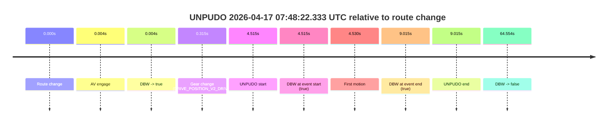
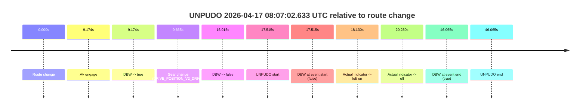

# Run Report: fme20007/2026-04-17--07-44-34--gen2-av-542c5b31-4036-4bf1-bf4a-01760dfa18af

| Field | Value |
|---|---|
| Run ID | `fme20007/2026-04-17--07-44-34--gen2-av-542c5b31-4036-4bf1-bf4a-01760dfa18af` |
| Date | `2026-04-17` |
| Model(s) | `eel-teal-outspoken` |
| Author | `zak` |
| Event count | `2` |

## unpudo 2026-04-17 07:48:22.333 UTC

| Field | Value |
|---|---|
| Model | `eel-teal-outspoken` |
| Author | `zak` |
| Run ID | `fme20007/2026-04-17--07-44-34--gen2-av-542c5b31-4036-4bf1-bf4a-01760dfa18af` |
| Date | `2026-04-17` |
| Time (UTC) | `07:48:22.333` |
| Event type | `unpudo` |
| Disengagement type | `none observed` |
| Route change | `found` |
| Console | [run](https://console.sso.wayve.ai/run/fme20007/2026-04-17--07-44-34--gen2-av-542c5b31-4036-4bf1-bf4a-01760dfa18af?id=&time-unixus=1776412102333293) |
| Foxglove | [segment](https://app.foxglove.dev/wayve-on-prem/p/prj_0dX18KZdVHg1fmmI/view?ds=foxglove-stream&ds.deviceName=fme20007&ds.start=2026-04-17T07%3A48%3A07.818300Z&ds.end=2026-04-17T07%3A49%3A32.372526Z&layoutId=lay_0e7VD4WIKDQGU73Y&time=2026-04-17T07%3A48%3A22.333293Z) |

### Event card: pass

- Pass: AV owns the credited unpudo from route change through the official unpudo window, the gear state is aligned at the anchor, and the vehicle moves without driver accelerator help in AV.

| Event | Time (UTC) | Delta from route change |
|---|---:|---:|
| Route change | 2026-04-17 07:48:17.818 | `0.000s` |
| AV engage | 2026-04-17 07:48:17.822 | `0.004s` |
| DBW -> true | 2026-04-17 07:48:17.822 | `0.004s` |
| Gear change (DRIVE_POSITION_V2_DRIVE) | 2026-04-17 07:48:18.133 | `0.315s` |
| UNPUDO start | 2026-04-17 07:48:22.333 | `4.515s` |
| DBW at event start (true) | 2026-04-17 07:48:22.333 | `4.515s` |
| First motion | 2026-04-17 07:48:22.348 | `4.530s` |
| DBW at event end (true) | 2026-04-17 07:48:26.833 | `9.015s` |
| UNPUDO end | 2026-04-17 07:48:26.833 | `9.015s` |
| DBW -> false | 2026-04-17 07:49:22.372 | `64.554s` |

| Metric | Value |
|---|---|
| Outcome | `pass` |
| Effective failure type | `none` |
| Route change status | `found` |
| DBW at event start | `true` |
| DBW at event end | `true` |
| Predicted gear at AV start | `DRIVE_POSITION_V2_PARK` |
| Actual gear at AV start | `DRIVE_POSITION_V2_PARK` |
| Predicted gear at event start | `DRIVE_POSITION_V2_DRIVE` |
| Actual gear at event start | `DRIVE_POSITION_V2_DRIVE` |
| Planned indicator direction | `INDICATORS_STATE_V2_RIGHT_ON` |
| Controller indicator direction | `INDICATORS_STATE_V2_RIGHT_ON` |
| Actual indicator direction | `INDICATORS_STATE_V2_OFF` |
| Actual indicator at maneuver end | `INDICATORS_STATE_V2_OFF` |
| Driver accel help in AV | `false` |
| Driver accel help timestamp | `n/a` |
| Max accel pedal pct in AV | `0.0%` |
| Max brake pedal pct in AV | `9.9%` |
| Max speed mps in AV | `4.175` |
| Success timing baseline | `route change` |
| Route -> AV | `0.004s` |
| AV -> event start | `4.511s` |
| AV -> first motion | `4.526s` |
| Success baseline -> event start | `4.515s` |
| Success baseline -> first motion | `4.530s` |
| AV duration before disengagement | `64.550s` |
| Trajectory waypoint count | `38` |
| Driving-plan step count | `11` |

The scored portion starts from the AV-owned window, not from the pre-AV setup. Route-change search in the stopped pre-event segment was `found`, with the baseline therefore set to route change. At the event anchor the model predicts `DRIVE_POSITION_V2_DRIVE` and the actual gear is `DRIVE_POSITION_V2_DRIVE`. The effective model outcome is `pass` because `the credited unpudo stays AV-owned through the official unpudo window.`

### Resolution

| Field | Value |
|---|---|
| Final outcome | `pass` |
| Do we agree with this label? | `yes` |
| Source disengagement type | `none observed` |
| Resolved effective failure type | `none` |
| Confidence | `high` |

## unpudo 2026-04-17 08:07:02.633 UTC

| Field | Value |
|---|---|
| Model | `eel-teal-outspoken` |
| Author | `zak` |
| Run ID | `fme20007/2026-04-17--07-44-34--gen2-av-542c5b31-4036-4bf1-bf4a-01760dfa18af` |
| Date | `2026-04-17` |
| Time (UTC) | `08:07:02.633` |
| Event type | `unpudo` |
| Disengagement type | `failed_to_unpudo` |
| Route change | `found` |
| Console | [run](https://console.sso.wayve.ai/run/fme20007/2026-04-17--07-44-34--gen2-av-542c5b31-4036-4bf1-bf4a-01760dfa18af?id=&time-unixus=1776413222633314) |
| Foxglove | [segment](https://app.foxglove.dev/wayve-on-prem/p/prj_0dX18KZdVHg1fmmI/view?ds=foxglove-stream&ds.deviceName=fme20007&ds.start=2026-04-17T08%3A06%3A35.118266Z&ds.end=2026-04-17T08%3A07%3A41.183296Z&layoutId=lay_0e7VD4WIKDQGU73Y&time=2026-04-17T08%3A07%3A02.633314Z) |

### Event card: fail

- Fail: AV owns part of the segment, but the event still resolves as a model-performance failure under the AV-only scoring rule.

| Event | Time (UTC) | Delta from route change |
|---|---:|---:|
| Route change | 2026-04-17 08:06:45.118 | `0.000s` |
| AV engage | 2026-04-17 08:06:54.292 | `9.174s` |
| DBW -> true | 2026-04-17 08:06:54.292 | `9.174s` |
| Gear change (DRIVE_POSITION_V2_DRIVE) | 2026-04-17 08:06:54.783 | `9.665s` |
| DBW -> false | 2026-04-17 08:07:02.033 | `16.915s` |
| UNPUDO start | 2026-04-17 08:07:02.633 | `17.515s` |
| DBW at event start (false) | 2026-04-17 08:07:02.633 | `17.515s` |
| Actual indicator -> left on | 2026-04-17 08:07:03.248 | `18.130s` |
| Actual indicator -> off | 2026-04-17 08:07:05.348 | `20.230s` |
| DBW at event end (true) | 2026-04-17 08:07:31.183 | `46.065s` |
| UNPUDO end | 2026-04-17 08:07:31.183 | `46.065s` |

| Metric | Value |
|---|---|
| Outcome | `fail` |
| Effective failure type | `failed_to_unpudo` |
| Route change status | `found` |
| DBW at event start | `false` |
| DBW at event end | `true` |
| Predicted gear at AV start | `DRIVE_POSITION_V2_DRIVE` |
| Actual gear at AV start | `DRIVE_POSITION_V2_PARK` |
| Predicted gear at event start | `DRIVE_POSITION_V2_DRIVE` |
| Actual gear at event start | `DRIVE_POSITION_V2_DRIVE` |
| Planned indicator direction | `INDICATORS_STATE_V2_LEFT_ON` |
| Controller indicator direction | `INDICATORS_STATE_V2_LEFT_ON` |
| Actual indicator direction | `INDICATORS_STATE_V2_OFF` |
| Actual indicator at maneuver end | `INDICATORS_STATE_V2_OFF` |
| Driver accel help in AV | `false` |
| Driver accel help timestamp | `n/a` |
| Max accel pedal pct in AV | `0.0%` |
| Max brake pedal pct in AV | `8.0%` |
| Max speed mps in AV | `0.000` |
| Success timing baseline | `route change` |
| Route -> AV | `9.174s` |
| AV -> event start | `8.341s` |
| AV -> first motion | `n/a` |
| Success baseline -> event start | `17.515s` |
| Success baseline -> first motion | `n/a` |
| AV duration before disengagement | `7.741s` |
| Trajectory waypoint count | `38` |
| Driving-plan step count | `11` |

The scored portion starts from the AV-owned window, not from the pre-AV setup. Route-change search in the stopped pre-event segment was `found`, with the baseline therefore set to route change. At the event anchor the model predicts `DRIVE_POSITION_V2_DRIVE` and the actual gear is `DRIVE_POSITION_V2_DRIVE`. The effective model outcome is `fail` because `failed_to_unpudo.`

### Resolution

| Field | Value |
|---|---|
| Final outcome | `fail` |
| Do we agree with this label? | `yes` |
| Source disengagement type | `failed_to_unpudo` |
| Resolved effective failure type | `failed_to_unpudo` |
| Confidence | `high` |
