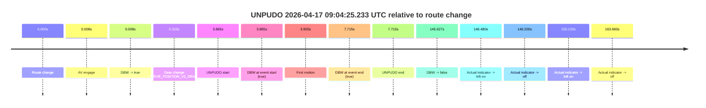
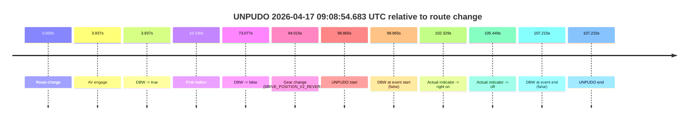
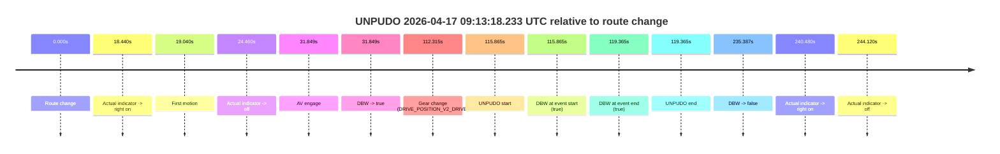
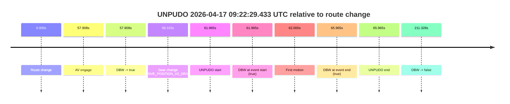
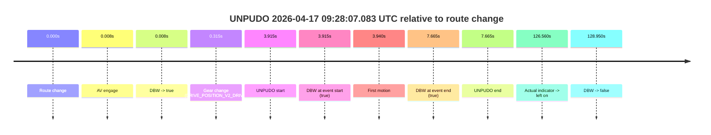
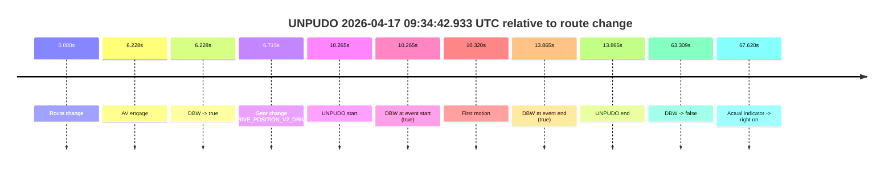
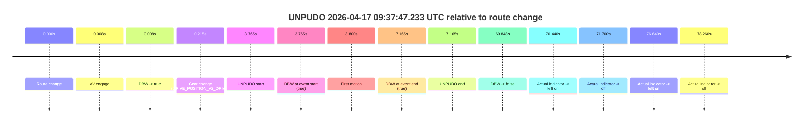

# Run Report: fme20007/2026-04-17--09-01-01--gen2-av-587bec1e-f609-4d72-8424-c03bf4128335

| Field | Value |
|---|---|
| Run ID | `fme20007/2026-04-17--09-01-01--gen2-av-587bec1e-f609-4d72-8424-c03bf4128335` |
| Date | `2026-04-17` |
| Model(s) | `eel-teal-outspoken` |
| Author | `zak` |
| Event count | `8` |

## unpudo 2026-04-17 09:04:25.233 UTC

| Field | Value |
|---|---|
| Model | `eel-teal-outspoken` |
| Author | `zak` |
| Run ID | `fme20007/2026-04-17--09-01-01--gen2-av-587bec1e-f609-4d72-8424-c03bf4128335` |
| Date | `2026-04-17` |
| Time (UTC) | `09:04:25.233` |
| Event type | `unpudo` |
| Disengagement type | `none observed` |
| Route change | `found` |
| Console | [run](https://console.sso.wayve.ai/run/fme20007/2026-04-17--09-01-01--gen2-av-587bec1e-f609-4d72-8424-c03bf4128335?id=&time-unixus=1776416665233309) |
| Foxglove | [segment](https://app.foxglove.dev/wayve-on-prem/p/prj_0dX18KZdVHg1fmmI/view?ds=foxglove-stream&ds.deviceName=fme20007&ds.start=2026-04-17T09%3A04%3A11.368468Z&ds.end=2026-04-17T09%3A06%3A56.995880Z&layoutId=lay_0e7VD4WIKDQGU73Y&time=2026-04-17T09%3A04%3A25.233309Z) |

### Event card: pass

- Pass: AV owns the credited unpudo from route change through the official unpudo window, the gear state is aligned at the anchor, and the vehicle moves without driver accelerator help in AV.

| Event | Time (UTC) | Delta from route change |
|---|---:|---:|
| Route change | 2026-04-17 09:04:21.368 | `0.000s` |
| AV engage | 2026-04-17 09:04:21.376 | `0.008s` |
| DBW -> true | 2026-04-17 09:04:21.376 | `0.008s` |
| Gear change (DRIVE_POSITION_V2_DRIVE) | 2026-04-17 09:04:21.683 | `0.315s` |
| UNPUDO start | 2026-04-17 09:04:25.233 | `3.865s` |
| DBW at event start (true) | 2026-04-17 09:04:25.233 | `3.865s` |
| First motion | 2026-04-17 09:04:25.288 | `3.920s` |
| DBW at event end (true) | 2026-04-17 09:04:29.083 | `7.715s` |
| UNPUDO end | 2026-04-17 09:04:29.083 | `7.715s` |
| DBW -> false | 2026-04-17 09:06:46.995 | `145.627s` |
| Actual indicator -> left on | 2026-04-17 09:06:47.848 | `146.480s` |
| Actual indicator -> off | 2026-04-17 09:06:49.568 | `148.200s` |
| Actual indicator -> left on | 2026-04-17 09:06:56.488 | `155.120s` |
| Actual indicator -> off | 2026-04-17 09:07:05.028 | `163.660s` |

| Metric | Value |
|---|---|
| Outcome | `pass` |
| Effective failure type | `none` |
| Route change status | `found` |
| DBW at event start | `true` |
| DBW at event end | `true` |
| Predicted gear at AV start | `DRIVE_POSITION_V2_PARK` |
| Actual gear at AV start | `DRIVE_POSITION_V2_PARK` |
| Predicted gear at event start | `DRIVE_POSITION_V2_DRIVE` |
| Actual gear at event start | `DRIVE_POSITION_V2_DRIVE` |
| Planned indicator direction | `INDICATORS_STATE_V2_RIGHT_ON` |
| Controller indicator direction | `INDICATORS_STATE_V2_RIGHT_ON` |
| Actual indicator direction | `INDICATORS_STATE_V2_OFF` |
| Actual indicator at maneuver end | `INDICATORS_STATE_V2_OFF` |
| Driver accel help in AV | `false` |
| Driver accel help timestamp | `n/a` |
| Max accel pedal pct in AV | `0.0%` |
| Max brake pedal pct in AV | `8.0%` |
| Max speed mps in AV | `3.872` |
| Success timing baseline | `route change` |
| Route -> AV | `0.008s` |
| AV -> event start | `3.857s` |
| AV -> first motion | `3.912s` |
| Success baseline -> event start | `3.865s` |
| Success baseline -> first motion | `3.920s` |
| AV duration before disengagement | `145.620s` |
| Trajectory waypoint count | `37` |
| Driving-plan step count | `11` |

The scored portion starts from the AV-owned window, not from the pre-AV setup. Route-change search in the stopped pre-event segment was `found`, with the baseline therefore set to route change. At the event anchor the model predicts `DRIVE_POSITION_V2_DRIVE` and the actual gear is `DRIVE_POSITION_V2_DRIVE`. The effective model outcome is `pass` because `the credited unpudo stays AV-owned through the official unpudo window.`

### Resolution

| Field | Value |
|---|---|
| Final outcome | `pass` |
| Do we agree with this label? | `yes` |
| Source disengagement type | `none observed` |
| Resolved effective failure type | `none` |
| Confidence | `high` |

## unpudo 2026-04-17 09:08:54.683 UTC

| Field | Value |
|---|---|
| Model | `eel-teal-outspoken` |
| Author | `zak` |
| Run ID | `fme20007/2026-04-17--09-01-01--gen2-av-587bec1e-f609-4d72-8424-c03bf4128335` |
| Date | `2026-04-17` |
| Time (UTC) | `09:08:54.683` |
| Event type | `unpudo` |
| Disengagement type | `none observed` |
| Route change | `found` |
| Console | [run](https://console.sso.wayve.ai/run/fme20007/2026-04-17--09-01-01--gen2-av-587bec1e-f609-4d72-8424-c03bf4128335?id=&time-unixus=1776416934683319) |
| Foxglove | [segment](https://app.foxglove.dev/wayve-on-prem/p/prj_0dX18KZdVHg1fmmI/view?ds=foxglove-stream&ds.deviceName=fme20007&ds.start=2026-04-17T09%3A07%3A05.818664Z&ds.end=2026-04-17T09%3A09%3A13.033306Z&layoutId=lay_0e7VD4WIKDQGU73Y&time=2026-04-17T09%3A08%3A54.683319Z) |

### Event card: fail

- Fail: the credited unpudo does not stay AV-owned. The event window starts with DBW false, and the maneuver outcome lands outside a clean AV-owned segment.

| Event | Time (UTC) | Delta from route change |
|---|---:|---:|
| Route change | 2026-04-17 09:07:15.818 | `0.000s` |
| AV engage | 2026-04-17 09:07:19.755 | `3.937s` |
| DBW -> true | 2026-04-17 09:07:19.755 | `3.937s` |
| First motion | 2026-04-17 09:07:26.048 | `10.230s` |
| DBW -> false | 2026-04-17 09:08:28.895 | `73.077s` |
| Gear change (DRIVE_POSITION_V2_REVERSE) | 2026-04-17 09:08:49.833 | `94.015s` |
| UNPUDO start | 2026-04-17 09:08:54.683 | `98.865s` |
| DBW at event start (false) | 2026-04-17 09:08:54.683 | `98.865s` |
| Actual indicator -> right on | 2026-04-17 09:08:58.148 | `102.329s` |
| Actual indicator -> off | 2026-04-17 09:09:01.268 | `105.449s` |
| DBW at event end (false) | 2026-04-17 09:09:03.033 | `107.215s` |
| UNPUDO end | 2026-04-17 09:09:03.033 | `107.215s` |

| Metric | Value |
|---|---|
| Outcome | `fail` |
| Effective failure type | `not_av_owned` |
| Route change status | `found` |
| DBW at event start | `false` |
| DBW at event end | `false` |
| Predicted gear at AV start | `DRIVE_POSITION_V2_DRIVE` |
| Actual gear at AV start | `DRIVE_POSITION_V2_PARK` |
| Predicted gear at event start | `DRIVE_POSITION_V2_REVERSE` |
| Actual gear at event start | `DRIVE_POSITION_V2_REVERSE` |
| Planned indicator direction | `INDICATORS_STATE_V2_OFF` |
| Controller indicator direction | `INDICATORS_STATE_V2_OFF` |
| Actual indicator direction | `INDICATORS_STATE_V2_OFF` |
| Actual indicator at maneuver end | `INDICATORS_STATE_V2_OFF` |
| Driver accel help in AV | `false` |
| Driver accel help timestamp | `n/a` |
| Max accel pedal pct in AV | `0.0%` |
| Max brake pedal pct in AV | `8.6%` |
| Max speed mps in AV | `8.100` |
| Success timing baseline | `route change` |
| Route -> AV | `3.937s` |
| AV -> event start | `94.928s` |
| AV -> first motion | `6.293s` |
| Success baseline -> event start | `98.865s` |
| Success baseline -> first motion | `10.230s` |
| AV duration before disengagement | `69.141s` |
| Trajectory waypoint count | `36` |
| Driving-plan step count | `11` |

The scored portion starts from the AV-owned window, not from the pre-AV setup. Route-change search in the stopped pre-event segment was `found`, with the baseline therefore set to route change. At the event anchor the model predicts `DRIVE_POSITION_V2_REVERSE` and the actual gear is `DRIVE_POSITION_V2_REVERSE`. The effective model outcome is `fail` because `not_av_owned.`

### Resolution

| Field | Value |
|---|---|
| Final outcome | `fail` |
| Do we agree with this label? | `yes` |
| Source disengagement type | `none observed` |
| Resolved effective failure type | `not_av_owned` |
| Confidence | `high` |

## unpudo 2026-04-17 09:13:18.233 UTC

| Field | Value |
|---|---|
| Model | `eel-teal-outspoken` |
| Author | `zak` |
| Run ID | `fme20007/2026-04-17--09-01-01--gen2-av-587bec1e-f609-4d72-8424-c03bf4128335` |
| Date | `2026-04-17` |
| Time (UTC) | `09:13:18.233` |
| Event type | `unpudo` |
| Disengagement type | `none observed` |
| Route change | `found` |
| Console | [run](https://console.sso.wayve.ai/run/fme20007/2026-04-17--09-01-01--gen2-av-587bec1e-f609-4d72-8424-c03bf4128335?id=&time-unixus=1776417198233309) |
| Foxglove | [segment](https://app.foxglove.dev/wayve-on-prem/p/prj_0dX18KZdVHg1fmmI/view?ds=foxglove-stream&ds.deviceName=fme20007&ds.start=2026-04-17T09%3A11%3A12.368459Z&ds.end=2026-04-17T09%3A15%3A27.755941Z&layoutId=lay_0e7VD4WIKDQGU73Y&time=2026-04-17T09%3A13%3A18.233309Z) |

### Event card: pass

- Pass: AV owns the credited unpudo from route change through the official unpudo window, the gear state is aligned at the anchor, and the vehicle moves without driver accelerator help in AV.

| Event | Time (UTC) | Delta from route change |
|---|---:|---:|
| Route change | 2026-04-17 09:11:22.368 | `0.000s` |
| Actual indicator -> right on | 2026-04-17 09:11:40.808 | `18.440s` |
| First motion | 2026-04-17 09:11:41.408 | `19.040s` |
| Actual indicator -> off | 2026-04-17 09:11:46.828 | `24.460s` |
| AV engage | 2026-04-17 09:11:54.217 | `31.849s` |
| DBW -> true | 2026-04-17 09:11:54.217 | `31.849s` |
| Gear change (DRIVE_POSITION_V2_DRIVE) | 2026-04-17 09:13:14.683 | `112.315s` |
| UNPUDO start | 2026-04-17 09:13:18.233 | `115.865s` |
| DBW at event start (true) | 2026-04-17 09:13:18.233 | `115.865s` |
| DBW at event end (true) | 2026-04-17 09:13:21.733 | `119.365s` |
| UNPUDO end | 2026-04-17 09:13:21.733 | `119.365s` |
| DBW -> false | 2026-04-17 09:15:17.755 | `235.387s` |
| Actual indicator -> right on | 2026-04-17 09:15:22.848 | `240.480s` |
| Actual indicator -> off | 2026-04-17 09:15:26.488 | `244.120s` |

| Metric | Value |
|---|---|
| Outcome | `pass` |
| Effective failure type | `none` |
| Route change status | `found` |
| DBW at event start | `true` |
| DBW at event end | `true` |
| Predicted gear at AV start | `DRIVE_POSITION_V2_DRIVE` |
| Actual gear at AV start | `DRIVE_POSITION_V2_DRIVE` |
| Predicted gear at event start | `DRIVE_POSITION_V2_DRIVE` |
| Actual gear at event start | `DRIVE_POSITION_V2_DRIVE` |
| Planned indicator direction | `INDICATORS_STATE_V2_RIGHT_ON` |
| Controller indicator direction | `INDICATORS_STATE_V2_RIGHT_ON` |
| Actual indicator direction | `INDICATORS_STATE_V2_OFF` |
| Actual indicator at maneuver end | `INDICATORS_STATE_V2_OFF` |
| Driver accel help in AV | `false` |
| Driver accel help timestamp | `n/a` |
| Max accel pedal pct in AV | `0.0%` |
| Max brake pedal pct in AV | `11.4%` |
| Max speed mps in AV | `8.169` |
| Success timing baseline | `route change` |
| Route -> AV | `31.849s` |
| AV -> event start | `84.016s` |
| AV -> first motion | `-12.809s` |
| Success baseline -> event start | `115.865s` |
| Success baseline -> first motion | `19.040s` |
| AV duration before disengagement | `203.539s` |
| Trajectory waypoint count | `37` |
| Driving-plan step count | `11` |

The scored portion starts from the AV-owned window, not from the pre-AV setup. Route-change search in the stopped pre-event segment was `found`, with the baseline therefore set to route change. At the event anchor the model predicts `DRIVE_POSITION_V2_DRIVE` and the actual gear is `DRIVE_POSITION_V2_DRIVE`. The effective model outcome is `pass` because `the credited unpudo stays AV-owned through the official unpudo window.`

### Resolution

| Field | Value |
|---|---|
| Final outcome | `pass` |
| Do we agree with this label? | `yes` |
| Source disengagement type | `none observed` |
| Resolved effective failure type | `none` |
| Confidence | `high` |

## unpudo 2026-04-17 09:22:29.433 UTC

| Field | Value |
|---|---|
| Model | `eel-teal-outspoken` |
| Author | `zak` |
| Run ID | `fme20007/2026-04-17--09-01-01--gen2-av-587bec1e-f609-4d72-8424-c03bf4128335` |
| Date | `2026-04-17` |
| Time (UTC) | `09:22:29.433` |
| Event type | `unpudo` |
| Disengagement type | `none observed` |
| Route change | `found` |
| Console | [run](https://console.sso.wayve.ai/run/fme20007/2026-04-17--09-01-01--gen2-av-587bec1e-f609-4d72-8424-c03bf4128335?id=&time-unixus=1776417749433312) |
| Foxglove | [segment](https://app.foxglove.dev/wayve-on-prem/p/prj_0dX18KZdVHg1fmmI/view?ds=foxglove-stream&ds.deviceName=fme20007&ds.start=2026-04-17T09%3A21%3A17.468250Z&ds.end=2026-04-17T09%3A25%3A08.796546Z&layoutId=lay_0e7VD4WIKDQGU73Y&time=2026-04-17T09%3A22%3A29.433312Z) |

### Event card: pass

- Pass: AV owns the credited unpudo from route change through the official unpudo window, the gear state is aligned at the anchor, and the vehicle moves without driver accelerator help in AV.

| Event | Time (UTC) | Delta from route change |
|---|---:|---:|
| Route change | 2026-04-17 09:21:27.468 | `0.000s` |
| AV engage | 2026-04-17 09:22:25.376 | `57.908s` |
| DBW -> true | 2026-04-17 09:22:25.376 | `57.908s` |
| Gear change (DRIVE_POSITION_V2_DRIVE) | 2026-04-17 09:22:25.783 | `58.315s` |
| UNPUDO start | 2026-04-17 09:22:29.433 | `61.965s` |
| DBW at event start (true) | 2026-04-17 09:22:29.433 | `61.965s` |
| First motion | 2026-04-17 09:22:29.468 | `62.000s` |
| DBW at event end (true) | 2026-04-17 09:22:33.433 | `65.965s` |
| UNPUDO end | 2026-04-17 09:22:33.433 | `65.965s` |
| DBW -> false | 2026-04-17 09:24:58.796 | `211.328s` |

| Metric | Value |
|---|---|
| Outcome | `pass` |
| Effective failure type | `none` |
| Route change status | `found` |
| DBW at event start | `true` |
| DBW at event end | `true` |
| Predicted gear at AV start | `DRIVE_POSITION_V2_DRIVE` |
| Actual gear at AV start | `DRIVE_POSITION_V2_PARK` |
| Predicted gear at event start | `DRIVE_POSITION_V2_DRIVE` |
| Actual gear at event start | `DRIVE_POSITION_V2_DRIVE` |
| Planned indicator direction | `INDICATORS_STATE_V2_RIGHT_ON` |
| Controller indicator direction | `INDICATORS_STATE_V2_RIGHT_ON` |
| Actual indicator direction | `INDICATORS_STATE_V2_OFF` |
| Actual indicator at maneuver end | `INDICATORS_STATE_V2_OFF` |
| Driver accel help in AV | `false` |
| Driver accel help timestamp | `n/a` |
| Max accel pedal pct in AV | `0.0%` |
| Max brake pedal pct in AV | `12.0%` |
| Max speed mps in AV | `4.697` |
| Success timing baseline | `route change` |
| Route -> AV | `57.908s` |
| AV -> event start | `4.057s` |
| AV -> first motion | `4.092s` |
| Success baseline -> event start | `61.965s` |
| Success baseline -> first motion | `62.000s` |
| AV duration before disengagement | `153.420s` |
| Trajectory waypoint count | `37` |
| Driving-plan step count | `11` |

The scored portion starts from the AV-owned window, not from the pre-AV setup. Route-change search in the stopped pre-event segment was `found`, with the baseline therefore set to route change. At the event anchor the model predicts `DRIVE_POSITION_V2_DRIVE` and the actual gear is `DRIVE_POSITION_V2_DRIVE`. The effective model outcome is `pass` because `the credited unpudo stays AV-owned through the official unpudo window.`

### Resolution

| Field | Value |
|---|---|
| Final outcome | `pass` |
| Do we agree with this label? | `yes` |
| Source disengagement type | `none observed` |
| Resolved effective failure type | `none` |
| Confidence | `high` |

## unpudo 2026-04-17 09:25:38.533 UTC

| Field | Value |
|---|---|
| Model | `eel-teal-outspoken` |
| Author | `zak` |
| Run ID | `fme20007/2026-04-17--09-01-01--gen2-av-587bec1e-f609-4d72-8424-c03bf4128335` |
| Date | `2026-04-17` |
| Time (UTC) | `09:25:38.533` |
| Event type | `unpudo` |
| Disengagement type | `none observed` |
| Route change | `found` |
| Console | [run](https://console.sso.wayve.ai/run/fme20007/2026-04-17--09-01-01--gen2-av-587bec1e-f609-4d72-8424-c03bf4128335?id=&time-unixus=1776417938533318) |
| Foxglove | [segment](https://app.foxglove.dev/wayve-on-prem/p/prj_0dX18KZdVHg1fmmI/view?ds=foxglove-stream&ds.deviceName=fme20007&ds.start=2026-04-17T09%3A25%3A15.518286Z&ds.end=2026-04-17T09%3A26%3A45.615937Z&layoutId=lay_0e7VD4WIKDQGU73Y&time=2026-04-17T09%3A25%3A38.533318Z) |

### Event card: pass

- Pass: AV owns the credited unpudo from route change through the official unpudo window, the gear state is aligned at the anchor, and the vehicle moves without driver accelerator help in AV.

| Event | Time (UTC) | Delta from route change |
|---|---:|---:|
| Route change | 2026-04-17 09:25:25.518 | `0.000s` |
| AV engage | 2026-04-17 09:25:34.036 | `8.518s` |
| DBW -> true | 2026-04-17 09:25:34.036 | `8.518s` |
| Gear change (DRIVE_POSITION_V2_DRIVE) | 2026-04-17 09:25:34.383 | `8.865s` |
| UNPUDO start | 2026-04-17 09:25:38.533 | `13.015s` |
| DBW at event start (true) | 2026-04-17 09:25:38.533 | `13.015s` |
| First motion | 2026-04-17 09:25:38.588 | `13.070s` |
| DBW at event end (true) | 2026-04-17 09:25:43.083 | `17.565s` |
| UNPUDO end | 2026-04-17 09:25:43.083 | `17.565s` |
| DBW -> false | 2026-04-17 09:26:35.615 | `70.098s` |

| Metric | Value |
|---|---|
| Outcome | `pass` |
| Effective failure type | `none` |
| Route change status | `found` |
| DBW at event start | `true` |
| DBW at event end | `true` |
| Predicted gear at AV start | `DRIVE_POSITION_V2_DRIVE` |
| Actual gear at AV start | `DRIVE_POSITION_V2_PARK` |
| Predicted gear at event start | `DRIVE_POSITION_V2_DRIVE` |
| Actual gear at event start | `DRIVE_POSITION_V2_DRIVE` |
| Planned indicator direction | `INDICATORS_STATE_V2_LEFT_ON` |
| Controller indicator direction | `INDICATORS_STATE_V2_LEFT_ON` |
| Actual indicator direction | `INDICATORS_STATE_V2_OFF` |
| Actual indicator at maneuver end | `INDICATORS_STATE_V2_OFF` |
| Driver accel help in AV | `false` |
| Driver accel help timestamp | `n/a` |
| Max accel pedal pct in AV | `0.0%` |
| Max brake pedal pct in AV | `9.8%` |
| Max speed mps in AV | `4.550` |
| Success timing baseline | `route change` |
| Route -> AV | `8.518s` |
| AV -> event start | `4.497s` |
| AV -> first motion | `4.552s` |
| Success baseline -> event start | `13.015s` |
| Success baseline -> first motion | `13.070s` |
| AV duration before disengagement | `61.580s` |
| Trajectory waypoint count | `37` |
| Driving-plan step count | `11` |

The scored portion starts from the AV-owned window, not from the pre-AV setup. Route-change search in the stopped pre-event segment was `found`, with the baseline therefore set to route change. At the event anchor the model predicts `DRIVE_POSITION_V2_DRIVE` and the actual gear is `DRIVE_POSITION_V2_DRIVE`. The effective model outcome is `pass` because `the credited unpudo stays AV-owned through the official unpudo window.`

### Resolution

| Field | Value |
|---|---|
| Final outcome | `pass` |
| Do we agree with this label? | `yes` |
| Source disengagement type | `none observed` |
| Resolved effective failure type | `none` |
| Confidence | `high` |

## unpudo 2026-04-17 09:28:07.083 UTC

| Field | Value |
|---|---|
| Model | `eel-teal-outspoken` |
| Author | `zak` |
| Run ID | `fme20007/2026-04-17--09-01-01--gen2-av-587bec1e-f609-4d72-8424-c03bf4128335` |
| Date | `2026-04-17` |
| Time (UTC) | `09:28:07.083` |
| Event type | `unpudo` |
| Disengagement type | `none observed` |
| Route change | `found` |
| Console | [run](https://console.sso.wayve.ai/run/fme20007/2026-04-17--09-01-01--gen2-av-587bec1e-f609-4d72-8424-c03bf4128335?id=&time-unixus=1776418087083293) |
| Foxglove | [segment](https://app.foxglove.dev/wayve-on-prem/p/prj_0dX18KZdVHg1fmmI/view?ds=foxglove-stream&ds.deviceName=fme20007&ds.start=2026-04-17T09%3A27%3A53.168297Z&ds.end=2026-04-17T09%3A30%3A22.117979Z&layoutId=lay_0e7VD4WIKDQGU73Y&time=2026-04-17T09%3A28%3A07.083293Z) |

### Event card: pass

- Pass: AV owns the credited unpudo from route change through the official unpudo window, the gear state is aligned at the anchor, and the vehicle moves without driver accelerator help in AV.

| Event | Time (UTC) | Delta from route change |
|---|---:|---:|
| Route change | 2026-04-17 09:28:03.168 | `0.000s` |
| AV engage | 2026-04-17 09:28:03.176 | `0.008s` |
| DBW -> true | 2026-04-17 09:28:03.176 | `0.008s` |
| Gear change (DRIVE_POSITION_V2_DRIVE) | 2026-04-17 09:28:03.483 | `0.315s` |
| UNPUDO start | 2026-04-17 09:28:07.083 | `3.915s` |
| DBW at event start (true) | 2026-04-17 09:28:07.083 | `3.915s` |
| First motion | 2026-04-17 09:28:07.108 | `3.940s` |
| DBW at event end (true) | 2026-04-17 09:28:10.833 | `7.665s` |
| UNPUDO end | 2026-04-17 09:28:10.833 | `7.665s` |
| Actual indicator -> left on | 2026-04-17 09:30:09.728 | `126.560s` |
| DBW -> false | 2026-04-17 09:30:12.117 | `128.950s` |

| Metric | Value |
|---|---|
| Outcome | `pass` |
| Effective failure type | `none` |
| Route change status | `found` |
| DBW at event start | `true` |
| DBW at event end | `true` |
| Predicted gear at AV start | `DRIVE_POSITION_V2_PARK` |
| Actual gear at AV start | `DRIVE_POSITION_V2_PARK` |
| Predicted gear at event start | `DRIVE_POSITION_V2_DRIVE` |
| Actual gear at event start | `DRIVE_POSITION_V2_DRIVE` |
| Planned indicator direction | `INDICATORS_STATE_V2_OFF` |
| Controller indicator direction | `INDICATORS_STATE_V2_OFF` |
| Actual indicator direction | `INDICATORS_STATE_V2_OFF` |
| Actual indicator at maneuver end | `INDICATORS_STATE_V2_OFF` |
| Driver accel help in AV | `false` |
| Driver accel help timestamp | `n/a` |
| Max accel pedal pct in AV | `0.0%` |
| Max brake pedal pct in AV | `8.0%` |
| Max speed mps in AV | `3.822` |
| Success timing baseline | `route change` |
| Route -> AV | `0.008s` |
| AV -> event start | `3.907s` |
| AV -> first motion | `3.932s` |
| Success baseline -> event start | `3.915s` |
| Success baseline -> first motion | `3.940s` |
| AV duration before disengagement | `128.942s` |
| Trajectory waypoint count | `36` |
| Driving-plan step count | `11` |

The scored portion starts from the AV-owned window, not from the pre-AV setup. Route-change search in the stopped pre-event segment was `found`, with the baseline therefore set to route change. At the event anchor the model predicts `DRIVE_POSITION_V2_DRIVE` and the actual gear is `DRIVE_POSITION_V2_DRIVE`. The effective model outcome is `pass` because `the credited unpudo stays AV-owned through the official unpudo window.`

### Resolution

| Field | Value |
|---|---|
| Final outcome | `pass` |
| Do we agree with this label? | `yes` |
| Source disengagement type | `none observed` |
| Resolved effective failure type | `none` |
| Confidence | `high` |

## unpudo 2026-04-17 09:34:42.933 UTC

| Field | Value |
|---|---|
| Model | `eel-teal-outspoken` |
| Author | `zak` |
| Run ID | `fme20007/2026-04-17--09-01-01--gen2-av-587bec1e-f609-4d72-8424-c03bf4128335` |
| Date | `2026-04-17` |
| Time (UTC) | `09:34:42.933` |
| Event type | `unpudo` |
| Disengagement type | `none observed` |
| Route change | `found` |
| Console | [run](https://console.sso.wayve.ai/run/fme20007/2026-04-17--09-01-01--gen2-av-587bec1e-f609-4d72-8424-c03bf4128335?id=&time-unixus=1776418482933302) |
| Foxglove | [segment](https://app.foxglove.dev/wayve-on-prem/p/prj_0dX18KZdVHg1fmmI/view?ds=foxglove-stream&ds.deviceName=fme20007&ds.start=2026-04-17T09%3A34%3A22.668259Z&ds.end=2026-04-17T09%3A35%3A45.977201Z&layoutId=lay_0e7VD4WIKDQGU73Y&time=2026-04-17T09%3A34%3A42.933302Z) |

### Event card: pass

- Pass: AV owns the credited unpudo from route change through the official unpudo window, the gear state is aligned at the anchor, and the vehicle moves without driver accelerator help in AV.

| Event | Time (UTC) | Delta from route change |
|---|---:|---:|
| Route change | 2026-04-17 09:34:32.668 | `0.000s` |
| AV engage | 2026-04-17 09:34:38.896 | `6.228s` |
| DBW -> true | 2026-04-17 09:34:38.896 | `6.228s` |
| Gear change (DRIVE_POSITION_V2_DRIVE) | 2026-04-17 09:34:39.383 | `6.715s` |
| UNPUDO start | 2026-04-17 09:34:42.933 | `10.265s` |
| DBW at event start (true) | 2026-04-17 09:34:42.933 | `10.265s` |
| First motion | 2026-04-17 09:34:42.988 | `10.320s` |
| DBW at event end (true) | 2026-04-17 09:34:46.533 | `13.865s` |
| UNPUDO end | 2026-04-17 09:34:46.533 | `13.865s` |
| DBW -> false | 2026-04-17 09:35:35.977 | `63.309s` |
| Actual indicator -> right on | 2026-04-17 09:35:40.288 | `67.620s` |

| Metric | Value |
|---|---|
| Outcome | `pass` |
| Effective failure type | `none` |
| Route change status | `found` |
| DBW at event start | `true` |
| DBW at event end | `true` |
| Predicted gear at AV start | `DRIVE_POSITION_V2_DRIVE` |
| Actual gear at AV start | `DRIVE_POSITION_V2_PARK` |
| Predicted gear at event start | `DRIVE_POSITION_V2_DRIVE` |
| Actual gear at event start | `DRIVE_POSITION_V2_DRIVE` |
| Planned indicator direction | `INDICATORS_STATE_V2_RIGHT_ON` |
| Controller indicator direction | `INDICATORS_STATE_V2_RIGHT_ON` |
| Actual indicator direction | `INDICATORS_STATE_V2_OFF` |
| Actual indicator at maneuver end | `INDICATORS_STATE_V2_OFF` |
| Driver accel help in AV | `false` |
| Driver accel help timestamp | `n/a` |
| Max accel pedal pct in AV | `0.0%` |
| Max brake pedal pct in AV | `8.0%` |
| Max speed mps in AV | `4.431` |
| Success timing baseline | `route change` |
| Route -> AV | `6.228s` |
| AV -> event start | `4.037s` |
| AV -> first motion | `4.092s` |
| Success baseline -> event start | `10.265s` |
| Success baseline -> first motion | `10.320s` |
| AV duration before disengagement | `57.081s` |
| Trajectory waypoint count | `37` |
| Driving-plan step count | `11` |

The scored portion starts from the AV-owned window, not from the pre-AV setup. Route-change search in the stopped pre-event segment was `found`, with the baseline therefore set to route change. At the event anchor the model predicts `DRIVE_POSITION_V2_DRIVE` and the actual gear is `DRIVE_POSITION_V2_DRIVE`. The effective model outcome is `pass` because `the credited unpudo stays AV-owned through the official unpudo window.`

### Resolution

| Field | Value |
|---|---|
| Final outcome | `pass` |
| Do we agree with this label? | `yes` |
| Source disengagement type | `none observed` |
| Resolved effective failure type | `none` |
| Confidence | `high` |

## unpudo 2026-04-17 09:37:47.233 UTC

| Field | Value |
|---|---|
| Model | `eel-teal-outspoken` |
| Author | `zak` |
| Run ID | `fme20007/2026-04-17--09-01-01--gen2-av-587bec1e-f609-4d72-8424-c03bf4128335` |
| Date | `2026-04-17` |
| Time (UTC) | `09:37:47.233` |
| Event type | `unpudo` |
| Disengagement type | `none observed` |
| Route change | `found` |
| Console | [run](https://console.sso.wayve.ai/run/fme20007/2026-04-17--09-01-01--gen2-av-587bec1e-f609-4d72-8424-c03bf4128335?id=&time-unixus=1776418667233324) |
| Foxglove | [segment](https://app.foxglove.dev/wayve-on-prem/p/prj_0dX18KZdVHg1fmmI/view?ds=foxglove-stream&ds.deviceName=fme20007&ds.start=2026-04-17T09%3A37%3A33.468279Z&ds.end=2026-04-17T09%3A39%3A03.315969Z&layoutId=lay_0e7VD4WIKDQGU73Y&time=2026-04-17T09%3A37%3A47.233324Z) |

### Event card: pass

- Pass: AV owns the credited unpudo from route change through the official unpudo window, the gear state is aligned at the anchor, and the vehicle moves without driver accelerator help in AV.

| Event | Time (UTC) | Delta from route change |
|---|---:|---:|
| Route change | 2026-04-17 09:37:43.468 | `0.000s` |
| AV engage | 2026-04-17 09:37:43.476 | `0.008s` |
| DBW -> true | 2026-04-17 09:37:43.476 | `0.008s` |
| Gear change (DRIVE_POSITION_V2_DRIVE) | 2026-04-17 09:37:43.683 | `0.215s` |
| UNPUDO start | 2026-04-17 09:37:47.233 | `3.765s` |
| DBW at event start (true) | 2026-04-17 09:37:47.233 | `3.765s` |
| First motion | 2026-04-17 09:37:47.268 | `3.800s` |
| DBW at event end (true) | 2026-04-17 09:37:50.633 | `7.165s` |
| UNPUDO end | 2026-04-17 09:37:50.633 | `7.165s` |
| DBW -> false | 2026-04-17 09:38:53.315 | `69.848s` |
| Actual indicator -> left on | 2026-04-17 09:38:53.908 | `70.440s` |
| Actual indicator -> off | 2026-04-17 09:38:55.168 | `71.700s` |
| Actual indicator -> left on | 2026-04-17 09:39:00.108 | `76.640s` |
| Actual indicator -> off | 2026-04-17 09:39:01.728 | `78.260s` |

| Metric | Value |
|---|---|
| Outcome | `pass` |
| Effective failure type | `none` |
| Route change status | `found` |
| DBW at event start | `true` |
| DBW at event end | `true` |
| Predicted gear at AV start | `DRIVE_POSITION_V2_PARK` |
| Actual gear at AV start | `DRIVE_POSITION_V2_PARK` |
| Predicted gear at event start | `DRIVE_POSITION_V2_DRIVE` |
| Actual gear at event start | `DRIVE_POSITION_V2_DRIVE` |
| Planned indicator direction | `INDICATORS_STATE_V2_RIGHT_ON` |
| Controller indicator direction | `INDICATORS_STATE_V2_RIGHT_ON` |
| Actual indicator direction | `INDICATORS_STATE_V2_OFF` |
| Actual indicator at maneuver end | `INDICATORS_STATE_V2_OFF` |
| Driver accel help in AV | `false` |
| Driver accel help timestamp | `n/a` |
| Max accel pedal pct in AV | `0.0%` |
| Max brake pedal pct in AV | `8.0%` |
| Max speed mps in AV | `5.136` |
| Success timing baseline | `route change` |
| Route -> AV | `0.008s` |
| AV -> event start | `3.757s` |
| AV -> first motion | `3.793s` |
| Success baseline -> event start | `3.765s` |
| Success baseline -> first motion | `3.800s` |
| AV duration before disengagement | `69.840s` |
| Trajectory waypoint count | `37` |
| Driving-plan step count | `11` |

The scored portion starts from the AV-owned window, not from the pre-AV setup. Route-change search in the stopped pre-event segment was `found`, with the baseline therefore set to route change. At the event anchor the model predicts `DRIVE_POSITION_V2_DRIVE` and the actual gear is `DRIVE_POSITION_V2_DRIVE`. The effective model outcome is `pass` because `the credited unpudo stays AV-owned through the official unpudo window.`

### Resolution

| Field | Value |
|---|---|
| Final outcome | `pass` |
| Do we agree with this label? | `yes` |
| Source disengagement type | `none observed` |
| Resolved effective failure type | `none` |
| Confidence | `high` |
