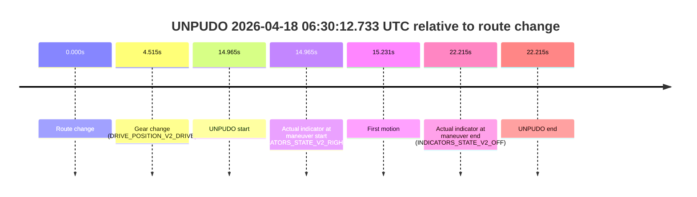
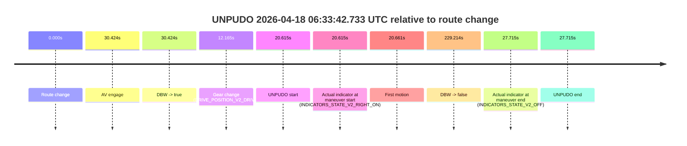
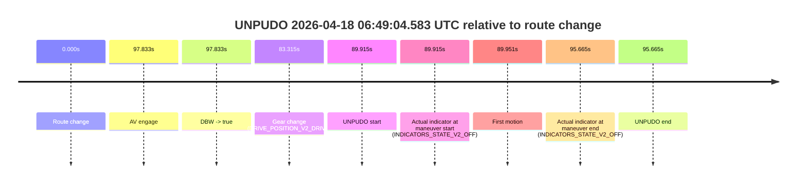

# Run Report: fme20007/2026-04-18--05-59-35--gen2-av-eb87447c-6e47-49e7-96aa-74a3d38a962e

| Field | Value |
|---|---|
| Run ID | `fme20007/2026-04-18--05-59-35--gen2-av-eb87447c-6e47-49e7-96aa-74a3d38a962e` |
| Date | `2026-04-18` |
| Model(s) | `apricot-crocodile-uproarious` |
| Author | `guy.geva` |
| Event count | `8` |

## unpudo 2026-04-18 06:10:51.983 UTC

| Field | Value |
|---|---|
| Model | `apricot-crocodile-uproarious` |
| Author | `guy.geva` |
| Run ID | `fme20007/2026-04-18--05-59-35--gen2-av-eb87447c-6e47-49e7-96aa-74a3d38a962e` |
| Date | `2026-04-18` |
| Time (UTC) | `06:10:51.983` |
| Event type | `unpudo` |
| Disengagement type | `failed_to_unpudo` |
| Route change | `found` |
| Console | [run](https://console.sso.wayve.ai/run/fme20007/2026-04-18--05-59-35--gen2-av-eb87447c-6e47-49e7-96aa-74a3d38a962e?id=&time-unixus=1776492651983301) |
| Foxglove | [segment](https://app.foxglove.dev/wayve-on-prem/p/prj_0dX18KZdVHg1fmmI/view?ds=foxglove-stream&ds.deviceName=fme20007&ds.start=2026-04-18T06%3A10%3A26.068277Z&ds.end=2026-04-18T06%3A12%3A02.802193Z&layoutId=lay_0e7VD4WIKDQGU73Y&time=2026-04-18T06%3A10%3A51.983301Z) |

### Event card: accidental

- Accidental: AV ownership is present for less than `2s`, so this is treated as an accidental brush with the maneuver rather than a meaningful model attempt.

| Event | Time (UTC) | Delta from route change |
|---|---:|---:|
| Route change | 2026-04-18 06:10:36.068 | `0.000s` |
| AV engage | 2026-04-18 06:11:37.421 | `61.353s` |
| DBW -> true | 2026-04-18 06:11:37.421 | `61.353s` |
| Gear change (DRIVE_POSITION_V2_REVERSE) | 2026-04-18 06:10:36.383 | `0.315s` |
| UNPUDO start | 2026-04-18 06:10:51.983 | `15.915s` |
| Actual indicator at maneuver start (INDICATORS_STATE_V2_OFF) | 2026-04-18 06:10:51.983 | `15.915s` |
| First motion | 2026-04-18 06:10:59.779 | `23.711s` |
| DBW -> false | 2026-04-18 06:11:52.802 | `76.734s` |
| Actual indicator at maneuver end (INDICATORS_STATE_V2_OFF) | 2026-04-18 06:11:38.633 | `62.565s` |
| UNPUDO end | 2026-04-18 06:11:38.633 | `62.565s` |

| Metric | Value |
|---|---|
| Outcome | `accidental` |
| Effective failure type | `none` |
| Route change status | `found` |
| DBW at event start | `false` |
| DBW at event end | `true` |
| Predicted gear at AV start | `DRIVE_POSITION_V2_DRIVE` |
| Actual gear at AV start | `DRIVE_POSITION_V2_DRIVE` |
| Predicted gear at event start | `DRIVE_POSITION_V2_REVERSE` |
| Actual gear at event start | `DRIVE_POSITION_V2_REVERSE` |
| Planned indicator direction | `INDICATORS_STATE_V2_OFF` |
| Controller indicator direction | `INDICATORS_STATE_V2_OFF` |
| Actual indicator direction | `INDICATORS_STATE_V2_OFF` |
| Actual indicator at maneuver end | `INDICATORS_STATE_V2_OFF` |
| Driver accel help in AV | `false` |
| Driver accel help timestamp | `n/a` |
| Max accel pedal pct in AV | `0.0%` |
| Max brake pedal pct in AV | `0.0%` |
| Max speed mps in AV | `2.264` |
| Route -> AV | `61.353s` |
| AV -> event start | `-45.438s` |
| AV -> first motion | `-37.642s` |
| AV duration before disengagement | `15.380s` |
| Trajectory waypoint count | `37` |
| Driving-plan step count | `11` |

The scored portion starts from the AV-owned window, not from the pre-AV setup. Route-change search in the stopped pre-event segment was `found`, with the baseline therefore set to route change. At the event anchor the model predicts `DRIVE_POSITION_V2_REVERSE` and the actual gear is `DRIVE_POSITION_V2_REVERSE`. The effective model outcome is `accidental` because `the AV-owned portion is shorter than 2s`.

### Resolution

| Field | Value |
|---|---|
| Final outcome | `accidental` |
| Do we agree with this label? | `yes` |
| Source disengagement type | `failed_to_unpudo` |
| Resolved effective failure type | `none` |
| Confidence | `high` |

## unpudo 2026-04-18 06:15:44.783 UTC

| Field | Value |
|---|---|
| Model | `apricot-crocodile-uproarious` |
| Author | `guy.geva` |
| Run ID | `fme20007/2026-04-18--05-59-35--gen2-av-eb87447c-6e47-49e7-96aa-74a3d38a962e` |
| Date | `2026-04-18` |
| Time (UTC) | `06:15:44.783` |
| Event type | `unpudo` |
| Disengagement type | `failed_to_unpudo` |
| Route change | `found` |
| Console | [run](https://console.sso.wayve.ai/run/fme20007/2026-04-18--05-59-35--gen2-av-eb87447c-6e47-49e7-96aa-74a3d38a962e?id=&time-unixus=1776492944783301) |
| Foxglove | [segment](https://app.foxglove.dev/wayve-on-prem/p/prj_0dX18KZdVHg1fmmI/view?ds=foxglove-stream&ds.deviceName=fme20007&ds.start=2026-04-18T06%3A15%3A25.818244Z&ds.end=2026-04-18T06%3A17%3A23.862014Z&layoutId=lay_0e7VD4WIKDQGU73Y&time=2026-04-18T06%3A15%3A44.783301Z) |

### Event card: accidental

- Accidental: AV ownership is present for less than `2s`, so this is treated as an accidental brush with the maneuver rather than a meaningful model attempt.

| Event | Time (UTC) | Delta from route change |
|---|---:|---:|
| Route change | 2026-04-18 06:15:35.818 | `0.000s` |
| AV engage | 2026-04-18 06:16:00.181 | `24.364s` |
| DBW -> true | 2026-04-18 06:16:00.181 | `24.364s` |
| Gear change (DRIVE_POSITION_V2_DRIVE) | 2026-04-18 06:15:36.083 | `0.265s` |
| UNPUDO start | 2026-04-18 06:15:44.783 | `8.965s` |
| Actual indicator at maneuver start (INDICATORS_STATE_V2_RIGHT_ON) | 2026-04-18 06:15:44.783 | `8.965s` |
| First motion | 2026-04-18 06:15:45.079 | `9.261s` |
| DBW -> false | 2026-04-18 06:17:13.862 | `98.044s` |
| Actual indicator at maneuver end (INDICATORS_STATE_V2_OFF) | 2026-04-18 06:15:58.283 | `22.465s` |
| UNPUDO end | 2026-04-18 06:15:58.283 | `22.465s` |

| Metric | Value |
|---|---|
| Outcome | `accidental` |
| Effective failure type | `none` |
| Route change status | `found` |
| DBW at event start | `false` |
| DBW at event end | `false` |
| Predicted gear at AV start | `DRIVE_POSITION_V2_DRIVE` |
| Actual gear at AV start | `DRIVE_POSITION_V2_DRIVE` |
| Predicted gear at event start | `DRIVE_POSITION_V2_REVERSE` |
| Actual gear at event start | `DRIVE_POSITION_V2_DRIVE` |
| Planned indicator direction | `INDICATORS_STATE_V2_OFF` |
| Controller indicator direction | `INDICATORS_STATE_V2_OFF` |
| Actual indicator direction | `INDICATORS_STATE_V2_RIGHT_ON` |
| Actual indicator at maneuver end | `INDICATORS_STATE_V2_OFF` |
| Driver accel help in AV | `false` |
| Driver accel help timestamp | `n/a` |
| Max accel pedal pct in AV | `0.0%` |
| Max brake pedal pct in AV | `0.0%` |
| Max speed mps in AV | `0.000` |
| Route -> AV | `24.364s` |
| AV -> event start | `-15.399s` |
| AV -> first motion | `-15.103s` |
| AV duration before disengagement | `73.680s` |
| Trajectory waypoint count | `37` |
| Driving-plan step count | `11` |

The scored portion starts from the AV-owned window, not from the pre-AV setup. Route-change search in the stopped pre-event segment was `found`, with the baseline therefore set to route change. At the event anchor the model predicts `DRIVE_POSITION_V2_REVERSE` and the actual gear is `DRIVE_POSITION_V2_DRIVE`. The effective model outcome is `accidental` because `the AV-owned portion is shorter than 2s`.

### Resolution

| Field | Value |
|---|---|
| Final outcome | `accidental` |
| Do we agree with this label? | `yes` |
| Source disengagement type | `failed_to_unpudo` |
| Resolved effective failure type | `none` |
| Confidence | `high` |

## unpudo 2026-04-18 06:30:12.733 UTC

| Field | Value |
|---|---|
| Model | `apricot-crocodile-uproarious` |
| Author | `guy.geva` |
| Run ID | `fme20007/2026-04-18--05-59-35--gen2-av-eb87447c-6e47-49e7-96aa-74a3d38a962e` |
| Date | `2026-04-18` |
| Time (UTC) | `06:30:12.733` |
| Event type | `unpudo` |
| Disengagement type | `failed_to_unpudo` |
| Route change | `found` |
| Console | [run](https://console.sso.wayve.ai/run/fme20007/2026-04-18--05-59-35--gen2-av-eb87447c-6e47-49e7-96aa-74a3d38a962e?id=&time-unixus=1776493812733320) |
| Foxglove | [segment](https://app.foxglove.dev/wayve-on-prem/p/prj_0dX18KZdVHg1fmmI/view?ds=foxglove-stream&ds.deviceName=fme20007&ds.start=2026-04-18T06%3A29%3A47.768283Z&ds.end=2026-04-18T06%3A30%3A29.983295Z&layoutId=lay_0e7VD4WIKDQGU73Y&time=2026-04-18T06%3A30%3A12.733320Z) |

### Event card: non-av

- Non-AV: the detected unpudo starts outside AV ownership, so it is kept for coverage but excluded from model success / failure scoring.

| Event | Time (UTC) | Delta from route change |
|---|---:|---:|
| Route change | 2026-04-18 06:29:57.768 | `0.000s` |
| Gear change (DRIVE_POSITION_V2_DRIVE) | 2026-04-18 06:30:02.283 | `4.515s` |
| UNPUDO start | 2026-04-18 06:30:12.733 | `14.965s` |
| Actual indicator at maneuver start (INDICATORS_STATE_V2_RIGHT_ON) | 2026-04-18 06:30:12.733 | `14.965s` |
| First motion | 2026-04-18 06:30:12.999 | `15.231s` |
| Actual indicator at maneuver end (INDICATORS_STATE_V2_OFF) | 2026-04-18 06:30:19.983 | `22.215s` |
| UNPUDO end | 2026-04-18 06:30:19.983 | `22.215s` |

| Metric | Value |
|---|---|
| Outcome | `non-av` |
| Effective failure type | `none` |
| Route change status | `found` |
| DBW at event start | `false` |
| DBW at event end | `false` |
| Predicted gear at AV start | `n/a` |
| Actual gear at AV start | `n/a` |
| Predicted gear at event start | `DRIVE_POSITION_V2_DRIVE` |
| Actual gear at event start | `DRIVE_POSITION_V2_DRIVE` |
| Planned indicator direction | `INDICATORS_STATE_V2_RIGHT_ON` |
| Controller indicator direction | `INDICATORS_STATE_V2_RIGHT_ON` |
| Actual indicator direction | `INDICATORS_STATE_V2_RIGHT_ON` |
| Actual indicator at maneuver end | `INDICATORS_STATE_V2_OFF` |
| Driver accel help in AV | `false` |
| Driver accel help timestamp | `n/a` |
| Max accel pedal pct in AV | `0.0%` |
| Max brake pedal pct in AV | `0.0%` |
| Max speed mps in AV | `0.000` |
| Route -> AV | `n/a` |
| AV -> event start | `n/a` |
| AV -> first motion | `n/a` |
| AV duration before disengagement | `n/a` |
| Trajectory waypoint count | `38` |
| Driving-plan step count | `11` |

The scored portion starts from the AV-owned window, not from the pre-AV setup. Route-change search in the stopped pre-event segment was `found`, with the baseline therefore set to route change. At the event anchor the model predicts `DRIVE_POSITION_V2_DRIVE` and the actual gear is `DRIVE_POSITION_V2_DRIVE`. The effective model outcome is `non-av` because `the event does not begin in AV ownership`.

### Resolution

| Field | Value |
|---|---|
| Final outcome | `non-av` |
| Do we agree with this label? | `yes` |
| Source disengagement type | `failed_to_unpudo` |
| Resolved effective failure type | `none` |
| Confidence | `high` |

## unpudo 2026-04-18 06:30:57.733 UTC

| Field | Value |
|---|---|
| Model | `apricot-crocodile-uproarious` |
| Author | `guy.geva` |
| Run ID | `fme20007/2026-04-18--05-59-35--gen2-av-eb87447c-6e47-49e7-96aa-74a3d38a962e` |
| Date | `2026-04-18` |
| Time (UTC) | `06:30:57.733` |
| Event type | `unpudo` |
| Disengagement type | `none observed` |
| Route change | `found` |
| Console | [run](https://console.sso.wayve.ai/run/fme20007/2026-04-18--05-59-35--gen2-av-eb87447c-6e47-49e7-96aa-74a3d38a962e?id=&time-unixus=1776493857733298) |
| Foxglove | [segment](https://app.foxglove.dev/wayve-on-prem/p/prj_0dX18KZdVHg1fmmI/view?ds=foxglove-stream&ds.deviceName=fme20007&ds.start=2026-04-18T06%3A29%3A47.768283Z&ds.end=2026-04-18T06%3A31%3A15.343110Z&layoutId=lay_0e7VD4WIKDQGU73Y&time=2026-04-18T06%3A30%3A57.733298Z) |

### Event card: accidental

- Accidental: AV ownership is present for less than `2s`, so this is treated as an accidental brush with the maneuver rather than a meaningful model attempt.

| Event | Time (UTC) | Delta from route change |
|---|---:|---:|
| Route change | 2026-04-18 06:29:57.768 | `0.000s` |
| AV engage | 2026-04-18 06:31:02.141 | `64.373s` |
| DBW -> true | 2026-04-18 06:31:02.141 | `64.373s` |
| Gear change (DRIVE_POSITION_V2_DRIVE) | 2026-04-18 06:30:53.883 | `56.115s` |
| UNPUDO start | 2026-04-18 06:30:57.733 | `59.965s` |
| Actual indicator at maneuver start (INDICATORS_STATE_V2_OFF) | 2026-04-18 06:30:57.733 | `59.965s` |
| First motion | 2026-04-18 06:30:57.779 | `60.011s` |
| DBW -> false | 2026-04-18 06:31:05.343 | `67.575s` |
| Actual indicator at maneuver end (INDICATORS_STATE_V2_OFF) | 2026-04-18 06:31:03.883 | `66.115s` |
| UNPUDO end | 2026-04-18 06:31:03.883 | `66.115s` |

| Metric | Value |
|---|---|
| Outcome | `accidental` |
| Effective failure type | `none` |
| Route change status | `found` |
| DBW at event start | `false` |
| DBW at event end | `true` |
| Predicted gear at AV start | `DRIVE_POSITION_V2_DRIVE` |
| Actual gear at AV start | `DRIVE_POSITION_V2_DRIVE` |
| Predicted gear at event start | `DRIVE_POSITION_V2_DRIVE` |
| Actual gear at event start | `DRIVE_POSITION_V2_DRIVE` |
| Planned indicator direction | `INDICATORS_STATE_V2_OFF` |
| Controller indicator direction | `INDICATORS_STATE_V2_OFF` |
| Actual indicator direction | `INDICATORS_STATE_V2_OFF` |
| Actual indicator at maneuver end | `INDICATORS_STATE_V2_OFF` |
| Driver accel help in AV | `false` |
| Driver accel help timestamp | `n/a` |
| Max accel pedal pct in AV | `0.0%` |
| Max brake pedal pct in AV | `0.0%` |
| Max speed mps in AV | `3.544` |
| Route -> AV | `64.373s` |
| AV -> event start | `-4.408s` |
| AV -> first motion | `-4.362s` |
| AV duration before disengagement | `3.201s` |
| Trajectory waypoint count | `36` |
| Driving-plan step count | `11` |

The scored portion starts from the AV-owned window, not from the pre-AV setup. Route-change search in the stopped pre-event segment was `found`, with the baseline therefore set to route change. At the event anchor the model predicts `DRIVE_POSITION_V2_DRIVE` and the actual gear is `DRIVE_POSITION_V2_DRIVE`. The effective model outcome is `accidental` because `the AV-owned portion is shorter than 2s`.

### Resolution

| Field | Value |
|---|---|
| Final outcome | `accidental` |
| Do we agree with this label? | `yes` |
| Source disengagement type | `none observed` |
| Resolved effective failure type | `none` |
| Confidence | `high` |

## unpudo 2026-04-18 06:33:42.733 UTC

| Field | Value |
|---|---|
| Model | `apricot-crocodile-uproarious` |
| Author | `guy.geva` |
| Run ID | `fme20007/2026-04-18--05-59-35--gen2-av-eb87447c-6e47-49e7-96aa-74a3d38a962e` |
| Date | `2026-04-18` |
| Time (UTC) | `06:33:42.733` |
| Event type | `unpudo` |
| Disengagement type | `failed_to_unpudo` |
| Route change | `found` |
| Console | [run](https://console.sso.wayve.ai/run/fme20007/2026-04-18--05-59-35--gen2-av-eb87447c-6e47-49e7-96aa-74a3d38a962e?id=&time-unixus=1776494022733303) |
| Foxglove | [segment](https://app.foxglove.dev/wayve-on-prem/p/prj_0dX18KZdVHg1fmmI/view?ds=foxglove-stream&ds.deviceName=fme20007&ds.start=2026-04-18T06%3A33%3A12.118269Z&ds.end=2026-04-18T06%3A37%3A21.331920Z&layoutId=lay_0e7VD4WIKDQGU73Y&time=2026-04-18T06%3A33%3A42.733303Z) |

### Event card: accidental

- Accidental: AV ownership is present for less than `2s`, so this is treated as an accidental brush with the maneuver rather than a meaningful model attempt.

| Event | Time (UTC) | Delta from route change |
|---|---:|---:|
| Route change | 2026-04-18 06:33:22.118 | `0.000s` |
| AV engage | 2026-04-18 06:33:52.541 | `30.424s` |
| DBW -> true | 2026-04-18 06:33:52.541 | `30.424s` |
| Gear change (DRIVE_POSITION_V2_DRIVE) | 2026-04-18 06:33:34.283 | `12.165s` |
| UNPUDO start | 2026-04-18 06:33:42.733 | `20.615s` |
| Actual indicator at maneuver start (INDICATORS_STATE_V2_RIGHT_ON) | 2026-04-18 06:33:42.733 | `20.615s` |
| First motion | 2026-04-18 06:33:42.779 | `20.661s` |
| DBW -> false | 2026-04-18 06:37:11.331 | `229.214s` |
| Actual indicator at maneuver end (INDICATORS_STATE_V2_OFF) | 2026-04-18 06:33:49.833 | `27.715s` |
| UNPUDO end | 2026-04-18 06:33:49.833 | `27.715s` |

| Metric | Value |
|---|---|
| Outcome | `accidental` |
| Effective failure type | `none` |
| Route change status | `found` |
| DBW at event start | `false` |
| DBW at event end | `false` |
| Predicted gear at AV start | `DRIVE_POSITION_V2_DRIVE` |
| Actual gear at AV start | `DRIVE_POSITION_V2_DRIVE` |
| Predicted gear at event start | `DRIVE_POSITION_V2_DRIVE` |
| Actual gear at event start | `DRIVE_POSITION_V2_DRIVE` |
| Planned indicator direction | `INDICATORS_STATE_V2_RIGHT_ON` |
| Controller indicator direction | `INDICATORS_STATE_V2_RIGHT_ON` |
| Actual indicator direction | `INDICATORS_STATE_V2_RIGHT_ON` |
| Actual indicator at maneuver end | `INDICATORS_STATE_V2_OFF` |
| Driver accel help in AV | `false` |
| Driver accel help timestamp | `n/a` |
| Max accel pedal pct in AV | `0.0%` |
| Max brake pedal pct in AV | `0.0%` |
| Max speed mps in AV | `0.000` |
| Route -> AV | `30.424s` |
| AV -> event start | `-9.809s` |
| AV -> first motion | `-9.763s` |
| AV duration before disengagement | `198.790s` |
| Trajectory waypoint count | `36` |
| Driving-plan step count | `11` |

The scored portion starts from the AV-owned window, not from the pre-AV setup. Route-change search in the stopped pre-event segment was `found`, with the baseline therefore set to route change. At the event anchor the model predicts `DRIVE_POSITION_V2_DRIVE` and the actual gear is `DRIVE_POSITION_V2_DRIVE`. The effective model outcome is `accidental` because `the AV-owned portion is shorter than 2s`.

### Resolution

| Field | Value |
|---|---|
| Final outcome | `accidental` |
| Do we agree with this label? | `yes` |
| Source disengagement type | `failed_to_unpudo` |
| Resolved effective failure type | `none` |
| Confidence | `high` |

## unpudo 2026-04-18 06:37:17.833 UTC

| Field | Value |
|---|---|
| Model | `apricot-crocodile-uproarious` |
| Author | `guy.geva` |
| Run ID | `fme20007/2026-04-18--05-59-35--gen2-av-eb87447c-6e47-49e7-96aa-74a3d38a962e` |
| Date | `2026-04-18` |
| Time (UTC) | `06:37:17.833` |
| Event type | `unpudo` |
| Disengagement type | `failed_to_unpudo` |
| Route change | `found` |
| Console | [run](https://console.sso.wayve.ai/run/fme20007/2026-04-18--05-59-35--gen2-av-eb87447c-6e47-49e7-96aa-74a3d38a962e?id=&time-unixus=1776494237833293) |
| Foxglove | [segment](https://app.foxglove.dev/wayve-on-prem/p/prj_0dX18KZdVHg1fmmI/view?ds=foxglove-stream&ds.deviceName=fme20007&ds.start=2026-04-18T06%3A36%3A57.568286Z&ds.end=2026-04-18T06%3A39%3A28.242712Z&layoutId=lay_0e7VD4WIKDQGU73Y&time=2026-04-18T06%3A37%3A17.833293Z) |

### Event card: accidental

- Accidental: AV ownership is present for less than `2s`, so this is treated as an accidental brush with the maneuver rather than a meaningful model attempt.

| Event | Time (UTC) | Delta from route change |
|---|---:|---:|
| Route change | 2026-04-18 06:37:07.568 | `0.000s` |
| AV engage | 2026-04-18 06:37:30.641 | `23.073s` |
| DBW -> true | 2026-04-18 06:37:30.641 | `23.073s` |
| Gear change (DRIVE_POSITION_V2_DRIVE) | 2026-04-18 06:37:13.533 | `5.965s` |
| UNPUDO start | 2026-04-18 06:37:17.833 | `10.265s` |
| Actual indicator at maneuver start (INDICATORS_STATE_V2_RIGHT_ON) | 2026-04-18 06:37:17.833 | `10.265s` |
| First motion | 2026-04-18 06:37:17.859 | `10.291s` |
| DBW -> false | 2026-04-18 06:39:18.242 | `130.674s` |
| Actual indicator at maneuver end (INDICATORS_STATE_V2_OFF) | 2026-04-18 06:37:21.883 | `14.315s` |
| UNPUDO end | 2026-04-18 06:37:21.883 | `14.315s` |

| Metric | Value |
|---|---|
| Outcome | `accidental` |
| Effective failure type | `none` |
| Route change status | `found` |
| DBW at event start | `false` |
| DBW at event end | `false` |
| Predicted gear at AV start | `DRIVE_POSITION_V2_DRIVE` |
| Actual gear at AV start | `DRIVE_POSITION_V2_DRIVE` |
| Predicted gear at event start | `DRIVE_POSITION_V2_DRIVE` |
| Actual gear at event start | `DRIVE_POSITION_V2_DRIVE` |
| Planned indicator direction | `INDICATORS_STATE_V2_RIGHT_ON` |
| Controller indicator direction | `INDICATORS_STATE_V2_RIGHT_ON` |
| Actual indicator direction | `INDICATORS_STATE_V2_RIGHT_ON` |
| Actual indicator at maneuver end | `INDICATORS_STATE_V2_OFF` |
| Driver accel help in AV | `false` |
| Driver accel help timestamp | `n/a` |
| Max accel pedal pct in AV | `0.0%` |
| Max brake pedal pct in AV | `0.0%` |
| Max speed mps in AV | `0.000` |
| Route -> AV | `23.073s` |
| AV -> event start | `-12.808s` |
| AV -> first motion | `-12.782s` |
| AV duration before disengagement | `107.601s` |
| Trajectory waypoint count | `36` |
| Driving-plan step count | `11` |

The scored portion starts from the AV-owned window, not from the pre-AV setup. Route-change search in the stopped pre-event segment was `found`, with the baseline therefore set to route change. At the event anchor the model predicts `DRIVE_POSITION_V2_DRIVE` and the actual gear is `DRIVE_POSITION_V2_DRIVE`. The effective model outcome is `accidental` because `the AV-owned portion is shorter than 2s`.

### Resolution

| Field | Value |
|---|---|
| Final outcome | `accidental` |
| Do we agree with this label? | `yes` |
| Source disengagement type | `failed_to_unpudo` |
| Resolved effective failure type | `none` |
| Confidence | `high` |

## unpudo 2026-04-18 06:44:47.283 UTC

| Field | Value |
|---|---|
| Model | `apricot-crocodile-uproarious` |
| Author | `guy.geva` |
| Run ID | `fme20007/2026-04-18--05-59-35--gen2-av-eb87447c-6e47-49e7-96aa-74a3d38a962e` |
| Date | `2026-04-18` |
| Time (UTC) | `06:44:47.283` |
| Event type | `unpudo` |
| Disengagement type | `failed_to_unpudo` |
| Route change | `found` |
| Console | [run](https://console.sso.wayve.ai/run/fme20007/2026-04-18--05-59-35--gen2-av-eb87447c-6e47-49e7-96aa-74a3d38a962e?id=&time-unixus=1776494687283304) |
| Foxglove | [segment](https://app.foxglove.dev/wayve-on-prem/p/prj_0dX18KZdVHg1fmmI/view?ds=foxglove-stream&ds.deviceName=fme20007&ds.start=2026-04-18T06%3A44%3A18.568276Z&ds.end=2026-04-18T06%3A48%3A07.402975Z&layoutId=lay_0e7VD4WIKDQGU73Y&time=2026-04-18T06%3A44%3A47.283304Z) |

### Event card: accidental

- Accidental: AV ownership is present for less than `2s`, so this is treated as an accidental brush with the maneuver rather than a meaningful model attempt.

| Event | Time (UTC) | Delta from route change |
|---|---:|---:|
| Route change | 2026-04-18 06:44:28.568 | `0.000s` |
| AV engage | 2026-04-18 06:44:58.101 | `29.533s` |
| DBW -> true | 2026-04-18 06:44:58.101 | `29.533s` |
| Gear change (DRIVE_POSITION_V2_DRIVE) | 2026-04-18 06:44:39.083 | `10.515s` |
| UNPUDO start | 2026-04-18 06:44:47.283 | `18.715s` |
| Actual indicator at maneuver start (INDICATORS_STATE_V2_RIGHT_ON) | 2026-04-18 06:44:47.283 | `18.715s` |
| First motion | 2026-04-18 06:44:47.419 | `18.851s` |
| DBW -> false | 2026-04-18 06:47:57.402 | `208.835s` |
| Actual indicator at maneuver end (INDICATORS_STATE_V2_OFF) | 2026-04-18 06:44:53.883 | `25.315s` |
| UNPUDO end | 2026-04-18 06:44:53.883 | `25.315s` |

| Metric | Value |
|---|---|
| Outcome | `accidental` |
| Effective failure type | `none` |
| Route change status | `found` |
| DBW at event start | `false` |
| DBW at event end | `false` |
| Predicted gear at AV start | `DRIVE_POSITION_V2_DRIVE` |
| Actual gear at AV start | `DRIVE_POSITION_V2_DRIVE` |
| Predicted gear at event start | `DRIVE_POSITION_V2_DRIVE` |
| Actual gear at event start | `DRIVE_POSITION_V2_DRIVE` |
| Planned indicator direction | `INDICATORS_STATE_V2_RIGHT_ON` |
| Controller indicator direction | `INDICATORS_STATE_V2_RIGHT_ON` |
| Actual indicator direction | `INDICATORS_STATE_V2_RIGHT_ON` |
| Actual indicator at maneuver end | `INDICATORS_STATE_V2_OFF` |
| Driver accel help in AV | `false` |
| Driver accel help timestamp | `n/a` |
| Max accel pedal pct in AV | `0.0%` |
| Max brake pedal pct in AV | `0.0%` |
| Max speed mps in AV | `0.000` |
| Route -> AV | `29.533s` |
| AV -> event start | `-10.818s` |
| AV -> first motion | `-10.682s` |
| AV duration before disengagement | `179.301s` |
| Trajectory waypoint count | `37` |
| Driving-plan step count | `11` |

The scored portion starts from the AV-owned window, not from the pre-AV setup. Route-change search in the stopped pre-event segment was `found`, with the baseline therefore set to route change. At the event anchor the model predicts `DRIVE_POSITION_V2_DRIVE` and the actual gear is `DRIVE_POSITION_V2_DRIVE`. The effective model outcome is `accidental` because `the AV-owned portion is shorter than 2s`.

### Resolution

| Field | Value |
|---|---|
| Final outcome | `accidental` |
| Do we agree with this label? | `yes` |
| Source disengagement type | `failed_to_unpudo` |
| Resolved effective failure type | `none` |
| Confidence | `high` |

## unpudo 2026-04-18 06:49:04.583 UTC

| Field | Value |
|---|---|
| Model | `apricot-crocodile-uproarious` |
| Author | `guy.geva` |
| Run ID | `fme20007/2026-04-18--05-59-35--gen2-av-eb87447c-6e47-49e7-96aa-74a3d38a962e` |
| Date | `2026-04-18` |
| Time (UTC) | `06:49:04.583` |
| Event type | `unpudo` |
| Disengagement type | `none observed` |
| Route change | `found` |
| Console | [run](https://console.sso.wayve.ai/run/fme20007/2026-04-18--05-59-35--gen2-av-eb87447c-6e47-49e7-96aa-74a3d38a962e?id=&time-unixus=1776494944583295) |
| Foxglove | [segment](https://app.foxglove.dev/wayve-on-prem/p/prj_0dX18KZdVHg1fmmI/view?ds=foxglove-stream&ds.deviceName=fme20007&ds.start=2026-04-18T06%3A47%3A24.668382Z&ds.end=2026-04-18T06%3A49%3A20.333303Z&layoutId=lay_0e7VD4WIKDQGU73Y&time=2026-04-18T06%3A49%3A04.583295Z) |

### Event card: accidental

- Accidental: AV ownership is present for less than `2s`, so this is treated as an accidental brush with the maneuver rather than a meaningful model attempt.

| Event | Time (UTC) | Delta from route change |
|---|---:|---:|
| Route change | 2026-04-18 06:47:34.668 | `0.000s` |
| AV engage | 2026-04-18 06:49:12.501 | `97.833s` |
| DBW -> true | 2026-04-18 06:49:12.501 | `97.833s` |
| Gear change (DRIVE_POSITION_V2_DRIVE) | 2026-04-18 06:48:57.983 | `83.315s` |
| UNPUDO start | 2026-04-18 06:49:04.583 | `89.915s` |
| Actual indicator at maneuver start (INDICATORS_STATE_V2_OFF) | 2026-04-18 06:49:04.583 | `89.915s` |
| First motion | 2026-04-18 06:49:04.619 | `89.951s` |
| Actual indicator at maneuver end (INDICATORS_STATE_V2_OFF) | 2026-04-18 06:49:10.333 | `95.665s` |
| UNPUDO end | 2026-04-18 06:49:10.333 | `95.665s` |

| Metric | Value |
|---|---|
| Outcome | `accidental` |
| Effective failure type | `none` |
| Route change status | `found` |
| DBW at event start | `false` |
| DBW at event end | `false` |
| Predicted gear at AV start | `DRIVE_POSITION_V2_DRIVE` |
| Actual gear at AV start | `DRIVE_POSITION_V2_DRIVE` |
| Predicted gear at event start | `DRIVE_POSITION_V2_DRIVE` |
| Actual gear at event start | `DRIVE_POSITION_V2_DRIVE` |
| Planned indicator direction | `INDICATORS_STATE_V2_OFF` |
| Controller indicator direction | `INDICATORS_STATE_V2_OFF` |
| Actual indicator direction | `INDICATORS_STATE_V2_OFF` |
| Actual indicator at maneuver end | `INDICATORS_STATE_V2_OFF` |
| Driver accel help in AV | `false` |
| Driver accel help timestamp | `n/a` |
| Max accel pedal pct in AV | `0.0%` |
| Max brake pedal pct in AV | `0.0%` |
| Max speed mps in AV | `0.000` |
| Route -> AV | `97.833s` |
| AV -> event start | `-7.918s` |
| AV -> first motion | `-7.882s` |
| AV duration before disengagement | `n/a` |
| Trajectory waypoint count | `37` |
| Driving-plan step count | `11` |

The scored portion starts from the AV-owned window, not from the pre-AV setup. Route-change search in the stopped pre-event segment was `found`, with the baseline therefore set to route change. At the event anchor the model predicts `DRIVE_POSITION_V2_DRIVE` and the actual gear is `DRIVE_POSITION_V2_DRIVE`. The effective model outcome is `accidental` because `the AV-owned portion is shorter than 2s`.

### Resolution

| Field | Value |
|---|---|
| Final outcome | `accidental` |
| Do we agree with this label? | `yes` |
| Source disengagement type | `none observed` |
| Resolved effective failure type | `none` |
| Confidence | `high` |
