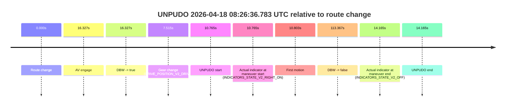
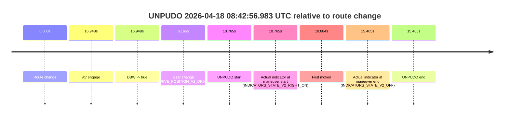

# Run Report: fme20007/2026-04-18--08-10-13--gen2-av-ce783cbf-97f0-4a1c-8510-c574d2572735

| Field | Value |
|---|---|
| Run ID | `fme20007/2026-04-18--08-10-13--gen2-av-ce783cbf-97f0-4a1c-8510-c574d2572735` |
| Date | `2026-04-18` |
| Model(s) | `apricot-crocodile-uproarious` |
| Author | `guy.geva` |
| Event count | `5` |

## unpudo 2026-04-18 08:20:58.033 UTC

| Field | Value |
|---|---|
| Model | `apricot-crocodile-uproarious` |
| Author | `guy.geva` |
| Run ID | `fme20007/2026-04-18--08-10-13--gen2-av-ce783cbf-97f0-4a1c-8510-c574d2572735` |
| Date | `2026-04-18` |
| Time (UTC) | `08:20:58.033` |
| Event type | `unpudo` |
| Disengagement type | `none observed` |
| Route change | `found` |
| Console | [run](https://console.sso.wayve.ai/run/fme20007/2026-04-18--08-10-13--gen2-av-ce783cbf-97f0-4a1c-8510-c574d2572735?id=&time-unixus=1776500458033302) |
| Foxglove | [segment](https://app.foxglove.dev/wayve-on-prem/p/prj_0dX18KZdVHg1fmmI/view?ds=foxglove-stream&ds.deviceName=fme20007&ds.start=2026-04-18T08%3A18%3A57.468274Z&ds.end=2026-04-18T08%3A22%3A11.225113Z&layoutId=lay_0e7VD4WIKDQGU73Y&time=2026-04-18T08%3A20%3A58.033302Z) |

### Event card: non-av

- Non-AV: there is no AV-owned portion anywhere inside the detected unpudo timeline, so it is kept for coverage but excluded from model success / failure scoring.

| Event | Time (UTC) | Delta from route change |
|---|---:|---:|
| Route change | 2026-04-18 08:19:07.468 | `0.000s` |
| AV engage | 2026-04-18 08:21:36.145 | `148.677s` |
| DBW -> true | 2026-04-18 08:21:36.145 | `148.677s` |
| Gear change (DRIVE_POSITION_V2_DRIVE) | 2026-04-18 08:20:53.283 | `105.815s` |
| UNPUDO start | 2026-04-18 08:20:58.033 | `110.565s` |
| Actual indicator at maneuver start (INDICATORS_STATE_V2_RIGHT_ON) | 2026-04-18 08:20:58.033 | `110.565s` |
| First motion | 2026-04-18 08:20:58.060 | `110.593s` |
| DBW -> false | 2026-04-18 08:22:01.225 | `173.757s` |
| Actual indicator at maneuver end (INDICATORS_STATE_V2_OFF) | 2026-04-18 08:21:29.683 | `142.215s` |
| UNPUDO end | 2026-04-18 08:21:29.683 | `142.215s` |

| Metric | Value |
|---|---|
| Outcome | `non-av` |
| Effective failure type | `none` |
| Route change status | `found` |
| DBW at event start | `false` |
| DBW at event end | `false` |
| Predicted gear at AV start | `DRIVE_POSITION_V2_DRIVE` |
| Actual gear at AV start | `DRIVE_POSITION_V2_DRIVE` |
| Predicted gear at event start | `DRIVE_POSITION_V2_REVERSE` |
| Actual gear at event start | `DRIVE_POSITION_V2_DRIVE` |
| Planned indicator direction | `INDICATORS_STATE_V2_RIGHT_ON` |
| Controller indicator direction | `INDICATORS_STATE_V2_RIGHT_ON` |
| Actual indicator direction | `INDICATORS_STATE_V2_RIGHT_ON` |
| Actual indicator at maneuver end | `INDICATORS_STATE_V2_OFF` |
| Driver accel help in AV | `false` |
| Driver accel help timestamp | `n/a` |
| Max accel pedal pct in AV | `0.0%` |
| Max brake pedal pct in AV | `0.0%` |
| Max speed mps in AV | `0.000` |
| Route -> AV | `148.677s` |
| AV -> event start | `-38.112s` |
| AV -> first motion | `-38.084s` |
| AV duration before disengagement | `25.080s` |
| Trajectory waypoint count | `35` |
| Driving-plan step count | `11` |

The scored portion starts from the AV-owned window, not from the pre-AV setup. Route-change search in the stopped pre-event segment was `found`, with the baseline therefore set to route change. At the event anchor the model predicts `DRIVE_POSITION_V2_REVERSE` and the actual gear is `DRIVE_POSITION_V2_DRIVE`. The effective model outcome is `non-av` because `there is no AV-owned overlap inside the event timeline`.

### Resolution

| Field | Value |
|---|---|
| Final outcome | `non-av` |
| Do we agree with this label? | `yes` |
| Source disengagement type | `none observed` |
| Resolved effective failure type | `none` |
| Confidence | `high` |

## unpudo 2026-04-18 08:26:36.783 UTC

| Field | Value |
|---|---|
| Model | `apricot-crocodile-uproarious` |
| Author | `guy.geva` |
| Run ID | `fme20007/2026-04-18--08-10-13--gen2-av-ce783cbf-97f0-4a1c-8510-c574d2572735` |
| Date | `2026-04-18` |
| Time (UTC) | `08:26:36.783` |
| Event type | `unpudo` |
| Disengagement type | `failed_to_unpudo` |
| Route change | `found` |
| Console | [run](https://console.sso.wayve.ai/run/fme20007/2026-04-18--08-10-13--gen2-av-ce783cbf-97f0-4a1c-8510-c574d2572735?id=&time-unixus=1776500796783306) |
| Foxglove | [segment](https://app.foxglove.dev/wayve-on-prem/p/prj_0dX18KZdVHg1fmmI/view?ds=foxglove-stream&ds.deviceName=fme20007&ds.start=2026-04-18T08%3A26%3A16.018411Z&ds.end=2026-04-18T08%3A28%3A29.385089Z&layoutId=lay_0e7VD4WIKDQGU73Y&time=2026-04-18T08%3A26%3A36.783306Z) |

### Event card: non-av

- Non-AV: there is no AV-owned portion anywhere inside the detected unpudo timeline, so it is kept for coverage but excluded from model success / failure scoring.

| Event | Time (UTC) | Delta from route change |
|---|---:|---:|
| Route change | 2026-04-18 08:26:26.018 | `0.000s` |
| AV engage | 2026-04-18 08:26:42.345 | `16.327s` |
| DBW -> true | 2026-04-18 08:26:42.345 | `16.327s` |
| Gear change (DRIVE_POSITION_V2_DRIVE) | 2026-04-18 08:26:33.533 | `7.515s` |
| UNPUDO start | 2026-04-18 08:26:36.783 | `10.765s` |
| Actual indicator at maneuver start (INDICATORS_STATE_V2_RIGHT_ON) | 2026-04-18 08:26:36.783 | `10.765s` |
| First motion | 2026-04-18 08:26:36.820 | `10.803s` |
| DBW -> false | 2026-04-18 08:28:19.385 | `113.367s` |
| Actual indicator at maneuver end (INDICATORS_STATE_V2_OFF) | 2026-04-18 08:26:40.183 | `14.165s` |
| UNPUDO end | 2026-04-18 08:26:40.183 | `14.165s` |

| Metric | Value |
|---|---|
| Outcome | `non-av` |
| Effective failure type | `none` |
| Route change status | `found` |
| DBW at event start | `false` |
| DBW at event end | `false` |
| Predicted gear at AV start | `DRIVE_POSITION_V2_DRIVE` |
| Actual gear at AV start | `DRIVE_POSITION_V2_DRIVE` |
| Predicted gear at event start | `DRIVE_POSITION_V2_DRIVE` |
| Actual gear at event start | `DRIVE_POSITION_V2_DRIVE` |
| Planned indicator direction | `INDICATORS_STATE_V2_RIGHT_ON` |
| Controller indicator direction | `INDICATORS_STATE_V2_RIGHT_ON` |
| Actual indicator direction | `INDICATORS_STATE_V2_RIGHT_ON` |
| Actual indicator at maneuver end | `INDICATORS_STATE_V2_OFF` |
| Driver accel help in AV | `false` |
| Driver accel help timestamp | `n/a` |
| Max accel pedal pct in AV | `0.0%` |
| Max brake pedal pct in AV | `0.0%` |
| Max speed mps in AV | `0.000` |
| Route -> AV | `16.327s` |
| AV -> event start | `-5.562s` |
| AV -> first motion | `-5.524s` |
| AV duration before disengagement | `97.040s` |
| Trajectory waypoint count | `36` |
| Driving-plan step count | `11` |

The scored portion starts from the AV-owned window, not from the pre-AV setup. Route-change search in the stopped pre-event segment was `found`, with the baseline therefore set to route change. At the event anchor the model predicts `DRIVE_POSITION_V2_DRIVE` and the actual gear is `DRIVE_POSITION_V2_DRIVE`. The effective model outcome is `non-av` because `there is no AV-owned overlap inside the event timeline`.

### Resolution

| Field | Value |
|---|---|
| Final outcome | `non-av` |
| Do we agree with this label? | `yes` |
| Source disengagement type | `failed_to_unpudo` |
| Resolved effective failure type | `none` |
| Confidence | `high` |

## unpudo 2026-04-18 08:28:55.183 UTC

| Field | Value |
|---|---|
| Model | `apricot-crocodile-uproarious` |
| Author | `guy.geva` |
| Run ID | `fme20007/2026-04-18--08-10-13--gen2-av-ce783cbf-97f0-4a1c-8510-c574d2572735` |
| Date | `2026-04-18` |
| Time (UTC) | `08:28:55.183` |
| Event type | `unpudo` |
| Disengagement type | `failed_to_unpudo` |
| Route change | `found` |
| Console | [run](https://console.sso.wayve.ai/run/fme20007/2026-04-18--08-10-13--gen2-av-ce783cbf-97f0-4a1c-8510-c574d2572735?id=&time-unixus=1776500935183309) |
| Foxglove | [segment](https://app.foxglove.dev/wayve-on-prem/p/prj_0dX18KZdVHg1fmmI/view?ds=foxglove-stream&ds.deviceName=fme20007&ds.start=2026-04-18T08%3A28%3A40.918305Z&ds.end=2026-04-18T08%3A31%3A06.645177Z&layoutId=lay_0e7VD4WIKDQGU73Y&time=2026-04-18T08%3A28%3A55.183309Z) |

### Event card: non-av

- Non-AV: there is no AV-owned portion anywhere inside the detected unpudo timeline, so it is kept for coverage but excluded from model success / failure scoring.

| Event | Time (UTC) | Delta from route change |
|---|---:|---:|
| Route change | 2026-04-18 08:28:50.918 | `0.000s` |
| AV engage | 2026-04-18 08:29:07.545 | `16.627s` |
| DBW -> true | 2026-04-18 08:29:07.545 | `16.627s` |
| Gear change (DRIVE_POSITION_V2_DRIVE) | 2026-04-18 08:28:51.233 | `0.315s` |
| UNPUDO start | 2026-04-18 08:28:55.183 | `4.265s` |
| Actual indicator at maneuver start (INDICATORS_STATE_V2_OFF) | 2026-04-18 08:28:55.183 | `4.265s` |
| First motion | 2026-04-18 08:28:55.281 | `4.363s` |
| DBW -> false | 2026-04-18 08:30:56.645 | `125.727s` |
| Actual indicator at maneuver end (INDICATORS_STATE_V2_OFF) | 2026-04-18 08:29:00.233 | `9.315s` |
| UNPUDO end | 2026-04-18 08:29:00.233 | `9.315s` |

| Metric | Value |
|---|---|
| Outcome | `non-av` |
| Effective failure type | `none` |
| Route change status | `found` |
| DBW at event start | `false` |
| DBW at event end | `false` |
| Predicted gear at AV start | `DRIVE_POSITION_V2_DRIVE` |
| Actual gear at AV start | `DRIVE_POSITION_V2_DRIVE` |
| Predicted gear at event start | `DRIVE_POSITION_V2_DRIVE` |
| Actual gear at event start | `DRIVE_POSITION_V2_DRIVE` |
| Planned indicator direction | `INDICATORS_STATE_V2_RIGHT_ON` |
| Controller indicator direction | `INDICATORS_STATE_V2_RIGHT_ON` |
| Actual indicator direction | `INDICATORS_STATE_V2_OFF` |
| Actual indicator at maneuver end | `INDICATORS_STATE_V2_OFF` |
| Driver accel help in AV | `false` |
| Driver accel help timestamp | `n/a` |
| Max accel pedal pct in AV | `0.0%` |
| Max brake pedal pct in AV | `0.0%` |
| Max speed mps in AV | `0.000` |
| Route -> AV | `16.627s` |
| AV -> event start | `-12.362s` |
| AV -> first motion | `-12.264s` |
| AV duration before disengagement | `109.100s` |
| Trajectory waypoint count | `36` |
| Driving-plan step count | `11` |

The scored portion starts from the AV-owned window, not from the pre-AV setup. Route-change search in the stopped pre-event segment was `found`, with the baseline therefore set to route change. At the event anchor the model predicts `DRIVE_POSITION_V2_DRIVE` and the actual gear is `DRIVE_POSITION_V2_DRIVE`. The effective model outcome is `non-av` because `there is no AV-owned overlap inside the event timeline`.

### Resolution

| Field | Value |
|---|---|
| Final outcome | `non-av` |
| Do we agree with this label? | `yes` |
| Source disengagement type | `failed_to_unpudo` |
| Resolved effective failure type | `none` |
| Confidence | `high` |

## unpudo 2026-04-18 08:36:56.533 UTC

| Field | Value |
|---|---|
| Model | `apricot-crocodile-uproarious` |
| Author | `guy.geva` |
| Run ID | `fme20007/2026-04-18--08-10-13--gen2-av-ce783cbf-97f0-4a1c-8510-c574d2572735` |
| Date | `2026-04-18` |
| Time (UTC) | `08:36:56.533` |
| Event type | `unpudo` |
| Disengagement type | `failed_to_unpudo` |
| Route change | `found` |
| Console | [run](https://console.sso.wayve.ai/run/fme20007/2026-04-18--08-10-13--gen2-av-ce783cbf-97f0-4a1c-8510-c574d2572735?id=&time-unixus=1776501416533292) |
| Foxglove | [segment](https://app.foxglove.dev/wayve-on-prem/p/prj_0dX18KZdVHg1fmmI/view?ds=foxglove-stream&ds.deviceName=fme20007&ds.start=2026-04-18T08%3A36%3A33.068271Z&ds.end=2026-04-18T08%3A38%3A05.166324Z&layoutId=lay_0e7VD4WIKDQGU73Y&time=2026-04-18T08%3A36%3A56.533292Z) |

### Event card: non-av

- Non-AV: there is no AV-owned portion anywhere inside the detected unpudo timeline, so it is kept for coverage but excluded from model success / failure scoring.

| Event | Time (UTC) | Delta from route change |
|---|---:|---:|
| Route change | 2026-04-18 08:36:43.068 | `0.000s` |
| AV engage | 2026-04-18 08:37:18.906 | `35.838s` |
| DBW -> true | 2026-04-18 08:37:18.906 | `35.838s` |
| Gear change (DRIVE_POSITION_V2_DRIVE) | 2026-04-18 08:36:49.383 | `6.315s` |
| UNPUDO start | 2026-04-18 08:36:56.533 | `13.465s` |
| Actual indicator at maneuver start (INDICATORS_STATE_V2_RIGHT_ON) | 2026-04-18 08:36:56.533 | `13.465s` |
| First motion | 2026-04-18 08:36:56.660 | `13.593s` |
| DBW -> false | 2026-04-18 08:37:55.166 | `72.098s` |
| Actual indicator at maneuver end (INDICATORS_STATE_V2_OFF) | 2026-04-18 08:37:00.683 | `17.615s` |
| UNPUDO end | 2026-04-18 08:37:00.683 | `17.615s` |

| Metric | Value |
|---|---|
| Outcome | `non-av` |
| Effective failure type | `none` |
| Route change status | `found` |
| DBW at event start | `false` |
| DBW at event end | `false` |
| Predicted gear at AV start | `DRIVE_POSITION_V2_DRIVE` |
| Actual gear at AV start | `DRIVE_POSITION_V2_DRIVE` |
| Predicted gear at event start | `DRIVE_POSITION_V2_DRIVE` |
| Actual gear at event start | `DRIVE_POSITION_V2_DRIVE` |
| Planned indicator direction | `INDICATORS_STATE_V2_RIGHT_ON` |
| Controller indicator direction | `INDICATORS_STATE_V2_RIGHT_ON` |
| Actual indicator direction | `INDICATORS_STATE_V2_RIGHT_ON` |
| Actual indicator at maneuver end | `INDICATORS_STATE_V2_OFF` |
| Driver accel help in AV | `false` |
| Driver accel help timestamp | `n/a` |
| Max accel pedal pct in AV | `0.0%` |
| Max brake pedal pct in AV | `0.0%` |
| Max speed mps in AV | `0.000` |
| Route -> AV | `35.838s` |
| AV -> event start | `-22.373s` |
| AV -> first motion | `-22.245s` |
| AV duration before disengagement | `36.260s` |
| Trajectory waypoint count | `37` |
| Driving-plan step count | `11` |

The scored portion starts from the AV-owned window, not from the pre-AV setup. Route-change search in the stopped pre-event segment was `found`, with the baseline therefore set to route change. At the event anchor the model predicts `DRIVE_POSITION_V2_DRIVE` and the actual gear is `DRIVE_POSITION_V2_DRIVE`. The effective model outcome is `non-av` because `there is no AV-owned overlap inside the event timeline`.

### Resolution

| Field | Value |
|---|---|
| Final outcome | `non-av` |
| Do we agree with this label? | `yes` |
| Source disengagement type | `failed_to_unpudo` |
| Resolved effective failure type | `none` |
| Confidence | `high` |

## unpudo 2026-04-18 08:42:56.983 UTC

| Field | Value |
|---|---|
| Model | `apricot-crocodile-uproarious` |
| Author | `guy.geva` |
| Run ID | `fme20007/2026-04-18--08-10-13--gen2-av-ce783cbf-97f0-4a1c-8510-c574d2572735` |
| Date | `2026-04-18` |
| Time (UTC) | `08:42:56.983` |
| Event type | `unpudo` |
| Disengagement type | `failed_to_unpudo` |
| Route change | `found` |
| Console | [run](https://console.sso.wayve.ai/run/fme20007/2026-04-18--08-10-13--gen2-av-ce783cbf-97f0-4a1c-8510-c574d2572735?id=&time-unixus=1776501776983311) |
| Foxglove | [segment](https://app.foxglove.dev/wayve-on-prem/p/prj_0dX18KZdVHg1fmmI/view?ds=foxglove-stream&ds.deviceName=fme20007&ds.start=2026-04-18T08%3A42%3A36.218279Z&ds.end=2026-04-18T08%3A43%3A11.683309Z&layoutId=lay_0e7VD4WIKDQGU73Y&time=2026-04-18T08%3A42%3A56.983311Z) |

### Event card: non-av

- Non-AV: there is no AV-owned portion anywhere inside the detected unpudo timeline, so it is kept for coverage but excluded from model success / failure scoring.

| Event | Time (UTC) | Delta from route change |
|---|---:|---:|
| Route change | 2026-04-18 08:42:46.218 | `0.000s` |
| AV engage | 2026-04-18 08:43:03.166 | `16.948s` |
| DBW -> true | 2026-04-18 08:43:03.166 | `16.948s` |
| Gear change (DRIVE_POSITION_V2_DRIVE) | 2026-04-18 08:42:52.383 | `6.165s` |
| UNPUDO start | 2026-04-18 08:42:56.983 | `10.765s` |
| Actual indicator at maneuver start (INDICATORS_STATE_V2_RIGHT_ON) | 2026-04-18 08:42:56.983 | `10.765s` |
| First motion | 2026-04-18 08:42:57.101 | `10.884s` |
| Actual indicator at maneuver end (INDICATORS_STATE_V2_OFF) | 2026-04-18 08:43:01.683 | `15.465s` |
| UNPUDO end | 2026-04-18 08:43:01.683 | `15.465s` |

| Metric | Value |
|---|---|
| Outcome | `non-av` |
| Effective failure type | `none` |
| Route change status | `found` |
| DBW at event start | `false` |
| DBW at event end | `false` |
| Predicted gear at AV start | `DRIVE_POSITION_V2_DRIVE` |
| Actual gear at AV start | `DRIVE_POSITION_V2_DRIVE` |
| Predicted gear at event start | `DRIVE_POSITION_V2_DRIVE` |
| Actual gear at event start | `DRIVE_POSITION_V2_DRIVE` |
| Planned indicator direction | `INDICATORS_STATE_V2_RIGHT_ON` |
| Controller indicator direction | `INDICATORS_STATE_V2_RIGHT_ON` |
| Actual indicator direction | `INDICATORS_STATE_V2_RIGHT_ON` |
| Actual indicator at maneuver end | `INDICATORS_STATE_V2_OFF` |
| Driver accel help in AV | `false` |
| Driver accel help timestamp | `n/a` |
| Max accel pedal pct in AV | `0.0%` |
| Max brake pedal pct in AV | `0.0%` |
| Max speed mps in AV | `0.000` |
| Route -> AV | `16.948s` |
| AV -> event start | `-6.183s` |
| AV -> first motion | `-6.065s` |
| AV duration before disengagement | `n/a` |
| Trajectory waypoint count | `36` |
| Driving-plan step count | `11` |

The scored portion starts from the AV-owned window, not from the pre-AV setup. Route-change search in the stopped pre-event segment was `found`, with the baseline therefore set to route change. At the event anchor the model predicts `DRIVE_POSITION_V2_DRIVE` and the actual gear is `DRIVE_POSITION_V2_DRIVE`. The effective model outcome is `non-av` because `there is no AV-owned overlap inside the event timeline`.

### Resolution

| Field | Value |
|---|---|
| Final outcome | `non-av` |
| Do we agree with this label? | `yes` |
| Source disengagement type | `failed_to_unpudo` |
| Resolved effective failure type | `none` |
| Confidence | `high` |
