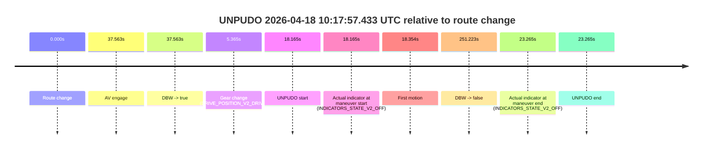
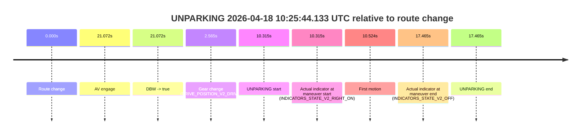

# Run Report: fme20007/2026-04-18--09-45-22--gen2-av-738800f0-319a-44d1-bdd8-1dad68d4449d

| Field | Value |
|---|---|
| Run ID | `fme20007/2026-04-18--09-45-22--gen2-av-738800f0-319a-44d1-bdd8-1dad68d4449d` |
| Date | `2026-04-18` |
| Model(s) | `apricot-crocodile-uproarious` |
| Author | `guy.geva` |
| Event count | `2` |

## unpudo 2026-04-18 10:17:57.433 UTC

| Field | Value |
|---|---|
| Model | `apricot-crocodile-uproarious` |
| Author | `guy.geva` |
| Run ID | `fme20007/2026-04-18--09-45-22--gen2-av-738800f0-319a-44d1-bdd8-1dad68d4449d` |
| Date | `2026-04-18` |
| Time (UTC) | `10:17:57.433` |
| Event type | `unpudo` |
| Disengagement type | `none observed` |
| Route change | `found` |
| Console | [run](https://console.sso.wayve.ai/run/fme20007/2026-04-18--09-45-22--gen2-av-738800f0-319a-44d1-bdd8-1dad68d4449d?id=&time-unixus=1776507477433302) |
| Foxglove | [segment](https://app.foxglove.dev/wayve-on-prem/p/prj_0dX18KZdVHg1fmmI/view?ds=foxglove-stream&ds.deviceName=fme20007&ds.start=2026-04-18T10%3A17%3A29.268285Z&ds.end=2026-04-18T10%3A22%3A00.491471Z&layoutId=lay_0e7VD4WIKDQGU73Y&time=2026-04-18T10%3A17%3A57.433302Z) |

### Event card: non-av

- Non-AV: there is no AV-owned portion anywhere inside the detected unpudo timeline, so it is kept for coverage but excluded from model success / failure scoring.

| Event | Time (UTC) | Delta from route change |
|---|---:|---:|
| Route change | 2026-04-18 10:17:39.268 | `0.000s` |
| AV engage | 2026-04-18 10:18:16.830 | `37.563s` |
| DBW -> true | 2026-04-18 10:18:16.830 | `37.563s` |
| Gear change (DRIVE_POSITION_V2_DRIVE) | 2026-04-18 10:17:44.633 | `5.365s` |
| UNPUDO start | 2026-04-18 10:17:57.433 | `18.165s` |
| Actual indicator at maneuver start (INDICATORS_STATE_V2_OFF) | 2026-04-18 10:17:57.433 | `18.165s` |
| First motion | 2026-04-18 10:17:57.622 | `18.354s` |
| DBW -> false | 2026-04-18 10:21:50.491 | `251.223s` |
| Actual indicator at maneuver end (INDICATORS_STATE_V2_OFF) | 2026-04-18 10:18:02.533 | `23.265s` |
| UNPUDO end | 2026-04-18 10:18:02.533 | `23.265s` |

| Metric | Value |
|---|---|
| Outcome | `non-av` |
| Effective failure type | `none` |
| Route change status | `found` |
| DBW at event start | `false` |
| DBW at event end | `false` |
| Predicted gear at AV start | `DRIVE_POSITION_V2_DRIVE` |
| Actual gear at AV start | `DRIVE_POSITION_V2_DRIVE` |
| Predicted gear at event start | `DRIVE_POSITION_V2_DRIVE` |
| Actual gear at event start | `DRIVE_POSITION_V2_DRIVE` |
| Planned indicator direction | `INDICATORS_STATE_V2_LEFT_ON` |
| Controller indicator direction | `INDICATORS_STATE_V2_LEFT_ON` |
| Actual indicator direction | `INDICATORS_STATE_V2_OFF` |
| Actual indicator at maneuver end | `INDICATORS_STATE_V2_OFF` |
| Driver accel help in AV | `false` |
| Driver accel help timestamp | `n/a` |
| Max accel pedal pct in AV | `0.0%` |
| Max brake pedal pct in AV | `0.0%` |
| Max speed mps in AV | `0.000` |
| Route -> AV | `37.563s` |
| AV -> event start | `-19.397s` |
| AV -> first motion | `-19.208s` |
| AV duration before disengagement | `213.661s` |
| Trajectory waypoint count | `36` |
| Driving-plan step count | `11` |

The scored portion starts from the AV-owned window, not from the pre-AV setup. Route-change search in the stopped pre-event segment was `found`, with the baseline therefore set to route change. At the event anchor the model predicts `DRIVE_POSITION_V2_DRIVE` and the actual gear is `DRIVE_POSITION_V2_DRIVE`. The effective model outcome is `non-av` because `there is no AV-owned overlap inside the event timeline`.

### Resolution

| Field | Value |
|---|---|
| Final outcome | `non-av` |
| Do we agree with this label? | `yes` |
| Source disengagement type | `none observed` |
| Resolved effective failure type | `none` |
| Confidence | `high` |

## unparking 2026-04-18 10:25:44.133 UTC

| Field | Value |
|---|---|
| Model | `apricot-crocodile-uproarious` |
| Author | `guy.geva` |
| Run ID | `fme20007/2026-04-18--09-45-22--gen2-av-738800f0-319a-44d1-bdd8-1dad68d4449d` |
| Date | `2026-04-18` |
| Time (UTC) | `10:25:44.133` |
| Event type | `unparking` |
| Disengagement type | `none observed` |
| Route change | `found` |
| Console | [run](https://console.sso.wayve.ai/run/fme20007/2026-04-18--09-45-22--gen2-av-738800f0-319a-44d1-bdd8-1dad68d4449d?id=&time-unixus=1776507944133316) |
| Foxglove | [segment](https://app.foxglove.dev/wayve-on-prem/p/prj_0dX18KZdVHg1fmmI/view?ds=foxglove-stream&ds.deviceName=fme20007&ds.start=2026-04-18T10%3A25%3A23.818508Z&ds.end=2026-04-18T10%3A26%3A01.283314Z&layoutId=lay_0e7VD4WIKDQGU73Y&time=2026-04-18T10%3A25%3A44.133316Z) |

### Event card: non-av

- Non-AV: there is no AV-owned portion anywhere inside the detected unparking timeline, so it is kept for coverage but excluded from model success / failure scoring.

| Event | Time (UTC) | Delta from route change |
|---|---:|---:|
| Route change | 2026-04-18 10:25:33.818 | `0.000s` |
| AV engage | 2026-04-18 10:25:54.890 | `21.072s` |
| DBW -> true | 2026-04-18 10:25:54.890 | `21.072s` |
| Gear change (DRIVE_POSITION_V2_DRIVE) | 2026-04-18 10:25:36.383 | `2.565s` |
| UNPARKING start | 2026-04-18 10:25:44.133 | `10.315s` |
| Actual indicator at maneuver start (INDICATORS_STATE_V2_RIGHT_ON) | 2026-04-18 10:25:44.133 | `10.315s` |
| First motion | 2026-04-18 10:25:44.342 | `10.524s` |
| Actual indicator at maneuver end (INDICATORS_STATE_V2_OFF) | 2026-04-18 10:25:51.283 | `17.465s` |
| UNPARKING end | 2026-04-18 10:25:51.283 | `17.465s` |

| Metric | Value |
|---|---|
| Outcome | `non-av` |
| Effective failure type | `none` |
| Route change status | `found` |
| DBW at event start | `false` |
| DBW at event end | `false` |
| Predicted gear at AV start | `DRIVE_POSITION_V2_DRIVE` |
| Actual gear at AV start | `DRIVE_POSITION_V2_DRIVE` |
| Predicted gear at event start | `DRIVE_POSITION_V2_DRIVE` |
| Actual gear at event start | `DRIVE_POSITION_V2_DRIVE` |
| Planned indicator direction | `INDICATORS_STATE_V2_RIGHT_ON` |
| Controller indicator direction | `INDICATORS_STATE_V2_RIGHT_ON` |
| Actual indicator direction | `INDICATORS_STATE_V2_RIGHT_ON` |
| Actual indicator at maneuver end | `INDICATORS_STATE_V2_OFF` |
| Driver accel help in AV | `false` |
| Driver accel help timestamp | `n/a` |
| Max accel pedal pct in AV | `0.0%` |
| Max brake pedal pct in AV | `0.0%` |
| Max speed mps in AV | `0.000` |
| Route -> AV | `21.072s` |
| AV -> event start | `-10.757s` |
| AV -> first motion | `-10.548s` |
| AV duration before disengagement | `n/a` |
| Trajectory waypoint count | `36` |
| Driving-plan step count | `11` |

The scored portion starts from the AV-owned window, not from the pre-AV setup. Route-change search in the stopped pre-event segment was `found`, with the baseline therefore set to route change. At the event anchor the model predicts `DRIVE_POSITION_V2_DRIVE` and the actual gear is `DRIVE_POSITION_V2_DRIVE`. The effective model outcome is `non-av` because `there is no AV-owned overlap inside the event timeline`.

### Resolution

| Field | Value |
|---|---|
| Final outcome | `non-av` |
| Do we agree with this label? | `yes` |
| Source disengagement type | `none observed` |
| Resolved effective failure type | `none` |
| Confidence | `high` |
