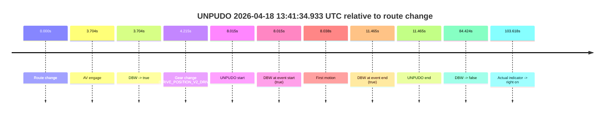
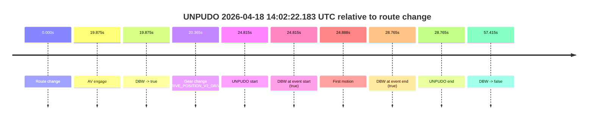

# Run Report: fme20007/2026-04-18--13-23-49--gen2-av-497c6a47-6680-44b9-bbdd-d7bc9002ecb7

| Field | Value |
|---|---|
| Run ID | `fme20007/2026-04-18--13-23-49--gen2-av-497c6a47-6680-44b9-bbdd-d7bc9002ecb7` |
| Date | `2026-04-18` |
| Model(s) | `armadillo-amethyst-squeaky` |
| Author | `guy.geva` |
| Event count | `2` |

## unpudo 2026-04-18 13:41:34.933 UTC

| Field | Value |
|---|---|
| Model | `armadillo-amethyst-squeaky` |
| Author | `guy.geva` |
| Run ID | `fme20007/2026-04-18--13-23-49--gen2-av-497c6a47-6680-44b9-bbdd-d7bc9002ecb7` |
| Date | `2026-04-18` |
| Time (UTC) | `13:41:34.933` |
| Event type | `unpudo` |
| Disengagement type | `none observed` |
| Route change | `found` |
| Console | [run](https://console.sso.wayve.ai/run/fme20007/2026-04-18--13-23-49--gen2-av-497c6a47-6680-44b9-bbdd-d7bc9002ecb7?id=&time-unixus=1776519694933308) |
| Foxglove | [segment](https://app.foxglove.dev/wayve-on-prem/p/prj_0dX18KZdVHg1fmmI/view?ds=foxglove-stream&ds.deviceName=fme20007&ds.start=2026-04-18T13%3A41%3A16.918791Z&ds.end=2026-04-18T13%3A43%3A01.343198Z&layoutId=lay_0e7VD4WIKDQGU73Y&time=2026-04-18T13%3A41%3A34.933308Z) |

### Event card: pass

- Pass: AV owns the credited unpudo through the official event window, the gear state is aligned at the anchor, and the vehicle moves without driver accelerator help in AV.

| Event | Time (UTC) | Delta from route change |
|---|---:|---:|
| Route change | 2026-04-18 13:41:26.918 | `0.000s` |
| AV engage | 2026-04-18 13:41:30.623 | `3.704s` |
| DBW -> true | 2026-04-18 13:41:30.623 | `3.704s` |
| Gear change (DRIVE_POSITION_V2_DRIVE) | 2026-04-18 13:41:31.133 | `4.215s` |
| UNPUDO start | 2026-04-18 13:41:34.933 | `8.015s` |
| DBW at event start (true) | 2026-04-18 13:41:34.933 | `8.015s` |
| First motion | 2026-04-18 13:41:34.956 | `8.038s` |
| DBW at event end (true) | 2026-04-18 13:41:38.383 | `11.465s` |
| UNPUDO end | 2026-04-18 13:41:38.383 | `11.465s` |
| DBW -> false | 2026-04-18 13:42:51.343 | `84.424s` |
| Actual indicator -> right on | 2026-04-18 13:43:10.536 | `103.618s` |

| Metric | Value |
|---|---|
| Outcome | `pass` |
| Effective failure type | `none` |
| Route change status | `found` |
| DBW at event start | `true` |
| DBW at event end | `true` |
| Predicted gear at AV start | `DRIVE_POSITION_V2_DRIVE` |
| Actual gear at AV start | `DRIVE_POSITION_V2_PARK` |
| Predicted gear at event start | `DRIVE_POSITION_V2_DRIVE` |
| Actual gear at event start | `DRIVE_POSITION_V2_DRIVE` |
| Planned indicator direction | `INDICATORS_STATE_V2_OFF` |
| Controller indicator direction | `INDICATORS_STATE_V2_OFF` |
| Actual indicator direction | `INDICATORS_STATE_V2_OFF` |
| Actual indicator at maneuver end | `INDICATORS_STATE_V2_OFF` |
| Driver accel help in AV | `false` |
| Driver accel help timestamp | `n/a` |
| Max accel pedal pct in AV | `0.0%` |
| Max brake pedal pct in AV | `0.0%` |
| Max speed mps in AV | `4.372` |
| Success timing baseline | `route change` |
| Route -> AV | `3.704s` |
| AV -> event start | `4.310s` |
| AV -> first motion | `4.334s` |
| Success baseline -> event start | `8.015s` |
| Success baseline -> first motion | `8.038s` |
| AV duration before disengagement | `80.720s` |
| Trajectory waypoint count | `38` |
| Driving-plan step count | `11` |

The scored portion starts from the AV-owned window, not from the pre-AV setup. Route-change search in the stopped pre-event segment was `found`, with the baseline therefore set to route change. At the event anchor the model predicts `DRIVE_POSITION_V2_DRIVE` and the actual gear is `DRIVE_POSITION_V2_DRIVE`. The effective model outcome is `pass` because `the credited maneuver stays AV-owned through the official event end`.

### Resolution

| Field | Value |
|---|---|
| Final outcome | `pass` |
| Do we agree with this label? | `yes` |
| Source disengagement type | `none observed` |
| Resolved effective failure type | `none` |
| Confidence | `high` |

## unpudo 2026-04-18 14:02:22.183 UTC

| Field | Value |
|---|---|
| Model | `armadillo-amethyst-squeaky` |
| Author | `guy.geva` |
| Run ID | `fme20007/2026-04-18--13-23-49--gen2-av-497c6a47-6680-44b9-bbdd-d7bc9002ecb7` |
| Date | `2026-04-18` |
| Time (UTC) | `14:02:22.183` |
| Event type | `unpudo` |
| Disengagement type | `none observed` |
| Route change | `found` |
| Console | [run](https://console.sso.wayve.ai/run/fme20007/2026-04-18--13-23-49--gen2-av-497c6a47-6680-44b9-bbdd-d7bc9002ecb7?id=&time-unixus=1776520942183317) |
| Foxglove | [segment](https://app.foxglove.dev/wayve-on-prem/p/prj_0dX18KZdVHg1fmmI/view?ds=foxglove-stream&ds.deviceName=fme20007&ds.start=2026-04-18T14%3A01%3A47.368287Z&ds.end=2026-04-18T14%3A03%3A04.783253Z&layoutId=lay_0e7VD4WIKDQGU73Y&time=2026-04-18T14%3A02%3A22.183317Z) |

### Event card: pass

- Pass: AV owns the credited unpudo through the official event window, the gear state is aligned at the anchor, and the vehicle moves without driver accelerator help in AV.

| Event | Time (UTC) | Delta from route change |
|---|---:|---:|
| Route change | 2026-04-18 14:01:57.368 | `0.000s` |
| AV engage | 2026-04-18 14:02:17.243 | `19.875s` |
| DBW -> true | 2026-04-18 14:02:17.243 | `19.875s` |
| Gear change (DRIVE_POSITION_V2_DRIVE) | 2026-04-18 14:02:17.733 | `20.365s` |
| UNPUDO start | 2026-04-18 14:02:22.183 | `24.815s` |
| DBW at event start (true) | 2026-04-18 14:02:22.183 | `24.815s` |
| First motion | 2026-04-18 14:02:22.256 | `24.888s` |
| DBW at event end (true) | 2026-04-18 14:02:26.133 | `28.765s` |
| UNPUDO end | 2026-04-18 14:02:26.133 | `28.765s` |
| DBW -> false | 2026-04-18 14:02:54.783 | `57.415s` |

| Metric | Value |
|---|---|
| Outcome | `pass` |
| Effective failure type | `none` |
| Route change status | `found` |
| DBW at event start | `true` |
| DBW at event end | `true` |
| Predicted gear at AV start | `DRIVE_POSITION_V2_DRIVE` |
| Actual gear at AV start | `DRIVE_POSITION_V2_PARK` |
| Predicted gear at event start | `DRIVE_POSITION_V2_DRIVE` |
| Actual gear at event start | `DRIVE_POSITION_V2_DRIVE` |
| Planned indicator direction | `INDICATORS_STATE_V2_LEFT_ON` |
| Controller indicator direction | `INDICATORS_STATE_V2_LEFT_ON` |
| Actual indicator direction | `INDICATORS_STATE_V2_OFF` |
| Actual indicator at maneuver end | `INDICATORS_STATE_V2_OFF` |
| Driver accel help in AV | `false` |
| Driver accel help timestamp | `n/a` |
| Max accel pedal pct in AV | `0.0%` |
| Max brake pedal pct in AV | `0.0%` |
| Max speed mps in AV | `4.519` |
| Success timing baseline | `route change` |
| Route -> AV | `19.875s` |
| AV -> event start | `4.940s` |
| AV -> first motion | `5.013s` |
| Success baseline -> event start | `24.815s` |
| Success baseline -> first motion | `24.888s` |
| AV duration before disengagement | `37.540s` |
| Trajectory waypoint count | `37` |
| Driving-plan step count | `11` |

The scored portion starts from the AV-owned window, not from the pre-AV setup. Route-change search in the stopped pre-event segment was `found`, with the baseline therefore set to route change. At the event anchor the model predicts `DRIVE_POSITION_V2_DRIVE` and the actual gear is `DRIVE_POSITION_V2_DRIVE`. The effective model outcome is `pass` because `the credited maneuver stays AV-owned through the official event end`.

### Resolution

| Field | Value |
|---|---|
| Final outcome | `pass` |
| Do we agree with this label? | `yes` |
| Source disengagement type | `none observed` |
| Resolved effective failure type | `none` |
| Confidence | `high` |
