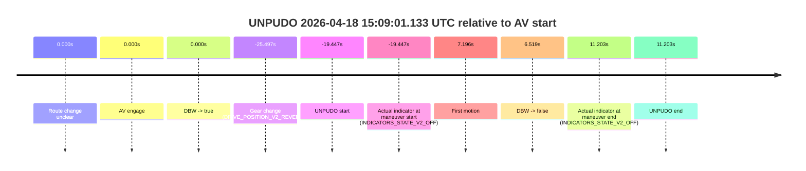
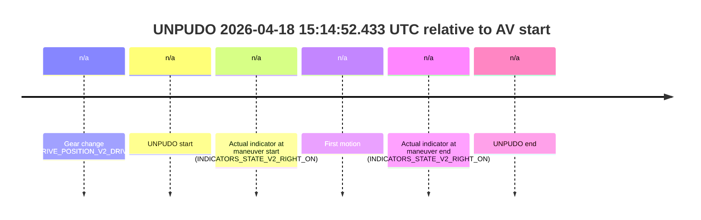
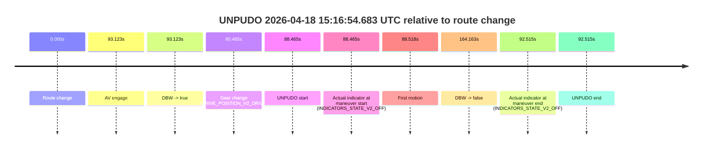
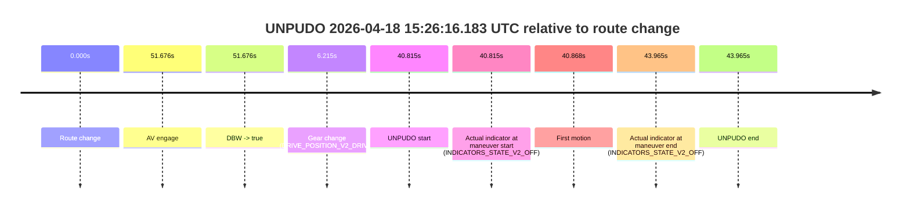

# Run Report: fme20007/2026-04-18--14-37-54--gen2-av-4508a44a-736f-4209-b7c0-13d2038e3f11

| Field | Value |
|---|---|
| Run ID | `fme20007/2026-04-18--14-37-54--gen2-av-4508a44a-736f-4209-b7c0-13d2038e3f11` |
| Date | `2026-04-18` |
| Model(s) | `apricot-crocodile-uproarious` |
| Author | `guy.geva` |
| Event count | `11` |

## unpudo 2026-04-18 14:46:22.933 UTC

| Field | Value |
|---|---|
| Model | `apricot-crocodile-uproarious` |
| Author | `guy.geva` |
| Run ID | `fme20007/2026-04-18--14-37-54--gen2-av-4508a44a-736f-4209-b7c0-13d2038e3f11` |
| Date | `2026-04-18` |
| Time (UTC) | `14:46:22.933` |
| Event type | `unpudo` |
| Disengagement type | `none observed` |
| Route change | `found` |
| Console | [run](https://console.sso.wayve.ai/run/fme20007/2026-04-18--14-37-54--gen2-av-4508a44a-736f-4209-b7c0-13d2038e3f11?id=&time-unixus=1776523582933320) |
| Foxglove | [segment](https://app.foxglove.dev/wayve-on-prem/p/prj_0dX18KZdVHg1fmmI/view?ds=foxglove-stream&ds.deviceName=fme20007&ds.start=2026-04-18T14%3A45%3A40.418271Z&ds.end=2026-04-18T14%3A47%3A11.383303Z&layoutId=lay_0e7VD4WIKDQGU73Y&time=2026-04-18T14%3A46%3A22.933320Z) |

### Event card: fail

- Fail: the credited unpudo does not stay AV-owned. The event window starts with DBW false, and the maneuver outcome lands outside a clean AV-owned segment.

| Event | Time (UTC) | Delta from route change |
|---|---:|---:|
| Route change | 2026-04-18 14:45:50.418 | `0.000s` |
| AV engage | 2026-04-18 14:46:48.360 | `57.942s` |
| DBW -> true | 2026-04-18 14:46:48.360 | `57.942s` |
| Gear change (DRIVE_POSITION_V2_REVERSE) | 2026-04-18 14:46:16.833 | `26.415s` |
| UNPUDO start | 2026-04-18 14:46:22.933 | `32.515s` |
| Actual indicator at maneuver start (INDICATORS_STATE_V2_OFF) | 2026-04-18 14:46:22.933 | `32.515s` |
| First motion | 2026-04-18 14:46:32.776 | `42.359s` |
| DBW -> false | 2026-04-18 14:46:53.540 | `63.122s` |
| Actual indicator at maneuver end (INDICATORS_STATE_V2_OFF) | 2026-04-18 14:47:01.383 | `70.965s` |
| UNPUDO end | 2026-04-18 14:47:01.383 | `70.965s` |

| Metric | Value |
|---|---|
| Outcome | `fail` |
| Effective failure type | `completed_outside_av` |
| Route change status | `found` |
| DBW at event start | `false` |
| DBW at event end | `true` |
| Predicted gear at AV start | `DRIVE_POSITION_V2_REVERSE` |
| Actual gear at AV start | `DRIVE_POSITION_V2_PARK` |
| Predicted gear at event start | `DRIVE_POSITION_V2_REVERSE` |
| Actual gear at event start | `DRIVE_POSITION_V2_REVERSE` |
| Planned indicator direction | `INDICATORS_STATE_V2_OFF` |
| Controller indicator direction | `INDICATORS_STATE_V2_OFF` |
| Actual indicator direction | `INDICATORS_STATE_V2_OFF` |
| Actual indicator at maneuver end | `INDICATORS_STATE_V2_OFF` |
| Driver accel help in AV | `false` |
| Driver accel help timestamp | `n/a` |
| Max accel pedal pct in AV | `0.0%` |
| Max brake pedal pct in AV | `8.0%` |
| Max speed mps in AV | `0.000` |
| Route -> AV | `57.942s` |
| AV -> event start | `-25.427s` |
| AV -> first motion | `-15.584s` |
| AV duration before disengagement | `5.180s` |
| Trajectory waypoint count | `36` |
| Driving-plan step count | `11` |

The scored portion starts from the AV-owned window, not from the pre-AV setup. Route-change search in the stopped pre-event segment was `found`, with the baseline therefore set to route change. At the event anchor the model predicts `DRIVE_POSITION_V2_REVERSE` and the actual gear is `DRIVE_POSITION_V2_REVERSE`. The effective model outcome is `fail` because `completed_outside_av`.

### Resolution

| Field | Value |
|---|---|
| Final outcome | `fail` |
| Do we agree with this label? | `yes` |
| Source disengagement type | `none observed` |
| Resolved effective failure type | `completed_outside_av` |
| Confidence | `high` |

## unpudo 2026-04-18 14:51:09.833 UTC

| Field | Value |
|---|---|
| Model | `apricot-crocodile-uproarious` |
| Author | `guy.geva` |
| Run ID | `fme20007/2026-04-18--14-37-54--gen2-av-4508a44a-736f-4209-b7c0-13d2038e3f11` |
| Date | `2026-04-18` |
| Time (UTC) | `14:51:09.833` |
| Event type | `unpudo` |
| Disengagement type | `none observed` |
| Route change | `found` |
| Console | [run](https://console.sso.wayve.ai/run/fme20007/2026-04-18--14-37-54--gen2-av-4508a44a-736f-4209-b7c0-13d2038e3f11?id=&time-unixus=1776523869833318) |
| Foxglove | [segment](https://app.foxglove.dev/wayve-on-prem/p/prj_0dX18KZdVHg1fmmI/view?ds=foxglove-stream&ds.deviceName=fme20007&ds.start=2026-04-18T14%3A50%3A29.718281Z&ds.end=2026-04-18T14%3A52%3A43.461859Z&layoutId=lay_0e7VD4WIKDQGU73Y&time=2026-04-18T14%3A51%3A09.833318Z) |

### Event card: non-av

- Non-AV: there is no AV-owned portion anywhere inside the detected unpudo timeline, so it is kept for coverage but excluded from model success / failure scoring.

| Event | Time (UTC) | Delta from route change |
|---|---:|---:|
| Route change | 2026-04-18 14:50:39.718 | `0.000s` |
| AV engage | 2026-04-18 14:51:13.661 | `33.943s` |
| DBW -> true | 2026-04-18 14:51:13.661 | `33.943s` |
| Gear change (DRIVE_POSITION_V2_DRIVE) | 2026-04-18 14:51:04.333 | `24.615s` |
| UNPUDO start | 2026-04-18 14:51:09.833 | `30.115s` |
| Actual indicator at maneuver start (INDICATORS_STATE_V2_RIGHT_ON) | 2026-04-18 14:51:09.833 | `30.115s` |
| First motion | 2026-04-18 14:51:09.876 | `30.159s` |
| DBW -> false | 2026-04-18 14:52:33.461 | `113.744s` |
| Actual indicator at maneuver end (INDICATORS_STATE_V2_OFF) | 2026-04-18 14:51:13.483 | `33.765s` |
| UNPUDO end | 2026-04-18 14:51:13.483 | `33.765s` |

| Metric | Value |
|---|---|
| Outcome | `non-av` |
| Effective failure type | `none` |
| Route change status | `found` |
| DBW at event start | `false` |
| DBW at event end | `false` |
| Predicted gear at AV start | `DRIVE_POSITION_V2_DRIVE` |
| Actual gear at AV start | `DRIVE_POSITION_V2_DRIVE` |
| Predicted gear at event start | `DRIVE_POSITION_V2_DRIVE` |
| Actual gear at event start | `DRIVE_POSITION_V2_DRIVE` |
| Planned indicator direction | `INDICATORS_STATE_V2_RIGHT_ON` |
| Controller indicator direction | `INDICATORS_STATE_V2_RIGHT_ON` |
| Actual indicator direction | `INDICATORS_STATE_V2_RIGHT_ON` |
| Actual indicator at maneuver end | `INDICATORS_STATE_V2_OFF` |
| Driver accel help in AV | `false` |
| Driver accel help timestamp | `n/a` |
| Max accel pedal pct in AV | `0.0%` |
| Max brake pedal pct in AV | `0.0%` |
| Max speed mps in AV | `0.000` |
| Route -> AV | `33.943s` |
| AV -> event start | `-3.828s` |
| AV -> first motion | `-3.785s` |
| AV duration before disengagement | `79.800s` |
| Trajectory waypoint count | `36` |
| Driving-plan step count | `11` |

The scored portion starts from the AV-owned window, not from the pre-AV setup. Route-change search in the stopped pre-event segment was `found`, with the baseline therefore set to route change. At the event anchor the model predicts `DRIVE_POSITION_V2_DRIVE` and the actual gear is `DRIVE_POSITION_V2_DRIVE`. The effective model outcome is `non-av` because `there is no AV-owned overlap inside the event timeline`.

### Resolution

| Field | Value |
|---|---|
| Final outcome | `non-av` |
| Do we agree with this label? | `yes` |
| Source disengagement type | `none observed` |
| Resolved effective failure type | `none` |
| Confidence | `high` |

## unpudo 2026-04-18 14:53:21.183 UTC

| Field | Value |
|---|---|
| Model | `apricot-crocodile-uproarious` |
| Author | `guy.geva` |
| Run ID | `fme20007/2026-04-18--14-37-54--gen2-av-4508a44a-736f-4209-b7c0-13d2038e3f11` |
| Date | `2026-04-18` |
| Time (UTC) | `14:53:21.183` |
| Event type | `unpudo` |
| Disengagement type | `none observed` |
| Route change | `found` |
| Console | [run](https://console.sso.wayve.ai/run/fme20007/2026-04-18--14-37-54--gen2-av-4508a44a-736f-4209-b7c0-13d2038e3f11?id=&time-unixus=1776524001183304) |
| Foxglove | [segment](https://app.foxglove.dev/wayve-on-prem/p/prj_0dX18KZdVHg1fmmI/view?ds=foxglove-stream&ds.deviceName=fme20007&ds.start=2026-04-18T14%3A52%3A49.568255Z&ds.end=2026-04-18T14%3A54%3A50.301667Z&layoutId=lay_0e7VD4WIKDQGU73Y&time=2026-04-18T14%3A53%3A21.183304Z) |

### Event card: non-av

- Non-AV: there is no AV-owned portion anywhere inside the detected unpudo timeline, so it is kept for coverage but excluded from model success / failure scoring.

| Event | Time (UTC) | Delta from route change |
|---|---:|---:|
| Route change | 2026-04-18 14:52:59.568 | `0.000s` |
| AV engage | 2026-04-18 14:53:29.720 | `30.152s` |
| DBW -> true | 2026-04-18 14:53:29.720 | `30.152s` |
| Gear change (DRIVE_POSITION_V2_DRIVE) | 2026-04-18 14:53:11.233 | `11.665s` |
| UNPUDO start | 2026-04-18 14:53:21.183 | `21.615s` |
| Actual indicator at maneuver start (INDICATORS_STATE_V2_RIGHT_ON) | 2026-04-18 14:53:21.183 | `21.615s` |
| First motion | 2026-04-18 14:53:21.297 | `21.729s` |
| DBW -> false | 2026-04-18 14:54:40.301 | `100.733s` |
| Actual indicator at maneuver end (INDICATORS_STATE_V2_OFF) | 2026-04-18 14:53:25.833 | `26.265s` |
| UNPUDO end | 2026-04-18 14:53:25.833 | `26.265s` |

| Metric | Value |
|---|---|
| Outcome | `non-av` |
| Effective failure type | `none` |
| Route change status | `found` |
| DBW at event start | `false` |
| DBW at event end | `false` |
| Predicted gear at AV start | `DRIVE_POSITION_V2_DRIVE` |
| Actual gear at AV start | `DRIVE_POSITION_V2_DRIVE` |
| Predicted gear at event start | `DRIVE_POSITION_V2_DRIVE` |
| Actual gear at event start | `DRIVE_POSITION_V2_DRIVE` |
| Planned indicator direction | `INDICATORS_STATE_V2_RIGHT_ON` |
| Controller indicator direction | `INDICATORS_STATE_V2_RIGHT_ON` |
| Actual indicator direction | `INDICATORS_STATE_V2_RIGHT_ON` |
| Actual indicator at maneuver end | `INDICATORS_STATE_V2_OFF` |
| Driver accel help in AV | `false` |
| Driver accel help timestamp | `n/a` |
| Max accel pedal pct in AV | `0.0%` |
| Max brake pedal pct in AV | `0.0%` |
| Max speed mps in AV | `0.000` |
| Route -> AV | `30.152s` |
| AV -> event start | `-8.537s` |
| AV -> first motion | `-8.423s` |
| AV duration before disengagement | `70.581s` |
| Trajectory waypoint count | `37` |
| Driving-plan step count | `11` |

The scored portion starts from the AV-owned window, not from the pre-AV setup. Route-change search in the stopped pre-event segment was `found`, with the baseline therefore set to route change. At the event anchor the model predicts `DRIVE_POSITION_V2_DRIVE` and the actual gear is `DRIVE_POSITION_V2_DRIVE`. The effective model outcome is `non-av` because `there is no AV-owned overlap inside the event timeline`.

### Resolution

| Field | Value |
|---|---|
| Final outcome | `non-av` |
| Do we agree with this label? | `yes` |
| Source disengagement type | `none observed` |
| Resolved effective failure type | `none` |
| Confidence | `high` |

## unpudo 2026-04-18 14:55:07.933 UTC

| Field | Value |
|---|---|
| Model | `apricot-crocodile-uproarious` |
| Author | `guy.geva` |
| Run ID | `fme20007/2026-04-18--14-37-54--gen2-av-4508a44a-736f-4209-b7c0-13d2038e3f11` |
| Date | `2026-04-18` |
| Time (UTC) | `14:55:07.933` |
| Event type | `unpudo` |
| Disengagement type | `none observed` |
| Route change | `found` |
| Console | [run](https://console.sso.wayve.ai/run/fme20007/2026-04-18--14-37-54--gen2-av-4508a44a-736f-4209-b7c0-13d2038e3f11?id=&time-unixus=1776524107933315) |
| Foxglove | [segment](https://app.foxglove.dev/wayve-on-prem/p/prj_0dX18KZdVHg1fmmI/view?ds=foxglove-stream&ds.deviceName=fme20007&ds.start=2026-04-18T14%3A54%3A49.418267Z&ds.end=2026-04-18T14%3A58%3A05.360761Z&layoutId=lay_0e7VD4WIKDQGU73Y&time=2026-04-18T14%3A55%3A07.933315Z) |

### Event card: non-av

- Non-AV: there is no AV-owned portion anywhere inside the detected unpudo timeline, so it is kept for coverage but excluded from model success / failure scoring.

| Event | Time (UTC) | Delta from route change |
|---|---:|---:|
| Route change | 2026-04-18 14:54:59.418 | `0.000s` |
| AV engage | 2026-04-18 14:55:14.660 | `15.242s` |
| DBW -> true | 2026-04-18 14:55:14.660 | `15.242s` |
| Gear change (DRIVE_POSITION_V2_DRIVE) | 2026-04-18 14:55:02.983 | `3.565s` |
| UNPUDO start | 2026-04-18 14:55:07.933 | `8.515s` |
| Actual indicator at maneuver start (INDICATORS_STATE_V2_RIGHT_ON) | 2026-04-18 14:55:07.933 | `8.515s` |
| First motion | 2026-04-18 14:55:07.996 | `8.578s` |
| DBW -> false | 2026-04-18 14:57:55.360 | `175.942s` |
| Actual indicator at maneuver end (INDICATORS_STATE_V2_OFF) | 2026-04-18 14:55:12.483 | `13.065s` |
| UNPUDO end | 2026-04-18 14:55:12.483 | `13.065s` |

| Metric | Value |
|---|---|
| Outcome | `non-av` |
| Effective failure type | `none` |
| Route change status | `found` |
| DBW at event start | `false` |
| DBW at event end | `false` |
| Predicted gear at AV start | `DRIVE_POSITION_V2_DRIVE` |
| Actual gear at AV start | `DRIVE_POSITION_V2_DRIVE` |
| Predicted gear at event start | `DRIVE_POSITION_V2_DRIVE` |
| Actual gear at event start | `DRIVE_POSITION_V2_DRIVE` |
| Planned indicator direction | `INDICATORS_STATE_V2_OFF` |
| Controller indicator direction | `INDICATORS_STATE_V2_OFF` |
| Actual indicator direction | `INDICATORS_STATE_V2_RIGHT_ON` |
| Actual indicator at maneuver end | `INDICATORS_STATE_V2_OFF` |
| Driver accel help in AV | `false` |
| Driver accel help timestamp | `n/a` |
| Max accel pedal pct in AV | `0.0%` |
| Max brake pedal pct in AV | `0.0%` |
| Max speed mps in AV | `0.000` |
| Route -> AV | `15.242s` |
| AV -> event start | `-6.727s` |
| AV -> first motion | `-6.664s` |
| AV duration before disengagement | `160.700s` |
| Trajectory waypoint count | `36` |
| Driving-plan step count | `11` |

The scored portion starts from the AV-owned window, not from the pre-AV setup. Route-change search in the stopped pre-event segment was `found`, with the baseline therefore set to route change. At the event anchor the model predicts `DRIVE_POSITION_V2_DRIVE` and the actual gear is `DRIVE_POSITION_V2_DRIVE`. The effective model outcome is `non-av` because `there is no AV-owned overlap inside the event timeline`.

### Resolution

| Field | Value |
|---|---|
| Final outcome | `non-av` |
| Do we agree with this label? | `yes` |
| Source disengagement type | `none observed` |
| Resolved effective failure type | `none` |
| Confidence | `high` |

## unpudo 2026-04-18 14:58:27.533 UTC

| Field | Value |
|---|---|
| Model | `apricot-crocodile-uproarious` |
| Author | `guy.geva` |
| Run ID | `fme20007/2026-04-18--14-37-54--gen2-av-4508a44a-736f-4209-b7c0-13d2038e3f11` |
| Date | `2026-04-18` |
| Time (UTC) | `14:58:27.533` |
| Event type | `unpudo` |
| Disengagement type | `none observed` |
| Route change | `found` |
| Console | [run](https://console.sso.wayve.ai/run/fme20007/2026-04-18--14-37-54--gen2-av-4508a44a-736f-4209-b7c0-13d2038e3f11?id=&time-unixus=1776524307533295) |
| Foxglove | [segment](https://app.foxglove.dev/wayve-on-prem/p/prj_0dX18KZdVHg1fmmI/view?ds=foxglove-stream&ds.deviceName=fme20007&ds.start=2026-04-18T14%3A57%3A59.118261Z&ds.end=2026-04-18T15%3A00%3A47.741262Z&layoutId=lay_0e7VD4WIKDQGU73Y&time=2026-04-18T14%3A58%3A27.533295Z) |

### Event card: non-av

- Non-AV: there is no AV-owned portion anywhere inside the detected unpudo timeline, so it is kept for coverage but excluded from model success / failure scoring.

| Event | Time (UTC) | Delta from route change |
|---|---:|---:|
| Route change | 2026-04-18 14:58:09.118 | `0.000s` |
| AV engage | 2026-04-18 14:58:51.681 | `42.563s` |
| DBW -> true | 2026-04-18 14:58:51.681 | `42.563s` |
| Gear change (DRIVE_POSITION_V2_DRIVE) | 2026-04-18 14:58:25.383 | `16.265s` |
| UNPUDO start | 2026-04-18 14:58:27.533 | `18.415s` |
| Actual indicator at maneuver start (INDICATORS_STATE_V2_LEFT_ON) | 2026-04-18 14:58:27.533 | `18.415s` |
| First motion | 2026-04-18 14:58:27.596 | `18.479s` |
| DBW -> false | 2026-04-18 15:00:37.741 | `148.623s` |
| Actual indicator at maneuver end (INDICATORS_STATE_V2_OFF) | 2026-04-18 14:58:32.833 | `23.715s` |
| UNPUDO end | 2026-04-18 14:58:32.833 | `23.715s` |

| Metric | Value |
|---|---|
| Outcome | `non-av` |
| Effective failure type | `none` |
| Route change status | `found` |
| DBW at event start | `false` |
| DBW at event end | `false` |
| Predicted gear at AV start | `DRIVE_POSITION_V2_DRIVE` |
| Actual gear at AV start | `DRIVE_POSITION_V2_DRIVE` |
| Predicted gear at event start | `DRIVE_POSITION_V2_DRIVE` |
| Actual gear at event start | `DRIVE_POSITION_V2_DRIVE` |
| Planned indicator direction | `INDICATORS_STATE_V2_LEFT_ON` |
| Controller indicator direction | `INDICATORS_STATE_V2_LEFT_ON` |
| Actual indicator direction | `INDICATORS_STATE_V2_LEFT_ON` |
| Actual indicator at maneuver end | `INDICATORS_STATE_V2_OFF` |
| Driver accel help in AV | `false` |
| Driver accel help timestamp | `n/a` |
| Max accel pedal pct in AV | `0.0%` |
| Max brake pedal pct in AV | `0.0%` |
| Max speed mps in AV | `0.000` |
| Route -> AV | `42.563s` |
| AV -> event start | `-24.148s` |
| AV -> first motion | `-24.085s` |
| AV duration before disengagement | `106.060s` |
| Trajectory waypoint count | `36` |
| Driving-plan step count | `11` |

The scored portion starts from the AV-owned window, not from the pre-AV setup. Route-change search in the stopped pre-event segment was `found`, with the baseline therefore set to route change. At the event anchor the model predicts `DRIVE_POSITION_V2_DRIVE` and the actual gear is `DRIVE_POSITION_V2_DRIVE`. The effective model outcome is `non-av` because `there is no AV-owned overlap inside the event timeline`.

### Resolution

| Field | Value |
|---|---|
| Final outcome | `non-av` |
| Do we agree with this label? | `yes` |
| Source disengagement type | `none observed` |
| Resolved effective failure type | `none` |
| Confidence | `high` |

## unpudo 2026-04-18 15:09:01.133 UTC

| Field | Value |
|---|---|
| Model | `apricot-crocodile-uproarious` |
| Author | `guy.geva` |
| Run ID | `fme20007/2026-04-18--14-37-54--gen2-av-4508a44a-736f-4209-b7c0-13d2038e3f11` |
| Date | `2026-04-18` |
| Time (UTC) | `15:09:01.133` |
| Event type | `unpudo` |
| Disengagement type | `none observed` |
| Route change | `unclear` |
| Console | [run](https://console.sso.wayve.ai/run/fme20007/2026-04-18--14-37-54--gen2-av-4508a44a-736f-4209-b7c0-13d2038e3f11?id=&time-unixus=1776524941133317) |
| Foxglove | [segment](https://app.foxglove.dev/wayve-on-prem/p/prj_0dX18KZdVHg1fmmI/view?ds=foxglove-stream&ds.deviceName=fme20007&ds.start=2026-04-18T15%3A08%3A45.083314Z&ds.end=2026-04-18T15%3A09%3A41.783315Z&layoutId=lay_0e7VD4WIKDQGU73Y&time=2026-04-18T15%3A09%3A01.133317Z) |

### Event card: fail

- Fail: the credited unpudo does not stay AV-owned. The event window starts with DBW false, and the maneuver outcome lands outside a clean AV-owned segment.

| Event | Time (UTC) | Delta from AV start |
|---|---:|---:|
| Route change unclear | 2026-04-18 15:09:20.580 | `0.000s` |
| AV engage | 2026-04-18 15:09:20.580 | `0.000s` |
| DBW -> true | 2026-04-18 15:09:20.580 | `0.000s` |
| Gear change (DRIVE_POSITION_V2_REVERSE) | 2026-04-18 15:08:55.083 | `-25.497s` |
| UNPUDO start | 2026-04-18 15:09:01.133 | `-19.447s` |
| Actual indicator at maneuver start (INDICATORS_STATE_V2_OFF) | 2026-04-18 15:09:01.133 | `-19.447s` |
| First motion | 2026-04-18 15:09:27.776 | `7.196s` |
| DBW -> false | 2026-04-18 15:09:27.099 | `6.519s` |
| Actual indicator at maneuver end (INDICATORS_STATE_V2_OFF) | 2026-04-18 15:09:31.783 | `11.203s` |
| UNPUDO end | 2026-04-18 15:09:31.783 | `11.203s` |

| Metric | Value |
|---|---|
| Outcome | `fail` |
| Effective failure type | `not_av_owned` |
| Route change status | `unclear` |
| DBW at event start | `false` |
| DBW at event end | `false` |
| Predicted gear at AV start | `DRIVE_POSITION_V2_DRIVE` |
| Actual gear at AV start | `DRIVE_POSITION_V2_PARK` |
| Predicted gear at event start | `DRIVE_POSITION_V2_PARK` |
| Actual gear at event start | `DRIVE_POSITION_V2_REVERSE` |
| Planned indicator direction | `INDICATORS_STATE_V2_OFF` |
| Controller indicator direction | `INDICATORS_STATE_V2_OFF` |
| Actual indicator direction | `INDICATORS_STATE_V2_OFF` |
| Actual indicator at maneuver end | `INDICATORS_STATE_V2_OFF` |
| Driver accel help in AV | `false` |
| Driver accel help timestamp | `n/a` |
| Max accel pedal pct in AV | `0.0%` |
| Max brake pedal pct in AV | `8.0%` |
| Max speed mps in AV | `0.000` |
| Route -> AV | `n/a` |
| AV -> event start | `-19.447s` |
| AV -> first motion | `7.196s` |
| AV duration before disengagement | `6.519s` |
| Trajectory waypoint count | `36` |
| Driving-plan step count | `11` |

The scored portion starts from the AV-owned window, not from the pre-AV setup. Route-change search in the stopped pre-event segment was `unclear`, with the baseline therefore set to AV start. At the event anchor the model predicts `DRIVE_POSITION_V2_PARK` and the actual gear is `DRIVE_POSITION_V2_REVERSE`. The effective model outcome is `fail` because `not_av_owned`.

### Resolution

| Field | Value |
|---|---|
| Final outcome | `fail` |
| Do we agree with this label? | `yes` |
| Source disengagement type | `none observed` |
| Resolved effective failure type | `not_av_owned` |
| Confidence | `medium` |

## unpudo 2026-04-18 15:14:52.433 UTC

| Field | Value |
|---|---|
| Model | `apricot-crocodile-uproarious` |
| Author | `guy.geva` |
| Run ID | `fme20007/2026-04-18--14-37-54--gen2-av-4508a44a-736f-4209-b7c0-13d2038e3f11` |
| Date | `2026-04-18` |
| Time (UTC) | `15:14:52.433` |
| Event type | `unpudo` |
| Disengagement type | `none observed` |
| Route change | `unclear` |
| Console | [run](https://console.sso.wayve.ai/run/fme20007/2026-04-18--14-37-54--gen2-av-4508a44a-736f-4209-b7c0-13d2038e3f11?id=&time-unixus=1776525292433303) |
| Foxglove | [segment](https://app.foxglove.dev/wayve-on-prem/p/prj_0dX18KZdVHg1fmmI/view?ds=foxglove-stream&ds.deviceName=fme20007&ds.start=2026-04-18T15%3A14%3A40.833329Z&ds.end=2026-04-18T15%3A15%3A05.283311Z&layoutId=lay_0e7VD4WIKDQGU73Y&time=2026-04-18T15%3A14%3A52.433303Z) |

### Event card: non-av

- Non-AV: there is no AV-owned portion anywhere inside the detected unpudo timeline, so it is kept for coverage but excluded from model success / failure scoring.

| Event | Time (UTC) | Delta from AV start |
|---|---:|---:|
| Gear change (DRIVE_POSITION_V2_DRIVE) | 2026-04-18 15:14:50.833 | `n/a` |
| UNPUDO start | 2026-04-18 15:14:52.433 | `n/a` |
| Actual indicator at maneuver start (INDICATORS_STATE_V2_RIGHT_ON) | 2026-04-18 15:14:52.433 | `n/a` |
| First motion | 2026-04-18 15:14:52.477 | `n/a` |
| Actual indicator at maneuver end (INDICATORS_STATE_V2_RIGHT_ON) | 2026-04-18 15:14:55.283 | `n/a` |
| UNPUDO end | 2026-04-18 15:14:55.283 | `n/a` |

| Metric | Value |
|---|---|
| Outcome | `non-av` |
| Effective failure type | `none` |
| Route change status | `unclear` |
| DBW at event start | `false` |
| DBW at event end | `false` |
| Predicted gear at AV start | `n/a` |
| Actual gear at AV start | `n/a` |
| Predicted gear at event start | `DRIVE_POSITION_V2_PARK` |
| Actual gear at event start | `DRIVE_POSITION_V2_DRIVE` |
| Planned indicator direction | `INDICATORS_STATE_V2_OFF` |
| Controller indicator direction | `INDICATORS_STATE_V2_OFF` |
| Actual indicator direction | `INDICATORS_STATE_V2_RIGHT_ON` |
| Actual indicator at maneuver end | `INDICATORS_STATE_V2_RIGHT_ON` |
| Driver accel help in AV | `false` |
| Driver accel help timestamp | `n/a` |
| Max accel pedal pct in AV | `0.0%` |
| Max brake pedal pct in AV | `0.0%` |
| Max speed mps in AV | `0.000` |
| Route -> AV | `n/a` |
| AV -> event start | `n/a` |
| AV -> first motion | `n/a` |
| AV duration before disengagement | `n/a` |
| Trajectory waypoint count | `36` |
| Driving-plan step count | `11` |

The scored portion starts from the AV-owned window, not from the pre-AV setup. Route-change search in the stopped pre-event segment was `unclear`, with the baseline therefore set to AV start. At the event anchor the model predicts `DRIVE_POSITION_V2_PARK` and the actual gear is `DRIVE_POSITION_V2_DRIVE`. The effective model outcome is `non-av` because `there is no AV-owned overlap inside the event timeline`.

### Resolution

| Field | Value |
|---|---|
| Final outcome | `non-av` |
| Do we agree with this label? | `yes` |
| Source disengagement type | `none observed` |
| Resolved effective failure type | `none` |
| Confidence | `medium` |

## unpudo 2026-04-18 15:16:54.683 UTC

| Field | Value |
|---|---|
| Model | `apricot-crocodile-uproarious` |
| Author | `guy.geva` |
| Run ID | `fme20007/2026-04-18--14-37-54--gen2-av-4508a44a-736f-4209-b7c0-13d2038e3f11` |
| Date | `2026-04-18` |
| Time (UTC) | `15:16:54.683` |
| Event type | `unpudo` |
| Disengagement type | `none observed` |
| Route change | `found` |
| Console | [run](https://console.sso.wayve.ai/run/fme20007/2026-04-18--14-37-54--gen2-av-4508a44a-736f-4209-b7c0-13d2038e3f11?id=&time-unixus=1776525414683303) |
| Foxglove | [segment](https://app.foxglove.dev/wayve-on-prem/p/prj_0dX18KZdVHg1fmmI/view?ds=foxglove-stream&ds.deviceName=fme20007&ds.start=2026-04-18T15%3A15%3A16.218340Z&ds.end=2026-04-18T15%3A18%3A20.381517Z&layoutId=lay_0e7VD4WIKDQGU73Y&time=2026-04-18T15%3A16%3A54.683303Z) |

### Event card: non-av

- Non-AV: there is no AV-owned portion anywhere inside the detected unpudo timeline, so it is kept for coverage but excluded from model success / failure scoring.

| Event | Time (UTC) | Delta from route change |
|---|---:|---:|
| Route change | 2026-04-18 15:15:26.218 | `0.000s` |
| AV engage | 2026-04-18 15:16:59.341 | `93.123s` |
| DBW -> true | 2026-04-18 15:16:59.341 | `93.123s` |
| Gear change (DRIVE_POSITION_V2_DRIVE) | 2026-04-18 15:16:46.683 | `80.465s` |
| UNPUDO start | 2026-04-18 15:16:54.683 | `88.465s` |
| Actual indicator at maneuver start (INDICATORS_STATE_V2_OFF) | 2026-04-18 15:16:54.683 | `88.465s` |
| First motion | 2026-04-18 15:16:54.736 | `88.518s` |
| DBW -> false | 2026-04-18 15:18:10.381 | `164.163s` |
| Actual indicator at maneuver end (INDICATORS_STATE_V2_OFF) | 2026-04-18 15:16:58.733 | `92.515s` |
| UNPUDO end | 2026-04-18 15:16:58.733 | `92.515s` |

| Metric | Value |
|---|---|
| Outcome | `non-av` |
| Effective failure type | `none` |
| Route change status | `found` |
| DBW at event start | `false` |
| DBW at event end | `false` |
| Predicted gear at AV start | `DRIVE_POSITION_V2_DRIVE` |
| Actual gear at AV start | `DRIVE_POSITION_V2_DRIVE` |
| Predicted gear at event start | `DRIVE_POSITION_V2_DRIVE` |
| Actual gear at event start | `DRIVE_POSITION_V2_DRIVE` |
| Planned indicator direction | `INDICATORS_STATE_V2_LEFT_ON` |
| Controller indicator direction | `INDICATORS_STATE_V2_LEFT_ON` |
| Actual indicator direction | `INDICATORS_STATE_V2_OFF` |
| Actual indicator at maneuver end | `INDICATORS_STATE_V2_OFF` |
| Driver accel help in AV | `false` |
| Driver accel help timestamp | `n/a` |
| Max accel pedal pct in AV | `0.0%` |
| Max brake pedal pct in AV | `0.0%` |
| Max speed mps in AV | `0.000` |
| Route -> AV | `93.123s` |
| AV -> event start | `-4.658s` |
| AV -> first motion | `-4.605s` |
| AV duration before disengagement | `71.040s` |
| Trajectory waypoint count | `37` |
| Driving-plan step count | `11` |

The scored portion starts from the AV-owned window, not from the pre-AV setup. Route-change search in the stopped pre-event segment was `found`, with the baseline therefore set to route change. At the event anchor the model predicts `DRIVE_POSITION_V2_DRIVE` and the actual gear is `DRIVE_POSITION_V2_DRIVE`. The effective model outcome is `non-av` because `there is no AV-owned overlap inside the event timeline`.

### Resolution

| Field | Value |
|---|---|
| Final outcome | `non-av` |
| Do we agree with this label? | `yes` |
| Source disengagement type | `none observed` |
| Resolved effective failure type | `none` |
| Confidence | `high` |

## unpudo 2026-04-18 15:21:20.233 UTC

| Field | Value |
|---|---|
| Model | `apricot-crocodile-uproarious` |
| Author | `guy.geva` |
| Run ID | `fme20007/2026-04-18--14-37-54--gen2-av-4508a44a-736f-4209-b7c0-13d2038e3f11` |
| Date | `2026-04-18` |
| Time (UTC) | `15:21:20.233` |
| Event type | `unpudo` |
| Disengagement type | `none observed` |
| Route change | `found` |
| Console | [run](https://console.sso.wayve.ai/run/fme20007/2026-04-18--14-37-54--gen2-av-4508a44a-736f-4209-b7c0-13d2038e3f11?id=&time-unixus=1776525680233305) |
| Foxglove | [segment](https://app.foxglove.dev/wayve-on-prem/p/prj_0dX18KZdVHg1fmmI/view?ds=foxglove-stream&ds.deviceName=fme20007&ds.start=2026-04-18T15%3A19%3A30.768291Z&ds.end=2026-04-18T15%3A23%3A09.419915Z&layoutId=lay_0e7VD4WIKDQGU73Y&time=2026-04-18T15%3A21%3A20.233305Z) |

### Event card: non-av

- Non-AV: there is no AV-owned portion anywhere inside the detected unpudo timeline, so it is kept for coverage but excluded from model success / failure scoring.

| Event | Time (UTC) | Delta from route change |
|---|---:|---:|
| Route change | 2026-04-18 15:19:40.768 | `0.000s` |
| AV engage | 2026-04-18 15:21:31.041 | `110.273s` |
| DBW -> true | 2026-04-18 15:21:31.041 | `110.273s` |
| Gear change (DRIVE_POSITION_V2_DRIVE) | 2026-04-18 15:21:16.783 | `96.015s` |
| UNPUDO start | 2026-04-18 15:21:20.233 | `99.465s` |
| Actual indicator at maneuver start (INDICATORS_STATE_V2_RIGHT_ON) | 2026-04-18 15:21:20.233 | `99.465s` |
| First motion | 2026-04-18 15:21:20.276 | `99.509s` |
| DBW -> false | 2026-04-18 15:22:59.419 | `198.652s` |
| Actual indicator at maneuver end (INDICATORS_STATE_V2_LEFT_ON) | 2026-04-18 15:21:24.083 | `103.315s` |
| UNPUDO end | 2026-04-18 15:21:24.083 | `103.315s` |

| Metric | Value |
|---|---|
| Outcome | `non-av` |
| Effective failure type | `none` |
| Route change status | `found` |
| DBW at event start | `false` |
| DBW at event end | `false` |
| Predicted gear at AV start | `DRIVE_POSITION_V2_DRIVE` |
| Actual gear at AV start | `DRIVE_POSITION_V2_DRIVE` |
| Predicted gear at event start | `DRIVE_POSITION_V2_DRIVE` |
| Actual gear at event start | `DRIVE_POSITION_V2_DRIVE` |
| Planned indicator direction | `INDICATORS_STATE_V2_RIGHT_ON` |
| Controller indicator direction | `INDICATORS_STATE_V2_RIGHT_ON` |
| Actual indicator direction | `INDICATORS_STATE_V2_RIGHT_ON` |
| Actual indicator at maneuver end | `INDICATORS_STATE_V2_LEFT_ON` |
| Driver accel help in AV | `false` |
| Driver accel help timestamp | `n/a` |
| Max accel pedal pct in AV | `0.0%` |
| Max brake pedal pct in AV | `0.0%` |
| Max speed mps in AV | `0.000` |
| Route -> AV | `110.273s` |
| AV -> event start | `-10.808s` |
| AV -> first motion | `-10.765s` |
| AV duration before disengagement | `88.378s` |
| Trajectory waypoint count | `36` |
| Driving-plan step count | `11` |

The scored portion starts from the AV-owned window, not from the pre-AV setup. Route-change search in the stopped pre-event segment was `found`, with the baseline therefore set to route change. At the event anchor the model predicts `DRIVE_POSITION_V2_DRIVE` and the actual gear is `DRIVE_POSITION_V2_DRIVE`. The effective model outcome is `non-av` because `there is no AV-owned overlap inside the event timeline`.

### Resolution

| Field | Value |
|---|---|
| Final outcome | `non-av` |
| Do we agree with this label? | `yes` |
| Source disengagement type | `none observed` |
| Resolved effective failure type | `none` |
| Confidence | `high` |

## unpudo 2026-04-18 15:23:00.183 UTC

| Field | Value |
|---|---|
| Model | `apricot-crocodile-uproarious` |
| Author | `guy.geva` |
| Run ID | `fme20007/2026-04-18--14-37-54--gen2-av-4508a44a-736f-4209-b7c0-13d2038e3f11` |
| Date | `2026-04-18` |
| Time (UTC) | `15:23:00.183` |
| Event type | `unpudo` |
| Disengagement type | `none observed` |
| Route change | `found` |
| Console | [run](https://console.sso.wayve.ai/run/fme20007/2026-04-18--14-37-54--gen2-av-4508a44a-736f-4209-b7c0-13d2038e3f11?id=&time-unixus=1776525780183303) |
| Foxglove | [segment](https://app.foxglove.dev/wayve-on-prem/p/prj_0dX18KZdVHg1fmmI/view?ds=foxglove-stream&ds.deviceName=fme20007&ds.start=2026-04-18T15%3A22%3A39.418270Z&ds.end=2026-04-18T15%3A25%3A12.565604Z&layoutId=lay_0e7VD4WIKDQGU73Y&time=2026-04-18T15%3A23%3A00.183303Z) |

### Event card: non-av

- Non-AV: there is no AV-owned portion anywhere inside the detected unpudo timeline, so it is kept for coverage but excluded from model success / failure scoring.

| Event | Time (UTC) | Delta from route change |
|---|---:|---:|
| Route change | 2026-04-18 15:22:49.418 | `0.000s` |
| AV engage | 2026-04-18 15:23:06.141 | `16.723s` |
| DBW -> true | 2026-04-18 15:23:06.141 | `16.723s` |
| Gear change (DRIVE_POSITION_V2_DRIVE) | 2026-04-18 15:22:49.733 | `0.315s` |
| UNPUDO start | 2026-04-18 15:23:00.183 | `10.765s` |
| Actual indicator at maneuver start (INDICATORS_STATE_V2_LEFT_ON) | 2026-04-18 15:23:00.183 | `10.765s` |
| First motion | 2026-04-18 15:23:00.236 | `10.819s` |
| DBW -> false | 2026-04-18 15:25:02.565 | `133.147s` |
| Actual indicator at maneuver end (INDICATORS_STATE_V2_OFF) | 2026-04-18 15:23:04.883 | `15.465s` |
| UNPUDO end | 2026-04-18 15:23:04.883 | `15.465s` |

| Metric | Value |
|---|---|
| Outcome | `non-av` |
| Effective failure type | `none` |
| Route change status | `found` |
| DBW at event start | `false` |
| DBW at event end | `false` |
| Predicted gear at AV start | `DRIVE_POSITION_V2_DRIVE` |
| Actual gear at AV start | `DRIVE_POSITION_V2_DRIVE` |
| Predicted gear at event start | `DRIVE_POSITION_V2_DRIVE` |
| Actual gear at event start | `DRIVE_POSITION_V2_DRIVE` |
| Planned indicator direction | `INDICATORS_STATE_V2_LEFT_ON` |
| Controller indicator direction | `INDICATORS_STATE_V2_LEFT_ON` |
| Actual indicator direction | `INDICATORS_STATE_V2_LEFT_ON` |
| Actual indicator at maneuver end | `INDICATORS_STATE_V2_OFF` |
| Driver accel help in AV | `false` |
| Driver accel help timestamp | `n/a` |
| Max accel pedal pct in AV | `0.0%` |
| Max brake pedal pct in AV | `0.0%` |
| Max speed mps in AV | `0.000` |
| Route -> AV | `16.723s` |
| AV -> event start | `-5.958s` |
| AV -> first motion | `-5.905s` |
| AV duration before disengagement | `116.424s` |
| Trajectory waypoint count | `37` |
| Driving-plan step count | `11` |

The scored portion starts from the AV-owned window, not from the pre-AV setup. Route-change search in the stopped pre-event segment was `found`, with the baseline therefore set to route change. At the event anchor the model predicts `DRIVE_POSITION_V2_DRIVE` and the actual gear is `DRIVE_POSITION_V2_DRIVE`. The effective model outcome is `non-av` because `there is no AV-owned overlap inside the event timeline`.

### Resolution

| Field | Value |
|---|---|
| Final outcome | `non-av` |
| Do we agree with this label? | `yes` |
| Source disengagement type | `none observed` |
| Resolved effective failure type | `none` |
| Confidence | `high` |

## unpudo 2026-04-18 15:26:16.183 UTC

| Field | Value |
|---|---|
| Model | `apricot-crocodile-uproarious` |
| Author | `guy.geva` |
| Run ID | `fme20007/2026-04-18--14-37-54--gen2-av-4508a44a-736f-4209-b7c0-13d2038e3f11` |
| Date | `2026-04-18` |
| Time (UTC) | `15:26:16.183` |
| Event type | `unpudo` |
| Disengagement type | `none observed` |
| Route change | `found` |
| Console | [run](https://console.sso.wayve.ai/run/fme20007/2026-04-18--14-37-54--gen2-av-4508a44a-736f-4209-b7c0-13d2038e3f11?id=&time-unixus=1776525976183291) |
| Foxglove | [segment](https://app.foxglove.dev/wayve-on-prem/p/prj_0dX18KZdVHg1fmmI/view?ds=foxglove-stream&ds.deviceName=fme20007&ds.start=2026-04-18T15%3A25%3A25.368511Z&ds.end=2026-04-18T15%3A26%3A29.333310Z&layoutId=lay_0e7VD4WIKDQGU73Y&time=2026-04-18T15%3A26%3A16.183291Z) |

### Event card: non-av

- Non-AV: there is no AV-owned portion anywhere inside the detected unpudo timeline, so it is kept for coverage but excluded from model success / failure scoring.

| Event | Time (UTC) | Delta from route change |
|---|---:|---:|
| Route change | 2026-04-18 15:25:35.368 | `0.000s` |
| AV engage | 2026-04-18 15:26:27.044 | `51.676s` |
| DBW -> true | 2026-04-18 15:26:27.044 | `51.676s` |
| Gear change (DRIVE_POSITION_V2_DRIVE) | 2026-04-18 15:25:41.583 | `6.215s` |
| UNPUDO start | 2026-04-18 15:26:16.183 | `40.815s` |
| Actual indicator at maneuver start (INDICATORS_STATE_V2_OFF) | 2026-04-18 15:26:16.183 | `40.815s` |
| First motion | 2026-04-18 15:26:16.236 | `40.868s` |
| Actual indicator at maneuver end (INDICATORS_STATE_V2_OFF) | 2026-04-18 15:26:19.333 | `43.965s` |
| UNPUDO end | 2026-04-18 15:26:19.333 | `43.965s` |

| Metric | Value |
|---|---|
| Outcome | `non-av` |
| Effective failure type | `none` |
| Route change status | `found` |
| DBW at event start | `false` |
| DBW at event end | `false` |
| Predicted gear at AV start | `DRIVE_POSITION_V2_DRIVE` |
| Actual gear at AV start | `DRIVE_POSITION_V2_DRIVE` |
| Predicted gear at event start | `DRIVE_POSITION_V2_DRIVE` |
| Actual gear at event start | `DRIVE_POSITION_V2_DRIVE` |
| Planned indicator direction | `INDICATORS_STATE_V2_OFF` |
| Controller indicator direction | `INDICATORS_STATE_V2_OFF` |
| Actual indicator direction | `INDICATORS_STATE_V2_OFF` |
| Actual indicator at maneuver end | `INDICATORS_STATE_V2_OFF` |
| Driver accel help in AV | `false` |
| Driver accel help timestamp | `n/a` |
| Max accel pedal pct in AV | `0.0%` |
| Max brake pedal pct in AV | `0.0%` |
| Max speed mps in AV | `0.000` |
| Route -> AV | `51.676s` |
| AV -> event start | `-10.862s` |
| AV -> first motion | `-10.808s` |
| AV duration before disengagement | `n/a` |
| Trajectory waypoint count | `36` |
| Driving-plan step count | `11` |

The scored portion starts from the AV-owned window, not from the pre-AV setup. Route-change search in the stopped pre-event segment was `found`, with the baseline therefore set to route change. At the event anchor the model predicts `DRIVE_POSITION_V2_DRIVE` and the actual gear is `DRIVE_POSITION_V2_DRIVE`. The effective model outcome is `non-av` because `there is no AV-owned overlap inside the event timeline`.

### Resolution

| Field | Value |
|---|---|
| Final outcome | `non-av` |
| Do we agree with this label? | `yes` |
| Source disengagement type | `none observed` |
| Resolved effective failure type | `none` |
| Confidence | `high` |
