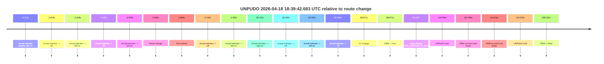
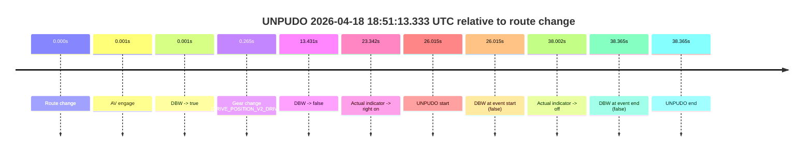
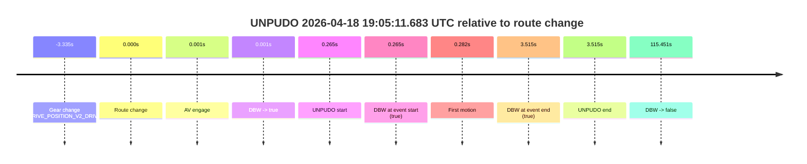
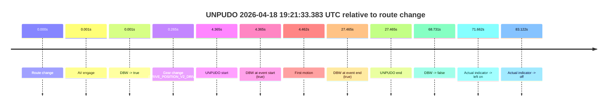
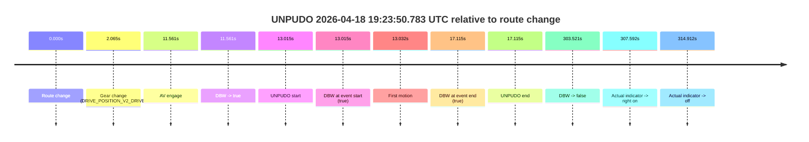

# Run Report: fme20007/2026-04-18--18-33-15--gen2-av-e7b22932-d090-4cd6-af42-a4ecf1fde920

| Field | Value |
|---|---|
| Run ID | `fme20007/2026-04-18--18-33-15--gen2-av-e7b22932-d090-4cd6-af42-a4ecf1fde920` |
| Date | `2026-04-18` |
| Model(s) | `eel-teal-outspoken` |
| Author | `zak` |
| Event count | `5` |

## unpudo 2026-04-18 18:39:42.683 UTC

| Field | Value |
|---|---|
| Model | `eel-teal-outspoken` |
| Author | `zak` |
| Run ID | `fme20007/2026-04-18--18-33-15--gen2-av-e7b22932-d090-4cd6-af42-a4ecf1fde920` |
| Date | `2026-04-18` |
| Time (UTC) | `18:39:42.683` |
| Event type | `unpudo` |
| Disengagement type | `none observed` |
| Route change | `found` |
| Console | [run](https://console.sso.wayve.ai/run/fme20007/2026-04-18--18-33-15--gen2-av-e7b22932-d090-4cd6-af42-a4ecf1fde920?id=&time-unixus=1776537582683317) |
| Foxglove | [segment](https://app.foxglove.dev/wayve-on-prem/p/prj_0dX18KZdVHg1fmmI/view?ds=foxglove-stream&ds.deviceName=fme20007&ds.start=2026-04-18T18%3A37%3A41.918327Z&ds.end=2026-04-18T18%3A43%3A01.109167Z&layoutId=lay_0e7VD4WIKDQGU73Y&time=2026-04-18T18%3A39%3A42.683317Z) |

### Event card: pass

- Pass: AV owns the credited unpudo from route change through the official unpudo window, the gear state is aligned at the anchor, and the vehicle moves without driver accelerator help in AV.

| Event | Time (UTC) | Delta from route change |
|---|---:|---:|
| Actual indicator already right on | 2026-04-18 18:37:42.699 | `-9.218s` |
| Actual indicator -> off | 2026-04-18 18:37:49.039 | `-2.878s` |
| Actual indicator -> left on | 2026-04-18 18:37:49.500 | `-2.418s` |
| Actual indicator -> off | 2026-04-18 18:37:51.479 | `-0.438s` |
| Actual indicator -> left on | 2026-04-18 18:37:51.839 | `-0.078s` |
| Route change | 2026-04-18 18:37:51.918 | `0.000s` |
| First motion | 2026-04-18 18:37:51.919 | `0.002s` |
| Actual indicator -> off | 2026-04-18 18:37:52.659 | `0.742s` |
| Actual indicator -> left on | 2026-04-18 18:37:55.680 | `3.762s` |
| Actual indicator -> right on | 2026-04-18 18:38:20.660 | `28.742s` |
| Actual indicator -> off | 2026-04-18 18:38:24.100 | `32.182s` |
| Actual indicator -> left on | 2026-04-18 18:38:45.259 | `53.342s` |
| Actual indicator -> off | 2026-04-18 18:38:48.299 | `56.382s` |
| AV engage | 2026-04-18 18:39:20.589 | `88.671s` |
| DBW -> true | 2026-04-18 18:39:20.589 | `88.671s` |
| Gear change (DRIVE_POSITION_V2_DRIVE) | 2026-04-18 18:39:21.083 | `89.165s` |
| UNPUDO start | 2026-04-18 18:39:42.683 | `110.765s` |
| DBW at event start (true) | 2026-04-18 18:39:42.683 | `110.765s` |
| DBW at event end (true) | 2026-04-18 18:39:46.133 | `114.215s` |
| UNPUDO end | 2026-04-18 18:39:46.133 | `114.215s` |
| DBW -> false | 2026-04-18 18:42:51.109 | `299.191s` |

| Metric | Value |
|---|---|
| Outcome | `pass` |
| Effective failure type | `none` |
| Route change status | `found` |
| DBW at event start | `true` |
| DBW at event end | `true` |
| Predicted gear at AV start | `DRIVE_POSITION_V2_DRIVE` |
| Actual gear at AV start | `DRIVE_POSITION_V2_PARK` |
| Predicted gear at event start | `DRIVE_POSITION_V2_DRIVE` |
| Actual gear at event start | `DRIVE_POSITION_V2_DRIVE` |
| Planned indicator direction | `INDICATORS_STATE_V2_RIGHT_ON` |
| Controller indicator direction | `INDICATORS_STATE_V2_RIGHT_ON` |
| Actual indicator direction | `INDICATORS_STATE_V2_OFF` |
| Actual indicator at maneuver end | `INDICATORS_STATE_V2_OFF` |
| Driver accel help in AV | `false` |
| Driver accel help timestamp | `n/a` |
| Max accel pedal pct in AV | `0.0%` |
| Max brake pedal pct in AV | `8.0%` |
| Max speed mps in AV | `4.564` |
| Success timing baseline | `route change` |
| Route -> AV | `88.671s` |
| AV -> event start | `22.094s` |
| AV -> first motion | `-88.669s` |
| Success baseline -> event start | `110.765s` |
| Success baseline -> first motion | `0.002s` |
| AV duration before disengagement | `210.520s` |
| Trajectory waypoint count | `37` |
| Driving-plan step count | `11` |

The scored portion starts from the AV-owned window, not from the pre-AV setup. Route-change search in the stopped pre-event segment was `found`, with the baseline therefore set to route change. At the event anchor the model predicts `DRIVE_POSITION_V2_DRIVE` and the actual gear is `DRIVE_POSITION_V2_DRIVE`. The effective model outcome is `pass` because `the credited unpudo stays AV-owned through the official unpudo window.`

### Resolution

| Field | Value |
|---|---|
| Final outcome | `pass` |
| Do we agree with this label? | `yes` |
| Source disengagement type | `none observed` |
| Resolved effective failure type | `none` |
| Confidence | `high` |

## unpudo 2026-04-18 18:51:13.333 UTC

| Field | Value |
|---|---|
| Model | `eel-teal-outspoken` |
| Author | `zak` |
| Run ID | `fme20007/2026-04-18--18-33-15--gen2-av-e7b22932-d090-4cd6-af42-a4ecf1fde920` |
| Date | `2026-04-18` |
| Time (UTC) | `18:51:13.333` |
| Event type | `unpudo` |
| Disengagement type | `none observed` |
| Route change | `found` |
| Console | [run](https://console.sso.wayve.ai/run/fme20007/2026-04-18--18-33-15--gen2-av-e7b22932-d090-4cd6-af42-a4ecf1fde920?id=&time-unixus=1776538273333304) |
| Foxglove | [segment](https://app.foxglove.dev/wayve-on-prem/p/prj_0dX18KZdVHg1fmmI/view?ds=foxglove-stream&ds.deviceName=fme20007&ds.start=2026-04-18T18%3A50%3A37.318288Z&ds.end=2026-04-18T18%3A51%3A35.683303Z&layoutId=lay_0e7VD4WIKDQGU73Y&time=2026-04-18T18%3A51%3A13.333304Z) |

### Event card: fail

- Fail: the credited unpudo does not stay AV-owned. The event window starts with DBW false, and the maneuver outcome lands outside a clean AV-owned segment.

| Event | Time (UTC) | Delta from route change |
|---|---:|---:|
| Route change | 2026-04-18 18:50:47.318 | `0.000s` |
| AV engage | 2026-04-18 18:50:47.319 | `0.001s` |
| DBW -> true | 2026-04-18 18:50:47.319 | `0.001s` |
| Gear change (DRIVE_POSITION_V2_DRIVE) | 2026-04-18 18:50:47.583 | `0.265s` |
| DBW -> false | 2026-04-18 18:51:00.749 | `13.431s` |
| Actual indicator -> right on | 2026-04-18 18:51:10.659 | `23.342s` |
| UNPUDO start | 2026-04-18 18:51:13.333 | `26.015s` |
| DBW at event start (false) | 2026-04-18 18:51:13.333 | `26.015s` |
| Actual indicator -> off | 2026-04-18 18:51:25.320 | `38.002s` |
| DBW at event end (false) | 2026-04-18 18:51:25.683 | `38.365s` |
| UNPUDO end | 2026-04-18 18:51:25.683 | `38.365s` |

| Metric | Value |
|---|---|
| Outcome | `fail` |
| Effective failure type | `not_av_owned` |
| Route change status | `found` |
| DBW at event start | `false` |
| DBW at event end | `false` |
| Predicted gear at AV start | `DRIVE_POSITION_V2_PARK` |
| Actual gear at AV start | `DRIVE_POSITION_V2_PARK` |
| Predicted gear at event start | `DRIVE_POSITION_V2_DRIVE` |
| Actual gear at event start | `DRIVE_POSITION_V2_DRIVE` |
| Planned indicator direction | `INDICATORS_STATE_V2_RIGHT_ON` |
| Controller indicator direction | `INDICATORS_STATE_V2_RIGHT_ON` |
| Actual indicator direction | `INDICATORS_STATE_V2_RIGHT_ON` |
| Actual indicator at maneuver end | `INDICATORS_STATE_V2_OFF` |
| Driver accel help in AV | `false` |
| Driver accel help timestamp | `n/a` |
| Max accel pedal pct in AV | `0.0%` |
| Max brake pedal pct in AV | `9.1%` |
| Max speed mps in AV | `0.000` |
| Success timing baseline | `route change` |
| Route -> AV | `0.001s` |
| AV -> event start | `26.014s` |
| AV -> first motion | `n/a` |
| Success baseline -> event start | `26.015s` |
| Success baseline -> first motion | `n/a` |
| AV duration before disengagement | `13.430s` |
| Trajectory waypoint count | `38` |
| Driving-plan step count | `11` |

The scored portion starts from the AV-owned window, not from the pre-AV setup. Route-change search in the stopped pre-event segment was `found`, with the baseline therefore set to route change. At the event anchor the model predicts `DRIVE_POSITION_V2_DRIVE` and the actual gear is `DRIVE_POSITION_V2_DRIVE`. The effective model outcome is `fail` because `not_av_owned.`

### Resolution

| Field | Value |
|---|---|
| Final outcome | `fail` |
| Do we agree with this label? | `yes` |
| Source disengagement type | `none observed` |
| Resolved effective failure type | `not_av_owned` |
| Confidence | `high` |

## unpudo 2026-04-18 19:05:11.683 UTC

| Field | Value |
|---|---|
| Model | `eel-teal-outspoken` |
| Author | `zak` |
| Run ID | `fme20007/2026-04-18--18-33-15--gen2-av-e7b22932-d090-4cd6-af42-a4ecf1fde920` |
| Date | `2026-04-18` |
| Time (UTC) | `19:05:11.683` |
| Event type | `unpudo` |
| Disengagement type | `none observed` |
| Route change | `found` |
| Console | [run](https://console.sso.wayve.ai/run/fme20007/2026-04-18--18-33-15--gen2-av-e7b22932-d090-4cd6-af42-a4ecf1fde920?id=&time-unixus=1776539111683320) |
| Foxglove | [segment](https://app.foxglove.dev/wayve-on-prem/p/prj_0dX18KZdVHg1fmmI/view?ds=foxglove-stream&ds.deviceName=fme20007&ds.start=2026-04-18T19%3A04%3A58.083312Z&ds.end=2026-04-18T19%3A07%3A16.869504Z&layoutId=lay_0e7VD4WIKDQGU73Y&time=2026-04-18T19%3A05%3A11.683320Z) |

### Event card: pass

- Pass: AV owns the credited unpudo from route change through the official unpudo window, the gear state is aligned at the anchor, and the vehicle moves without driver accelerator help in AV.

| Event | Time (UTC) | Delta from route change |
|---|---:|---:|
| Gear change (DRIVE_POSITION_V2_DRIVE) | 2026-04-18 19:05:08.083 | `-3.335s` |
| Route change | 2026-04-18 19:05:11.418 | `0.000s` |
| AV engage | 2026-04-18 19:05:11.419 | `0.001s` |
| DBW -> true | 2026-04-18 19:05:11.419 | `0.001s` |
| UNPUDO start | 2026-04-18 19:05:11.683 | `0.265s` |
| DBW at event start (true) | 2026-04-18 19:05:11.683 | `0.265s` |
| First motion | 2026-04-18 19:05:11.700 | `0.282s` |
| DBW at event end (true) | 2026-04-18 19:05:14.933 | `3.515s` |
| UNPUDO end | 2026-04-18 19:05:14.933 | `3.515s` |
| DBW -> false | 2026-04-18 19:07:06.869 | `115.451s` |

| Metric | Value |
|---|---|
| Outcome | `pass` |
| Effective failure type | `none` |
| Route change status | `found` |
| DBW at event start | `true` |
| DBW at event end | `true` |
| Predicted gear at AV start | `DRIVE_POSITION_V2_DRIVE` |
| Actual gear at AV start | `DRIVE_POSITION_V2_DRIVE` |
| Predicted gear at event start | `DRIVE_POSITION_V2_DRIVE` |
| Actual gear at event start | `DRIVE_POSITION_V2_DRIVE` |
| Planned indicator direction | `INDICATORS_STATE_V2_RIGHT_ON` |
| Controller indicator direction | `INDICATORS_STATE_V2_RIGHT_ON` |
| Actual indicator direction | `INDICATORS_STATE_V2_OFF` |
| Actual indicator at maneuver end | `INDICATORS_STATE_V2_OFF` |
| Driver accel help in AV | `false` |
| Driver accel help timestamp | `n/a` |
| Max accel pedal pct in AV | `0.0%` |
| Max brake pedal pct in AV | `0.0%` |
| Max speed mps in AV | `5.369` |
| Success timing baseline | `route change` |
| Route -> AV | `0.001s` |
| AV -> event start | `0.264s` |
| AV -> first motion | `0.281s` |
| Success baseline -> event start | `0.265s` |
| Success baseline -> first motion | `0.282s` |
| AV duration before disengagement | `115.450s` |
| Trajectory waypoint count | `37` |
| Driving-plan step count | `11` |

The scored portion starts from the AV-owned window, not from the pre-AV setup. Route-change search in the stopped pre-event segment was `found`, with the baseline therefore set to route change. At the event anchor the model predicts `DRIVE_POSITION_V2_DRIVE` and the actual gear is `DRIVE_POSITION_V2_DRIVE`. The effective model outcome is `pass` because `the credited unpudo stays AV-owned through the official unpudo window.`

### Resolution

| Field | Value |
|---|---|
| Final outcome | `pass` |
| Do we agree with this label? | `yes` |
| Source disengagement type | `none observed` |
| Resolved effective failure type | `none` |
| Confidence | `high` |

## unpudo 2026-04-18 19:21:33.383 UTC

| Field | Value |
|---|---|
| Model | `eel-teal-outspoken` |
| Author | `zak` |
| Run ID | `fme20007/2026-04-18--18-33-15--gen2-av-e7b22932-d090-4cd6-af42-a4ecf1fde920` |
| Date | `2026-04-18` |
| Time (UTC) | `19:21:33.383` |
| Event type | `unpudo` |
| Disengagement type | `none observed` |
| Route change | `found` |
| Console | [run](https://console.sso.wayve.ai/run/fme20007/2026-04-18--18-33-15--gen2-av-e7b22932-d090-4cd6-af42-a4ecf1fde920?id=&time-unixus=1776540093383313) |
| Foxglove | [segment](https://app.foxglove.dev/wayve-on-prem/p/prj_0dX18KZdVHg1fmmI/view?ds=foxglove-stream&ds.deviceName=fme20007&ds.start=2026-04-18T19%3A21%3A19.018265Z&ds.end=2026-04-18T19%3A22%3A47.749546Z&layoutId=lay_0e7VD4WIKDQGU73Y&time=2026-04-18T19%3A21%3A33.383313Z) |

### Event card: pass

- Pass: AV owns the credited unpudo from route change through the official unpudo window, the gear state is aligned at the anchor, and the vehicle moves without driver accelerator help in AV.

| Event | Time (UTC) | Delta from route change |
|---|---:|---:|
| Route change | 2026-04-18 19:21:29.018 | `0.000s` |
| AV engage | 2026-04-18 19:21:29.019 | `0.001s` |
| DBW -> true | 2026-04-18 19:21:29.019 | `0.001s` |
| Gear change (DRIVE_POSITION_V2_DRIVE) | 2026-04-18 19:21:29.283 | `0.265s` |
| UNPUDO start | 2026-04-18 19:21:33.383 | `4.365s` |
| DBW at event start (true) | 2026-04-18 19:21:33.383 | `4.365s` |
| First motion | 2026-04-18 19:21:33.479 | `4.462s` |
| DBW at event end (true) | 2026-04-18 19:21:56.483 | `27.465s` |
| UNPUDO end | 2026-04-18 19:21:56.483 | `27.465s` |
| DBW -> false | 2026-04-18 19:22:37.749 | `68.731s` |
| Actual indicator -> left on | 2026-04-18 19:22:40.679 | `71.662s` |
| Actual indicator -> off | 2026-04-18 19:22:52.139 | `83.122s` |

| Metric | Value |
|---|---|
| Outcome | `pass` |
| Effective failure type | `none` |
| Route change status | `found` |
| DBW at event start | `true` |
| DBW at event end | `true` |
| Predicted gear at AV start | `DRIVE_POSITION_V2_PARK` |
| Actual gear at AV start | `DRIVE_POSITION_V2_PARK` |
| Predicted gear at event start | `DRIVE_POSITION_V2_DRIVE` |
| Actual gear at event start | `DRIVE_POSITION_V2_DRIVE` |
| Planned indicator direction | `INDICATORS_STATE_V2_LEFT_ON` |
| Controller indicator direction | `INDICATORS_STATE_V2_LEFT_ON` |
| Actual indicator direction | `INDICATORS_STATE_V2_OFF` |
| Actual indicator at maneuver end | `INDICATORS_STATE_V2_OFF` |
| Driver accel help in AV | `false` |
| Driver accel help timestamp | `n/a` |
| Max accel pedal pct in AV | `0.0%` |
| Max brake pedal pct in AV | `8.0%` |
| Max speed mps in AV | `2.367` |
| Success timing baseline | `route change` |
| Route -> AV | `0.001s` |
| AV -> event start | `4.364s` |
| AV -> first motion | `4.460s` |
| Success baseline -> event start | `4.365s` |
| Success baseline -> first motion | `4.462s` |
| AV duration before disengagement | `68.730s` |
| Trajectory waypoint count | `37` |
| Driving-plan step count | `11` |

The scored portion starts from the AV-owned window, not from the pre-AV setup. Route-change search in the stopped pre-event segment was `found`, with the baseline therefore set to route change. At the event anchor the model predicts `DRIVE_POSITION_V2_DRIVE` and the actual gear is `DRIVE_POSITION_V2_DRIVE`. The effective model outcome is `pass` because `the credited unpudo stays AV-owned through the official unpudo window.`

### Resolution

| Field | Value |
|---|---|
| Final outcome | `pass` |
| Do we agree with this label? | `yes` |
| Source disengagement type | `none observed` |
| Resolved effective failure type | `none` |
| Confidence | `high` |

## unpudo 2026-04-18 19:23:50.783 UTC

| Field | Value |
|---|---|
| Model | `eel-teal-outspoken` |
| Author | `zak` |
| Run ID | `fme20007/2026-04-18--18-33-15--gen2-av-e7b22932-d090-4cd6-af42-a4ecf1fde920` |
| Date | `2026-04-18` |
| Time (UTC) | `19:23:50.783` |
| Event type | `unpudo` |
| Disengagement type | `none observed` |
| Route change | `found` |
| Console | [run](https://console.sso.wayve.ai/run/fme20007/2026-04-18--18-33-15--gen2-av-e7b22932-d090-4cd6-af42-a4ecf1fde920?id=&time-unixus=1776540230783305) |
| Foxglove | [segment](https://app.foxglove.dev/wayve-on-prem/p/prj_0dX18KZdVHg1fmmI/view?ds=foxglove-stream&ds.deviceName=fme20007&ds.start=2026-04-18T19%3A23%3A27.768298Z&ds.end=2026-04-18T19%3A28%3A51.289272Z&layoutId=lay_0e7VD4WIKDQGU73Y&time=2026-04-18T19%3A23%3A50.783305Z) |

### Event card: pass

- Pass: AV owns the credited unpudo from route change through the official unpudo window, the gear state is aligned at the anchor, and the vehicle moves without driver accelerator help in AV.

| Event | Time (UTC) | Delta from route change |
|---|---:|---:|
| Route change | 2026-04-18 19:23:37.768 | `0.000s` |
| Gear change (DRIVE_POSITION_V2_DRIVE) | 2026-04-18 19:23:39.833 | `2.065s` |
| AV engage | 2026-04-18 19:23:49.329 | `11.561s` |
| DBW -> true | 2026-04-18 19:23:49.329 | `11.561s` |
| UNPUDO start | 2026-04-18 19:23:50.783 | `13.015s` |
| DBW at event start (true) | 2026-04-18 19:23:50.783 | `13.015s` |
| First motion | 2026-04-18 19:23:50.799 | `13.032s` |
| DBW at event end (true) | 2026-04-18 19:23:54.883 | `17.115s` |
| UNPUDO end | 2026-04-18 19:23:54.883 | `17.115s` |
| DBW -> false | 2026-04-18 19:28:41.289 | `303.521s` |
| Actual indicator -> right on | 2026-04-18 19:28:45.359 | `307.592s` |
| Actual indicator -> off | 2026-04-18 19:28:52.680 | `314.912s` |

| Metric | Value |
|---|---|
| Outcome | `pass` |
| Effective failure type | `none` |
| Route change status | `found` |
| DBW at event start | `true` |
| DBW at event end | `true` |
| Predicted gear at AV start | `DRIVE_POSITION_V2_DRIVE` |
| Actual gear at AV start | `DRIVE_POSITION_V2_DRIVE` |
| Predicted gear at event start | `DRIVE_POSITION_V2_DRIVE` |
| Actual gear at event start | `DRIVE_POSITION_V2_DRIVE` |
| Planned indicator direction | `INDICATORS_STATE_V2_RIGHT_ON` |
| Controller indicator direction | `INDICATORS_STATE_V2_RIGHT_ON` |
| Actual indicator direction | `INDICATORS_STATE_V2_OFF` |
| Actual indicator at maneuver end | `INDICATORS_STATE_V2_OFF` |
| Driver accel help in AV | `false` |
| Driver accel help timestamp | `n/a` |
| Max accel pedal pct in AV | `0.0%` |
| Max brake pedal pct in AV | `8.9%` |
| Max speed mps in AV | `4.408` |
| Success timing baseline | `route change` |
| Route -> AV | `11.561s` |
| AV -> event start | `1.454s` |
| AV -> first motion | `1.470s` |
| Success baseline -> event start | `13.015s` |
| Success baseline -> first motion | `13.032s` |
| AV duration before disengagement | `291.960s` |
| Trajectory waypoint count | `37` |
| Driving-plan step count | `11` |

The scored portion starts from the AV-owned window, not from the pre-AV setup. Route-change search in the stopped pre-event segment was `found`, with the baseline therefore set to route change. At the event anchor the model predicts `DRIVE_POSITION_V2_DRIVE` and the actual gear is `DRIVE_POSITION_V2_DRIVE`. The effective model outcome is `pass` because `the credited unpudo stays AV-owned through the official unpudo window.`

### Resolution

| Field | Value |
|---|---|
| Final outcome | `pass` |
| Do we agree with this label? | `yes` |
| Source disengagement type | `none observed` |
| Resolved effective failure type | `none` |
| Confidence | `high` |
