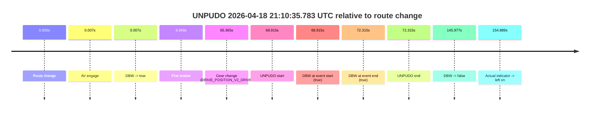
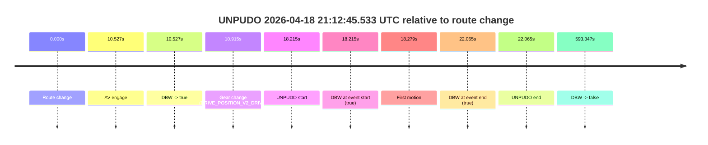
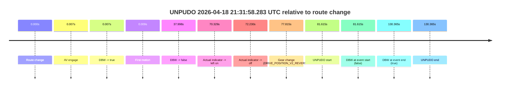
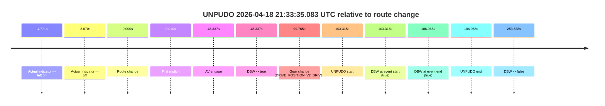
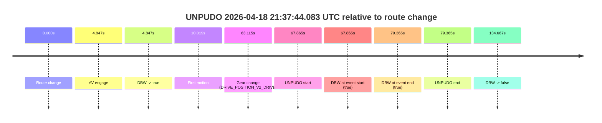
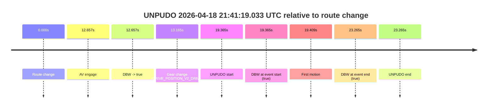
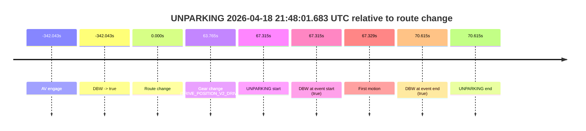

# Run Report: fme20007/2026-04-18--20-54-48--gen2-av-b61d2dfa-2e75-4f20-916e-a175d7abb031

| Field | Value |
|---|---|
| Run ID | `fme20007/2026-04-18--20-54-48--gen2-av-b61d2dfa-2e75-4f20-916e-a175d7abb031` |
| Date | `2026-04-18` |
| Model(s) | `eel-teal-outspoken` |
| Author | `zak` |
| Event count | `7` |

## unpudo 2026-04-18 21:10:35.783 UTC

| Field | Value |
|---|---|
| Model | `eel-teal-outspoken` |
| Author | `zak` |
| Run ID | `fme20007/2026-04-18--20-54-48--gen2-av-b61d2dfa-2e75-4f20-916e-a175d7abb031` |
| Date | `2026-04-18` |
| Time (UTC) | `21:10:35.783` |
| Event type | `unpudo` |
| Disengagement type | `none observed` |
| Route change | `found` |
| Console | [run](https://console.sso.wayve.ai/run/fme20007/2026-04-18--20-54-48--gen2-av-b61d2dfa-2e75-4f20-916e-a175d7abb031?id=&time-unixus=1776546635783297) |
| Foxglove | [segment](https://app.foxglove.dev/wayve-on-prem/p/prj_0dX18KZdVHg1fmmI/view?ds=foxglove-stream&ds.deviceName=fme20007&ds.start=2026-04-18T21%3A09%3A16.868247Z&ds.end=2026-04-18T21%3A12%3A02.845445Z&layoutId=lay_0e7VD4WIKDQGU73Y&time=2026-04-18T21%3A10%3A35.783297Z) |

### Event card: pass

- Pass: AV owns the credited unpudo from route change through the official unpudo window, the gear state is aligned at the anchor, and the vehicle moves without driver accelerator help in AV.

| Event | Time (UTC) | Delta from route change |
|---|---:|---:|
| Route change | 2026-04-18 21:09:26.868 | `0.000s` |
| AV engage | 2026-04-18 21:09:26.875 | `0.007s` |
| DBW -> true | 2026-04-18 21:09:26.875 | `0.007s` |
| First motion | 2026-04-18 21:09:36.817 | `9.949s` |
| Gear change (DRIVE_POSITION_V2_DRIVE) | 2026-04-18 21:10:32.233 | `65.365s` |
| UNPUDO start | 2026-04-18 21:10:35.783 | `68.915s` |
| DBW at event start (true) | 2026-04-18 21:10:35.783 | `68.915s` |
| DBW at event end (true) | 2026-04-18 21:10:39.183 | `72.315s` |
| UNPUDO end | 2026-04-18 21:10:39.183 | `72.315s` |
| DBW -> false | 2026-04-18 21:11:52.845 | `145.977s` |
| Actual indicator -> left on | 2026-04-18 21:12:01.757 | `154.889s` |

| Metric | Value |
|---|---|
| Outcome | `pass` |
| Effective failure type | `none` |
| Route change status | `found` |
| DBW at event start | `true` |
| DBW at event end | `true` |
| Predicted gear at AV start | `DRIVE_POSITION_V2_PARK` |
| Actual gear at AV start | `DRIVE_POSITION_V2_PARK` |
| Predicted gear at event start | `DRIVE_POSITION_V2_DRIVE` |
| Actual gear at event start | `DRIVE_POSITION_V2_DRIVE` |
| Planned indicator direction | `INDICATORS_STATE_V2_RIGHT_ON` |
| Controller indicator direction | `INDICATORS_STATE_V2_RIGHT_ON` |
| Actual indicator direction | `INDICATORS_STATE_V2_OFF` |
| Actual indicator at maneuver end | `INDICATORS_STATE_V2_OFF` |
| Driver accel help in AV | `false` |
| Driver accel help timestamp | `n/a` |
| Max accel pedal pct in AV | `0.0%` |
| Max brake pedal pct in AV | `14.8%` |
| Max speed mps in AV | `7.611` |
| Success timing baseline | `route change` |
| Route -> AV | `0.007s` |
| AV -> event start | `68.908s` |
| AV -> first motion | `9.942s` |
| Success baseline -> event start | `68.915s` |
| Success baseline -> first motion | `9.949s` |
| AV duration before disengagement | `145.970s` |
| Trajectory waypoint count | `36` |
| Driving-plan step count | `11` |

The scored portion starts from the AV-owned window, not from the pre-AV setup. Route-change search in the stopped pre-event segment was `found`, with the baseline therefore set to route change. At the event anchor the model predicts `DRIVE_POSITION_V2_DRIVE` and the actual gear is `DRIVE_POSITION_V2_DRIVE`. The effective model outcome is `pass` because `the credited unpudo stays AV-owned through the official unpudo window.`

### Resolution

| Field | Value |
|---|---|
| Final outcome | `pass` |
| Do we agree with this label? | `yes` |
| Source disengagement type | `none observed` |
| Resolved effective failure type | `none` |
| Confidence | `high` |

## unpudo 2026-04-18 21:12:45.533 UTC

| Field | Value |
|---|---|
| Model | `eel-teal-outspoken` |
| Author | `zak` |
| Run ID | `fme20007/2026-04-18--20-54-48--gen2-av-b61d2dfa-2e75-4f20-916e-a175d7abb031` |
| Date | `2026-04-18` |
| Time (UTC) | `21:12:45.533` |
| Event type | `unpudo` |
| Disengagement type | `none observed` |
| Route change | `found` |
| Console | [run](https://console.sso.wayve.ai/run/fme20007/2026-04-18--20-54-48--gen2-av-b61d2dfa-2e75-4f20-916e-a175d7abb031?id=&time-unixus=1776546765533299) |
| Foxglove | [segment](https://app.foxglove.dev/wayve-on-prem/p/prj_0dX18KZdVHg1fmmI/view?ds=foxglove-stream&ds.deviceName=fme20007&ds.start=2026-04-18T21%3A12%3A17.318417Z&ds.end=2026-04-18T21%3A22%3A30.665376Z&layoutId=lay_0e7VD4WIKDQGU73Y&time=2026-04-18T21%3A12%3A45.533299Z) |

### Event card: pass

- Pass: AV owns the credited unpudo from route change through the official unpudo window, the gear state is aligned at the anchor, and the vehicle moves without driver accelerator help in AV.

| Event | Time (UTC) | Delta from route change |
|---|---:|---:|
| Route change | 2026-04-18 21:12:27.318 | `0.000s` |
| AV engage | 2026-04-18 21:12:37.845 | `10.527s` |
| DBW -> true | 2026-04-18 21:12:37.845 | `10.527s` |
| Gear change (DRIVE_POSITION_V2_DRIVE) | 2026-04-18 21:12:38.233 | `10.915s` |
| UNPUDO start | 2026-04-18 21:12:45.533 | `18.215s` |
| DBW at event start (true) | 2026-04-18 21:12:45.533 | `18.215s` |
| First motion | 2026-04-18 21:12:45.597 | `18.279s` |
| DBW at event end (true) | 2026-04-18 21:12:49.383 | `22.065s` |
| UNPUDO end | 2026-04-18 21:12:49.383 | `22.065s` |
| DBW -> false | 2026-04-18 21:22:20.665 | `593.347s` |

| Metric | Value |
|---|---|
| Outcome | `pass` |
| Effective failure type | `none` |
| Route change status | `found` |
| DBW at event start | `true` |
| DBW at event end | `true` |
| Predicted gear at AV start | `DRIVE_POSITION_V2_DRIVE` |
| Actual gear at AV start | `DRIVE_POSITION_V2_PARK` |
| Predicted gear at event start | `DRIVE_POSITION_V2_DRIVE` |
| Actual gear at event start | `DRIVE_POSITION_V2_DRIVE` |
| Planned indicator direction | `INDICATORS_STATE_V2_RIGHT_ON` |
| Controller indicator direction | `INDICATORS_STATE_V2_RIGHT_ON` |
| Actual indicator direction | `INDICATORS_STATE_V2_OFF` |
| Actual indicator at maneuver end | `INDICATORS_STATE_V2_OFF` |
| Driver accel help in AV | `false` |
| Driver accel help timestamp | `n/a` |
| Max accel pedal pct in AV | `0.0%` |
| Max brake pedal pct in AV | `8.0%` |
| Max speed mps in AV | `4.769` |
| Success timing baseline | `route change` |
| Route -> AV | `10.527s` |
| AV -> event start | `7.688s` |
| AV -> first motion | `7.752s` |
| Success baseline -> event start | `18.215s` |
| Success baseline -> first motion | `18.279s` |
| AV duration before disengagement | `582.820s` |
| Trajectory waypoint count | `37` |
| Driving-plan step count | `11` |

The scored portion starts from the AV-owned window, not from the pre-AV setup. Route-change search in the stopped pre-event segment was `found`, with the baseline therefore set to route change. At the event anchor the model predicts `DRIVE_POSITION_V2_DRIVE` and the actual gear is `DRIVE_POSITION_V2_DRIVE`. The effective model outcome is `pass` because `the credited unpudo stays AV-owned through the official unpudo window.`

### Resolution

| Field | Value |
|---|---|
| Final outcome | `pass` |
| Do we agree with this label? | `yes` |
| Source disengagement type | `none observed` |
| Resolved effective failure type | `none` |
| Confidence | `high` |

## unpudo 2026-04-18 21:31:58.283 UTC

| Field | Value |
|---|---|
| Model | `eel-teal-outspoken` |
| Author | `zak` |
| Run ID | `fme20007/2026-04-18--20-54-48--gen2-av-b61d2dfa-2e75-4f20-916e-a175d7abb031` |
| Date | `2026-04-18` |
| Time (UTC) | `21:31:58.283` |
| Event type | `unpudo` |
| Disengagement type | `none observed` |
| Route change | `found` |
| Console | [run](https://console.sso.wayve.ai/run/fme20007/2026-04-18--20-54-48--gen2-av-b61d2dfa-2e75-4f20-916e-a175d7abb031?id=&time-unixus=1776547918283308) |
| Foxglove | [segment](https://app.foxglove.dev/wayve-on-prem/p/prj_0dX18KZdVHg1fmmI/view?ds=foxglove-stream&ds.deviceName=fme20007&ds.start=2026-04-18T21%3A30%3A26.668283Z&ds.end=2026-04-18T21%3A32%3A57.033299Z&layoutId=lay_0e7VD4WIKDQGU73Y&time=2026-04-18T21%3A31%3A58.283308Z) |

### Event card: fail

- Fail: the credited unpudo does not stay AV-owned. The event window starts with DBW false, and the maneuver outcome lands outside a clean AV-owned segment.

| Event | Time (UTC) | Delta from route change |
|---|---:|---:|
| Route change | 2026-04-18 21:30:36.668 | `0.000s` |
| AV engage | 2026-04-18 21:30:36.675 | `0.007s` |
| DBW -> true | 2026-04-18 21:30:36.675 | `0.007s` |
| First motion | 2026-04-18 21:30:36.677 | `0.009s` |
| DBW -> false | 2026-04-18 21:31:14.666 | `37.998s` |
| Actual indicator -> left on | 2026-04-18 21:31:46.997 | `70.329s` |
| Actual indicator -> off | 2026-04-18 21:31:48.897 | `72.230s` |
| Gear change (DRIVE_POSITION_V2_REVERSE) | 2026-04-18 21:31:54.483 | `77.815s` |
| UNPUDO start | 2026-04-18 21:31:58.283 | `81.615s` |
| DBW at event start (false) | 2026-04-18 21:31:58.283 | `81.615s` |
| DBW at event end (true) | 2026-04-18 21:32:47.033 | `130.365s` |
| UNPUDO end | 2026-04-18 21:32:47.033 | `130.365s` |

| Metric | Value |
|---|---|
| Outcome | `fail` |
| Effective failure type | `not_av_owned` |
| Route change status | `found` |
| DBW at event start | `false` |
| DBW at event end | `true` |
| Predicted gear at AV start | `DRIVE_POSITION_V2_DRIVE` |
| Actual gear at AV start | `DRIVE_POSITION_V2_DRIVE` |
| Predicted gear at event start | `DRIVE_POSITION_V2_REVERSE` |
| Actual gear at event start | `DRIVE_POSITION_V2_REVERSE` |
| Planned indicator direction | `INDICATORS_STATE_V2_OFF` |
| Controller indicator direction | `INDICATORS_STATE_V2_OFF` |
| Actual indicator direction | `INDICATORS_STATE_V2_OFF` |
| Actual indicator at maneuver end | `INDICATORS_STATE_V2_OFF` |
| Driver accel help in AV | `false` |
| Driver accel help timestamp | `n/a` |
| Max accel pedal pct in AV | `0.0%` |
| Max brake pedal pct in AV | `8.0%` |
| Max speed mps in AV | `6.719` |
| Success timing baseline | `route change` |
| Route -> AV | `0.007s` |
| AV -> event start | `81.608s` |
| AV -> first motion | `0.002s` |
| Success baseline -> event start | `81.615s` |
| Success baseline -> first motion | `0.009s` |
| AV duration before disengagement | `37.991s` |
| Trajectory waypoint count | `36` |
| Driving-plan step count | `11` |

The scored portion starts from the AV-owned window, not from the pre-AV setup. Route-change search in the stopped pre-event segment was `found`, with the baseline therefore set to route change. At the event anchor the model predicts `DRIVE_POSITION_V2_REVERSE` and the actual gear is `DRIVE_POSITION_V2_REVERSE`. The effective model outcome is `fail` because `not_av_owned.`

### Resolution

| Field | Value |
|---|---|
| Final outcome | `fail` |
| Do we agree with this label? | `yes` |
| Source disengagement type | `none observed` |
| Resolved effective failure type | `not_av_owned` |
| Confidence | `high` |

## unpudo 2026-04-18 21:33:35.083 UTC

| Field | Value |
|---|---|
| Model | `eel-teal-outspoken` |
| Author | `zak` |
| Run ID | `fme20007/2026-04-18--20-54-48--gen2-av-b61d2dfa-2e75-4f20-916e-a175d7abb031` |
| Date | `2026-04-18` |
| Time (UTC) | `21:33:35.083` |
| Event type | `unpudo` |
| Disengagement type | `none observed` |
| Route change | `found` |
| Console | [run](https://console.sso.wayve.ai/run/fme20007/2026-04-18--20-54-48--gen2-av-b61d2dfa-2e75-4f20-916e-a175d7abb031?id=&time-unixus=1776548015083313) |
| Foxglove | [segment](https://app.foxglove.dev/wayve-on-prem/p/prj_0dX18KZdVHg1fmmI/view?ds=foxglove-stream&ds.deviceName=fme20007&ds.start=2026-04-18T21%3A31%3A41.768333Z&ds.end=2026-04-18T21%3A36%3A15.306437Z&layoutId=lay_0e7VD4WIKDQGU73Y&time=2026-04-18T21%3A33%3A35.083313Z) |

### Event card: pass

- Pass: AV owns the credited unpudo from route change through the official unpudo window, the gear state is aligned at the anchor, and the vehicle moves without driver accelerator help in AV.

| Event | Time (UTC) | Delta from route change |
|---|---:|---:|
| Actual indicator -> left on | 2026-04-18 21:31:46.997 | `-4.771s` |
| Actual indicator -> off | 2026-04-18 21:31:48.897 | `-2.870s` |
| Route change | 2026-04-18 21:31:51.768 | `0.000s` |
| First motion | 2026-04-18 21:31:51.777 | `0.010s` |
| AV engage | 2026-04-18 21:32:40.105 | `48.337s` |
| DBW -> true | 2026-04-18 21:32:40.105 | `48.337s` |
| Gear change (DRIVE_POSITION_V2_DRIVE) | 2026-04-18 21:33:31.533 | `99.765s` |
| UNPUDO start | 2026-04-18 21:33:35.083 | `103.315s` |
| DBW at event start (true) | 2026-04-18 21:33:35.083 | `103.315s` |
| DBW at event end (true) | 2026-04-18 21:33:38.733 | `106.965s` |
| UNPUDO end | 2026-04-18 21:33:38.733 | `106.965s` |
| DBW -> false | 2026-04-18 21:36:05.306 | `253.538s` |

| Metric | Value |
|---|---|
| Outcome | `pass` |
| Effective failure type | `none` |
| Route change status | `found` |
| DBW at event start | `true` |
| DBW at event end | `true` |
| Predicted gear at AV start | `DRIVE_POSITION_V2_PARK` |
| Actual gear at AV start | `DRIVE_POSITION_V2_PARK` |
| Predicted gear at event start | `DRIVE_POSITION_V2_DRIVE` |
| Actual gear at event start | `DRIVE_POSITION_V2_DRIVE` |
| Planned indicator direction | `INDICATORS_STATE_V2_RIGHT_ON` |
| Controller indicator direction | `INDICATORS_STATE_V2_RIGHT_ON` |
| Actual indicator direction | `INDICATORS_STATE_V2_OFF` |
| Actual indicator at maneuver end | `INDICATORS_STATE_V2_OFF` |
| Driver accel help in AV | `false` |
| Driver accel help timestamp | `n/a` |
| Max accel pedal pct in AV | `0.0%` |
| Max brake pedal pct in AV | `8.2%` |
| Max speed mps in AV | `5.600` |
| Success timing baseline | `route change` |
| Route -> AV | `48.337s` |
| AV -> event start | `54.978s` |
| AV -> first motion | `-48.328s` |
| Success baseline -> event start | `103.315s` |
| Success baseline -> first motion | `0.010s` |
| AV duration before disengagement | `205.201s` |
| Trajectory waypoint count | `36` |
| Driving-plan step count | `11` |

The scored portion starts from the AV-owned window, not from the pre-AV setup. Route-change search in the stopped pre-event segment was `found`, with the baseline therefore set to route change. At the event anchor the model predicts `DRIVE_POSITION_V2_DRIVE` and the actual gear is `DRIVE_POSITION_V2_DRIVE`. The effective model outcome is `pass` because `the credited unpudo stays AV-owned through the official unpudo window.`

### Resolution

| Field | Value |
|---|---|
| Final outcome | `pass` |
| Do we agree with this label? | `yes` |
| Source disengagement type | `none observed` |
| Resolved effective failure type | `none` |
| Confidence | `high` |

## unpudo 2026-04-18 21:37:44.083 UTC

| Field | Value |
|---|---|
| Model | `eel-teal-outspoken` |
| Author | `zak` |
| Run ID | `fme20007/2026-04-18--20-54-48--gen2-av-b61d2dfa-2e75-4f20-916e-a175d7abb031` |
| Date | `2026-04-18` |
| Time (UTC) | `21:37:44.083` |
| Event type | `unpudo` |
| Disengagement type | `none observed` |
| Route change | `found` |
| Console | [run](https://console.sso.wayve.ai/run/fme20007/2026-04-18--20-54-48--gen2-av-b61d2dfa-2e75-4f20-916e-a175d7abb031?id=&time-unixus=1776548264083320) |
| Foxglove | [segment](https://app.foxglove.dev/wayve-on-prem/p/prj_0dX18KZdVHg1fmmI/view?ds=foxglove-stream&ds.deviceName=fme20007&ds.start=2026-04-18T21%3A36%3A26.218426Z&ds.end=2026-04-18T21%3A39%3A00.885546Z&layoutId=lay_0e7VD4WIKDQGU73Y&time=2026-04-18T21%3A37%3A44.083320Z) |

### Event card: pass

- Pass: AV owns the credited unpudo from route change through the official unpudo window, the gear state is aligned at the anchor, and the vehicle moves without driver accelerator help in AV.

| Event | Time (UTC) | Delta from route change |
|---|---:|---:|
| Route change | 2026-04-18 21:36:36.218 | `0.000s` |
| AV engage | 2026-04-18 21:36:41.065 | `4.847s` |
| DBW -> true | 2026-04-18 21:36:41.065 | `4.847s` |
| First motion | 2026-04-18 21:36:46.237 | `10.019s` |
| Gear change (DRIVE_POSITION_V2_DRIVE) | 2026-04-18 21:37:39.333 | `63.115s` |
| UNPUDO start | 2026-04-18 21:37:44.083 | `67.865s` |
| DBW at event start (true) | 2026-04-18 21:37:44.083 | `67.865s` |
| DBW at event end (true) | 2026-04-18 21:37:55.583 | `79.365s` |
| UNPUDO end | 2026-04-18 21:37:55.583 | `79.365s` |
| DBW -> false | 2026-04-18 21:38:50.885 | `134.667s` |

| Metric | Value |
|---|---|
| Outcome | `pass` |
| Effective failure type | `none` |
| Route change status | `found` |
| DBW at event start | `true` |
| DBW at event end | `true` |
| Predicted gear at AV start | `DRIVE_POSITION_V2_DRIVE` |
| Actual gear at AV start | `DRIVE_POSITION_V2_PARK` |
| Predicted gear at event start | `DRIVE_POSITION_V2_DRIVE` |
| Actual gear at event start | `DRIVE_POSITION_V2_DRIVE` |
| Planned indicator direction | `INDICATORS_STATE_V2_LEFT_ON` |
| Controller indicator direction | `INDICATORS_STATE_V2_LEFT_ON` |
| Actual indicator direction | `INDICATORS_STATE_V2_OFF` |
| Actual indicator at maneuver end | `INDICATORS_STATE_V2_OFF` |
| Driver accel help in AV | `false` |
| Driver accel help timestamp | `n/a` |
| Max accel pedal pct in AV | `0.0%` |
| Max brake pedal pct in AV | `8.0%` |
| Max speed mps in AV | `8.014` |
| Success timing baseline | `route change` |
| Route -> AV | `4.847s` |
| AV -> event start | `63.018s` |
| AV -> first motion | `5.172s` |
| Success baseline -> event start | `67.865s` |
| Success baseline -> first motion | `10.019s` |
| AV duration before disengagement | `129.820s` |
| Trajectory waypoint count | `36` |
| Driving-plan step count | `11` |

The scored portion starts from the AV-owned window, not from the pre-AV setup. Route-change search in the stopped pre-event segment was `found`, with the baseline therefore set to route change. At the event anchor the model predicts `DRIVE_POSITION_V2_DRIVE` and the actual gear is `DRIVE_POSITION_V2_DRIVE`. The effective model outcome is `pass` because `the credited unpudo stays AV-owned through the official unpudo window.`

### Resolution

| Field | Value |
|---|---|
| Final outcome | `pass` |
| Do we agree with this label? | `yes` |
| Source disengagement type | `none observed` |
| Resolved effective failure type | `none` |
| Confidence | `high` |

## unpudo 2026-04-18 21:41:19.033 UTC

| Field | Value |
|---|---|
| Model | `eel-teal-outspoken` |
| Author | `zak` |
| Run ID | `fme20007/2026-04-18--20-54-48--gen2-av-b61d2dfa-2e75-4f20-916e-a175d7abb031` |
| Date | `2026-04-18` |
| Time (UTC) | `21:41:19.033` |
| Event type | `unpudo` |
| Disengagement type | `none observed` |
| Route change | `found` |
| Console | [run](https://console.sso.wayve.ai/run/fme20007/2026-04-18--20-54-48--gen2-av-b61d2dfa-2e75-4f20-916e-a175d7abb031?id=&time-unixus=1776548479033316) |
| Foxglove | [segment](https://app.foxglove.dev/wayve-on-prem/p/prj_0dX18KZdVHg1fmmI/view?ds=foxglove-stream&ds.deviceName=fme20007&ds.start=2026-04-18T21%3A40%3A49.668272Z&ds.end=2026-04-18T21%3A41%3A32.933325Z&layoutId=lay_0e7VD4WIKDQGU73Y&time=2026-04-18T21%3A41%3A19.033316Z) |

### Event card: pass

- Pass: AV owns the credited unpudo from route change through the official unpudo window, the gear state is aligned at the anchor, and the vehicle moves without driver accelerator help in AV.

| Event | Time (UTC) | Delta from route change |
|---|---:|---:|
| Route change | 2026-04-18 21:40:59.668 | `0.000s` |
| AV engage | 2026-04-18 21:41:12.325 | `12.657s` |
| DBW -> true | 2026-04-18 21:41:12.325 | `12.657s` |
| Gear change (DRIVE_POSITION_V2_DRIVE) | 2026-04-18 21:41:12.833 | `13.165s` |
| UNPUDO start | 2026-04-18 21:41:19.033 | `19.365s` |
| DBW at event start (true) | 2026-04-18 21:41:19.033 | `19.365s` |
| First motion | 2026-04-18 21:41:19.077 | `19.409s` |
| DBW at event end (true) | 2026-04-18 21:41:22.933 | `23.265s` |
| UNPUDO end | 2026-04-18 21:41:22.933 | `23.265s` |

| Metric | Value |
|---|---|
| Outcome | `pass` |
| Effective failure type | `none` |
| Route change status | `found` |
| DBW at event start | `true` |
| DBW at event end | `true` |
| Predicted gear at AV start | `DRIVE_POSITION_V2_DRIVE` |
| Actual gear at AV start | `DRIVE_POSITION_V2_PARK` |
| Predicted gear at event start | `DRIVE_POSITION_V2_DRIVE` |
| Actual gear at event start | `DRIVE_POSITION_V2_DRIVE` |
| Planned indicator direction | `INDICATORS_STATE_V2_RIGHT_ON` |
| Controller indicator direction | `INDICATORS_STATE_V2_RIGHT_ON` |
| Actual indicator direction | `INDICATORS_STATE_V2_OFF` |
| Actual indicator at maneuver end | `INDICATORS_STATE_V2_OFF` |
| Driver accel help in AV | `false` |
| Driver accel help timestamp | `n/a` |
| Max accel pedal pct in AV | `0.0%` |
| Max brake pedal pct in AV | `8.3%` |
| Max speed mps in AV | `4.525` |
| Success timing baseline | `route change` |
| Route -> AV | `12.657s` |
| AV -> event start | `6.708s` |
| AV -> first motion | `6.752s` |
| Success baseline -> event start | `19.365s` |
| Success baseline -> first motion | `19.409s` |
| AV duration before disengagement | `n/a` |
| Trajectory waypoint count | `37` |
| Driving-plan step count | `11` |

The scored portion starts from the AV-owned window, not from the pre-AV setup. Route-change search in the stopped pre-event segment was `found`, with the baseline therefore set to route change. At the event anchor the model predicts `DRIVE_POSITION_V2_DRIVE` and the actual gear is `DRIVE_POSITION_V2_DRIVE`. The effective model outcome is `pass` because `the credited unpudo stays AV-owned through the official unpudo window.`

### Resolution

| Field | Value |
|---|---|
| Final outcome | `pass` |
| Do we agree with this label? | `yes` |
| Source disengagement type | `none observed` |
| Resolved effective failure type | `none` |
| Confidence | `high` |

## unparking 2026-04-18 21:48:01.683 UTC

| Field | Value |
|---|---|
| Model | `eel-teal-outspoken` |
| Author | `zak` |
| Run ID | `fme20007/2026-04-18--20-54-48--gen2-av-b61d2dfa-2e75-4f20-916e-a175d7abb031` |
| Date | `2026-04-18` |
| Time (UTC) | `21:48:01.683` |
| Event type | `unparking` |
| Disengagement type | `none observed` |
| Route change | `found` |
| Console | [run](https://console.sso.wayve.ai/run/fme20007/2026-04-18--20-54-48--gen2-av-b61d2dfa-2e75-4f20-916e-a175d7abb031?id=&time-unixus=1776548881683302) |
| Foxglove | [segment](https://app.foxglove.dev/wayve-on-prem/p/prj_0dX18KZdVHg1fmmI/view?ds=foxglove-stream&ds.deviceName=fme20007&ds.start=2026-04-18T21%3A41%3A02.325458Z&ds.end=2026-04-18T21%3A48%3A14.983304Z&layoutId=lay_0e7VD4WIKDQGU73Y&time=2026-04-18T21%3A48%3A01.683302Z) |

### Event card: pass

- Pass: AV owns the credited unparking through the official event window, the gear state is aligned at the anchor, and the vehicle moves without driver accelerator help in AV.

| Event | Time (UTC) | Delta from route change |
|---|---:|---:|
| AV engage | 2026-04-18 21:41:12.325 | `-342.043s` |
| DBW -> true | 2026-04-18 21:41:12.325 | `-342.043s` |
| Route change | 2026-04-18 21:46:54.368 | `0.000s` |
| Gear change (DRIVE_POSITION_V2_DRIVE) | 2026-04-18 21:47:58.133 | `63.765s` |
| UNPARKING start | 2026-04-18 21:48:01.683 | `67.315s` |
| DBW at event start (true) | 2026-04-18 21:48:01.683 | `67.315s` |
| First motion | 2026-04-18 21:48:01.697 | `67.329s` |
| DBW at event end (true) | 2026-04-18 21:48:04.983 | `70.615s` |
| UNPARKING end | 2026-04-18 21:48:04.983 | `70.615s` |

| Metric | Value |
|---|---|
| Outcome | `pass` |
| Effective failure type | `none` |
| Route change status | `found` |
| DBW at event start | `true` |
| DBW at event end | `true` |
| Predicted gear at AV start | `DRIVE_POSITION_V2_DRIVE` |
| Actual gear at AV start | `DRIVE_POSITION_V2_PARK` |
| Predicted gear at event start | `DRIVE_POSITION_V2_DRIVE` |
| Actual gear at event start | `DRIVE_POSITION_V2_DRIVE` |
| Planned indicator direction | `INDICATORS_STATE_V2_RIGHT_ON` |
| Controller indicator direction | `INDICATORS_STATE_V2_RIGHT_ON` |
| Actual indicator direction | `INDICATORS_STATE_V2_OFF` |
| Actual indicator at maneuver end | `INDICATORS_STATE_V2_OFF` |
| Driver accel help in AV | `false` |
| Driver accel help timestamp | `n/a` |
| Max accel pedal pct in AV | `0.0%` |
| Max brake pedal pct in AV | `0.0%` |
| Max speed mps in AV | `5.508` |
| Success timing baseline | `AV start` |
| Route -> AV | `-342.043s` |
| AV -> event start | `409.358s` |
| AV -> first motion | `409.372s` |
| Success baseline -> event start | `409.358s` |
| Success baseline -> first motion | `409.372s` |
| AV duration before disengagement | `n/a` |
| Trajectory waypoint count | `36` |
| Driving-plan step count | `11` |

The scored portion starts from the AV-owned window, not from the pre-AV setup. Route-change search in the stopped pre-event segment was `found`, with the baseline therefore set to route change. At the event anchor the model predicts `DRIVE_POSITION_V2_DRIVE` and the actual gear is `DRIVE_POSITION_V2_DRIVE`. The effective model outcome is `pass` because `the credited maneuver stays AV-owned through the official event end.`

### Resolution

| Field | Value |
|---|---|
| Final outcome | `pass` |
| Do we agree with this label? | `yes` |
| Source disengagement type | `none observed` |
| Resolved effective failure type | `none` |
| Confidence | `high` |
