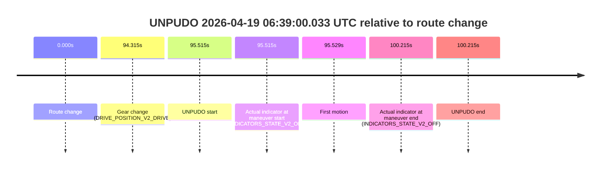
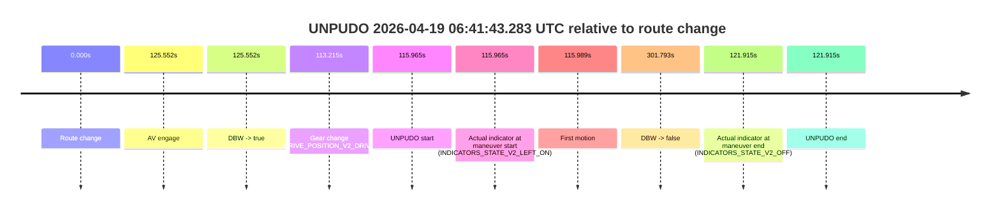
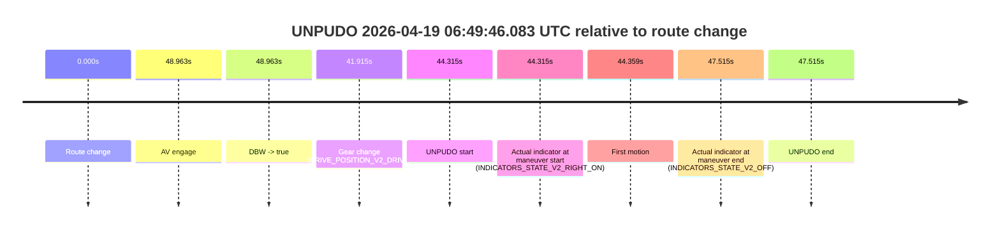

# Run Report: fme20007/2026-04-19--05-58-43--gen2-av-f20b2c85-6660-4364-84a6-261ea42e3e10

| Field | Value |
|---|---|
| Run ID | `fme20007/2026-04-19--05-58-43--gen2-av-f20b2c85-6660-4364-84a6-261ea42e3e10` |
| Date | `2026-04-19` |
| Model(s) | `apricot-crocodile-uproarious` |
| Author | `guy.geva` |
| Event count | `6` |

## unpudo 2026-04-19 06:17:36.983 UTC

| Field | Value |
|---|---|
| Model | `apricot-crocodile-uproarious` |
| Author | `guy.geva` |
| Run ID | `fme20007/2026-04-19--05-58-43--gen2-av-f20b2c85-6660-4364-84a6-261ea42e3e10` |
| Date | `2026-04-19` |
| Time (UTC) | `06:17:36.983` |
| Event type | `unpudo` |
| Disengagement type | `failed_to_unpudo` |
| Route change | `found` |
| Console | [run](https://console.sso.wayve.ai/run/fme20007/2026-04-19--05-58-43--gen2-av-f20b2c85-6660-4364-84a6-261ea42e3e10?id=&time-unixus=1776579456983313) |
| Foxglove | [segment](https://app.foxglove.dev/wayve-on-prem/p/prj_0dX18KZdVHg1fmmI/view?ds=foxglove-stream&ds.deviceName=fme20007&ds.start=2026-04-19T06%3A17%3A06.668879Z&ds.end=2026-04-19T06%3A18%3A41.629974Z&layoutId=lay_0e7VD4WIKDQGU73Y&time=2026-04-19T06%3A17%3A36.983313Z) |

### Event card: fail

- Fail: AV owns part of the segment, but the event still resolves as a model-performance failure under the AV-only scoring rule.

| Event | Time (UTC) | Delta from route change |
|---|---:|---:|
| Route change | 2026-04-19 06:17:16.668 | `0.000s` |
| AV engage | 2026-04-19 06:17:46.590 | `29.922s` |
| DBW -> true | 2026-04-19 06:17:46.590 | `29.922s` |
| Gear change (DRIVE_POSITION_V2_DRIVE) | 2026-04-19 06:17:17.033 | `0.364s` |
| UNPUDO start | 2026-04-19 06:17:36.983 | `20.314s` |
| Actual indicator at maneuver start (INDICATORS_STATE_V2_RIGHT_ON) | 2026-04-19 06:17:36.983 | `20.314s` |
| First motion | 2026-04-19 06:17:37.087 | `20.419s` |
| DBW -> false | 2026-04-19 06:18:31.629 | `74.961s` |
| Actual indicator at maneuver end (INDICATORS_STATE_V2_OFF) | 2026-04-19 06:17:42.333 | `25.664s` |
| UNPUDO end | 2026-04-19 06:17:42.333 | `25.664s` |

| Metric | Value |
|---|---|
| Outcome | `fail` |
| Effective failure type | `failed_to_unpudo` |
| Route change status | `found` |
| DBW at event start | `false` |
| DBW at event end | `false` |
| Predicted gear at AV start | `DRIVE_POSITION_V2_DRIVE` |
| Actual gear at AV start | `DRIVE_POSITION_V2_DRIVE` |
| Predicted gear at event start | `DRIVE_POSITION_V2_DRIVE` |
| Actual gear at event start | `DRIVE_POSITION_V2_DRIVE` |
| Planned indicator direction | `INDICATORS_STATE_V2_RIGHT_ON` |
| Controller indicator direction | `INDICATORS_STATE_V2_RIGHT_ON` |
| Actual indicator direction | `INDICATORS_STATE_V2_RIGHT_ON` |
| Actual indicator at maneuver end | `INDICATORS_STATE_V2_OFF` |
| Driver accel help in AV | `false` |
| Driver accel help timestamp | `n/a` |
| Max accel pedal pct in AV | `0.0%` |
| Max brake pedal pct in AV | `0.0%` |
| Max speed mps in AV | `0.000` |
| Route -> AV | `29.922s` |
| AV -> event start | `-9.607s` |
| AV -> first motion | `-9.503s` |
| AV duration before disengagement | `45.039s` |
| Trajectory waypoint count | `37` |
| Driving-plan step count | `11` |

The scored portion starts from the AV-owned window, not from the pre-AV setup. Route-change search in the stopped pre-event segment was `found`, with the baseline therefore set to route change. At the event anchor the model predicts `DRIVE_POSITION_V2_DRIVE` and the actual gear is `DRIVE_POSITION_V2_DRIVE`. The effective model outcome is `fail` because `failed_to_unpudo`.

### Resolution

| Field | Value |
|---|---|
| Final outcome | `fail` |
| Do we agree with this label? | `yes` |
| Source disengagement type | `failed_to_unpudo` |
| Resolved effective failure type | `failed_to_unpudo` |
| Confidence | `high` |

## unpudo 2026-04-19 06:31:45.583 UTC

| Field | Value |
|---|---|
| Model | `apricot-crocodile-uproarious` |
| Author | `guy.geva` |
| Run ID | `fme20007/2026-04-19--05-58-43--gen2-av-f20b2c85-6660-4364-84a6-261ea42e3e10` |
| Date | `2026-04-19` |
| Time (UTC) | `06:31:45.583` |
| Event type | `unpudo` |
| Disengagement type | `none observed` |
| Route change | `found` |
| Console | [run](https://console.sso.wayve.ai/run/fme20007/2026-04-19--05-58-43--gen2-av-f20b2c85-6660-4364-84a6-261ea42e3e10?id=&time-unixus=1776580305583309) |
| Foxglove | [segment](https://app.foxglove.dev/wayve-on-prem/p/prj_0dX18KZdVHg1fmmI/view?ds=foxglove-stream&ds.deviceName=fme20007&ds.start=2026-04-19T06%3A30%3A47.868287Z&ds.end=2026-04-19T06%3A35%3A13.710717Z&layoutId=lay_0e7VD4WIKDQGU73Y&time=2026-04-19T06%3A31%3A45.583309Z) |

### Event card: fail

- Fail: the credited unpudo does not stay AV-owned. The event window starts with DBW false, and the maneuver outcome lands outside a clean AV-owned segment.

| Event | Time (UTC) | Delta from route change |
|---|---:|---:|
| Route change | 2026-04-19 06:30:57.868 | `0.000s` |
| AV engage | 2026-04-19 06:32:08.310 | `70.442s` |
| DBW -> true | 2026-04-19 06:32:08.310 | `70.442s` |
| Gear change (DRIVE_POSITION_V2_REVERSE) | 2026-04-19 06:31:38.083 | `40.215s` |
| UNPUDO start | 2026-04-19 06:31:45.583 | `47.715s` |
| Actual indicator at maneuver start (INDICATORS_STATE_V2_OFF) | 2026-04-19 06:31:45.583 | `47.715s` |
| First motion | 2026-04-19 06:31:59.767 | `61.899s` |
| DBW -> false | 2026-04-19 06:35:03.710 | `245.842s` |
| Actual indicator at maneuver end (INDICATORS_STATE_V2_OFF) | 2026-04-19 06:32:04.683 | `66.815s` |
| UNPUDO end | 2026-04-19 06:32:04.683 | `66.815s` |

| Metric | Value |
|---|---|
| Outcome | `fail` |
| Effective failure type | `completed_outside_av` |
| Route change status | `found` |
| DBW at event start | `false` |
| DBW at event end | `false` |
| Predicted gear at AV start | `DRIVE_POSITION_V2_DRIVE` |
| Actual gear at AV start | `DRIVE_POSITION_V2_DRIVE` |
| Predicted gear at event start | `DRIVE_POSITION_V2_REVERSE` |
| Actual gear at event start | `DRIVE_POSITION_V2_REVERSE` |
| Planned indicator direction | `INDICATORS_STATE_V2_OFF` |
| Controller indicator direction | `INDICATORS_STATE_V2_OFF` |
| Actual indicator direction | `INDICATORS_STATE_V2_OFF` |
| Actual indicator at maneuver end | `INDICATORS_STATE_V2_OFF` |
| Driver accel help in AV | `false` |
| Driver accel help timestamp | `n/a` |
| Max accel pedal pct in AV | `0.0%` |
| Max brake pedal pct in AV | `0.0%` |
| Max speed mps in AV | `0.000` |
| Route -> AV | `70.442s` |
| AV -> event start | `-22.727s` |
| AV -> first motion | `-8.543s` |
| AV duration before disengagement | `175.400s` |
| Trajectory waypoint count | `37` |
| Driving-plan step count | `11` |

The scored portion starts from the AV-owned window, not from the pre-AV setup. Route-change search in the stopped pre-event segment was `found`, with the baseline therefore set to route change. At the event anchor the model predicts `DRIVE_POSITION_V2_REVERSE` and the actual gear is `DRIVE_POSITION_V2_REVERSE`. The effective model outcome is `fail` because `completed_outside_av`.

### Resolution

| Field | Value |
|---|---|
| Final outcome | `fail` |
| Do we agree with this label? | `yes` |
| Source disengagement type | `none observed` |
| Resolved effective failure type | `completed_outside_av` |
| Confidence | `high` |

## unpudo 2026-04-19 06:39:00.033 UTC

| Field | Value |
|---|---|
| Model | `apricot-crocodile-uproarious` |
| Author | `guy.geva` |
| Run ID | `fme20007/2026-04-19--05-58-43--gen2-av-f20b2c85-6660-4364-84a6-261ea42e3e10` |
| Date | `2026-04-19` |
| Time (UTC) | `06:39:00.033` |
| Event type | `unpudo` |
| Disengagement type | `failed_to_pudo` |
| Route change | `found` |
| Console | [run](https://console.sso.wayve.ai/run/fme20007/2026-04-19--05-58-43--gen2-av-f20b2c85-6660-4364-84a6-261ea42e3e10?id=&time-unixus=1776580740033299) |
| Foxglove | [segment](https://app.foxglove.dev/wayve-on-prem/p/prj_0dX18KZdVHg1fmmI/view?ds=foxglove-stream&ds.deviceName=fme20007&ds.start=2026-04-19T06%3A37%3A14.518250Z&ds.end=2026-04-19T06%3A39%3A14.733296Z&layoutId=lay_0e7VD4WIKDQGU73Y&time=2026-04-19T06%3A39%3A00.033299Z) |

### Event card: fail

- Fail: AV owns part of the segment, but the event still resolves as a model-performance failure under the AV-only scoring rule.

| Event | Time (UTC) | Delta from route change |
|---|---:|---:|
| Route change | 2026-04-19 06:37:24.518 | `0.000s` |
| Gear change (DRIVE_POSITION_V2_DRIVE) | 2026-04-19 06:38:58.833 | `94.315s` |
| UNPUDO start | 2026-04-19 06:39:00.033 | `95.515s` |
| Actual indicator at maneuver start (INDICATORS_STATE_V2_OFF) | 2026-04-19 06:39:00.033 | `95.515s` |
| First motion | 2026-04-19 06:39:00.047 | `95.529s` |
| Actual indicator at maneuver end (INDICATORS_STATE_V2_OFF) | 2026-04-19 06:39:04.733 | `100.215s` |
| UNPUDO end | 2026-04-19 06:39:04.733 | `100.215s` |

| Metric | Value |
|---|---|
| Outcome | `fail` |
| Effective failure type | `failed_to_pudo` |
| Route change status | `found` |
| DBW at event start | `false` |
| DBW at event end | `false` |
| Predicted gear at AV start | `n/a` |
| Actual gear at AV start | `n/a` |
| Predicted gear at event start | `DRIVE_POSITION_V2_PARK` |
| Actual gear at event start | `DRIVE_POSITION_V2_DRIVE` |
| Planned indicator direction | `INDICATORS_STATE_V2_LEFT_ON` |
| Controller indicator direction | `INDICATORS_STATE_V2_LEFT_ON` |
| Actual indicator direction | `INDICATORS_STATE_V2_OFF` |
| Actual indicator at maneuver end | `INDICATORS_STATE_V2_OFF` |
| Driver accel help in AV | `false` |
| Driver accel help timestamp | `n/a` |
| Max accel pedal pct in AV | `0.0%` |
| Max brake pedal pct in AV | `0.0%` |
| Max speed mps in AV | `0.000` |
| Route -> AV | `n/a` |
| AV -> event start | `n/a` |
| AV -> first motion | `n/a` |
| AV duration before disengagement | `n/a` |
| Trajectory waypoint count | `36` |
| Driving-plan step count | `11` |

The scored portion starts from the AV-owned window, not from the pre-AV setup. Route-change search in the stopped pre-event segment was `found`, with the baseline therefore set to route change. At the event anchor the model predicts `DRIVE_POSITION_V2_PARK` and the actual gear is `DRIVE_POSITION_V2_DRIVE`. The effective model outcome is `fail` because `failed_to_pudo`.

### Resolution

| Field | Value |
|---|---|
| Final outcome | `fail` |
| Do we agree with this label? | `yes` |
| Source disengagement type | `failed_to_pudo` |
| Resolved effective failure type | `failed_to_pudo` |
| Confidence | `high` |

## unpudo 2026-04-19 06:40:00.133 UTC

| Field | Value |
|---|---|
| Model | `apricot-crocodile-uproarious` |
| Author | `guy.geva` |
| Run ID | `fme20007/2026-04-19--05-58-43--gen2-av-f20b2c85-6660-4364-84a6-261ea42e3e10` |
| Date | `2026-04-19` |
| Time (UTC) | `06:40:00.133` |
| Event type | `unpudo` |
| Disengagement type | `failed_to_unpudo` |
| Route change | `found` |
| Console | [run](https://console.sso.wayve.ai/run/fme20007/2026-04-19--05-58-43--gen2-av-f20b2c85-6660-4364-84a6-261ea42e3e10?id=&time-unixus=1776580800133291) |
| Foxglove | [segment](https://app.foxglove.dev/wayve-on-prem/p/prj_0dX18KZdVHg1fmmI/view?ds=foxglove-stream&ds.deviceName=fme20007&ds.start=2026-04-19T06%3A39%3A37.318200Z&ds.end=2026-04-19T06%3A41%3A48.770755Z&layoutId=lay_0e7VD4WIKDQGU73Y&time=2026-04-19T06%3A40%3A00.133291Z) |

### Event card: fail

- Fail: AV owns part of the segment, but the event still resolves as a model-performance failure under the AV-only scoring rule.

| Event | Time (UTC) | Delta from route change |
|---|---:|---:|
| Route change | 2026-04-19 06:39:47.318 | `0.000s` |
| AV engage | 2026-04-19 06:40:05.611 | `18.294s` |
| DBW -> true | 2026-04-19 06:40:05.611 | `18.294s` |
| Gear change (DRIVE_POSITION_V2_DRIVE) | 2026-04-19 06:39:57.783 | `10.465s` |
| UNPUDO start | 2026-04-19 06:40:00.133 | `12.815s` |
| Actual indicator at maneuver start (INDICATORS_STATE_V2_RIGHT_ON) | 2026-04-19 06:40:00.133 | `12.815s` |
| First motion | 2026-04-19 06:40:00.187 | `12.870s` |
| DBW -> false | 2026-04-19 06:41:38.770 | `111.453s` |
| Actual indicator at maneuver end (INDICATORS_STATE_V2_OFF) | 2026-04-19 06:40:03.433 | `16.115s` |
| UNPUDO end | 2026-04-19 06:40:03.433 | `16.115s` |

| Metric | Value |
|---|---|
| Outcome | `fail` |
| Effective failure type | `failed_to_unpudo` |
| Route change status | `found` |
| DBW at event start | `false` |
| DBW at event end | `false` |
| Predicted gear at AV start | `DRIVE_POSITION_V2_DRIVE` |
| Actual gear at AV start | `DRIVE_POSITION_V2_DRIVE` |
| Predicted gear at event start | `DRIVE_POSITION_V2_DRIVE` |
| Actual gear at event start | `DRIVE_POSITION_V2_DRIVE` |
| Planned indicator direction | `INDICATORS_STATE_V2_LEFT_ON` |
| Controller indicator direction | `INDICATORS_STATE_V2_LEFT_ON` |
| Actual indicator direction | `INDICATORS_STATE_V2_RIGHT_ON` |
| Actual indicator at maneuver end | `INDICATORS_STATE_V2_OFF` |
| Driver accel help in AV | `false` |
| Driver accel help timestamp | `n/a` |
| Max accel pedal pct in AV | `0.0%` |
| Max brake pedal pct in AV | `0.0%` |
| Max speed mps in AV | `0.000` |
| Route -> AV | `18.294s` |
| AV -> event start | `-5.479s` |
| AV -> first motion | `-5.424s` |
| AV duration before disengagement | `93.159s` |
| Trajectory waypoint count | `36` |
| Driving-plan step count | `11` |

The scored portion starts from the AV-owned window, not from the pre-AV setup. Route-change search in the stopped pre-event segment was `found`, with the baseline therefore set to route change. At the event anchor the model predicts `DRIVE_POSITION_V2_DRIVE` and the actual gear is `DRIVE_POSITION_V2_DRIVE`. The effective model outcome is `fail` because `failed_to_unpudo`.

### Resolution

| Field | Value |
|---|---|
| Final outcome | `fail` |
| Do we agree with this label? | `yes` |
| Source disengagement type | `failed_to_unpudo` |
| Resolved effective failure type | `failed_to_unpudo` |
| Confidence | `high` |

## unpudo 2026-04-19 06:41:43.283 UTC

| Field | Value |
|---|---|
| Model | `apricot-crocodile-uproarious` |
| Author | `guy.geva` |
| Run ID | `fme20007/2026-04-19--05-58-43--gen2-av-f20b2c85-6660-4364-84a6-261ea42e3e10` |
| Date | `2026-04-19` |
| Time (UTC) | `06:41:43.283` |
| Event type | `unpudo` |
| Disengagement type | `failed_to_pudo` |
| Route change | `found` |
| Console | [run](https://console.sso.wayve.ai/run/fme20007/2026-04-19--05-58-43--gen2-av-f20b2c85-6660-4364-84a6-261ea42e3e10?id=&time-unixus=1776580903283310) |
| Foxglove | [segment](https://app.foxglove.dev/wayve-on-prem/p/prj_0dX18KZdVHg1fmmI/view?ds=foxglove-stream&ds.deviceName=fme20007&ds.start=2026-04-19T06%3A39%3A37.318200Z&ds.end=2026-04-19T06%3A44%3A59.111483Z&layoutId=lay_0e7VD4WIKDQGU73Y&time=2026-04-19T06%3A41%3A43.283310Z) |

### Event card: fail

- Fail: AV owns part of the segment, but the event still resolves as a model-performance failure under the AV-only scoring rule.

| Event | Time (UTC) | Delta from route change |
|---|---:|---:|
| Route change | 2026-04-19 06:39:47.318 | `0.000s` |
| AV engage | 2026-04-19 06:41:52.870 | `125.552s` |
| DBW -> true | 2026-04-19 06:41:52.870 | `125.552s` |
| Gear change (DRIVE_POSITION_V2_DRIVE) | 2026-04-19 06:41:40.533 | `113.215s` |
| UNPUDO start | 2026-04-19 06:41:43.283 | `115.965s` |
| Actual indicator at maneuver start (INDICATORS_STATE_V2_LEFT_ON) | 2026-04-19 06:41:43.283 | `115.965s` |
| First motion | 2026-04-19 06:41:43.307 | `115.989s` |
| DBW -> false | 2026-04-19 06:44:49.111 | `301.793s` |
| Actual indicator at maneuver end (INDICATORS_STATE_V2_OFF) | 2026-04-19 06:41:49.233 | `121.915s` |
| UNPUDO end | 2026-04-19 06:41:49.233 | `121.915s` |

| Metric | Value |
|---|---|
| Outcome | `fail` |
| Effective failure type | `failed_to_pudo` |
| Route change status | `found` |
| DBW at event start | `false` |
| DBW at event end | `false` |
| Predicted gear at AV start | `DRIVE_POSITION_V2_DRIVE` |
| Actual gear at AV start | `DRIVE_POSITION_V2_DRIVE` |
| Predicted gear at event start | `DRIVE_POSITION_V2_DRIVE` |
| Actual gear at event start | `DRIVE_POSITION_V2_DRIVE` |
| Planned indicator direction | `INDICATORS_STATE_V2_OFF` |
| Controller indicator direction | `INDICATORS_STATE_V2_OFF` |
| Actual indicator direction | `INDICATORS_STATE_V2_LEFT_ON` |
| Actual indicator at maneuver end | `INDICATORS_STATE_V2_OFF` |
| Driver accel help in AV | `false` |
| Driver accel help timestamp | `n/a` |
| Max accel pedal pct in AV | `0.0%` |
| Max brake pedal pct in AV | `0.0%` |
| Max speed mps in AV | `0.000` |
| Route -> AV | `125.552s` |
| AV -> event start | `-9.587s` |
| AV -> first motion | `-9.563s` |
| AV duration before disengagement | `176.241s` |
| Trajectory waypoint count | `37` |
| Driving-plan step count | `11` |

The scored portion starts from the AV-owned window, not from the pre-AV setup. Route-change search in the stopped pre-event segment was `found`, with the baseline therefore set to route change. At the event anchor the model predicts `DRIVE_POSITION_V2_DRIVE` and the actual gear is `DRIVE_POSITION_V2_DRIVE`. The effective model outcome is `fail` because `failed_to_pudo`.

### Resolution

| Field | Value |
|---|---|
| Final outcome | `fail` |
| Do we agree with this label? | `yes` |
| Source disengagement type | `failed_to_pudo` |
| Resolved effective failure type | `failed_to_pudo` |
| Confidence | `high` |

## unpudo 2026-04-19 06:49:46.083 UTC

| Field | Value |
|---|---|
| Model | `apricot-crocodile-uproarious` |
| Author | `guy.geva` |
| Run ID | `fme20007/2026-04-19--05-58-43--gen2-av-f20b2c85-6660-4364-84a6-261ea42e3e10` |
| Date | `2026-04-19` |
| Time (UTC) | `06:49:46.083` |
| Event type | `unpudo` |
| Disengagement type | `failed_to_unpudo` |
| Route change | `found` |
| Console | [run](https://console.sso.wayve.ai/run/fme20007/2026-04-19--05-58-43--gen2-av-f20b2c85-6660-4364-84a6-261ea42e3e10?id=&time-unixus=1776581386083298) |
| Foxglove | [segment](https://app.foxglove.dev/wayve-on-prem/p/prj_0dX18KZdVHg1fmmI/view?ds=foxglove-stream&ds.deviceName=fme20007&ds.start=2026-04-19T06%3A48%3A51.768321Z&ds.end=2026-04-19T06%3A49%3A59.283299Z&layoutId=lay_0e7VD4WIKDQGU73Y&time=2026-04-19T06%3A49%3A46.083298Z) |

### Event card: fail

- Fail: AV owns part of the segment, but the event still resolves as a model-performance failure under the AV-only scoring rule.

| Event | Time (UTC) | Delta from route change |
|---|---:|---:|
| Route change | 2026-04-19 06:49:01.768 | `0.000s` |
| AV engage | 2026-04-19 06:49:50.731 | `48.963s` |
| DBW -> true | 2026-04-19 06:49:50.731 | `48.963s` |
| Gear change (DRIVE_POSITION_V2_DRIVE) | 2026-04-19 06:49:43.683 | `41.915s` |
| UNPUDO start | 2026-04-19 06:49:46.083 | `44.315s` |
| Actual indicator at maneuver start (INDICATORS_STATE_V2_RIGHT_ON) | 2026-04-19 06:49:46.083 | `44.315s` |
| First motion | 2026-04-19 06:49:46.127 | `44.359s` |
| Actual indicator at maneuver end (INDICATORS_STATE_V2_OFF) | 2026-04-19 06:49:49.283 | `47.515s` |
| UNPUDO end | 2026-04-19 06:49:49.283 | `47.515s` |

| Metric | Value |
|---|---|
| Outcome | `fail` |
| Effective failure type | `failed_to_unpudo` |
| Route change status | `found` |
| DBW at event start | `false` |
| DBW at event end | `false` |
| Predicted gear at AV start | `DRIVE_POSITION_V2_DRIVE` |
| Actual gear at AV start | `DRIVE_POSITION_V2_DRIVE` |
| Predicted gear at event start | `DRIVE_POSITION_V2_DRIVE` |
| Actual gear at event start | `DRIVE_POSITION_V2_DRIVE` |
| Planned indicator direction | `INDICATORS_STATE_V2_RIGHT_ON` |
| Controller indicator direction | `INDICATORS_STATE_V2_RIGHT_ON` |
| Actual indicator direction | `INDICATORS_STATE_V2_RIGHT_ON` |
| Actual indicator at maneuver end | `INDICATORS_STATE_V2_OFF` |
| Driver accel help in AV | `false` |
| Driver accel help timestamp | `n/a` |
| Max accel pedal pct in AV | `0.0%` |
| Max brake pedal pct in AV | `0.0%` |
| Max speed mps in AV | `0.000` |
| Route -> AV | `48.963s` |
| AV -> event start | `-4.649s` |
| AV -> first motion | `-4.604s` |
| AV duration before disengagement | `n/a` |
| Trajectory waypoint count | `37` |
| Driving-plan step count | `11` |

The scored portion starts from the AV-owned window, not from the pre-AV setup. Route-change search in the stopped pre-event segment was `found`, with the baseline therefore set to route change. At the event anchor the model predicts `DRIVE_POSITION_V2_DRIVE` and the actual gear is `DRIVE_POSITION_V2_DRIVE`. The effective model outcome is `fail` because `failed_to_unpudo`.

### Resolution

| Field | Value |
|---|---|
| Final outcome | `fail` |
| Do we agree with this label? | `yes` |
| Source disengagement type | `failed_to_unpudo` |
| Resolved effective failure type | `failed_to_unpudo` |
| Confidence | `high` |
