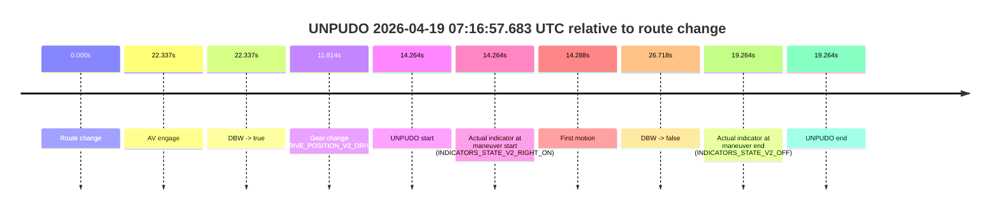
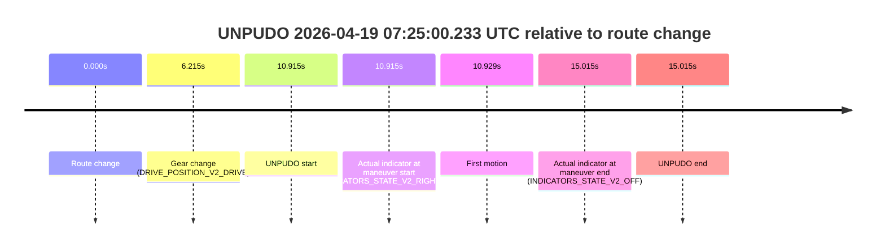
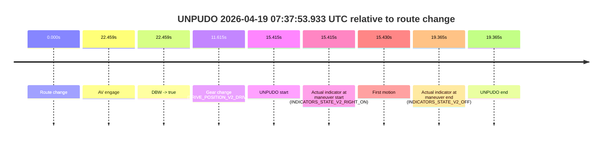

# Run Report: fme20007/2026-04-19--07-12-46--gen2-av-da3de89b-6963-4ee2-9bb9-7db6ce3da5dd

| Field | Value |
|---|---|
| Run ID | `fme20007/2026-04-19--07-12-46--gen2-av-da3de89b-6963-4ee2-9bb9-7db6ce3da5dd` |
| Date | `2026-04-19` |
| Model(s) | `apricot-crocodile-uproarious` |
| Author | `guy.geva` |
| Event count | `5` |

## unpudo 2026-04-19 07:16:57.683 UTC

| Field | Value |
|---|---|
| Model | `apricot-crocodile-uproarious` |
| Author | `guy.geva` |
| Run ID | `fme20007/2026-04-19--07-12-46--gen2-av-da3de89b-6963-4ee2-9bb9-7db6ce3da5dd` |
| Date | `2026-04-19` |
| Time (UTC) | `07:16:57.683` |
| Event type | `unpudo` |
| Disengagement type | `failed_to_unpudo` |
| Route change | `found` |
| Console | [run](https://console.sso.wayve.ai/run/fme20007/2026-04-19--07-12-46--gen2-av-da3de89b-6963-4ee2-9bb9-7db6ce3da5dd?id=&time-unixus=1776583017683306) |
| Foxglove | [segment](https://app.foxglove.dev/wayve-on-prem/p/prj_0dX18KZdVHg1fmmI/view?ds=foxglove-stream&ds.deviceName=fme20007&ds.start=2026-04-19T07%3A16%3A33.419695Z&ds.end=2026-04-19T07%3A17%3A20.137709Z&layoutId=lay_0e7VD4WIKDQGU73Y&time=2026-04-19T07%3A16%3A57.683306Z) |

### Event card: fail

- Fail: AV owns part of the segment, but the event still resolves as a model-performance failure under the AV-only scoring rule.

| Event | Time (UTC) | Delta from route change |
|---|---:|---:|
| Route change | 2026-04-19 07:16:43.419 | `0.000s` |
| AV engage | 2026-04-19 07:17:05.756 | `22.337s` |
| DBW -> true | 2026-04-19 07:17:05.756 | `22.337s` |
| Gear change (DRIVE_POSITION_V2_DRIVE) | 2026-04-19 07:16:55.233 | `11.814s` |
| UNPUDO start | 2026-04-19 07:16:57.683 | `14.264s` |
| Actual indicator at maneuver start (INDICATORS_STATE_V2_RIGHT_ON) | 2026-04-19 07:16:57.683 | `14.264s` |
| First motion | 2026-04-19 07:16:57.707 | `14.288s` |
| DBW -> false | 2026-04-19 07:17:10.137 | `26.718s` |
| Actual indicator at maneuver end (INDICATORS_STATE_V2_OFF) | 2026-04-19 07:17:02.683 | `19.264s` |
| UNPUDO end | 2026-04-19 07:17:02.683 | `19.264s` |

| Metric | Value |
|---|---|
| Outcome | `fail` |
| Effective failure type | `failed_to_unpudo` |
| Route change status | `found` |
| DBW at event start | `false` |
| DBW at event end | `false` |
| Predicted gear at AV start | `DRIVE_POSITION_V2_DRIVE` |
| Actual gear at AV start | `DRIVE_POSITION_V2_DRIVE` |
| Predicted gear at event start | `DRIVE_POSITION_V2_DRIVE` |
| Actual gear at event start | `DRIVE_POSITION_V2_DRIVE` |
| Planned indicator direction | `INDICATORS_STATE_V2_RIGHT_ON` |
| Controller indicator direction | `INDICATORS_STATE_V2_RIGHT_ON` |
| Actual indicator direction | `INDICATORS_STATE_V2_RIGHT_ON` |
| Actual indicator at maneuver end | `INDICATORS_STATE_V2_OFF` |
| Driver accel help in AV | `false` |
| Driver accel help timestamp | `n/a` |
| Max accel pedal pct in AV | `0.0%` |
| Max brake pedal pct in AV | `0.0%` |
| Max speed mps in AV | `0.000` |
| Route -> AV | `22.337s` |
| AV -> event start | `-8.073s` |
| AV -> first motion | `-8.049s` |
| AV duration before disengagement | `4.381s` |
| Trajectory waypoint count | `36` |
| Driving-plan step count | `11` |

The scored portion starts from the AV-owned window, not from the pre-AV setup. Route-change search in the stopped pre-event segment was `found`, with the baseline therefore set to route change. At the event anchor the model predicts `DRIVE_POSITION_V2_DRIVE` and the actual gear is `DRIVE_POSITION_V2_DRIVE`. The effective model outcome is `fail` because `failed_to_unpudo`.

### Resolution

| Field | Value |
|---|---|
| Final outcome | `fail` |
| Do we agree with this label? | `yes` |
| Source disengagement type | `failed_to_unpudo` |
| Resolved effective failure type | `failed_to_unpudo` |
| Confidence | `high` |

## unpudo 2026-04-19 07:21:10.133 UTC

| Field | Value |
|---|---|
| Model | `apricot-crocodile-uproarious` |
| Author | `guy.geva` |
| Run ID | `fme20007/2026-04-19--07-12-46--gen2-av-da3de89b-6963-4ee2-9bb9-7db6ce3da5dd` |
| Date | `2026-04-19` |
| Time (UTC) | `07:21:10.133` |
| Event type | `unpudo` |
| Disengagement type | `failed_to_unpudo` |
| Route change | `found` |
| Console | [run](https://console.sso.wayve.ai/run/fme20007/2026-04-19--07-12-46--gen2-av-da3de89b-6963-4ee2-9bb9-7db6ce3da5dd?id=&time-unixus=1776583270133310) |
| Foxglove | [segment](https://app.foxglove.dev/wayve-on-prem/p/prj_0dX18KZdVHg1fmmI/view?ds=foxglove-stream&ds.deviceName=fme20007&ds.start=2026-04-19T07%3A20%3A48.068252Z&ds.end=2026-04-19T07%3A21%3A44.996180Z&layoutId=lay_0e7VD4WIKDQGU73Y&time=2026-04-19T07%3A21%3A10.133310Z) |

### Event card: fail

- Fail: AV owns part of the segment, but the event still resolves as a model-performance failure under the AV-only scoring rule.

| Event | Time (UTC) | Delta from route change |
|---|---:|---:|
| Route change | 2026-04-19 07:20:58.068 | `0.000s` |
| AV engage | 2026-04-19 07:21:15.516 | `17.448s` |
| DBW -> true | 2026-04-19 07:21:15.516 | `17.448s` |
| Gear change (DRIVE_POSITION_V2_DRIVE) | 2026-04-19 07:21:08.483 | `10.415s` |
| UNPUDO start | 2026-04-19 07:21:10.133 | `12.065s` |
| Actual indicator at maneuver start (INDICATORS_STATE_V2_RIGHT_ON) | 2026-04-19 07:21:10.133 | `12.065s` |
| First motion | 2026-04-19 07:21:10.207 | `12.139s` |
| DBW -> false | 2026-04-19 07:21:34.996 | `36.928s` |
| Actual indicator at maneuver end (INDICATORS_STATE_V2_OFF) | 2026-04-19 07:21:13.183 | `15.115s` |
| UNPUDO end | 2026-04-19 07:21:13.183 | `15.115s` |

| Metric | Value |
|---|---|
| Outcome | `fail` |
| Effective failure type | `failed_to_unpudo` |
| Route change status | `found` |
| DBW at event start | `false` |
| DBW at event end | `false` |
| Predicted gear at AV start | `DRIVE_POSITION_V2_DRIVE` |
| Actual gear at AV start | `DRIVE_POSITION_V2_DRIVE` |
| Predicted gear at event start | `DRIVE_POSITION_V2_DRIVE` |
| Actual gear at event start | `DRIVE_POSITION_V2_DRIVE` |
| Planned indicator direction | `INDICATORS_STATE_V2_RIGHT_ON` |
| Controller indicator direction | `INDICATORS_STATE_V2_RIGHT_ON` |
| Actual indicator direction | `INDICATORS_STATE_V2_RIGHT_ON` |
| Actual indicator at maneuver end | `INDICATORS_STATE_V2_OFF` |
| Driver accel help in AV | `false` |
| Driver accel help timestamp | `n/a` |
| Max accel pedal pct in AV | `0.0%` |
| Max brake pedal pct in AV | `0.0%` |
| Max speed mps in AV | `0.000` |
| Route -> AV | `17.448s` |
| AV -> event start | `-5.383s` |
| AV -> first motion | `-5.309s` |
| AV duration before disengagement | `19.480s` |
| Trajectory waypoint count | `37` |
| Driving-plan step count | `11` |

The scored portion starts from the AV-owned window, not from the pre-AV setup. Route-change search in the stopped pre-event segment was `found`, with the baseline therefore set to route change. At the event anchor the model predicts `DRIVE_POSITION_V2_DRIVE` and the actual gear is `DRIVE_POSITION_V2_DRIVE`. The effective model outcome is `fail` because `failed_to_unpudo`.

### Resolution

| Field | Value |
|---|---|
| Final outcome | `fail` |
| Do we agree with this label? | `yes` |
| Source disengagement type | `failed_to_unpudo` |
| Resolved effective failure type | `failed_to_unpudo` |
| Confidence | `high` |

## unpudo 2026-04-19 07:22:16.533 UTC

| Field | Value |
|---|---|
| Model | `apricot-crocodile-uproarious` |
| Author | `guy.geva` |
| Run ID | `fme20007/2026-04-19--07-12-46--gen2-av-da3de89b-6963-4ee2-9bb9-7db6ce3da5dd` |
| Date | `2026-04-19` |
| Time (UTC) | `07:22:16.533` |
| Event type | `unpudo` |
| Disengagement type | `failed_to_unpudo` |
| Route change | `found` |
| Console | [run](https://console.sso.wayve.ai/run/fme20007/2026-04-19--07-12-46--gen2-av-da3de89b-6963-4ee2-9bb9-7db6ce3da5dd?id=&time-unixus=1776583336533303) |
| Foxglove | [segment](https://app.foxglove.dev/wayve-on-prem/p/prj_0dX18KZdVHg1fmmI/view?ds=foxglove-stream&ds.deviceName=fme20007&ds.start=2026-04-19T07%3A20%3A48.068252Z&ds.end=2026-04-19T07%3A25%3A04.116388Z&layoutId=lay_0e7VD4WIKDQGU73Y&time=2026-04-19T07%3A22%3A16.533303Z) |

### Event card: fail

- Fail: AV owns part of the segment, but the event still resolves as a model-performance failure under the AV-only scoring rule.

| Event | Time (UTC) | Delta from route change |
|---|---:|---:|
| Route change | 2026-04-19 07:20:58.068 | `0.000s` |
| AV engage | 2026-04-19 07:22:28.756 | `90.688s` |
| DBW -> true | 2026-04-19 07:22:28.756 | `90.688s` |
| Gear change (DRIVE_POSITION_V2_DRIVE) | 2026-04-19 07:22:14.083 | `76.015s` |
| UNPUDO start | 2026-04-19 07:22:16.533 | `78.465s` |
| Actual indicator at maneuver start (INDICATORS_STATE_V2_RIGHT_ON) | 2026-04-19 07:22:16.533 | `78.465s` |
| First motion | 2026-04-19 07:22:16.567 | `78.499s` |
| DBW -> false | 2026-04-19 07:24:54.116 | `236.048s` |
| Actual indicator at maneuver end (INDICATORS_STATE_V2_OFF) | 2026-04-19 07:22:19.833 | `81.765s` |
| UNPUDO end | 2026-04-19 07:22:19.833 | `81.765s` |

| Metric | Value |
|---|---|
| Outcome | `fail` |
| Effective failure type | `failed_to_unpudo` |
| Route change status | `found` |
| DBW at event start | `false` |
| DBW at event end | `false` |
| Predicted gear at AV start | `DRIVE_POSITION_V2_DRIVE` |
| Actual gear at AV start | `DRIVE_POSITION_V2_DRIVE` |
| Predicted gear at event start | `DRIVE_POSITION_V2_DRIVE` |
| Actual gear at event start | `DRIVE_POSITION_V2_DRIVE` |
| Planned indicator direction | `INDICATORS_STATE_V2_LEFT_ON` |
| Controller indicator direction | `INDICATORS_STATE_V2_LEFT_ON` |
| Actual indicator direction | `INDICATORS_STATE_V2_RIGHT_ON` |
| Actual indicator at maneuver end | `INDICATORS_STATE_V2_OFF` |
| Driver accel help in AV | `false` |
| Driver accel help timestamp | `n/a` |
| Max accel pedal pct in AV | `0.0%` |
| Max brake pedal pct in AV | `0.0%` |
| Max speed mps in AV | `0.000` |
| Route -> AV | `90.688s` |
| AV -> event start | `-12.223s` |
| AV -> first motion | `-12.189s` |
| AV duration before disengagement | `145.360s` |
| Trajectory waypoint count | `35` |
| Driving-plan step count | `11` |

The scored portion starts from the AV-owned window, not from the pre-AV setup. Route-change search in the stopped pre-event segment was `found`, with the baseline therefore set to route change. At the event anchor the model predicts `DRIVE_POSITION_V2_DRIVE` and the actual gear is `DRIVE_POSITION_V2_DRIVE`. The effective model outcome is `fail` because `failed_to_unpudo`.

### Resolution

| Field | Value |
|---|---|
| Final outcome | `fail` |
| Do we agree with this label? | `yes` |
| Source disengagement type | `failed_to_unpudo` |
| Resolved effective failure type | `failed_to_unpudo` |
| Confidence | `high` |

## unpudo 2026-04-19 07:25:00.233 UTC

| Field | Value |
|---|---|
| Model | `apricot-crocodile-uproarious` |
| Author | `guy.geva` |
| Run ID | `fme20007/2026-04-19--07-12-46--gen2-av-da3de89b-6963-4ee2-9bb9-7db6ce3da5dd` |
| Date | `2026-04-19` |
| Time (UTC) | `07:25:00.233` |
| Event type | `unpudo` |
| Disengagement type | `failed_to_unpudo` |
| Route change | `found` |
| Console | [run](https://console.sso.wayve.ai/run/fme20007/2026-04-19--07-12-46--gen2-av-da3de89b-6963-4ee2-9bb9-7db6ce3da5dd?id=&time-unixus=1776583500233317) |
| Foxglove | [segment](https://app.foxglove.dev/wayve-on-prem/p/prj_0dX18KZdVHg1fmmI/view?ds=foxglove-stream&ds.deviceName=fme20007&ds.start=2026-04-19T07%3A24%3A39.318283Z&ds.end=2026-04-19T07%3A25%3A14.333306Z&layoutId=lay_0e7VD4WIKDQGU73Y&time=2026-04-19T07%3A25%3A00.233317Z) |

### Event card: fail

- Fail: AV owns part of the segment, but the event still resolves as a model-performance failure under the AV-only scoring rule.

| Event | Time (UTC) | Delta from route change |
|---|---:|---:|
| Route change | 2026-04-19 07:24:49.318 | `0.000s` |
| Gear change (DRIVE_POSITION_V2_DRIVE) | 2026-04-19 07:24:55.533 | `6.215s` |
| UNPUDO start | 2026-04-19 07:25:00.233 | `10.915s` |
| Actual indicator at maneuver start (INDICATORS_STATE_V2_RIGHT_ON) | 2026-04-19 07:25:00.233 | `10.915s` |
| First motion | 2026-04-19 07:25:00.247 | `10.929s` |
| Actual indicator at maneuver end (INDICATORS_STATE_V2_OFF) | 2026-04-19 07:25:04.333 | `15.015s` |
| UNPUDO end | 2026-04-19 07:25:04.333 | `15.015s` |

| Metric | Value |
|---|---|
| Outcome | `fail` |
| Effective failure type | `failed_to_unpudo` |
| Route change status | `found` |
| DBW at event start | `false` |
| DBW at event end | `false` |
| Predicted gear at AV start | `n/a` |
| Actual gear at AV start | `n/a` |
| Predicted gear at event start | `DRIVE_POSITION_V2_DRIVE` |
| Actual gear at event start | `DRIVE_POSITION_V2_DRIVE` |
| Planned indicator direction | `INDICATORS_STATE_V2_RIGHT_ON` |
| Controller indicator direction | `INDICATORS_STATE_V2_RIGHT_ON` |
| Actual indicator direction | `INDICATORS_STATE_V2_RIGHT_ON` |
| Actual indicator at maneuver end | `INDICATORS_STATE_V2_OFF` |
| Driver accel help in AV | `false` |
| Driver accel help timestamp | `n/a` |
| Max accel pedal pct in AV | `0.0%` |
| Max brake pedal pct in AV | `0.0%` |
| Max speed mps in AV | `0.000` |
| Route -> AV | `n/a` |
| AV -> event start | `n/a` |
| AV -> first motion | `n/a` |
| AV duration before disengagement | `n/a` |
| Trajectory waypoint count | `35` |
| Driving-plan step count | `11` |

The scored portion starts from the AV-owned window, not from the pre-AV setup. Route-change search in the stopped pre-event segment was `found`, with the baseline therefore set to route change. At the event anchor the model predicts `DRIVE_POSITION_V2_DRIVE` and the actual gear is `DRIVE_POSITION_V2_DRIVE`. The effective model outcome is `fail` because `failed_to_unpudo`.

### Resolution

| Field | Value |
|---|---|
| Final outcome | `fail` |
| Do we agree with this label? | `yes` |
| Source disengagement type | `failed_to_unpudo` |
| Resolved effective failure type | `failed_to_unpudo` |
| Confidence | `high` |

## unpudo 2026-04-19 07:37:53.933 UTC

| Field | Value |
|---|---|
| Model | `apricot-crocodile-uproarious` |
| Author | `guy.geva` |
| Run ID | `fme20007/2026-04-19--07-12-46--gen2-av-da3de89b-6963-4ee2-9bb9-7db6ce3da5dd` |
| Date | `2026-04-19` |
| Time (UTC) | `07:37:53.933` |
| Event type | `unpudo` |
| Disengagement type | `failed_to_unpudo` |
| Route change | `found` |
| Console | [run](https://console.sso.wayve.ai/run/fme20007/2026-04-19--07-12-46--gen2-av-da3de89b-6963-4ee2-9bb9-7db6ce3da5dd?id=&time-unixus=1776584273933315) |
| Foxglove | [segment](https://app.foxglove.dev/wayve-on-prem/p/prj_0dX18KZdVHg1fmmI/view?ds=foxglove-stream&ds.deviceName=fme20007&ds.start=2026-04-19T07%3A37%3A28.518238Z&ds.end=2026-04-19T07%3A38%3A07.883303Z&layoutId=lay_0e7VD4WIKDQGU73Y&time=2026-04-19T07%3A37%3A53.933315Z) |

### Event card: fail

- Fail: AV owns part of the segment, but the event still resolves as a model-performance failure under the AV-only scoring rule.

| Event | Time (UTC) | Delta from route change |
|---|---:|---:|
| Route change | 2026-04-19 07:37:38.518 | `0.000s` |
| AV engage | 2026-04-19 07:38:00.977 | `22.459s` |
| DBW -> true | 2026-04-19 07:38:00.977 | `22.459s` |
| Gear change (DRIVE_POSITION_V2_DRIVE) | 2026-04-19 07:37:50.133 | `11.615s` |
| UNPUDO start | 2026-04-19 07:37:53.933 | `15.415s` |
| Actual indicator at maneuver start (INDICATORS_STATE_V2_RIGHT_ON) | 2026-04-19 07:37:53.933 | `15.415s` |
| First motion | 2026-04-19 07:37:53.947 | `15.430s` |
| Actual indicator at maneuver end (INDICATORS_STATE_V2_OFF) | 2026-04-19 07:37:57.883 | `19.365s` |
| UNPUDO end | 2026-04-19 07:37:57.883 | `19.365s` |

| Metric | Value |
|---|---|
| Outcome | `fail` |
| Effective failure type | `failed_to_unpudo` |
| Route change status | `found` |
| DBW at event start | `false` |
| DBW at event end | `false` |
| Predicted gear at AV start | `DRIVE_POSITION_V2_DRIVE` |
| Actual gear at AV start | `DRIVE_POSITION_V2_DRIVE` |
| Predicted gear at event start | `DRIVE_POSITION_V2_DRIVE` |
| Actual gear at event start | `DRIVE_POSITION_V2_DRIVE` |
| Planned indicator direction | `INDICATORS_STATE_V2_RIGHT_ON` |
| Controller indicator direction | `INDICATORS_STATE_V2_RIGHT_ON` |
| Actual indicator direction | `INDICATORS_STATE_V2_RIGHT_ON` |
| Actual indicator at maneuver end | `INDICATORS_STATE_V2_OFF` |
| Driver accel help in AV | `false` |
| Driver accel help timestamp | `n/a` |
| Max accel pedal pct in AV | `0.0%` |
| Max brake pedal pct in AV | `0.0%` |
| Max speed mps in AV | `0.000` |
| Route -> AV | `22.459s` |
| AV -> event start | `-7.044s` |
| AV -> first motion | `-7.030s` |
| AV duration before disengagement | `n/a` |
| Trajectory waypoint count | `37` |
| Driving-plan step count | `11` |

The scored portion starts from the AV-owned window, not from the pre-AV setup. Route-change search in the stopped pre-event segment was `found`, with the baseline therefore set to route change. At the event anchor the model predicts `DRIVE_POSITION_V2_DRIVE` and the actual gear is `DRIVE_POSITION_V2_DRIVE`. The effective model outcome is `fail` because `failed_to_unpudo`.

### Resolution

| Field | Value |
|---|---|
| Final outcome | `fail` |
| Do we agree with this label? | `yes` |
| Source disengagement type | `failed_to_unpudo` |
| Resolved effective failure type | `failed_to_unpudo` |
| Confidence | `high` |
