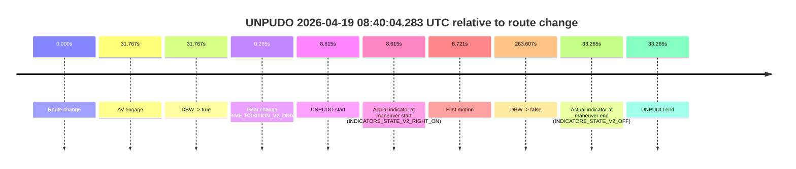
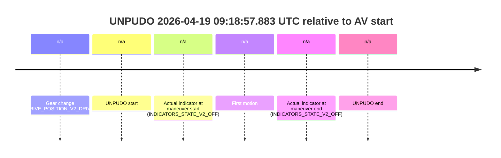
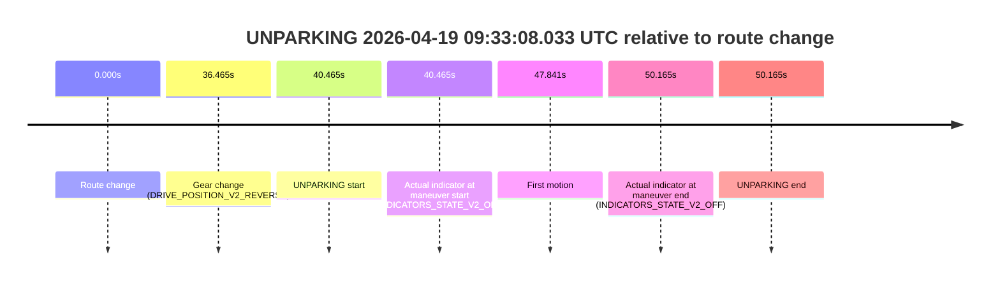

# Run Report: fme20007/2026-04-19--08-29-22--gen2-av-726dbcd9-bb3e-4f8b-a9ec-9860125c086a

| Field | Value |
|---|---|
| Run ID | `fme20007/2026-04-19--08-29-22--gen2-av-726dbcd9-bb3e-4f8b-a9ec-9860125c086a` |
| Date | `2026-04-19` |
| Model(s) | `apricot-crocodile-uproarious` |
| Author | `guy.geva` |
| Event count | `7` |

## unpudo 2026-04-19 08:40:04.283 UTC

| Field | Value |
|---|---|
| Model | `apricot-crocodile-uproarious` |
| Author | `guy.geva` |
| Run ID | `fme20007/2026-04-19--08-29-22--gen2-av-726dbcd9-bb3e-4f8b-a9ec-9860125c086a` |
| Date | `2026-04-19` |
| Time (UTC) | `08:40:04.283` |
| Event type | `unpudo` |
| Disengagement type | `none observed` |
| Route change | `found` |
| Console | [run](https://console.sso.wayve.ai/run/fme20007/2026-04-19--08-29-22--gen2-av-726dbcd9-bb3e-4f8b-a9ec-9860125c086a?id=&time-unixus=1776588004283314) |
| Foxglove | [segment](https://app.foxglove.dev/wayve-on-prem/p/prj_0dX18KZdVHg1fmmI/view?ds=foxglove-stream&ds.deviceName=fme20007&ds.start=2026-04-19T08%3A39%3A45.668261Z&ds.end=2026-04-19T08%3A44%3A29.275676Z&layoutId=lay_0e7VD4WIKDQGU73Y&time=2026-04-19T08%3A40%3A04.283314Z) |

### Event card: accidental

- Accidental: AV ownership is present for less than `2s`, so this is treated as an accidental brush with the maneuver rather than a meaningful model attempt.

| Event | Time (UTC) | Delta from route change |
|---|---:|---:|
| Route change | 2026-04-19 08:39:55.668 | `0.000s` |
| AV engage | 2026-04-19 08:40:27.435 | `31.767s` |
| DBW -> true | 2026-04-19 08:40:27.435 | `31.767s` |
| Gear change (DRIVE_POSITION_V2_DRIVE) | 2026-04-19 08:39:55.933 | `0.265s` |
| UNPUDO start | 2026-04-19 08:40:04.283 | `8.615s` |
| Actual indicator at maneuver start (INDICATORS_STATE_V2_RIGHT_ON) | 2026-04-19 08:40:04.283 | `8.615s` |
| First motion | 2026-04-19 08:40:04.389 | `8.721s` |
| DBW -> false | 2026-04-19 08:44:19.275 | `263.607s` |
| Actual indicator at maneuver end (INDICATORS_STATE_V2_OFF) | 2026-04-19 08:40:28.933 | `33.265s` |
| UNPUDO end | 2026-04-19 08:40:28.933 | `33.265s` |

| Metric | Value |
|---|---|
| Outcome | `accidental` |
| Effective failure type | `none` |
| Route change status | `found` |
| DBW at event start | `false` |
| DBW at event end | `true` |
| Predicted gear at AV start | `DRIVE_POSITION_V2_DRIVE` |
| Actual gear at AV start | `DRIVE_POSITION_V2_DRIVE` |
| Predicted gear at event start | `DRIVE_POSITION_V2_DRIVE` |
| Actual gear at event start | `DRIVE_POSITION_V2_DRIVE` |
| Planned indicator direction | `INDICATORS_STATE_V2_RIGHT_ON` |
| Controller indicator direction | `INDICATORS_STATE_V2_RIGHT_ON` |
| Actual indicator direction | `INDICATORS_STATE_V2_RIGHT_ON` |
| Actual indicator at maneuver end | `INDICATORS_STATE_V2_OFF` |
| Driver accel help in AV | `false` |
| Driver accel help timestamp | `n/a` |
| Max accel pedal pct in AV | `0.0%` |
| Max brake pedal pct in AV | `0.0%` |
| Max speed mps in AV | `2.269` |
| Route -> AV | `31.767s` |
| AV -> event start | `-23.152s` |
| AV -> first motion | `-23.046s` |
| AV duration before disengagement | `231.840s` |
| Trajectory waypoint count | `36` |
| Driving-plan step count | `11` |

The scored portion starts from the AV-owned window, not from the pre-AV setup. Route-change search in the stopped pre-event segment was `found`, with the baseline therefore set to route change. At the event anchor the model predicts `DRIVE_POSITION_V2_DRIVE` and the actual gear is `DRIVE_POSITION_V2_DRIVE`. The effective model outcome is `accidental` because `the AV-owned portion is shorter than 2s`.

### Resolution

| Field | Value |
|---|---|
| Final outcome | `accidental` |
| Do we agree with this label? | `yes` |
| Source disengagement type | `none observed` |
| Resolved effective failure type | `none` |
| Confidence | `high` |

## unpudo 2026-04-19 08:44:20.383 UTC

| Field | Value |
|---|---|
| Model | `apricot-crocodile-uproarious` |
| Author | `guy.geva` |
| Run ID | `fme20007/2026-04-19--08-29-22--gen2-av-726dbcd9-bb3e-4f8b-a9ec-9860125c086a` |
| Date | `2026-04-19` |
| Time (UTC) | `08:44:20.383` |
| Event type | `unpudo` |
| Disengagement type | `none observed` |
| Route change | `found` |
| Console | [run](https://console.sso.wayve.ai/run/fme20007/2026-04-19--08-29-22--gen2-av-726dbcd9-bb3e-4f8b-a9ec-9860125c086a?id=&time-unixus=1776588260383302) |
| Foxglove | [segment](https://app.foxglove.dev/wayve-on-prem/p/prj_0dX18KZdVHg1fmmI/view?ds=foxglove-stream&ds.deviceName=fme20007&ds.start=2026-04-19T08%3A42%3A13.418259Z&ds.end=2026-04-19T08%3A45%3A57.935507Z&layoutId=lay_0e7VD4WIKDQGU73Y&time=2026-04-19T08%3A44%3A20.383302Z) |

### Event card: accidental

- Accidental: AV ownership is present for less than `2s`, so this is treated as an accidental brush with the maneuver rather than a meaningful model attempt.

| Event | Time (UTC) | Delta from route change |
|---|---:|---:|
| Route change | 2026-04-19 08:42:23.418 | `0.000s` |
| AV engage | 2026-04-19 08:44:27.735 | `124.317s` |
| DBW -> true | 2026-04-19 08:44:27.735 | `124.317s` |
| Gear change (DRIVE_POSITION_V2_DRIVE) | 2026-04-19 08:44:09.633 | `106.215s` |
| UNPUDO start | 2026-04-19 08:44:20.383 | `116.965s` |
| Actual indicator at maneuver start (INDICATORS_STATE_V2_OFF) | 2026-04-19 08:44:20.383 | `116.965s` |
| First motion | 2026-04-19 08:44:20.409 | `116.992s` |
| DBW -> false | 2026-04-19 08:45:47.935 | `204.517s` |
| Actual indicator at maneuver end (INDICATORS_STATE_V2_OFF) | 2026-04-19 08:44:25.833 | `122.415s` |
| UNPUDO end | 2026-04-19 08:44:25.833 | `122.415s` |

| Metric | Value |
|---|---|
| Outcome | `accidental` |
| Effective failure type | `none` |
| Route change status | `found` |
| DBW at event start | `false` |
| DBW at event end | `false` |
| Predicted gear at AV start | `DRIVE_POSITION_V2_DRIVE` |
| Actual gear at AV start | `DRIVE_POSITION_V2_DRIVE` |
| Predicted gear at event start | `DRIVE_POSITION_V2_DRIVE` |
| Actual gear at event start | `DRIVE_POSITION_V2_DRIVE` |
| Planned indicator direction | `INDICATORS_STATE_V2_RIGHT_ON` |
| Controller indicator direction | `INDICATORS_STATE_V2_RIGHT_ON` |
| Actual indicator direction | `INDICATORS_STATE_V2_OFF` |
| Actual indicator at maneuver end | `INDICATORS_STATE_V2_OFF` |
| Driver accel help in AV | `false` |
| Driver accel help timestamp | `n/a` |
| Max accel pedal pct in AV | `0.0%` |
| Max brake pedal pct in AV | `0.0%` |
| Max speed mps in AV | `0.000` |
| Route -> AV | `124.317s` |
| AV -> event start | `-7.352s` |
| AV -> first motion | `-7.326s` |
| AV duration before disengagement | `80.200s` |
| Trajectory waypoint count | `36` |
| Driving-plan step count | `11` |

The scored portion starts from the AV-owned window, not from the pre-AV setup. Route-change search in the stopped pre-event segment was `found`, with the baseline therefore set to route change. At the event anchor the model predicts `DRIVE_POSITION_V2_DRIVE` and the actual gear is `DRIVE_POSITION_V2_DRIVE`. The effective model outcome is `accidental` because `the AV-owned portion is shorter than 2s`.

### Resolution

| Field | Value |
|---|---|
| Final outcome | `accidental` |
| Do we agree with this label? | `yes` |
| Source disengagement type | `none observed` |
| Resolved effective failure type | `none` |
| Confidence | `high` |

## unpudo 2026-04-19 08:52:11.533 UTC

| Field | Value |
|---|---|
| Model | `apricot-crocodile-uproarious` |
| Author | `guy.geva` |
| Run ID | `fme20007/2026-04-19--08-29-22--gen2-av-726dbcd9-bb3e-4f8b-a9ec-9860125c086a` |
| Date | `2026-04-19` |
| Time (UTC) | `08:52:11.533` |
| Event type | `unpudo` |
| Disengagement type | `none observed` |
| Route change | `found` |
| Console | [run](https://console.sso.wayve.ai/run/fme20007/2026-04-19--08-29-22--gen2-av-726dbcd9-bb3e-4f8b-a9ec-9860125c086a?id=&time-unixus=1776588731533302) |
| Foxglove | [segment](https://app.foxglove.dev/wayve-on-prem/p/prj_0dX18KZdVHg1fmmI/view?ds=foxglove-stream&ds.deviceName=fme20007&ds.start=2026-04-19T08%3A51%3A47.518545Z&ds.end=2026-04-19T08%3A55%3A16.976762Z&layoutId=lay_0e7VD4WIKDQGU73Y&time=2026-04-19T08%3A52%3A11.533302Z) |

### Event card: accidental

- Accidental: AV ownership is present for less than `2s`, so this is treated as an accidental brush with the maneuver rather than a meaningful model attempt.

| Event | Time (UTC) | Delta from route change |
|---|---:|---:|
| Route change | 2026-04-19 08:51:57.518 | `0.000s` |
| AV engage | 2026-04-19 08:52:28.396 | `30.878s` |
| DBW -> true | 2026-04-19 08:52:28.396 | `30.878s` |
| Gear change (DRIVE_POSITION_V2_DRIVE) | 2026-04-19 08:52:07.233 | `9.715s` |
| UNPUDO start | 2026-04-19 08:52:11.533 | `14.015s` |
| Actual indicator at maneuver start (INDICATORS_STATE_V2_RIGHT_ON) | 2026-04-19 08:52:11.533 | `14.015s` |
| First motion | 2026-04-19 08:52:11.569 | `14.051s` |
| DBW -> false | 2026-04-19 08:55:06.976 | `189.458s` |
| Actual indicator at maneuver end (INDICATORS_STATE_V2_OFF) | 2026-04-19 08:52:18.783 | `21.265s` |
| UNPUDO end | 2026-04-19 08:52:18.783 | `21.265s` |

| Metric | Value |
|---|---|
| Outcome | `accidental` |
| Effective failure type | `none` |
| Route change status | `found` |
| DBW at event start | `false` |
| DBW at event end | `false` |
| Predicted gear at AV start | `DRIVE_POSITION_V2_DRIVE` |
| Actual gear at AV start | `DRIVE_POSITION_V2_DRIVE` |
| Predicted gear at event start | `DRIVE_POSITION_V2_DRIVE` |
| Actual gear at event start | `DRIVE_POSITION_V2_DRIVE` |
| Planned indicator direction | `INDICATORS_STATE_V2_RIGHT_ON` |
| Controller indicator direction | `INDICATORS_STATE_V2_RIGHT_ON` |
| Actual indicator direction | `INDICATORS_STATE_V2_RIGHT_ON` |
| Actual indicator at maneuver end | `INDICATORS_STATE_V2_OFF` |
| Driver accel help in AV | `false` |
| Driver accel help timestamp | `n/a` |
| Max accel pedal pct in AV | `0.0%` |
| Max brake pedal pct in AV | `0.0%` |
| Max speed mps in AV | `0.000` |
| Route -> AV | `30.878s` |
| AV -> event start | `-16.863s` |
| AV -> first motion | `-16.827s` |
| AV duration before disengagement | `158.580s` |
| Trajectory waypoint count | `35` |
| Driving-plan step count | `11` |

The scored portion starts from the AV-owned window, not from the pre-AV setup. Route-change search in the stopped pre-event segment was `found`, with the baseline therefore set to route change. At the event anchor the model predicts `DRIVE_POSITION_V2_DRIVE` and the actual gear is `DRIVE_POSITION_V2_DRIVE`. The effective model outcome is `accidental` because `the AV-owned portion is shorter than 2s`.

### Resolution

| Field | Value |
|---|---|
| Final outcome | `accidental` |
| Do we agree with this label? | `yes` |
| Source disengagement type | `none observed` |
| Resolved effective failure type | `none` |
| Confidence | `high` |

## unpudo 2026-04-19 09:03:59.483 UTC

| Field | Value |
|---|---|
| Model | `apricot-crocodile-uproarious` |
| Author | `guy.geva` |
| Run ID | `fme20007/2026-04-19--08-29-22--gen2-av-726dbcd9-bb3e-4f8b-a9ec-9860125c086a` |
| Date | `2026-04-19` |
| Time (UTC) | `09:03:59.483` |
| Event type | `unpudo` |
| Disengagement type | `none observed` |
| Route change | `found` |
| Console | [run](https://console.sso.wayve.ai/run/fme20007/2026-04-19--08-29-22--gen2-av-726dbcd9-bb3e-4f8b-a9ec-9860125c086a?id=&time-unixus=1776589439483292) |
| Foxglove | [segment](https://app.foxglove.dev/wayve-on-prem/p/prj_0dX18KZdVHg1fmmI/view?ds=foxglove-stream&ds.deviceName=fme20007&ds.start=2026-04-19T09%3A03%3A42.068247Z&ds.end=2026-04-19T09%3A04%3A57.275608Z&layoutId=lay_0e7VD4WIKDQGU73Y&time=2026-04-19T09%3A03%3A59.483292Z) |

### Event card: accidental

- Accidental: AV ownership is present for less than `2s`, so this is treated as an accidental brush with the maneuver rather than a meaningful model attempt.

| Event | Time (UTC) | Delta from route change |
|---|---:|---:|
| Route change | 2026-04-19 09:03:52.068 | `0.000s` |
| AV engage | 2026-04-19 09:04:15.596 | `23.529s` |
| DBW -> true | 2026-04-19 09:04:15.596 | `23.529s` |
| Gear change (DRIVE_POSITION_V2_REVERSE) | 2026-04-19 09:03:52.333 | `0.265s` |
| UNPUDO start | 2026-04-19 09:03:59.483 | `7.415s` |
| Actual indicator at maneuver start (INDICATORS_STATE_V2_OFF) | 2026-04-19 09:03:59.483 | `7.415s` |
| First motion | 2026-04-19 09:04:01.409 | `9.341s` |
| DBW -> false | 2026-04-19 09:04:47.275 | `55.207s` |
| Actual indicator at maneuver end (INDICATORS_STATE_V2_OFF) | 2026-04-19 09:04:05.633 | `13.565s` |
| UNPUDO end | 2026-04-19 09:04:05.633 | `13.565s` |

| Metric | Value |
|---|---|
| Outcome | `accidental` |
| Effective failure type | `none` |
| Route change status | `found` |
| DBW at event start | `false` |
| DBW at event end | `false` |
| Predicted gear at AV start | `DRIVE_POSITION_V2_DRIVE` |
| Actual gear at AV start | `DRIVE_POSITION_V2_DRIVE` |
| Predicted gear at event start | `DRIVE_POSITION_V2_DRIVE` |
| Actual gear at event start | `DRIVE_POSITION_V2_REVERSE` |
| Planned indicator direction | `INDICATORS_STATE_V2_RIGHT_ON` |
| Controller indicator direction | `INDICATORS_STATE_V2_RIGHT_ON` |
| Actual indicator direction | `INDICATORS_STATE_V2_OFF` |
| Actual indicator at maneuver end | `INDICATORS_STATE_V2_OFF` |
| Driver accel help in AV | `false` |
| Driver accel help timestamp | `n/a` |
| Max accel pedal pct in AV | `0.0%` |
| Max brake pedal pct in AV | `0.0%` |
| Max speed mps in AV | `0.000` |
| Route -> AV | `23.529s` |
| AV -> event start | `-16.113s` |
| AV -> first motion | `-14.187s` |
| AV duration before disengagement | `31.679s` |
| Trajectory waypoint count | `36` |
| Driving-plan step count | `11` |

The scored portion starts from the AV-owned window, not from the pre-AV setup. Route-change search in the stopped pre-event segment was `found`, with the baseline therefore set to route change. At the event anchor the model predicts `DRIVE_POSITION_V2_DRIVE` and the actual gear is `DRIVE_POSITION_V2_REVERSE`. The effective model outcome is `accidental` because `the AV-owned portion is shorter than 2s`.

### Resolution

| Field | Value |
|---|---|
| Final outcome | `accidental` |
| Do we agree with this label? | `yes` |
| Source disengagement type | `none observed` |
| Resolved effective failure type | `none` |
| Confidence | `high` |

## unpudo 2026-04-19 09:18:57.883 UTC

| Field | Value |
|---|---|
| Model | `apricot-crocodile-uproarious` |
| Author | `guy.geva` |
| Run ID | `fme20007/2026-04-19--08-29-22--gen2-av-726dbcd9-bb3e-4f8b-a9ec-9860125c086a` |
| Date | `2026-04-19` |
| Time (UTC) | `09:18:57.883` |
| Event type | `unpudo` |
| Disengagement type | `none observed` |
| Route change | `unclear` |
| Console | [run](https://console.sso.wayve.ai/run/fme20007/2026-04-19--08-29-22--gen2-av-726dbcd9-bb3e-4f8b-a9ec-9860125c086a?id=&time-unixus=1776590337883317) |
| Foxglove | [segment](https://app.foxglove.dev/wayve-on-prem/p/prj_0dX18KZdVHg1fmmI/view?ds=foxglove-stream&ds.deviceName=fme20007&ds.start=2026-04-19T09%3A18%3A46.183292Z&ds.end=2026-04-19T09%3A19%3A07.883317Z&layoutId=lay_0e7VD4WIKDQGU73Y&time=2026-04-19T09%3A18%3A57.883317Z) |

### Event card: non-av

- Non-AV: the detected unpudo starts outside AV ownership, so it is kept for coverage but excluded from model success / failure scoring.

| Event | Time (UTC) | Delta from AV start |
|---|---:|---:|
| Gear change (DRIVE_POSITION_V2_DRIVE) | 2026-04-19 09:18:56.183 | `n/a` |
| UNPUDO start | 2026-04-19 09:18:57.883 | `n/a` |
| Actual indicator at maneuver start (INDICATORS_STATE_V2_OFF) | 2026-04-19 09:18:57.883 | `n/a` |
| First motion | 2026-04-19 09:18:57.989 | `n/a` |
| Actual indicator at maneuver end (INDICATORS_STATE_V2_OFF) | 2026-04-19 09:18:57.883 | `n/a` |
| UNPUDO end | 2026-04-19 09:18:57.883 | `n/a` |

| Metric | Value |
|---|---|
| Outcome | `non-av` |
| Effective failure type | `none` |
| Route change status | `unclear` |
| DBW at event start | `false` |
| DBW at event end | `false` |
| Predicted gear at AV start | `n/a` |
| Actual gear at AV start | `n/a` |
| Predicted gear at event start | `DRIVE_POSITION_V2_REVERSE` |
| Actual gear at event start | `DRIVE_POSITION_V2_DRIVE` |
| Planned indicator direction | `INDICATORS_STATE_V2_OFF` |
| Controller indicator direction | `INDICATORS_STATE_V2_OFF` |
| Actual indicator direction | `INDICATORS_STATE_V2_OFF` |
| Actual indicator at maneuver end | `INDICATORS_STATE_V2_OFF` |
| Driver accel help in AV | `false` |
| Driver accel help timestamp | `n/a` |
| Max accel pedal pct in AV | `0.0%` |
| Max brake pedal pct in AV | `0.0%` |
| Max speed mps in AV | `0.000` |
| Route -> AV | `n/a` |
| AV -> event start | `n/a` |
| AV -> first motion | `n/a` |
| AV duration before disengagement | `n/a` |
| Trajectory waypoint count | `36` |
| Driving-plan step count | `11` |

The scored portion starts from the AV-owned window, not from the pre-AV setup. Route-change search in the stopped pre-event segment was `unclear`, with the baseline therefore set to AV start. At the event anchor the model predicts `DRIVE_POSITION_V2_REVERSE` and the actual gear is `DRIVE_POSITION_V2_DRIVE`. The effective model outcome is `non-av` because `the event does not begin in AV ownership`.

### Resolution

| Field | Value |
|---|---|
| Final outcome | `non-av` |
| Do we agree with this label? | `yes` |
| Source disengagement type | `none observed` |
| Resolved effective failure type | `none` |
| Confidence | `medium` |

## unpudo 2026-04-19 09:30:24.133 UTC

| Field | Value |
|---|---|
| Model | `apricot-crocodile-uproarious` |
| Author | `guy.geva` |
| Run ID | `fme20007/2026-04-19--08-29-22--gen2-av-726dbcd9-bb3e-4f8b-a9ec-9860125c086a` |
| Date | `2026-04-19` |
| Time (UTC) | `09:30:24.133` |
| Event type | `unpudo` |
| Disengagement type | `none observed` |
| Route change | `found` |
| Console | [run](https://console.sso.wayve.ai/run/fme20007/2026-04-19--08-29-22--gen2-av-726dbcd9-bb3e-4f8b-a9ec-9860125c086a?id=&time-unixus=1776591024133304) |
| Foxglove | [segment](https://app.foxglove.dev/wayve-on-prem/p/prj_0dX18KZdVHg1fmmI/view?ds=foxglove-stream&ds.deviceName=fme20007&ds.start=2026-04-19T09%3A30%3A00.068276Z&ds.end=2026-04-19T09%3A32%3A11.676604Z&layoutId=lay_0e7VD4WIKDQGU73Y&time=2026-04-19T09%3A30%3A24.133304Z) |

### Event card: accidental

- Accidental: AV ownership is present for less than `2s`, so this is treated as an accidental brush with the maneuver rather than a meaningful model attempt.

| Event | Time (UTC) | Delta from route change |
|---|---:|---:|
| Route change | 2026-04-19 09:30:10.068 | `0.000s` |
| AV engage | 2026-04-19 09:30:30.335 | `20.267s` |
| DBW -> true | 2026-04-19 09:30:30.335 | `20.267s` |
| Gear change (DRIVE_POSITION_V2_DRIVE) | 2026-04-19 09:30:10.433 | `0.365s` |
| UNPUDO start | 2026-04-19 09:30:24.133 | `14.065s` |
| Actual indicator at maneuver start (INDICATORS_STATE_V2_OFF) | 2026-04-19 09:30:24.133 | `14.065s` |
| First motion | 2026-04-19 09:30:24.189 | `14.121s` |
| DBW -> false | 2026-04-19 09:32:01.676 | `111.608s` |
| Actual indicator at maneuver end (INDICATORS_STATE_V2_OFF) | 2026-04-19 09:30:28.333 | `18.265s` |
| UNPUDO end | 2026-04-19 09:30:28.333 | `18.265s` |

| Metric | Value |
|---|---|
| Outcome | `accidental` |
| Effective failure type | `none` |
| Route change status | `found` |
| DBW at event start | `false` |
| DBW at event end | `false` |
| Predicted gear at AV start | `DRIVE_POSITION_V2_DRIVE` |
| Actual gear at AV start | `DRIVE_POSITION_V2_DRIVE` |
| Predicted gear at event start | `DRIVE_POSITION_V2_DRIVE` |
| Actual gear at event start | `DRIVE_POSITION_V2_DRIVE` |
| Planned indicator direction | `INDICATORS_STATE_V2_LEFT_ON` |
| Controller indicator direction | `INDICATORS_STATE_V2_LEFT_ON` |
| Actual indicator direction | `INDICATORS_STATE_V2_OFF` |
| Actual indicator at maneuver end | `INDICATORS_STATE_V2_OFF` |
| Driver accel help in AV | `false` |
| Driver accel help timestamp | `n/a` |
| Max accel pedal pct in AV | `0.0%` |
| Max brake pedal pct in AV | `0.0%` |
| Max speed mps in AV | `0.000` |
| Route -> AV | `20.267s` |
| AV -> event start | `-6.202s` |
| AV -> first motion | `-6.146s` |
| AV duration before disengagement | `91.341s` |
| Trajectory waypoint count | `37` |
| Driving-plan step count | `11` |

The scored portion starts from the AV-owned window, not from the pre-AV setup. Route-change search in the stopped pre-event segment was `found`, with the baseline therefore set to route change. At the event anchor the model predicts `DRIVE_POSITION_V2_DRIVE` and the actual gear is `DRIVE_POSITION_V2_DRIVE`. The effective model outcome is `accidental` because `the AV-owned portion is shorter than 2s`.

### Resolution

| Field | Value |
|---|---|
| Final outcome | `accidental` |
| Do we agree with this label? | `yes` |
| Source disengagement type | `none observed` |
| Resolved effective failure type | `none` |
| Confidence | `high` |

## unparking 2026-04-19 09:33:08.033 UTC

| Field | Value |
|---|---|
| Model | `apricot-crocodile-uproarious` |
| Author | `guy.geva` |
| Run ID | `fme20007/2026-04-19--08-29-22--gen2-av-726dbcd9-bb3e-4f8b-a9ec-9860125c086a` |
| Date | `2026-04-19` |
| Time (UTC) | `09:33:08.033` |
| Event type | `unparking` |
| Disengagement type | `none observed` |
| Route change | `found` |
| Console | [run](https://console.sso.wayve.ai/run/fme20007/2026-04-19--08-29-22--gen2-av-726dbcd9-bb3e-4f8b-a9ec-9860125c086a?id=&time-unixus=1776591188033318) |
| Foxglove | [segment](https://app.foxglove.dev/wayve-on-prem/p/prj_0dX18KZdVHg1fmmI/view?ds=foxglove-stream&ds.deviceName=fme20007&ds.start=2026-04-19T09%3A32%3A17.568299Z&ds.end=2026-04-19T09%3A33%3A27.733319Z&layoutId=lay_0e7VD4WIKDQGU73Y&time=2026-04-19T09%3A33%3A08.033318Z) |

### Event card: non-av

- Non-AV: the detected unparking starts outside AV ownership, so it is kept for coverage but excluded from model success / failure scoring.

| Event | Time (UTC) | Delta from route change |
|---|---:|---:|
| Route change | 2026-04-19 09:32:27.568 | `0.000s` |
| Gear change (DRIVE_POSITION_V2_REVERSE) | 2026-04-19 09:33:04.033 | `36.465s` |
| UNPARKING start | 2026-04-19 09:33:08.033 | `40.465s` |
| Actual indicator at maneuver start (INDICATORS_STATE_V2_OFF) | 2026-04-19 09:33:08.033 | `40.465s` |
| First motion | 2026-04-19 09:33:15.409 | `47.841s` |
| Actual indicator at maneuver end (INDICATORS_STATE_V2_OFF) | 2026-04-19 09:33:17.733 | `50.165s` |
| UNPARKING end | 2026-04-19 09:33:17.733 | `50.165s` |

| Metric | Value |
|---|---|
| Outcome | `non-av` |
| Effective failure type | `none` |
| Route change status | `found` |
| DBW at event start | `false` |
| DBW at event end | `false` |
| Predicted gear at AV start | `n/a` |
| Actual gear at AV start | `n/a` |
| Predicted gear at event start | `DRIVE_POSITION_V2_REVERSE` |
| Actual gear at event start | `DRIVE_POSITION_V2_REVERSE` |
| Planned indicator direction | `INDICATORS_STATE_V2_OFF` |
| Controller indicator direction | `INDICATORS_STATE_V2_OFF` |
| Actual indicator direction | `INDICATORS_STATE_V2_OFF` |
| Actual indicator at maneuver end | `INDICATORS_STATE_V2_OFF` |
| Driver accel help in AV | `false` |
| Driver accel help timestamp | `n/a` |
| Max accel pedal pct in AV | `0.0%` |
| Max brake pedal pct in AV | `0.0%` |
| Max speed mps in AV | `0.000` |
| Route -> AV | `n/a` |
| AV -> event start | `n/a` |
| AV -> first motion | `n/a` |
| AV duration before disengagement | `n/a` |
| Trajectory waypoint count | `37` |
| Driving-plan step count | `11` |

The scored portion starts from the AV-owned window, not from the pre-AV setup. Route-change search in the stopped pre-event segment was `found`, with the baseline therefore set to route change. At the event anchor the model predicts `DRIVE_POSITION_V2_REVERSE` and the actual gear is `DRIVE_POSITION_V2_REVERSE`. The effective model outcome is `non-av` because `the event does not begin in AV ownership`.

### Resolution

| Field | Value |
|---|---|
| Final outcome | `non-av` |
| Do we agree with this label? | `yes` |
| Source disengagement type | `none observed` |
| Resolved effective failure type | `none` |
| Confidence | `high` |
