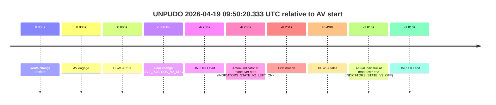
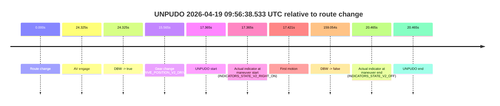
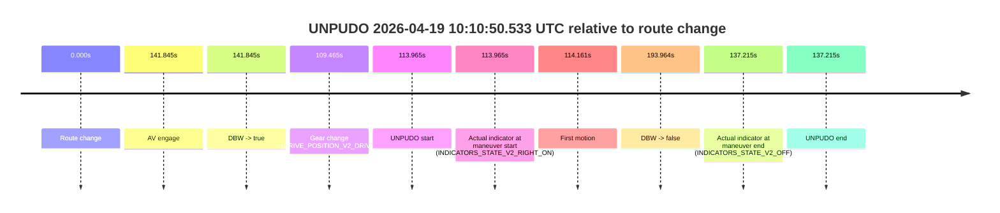
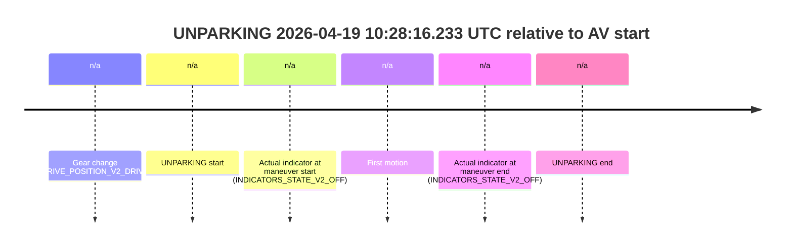

# Run Report: fme20007/2026-04-19--09-47-42--gen2-av-58192aa8-51de-48c3-a532-ba2a80db0867

| Field | Value |
|---|---|
| Run ID | `fme20007/2026-04-19--09-47-42--gen2-av-58192aa8-51de-48c3-a532-ba2a80db0867` |
| Date | `2026-04-19` |
| Model(s) | `apricot-crocodile-uproarious` |
| Author | `guy.geva` |
| Event count | `9` |

## unpudo 2026-04-19 09:50:20.333 UTC

| Field | Value |
|---|---|
| Model | `apricot-crocodile-uproarious` |
| Author | `guy.geva` |
| Run ID | `fme20007/2026-04-19--09-47-42--gen2-av-58192aa8-51de-48c3-a532-ba2a80db0867` |
| Date | `2026-04-19` |
| Time (UTC) | `09:50:20.333` |
| Event type | `unpudo` |
| Disengagement type | `none observed` |
| Route change | `unclear` |
| Console | [run](https://console.sso.wayve.ai/run/fme20007/2026-04-19--09-47-42--gen2-av-58192aa8-51de-48c3-a532-ba2a80db0867?id=&time-unixus=1776592220333313) |
| Foxglove | [segment](https://app.foxglove.dev/wayve-on-prem/p/prj_0dX18KZdVHg1fmmI/view?ds=foxglove-stream&ds.deviceName=fme20007&ds.start=2026-04-19T09%3A50%3A03.133290Z&ds.end=2026-04-19T09%3A51%3A22.091287Z&layoutId=lay_0e7VD4WIKDQGU73Y&time=2026-04-19T09%3A50%3A20.333313Z) |

### Event card: fail

- Fail: the credited unpudo does not stay AV-owned. The event window starts with DBW false, and the maneuver outcome lands outside a clean AV-owned segment.

| Event | Time (UTC) | Delta from AV start |
|---|---:|---:|
| Route change unclear | 2026-04-19 09:50:26.593 | `0.000s` |
| AV engage | 2026-04-19 09:50:26.593 | `0.000s` |
| DBW -> true | 2026-04-19 09:50:26.593 | `0.000s` |
| Gear change (DRIVE_POSITION_V2_DRIVE) | 2026-04-19 09:50:13.133 | `-13.460s` |
| UNPUDO start | 2026-04-19 09:50:20.333 | `-6.260s` |
| Actual indicator at maneuver start (INDICATORS_STATE_V2_LEFT_ON) | 2026-04-19 09:50:20.333 | `-6.260s` |
| First motion | 2026-04-19 09:50:20.389 | `-6.204s` |
| DBW -> false | 2026-04-19 09:51:12.091 | `45.498s` |
| Actual indicator at maneuver end (INDICATORS_STATE_V2_OFF) | 2026-04-19 09:50:24.783 | `-1.810s` |
| UNPUDO end | 2026-04-19 09:50:24.783 | `-1.810s` |

| Metric | Value |
|---|---|
| Outcome | `fail` |
| Effective failure type | `completed_outside_av` |
| Route change status | `unclear` |
| DBW at event start | `false` |
| DBW at event end | `false` |
| Predicted gear at AV start | `DRIVE_POSITION_V2_DRIVE` |
| Actual gear at AV start | `DRIVE_POSITION_V2_DRIVE` |
| Predicted gear at event start | `DRIVE_POSITION_V2_DRIVE` |
| Actual gear at event start | `DRIVE_POSITION_V2_DRIVE` |
| Planned indicator direction | `INDICATORS_STATE_V2_LEFT_ON` |
| Controller indicator direction | `INDICATORS_STATE_V2_LEFT_ON` |
| Actual indicator direction | `INDICATORS_STATE_V2_LEFT_ON` |
| Actual indicator at maneuver end | `INDICATORS_STATE_V2_OFF` |
| Driver accel help in AV | `false` |
| Driver accel help timestamp | `n/a` |
| Max accel pedal pct in AV | `0.0%` |
| Max brake pedal pct in AV | `0.0%` |
| Max speed mps in AV | `0.000` |
| Route -> AV | `n/a` |
| AV -> event start | `-6.260s` |
| AV -> first motion | `-6.204s` |
| AV duration before disengagement | `45.498s` |
| Trajectory waypoint count | `38` |
| Driving-plan step count | `11` |

The scored portion starts from the AV-owned window, not from the pre-AV setup. Route-change search in the stopped pre-event segment was `unclear`, with the baseline therefore set to AV start. At the event anchor the model predicts `DRIVE_POSITION_V2_DRIVE` and the actual gear is `DRIVE_POSITION_V2_DRIVE`. The effective model outcome is `fail` because `completed_outside_av`.

### Resolution

| Field | Value |
|---|---|
| Final outcome | `fail` |
| Do we agree with this label? | `yes` |
| Source disengagement type | `none observed` |
| Resolved effective failure type | `completed_outside_av` |
| Confidence | `medium` |

## unpudo 2026-04-19 09:51:13.483 UTC

| Field | Value |
|---|---|
| Model | `apricot-crocodile-uproarious` |
| Author | `guy.geva` |
| Run ID | `fme20007/2026-04-19--09-47-42--gen2-av-58192aa8-51de-48c3-a532-ba2a80db0867` |
| Date | `2026-04-19` |
| Time (UTC) | `09:51:13.483` |
| Event type | `unpudo` |
| Disengagement type | `none observed` |
| Route change | `found` |
| Console | [run](https://console.sso.wayve.ai/run/fme20007/2026-04-19--09-47-42--gen2-av-58192aa8-51de-48c3-a532-ba2a80db0867?id=&time-unixus=1776592273483296) |
| Foxglove | [segment](https://app.foxglove.dev/wayve-on-prem/p/prj_0dX18KZdVHg1fmmI/view?ds=foxglove-stream&ds.deviceName=fme20007&ds.start=2026-04-19T09%3A50%3A53.768572Z&ds.end=2026-04-19T09%3A56%3A11.652019Z&layoutId=lay_0e7VD4WIKDQGU73Y&time=2026-04-19T09%3A51%3A13.483296Z) |

### Event card: fail

- Fail: the credited unpudo does not stay AV-owned. The event window starts with DBW false, and the maneuver outcome lands outside a clean AV-owned segment.

| Event | Time (UTC) | Delta from route change |
|---|---:|---:|
| Route change | 2026-04-19 09:51:03.768 | `0.000s` |
| AV engage | 2026-04-19 09:51:22.853 | `19.085s` |
| DBW -> true | 2026-04-19 09:51:22.853 | `19.085s` |
| Gear change (DRIVE_POSITION_V2_DRIVE) | 2026-04-19 09:51:04.133 | `0.365s` |
| UNPUDO start | 2026-04-19 09:51:13.483 | `9.715s` |
| Actual indicator at maneuver start (INDICATORS_STATE_V2_RIGHT_ON) | 2026-04-19 09:51:13.483 | `9.715s` |
| First motion | 2026-04-19 09:51:13.549 | `9.781s` |
| DBW -> false | 2026-04-19 09:56:01.652 | `297.883s` |
| Actual indicator at maneuver end (INDICATORS_STATE_V2_OFF) | 2026-04-19 09:51:19.833 | `16.065s` |
| UNPUDO end | 2026-04-19 09:51:19.833 | `16.065s` |

| Metric | Value |
|---|---|
| Outcome | `fail` |
| Effective failure type | `completed_outside_av` |
| Route change status | `found` |
| DBW at event start | `false` |
| DBW at event end | `false` |
| Predicted gear at AV start | `DRIVE_POSITION_V2_DRIVE` |
| Actual gear at AV start | `DRIVE_POSITION_V2_DRIVE` |
| Predicted gear at event start | `DRIVE_POSITION_V2_DRIVE` |
| Actual gear at event start | `DRIVE_POSITION_V2_DRIVE` |
| Planned indicator direction | `INDICATORS_STATE_V2_RIGHT_ON` |
| Controller indicator direction | `INDICATORS_STATE_V2_RIGHT_ON` |
| Actual indicator direction | `INDICATORS_STATE_V2_RIGHT_ON` |
| Actual indicator at maneuver end | `INDICATORS_STATE_V2_OFF` |
| Driver accel help in AV | `false` |
| Driver accel help timestamp | `n/a` |
| Max accel pedal pct in AV | `0.0%` |
| Max brake pedal pct in AV | `0.0%` |
| Max speed mps in AV | `0.000` |
| Route -> AV | `19.085s` |
| AV -> event start | `-9.370s` |
| AV -> first motion | `-9.304s` |
| AV duration before disengagement | `278.799s` |
| Trajectory waypoint count | `37` |
| Driving-plan step count | `11` |

The scored portion starts from the AV-owned window, not from the pre-AV setup. Route-change search in the stopped pre-event segment was `found`, with the baseline therefore set to route change. At the event anchor the model predicts `DRIVE_POSITION_V2_DRIVE` and the actual gear is `DRIVE_POSITION_V2_DRIVE`. The effective model outcome is `fail` because `completed_outside_av`.

### Resolution

| Field | Value |
|---|---|
| Final outcome | `fail` |
| Do we agree with this label? | `yes` |
| Source disengagement type | `none observed` |
| Resolved effective failure type | `completed_outside_av` |
| Confidence | `high` |

## unpudo 2026-04-19 09:56:38.533 UTC

| Field | Value |
|---|---|
| Model | `apricot-crocodile-uproarious` |
| Author | `guy.geva` |
| Run ID | `fme20007/2026-04-19--09-47-42--gen2-av-58192aa8-51de-48c3-a532-ba2a80db0867` |
| Date | `2026-04-19` |
| Time (UTC) | `09:56:38.533` |
| Event type | `unpudo` |
| Disengagement type | `none observed` |
| Route change | `found` |
| Console | [run](https://console.sso.wayve.ai/run/fme20007/2026-04-19--09-47-42--gen2-av-58192aa8-51de-48c3-a532-ba2a80db0867?id=&time-unixus=1776592598533296) |
| Foxglove | [segment](https://app.foxglove.dev/wayve-on-prem/p/prj_0dX18KZdVHg1fmmI/view?ds=foxglove-stream&ds.deviceName=fme20007&ds.start=2026-04-19T09%3A56%3A11.168291Z&ds.end=2026-04-19T09%3A59%3A10.222078Z&layoutId=lay_0e7VD4WIKDQGU73Y&time=2026-04-19T09%3A56%3A38.533296Z) |

### Event card: fail

- Fail: the credited unpudo does not stay AV-owned. The event window starts with DBW false, and the maneuver outcome lands outside a clean AV-owned segment.

| Event | Time (UTC) | Delta from route change |
|---|---:|---:|
| Route change | 2026-04-19 09:56:21.168 | `0.000s` |
| AV engage | 2026-04-19 09:56:45.493 | `24.325s` |
| DBW -> true | 2026-04-19 09:56:45.493 | `24.325s` |
| Gear change (DRIVE_POSITION_V2_DRIVE) | 2026-04-19 09:56:36.733 | `15.565s` |
| UNPUDO start | 2026-04-19 09:56:38.533 | `17.365s` |
| Actual indicator at maneuver start (INDICATORS_STATE_V2_RIGHT_ON) | 2026-04-19 09:56:38.533 | `17.365s` |
| First motion | 2026-04-19 09:56:38.589 | `17.421s` |
| DBW -> false | 2026-04-19 09:59:00.222 | `159.054s` |
| Actual indicator at maneuver end (INDICATORS_STATE_V2_OFF) | 2026-04-19 09:56:41.633 | `20.465s` |
| UNPUDO end | 2026-04-19 09:56:41.633 | `20.465s` |

| Metric | Value |
|---|---|
| Outcome | `fail` |
| Effective failure type | `completed_outside_av` |
| Route change status | `found` |
| DBW at event start | `false` |
| DBW at event end | `false` |
| Predicted gear at AV start | `DRIVE_POSITION_V2_DRIVE` |
| Actual gear at AV start | `DRIVE_POSITION_V2_DRIVE` |
| Predicted gear at event start | `DRIVE_POSITION_V2_DRIVE` |
| Actual gear at event start | `DRIVE_POSITION_V2_DRIVE` |
| Planned indicator direction | `INDICATORS_STATE_V2_RIGHT_ON` |
| Controller indicator direction | `INDICATORS_STATE_V2_RIGHT_ON` |
| Actual indicator direction | `INDICATORS_STATE_V2_RIGHT_ON` |
| Actual indicator at maneuver end | `INDICATORS_STATE_V2_OFF` |
| Driver accel help in AV | `false` |
| Driver accel help timestamp | `n/a` |
| Max accel pedal pct in AV | `0.0%` |
| Max brake pedal pct in AV | `0.0%` |
| Max speed mps in AV | `0.000` |
| Route -> AV | `24.325s` |
| AV -> event start | `-6.960s` |
| AV -> first motion | `-6.904s` |
| AV duration before disengagement | `134.729s` |
| Trajectory waypoint count | `38` |
| Driving-plan step count | `11` |

The scored portion starts from the AV-owned window, not from the pre-AV setup. Route-change search in the stopped pre-event segment was `found`, with the baseline therefore set to route change. At the event anchor the model predicts `DRIVE_POSITION_V2_DRIVE` and the actual gear is `DRIVE_POSITION_V2_DRIVE`. The effective model outcome is `fail` because `completed_outside_av`.

### Resolution

| Field | Value |
|---|---|
| Final outcome | `fail` |
| Do we agree with this label? | `yes` |
| Source disengagement type | `none observed` |
| Resolved effective failure type | `completed_outside_av` |
| Confidence | `high` |

## unpudo 2026-04-19 09:59:06.083 UTC

| Field | Value |
|---|---|
| Model | `apricot-crocodile-uproarious` |
| Author | `guy.geva` |
| Run ID | `fme20007/2026-04-19--09-47-42--gen2-av-58192aa8-51de-48c3-a532-ba2a80db0867` |
| Date | `2026-04-19` |
| Time (UTC) | `09:59:06.083` |
| Event type | `unpudo` |
| Disengagement type | `none observed` |
| Route change | `found` |
| Console | [run](https://console.sso.wayve.ai/run/fme20007/2026-04-19--09-47-42--gen2-av-58192aa8-51de-48c3-a532-ba2a80db0867?id=&time-unixus=1776592746083309) |
| Foxglove | [segment](https://app.foxglove.dev/wayve-on-prem/p/prj_0dX18KZdVHg1fmmI/view?ds=foxglove-stream&ds.deviceName=fme20007&ds.start=2026-04-19T09%3A58%3A47.268251Z&ds.end=2026-04-19T09%3A59%3A56.991284Z&layoutId=lay_0e7VD4WIKDQGU73Y&time=2026-04-19T09%3A59%3A06.083309Z) |

### Event card: fail

- Fail: the credited unpudo does not stay AV-owned. The event window starts with DBW false, and the maneuver outcome lands outside a clean AV-owned segment.

| Event | Time (UTC) | Delta from route change |
|---|---:|---:|
| Route change | 2026-04-19 09:58:57.268 | `0.000s` |
| AV engage | 2026-04-19 09:59:15.991 | `18.724s` |
| DBW -> true | 2026-04-19 09:59:15.991 | `18.724s` |
| Gear change (DRIVE_POSITION_V2_DRIVE) | 2026-04-19 09:59:01.533 | `4.265s` |
| UNPUDO start | 2026-04-19 09:59:06.083 | `8.815s` |
| Actual indicator at maneuver start (INDICATORS_STATE_V2_RIGHT_ON) | 2026-04-19 09:59:06.083 | `8.815s` |
| First motion | 2026-04-19 09:59:06.109 | `8.841s` |
| DBW -> false | 2026-04-19 09:59:46.991 | `49.723s` |
| Actual indicator at maneuver end (INDICATORS_STATE_V2_OFF) | 2026-04-19 09:59:11.133 | `13.865s` |
| UNPUDO end | 2026-04-19 09:59:11.133 | `13.865s` |

| Metric | Value |
|---|---|
| Outcome | `fail` |
| Effective failure type | `completed_outside_av` |
| Route change status | `found` |
| DBW at event start | `false` |
| DBW at event end | `false` |
| Predicted gear at AV start | `DRIVE_POSITION_V2_DRIVE` |
| Actual gear at AV start | `DRIVE_POSITION_V2_DRIVE` |
| Predicted gear at event start | `DRIVE_POSITION_V2_DRIVE` |
| Actual gear at event start | `DRIVE_POSITION_V2_DRIVE` |
| Planned indicator direction | `INDICATORS_STATE_V2_RIGHT_ON` |
| Controller indicator direction | `INDICATORS_STATE_V2_RIGHT_ON` |
| Actual indicator direction | `INDICATORS_STATE_V2_RIGHT_ON` |
| Actual indicator at maneuver end | `INDICATORS_STATE_V2_OFF` |
| Driver accel help in AV | `false` |
| Driver accel help timestamp | `n/a` |
| Max accel pedal pct in AV | `0.0%` |
| Max brake pedal pct in AV | `0.0%` |
| Max speed mps in AV | `0.000` |
| Route -> AV | `18.724s` |
| AV -> event start | `-9.909s` |
| AV -> first motion | `-9.882s` |
| AV duration before disengagement | `30.999s` |
| Trajectory waypoint count | `37` |
| Driving-plan step count | `11` |

The scored portion starts from the AV-owned window, not from the pre-AV setup. Route-change search in the stopped pre-event segment was `found`, with the baseline therefore set to route change. At the event anchor the model predicts `DRIVE_POSITION_V2_DRIVE` and the actual gear is `DRIVE_POSITION_V2_DRIVE`. The effective model outcome is `fail` because `completed_outside_av`.

### Resolution

| Field | Value |
|---|---|
| Final outcome | `fail` |
| Do we agree with this label? | `yes` |
| Source disengagement type | `none observed` |
| Resolved effective failure type | `completed_outside_av` |
| Confidence | `high` |

## unpudo 2026-04-19 10:07:04.733 UTC

| Field | Value |
|---|---|
| Model | `apricot-crocodile-uproarious` |
| Author | `guy.geva` |
| Run ID | `fme20007/2026-04-19--09-47-42--gen2-av-58192aa8-51de-48c3-a532-ba2a80db0867` |
| Date | `2026-04-19` |
| Time (UTC) | `10:07:04.733` |
| Event type | `unpudo` |
| Disengagement type | `none observed` |
| Route change | `found` |
| Console | [run](https://console.sso.wayve.ai/run/fme20007/2026-04-19--09-47-42--gen2-av-58192aa8-51de-48c3-a532-ba2a80db0867?id=&time-unixus=1776593224733303) |
| Foxglove | [segment](https://app.foxglove.dev/wayve-on-prem/p/prj_0dX18KZdVHg1fmmI/view?ds=foxglove-stream&ds.deviceName=fme20007&ds.start=2026-04-19T10%3A05%3A08.268479Z&ds.end=2026-04-19T10%3A10%3A54.502077Z&layoutId=lay_0e7VD4WIKDQGU73Y&time=2026-04-19T10%3A07%3A04.733303Z) |

### Event card: fail

- Fail: the credited unpudo does not stay AV-owned. The event window starts with DBW false, and the maneuver outcome lands outside a clean AV-owned segment.

| Event | Time (UTC) | Delta from route change |
|---|---:|---:|
| Route change | 2026-04-19 10:05:18.268 | `0.000s` |
| AV engage | 2026-04-19 10:07:10.911 | `112.643s` |
| DBW -> true | 2026-04-19 10:07:10.911 | `112.643s` |
| Gear change (DRIVE_POSITION_V2_DRIVE) | 2026-04-19 10:06:58.283 | `100.015s` |
| UNPUDO start | 2026-04-19 10:07:04.733 | `106.465s` |
| Actual indicator at maneuver start (INDICATORS_STATE_V2_LEFT_ON) | 2026-04-19 10:07:04.733 | `106.465s` |
| First motion | 2026-04-19 10:07:04.789 | `106.521s` |
| DBW -> false | 2026-04-19 10:10:44.502 | `326.234s` |
| Actual indicator at maneuver end (INDICATORS_STATE_V2_OFF) | 2026-04-19 10:07:09.333 | `111.065s` |
| UNPUDO end | 2026-04-19 10:07:09.333 | `111.065s` |

| Metric | Value |
|---|---|
| Outcome | `fail` |
| Effective failure type | `completed_outside_av` |
| Route change status | `found` |
| DBW at event start | `false` |
| DBW at event end | `false` |
| Predicted gear at AV start | `DRIVE_POSITION_V2_DRIVE` |
| Actual gear at AV start | `DRIVE_POSITION_V2_DRIVE` |
| Predicted gear at event start | `DRIVE_POSITION_V2_DRIVE` |
| Actual gear at event start | `DRIVE_POSITION_V2_DRIVE` |
| Planned indicator direction | `INDICATORS_STATE_V2_LEFT_ON` |
| Controller indicator direction | `INDICATORS_STATE_V2_LEFT_ON` |
| Actual indicator direction | `INDICATORS_STATE_V2_LEFT_ON` |
| Actual indicator at maneuver end | `INDICATORS_STATE_V2_OFF` |
| Driver accel help in AV | `false` |
| Driver accel help timestamp | `n/a` |
| Max accel pedal pct in AV | `0.0%` |
| Max brake pedal pct in AV | `0.0%` |
| Max speed mps in AV | `0.000` |
| Route -> AV | `112.643s` |
| AV -> event start | `-6.179s` |
| AV -> first motion | `-6.122s` |
| AV duration before disengagement | `213.590s` |
| Trajectory waypoint count | `38` |
| Driving-plan step count | `11` |

The scored portion starts from the AV-owned window, not from the pre-AV setup. Route-change search in the stopped pre-event segment was `found`, with the baseline therefore set to route change. At the event anchor the model predicts `DRIVE_POSITION_V2_DRIVE` and the actual gear is `DRIVE_POSITION_V2_DRIVE`. The effective model outcome is `fail` because `completed_outside_av`.

### Resolution

| Field | Value |
|---|---|
| Final outcome | `fail` |
| Do we agree with this label? | `yes` |
| Source disengagement type | `none observed` |
| Resolved effective failure type | `completed_outside_av` |
| Confidence | `high` |

## unpudo 2026-04-19 10:10:50.533 UTC

| Field | Value |
|---|---|
| Model | `apricot-crocodile-uproarious` |
| Author | `guy.geva` |
| Run ID | `fme20007/2026-04-19--09-47-42--gen2-av-58192aa8-51de-48c3-a532-ba2a80db0867` |
| Date | `2026-04-19` |
| Time (UTC) | `10:10:50.533` |
| Event type | `unpudo` |
| Disengagement type | `none observed` |
| Route change | `found` |
| Console | [run](https://console.sso.wayve.ai/run/fme20007/2026-04-19--09-47-42--gen2-av-58192aa8-51de-48c3-a532-ba2a80db0867?id=&time-unixus=1776593450533314) |
| Foxglove | [segment](https://app.foxglove.dev/wayve-on-prem/p/prj_0dX18KZdVHg1fmmI/view?ds=foxglove-stream&ds.deviceName=fme20007&ds.start=2026-04-19T10%3A08%3A46.568239Z&ds.end=2026-04-19T10%3A12%3A20.532635Z&layoutId=lay_0e7VD4WIKDQGU73Y&time=2026-04-19T10%3A10%3A50.533314Z) |

### Event card: fail

- Fail: the credited unpudo does not stay AV-owned. The event window starts with DBW false, and the maneuver outcome lands outside a clean AV-owned segment.

| Event | Time (UTC) | Delta from route change |
|---|---:|---:|
| Route change | 2026-04-19 10:08:56.568 | `0.000s` |
| AV engage | 2026-04-19 10:11:18.413 | `141.845s` |
| DBW -> true | 2026-04-19 10:11:18.413 | `141.845s` |
| Gear change (DRIVE_POSITION_V2_DRIVE) | 2026-04-19 10:10:46.033 | `109.465s` |
| UNPUDO start | 2026-04-19 10:10:50.533 | `113.965s` |
| Actual indicator at maneuver start (INDICATORS_STATE_V2_RIGHT_ON) | 2026-04-19 10:10:50.533 | `113.965s` |
| First motion | 2026-04-19 10:10:50.729 | `114.161s` |
| DBW -> false | 2026-04-19 10:12:10.532 | `193.964s` |
| Actual indicator at maneuver end (INDICATORS_STATE_V2_OFF) | 2026-04-19 10:11:13.783 | `137.215s` |
| UNPUDO end | 2026-04-19 10:11:13.783 | `137.215s` |

| Metric | Value |
|---|---|
| Outcome | `fail` |
| Effective failure type | `completed_outside_av` |
| Route change status | `found` |
| DBW at event start | `false` |
| DBW at event end | `false` |
| Predicted gear at AV start | `DRIVE_POSITION_V2_DRIVE` |
| Actual gear at AV start | `DRIVE_POSITION_V2_DRIVE` |
| Predicted gear at event start | `DRIVE_POSITION_V2_REVERSE` |
| Actual gear at event start | `DRIVE_POSITION_V2_DRIVE` |
| Planned indicator direction | `INDICATORS_STATE_V2_RIGHT_ON` |
| Controller indicator direction | `INDICATORS_STATE_V2_RIGHT_ON` |
| Actual indicator direction | `INDICATORS_STATE_V2_RIGHT_ON` |
| Actual indicator at maneuver end | `INDICATORS_STATE_V2_OFF` |
| Driver accel help in AV | `false` |
| Driver accel help timestamp | `n/a` |
| Max accel pedal pct in AV | `0.0%` |
| Max brake pedal pct in AV | `0.0%` |
| Max speed mps in AV | `0.000` |
| Route -> AV | `141.845s` |
| AV -> event start | `-27.880s` |
| AV -> first motion | `-27.684s` |
| AV duration before disengagement | `52.119s` |
| Trajectory waypoint count | `36` |
| Driving-plan step count | `11` |

The scored portion starts from the AV-owned window, not from the pre-AV setup. Route-change search in the stopped pre-event segment was `found`, with the baseline therefore set to route change. At the event anchor the model predicts `DRIVE_POSITION_V2_REVERSE` and the actual gear is `DRIVE_POSITION_V2_DRIVE`. The effective model outcome is `fail` because `completed_outside_av`.

### Resolution

| Field | Value |
|---|---|
| Final outcome | `fail` |
| Do we agree with this label? | `yes` |
| Source disengagement type | `none observed` |
| Resolved effective failure type | `completed_outside_av` |
| Confidence | `high` |

## unpudo 2026-04-19 10:15:49.533 UTC

| Field | Value |
|---|---|
| Model | `apricot-crocodile-uproarious` |
| Author | `guy.geva` |
| Run ID | `fme20007/2026-04-19--09-47-42--gen2-av-58192aa8-51de-48c3-a532-ba2a80db0867` |
| Date | `2026-04-19` |
| Time (UTC) | `10:15:49.533` |
| Event type | `unpudo` |
| Disengagement type | `none observed` |
| Route change | `found` |
| Console | [run](https://console.sso.wayve.ai/run/fme20007/2026-04-19--09-47-42--gen2-av-58192aa8-51de-48c3-a532-ba2a80db0867?id=&time-unixus=1776593749533308) |
| Foxglove | [segment](https://app.foxglove.dev/wayve-on-prem/p/prj_0dX18KZdVHg1fmmI/view?ds=foxglove-stream&ds.deviceName=fme20007&ds.start=2026-04-19T10%3A15%3A31.218265Z&ds.end=2026-04-19T10%3A17%3A28.911229Z&layoutId=lay_0e7VD4WIKDQGU73Y&time=2026-04-19T10%3A15%3A49.533308Z) |

### Event card: fail

- Fail: the credited unpudo does not stay AV-owned. The event window starts with DBW false, and the maneuver outcome lands outside a clean AV-owned segment.

| Event | Time (UTC) | Delta from route change |
|---|---:|---:|
| Route change | 2026-04-19 10:15:41.218 | `0.000s` |
| AV engage | 2026-04-19 10:15:54.733 | `13.515s` |
| DBW -> true | 2026-04-19 10:15:54.733 | `13.515s` |
| Gear change (DRIVE_POSITION_V2_DRIVE) | 2026-04-19 10:15:41.533 | `0.315s` |
| UNPUDO start | 2026-04-19 10:15:49.533 | `8.315s` |
| Actual indicator at maneuver start (INDICATORS_STATE_V2_RIGHT_ON) | 2026-04-19 10:15:49.533 | `8.315s` |
| First motion | 2026-04-19 10:15:49.589 | `8.371s` |
| DBW -> false | 2026-04-19 10:17:18.911 | `97.693s` |
| Actual indicator at maneuver end (INDICATORS_STATE_V2_OFF) | 2026-04-19 10:15:52.533 | `11.315s` |
| UNPUDO end | 2026-04-19 10:15:52.533 | `11.315s` |

| Metric | Value |
|---|---|
| Outcome | `fail` |
| Effective failure type | `completed_outside_av` |
| Route change status | `found` |
| DBW at event start | `false` |
| DBW at event end | `false` |
| Predicted gear at AV start | `DRIVE_POSITION_V2_DRIVE` |
| Actual gear at AV start | `DRIVE_POSITION_V2_DRIVE` |
| Predicted gear at event start | `DRIVE_POSITION_V2_DRIVE` |
| Actual gear at event start | `DRIVE_POSITION_V2_DRIVE` |
| Planned indicator direction | `INDICATORS_STATE_V2_RIGHT_ON` |
| Controller indicator direction | `INDICATORS_STATE_V2_RIGHT_ON` |
| Actual indicator direction | `INDICATORS_STATE_V2_RIGHT_ON` |
| Actual indicator at maneuver end | `INDICATORS_STATE_V2_OFF` |
| Driver accel help in AV | `false` |
| Driver accel help timestamp | `n/a` |
| Max accel pedal pct in AV | `0.0%` |
| Max brake pedal pct in AV | `0.0%` |
| Max speed mps in AV | `0.000` |
| Route -> AV | `13.515s` |
| AV -> event start | `-5.200s` |
| AV -> first motion | `-5.144s` |
| AV duration before disengagement | `84.178s` |
| Trajectory waypoint count | `38` |
| Driving-plan step count | `11` |

The scored portion starts from the AV-owned window, not from the pre-AV setup. Route-change search in the stopped pre-event segment was `found`, with the baseline therefore set to route change. At the event anchor the model predicts `DRIVE_POSITION_V2_DRIVE` and the actual gear is `DRIVE_POSITION_V2_DRIVE`. The effective model outcome is `fail` because `completed_outside_av`.

### Resolution

| Field | Value |
|---|---|
| Final outcome | `fail` |
| Do we agree with this label? | `yes` |
| Source disengagement type | `none observed` |
| Resolved effective failure type | `completed_outside_av` |
| Confidence | `high` |

## unpudo 2026-04-19 10:19:41.783 UTC

| Field | Value |
|---|---|
| Model | `apricot-crocodile-uproarious` |
| Author | `guy.geva` |
| Run ID | `fme20007/2026-04-19--09-47-42--gen2-av-58192aa8-51de-48c3-a532-ba2a80db0867` |
| Date | `2026-04-19` |
| Time (UTC) | `10:19:41.783` |
| Event type | `unpudo` |
| Disengagement type | `none observed` |
| Route change | `found` |
| Console | [run](https://console.sso.wayve.ai/run/fme20007/2026-04-19--09-47-42--gen2-av-58192aa8-51de-48c3-a532-ba2a80db0867?id=&time-unixus=1776593981783324) |
| Foxglove | [segment](https://app.foxglove.dev/wayve-on-prem/p/prj_0dX18KZdVHg1fmmI/view?ds=foxglove-stream&ds.deviceName=fme20007&ds.start=2026-04-19T10%3A19%3A13.718278Z&ds.end=2026-04-19T10%3A20%3A59.971865Z&layoutId=lay_0e7VD4WIKDQGU73Y&time=2026-04-19T10%3A19%3A41.783324Z) |

### Event card: fail

- Fail: the credited unpudo does not stay AV-owned. The event window starts with DBW false, and the maneuver outcome lands outside a clean AV-owned segment.

| Event | Time (UTC) | Delta from route change |
|---|---:|---:|
| Route change | 2026-04-19 10:19:23.718 | `0.000s` |
| AV engage | 2026-04-19 10:19:47.073 | `23.355s` |
| DBW -> true | 2026-04-19 10:19:47.073 | `23.355s` |
| Gear change (DRIVE_POSITION_V2_DRIVE) | 2026-04-19 10:19:39.233 | `15.515s` |
| UNPUDO start | 2026-04-19 10:19:41.783 | `18.065s` |
| Actual indicator at maneuver start (INDICATORS_STATE_V2_LEFT_ON) | 2026-04-19 10:19:41.783 | `18.065s` |
| First motion | 2026-04-19 10:19:41.809 | `18.091s` |
| DBW -> false | 2026-04-19 10:20:49.971 | `86.254s` |
| Actual indicator at maneuver end (INDICATORS_STATE_V2_OFF) | 2026-04-19 10:19:45.583 | `21.865s` |
| UNPUDO end | 2026-04-19 10:19:45.583 | `21.865s` |

| Metric | Value |
|---|---|
| Outcome | `fail` |
| Effective failure type | `completed_outside_av` |
| Route change status | `found` |
| DBW at event start | `false` |
| DBW at event end | `false` |
| Predicted gear at AV start | `DRIVE_POSITION_V2_DRIVE` |
| Actual gear at AV start | `DRIVE_POSITION_V2_DRIVE` |
| Predicted gear at event start | `DRIVE_POSITION_V2_REVERSE` |
| Actual gear at event start | `DRIVE_POSITION_V2_DRIVE` |
| Planned indicator direction | `INDICATORS_STATE_V2_OFF` |
| Controller indicator direction | `INDICATORS_STATE_V2_OFF` |
| Actual indicator direction | `INDICATORS_STATE_V2_LEFT_ON` |
| Actual indicator at maneuver end | `INDICATORS_STATE_V2_OFF` |
| Driver accel help in AV | `false` |
| Driver accel help timestamp | `n/a` |
| Max accel pedal pct in AV | `0.0%` |
| Max brake pedal pct in AV | `0.0%` |
| Max speed mps in AV | `0.000` |
| Route -> AV | `23.355s` |
| AV -> event start | `-5.290s` |
| AV -> first motion | `-5.264s` |
| AV duration before disengagement | `62.898s` |
| Trajectory waypoint count | `37` |
| Driving-plan step count | `11` |

The scored portion starts from the AV-owned window, not from the pre-AV setup. Route-change search in the stopped pre-event segment was `found`, with the baseline therefore set to route change. At the event anchor the model predicts `DRIVE_POSITION_V2_REVERSE` and the actual gear is `DRIVE_POSITION_V2_DRIVE`. The effective model outcome is `fail` because `completed_outside_av`.

### Resolution

| Field | Value |
|---|---|
| Final outcome | `fail` |
| Do we agree with this label? | `yes` |
| Source disengagement type | `none observed` |
| Resolved effective failure type | `completed_outside_av` |
| Confidence | `high` |

## unparking 2026-04-19 10:28:16.233 UTC

| Field | Value |
|---|---|
| Model | `apricot-crocodile-uproarious` |
| Author | `guy.geva` |
| Run ID | `fme20007/2026-04-19--09-47-42--gen2-av-58192aa8-51de-48c3-a532-ba2a80db0867` |
| Date | `2026-04-19` |
| Time (UTC) | `10:28:16.233` |
| Event type | `unparking` |
| Disengagement type | `none observed` |
| Route change | `unclear` |
| Console | [run](https://console.sso.wayve.ai/run/fme20007/2026-04-19--09-47-42--gen2-av-58192aa8-51de-48c3-a532-ba2a80db0867?id=&time-unixus=1776594496233297) |
| Foxglove | [segment](https://app.foxglove.dev/wayve-on-prem/p/prj_0dX18KZdVHg1fmmI/view?ds=foxglove-stream&ds.deviceName=fme20007&ds.start=2026-04-19T10%3A28%3A05.033310Z&ds.end=2026-04-19T10%3A28%3A30.433309Z&layoutId=lay_0e7VD4WIKDQGU73Y&time=2026-04-19T10%3A28%3A16.233297Z) |

### Event card: fail

- Fail: the credited unparking does not stay AV-owned. The event window starts with DBW false, and the maneuver outcome lands outside a clean AV-owned segment.

| Event | Time (UTC) | Delta from AV start |
|---|---:|---:|
| Gear change (DRIVE_POSITION_V2_DRIVE) | 2026-04-19 10:28:15.033 | `n/a` |
| UNPARKING start | 2026-04-19 10:28:16.233 | `n/a` |
| Actual indicator at maneuver start (INDICATORS_STATE_V2_OFF) | 2026-04-19 10:28:16.233 | `n/a` |
| First motion | 2026-04-19 10:28:16.290 | `n/a` |
| Actual indicator at maneuver end (INDICATORS_STATE_V2_OFF) | 2026-04-19 10:28:20.433 | `n/a` |
| UNPARKING end | 2026-04-19 10:28:20.433 | `n/a` |

| Metric | Value |
|---|---|
| Outcome | `fail` |
| Effective failure type | `not_av_owned` |
| Route change status | `unclear` |
| DBW at event start | `false` |
| DBW at event end | `false` |
| Predicted gear at AV start | `n/a` |
| Actual gear at AV start | `n/a` |
| Predicted gear at event start | `DRIVE_POSITION_V2_DRIVE` |
| Actual gear at event start | `DRIVE_POSITION_V2_DRIVE` |
| Planned indicator direction | `INDICATORS_STATE_V2_OFF` |
| Controller indicator direction | `INDICATORS_STATE_V2_OFF` |
| Actual indicator direction | `INDICATORS_STATE_V2_OFF` |
| Actual indicator at maneuver end | `INDICATORS_STATE_V2_OFF` |
| Driver accel help in AV | `false` |
| Driver accel help timestamp | `n/a` |
| Max accel pedal pct in AV | `0.0%` |
| Max brake pedal pct in AV | `0.0%` |
| Max speed mps in AV | `0.000` |
| Route -> AV | `n/a` |
| AV -> event start | `n/a` |
| AV -> first motion | `n/a` |
| AV duration before disengagement | `n/a` |
| Trajectory waypoint count | `36` |
| Driving-plan step count | `11` |

The scored portion starts from the AV-owned window, not from the pre-AV setup. Route-change search in the stopped pre-event segment was `unclear`, with the baseline therefore set to AV start. At the event anchor the model predicts `DRIVE_POSITION_V2_DRIVE` and the actual gear is `DRIVE_POSITION_V2_DRIVE`. The effective model outcome is `fail` because `not_av_owned`.

### Resolution

| Field | Value |
|---|---|
| Final outcome | `fail` |
| Do we agree with this label? | `yes` |
| Source disengagement type | `none observed` |
| Resolved effective failure type | `not_av_owned` |
| Confidence | `medium` |
