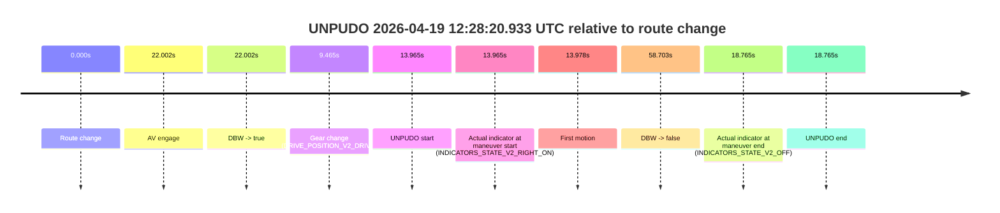
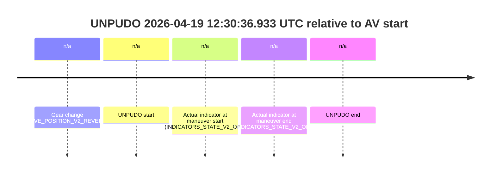
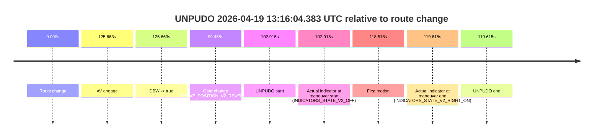

# Run Report: fme20007/2026-04-19--12-11-27--gen2-av-8241e26d-b38c-4797-b1d9-05895b053e63

| Field | Value |
|---|---|
| Run ID | `fme20007/2026-04-19--12-11-27--gen2-av-8241e26d-b38c-4797-b1d9-05895b053e63` |
| Date | `2026-04-19` |
| Model(s) | `apricot-crocodile-uproarious` |
| Author | `guy.geva` |
| Event count | `8` |

## unpudo 2026-04-19 12:28:20.933 UTC

| Field | Value |
|---|---|
| Model | `apricot-crocodile-uproarious` |
| Author | `guy.geva` |
| Run ID | `fme20007/2026-04-19--12-11-27--gen2-av-8241e26d-b38c-4797-b1d9-05895b053e63` |
| Date | `2026-04-19` |
| Time (UTC) | `12:28:20.933` |
| Event type | `unpudo` |
| Disengagement type | `none observed` |
| Route change | `found` |
| Console | [run](https://console.sso.wayve.ai/run/fme20007/2026-04-19--12-11-27--gen2-av-8241e26d-b38c-4797-b1d9-05895b053e63?id=&time-unixus=1776601700933314) |
| Foxglove | [segment](https://app.foxglove.dev/wayve-on-prem/p/prj_0dX18KZdVHg1fmmI/view?ds=foxglove-stream&ds.deviceName=fme20007&ds.start=2026-04-19T12%3A27%3A56.968265Z&ds.end=2026-04-19T12%3A29%3A15.671135Z&layoutId=lay_0e7VD4WIKDQGU73Y&time=2026-04-19T12%3A28%3A20.933314Z) |

### Event card: fail

- Fail: the credited unpudo does not stay AV-owned. The event window starts with DBW false, and the maneuver outcome lands outside a clean AV-owned segment.

| Event | Time (UTC) | Delta from route change |
|---|---:|---:|
| Route change | 2026-04-19 12:28:06.968 | `0.000s` |
| AV engage | 2026-04-19 12:28:28.969 | `22.002s` |
| DBW -> true | 2026-04-19 12:28:28.969 | `22.002s` |
| Gear change (DRIVE_POSITION_V2_DRIVE) | 2026-04-19 12:28:16.433 | `9.465s` |
| UNPUDO start | 2026-04-19 12:28:20.933 | `13.965s` |
| Actual indicator at maneuver start (INDICATORS_STATE_V2_RIGHT_ON) | 2026-04-19 12:28:20.933 | `13.965s` |
| First motion | 2026-04-19 12:28:20.945 | `13.978s` |
| DBW -> false | 2026-04-19 12:29:05.671 | `58.703s` |
| Actual indicator at maneuver end (INDICATORS_STATE_V2_OFF) | 2026-04-19 12:28:25.733 | `18.765s` |
| UNPUDO end | 2026-04-19 12:28:25.733 | `18.765s` |

| Metric | Value |
|---|---|
| Outcome | `fail` |
| Effective failure type | `completed_outside_av` |
| Route change status | `found` |
| DBW at event start | `false` |
| DBW at event end | `false` |
| Predicted gear at AV start | `DRIVE_POSITION_V2_DRIVE` |
| Actual gear at AV start | `DRIVE_POSITION_V2_DRIVE` |
| Predicted gear at event start | `DRIVE_POSITION_V2_DRIVE` |
| Actual gear at event start | `DRIVE_POSITION_V2_DRIVE` |
| Planned indicator direction | `INDICATORS_STATE_V2_RIGHT_ON` |
| Controller indicator direction | `INDICATORS_STATE_V2_RIGHT_ON` |
| Actual indicator direction | `INDICATORS_STATE_V2_RIGHT_ON` |
| Actual indicator at maneuver end | `INDICATORS_STATE_V2_OFF` |
| Driver accel help in AV | `false` |
| Driver accel help timestamp | `n/a` |
| Max accel pedal pct in AV | `0.0%` |
| Max brake pedal pct in AV | `0.0%` |
| Max speed mps in AV | `0.000` |
| Route -> AV | `22.002s` |
| AV -> event start | `-8.037s` |
| AV -> first motion | `-8.024s` |
| AV duration before disengagement | `36.701s` |
| Trajectory waypoint count | `36` |
| Driving-plan step count | `11` |

The scored portion starts from the AV-owned window, not from the pre-AV setup. Route-change search in the stopped pre-event segment was `found`, with the baseline therefore set to route change. At the event anchor the model predicts `DRIVE_POSITION_V2_DRIVE` and the actual gear is `DRIVE_POSITION_V2_DRIVE`. The effective model outcome is `fail` because `completed_outside_av`.

### Resolution

| Field | Value |
|---|---|
| Final outcome | `fail` |
| Do we agree with this label? | `yes` |
| Source disengagement type | `none observed` |
| Resolved effective failure type | `completed_outside_av` |
| Confidence | `high` |

## unpudo 2026-04-19 12:30:36.933 UTC

| Field | Value |
|---|---|
| Model | `apricot-crocodile-uproarious` |
| Author | `guy.geva` |
| Run ID | `fme20007/2026-04-19--12-11-27--gen2-av-8241e26d-b38c-4797-b1d9-05895b053e63` |
| Date | `2026-04-19` |
| Time (UTC) | `12:30:36.933` |
| Event type | `unpudo` |
| Disengagement type | `none observed` |
| Route change | `unclear` |
| Console | [run](https://console.sso.wayve.ai/run/fme20007/2026-04-19--12-11-27--gen2-av-8241e26d-b38c-4797-b1d9-05895b053e63?id=&time-unixus=1776601836933319) |
| Foxglove | [segment](https://app.foxglove.dev/wayve-on-prem/p/prj_0dX18KZdVHg1fmmI/view?ds=foxglove-stream&ds.deviceName=fme20007&ds.start=2026-04-19T12%3A30%3A24.333303Z&ds.end=2026-04-19T12%3A30%3A46.933319Z&layoutId=lay_0e7VD4WIKDQGU73Y&time=2026-04-19T12%3A30%3A36.933319Z) |

### Event card: fail

- Fail: the credited unpudo does not stay AV-owned. The event window starts with DBW false, and the maneuver outcome lands outside a clean AV-owned segment.

| Event | Time (UTC) | Delta from AV start |
|---|---:|---:|
| Gear change (DRIVE_POSITION_V2_REVERSE) | 2026-04-19 12:30:34.333 | `n/a` |
| UNPUDO start | 2026-04-19 12:30:36.933 | `n/a` |
| Actual indicator at maneuver start (INDICATORS_STATE_V2_OFF) | 2026-04-19 12:30:36.933 | `n/a` |
| Actual indicator at maneuver end (INDICATORS_STATE_V2_OFF) | 2026-04-19 12:30:36.933 | `n/a` |
| UNPUDO end | 2026-04-19 12:30:36.933 | `n/a` |

| Metric | Value |
|---|---|
| Outcome | `fail` |
| Effective failure type | `not_av_owned` |
| Route change status | `unclear` |
| DBW at event start | `false` |
| DBW at event end | `false` |
| Predicted gear at AV start | `n/a` |
| Actual gear at AV start | `n/a` |
| Predicted gear at event start | `DRIVE_POSITION_V2_REVERSE` |
| Actual gear at event start | `DRIVE_POSITION_V2_REVERSE` |
| Planned indicator direction | `INDICATORS_STATE_V2_OFF` |
| Controller indicator direction | `INDICATORS_STATE_V2_OFF` |
| Actual indicator direction | `INDICATORS_STATE_V2_OFF` |
| Actual indicator at maneuver end | `INDICATORS_STATE_V2_OFF` |
| Driver accel help in AV | `false` |
| Driver accel help timestamp | `n/a` |
| Max accel pedal pct in AV | `0.0%` |
| Max brake pedal pct in AV | `0.0%` |
| Max speed mps in AV | `0.000` |
| Route -> AV | `n/a` |
| AV -> event start | `n/a` |
| AV -> first motion | `n/a` |
| AV duration before disengagement | `n/a` |
| Trajectory waypoint count | `36` |
| Driving-plan step count | `11` |

The scored portion starts from the AV-owned window, not from the pre-AV setup. Route-change search in the stopped pre-event segment was `unclear`, with the baseline therefore set to AV start. At the event anchor the model predicts `DRIVE_POSITION_V2_REVERSE` and the actual gear is `DRIVE_POSITION_V2_REVERSE`. The effective model outcome is `fail` because `not_av_owned`.

### Resolution

| Field | Value |
|---|---|
| Final outcome | `fail` |
| Do we agree with this label? | `yes` |
| Source disengagement type | `none observed` |
| Resolved effective failure type | `not_av_owned` |
| Confidence | `medium` |

## unpudo 2026-04-19 12:38:02.383 UTC

| Field | Value |
|---|---|
| Model | `apricot-crocodile-uproarious` |
| Author | `guy.geva` |
| Run ID | `fme20007/2026-04-19--12-11-27--gen2-av-8241e26d-b38c-4797-b1d9-05895b053e63` |
| Date | `2026-04-19` |
| Time (UTC) | `12:38:02.383` |
| Event type | `unpudo` |
| Disengagement type | `none observed` |
| Route change | `found` |
| Console | [run](https://console.sso.wayve.ai/run/fme20007/2026-04-19--12-11-27--gen2-av-8241e26d-b38c-4797-b1d9-05895b053e63?id=&time-unixus=1776602282383306) |
| Foxglove | [segment](https://app.foxglove.dev/wayve-on-prem/p/prj_0dX18KZdVHg1fmmI/view?ds=foxglove-stream&ds.deviceName=fme20007&ds.start=2026-04-19T12%3A37%3A38.018257Z&ds.end=2026-04-19T12%3A38%3A59.249984Z&layoutId=lay_0e7VD4WIKDQGU73Y&time=2026-04-19T12%3A38%3A02.383306Z) |

### Event card: fail

- Fail: the credited unpudo does not stay AV-owned. The event window starts with DBW false, and the maneuver outcome lands outside a clean AV-owned segment.

| Event | Time (UTC) | Delta from route change |
|---|---:|---:|
| Route change | 2026-04-19 12:37:48.018 | `0.000s` |
| AV engage | 2026-04-19 12:38:08.789 | `20.772s` |
| DBW -> true | 2026-04-19 12:38:08.789 | `20.772s` |
| Gear change (DRIVE_POSITION_V2_DRIVE) | 2026-04-19 12:37:52.283 | `4.265s` |
| UNPUDO start | 2026-04-19 12:38:02.383 | `14.365s` |
| Actual indicator at maneuver start (INDICATORS_STATE_V2_LEFT_ON) | 2026-04-19 12:38:02.383 | `14.365s` |
| First motion | 2026-04-19 12:38:02.466 | `14.448s` |
| DBW -> false | 2026-04-19 12:38:49.249 | `61.232s` |
| Actual indicator at maneuver end (INDICATORS_STATE_V2_OFF) | 2026-04-19 12:38:06.283 | `18.265s` |
| UNPUDO end | 2026-04-19 12:38:06.283 | `18.265s` |

| Metric | Value |
|---|---|
| Outcome | `fail` |
| Effective failure type | `completed_outside_av` |
| Route change status | `found` |
| DBW at event start | `false` |
| DBW at event end | `false` |
| Predicted gear at AV start | `DRIVE_POSITION_V2_DRIVE` |
| Actual gear at AV start | `DRIVE_POSITION_V2_DRIVE` |
| Predicted gear at event start | `DRIVE_POSITION_V2_DRIVE` |
| Actual gear at event start | `DRIVE_POSITION_V2_DRIVE` |
| Planned indicator direction | `INDICATORS_STATE_V2_LEFT_ON` |
| Controller indicator direction | `INDICATORS_STATE_V2_LEFT_ON` |
| Actual indicator direction | `INDICATORS_STATE_V2_LEFT_ON` |
| Actual indicator at maneuver end | `INDICATORS_STATE_V2_OFF` |
| Driver accel help in AV | `false` |
| Driver accel help timestamp | `n/a` |
| Max accel pedal pct in AV | `0.0%` |
| Max brake pedal pct in AV | `0.0%` |
| Max speed mps in AV | `0.000` |
| Route -> AV | `20.772s` |
| AV -> event start | `-6.407s` |
| AV -> first motion | `-6.324s` |
| AV duration before disengagement | `40.460s` |
| Trajectory waypoint count | `37` |
| Driving-plan step count | `11` |

The scored portion starts from the AV-owned window, not from the pre-AV setup. Route-change search in the stopped pre-event segment was `found`, with the baseline therefore set to route change. At the event anchor the model predicts `DRIVE_POSITION_V2_DRIVE` and the actual gear is `DRIVE_POSITION_V2_DRIVE`. The effective model outcome is `fail` because `completed_outside_av`.

### Resolution

| Field | Value |
|---|---|
| Final outcome | `fail` |
| Do we agree with this label? | `yes` |
| Source disengagement type | `none observed` |
| Resolved effective failure type | `completed_outside_av` |
| Confidence | `high` |

## unpudo 2026-04-19 12:50:25.233 UTC

| Field | Value |
|---|---|
| Model | `apricot-crocodile-uproarious` |
| Author | `guy.geva` |
| Run ID | `fme20007/2026-04-19--12-11-27--gen2-av-8241e26d-b38c-4797-b1d9-05895b053e63` |
| Date | `2026-04-19` |
| Time (UTC) | `12:50:25.233` |
| Event type | `unpudo` |
| Disengagement type | `none observed` |
| Route change | `found` |
| Console | [run](https://console.sso.wayve.ai/run/fme20007/2026-04-19--12-11-27--gen2-av-8241e26d-b38c-4797-b1d9-05895b053e63?id=&time-unixus=1776603025233319) |
| Foxglove | [segment](https://app.foxglove.dev/wayve-on-prem/p/prj_0dX18KZdVHg1fmmI/view?ds=foxglove-stream&ds.deviceName=fme20007&ds.start=2026-04-19T12%3A50%3A08.268780Z&ds.end=2026-04-19T12%3A52%3A09.510037Z&layoutId=lay_0e7VD4WIKDQGU73Y&time=2026-04-19T12%3A50%3A25.233319Z) |

### Event card: fail

- Fail: the credited unpudo does not stay AV-owned. The event window starts with DBW false, and the maneuver outcome lands outside a clean AV-owned segment.

| Event | Time (UTC) | Delta from route change |
|---|---:|---:|
| Route change | 2026-04-19 12:50:18.268 | `0.000s` |
| AV engage | 2026-04-19 12:50:42.489 | `24.221s` |
| DBW -> true | 2026-04-19 12:50:42.489 | `24.221s` |
| Gear change (DRIVE_POSITION_V2_DRIVE) | 2026-04-19 12:50:23.733 | `5.465s` |
| UNPUDO start | 2026-04-19 12:50:25.233 | `6.965s` |
| Actual indicator at maneuver start (INDICATORS_STATE_V2_RIGHT_ON) | 2026-04-19 12:50:25.233 | `6.965s` |
| First motion | 2026-04-19 12:50:25.286 | `7.017s` |
| DBW -> false | 2026-04-19 12:51:59.510 | `101.241s` |
| Actual indicator at maneuver end (INDICATORS_STATE_V2_OFF) | 2026-04-19 12:50:28.633 | `10.365s` |
| UNPUDO end | 2026-04-19 12:50:28.633 | `10.365s` |

| Metric | Value |
|---|---|
| Outcome | `fail` |
| Effective failure type | `completed_outside_av` |
| Route change status | `found` |
| DBW at event start | `false` |
| DBW at event end | `false` |
| Predicted gear at AV start | `DRIVE_POSITION_V2_DRIVE` |
| Actual gear at AV start | `DRIVE_POSITION_V2_DRIVE` |
| Predicted gear at event start | `DRIVE_POSITION_V2_DRIVE` |
| Actual gear at event start | `DRIVE_POSITION_V2_DRIVE` |
| Planned indicator direction | `INDICATORS_STATE_V2_RIGHT_ON` |
| Controller indicator direction | `INDICATORS_STATE_V2_RIGHT_ON` |
| Actual indicator direction | `INDICATORS_STATE_V2_RIGHT_ON` |
| Actual indicator at maneuver end | `INDICATORS_STATE_V2_OFF` |
| Driver accel help in AV | `false` |
| Driver accel help timestamp | `n/a` |
| Max accel pedal pct in AV | `0.0%` |
| Max brake pedal pct in AV | `0.0%` |
| Max speed mps in AV | `0.000` |
| Route -> AV | `24.221s` |
| AV -> event start | `-17.257s` |
| AV -> first motion | `-17.204s` |
| AV duration before disengagement | `77.020s` |
| Trajectory waypoint count | `36` |
| Driving-plan step count | `11` |

The scored portion starts from the AV-owned window, not from the pre-AV setup. Route-change search in the stopped pre-event segment was `found`, with the baseline therefore set to route change. At the event anchor the model predicts `DRIVE_POSITION_V2_DRIVE` and the actual gear is `DRIVE_POSITION_V2_DRIVE`. The effective model outcome is `fail` because `completed_outside_av`.

### Resolution

| Field | Value |
|---|---|
| Final outcome | `fail` |
| Do we agree with this label? | `yes` |
| Source disengagement type | `none observed` |
| Resolved effective failure type | `completed_outside_av` |
| Confidence | `high` |

## unpudo 2026-04-19 12:53:17.733 UTC

| Field | Value |
|---|---|
| Model | `apricot-crocodile-uproarious` |
| Author | `guy.geva` |
| Run ID | `fme20007/2026-04-19--12-11-27--gen2-av-8241e26d-b38c-4797-b1d9-05895b053e63` |
| Date | `2026-04-19` |
| Time (UTC) | `12:53:17.733` |
| Event type | `unpudo` |
| Disengagement type | `none observed` |
| Route change | `found` |
| Console | [run](https://console.sso.wayve.ai/run/fme20007/2026-04-19--12-11-27--gen2-av-8241e26d-b38c-4797-b1d9-05895b053e63?id=&time-unixus=1776603197733318) |
| Foxglove | [segment](https://app.foxglove.dev/wayve-on-prem/p/prj_0dX18KZdVHg1fmmI/view?ds=foxglove-stream&ds.deviceName=fme20007&ds.start=2026-04-19T12%3A52%3A08.218291Z&ds.end=2026-04-19T12%3A55%3A08.689902Z&layoutId=lay_0e7VD4WIKDQGU73Y&time=2026-04-19T12%3A53%3A17.733318Z) |

### Event card: fail

- Fail: the credited unpudo does not stay AV-owned. The event window starts with DBW false, and the maneuver outcome lands outside a clean AV-owned segment.

| Event | Time (UTC) | Delta from route change |
|---|---:|---:|
| Route change | 2026-04-19 12:52:18.218 | `0.000s` |
| AV engage | 2026-04-19 12:53:31.831 | `73.613s` |
| DBW -> true | 2026-04-19 12:53:31.831 | `73.613s` |
| Gear change (DRIVE_POSITION_V2_REVERSE) | 2026-04-19 12:53:13.333 | `55.115s` |
| UNPUDO start | 2026-04-19 12:53:17.733 | `59.515s` |
| Actual indicator at maneuver start (INDICATORS_STATE_V2_OFF) | 2026-04-19 12:53:17.733 | `59.515s` |
| First motion | 2026-04-19 12:53:25.466 | `67.248s` |
| DBW -> false | 2026-04-19 12:54:58.689 | `160.472s` |
| Actual indicator at maneuver end (INDICATORS_STATE_V2_OFF) | 2026-04-19 12:53:29.233 | `71.015s` |
| UNPUDO end | 2026-04-19 12:53:29.233 | `71.015s` |

| Metric | Value |
|---|---|
| Outcome | `fail` |
| Effective failure type | `completed_outside_av` |
| Route change status | `found` |
| DBW at event start | `false` |
| DBW at event end | `false` |
| Predicted gear at AV start | `DRIVE_POSITION_V2_DRIVE` |
| Actual gear at AV start | `DRIVE_POSITION_V2_DRIVE` |
| Predicted gear at event start | `DRIVE_POSITION_V2_REVERSE` |
| Actual gear at event start | `DRIVE_POSITION_V2_REVERSE` |
| Planned indicator direction | `INDICATORS_STATE_V2_OFF` |
| Controller indicator direction | `INDICATORS_STATE_V2_OFF` |
| Actual indicator direction | `INDICATORS_STATE_V2_OFF` |
| Actual indicator at maneuver end | `INDICATORS_STATE_V2_OFF` |
| Driver accel help in AV | `false` |
| Driver accel help timestamp | `n/a` |
| Max accel pedal pct in AV | `0.0%` |
| Max brake pedal pct in AV | `0.0%` |
| Max speed mps in AV | `0.000` |
| Route -> AV | `73.613s` |
| AV -> event start | `-14.098s` |
| AV -> first motion | `-6.365s` |
| AV duration before disengagement | `86.859s` |
| Trajectory waypoint count | `36` |
| Driving-plan step count | `11` |

The scored portion starts from the AV-owned window, not from the pre-AV setup. Route-change search in the stopped pre-event segment was `found`, with the baseline therefore set to route change. At the event anchor the model predicts `DRIVE_POSITION_V2_REVERSE` and the actual gear is `DRIVE_POSITION_V2_REVERSE`. The effective model outcome is `fail` because `completed_outside_av`.

### Resolution

| Field | Value |
|---|---|
| Final outcome | `fail` |
| Do we agree with this label? | `yes` |
| Source disengagement type | `none observed` |
| Resolved effective failure type | `completed_outside_av` |
| Confidence | `high` |

## unpudo 2026-04-19 13:00:06.833 UTC

| Field | Value |
|---|---|
| Model | `apricot-crocodile-uproarious` |
| Author | `guy.geva` |
| Run ID | `fme20007/2026-04-19--12-11-27--gen2-av-8241e26d-b38c-4797-b1d9-05895b053e63` |
| Date | `2026-04-19` |
| Time (UTC) | `13:00:06.833` |
| Event type | `unpudo` |
| Disengagement type | `none observed` |
| Route change | `found` |
| Console | [run](https://console.sso.wayve.ai/run/fme20007/2026-04-19--12-11-27--gen2-av-8241e26d-b38c-4797-b1d9-05895b053e63?id=&time-unixus=1776603606833301) |
| Foxglove | [segment](https://app.foxglove.dev/wayve-on-prem/p/prj_0dX18KZdVHg1fmmI/view?ds=foxglove-stream&ds.deviceName=fme20007&ds.start=2026-04-19T12%3A59%3A48.518267Z&ds.end=2026-04-19T13%3A08%3A01.210872Z&layoutId=lay_0e7VD4WIKDQGU73Y&time=2026-04-19T13%3A00%3A06.833301Z) |

### Event card: fail

- Fail: the credited unpudo does not stay AV-owned. The event window starts with DBW false, and the maneuver outcome lands outside a clean AV-owned segment.

| Event | Time (UTC) | Delta from route change |
|---|---:|---:|
| Route change | 2026-04-19 12:59:58.518 | `0.000s` |
| AV engage | 2026-04-19 13:01:04.431 | `65.913s` |
| DBW -> true | 2026-04-19 13:01:04.431 | `65.913s` |
| Gear change (DRIVE_POSITION_V2_DRIVE) | 2026-04-19 13:00:05.333 | `6.815s` |
| UNPUDO start | 2026-04-19 13:00:06.833 | `8.315s` |
| Actual indicator at maneuver start (INDICATORS_STATE_V2_RIGHT_ON) | 2026-04-19 13:00:06.833 | `8.315s` |
| First motion | 2026-04-19 13:00:06.866 | `8.348s` |
| DBW -> false | 2026-04-19 13:07:51.210 | `472.693s` |
| Actual indicator at maneuver end (INDICATORS_STATE_V2_OFF) | 2026-04-19 13:01:02.633 | `64.115s` |
| UNPUDO end | 2026-04-19 13:01:02.633 | `64.115s` |

| Metric | Value |
|---|---|
| Outcome | `fail` |
| Effective failure type | `completed_outside_av` |
| Route change status | `found` |
| DBW at event start | `false` |
| DBW at event end | `false` |
| Predicted gear at AV start | `DRIVE_POSITION_V2_DRIVE` |
| Actual gear at AV start | `DRIVE_POSITION_V2_DRIVE` |
| Predicted gear at event start | `DRIVE_POSITION_V2_DRIVE` |
| Actual gear at event start | `DRIVE_POSITION_V2_DRIVE` |
| Planned indicator direction | `INDICATORS_STATE_V2_RIGHT_ON` |
| Controller indicator direction | `INDICATORS_STATE_V2_RIGHT_ON` |
| Actual indicator direction | `INDICATORS_STATE_V2_RIGHT_ON` |
| Actual indicator at maneuver end | `INDICATORS_STATE_V2_OFF` |
| Driver accel help in AV | `false` |
| Driver accel help timestamp | `n/a` |
| Max accel pedal pct in AV | `0.0%` |
| Max brake pedal pct in AV | `0.0%` |
| Max speed mps in AV | `0.000` |
| Route -> AV | `65.913s` |
| AV -> event start | `-57.598s` |
| AV -> first motion | `-57.565s` |
| AV duration before disengagement | `406.780s` |
| Trajectory waypoint count | `36` |
| Driving-plan step count | `11` |

The scored portion starts from the AV-owned window, not from the pre-AV setup. Route-change search in the stopped pre-event segment was `found`, with the baseline therefore set to route change. At the event anchor the model predicts `DRIVE_POSITION_V2_DRIVE` and the actual gear is `DRIVE_POSITION_V2_DRIVE`. The effective model outcome is `fail` because `completed_outside_av`.

### Resolution

| Field | Value |
|---|---|
| Final outcome | `fail` |
| Do we agree with this label? | `yes` |
| Source disengagement type | `none observed` |
| Resolved effective failure type | `completed_outside_av` |
| Confidence | `high` |

## unpudo 2026-04-19 13:14:38.433 UTC

| Field | Value |
|---|---|
| Model | `apricot-crocodile-uproarious` |
| Author | `guy.geva` |
| Run ID | `fme20007/2026-04-19--12-11-27--gen2-av-8241e26d-b38c-4797-b1d9-05895b053e63` |
| Date | `2026-04-19` |
| Time (UTC) | `13:14:38.433` |
| Event type | `unpudo` |
| Disengagement type | `none observed` |
| Route change | `found` |
| Console | [run](https://console.sso.wayve.ai/run/fme20007/2026-04-19--12-11-27--gen2-av-8241e26d-b38c-4797-b1d9-05895b053e63?id=&time-unixus=1776604478433300) |
| Foxglove | [segment](https://app.foxglove.dev/wayve-on-prem/p/prj_0dX18KZdVHg1fmmI/view?ds=foxglove-stream&ds.deviceName=fme20007&ds.start=2026-04-19T13%3A14%3A11.468297Z&ds.end=2026-04-19T13%3A15%3A55.530837Z&layoutId=lay_0e7VD4WIKDQGU73Y&time=2026-04-19T13%3A14%3A38.433300Z) |

### Event card: fail

- Fail: the credited unpudo does not stay AV-owned. The event window starts with DBW false, and the maneuver outcome lands outside a clean AV-owned segment.

| Event | Time (UTC) | Delta from route change |
|---|---:|---:|
| Route change | 2026-04-19 13:14:21.468 | `0.000s` |
| AV engage | 2026-04-19 13:14:47.529 | `26.061s` |
| DBW -> true | 2026-04-19 13:14:47.529 | `26.061s` |
| Gear change (DRIVE_POSITION_V2_DRIVE) | 2026-04-19 13:14:33.033 | `11.565s` |
| UNPUDO start | 2026-04-19 13:14:38.433 | `16.965s` |
| Actual indicator at maneuver start (INDICATORS_STATE_V2_LEFT_ON) | 2026-04-19 13:14:38.433 | `16.965s` |
| First motion | 2026-04-19 13:14:38.486 | `17.018s` |
| DBW -> false | 2026-04-19 13:15:45.530 | `84.063s` |
| Actual indicator at maneuver end (INDICATORS_STATE_V2_OFF) | 2026-04-19 13:14:43.533 | `22.065s` |
| UNPUDO end | 2026-04-19 13:14:43.533 | `22.065s` |

| Metric | Value |
|---|---|
| Outcome | `fail` |
| Effective failure type | `completed_outside_av` |
| Route change status | `found` |
| DBW at event start | `false` |
| DBW at event end | `false` |
| Predicted gear at AV start | `DRIVE_POSITION_V2_DRIVE` |
| Actual gear at AV start | `DRIVE_POSITION_V2_DRIVE` |
| Predicted gear at event start | `DRIVE_POSITION_V2_REVERSE` |
| Actual gear at event start | `DRIVE_POSITION_V2_DRIVE` |
| Planned indicator direction | `INDICATORS_STATE_V2_OFF` |
| Controller indicator direction | `INDICATORS_STATE_V2_OFF` |
| Actual indicator direction | `INDICATORS_STATE_V2_LEFT_ON` |
| Actual indicator at maneuver end | `INDICATORS_STATE_V2_OFF` |
| Driver accel help in AV | `false` |
| Driver accel help timestamp | `n/a` |
| Max accel pedal pct in AV | `0.0%` |
| Max brake pedal pct in AV | `0.0%` |
| Max speed mps in AV | `0.000` |
| Route -> AV | `26.061s` |
| AV -> event start | `-9.096s` |
| AV -> first motion | `-9.043s` |
| AV duration before disengagement | `58.002s` |
| Trajectory waypoint count | `36` |
| Driving-plan step count | `11` |

The scored portion starts from the AV-owned window, not from the pre-AV setup. Route-change search in the stopped pre-event segment was `found`, with the baseline therefore set to route change. At the event anchor the model predicts `DRIVE_POSITION_V2_REVERSE` and the actual gear is `DRIVE_POSITION_V2_DRIVE`. The effective model outcome is `fail` because `completed_outside_av`.

### Resolution

| Field | Value |
|---|---|
| Final outcome | `fail` |
| Do we agree with this label? | `yes` |
| Source disengagement type | `none observed` |
| Resolved effective failure type | `completed_outside_av` |
| Confidence | `high` |

## unpudo 2026-04-19 13:16:04.383 UTC

| Field | Value |
|---|---|
| Model | `apricot-crocodile-uproarious` |
| Author | `guy.geva` |
| Run ID | `fme20007/2026-04-19--12-11-27--gen2-av-8241e26d-b38c-4797-b1d9-05895b053e63` |
| Date | `2026-04-19` |
| Time (UTC) | `13:16:04.383` |
| Event type | `unpudo` |
| Disengagement type | `none observed` |
| Route change | `found` |
| Console | [run](https://console.sso.wayve.ai/run/fme20007/2026-04-19--12-11-27--gen2-av-8241e26d-b38c-4797-b1d9-05895b053e63?id=&time-unixus=1776604564383302) |
| Foxglove | [segment](https://app.foxglove.dev/wayve-on-prem/p/prj_0dX18KZdVHg1fmmI/view?ds=foxglove-stream&ds.deviceName=fme20007&ds.start=2026-04-19T13%3A14%3A11.468297Z&ds.end=2026-04-19T13%3A16%3A31.083302Z&layoutId=lay_0e7VD4WIKDQGU73Y&time=2026-04-19T13%3A16%3A04.383302Z) |

### Event card: fail

- Fail: the credited unpudo does not stay AV-owned. The event window starts with DBW false, and the maneuver outcome lands outside a clean AV-owned segment.

| Event | Time (UTC) | Delta from route change |
|---|---:|---:|
| Route change | 2026-04-19 13:14:21.468 | `0.000s` |
| AV engage | 2026-04-19 13:16:27.131 | `125.663s` |
| DBW -> true | 2026-04-19 13:16:27.131 | `125.663s` |
| Gear change (DRIVE_POSITION_V2_REVERSE) | 2026-04-19 13:16:00.933 | `99.465s` |
| UNPUDO start | 2026-04-19 13:16:04.383 | `102.915s` |
| Actual indicator at maneuver start (INDICATORS_STATE_V2_OFF) | 2026-04-19 13:16:04.383 | `102.915s` |
| First motion | 2026-04-19 13:16:19.986 | `118.518s` |
| Actual indicator at maneuver end (INDICATORS_STATE_V2_RIGHT_ON) | 2026-04-19 13:16:21.083 | `119.615s` |
| UNPUDO end | 2026-04-19 13:16:21.083 | `119.615s` |

| Metric | Value |
|---|---|
| Outcome | `fail` |
| Effective failure type | `completed_outside_av` |
| Route change status | `found` |
| DBW at event start | `false` |
| DBW at event end | `false` |
| Predicted gear at AV start | `DRIVE_POSITION_V2_DRIVE` |
| Actual gear at AV start | `DRIVE_POSITION_V2_DRIVE` |
| Predicted gear at event start | `DRIVE_POSITION_V2_REVERSE` |
| Actual gear at event start | `DRIVE_POSITION_V2_REVERSE` |
| Planned indicator direction | `INDICATORS_STATE_V2_OFF` |
| Controller indicator direction | `INDICATORS_STATE_V2_OFF` |
| Actual indicator direction | `INDICATORS_STATE_V2_OFF` |
| Actual indicator at maneuver end | `INDICATORS_STATE_V2_RIGHT_ON` |
| Driver accel help in AV | `false` |
| Driver accel help timestamp | `n/a` |
| Max accel pedal pct in AV | `0.0%` |
| Max brake pedal pct in AV | `0.0%` |
| Max speed mps in AV | `0.000` |
| Route -> AV | `125.663s` |
| AV -> event start | `-22.748s` |
| AV -> first motion | `-7.145s` |
| AV duration before disengagement | `n/a` |
| Trajectory waypoint count | `37` |
| Driving-plan step count | `11` |

The scored portion starts from the AV-owned window, not from the pre-AV setup. Route-change search in the stopped pre-event segment was `found`, with the baseline therefore set to route change. At the event anchor the model predicts `DRIVE_POSITION_V2_REVERSE` and the actual gear is `DRIVE_POSITION_V2_REVERSE`. The effective model outcome is `fail` because `completed_outside_av`.

### Resolution

| Field | Value |
|---|---|
| Final outcome | `fail` |
| Do we agree with this label? | `yes` |
| Source disengagement type | `none observed` |
| Resolved effective failure type | `completed_outside_av` |
| Confidence | `high` |
