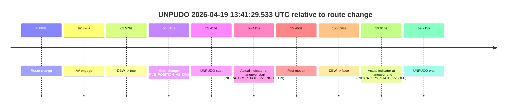
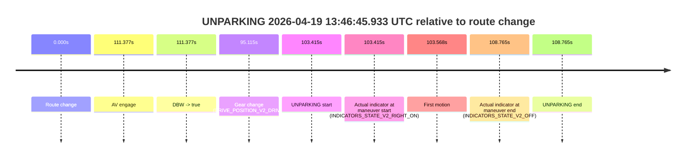

# Run Report: fme20007/2026-04-19--13-34-33--gen2-av-993d4968-be43-4227-9b19-04203039bc9d

| Field | Value |
|---|---|
| Run ID | `fme20007/2026-04-19--13-34-33--gen2-av-993d4968-be43-4227-9b19-04203039bc9d` |
| Date | `2026-04-19` |
| Model(s) | `apricot-crocodile-uproarious` |
| Author | `guy.geva` |
| Event count | `2` |

## unpudo 2026-04-19 13:41:29.533 UTC

| Field | Value |
|---|---|
| Model | `apricot-crocodile-uproarious` |
| Author | `guy.geva` |
| Run ID | `fme20007/2026-04-19--13-34-33--gen2-av-993d4968-be43-4227-9b19-04203039bc9d` |
| Date | `2026-04-19` |
| Time (UTC) | `13:41:29.533` |
| Event type | `unpudo` |
| Disengagement type | `none observed` |
| Route change | `found` |
| Console | [run](https://console.sso.wayve.ai/run/fme20007/2026-04-19--13-34-33--gen2-av-993d4968-be43-4227-9b19-04203039bc9d?id=&time-unixus=1776606089533312) |
| Foxglove | [segment](https://app.foxglove.dev/wayve-on-prem/p/prj_0dX18KZdVHg1fmmI/view?ds=foxglove-stream&ds.deviceName=fme20007&ds.start=2026-04-19T13%3A40%3A24.118285Z&ds.end=2026-04-19T13%3A43%3A20.714216Z&layoutId=lay_0e7VD4WIKDQGU73Y&time=2026-04-19T13%3A41%3A29.533312Z) |

### Event card: non-av

- Non-AV: there is no AV-owned portion anywhere inside the detected unpudo timeline, so it is kept for coverage but excluded from model success / failure scoring.

| Event | Time (UTC) | Delta from route change |
|---|---:|---:|
| Route change | 2026-04-19 13:40:34.118 | `0.000s` |
| AV engage | 2026-04-19 13:41:36.694 | `62.576s` |
| DBW -> true | 2026-04-19 13:41:36.694 | `62.576s` |
| Gear change (DRIVE_POSITION_V2_DRIVE) | 2026-04-19 13:41:28.433 | `54.315s` |
| UNPUDO start | 2026-04-19 13:41:29.533 | `55.415s` |
| Actual indicator at maneuver start (INDICATORS_STATE_V2_RIGHT_ON) | 2026-04-19 13:41:29.533 | `55.415s` |
| First motion | 2026-04-19 13:41:29.585 | `55.468s` |
| DBW -> false | 2026-04-19 13:43:10.714 | `156.596s` |
| Actual indicator at maneuver end (INDICATORS_STATE_V2_OFF) | 2026-04-19 13:41:34.033 | `59.915s` |
| UNPUDO end | 2026-04-19 13:41:34.033 | `59.915s` |

| Metric | Value |
|---|---|
| Outcome | `non-av` |
| Effective failure type | `none` |
| Route change status | `found` |
| DBW at event start | `false` |
| DBW at event end | `false` |
| Predicted gear at AV start | `DRIVE_POSITION_V2_DRIVE` |
| Actual gear at AV start | `DRIVE_POSITION_V2_DRIVE` |
| Predicted gear at event start | `DRIVE_POSITION_V2_DRIVE` |
| Actual gear at event start | `DRIVE_POSITION_V2_DRIVE` |
| Planned indicator direction | `INDICATORS_STATE_V2_RIGHT_ON` |
| Controller indicator direction | `INDICATORS_STATE_V2_RIGHT_ON` |
| Actual indicator direction | `INDICATORS_STATE_V2_RIGHT_ON` |
| Actual indicator at maneuver end | `INDICATORS_STATE_V2_OFF` |
| Driver accel help in AV | `false` |
| Driver accel help timestamp | `n/a` |
| Max accel pedal pct in AV | `0.0%` |
| Max brake pedal pct in AV | `0.0%` |
| Max speed mps in AV | `0.000` |
| Route -> AV | `62.576s` |
| AV -> event start | `-7.161s` |
| AV -> first motion | `-7.108s` |
| AV duration before disengagement | `94.020s` |
| Trajectory waypoint count | `36` |
| Driving-plan step count | `11` |

The scored portion starts from the AV-owned window, not from the pre-AV setup. Route-change search in the stopped pre-event segment was `found`, with the baseline therefore set to route change. At the event anchor the model predicts `DRIVE_POSITION_V2_DRIVE` and the actual gear is `DRIVE_POSITION_V2_DRIVE`. The effective model outcome is `non-av` because `there is no AV-owned overlap inside the event timeline`.

### Resolution

| Field | Value |
|---|---|
| Final outcome | `non-av` |
| Do we agree with this label? | `yes` |
| Source disengagement type | `none observed` |
| Resolved effective failure type | `none` |
| Confidence | `high` |

## unparking 2026-04-19 13:46:45.933 UTC

| Field | Value |
|---|---|
| Model | `apricot-crocodile-uproarious` |
| Author | `guy.geva` |
| Run ID | `fme20007/2026-04-19--13-34-33--gen2-av-993d4968-be43-4227-9b19-04203039bc9d` |
| Date | `2026-04-19` |
| Time (UTC) | `13:46:45.933` |
| Event type | `unparking` |
| Disengagement type | `none observed` |
| Route change | `found` |
| Console | [run](https://console.sso.wayve.ai/run/fme20007/2026-04-19--13-34-33--gen2-av-993d4968-be43-4227-9b19-04203039bc9d?id=&time-unixus=1776606405933307) |
| Foxglove | [segment](https://app.foxglove.dev/wayve-on-prem/p/prj_0dX18KZdVHg1fmmI/view?ds=foxglove-stream&ds.deviceName=fme20007&ds.start=2026-04-19T13%3A44%3A52.518219Z&ds.end=2026-04-19T13%3A47%3A01.283302Z&layoutId=lay_0e7VD4WIKDQGU73Y&time=2026-04-19T13%3A46%3A45.933307Z) |

### Event card: non-av

- Non-AV: there is no AV-owned portion anywhere inside the detected unparking timeline, so it is kept for coverage but excluded from model success / failure scoring.

| Event | Time (UTC) | Delta from route change |
|---|---:|---:|
| Route change | 2026-04-19 13:45:02.518 | `0.000s` |
| AV engage | 2026-04-19 13:46:53.895 | `111.377s` |
| DBW -> true | 2026-04-19 13:46:53.895 | `111.377s` |
| Gear change (DRIVE_POSITION_V2_DRIVE) | 2026-04-19 13:46:37.633 | `95.115s` |
| UNPARKING start | 2026-04-19 13:46:45.933 | `103.415s` |
| Actual indicator at maneuver start (INDICATORS_STATE_V2_RIGHT_ON) | 2026-04-19 13:46:45.933 | `103.415s` |
| First motion | 2026-04-19 13:46:46.085 | `103.568s` |
| Actual indicator at maneuver end (INDICATORS_STATE_V2_OFF) | 2026-04-19 13:46:51.283 | `108.765s` |
| UNPARKING end | 2026-04-19 13:46:51.283 | `108.765s` |

| Metric | Value |
|---|---|
| Outcome | `non-av` |
| Effective failure type | `none` |
| Route change status | `found` |
| DBW at event start | `false` |
| DBW at event end | `false` |
| Predicted gear at AV start | `DRIVE_POSITION_V2_DRIVE` |
| Actual gear at AV start | `DRIVE_POSITION_V2_DRIVE` |
| Predicted gear at event start | `DRIVE_POSITION_V2_DRIVE` |
| Actual gear at event start | `DRIVE_POSITION_V2_DRIVE` |
| Planned indicator direction | `INDICATORS_STATE_V2_RIGHT_ON` |
| Controller indicator direction | `INDICATORS_STATE_V2_RIGHT_ON` |
| Actual indicator direction | `INDICATORS_STATE_V2_RIGHT_ON` |
| Actual indicator at maneuver end | `INDICATORS_STATE_V2_OFF` |
| Driver accel help in AV | `false` |
| Driver accel help timestamp | `n/a` |
| Max accel pedal pct in AV | `0.0%` |
| Max brake pedal pct in AV | `0.0%` |
| Max speed mps in AV | `0.000` |
| Route -> AV | `111.377s` |
| AV -> event start | `-7.962s` |
| AV -> first motion | `-7.810s` |
| AV duration before disengagement | `n/a` |
| Trajectory waypoint count | `36` |
| Driving-plan step count | `11` |

The scored portion starts from the AV-owned window, not from the pre-AV setup. Route-change search in the stopped pre-event segment was `found`, with the baseline therefore set to route change. At the event anchor the model predicts `DRIVE_POSITION_V2_DRIVE` and the actual gear is `DRIVE_POSITION_V2_DRIVE`. The effective model outcome is `non-av` because `there is no AV-owned overlap inside the event timeline`.

### Resolution

| Field | Value |
|---|---|
| Final outcome | `non-av` |
| Do we agree with this label? | `yes` |
| Source disengagement type | `none observed` |
| Resolved effective failure type | `none` |
| Confidence | `high` |
