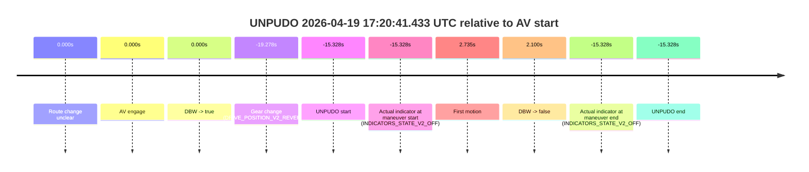
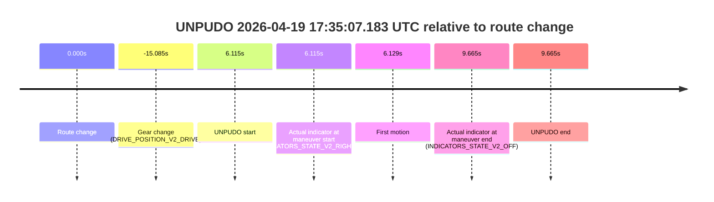
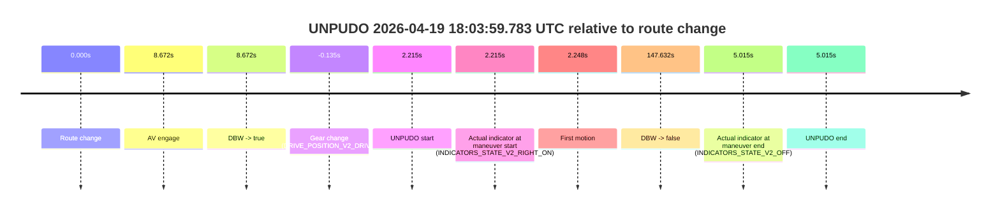
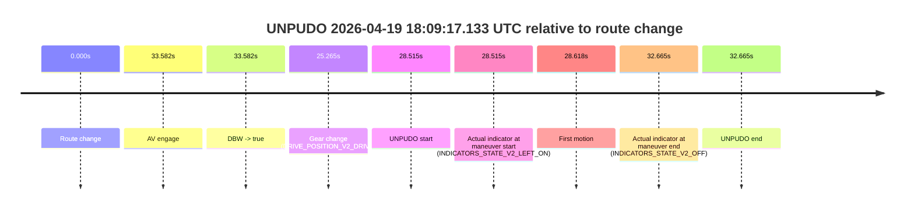

# Run Report: fme20007/2026-04-19--17-11-32--gen2-av-ce73c67b-2bac-4bfa-bb30-7cd7f6654a1d

| Field | Value |
|---|---|
| Run ID | `fme20007/2026-04-19--17-11-32--gen2-av-ce73c67b-2bac-4bfa-bb30-7cd7f6654a1d` |
| Date | `2026-04-19` |
| Model(s) | `alpaca-chocolate-fearless` |
| Author | `boris.indelman` |
| Event count | `5` |

## unpudo 2026-04-19 17:20:41.433 UTC

| Field | Value |
|---|---|
| Model | `alpaca-chocolate-fearless` |
| Author | `boris.indelman` |
| Run ID | `fme20007/2026-04-19--17-11-32--gen2-av-ce73c67b-2bac-4bfa-bb30-7cd7f6654a1d` |
| Date | `2026-04-19` |
| Time (UTC) | `17:20:41.433` |
| Event type | `unpudo` |
| Disengagement type | `none observed` |
| Route change | `unclear` |
| Console | [run](https://console.sso.wayve.ai/run/fme20007/2026-04-19--17-11-32--gen2-av-ce73c67b-2bac-4bfa-bb30-7cd7f6654a1d?id=&time-unixus=1776619241433308) |
| Foxglove | [segment](https://app.foxglove.dev/wayve-on-prem/p/prj_0dX18KZdVHg1fmmI/view?ds=foxglove-stream&ds.deviceName=fme20007&ds.start=2026-04-19T17%3A20%3A27.483301Z&ds.end=2026-04-19T17%3A21%3A08.862115Z&layoutId=lay_0e7VD4WIKDQGU73Y&time=2026-04-19T17%3A20%3A41.433308Z) |

### Event card: accidental

- Accidental: AV ownership is present for less than `2s`, so this is treated as an accidental brush with the maneuver rather than a meaningful model attempt.

| Event | Time (UTC) | Delta from AV start |
|---|---:|---:|
| Route change unclear | 2026-04-19 17:20:56.761 | `0.000s` |
| AV engage | 2026-04-19 17:20:56.761 | `0.000s` |
| DBW -> true | 2026-04-19 17:20:56.761 | `0.000s` |
| Gear change (DRIVE_POSITION_V2_REVERSE) | 2026-04-19 17:20:37.483 | `-19.278s` |
| UNPUDO start | 2026-04-19 17:20:41.433 | `-15.328s` |
| Actual indicator at maneuver start (INDICATORS_STATE_V2_OFF) | 2026-04-19 17:20:41.433 | `-15.328s` |
| First motion | 2026-04-19 17:20:59.496 | `2.735s` |
| DBW -> false | 2026-04-19 17:20:58.862 | `2.100s` |
| Actual indicator at maneuver end (INDICATORS_STATE_V2_OFF) | 2026-04-19 17:20:41.433 | `-15.328s` |
| UNPUDO end | 2026-04-19 17:20:41.433 | `-15.328s` |

| Metric | Value |
|---|---|
| Outcome | `accidental` |
| Effective failure type | `none` |
| Route change status | `unclear` |
| DBW at event start | `false` |
| DBW at event end | `false` |
| Predicted gear at AV start | `DRIVE_POSITION_V2_DRIVE` |
| Actual gear at AV start | `DRIVE_POSITION_V2_DRIVE` |
| Predicted gear at event start | `DRIVE_POSITION_V2_REVERSE` |
| Actual gear at event start | `DRIVE_POSITION_V2_REVERSE` |
| Planned indicator direction | `INDICATORS_STATE_V2_OFF` |
| Controller indicator direction | `INDICATORS_STATE_V2_OFF` |
| Actual indicator direction | `INDICATORS_STATE_V2_OFF` |
| Actual indicator at maneuver end | `INDICATORS_STATE_V2_OFF` |
| Driver accel help in AV | `false` |
| Driver accel help timestamp | `n/a` |
| Max accel pedal pct in AV | `0.0%` |
| Max brake pedal pct in AV | `0.0%` |
| Max speed mps in AV | `0.000` |
| Route -> AV | `n/a` |
| AV -> event start | `-15.328s` |
| AV -> first motion | `2.735s` |
| AV duration before disengagement | `2.100s` |
| Trajectory waypoint count | `36` |
| Driving-plan step count | `11` |

The scored portion starts from the AV-owned window, not from the pre-AV setup. Route-change search in the stopped pre-event segment was `unclear`, with the baseline therefore set to AV start. At the event anchor the model predicts `DRIVE_POSITION_V2_REVERSE` and the actual gear is `DRIVE_POSITION_V2_REVERSE`. The effective model outcome is `accidental` because `the AV-owned portion is shorter than 2s`.

### Resolution

| Field | Value |
|---|---|
| Final outcome | `accidental` |
| Do we agree with this label? | `yes` |
| Source disengagement type | `none observed` |
| Resolved effective failure type | `none` |
| Confidence | `medium` |

## unpudo 2026-04-19 17:28:16.633 UTC

| Field | Value |
|---|---|
| Model | `alpaca-chocolate-fearless` |
| Author | `boris.indelman` |
| Run ID | `fme20007/2026-04-19--17-11-32--gen2-av-ce73c67b-2bac-4bfa-bb30-7cd7f6654a1d` |
| Date | `2026-04-19` |
| Time (UTC) | `17:28:16.633` |
| Event type | `unpudo` |
| Disengagement type | `none observed` |
| Route change | `found` |
| Console | [run](https://console.sso.wayve.ai/run/fme20007/2026-04-19--17-11-32--gen2-av-ce73c67b-2bac-4bfa-bb30-7cd7f6654a1d?id=&time-unixus=1776619696633292) |
| Foxglove | [segment](https://app.foxglove.dev/wayve-on-prem/p/prj_0dX18KZdVHg1fmmI/view?ds=foxglove-stream&ds.deviceName=fme20007&ds.start=2026-04-19T17%3A27%3A58.768296Z&ds.end=2026-04-19T17%3A32%3A16.080238Z&layoutId=lay_0e7VD4WIKDQGU73Y&time=2026-04-19T17%3A28%3A16.633292Z) |

### Event card: accidental

- Accidental: AV ownership is present for less than `2s`, so this is treated as an accidental brush with the maneuver rather than a meaningful model attempt.

| Event | Time (UTC) | Delta from route change |
|---|---:|---:|
| Route change | 2026-04-19 17:28:08.768 | `0.000s` |
| AV engage | 2026-04-19 17:28:21.679 | `12.912s` |
| DBW -> true | 2026-04-19 17:28:21.679 | `12.912s` |
| Gear change (DRIVE_POSITION_V2_DRIVE) | 2026-04-19 17:28:12.033 | `3.265s` |
| UNPUDO start | 2026-04-19 17:28:16.633 | `7.865s` |
| Actual indicator at maneuver start (INDICATORS_STATE_V2_RIGHT_ON) | 2026-04-19 17:28:16.633 | `7.865s` |
| First motion | 2026-04-19 17:28:16.736 | `7.968s` |
| DBW -> false | 2026-04-19 17:32:06.080 | `237.312s` |
| Actual indicator at maneuver end (INDICATORS_STATE_V2_OFF) | 2026-04-19 17:28:21.333 | `12.565s` |
| UNPUDO end | 2026-04-19 17:28:21.333 | `12.565s` |

| Metric | Value |
|---|---|
| Outcome | `accidental` |
| Effective failure type | `none` |
| Route change status | `found` |
| DBW at event start | `false` |
| DBW at event end | `false` |
| Predicted gear at AV start | `DRIVE_POSITION_V2_DRIVE` |
| Actual gear at AV start | `DRIVE_POSITION_V2_DRIVE` |
| Predicted gear at event start | `DRIVE_POSITION_V2_DRIVE` |
| Actual gear at event start | `DRIVE_POSITION_V2_DRIVE` |
| Planned indicator direction | `INDICATORS_STATE_V2_RIGHT_ON` |
| Controller indicator direction | `INDICATORS_STATE_V2_RIGHT_ON` |
| Actual indicator direction | `INDICATORS_STATE_V2_RIGHT_ON` |
| Actual indicator at maneuver end | `INDICATORS_STATE_V2_OFF` |
| Driver accel help in AV | `false` |
| Driver accel help timestamp | `n/a` |
| Max accel pedal pct in AV | `0.0%` |
| Max brake pedal pct in AV | `0.0%` |
| Max speed mps in AV | `0.000` |
| Route -> AV | `12.912s` |
| AV -> event start | `-5.047s` |
| AV -> first motion | `-4.944s` |
| AV duration before disengagement | `224.400s` |
| Trajectory waypoint count | `36` |
| Driving-plan step count | `11` |

The scored portion starts from the AV-owned window, not from the pre-AV setup. Route-change search in the stopped pre-event segment was `found`, with the baseline therefore set to route change. At the event anchor the model predicts `DRIVE_POSITION_V2_DRIVE` and the actual gear is `DRIVE_POSITION_V2_DRIVE`. The effective model outcome is `accidental` because `the AV-owned portion is shorter than 2s`.

### Resolution

| Field | Value |
|---|---|
| Final outcome | `accidental` |
| Do we agree with this label? | `yes` |
| Source disengagement type | `none observed` |
| Resolved effective failure type | `none` |
| Confidence | `high` |

## unpudo 2026-04-19 17:35:07.183 UTC

| Field | Value |
|---|---|
| Model | `alpaca-chocolate-fearless` |
| Author | `boris.indelman` |
| Run ID | `fme20007/2026-04-19--17-11-32--gen2-av-ce73c67b-2bac-4bfa-bb30-7cd7f6654a1d` |
| Date | `2026-04-19` |
| Time (UTC) | `17:35:07.183` |
| Event type | `unpudo` |
| Disengagement type | `none observed` |
| Route change | `found` |
| Console | [run](https://console.sso.wayve.ai/run/fme20007/2026-04-19--17-11-32--gen2-av-ce73c67b-2bac-4bfa-bb30-7cd7f6654a1d?id=&time-unixus=1776620107183292) |
| Foxglove | [segment](https://app.foxglove.dev/wayve-on-prem/p/prj_0dX18KZdVHg1fmmI/view?ds=foxglove-stream&ds.deviceName=fme20007&ds.start=2026-04-19T17%3A34%3A35.983317Z&ds.end=2026-04-19T17%3A35%3A20.733302Z&layoutId=lay_0e7VD4WIKDQGU73Y&time=2026-04-19T17%3A35%3A07.183292Z) |

### Event card: non-av

- Non-AV: the detected unpudo starts outside AV ownership, so it is kept for coverage but excluded from model success / failure scoring.

| Event | Time (UTC) | Delta from route change |
|---|---:|---:|
| Route change | 2026-04-19 17:35:01.068 | `0.000s` |
| Gear change (DRIVE_POSITION_V2_DRIVE) | 2026-04-19 17:34:45.983 | `-15.085s` |
| UNPUDO start | 2026-04-19 17:35:07.183 | `6.115s` |
| Actual indicator at maneuver start (INDICATORS_STATE_V2_RIGHT_ON) | 2026-04-19 17:35:07.183 | `6.115s` |
| First motion | 2026-04-19 17:35:07.196 | `6.129s` |
| Actual indicator at maneuver end (INDICATORS_STATE_V2_OFF) | 2026-04-19 17:35:10.733 | `9.665s` |
| UNPUDO end | 2026-04-19 17:35:10.733 | `9.665s` |

| Metric | Value |
|---|---|
| Outcome | `non-av` |
| Effective failure type | `none` |
| Route change status | `found` |
| DBW at event start | `false` |
| DBW at event end | `false` |
| Predicted gear at AV start | `n/a` |
| Actual gear at AV start | `n/a` |
| Predicted gear at event start | `DRIVE_POSITION_V2_DRIVE` |
| Actual gear at event start | `DRIVE_POSITION_V2_DRIVE` |
| Planned indicator direction | `INDICATORS_STATE_V2_OFF` |
| Controller indicator direction | `INDICATORS_STATE_V2_OFF` |
| Actual indicator direction | `INDICATORS_STATE_V2_RIGHT_ON` |
| Actual indicator at maneuver end | `INDICATORS_STATE_V2_OFF` |
| Driver accel help in AV | `false` |
| Driver accel help timestamp | `n/a` |
| Max accel pedal pct in AV | `0.0%` |
| Max brake pedal pct in AV | `0.0%` |
| Max speed mps in AV | `0.000` |
| Route -> AV | `n/a` |
| AV -> event start | `n/a` |
| AV -> first motion | `n/a` |
| AV duration before disengagement | `n/a` |
| Trajectory waypoint count | `37` |
| Driving-plan step count | `11` |

The scored portion starts from the AV-owned window, not from the pre-AV setup. Route-change search in the stopped pre-event segment was `found`, with the baseline therefore set to route change. At the event anchor the model predicts `DRIVE_POSITION_V2_DRIVE` and the actual gear is `DRIVE_POSITION_V2_DRIVE`. The effective model outcome is `non-av` because `the event does not begin in AV ownership`.

### Resolution

| Field | Value |
|---|---|
| Final outcome | `non-av` |
| Do we agree with this label? | `yes` |
| Source disengagement type | `none observed` |
| Resolved effective failure type | `none` |
| Confidence | `high` |

## unpudo 2026-04-19 18:03:59.783 UTC

| Field | Value |
|---|---|
| Model | `alpaca-chocolate-fearless` |
| Author | `boris.indelman` |
| Run ID | `fme20007/2026-04-19--17-11-32--gen2-av-ce73c67b-2bac-4bfa-bb30-7cd7f6654a1d` |
| Date | `2026-04-19` |
| Time (UTC) | `18:03:59.783` |
| Event type | `unpudo` |
| Disengagement type | `none observed` |
| Route change | `found` |
| Console | [run](https://console.sso.wayve.ai/run/fme20007/2026-04-19--17-11-32--gen2-av-ce73c67b-2bac-4bfa-bb30-7cd7f6654a1d?id=&time-unixus=1776621839783307) |
| Foxglove | [segment](https://app.foxglove.dev/wayve-on-prem/p/prj_0dX18KZdVHg1fmmI/view?ds=foxglove-stream&ds.deviceName=fme20007&ds.start=2026-04-19T18%3A03%3A47.433306Z&ds.end=2026-04-19T18%3A06%3A35.200203Z&layoutId=lay_0e7VD4WIKDQGU73Y&time=2026-04-19T18%3A03%3A59.783307Z) |

### Event card: accidental

- Accidental: AV ownership is present for less than `2s`, so this is treated as an accidental brush with the maneuver rather than a meaningful model attempt.

| Event | Time (UTC) | Delta from route change |
|---|---:|---:|
| Route change | 2026-04-19 18:03:57.568 | `0.000s` |
| AV engage | 2026-04-19 18:04:06.239 | `8.672s` |
| DBW -> true | 2026-04-19 18:04:06.239 | `8.672s` |
| Gear change (DRIVE_POSITION_V2_DRIVE) | 2026-04-19 18:03:57.433 | `-0.135s` |
| UNPUDO start | 2026-04-19 18:03:59.783 | `2.215s` |
| Actual indicator at maneuver start (INDICATORS_STATE_V2_RIGHT_ON) | 2026-04-19 18:03:59.783 | `2.215s` |
| First motion | 2026-04-19 18:03:59.816 | `2.248s` |
| DBW -> false | 2026-04-19 18:06:25.200 | `147.632s` |
| Actual indicator at maneuver end (INDICATORS_STATE_V2_OFF) | 2026-04-19 18:04:02.583 | `5.015s` |
| UNPUDO end | 2026-04-19 18:04:02.583 | `5.015s` |

| Metric | Value |
|---|---|
| Outcome | `accidental` |
| Effective failure type | `none` |
| Route change status | `found` |
| DBW at event start | `false` |
| DBW at event end | `false` |
| Predicted gear at AV start | `DRIVE_POSITION_V2_DRIVE` |
| Actual gear at AV start | `DRIVE_POSITION_V2_DRIVE` |
| Predicted gear at event start | `DRIVE_POSITION_V2_DRIVE` |
| Actual gear at event start | `DRIVE_POSITION_V2_DRIVE` |
| Planned indicator direction | `INDICATORS_STATE_V2_RIGHT_ON` |
| Controller indicator direction | `INDICATORS_STATE_V2_RIGHT_ON` |
| Actual indicator direction | `INDICATORS_STATE_V2_RIGHT_ON` |
| Actual indicator at maneuver end | `INDICATORS_STATE_V2_OFF` |
| Driver accel help in AV | `false` |
| Driver accel help timestamp | `n/a` |
| Max accel pedal pct in AV | `0.0%` |
| Max brake pedal pct in AV | `0.0%` |
| Max speed mps in AV | `0.000` |
| Route -> AV | `8.672s` |
| AV -> event start | `-6.457s` |
| AV -> first motion | `-6.423s` |
| AV duration before disengagement | `138.960s` |
| Trajectory waypoint count | `37` |
| Driving-plan step count | `11` |

The scored portion starts from the AV-owned window, not from the pre-AV setup. Route-change search in the stopped pre-event segment was `found`, with the baseline therefore set to route change. At the event anchor the model predicts `DRIVE_POSITION_V2_DRIVE` and the actual gear is `DRIVE_POSITION_V2_DRIVE`. The effective model outcome is `accidental` because `the AV-owned portion is shorter than 2s`.

### Resolution

| Field | Value |
|---|---|
| Final outcome | `accidental` |
| Do we agree with this label? | `yes` |
| Source disengagement type | `none observed` |
| Resolved effective failure type | `none` |
| Confidence | `high` |

## unpudo 2026-04-19 18:09:17.133 UTC

| Field | Value |
|---|---|
| Model | `alpaca-chocolate-fearless` |
| Author | `boris.indelman` |
| Run ID | `fme20007/2026-04-19--17-11-32--gen2-av-ce73c67b-2bac-4bfa-bb30-7cd7f6654a1d` |
| Date | `2026-04-19` |
| Time (UTC) | `18:09:17.133` |
| Event type | `unpudo` |
| Disengagement type | `none observed` |
| Route change | `found` |
| Console | [run](https://console.sso.wayve.ai/run/fme20007/2026-04-19--17-11-32--gen2-av-ce73c67b-2bac-4bfa-bb30-7cd7f6654a1d?id=&time-unixus=1776622157133294) |
| Foxglove | [segment](https://app.foxglove.dev/wayve-on-prem/p/prj_0dX18KZdVHg1fmmI/view?ds=foxglove-stream&ds.deviceName=fme20007&ds.start=2026-04-19T18%3A08%3A38.618270Z&ds.end=2026-04-19T18%3A09%3A31.283317Z&layoutId=lay_0e7VD4WIKDQGU73Y&time=2026-04-19T18%3A09%3A17.133294Z) |

### Event card: accidental

- Accidental: AV ownership is present for less than `2s`, so this is treated as an accidental brush with the maneuver rather than a meaningful model attempt.

| Event | Time (UTC) | Delta from route change |
|---|---:|---:|
| Route change | 2026-04-19 18:08:48.618 | `0.000s` |
| AV engage | 2026-04-19 18:09:22.200 | `33.582s` |
| DBW -> true | 2026-04-19 18:09:22.200 | `33.582s` |
| Gear change (DRIVE_POSITION_V2_DRIVE) | 2026-04-19 18:09:13.883 | `25.265s` |
| UNPUDO start | 2026-04-19 18:09:17.133 | `28.515s` |
| Actual indicator at maneuver start (INDICATORS_STATE_V2_LEFT_ON) | 2026-04-19 18:09:17.133 | `28.515s` |
| First motion | 2026-04-19 18:09:17.236 | `28.618s` |
| Actual indicator at maneuver end (INDICATORS_STATE_V2_OFF) | 2026-04-19 18:09:21.283 | `32.665s` |
| UNPUDO end | 2026-04-19 18:09:21.283 | `32.665s` |

| Metric | Value |
|---|---|
| Outcome | `accidental` |
| Effective failure type | `none` |
| Route change status | `found` |
| DBW at event start | `false` |
| DBW at event end | `false` |
| Predicted gear at AV start | `DRIVE_POSITION_V2_DRIVE` |
| Actual gear at AV start | `DRIVE_POSITION_V2_DRIVE` |
| Predicted gear at event start | `DRIVE_POSITION_V2_DRIVE` |
| Actual gear at event start | `DRIVE_POSITION_V2_DRIVE` |
| Planned indicator direction | `INDICATORS_STATE_V2_LEFT_ON` |
| Controller indicator direction | `INDICATORS_STATE_V2_LEFT_ON` |
| Actual indicator direction | `INDICATORS_STATE_V2_LEFT_ON` |
| Actual indicator at maneuver end | `INDICATORS_STATE_V2_OFF` |
| Driver accel help in AV | `false` |
| Driver accel help timestamp | `n/a` |
| Max accel pedal pct in AV | `0.0%` |
| Max brake pedal pct in AV | `0.0%` |
| Max speed mps in AV | `0.000` |
| Route -> AV | `33.582s` |
| AV -> event start | `-5.067s` |
| AV -> first motion | `-4.964s` |
| AV duration before disengagement | `n/a` |
| Trajectory waypoint count | `36` |
| Driving-plan step count | `11` |

The scored portion starts from the AV-owned window, not from the pre-AV setup. Route-change search in the stopped pre-event segment was `found`, with the baseline therefore set to route change. At the event anchor the model predicts `DRIVE_POSITION_V2_DRIVE` and the actual gear is `DRIVE_POSITION_V2_DRIVE`. The effective model outcome is `accidental` because `the AV-owned portion is shorter than 2s`.

### Resolution

| Field | Value |
|---|---|
| Final outcome | `accidental` |
| Do we agree with this label? | `yes` |
| Source disengagement type | `none observed` |
| Resolved effective failure type | `none` |
| Confidence | `high` |
