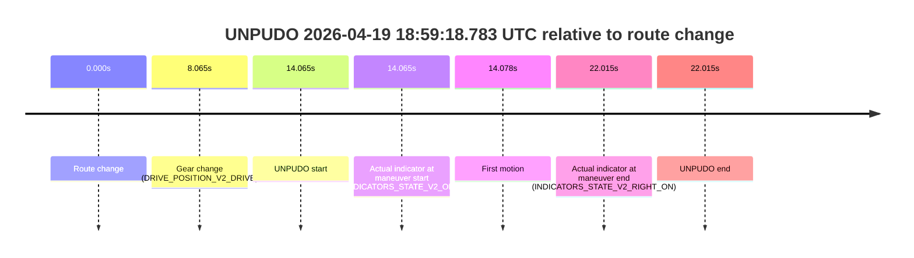
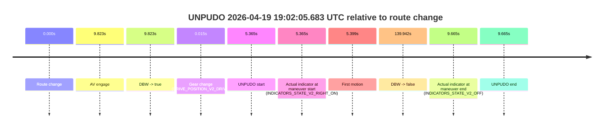
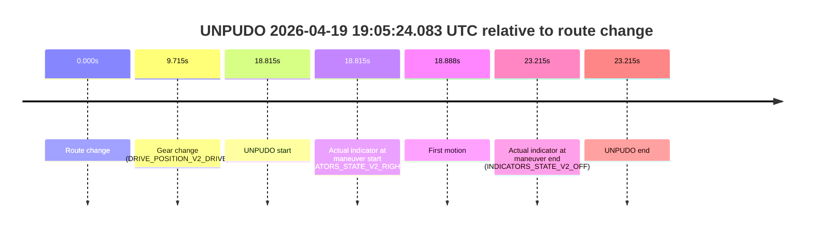

# Run Report: fme20007/2026-04-19--18-53-22--gen2-av-ddd40ec5-0a42-467c-90ca-157a762e45c5

| Field | Value |
|---|---|
| Run ID | `fme20007/2026-04-19--18-53-22--gen2-av-ddd40ec5-0a42-467c-90ca-157a762e45c5` |
| Date | `2026-04-19` |
| Model(s) | `alpaca-chocolate-fearless` |
| Author | `boris.indelman` |
| Event count | `4` |

## unpudo 2026-04-19 18:57:13.983 UTC

| Field | Value |
|---|---|
| Model | `alpaca-chocolate-fearless` |
| Author | `boris.indelman` |
| Run ID | `fme20007/2026-04-19--18-53-22--gen2-av-ddd40ec5-0a42-467c-90ca-157a762e45c5` |
| Date | `2026-04-19` |
| Time (UTC) | `18:57:13.983` |
| Event type | `unpudo` |
| Disengagement type | `none observed` |
| Route change | `found` |
| Console | [run](https://console.sso.wayve.ai/run/fme20007/2026-04-19--18-53-22--gen2-av-ddd40ec5-0a42-467c-90ca-157a762e45c5?id=&time-unixus=1776625033983307) |
| Foxglove | [segment](https://app.foxglove.dev/wayve-on-prem/p/prj_0dX18KZdVHg1fmmI/view?ds=foxglove-stream&ds.deviceName=fme20007&ds.start=2026-04-19T18%3A55%3A46.118253Z&ds.end=2026-04-19T18%3A59%3A03.939817Z&layoutId=lay_0e7VD4WIKDQGU73Y&time=2026-04-19T18%3A57%3A13.983307Z) |

### Event card: fail

- Fail: the credited unpudo does not stay AV-owned. The event window starts with DBW false, and the maneuver outcome lands outside a clean AV-owned segment.

| Event | Time (UTC) | Delta from route change |
|---|---:|---:|
| Route change | 2026-04-19 18:55:56.118 | `0.000s` |
| AV engage | 2026-04-19 18:57:15.519 | `79.401s` |
| DBW -> true | 2026-04-19 18:57:15.519 | `79.401s` |
| Gear change (DRIVE_POSITION_V2_DRIVE) | 2026-04-19 18:57:10.383 | `74.265s` |
| UNPUDO start | 2026-04-19 18:57:13.983 | `77.865s` |
| Actual indicator at maneuver start (INDICATORS_STATE_V2_RIGHT_ON) | 2026-04-19 18:57:13.983 | `77.865s` |
| First motion | 2026-04-19 18:57:14.036 | `77.918s` |
| DBW -> false | 2026-04-19 18:58:53.939 | `177.822s` |
| Actual indicator at maneuver end (INDICATORS_STATE_V2_OFF) | 2026-04-19 18:57:17.883 | `81.765s` |
| UNPUDO end | 2026-04-19 18:57:17.883 | `81.765s` |

| Metric | Value |
|---|---|
| Outcome | `fail` |
| Effective failure type | `completed_outside_av` |
| Route change status | `found` |
| DBW at event start | `false` |
| DBW at event end | `true` |
| Predicted gear at AV start | `DRIVE_POSITION_V2_DRIVE` |
| Actual gear at AV start | `DRIVE_POSITION_V2_DRIVE` |
| Predicted gear at event start | `DRIVE_POSITION_V2_DRIVE` |
| Actual gear at event start | `DRIVE_POSITION_V2_DRIVE` |
| Planned indicator direction | `INDICATORS_STATE_V2_RIGHT_ON` |
| Controller indicator direction | `INDICATORS_STATE_V2_RIGHT_ON` |
| Actual indicator direction | `INDICATORS_STATE_V2_RIGHT_ON` |
| Actual indicator at maneuver end | `INDICATORS_STATE_V2_OFF` |
| Driver accel help in AV | `false` |
| Driver accel help timestamp | `n/a` |
| Max accel pedal pct in AV | `0.0%` |
| Max brake pedal pct in AV | `0.0%` |
| Max speed mps in AV | `4.042` |
| Route -> AV | `79.401s` |
| AV -> event start | `-1.536s` |
| AV -> first motion | `-1.483s` |
| AV duration before disengagement | `98.420s` |
| Trajectory waypoint count | `37` |
| Driving-plan step count | `11` |

The scored portion starts from the AV-owned window, not from the pre-AV setup. Route-change search in the stopped pre-event segment was `found`, with the baseline therefore set to route change. At the event anchor the model predicts `DRIVE_POSITION_V2_DRIVE` and the actual gear is `DRIVE_POSITION_V2_DRIVE`. The effective model outcome is `fail` because `completed_outside_av`.

### Resolution

| Field | Value |
|---|---|
| Final outcome | `fail` |
| Do we agree with this label? | `yes` |
| Source disengagement type | `none observed` |
| Resolved effective failure type | `completed_outside_av` |
| Confidence | `high` |

## unpudo 2026-04-19 18:59:18.783 UTC

| Field | Value |
|---|---|
| Model | `alpaca-chocolate-fearless` |
| Author | `boris.indelman` |
| Run ID | `fme20007/2026-04-19--18-53-22--gen2-av-ddd40ec5-0a42-467c-90ca-157a762e45c5` |
| Date | `2026-04-19` |
| Time (UTC) | `18:59:18.783` |
| Event type | `unpudo` |
| Disengagement type | `none observed` |
| Route change | `found` |
| Console | [run](https://console.sso.wayve.ai/run/fme20007/2026-04-19--18-53-22--gen2-av-ddd40ec5-0a42-467c-90ca-157a762e45c5?id=&time-unixus=1776625158783310) |
| Foxglove | [segment](https://app.foxglove.dev/wayve-on-prem/p/prj_0dX18KZdVHg1fmmI/view?ds=foxglove-stream&ds.deviceName=fme20007&ds.start=2026-04-19T18%3A58%3A54.718251Z&ds.end=2026-04-19T18%3A59%3A36.733299Z&layoutId=lay_0e7VD4WIKDQGU73Y&time=2026-04-19T18%3A59%3A18.783310Z) |

### Event card: fail

- Fail: the credited unpudo does not stay AV-owned. The event window starts with DBW false, and the maneuver outcome lands outside a clean AV-owned segment.

| Event | Time (UTC) | Delta from route change |
|---|---:|---:|
| Route change | 2026-04-19 18:59:04.718 | `0.000s` |
| Gear change (DRIVE_POSITION_V2_DRIVE) | 2026-04-19 18:59:12.783 | `8.065s` |
| UNPUDO start | 2026-04-19 18:59:18.783 | `14.065s` |
| Actual indicator at maneuver start (INDICATORS_STATE_V2_OFF) | 2026-04-19 18:59:18.783 | `14.065s` |
| First motion | 2026-04-19 18:59:18.796 | `14.078s` |
| Actual indicator at maneuver end (INDICATORS_STATE_V2_RIGHT_ON) | 2026-04-19 18:59:26.733 | `22.015s` |
| UNPUDO end | 2026-04-19 18:59:26.733 | `22.015s` |

| Metric | Value |
|---|---|
| Outcome | `fail` |
| Effective failure type | `not_av_owned` |
| Route change status | `found` |
| DBW at event start | `false` |
| DBW at event end | `false` |
| Predicted gear at AV start | `n/a` |
| Actual gear at AV start | `n/a` |
| Predicted gear at event start | `DRIVE_POSITION_V2_DRIVE` |
| Actual gear at event start | `DRIVE_POSITION_V2_DRIVE` |
| Planned indicator direction | `INDICATORS_STATE_V2_RIGHT_ON` |
| Controller indicator direction | `INDICATORS_STATE_V2_RIGHT_ON` |
| Actual indicator direction | `INDICATORS_STATE_V2_OFF` |
| Actual indicator at maneuver end | `INDICATORS_STATE_V2_RIGHT_ON` |
| Driver accel help in AV | `false` |
| Driver accel help timestamp | `n/a` |
| Max accel pedal pct in AV | `0.0%` |
| Max brake pedal pct in AV | `0.0%` |
| Max speed mps in AV | `0.000` |
| Route -> AV | `n/a` |
| AV -> event start | `n/a` |
| AV -> first motion | `n/a` |
| AV duration before disengagement | `n/a` |
| Trajectory waypoint count | `37` |
| Driving-plan step count | `11` |

The scored portion starts from the AV-owned window, not from the pre-AV setup. Route-change search in the stopped pre-event segment was `found`, with the baseline therefore set to route change. At the event anchor the model predicts `DRIVE_POSITION_V2_DRIVE` and the actual gear is `DRIVE_POSITION_V2_DRIVE`. The effective model outcome is `fail` because `not_av_owned`.

### Resolution

| Field | Value |
|---|---|
| Final outcome | `fail` |
| Do we agree with this label? | `yes` |
| Source disengagement type | `none observed` |
| Resolved effective failure type | `not_av_owned` |
| Confidence | `high` |

## unpudo 2026-04-19 19:02:05.683 UTC

| Field | Value |
|---|---|
| Model | `alpaca-chocolate-fearless` |
| Author | `boris.indelman` |
| Run ID | `fme20007/2026-04-19--18-53-22--gen2-av-ddd40ec5-0a42-467c-90ca-157a762e45c5` |
| Date | `2026-04-19` |
| Time (UTC) | `19:02:05.683` |
| Event type | `unpudo` |
| Disengagement type | `none observed` |
| Route change | `found` |
| Console | [run](https://console.sso.wayve.ai/run/fme20007/2026-04-19--18-53-22--gen2-av-ddd40ec5-0a42-467c-90ca-157a762e45c5?id=&time-unixus=1776625325683309) |
| Foxglove | [segment](https://app.foxglove.dev/wayve-on-prem/p/prj_0dX18KZdVHg1fmmI/view?ds=foxglove-stream&ds.deviceName=fme20007&ds.start=2026-04-19T19%3A01%3A50.318256Z&ds.end=2026-04-19T19%3A04%3A30.259854Z&layoutId=lay_0e7VD4WIKDQGU73Y&time=2026-04-19T19%3A02%3A05.683309Z) |

### Event card: fail

- Fail: the credited unpudo does not stay AV-owned. The event window starts with DBW false, and the maneuver outcome lands outside a clean AV-owned segment.

| Event | Time (UTC) | Delta from route change |
|---|---:|---:|
| Route change | 2026-04-19 19:02:00.318 | `0.000s` |
| AV engage | 2026-04-19 19:02:10.141 | `9.823s` |
| DBW -> true | 2026-04-19 19:02:10.141 | `9.823s` |
| Gear change (DRIVE_POSITION_V2_DRIVE) | 2026-04-19 19:02:00.333 | `0.015s` |
| UNPUDO start | 2026-04-19 19:02:05.683 | `5.365s` |
| Actual indicator at maneuver start (INDICATORS_STATE_V2_RIGHT_ON) | 2026-04-19 19:02:05.683 | `5.365s` |
| First motion | 2026-04-19 19:02:05.716 | `5.399s` |
| DBW -> false | 2026-04-19 19:04:20.259 | `139.942s` |
| Actual indicator at maneuver end (INDICATORS_STATE_V2_OFF) | 2026-04-19 19:02:09.983 | `9.665s` |
| UNPUDO end | 2026-04-19 19:02:09.983 | `9.665s` |

| Metric | Value |
|---|---|
| Outcome | `fail` |
| Effective failure type | `completed_outside_av` |
| Route change status | `found` |
| DBW at event start | `false` |
| DBW at event end | `false` |
| Predicted gear at AV start | `DRIVE_POSITION_V2_DRIVE` |
| Actual gear at AV start | `DRIVE_POSITION_V2_DRIVE` |
| Predicted gear at event start | `DRIVE_POSITION_V2_DRIVE` |
| Actual gear at event start | `DRIVE_POSITION_V2_DRIVE` |
| Planned indicator direction | `INDICATORS_STATE_V2_RIGHT_ON` |
| Controller indicator direction | `INDICATORS_STATE_V2_RIGHT_ON` |
| Actual indicator direction | `INDICATORS_STATE_V2_RIGHT_ON` |
| Actual indicator at maneuver end | `INDICATORS_STATE_V2_OFF` |
| Driver accel help in AV | `false` |
| Driver accel help timestamp | `n/a` |
| Max accel pedal pct in AV | `0.0%` |
| Max brake pedal pct in AV | `0.0%` |
| Max speed mps in AV | `0.000` |
| Route -> AV | `9.823s` |
| AV -> event start | `-4.458s` |
| AV -> first motion | `-4.424s` |
| AV duration before disengagement | `130.119s` |
| Trajectory waypoint count | `37` |
| Driving-plan step count | `11` |

The scored portion starts from the AV-owned window, not from the pre-AV setup. Route-change search in the stopped pre-event segment was `found`, with the baseline therefore set to route change. At the event anchor the model predicts `DRIVE_POSITION_V2_DRIVE` and the actual gear is `DRIVE_POSITION_V2_DRIVE`. The effective model outcome is `fail` because `completed_outside_av`.

### Resolution

| Field | Value |
|---|---|
| Final outcome | `fail` |
| Do we agree with this label? | `yes` |
| Source disengagement type | `none observed` |
| Resolved effective failure type | `completed_outside_av` |
| Confidence | `high` |

## unpudo 2026-04-19 19:05:24.083 UTC

| Field | Value |
|---|---|
| Model | `alpaca-chocolate-fearless` |
| Author | `boris.indelman` |
| Run ID | `fme20007/2026-04-19--18-53-22--gen2-av-ddd40ec5-0a42-467c-90ca-157a762e45c5` |
| Date | `2026-04-19` |
| Time (UTC) | `19:05:24.083` |
| Event type | `unpudo` |
| Disengagement type | `none observed` |
| Route change | `found` |
| Console | [run](https://console.sso.wayve.ai/run/fme20007/2026-04-19--18-53-22--gen2-av-ddd40ec5-0a42-467c-90ca-157a762e45c5?id=&time-unixus=1776625524083310) |
| Foxglove | [segment](https://app.foxglove.dev/wayve-on-prem/p/prj_0dX18KZdVHg1fmmI/view?ds=foxglove-stream&ds.deviceName=fme20007&ds.start=2026-04-19T19%3A04%3A55.268266Z&ds.end=2026-04-19T19%3A05%3A38.483305Z&layoutId=lay_0e7VD4WIKDQGU73Y&time=2026-04-19T19%3A05%3A24.083310Z) |

### Event card: fail

- Fail: the credited unpudo does not stay AV-owned. The event window starts with DBW false, and the maneuver outcome lands outside a clean AV-owned segment.

| Event | Time (UTC) | Delta from route change |
|---|---:|---:|
| Route change | 2026-04-19 19:05:05.268 | `0.000s` |
| Gear change (DRIVE_POSITION_V2_DRIVE) | 2026-04-19 19:05:14.983 | `9.715s` |
| UNPUDO start | 2026-04-19 19:05:24.083 | `18.815s` |
| Actual indicator at maneuver start (INDICATORS_STATE_V2_RIGHT_ON) | 2026-04-19 19:05:24.083 | `18.815s` |
| First motion | 2026-04-19 19:05:24.156 | `18.888s` |
| Actual indicator at maneuver end (INDICATORS_STATE_V2_OFF) | 2026-04-19 19:05:28.483 | `23.215s` |
| UNPUDO end | 2026-04-19 19:05:28.483 | `23.215s` |

| Metric | Value |
|---|---|
| Outcome | `fail` |
| Effective failure type | `not_av_owned` |
| Route change status | `found` |
| DBW at event start | `false` |
| DBW at event end | `false` |
| Predicted gear at AV start | `n/a` |
| Actual gear at AV start | `n/a` |
| Predicted gear at event start | `DRIVE_POSITION_V2_DRIVE` |
| Actual gear at event start | `DRIVE_POSITION_V2_DRIVE` |
| Planned indicator direction | `INDICATORS_STATE_V2_RIGHT_ON` |
| Controller indicator direction | `INDICATORS_STATE_V2_RIGHT_ON` |
| Actual indicator direction | `INDICATORS_STATE_V2_RIGHT_ON` |
| Actual indicator at maneuver end | `INDICATORS_STATE_V2_OFF` |
| Driver accel help in AV | `false` |
| Driver accel help timestamp | `n/a` |
| Max accel pedal pct in AV | `0.0%` |
| Max brake pedal pct in AV | `0.0%` |
| Max speed mps in AV | `0.000` |
| Route -> AV | `n/a` |
| AV -> event start | `n/a` |
| AV -> first motion | `n/a` |
| AV duration before disengagement | `n/a` |
| Trajectory waypoint count | `37` |
| Driving-plan step count | `11` |

The scored portion starts from the AV-owned window, not from the pre-AV setup. Route-change search in the stopped pre-event segment was `found`, with the baseline therefore set to route change. At the event anchor the model predicts `DRIVE_POSITION_V2_DRIVE` and the actual gear is `DRIVE_POSITION_V2_DRIVE`. The effective model outcome is `fail` because `not_av_owned`.

### Resolution

| Field | Value |
|---|---|
| Final outcome | `fail` |
| Do we agree with this label? | `yes` |
| Source disengagement type | `none observed` |
| Resolved effective failure type | `not_av_owned` |
| Confidence | `high` |
