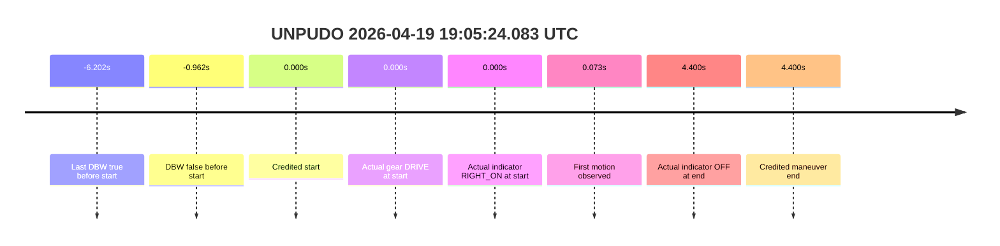

# Run Report: fme20007/2026-04-19--18-53-22--gen2-av-ddd40ec5-0a42-467c-90ca-157a762e45c5

| Field | Value |
|---|---|
| Run ID | `fme20007/2026-04-19--18-53-22--gen2-av-ddd40ec5-0a42-467c-90ca-157a762e45c5` |
| Date | `2026-04-19` |
| Model(s) | `alpaca-chocolate-fearless` |
| Author | `boris.indelman` |
| Event count | `1` |
| Outcome summary | `0 pass / 1 fail` |
| Route-change summary | `1 found / 0 not found / 0 unclear` |

## unpudo 2026-04-19 19:05:24.083 UTC

| Field | Value |
|---|---|
| Model | `alpaca-chocolate-fearless` |
| Author | `boris.indelman` |
| Run ID | `fme20007/2026-04-19--18-53-22--gen2-av-ddd40ec5-0a42-467c-90ca-157a762e45c5` |
| Date | `2026-04-19` |
| Time (UTC) | `2026-04-19 19:05:24.083` |
| Event type | `unpudo` |
| Disengagement type | `none observed` |
| Route-change status | `found` |
| Console | [run](https://console.sso.wayve.ai/run/fme20007/2026-04-19--18-53-22--gen2-av-ddd40ec5-0a42-467c-90ca-157a762e45c5?id=&time-unixus=1776625524083310) |

- Fail: the credited UNPUDO is scored as `completed_outside_av` because DBW is already false before the anchor and the vehicle continues the maneuver manually. Route recovery is present, but it does not make the maneuver AV-owned.

| Event | Time (UTC) | Delta from event start | Note |
|---|---|---:|---|
| Route-change search | found | searched in stopped pre-event segment | nav step count `3 -> 2`; distance `51.230 -> 48.595 m` around `2026-04-19 19:04:44.018` UTC |
| Last DBW true before start | 2026-04-19 19:05:17.881 | `-6.202s` | brief AV sample before the credited start |
| DBW false at maneuver start | 2026-04-19 19:05:23.121 | `-0.962s` | controller is already manual before the anchor |
| Credited maneuver start | 2026-04-19 19:05:24.083 | `0.000s` | event anchor |
| Predicted gear at start | `DRIVE_POSITION_V2_DRIVE` | `0.000s` | plan matches the actual start gear |
| Actual gear at start | `DRIVE_POSITION_V2_DRIVE` | `0.000s` | vehicle is already in `DRIVE` |
| Planned indicator at start | `INDICATORS_STATE_V2_RIGHT_ON` | `0.000s` | plan keeps right indicator on |
| Actual indicator at start | `INDICATORS_STATE_V2_RIGHT_ON` | `0.000s` | switch is right-on at the anchor |
| In-AV driver accel help | `none observed` | `n/a` | actual accelerator pedal stays at `0.0%` |
| First motion observed | 2026-04-19 19:05:24.156 | `+0.073s` | vehicle begins moving immediately after the anchor |
| Actual indicator at end | `INDICATORS_STATE_V2_OFF` | `+4.400s` | indicator clears by the credited end |
| Credited maneuver end | 2026-04-19 19:05:28.483 | `+4.400s` | event boundary |

| Metric | Value |
|---|---|
| Validated route reassignment | `true` |
| Route-change status | `found` |
| Controller DBW at event start | `false` |
| Predicted gear at event start | `DRIVE_POSITION_V2_DRIVE` |
| Actual gear at event start | `DRIVE_POSITION_V2_DRIVE` |
| Planned indicator at event start | `INDICATORS_STATE_V2_RIGHT_ON` |
| Actual indicator at event start | `INDICATORS_STATE_V2_RIGHT_ON` |
| Actual indicator at event end | `INDICATORS_STATE_V2_OFF` |
| Driver accel help in maneuver window | `false` |
| Max accel pedal | `0.0%` |
| Max brake pedal | `0.0%` |
| Max speed | `4.989 m/s` |
| Trajectory waypoint count at anchor | `37` |
| Trajectory driving-plan step count at anchor | `11` |
| Main disengagement flag | `0` |
| Gear-to-start disengagement | `0` |
| Before-gearchange-10s disengagement | `0` |

The cached packet shows a route reassignment, but the credited maneuver itself is not AV-owned. The vehicle is already manual before the anchor, so this remains a model-performance fail rather than an AV execution success.

### Resolution

| Field | Value |
|---|---|
| Final outcome | `fail` |
| Do we agree with this label? | `yes` |
| Source disengagement type | `none observed` |
| Resolved effective failure type | `completed_outside_av` |
| Confidence | `high` |
