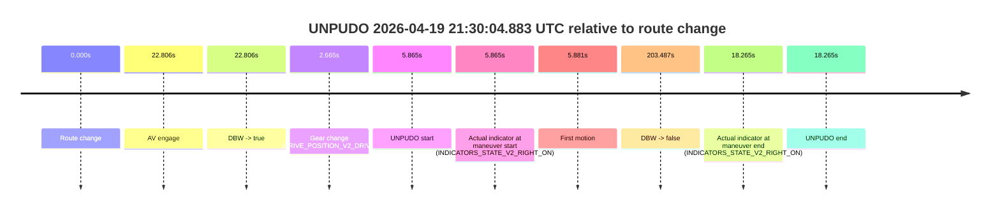
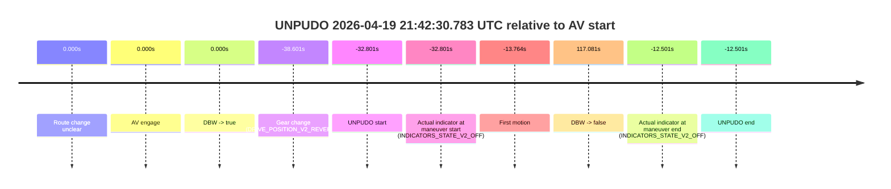
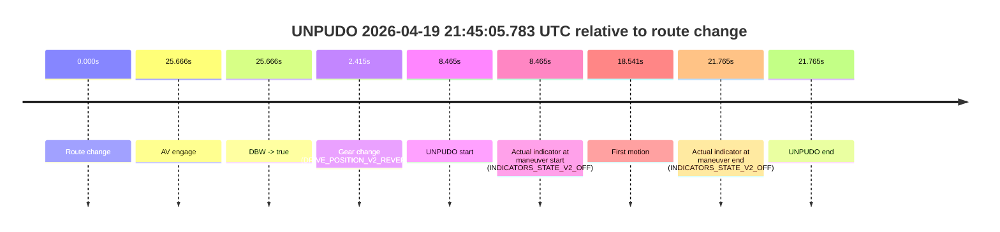

# Run Report: fme20007/2026-04-19--21-22-24--gen2-av-b9dcf6f2-899e-4787-bf0d-316d419103cb

| Field | Value |
|---|---|
| Run ID | `fme20007/2026-04-19--21-22-24--gen2-av-b9dcf6f2-899e-4787-bf0d-316d419103cb` |
| Date | `2026-04-19` |
| Model(s) | `alpaca-chocolate-fearless` |
| Author | `boris.indelman` |
| Event count | `4` |

## unpudo 2026-04-19 21:30:04.883 UTC

| Field | Value |
|---|---|
| Model | `alpaca-chocolate-fearless` |
| Author | `boris.indelman` |
| Run ID | `fme20007/2026-04-19--21-22-24--gen2-av-b9dcf6f2-899e-4787-bf0d-316d419103cb` |
| Date | `2026-04-19` |
| Time (UTC) | `21:30:04.883` |
| Event type | `unpudo` |
| Disengagement type | `none observed` |
| Route change | `found` |
| Console | [run](https://console.sso.wayve.ai/run/fme20007/2026-04-19--21-22-24--gen2-av-b9dcf6f2-899e-4787-bf0d-316d419103cb?id=&time-unixus=1776634204883318) |
| Foxglove | [segment](https://app.foxglove.dev/wayve-on-prem/p/prj_0dX18KZdVHg1fmmI/view?ds=foxglove-stream&ds.deviceName=fme20007&ds.start=2026-04-19T21%3A29%3A49.018285Z&ds.end=2026-04-19T21%3A33%3A32.505014Z&layoutId=lay_0e7VD4WIKDQGU73Y&time=2026-04-19T21%3A30%3A04.883318Z) |

### Event card: fail

- Fail: the credited unpudo does not stay AV-owned. The event window starts with DBW false, and the maneuver outcome lands outside a clean AV-owned segment.

| Event | Time (UTC) | Delta from route change |
|---|---:|---:|
| Route change | 2026-04-19 21:29:59.018 | `0.000s` |
| AV engage | 2026-04-19 21:30:21.824 | `22.806s` |
| DBW -> true | 2026-04-19 21:30:21.824 | `22.806s` |
| Gear change (DRIVE_POSITION_V2_DRIVE) | 2026-04-19 21:30:01.683 | `2.665s` |
| UNPUDO start | 2026-04-19 21:30:04.883 | `5.865s` |
| Actual indicator at maneuver start (INDICATORS_STATE_V2_RIGHT_ON) | 2026-04-19 21:30:04.883 | `5.865s` |
| First motion | 2026-04-19 21:30:04.899 | `5.881s` |
| DBW -> false | 2026-04-19 21:33:22.505 | `203.487s` |
| Actual indicator at maneuver end (INDICATORS_STATE_V2_RIGHT_ON) | 2026-04-19 21:30:17.283 | `18.265s` |
| UNPUDO end | 2026-04-19 21:30:17.283 | `18.265s` |

| Metric | Value |
|---|---|
| Outcome | `fail` |
| Effective failure type | `completed_outside_av` |
| Route change status | `found` |
| DBW at event start | `false` |
| DBW at event end | `false` |
| Predicted gear at AV start | `DRIVE_POSITION_V2_DRIVE` |
| Actual gear at AV start | `DRIVE_POSITION_V2_DRIVE` |
| Predicted gear at event start | `DRIVE_POSITION_V2_DRIVE` |
| Actual gear at event start | `DRIVE_POSITION_V2_DRIVE` |
| Planned indicator direction | `INDICATORS_STATE_V2_RIGHT_ON` |
| Controller indicator direction | `INDICATORS_STATE_V2_RIGHT_ON` |
| Actual indicator direction | `INDICATORS_STATE_V2_RIGHT_ON` |
| Actual indicator at maneuver end | `INDICATORS_STATE_V2_RIGHT_ON` |
| Driver accel help in AV | `false` |
| Driver accel help timestamp | `n/a` |
| Max accel pedal pct in AV | `0.0%` |
| Max brake pedal pct in AV | `0.0%` |
| Max speed mps in AV | `0.000` |
| Route -> AV | `22.806s` |
| AV -> event start | `-16.941s` |
| AV -> first motion | `-16.924s` |
| AV duration before disengagement | `180.681s` |
| Trajectory waypoint count | `37` |
| Driving-plan step count | `11` |

The scored portion starts from the AV-owned window, not from the pre-AV setup. Route-change search in the stopped pre-event segment was `found`, with the baseline therefore set to route change. At the event anchor the model predicts `DRIVE_POSITION_V2_DRIVE` and the actual gear is `DRIVE_POSITION_V2_DRIVE`. The effective model outcome is `fail` because `completed_outside_av`.

### Resolution

| Field | Value |
|---|---|
| Final outcome | `fail` |
| Do we agree with this label? | `yes` |
| Source disengagement type | `none observed` |
| Resolved effective failure type | `completed_outside_av` |
| Confidence | `high` |

## unpudo 2026-04-19 21:35:13.933 UTC

| Field | Value |
|---|---|
| Model | `alpaca-chocolate-fearless` |
| Author | `boris.indelman` |
| Run ID | `fme20007/2026-04-19--21-22-24--gen2-av-b9dcf6f2-899e-4787-bf0d-316d419103cb` |
| Date | `2026-04-19` |
| Time (UTC) | `21:35:13.933` |
| Event type | `unpudo` |
| Disengagement type | `none observed` |
| Route change | `found` |
| Console | [run](https://console.sso.wayve.ai/run/fme20007/2026-04-19--21-22-24--gen2-av-b9dcf6f2-899e-4787-bf0d-316d419103cb?id=&time-unixus=1776634513933318) |
| Foxglove | [segment](https://app.foxglove.dev/wayve-on-prem/p/prj_0dX18KZdVHg1fmmI/view?ds=foxglove-stream&ds.deviceName=fme20007&ds.start=2026-04-19T21%3A33%3A07.268267Z&ds.end=2026-04-19T21%3A38%3A07.464166Z&layoutId=lay_0e7VD4WIKDQGU73Y&time=2026-04-19T21%3A35%3A13.933318Z) |

### Event card: fail

- Fail: the credited unpudo does not stay AV-owned. The event window starts with DBW false, and the maneuver outcome lands outside a clean AV-owned segment.

| Event | Time (UTC) | Delta from route change |
|---|---:|---:|
| Route change | 2026-04-19 21:33:17.268 | `0.000s` |
| AV engage | 2026-04-19 21:35:28.144 | `130.876s` |
| DBW -> true | 2026-04-19 21:35:28.144 | `130.876s` |
| Gear change (DRIVE_POSITION_V2_DRIVE) | 2026-04-19 21:35:07.383 | `110.115s` |
| UNPUDO start | 2026-04-19 21:35:13.933 | `116.665s` |
| Actual indicator at maneuver start (INDICATORS_STATE_V2_OFF) | 2026-04-19 21:35:13.933 | `116.665s` |
| First motion | 2026-04-19 21:35:13.979 | `116.712s` |
| DBW -> false | 2026-04-19 21:37:57.464 | `280.196s` |
| Actual indicator at maneuver end (INDICATORS_STATE_V2_OFF) | 2026-04-19 21:35:18.083 | `120.815s` |
| UNPUDO end | 2026-04-19 21:35:18.083 | `120.815s` |

| Metric | Value |
|---|---|
| Outcome | `fail` |
| Effective failure type | `completed_outside_av` |
| Route change status | `found` |
| DBW at event start | `false` |
| DBW at event end | `false` |
| Predicted gear at AV start | `DRIVE_POSITION_V2_DRIVE` |
| Actual gear at AV start | `DRIVE_POSITION_V2_DRIVE` |
| Predicted gear at event start | `DRIVE_POSITION_V2_DRIVE` |
| Actual gear at event start | `DRIVE_POSITION_V2_DRIVE` |
| Planned indicator direction | `INDICATORS_STATE_V2_OFF` |
| Controller indicator direction | `INDICATORS_STATE_V2_OFF` |
| Actual indicator direction | `INDICATORS_STATE_V2_OFF` |
| Actual indicator at maneuver end | `INDICATORS_STATE_V2_OFF` |
| Driver accel help in AV | `false` |
| Driver accel help timestamp | `n/a` |
| Max accel pedal pct in AV | `0.0%` |
| Max brake pedal pct in AV | `0.0%` |
| Max speed mps in AV | `0.000` |
| Route -> AV | `130.876s` |
| AV -> event start | `-14.211s` |
| AV -> first motion | `-14.164s` |
| AV duration before disengagement | `149.320s` |
| Trajectory waypoint count | `36` |
| Driving-plan step count | `11` |

The scored portion starts from the AV-owned window, not from the pre-AV setup. Route-change search in the stopped pre-event segment was `found`, with the baseline therefore set to route change. At the event anchor the model predicts `DRIVE_POSITION_V2_DRIVE` and the actual gear is `DRIVE_POSITION_V2_DRIVE`. The effective model outcome is `fail` because `completed_outside_av`.

### Resolution

| Field | Value |
|---|---|
| Final outcome | `fail` |
| Do we agree with this label? | `yes` |
| Source disengagement type | `none observed` |
| Resolved effective failure type | `completed_outside_av` |
| Confidence | `high` |

## unpudo 2026-04-19 21:42:30.783 UTC

| Field | Value |
|---|---|
| Model | `alpaca-chocolate-fearless` |
| Author | `boris.indelman` |
| Run ID | `fme20007/2026-04-19--21-22-24--gen2-av-b9dcf6f2-899e-4787-bf0d-316d419103cb` |
| Date | `2026-04-19` |
| Time (UTC) | `21:42:30.783` |
| Event type | `unpudo` |
| Disengagement type | `uncategorised` |
| Route change | `unclear` |
| Console | [run](https://console.sso.wayve.ai/run/fme20007/2026-04-19--21-22-24--gen2-av-b9dcf6f2-899e-4787-bf0d-316d419103cb?id=&time-unixus=1776634950783323) |
| Foxglove | [segment](https://app.foxglove.dev/wayve-on-prem/p/prj_0dX18KZdVHg1fmmI/view?ds=foxglove-stream&ds.deviceName=fme20007&ds.start=2026-04-19T21%3A42%3A14.983319Z&ds.end=2026-04-19T21%3A45%3A10.665086Z&layoutId=lay_0e7VD4WIKDQGU73Y&time=2026-04-19T21%3A42%3A30.783323Z) |

### Event card: fail

- Fail: AV owns part of the segment, but the event still resolves as a model-performance failure under the AV-only scoring rule.

| Event | Time (UTC) | Delta from AV start |
|---|---:|---:|
| Route change unclear | 2026-04-19 21:43:03.584 | `0.000s` |
| AV engage | 2026-04-19 21:43:03.584 | `0.000s` |
| DBW -> true | 2026-04-19 21:43:03.584 | `0.000s` |
| Gear change (DRIVE_POSITION_V2_REVERSE) | 2026-04-19 21:42:24.983 | `-38.601s` |
| UNPUDO start | 2026-04-19 21:42:30.783 | `-32.801s` |
| Actual indicator at maneuver start (INDICATORS_STATE_V2_OFF) | 2026-04-19 21:42:30.783 | `-32.801s` |
| First motion | 2026-04-19 21:42:49.820 | `-13.764s` |
| DBW -> false | 2026-04-19 21:45:00.665 | `117.081s` |
| Actual indicator at maneuver end (INDICATORS_STATE_V2_OFF) | 2026-04-19 21:42:51.083 | `-12.501s` |
| UNPUDO end | 2026-04-19 21:42:51.083 | `-12.501s` |

| Metric | Value |
|---|---|
| Outcome | `fail` |
| Effective failure type | `uncategorised` |
| Route change status | `unclear` |
| DBW at event start | `false` |
| DBW at event end | `false` |
| Predicted gear at AV start | `DRIVE_POSITION_V2_DRIVE` |
| Actual gear at AV start | `DRIVE_POSITION_V2_DRIVE` |
| Predicted gear at event start | `DRIVE_POSITION_V2_REVERSE` |
| Actual gear at event start | `DRIVE_POSITION_V2_REVERSE` |
| Planned indicator direction | `INDICATORS_STATE_V2_OFF` |
| Controller indicator direction | `INDICATORS_STATE_V2_OFF` |
| Actual indicator direction | `INDICATORS_STATE_V2_OFF` |
| Actual indicator at maneuver end | `INDICATORS_STATE_V2_OFF` |
| Driver accel help in AV | `false` |
| Driver accel help timestamp | `n/a` |
| Max accel pedal pct in AV | `0.0%` |
| Max brake pedal pct in AV | `0.0%` |
| Max speed mps in AV | `0.000` |
| Route -> AV | `n/a` |
| AV -> event start | `-32.801s` |
| AV -> first motion | `-13.764s` |
| AV duration before disengagement | `117.081s` |
| Trajectory waypoint count | `37` |
| Driving-plan step count | `11` |

The scored portion starts from the AV-owned window, not from the pre-AV setup. Route-change search in the stopped pre-event segment was `unclear`, with the baseline therefore set to AV start. At the event anchor the model predicts `DRIVE_POSITION_V2_REVERSE` and the actual gear is `DRIVE_POSITION_V2_REVERSE`. The effective model outcome is `fail` because `uncategorised`.

### Resolution

| Field | Value |
|---|---|
| Final outcome | `fail` |
| Do we agree with this label? | `yes` |
| Source disengagement type | `uncategorised` |
| Resolved effective failure type | `uncategorised` |
| Confidence | `medium` |

## unpudo 2026-04-19 21:45:05.783 UTC

| Field | Value |
|---|---|
| Model | `alpaca-chocolate-fearless` |
| Author | `boris.indelman` |
| Run ID | `fme20007/2026-04-19--21-22-24--gen2-av-b9dcf6f2-899e-4787-bf0d-316d419103cb` |
| Date | `2026-04-19` |
| Time (UTC) | `21:45:05.783` |
| Event type | `unpudo` |
| Disengagement type | `none observed` |
| Route change | `found` |
| Console | [run](https://console.sso.wayve.ai/run/fme20007/2026-04-19--21-22-24--gen2-av-b9dcf6f2-899e-4787-bf0d-316d419103cb?id=&time-unixus=1776635105783314) |
| Foxglove | [segment](https://app.foxglove.dev/wayve-on-prem/p/prj_0dX18KZdVHg1fmmI/view?ds=foxglove-stream&ds.deviceName=fme20007&ds.start=2026-04-19T21%3A44%3A47.318291Z&ds.end=2026-04-19T21%3A45%3A29.083295Z&layoutId=lay_0e7VD4WIKDQGU73Y&time=2026-04-19T21%3A45%3A05.783314Z) |

### Event card: fail

- Fail: the credited unpudo does not stay AV-owned. The event window starts with DBW false, and the maneuver outcome lands outside a clean AV-owned segment.

| Event | Time (UTC) | Delta from route change |
|---|---:|---:|
| Route change | 2026-04-19 21:44:57.318 | `0.000s` |
| AV engage | 2026-04-19 21:45:22.984 | `25.666s` |
| DBW -> true | 2026-04-19 21:45:22.984 | `25.666s` |
| Gear change (DRIVE_POSITION_V2_REVERSE) | 2026-04-19 21:44:59.733 | `2.415s` |
| UNPUDO start | 2026-04-19 21:45:05.783 | `8.465s` |
| Actual indicator at maneuver start (INDICATORS_STATE_V2_OFF) | 2026-04-19 21:45:05.783 | `8.465s` |
| First motion | 2026-04-19 21:45:15.859 | `18.541s` |
| Actual indicator at maneuver end (INDICATORS_STATE_V2_OFF) | 2026-04-19 21:45:19.083 | `21.765s` |
| UNPUDO end | 2026-04-19 21:45:19.083 | `21.765s` |

| Metric | Value |
|---|---|
| Outcome | `fail` |
| Effective failure type | `completed_outside_av` |
| Route change status | `found` |
| DBW at event start | `false` |
| DBW at event end | `false` |
| Predicted gear at AV start | `DRIVE_POSITION_V2_DRIVE` |
| Actual gear at AV start | `DRIVE_POSITION_V2_DRIVE` |
| Predicted gear at event start | `DRIVE_POSITION_V2_REVERSE` |
| Actual gear at event start | `DRIVE_POSITION_V2_REVERSE` |
| Planned indicator direction | `INDICATORS_STATE_V2_OFF` |
| Controller indicator direction | `INDICATORS_STATE_V2_OFF` |
| Actual indicator direction | `INDICATORS_STATE_V2_OFF` |
| Actual indicator at maneuver end | `INDICATORS_STATE_V2_OFF` |
| Driver accel help in AV | `false` |
| Driver accel help timestamp | `n/a` |
| Max accel pedal pct in AV | `0.0%` |
| Max brake pedal pct in AV | `0.0%` |
| Max speed mps in AV | `0.000` |
| Route -> AV | `25.666s` |
| AV -> event start | `-17.201s` |
| AV -> first motion | `-7.124s` |
| AV duration before disengagement | `n/a` |
| Trajectory waypoint count | `37` |
| Driving-plan step count | `11` |

The scored portion starts from the AV-owned window, not from the pre-AV setup. Route-change search in the stopped pre-event segment was `found`, with the baseline therefore set to route change. At the event anchor the model predicts `DRIVE_POSITION_V2_REVERSE` and the actual gear is `DRIVE_POSITION_V2_REVERSE`. The effective model outcome is `fail` because `completed_outside_av`.

### Resolution

| Field | Value |
|---|---|
| Final outcome | `fail` |
| Do we agree with this label? | `yes` |
| Source disengagement type | `none observed` |
| Resolved effective failure type | `completed_outside_av` |
| Confidence | `high` |
