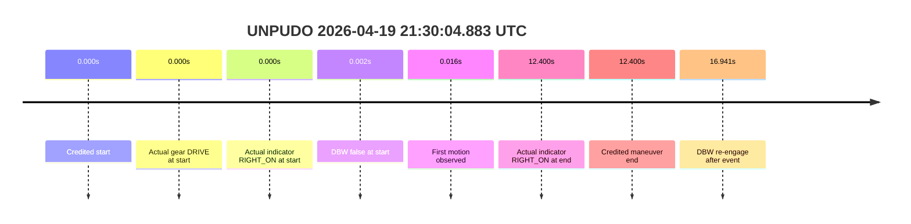
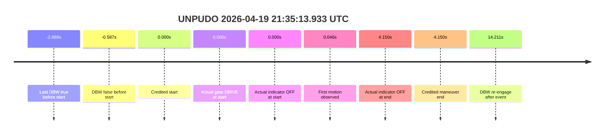

# Run Report: fme20007/2026-04-19--21-22-24--gen2-av-b9dcf6f2-899e-4787-bf0d-316d419103cb

| Field | Value |
|---|---|
| Run ID | `fme20007/2026-04-19--21-22-24--gen2-av-b9dcf6f2-899e-4787-bf0d-316d419103cb` |
| Date | `2026-04-19` |
| Model(s) | `alpaca-chocolate-fearless` |
| Author | `boris.indelman` |
| Event count | `4` |
| Outcome summary | `0 pass / 4 fail` |
| Route-change summary | `4 found / 0 not found / 0 unclear` |

## unpudo 2026-04-19 21:30:04.883 UTC

| Field | Value |
|---|---|
| Model | `alpaca-chocolate-fearless` |
| Author | `boris.indelman` |
| Run ID | `fme20007/2026-04-19--21-22-24--gen2-av-b9dcf6f2-899e-4787-bf0d-316d419103cb` |
| Date | `2026-04-19` |
| Time (UTC) | `2026-04-19 21:30:04.883` |
| Event type | `unpudo` |
| Disengagement type | `none observed` |
| Route-change status | `found` |
| Console | [run](https://console.sso.wayve.ai/run/fme20007/2026-04-19--21-22-24--gen2-av-b9dcf6f2-899e-4787-bf0d-316d419103cb?id=&time-unixus=1776634204883318) |

- Fail: the maneuver is not AV-owned. DBW is already false at the credited start, so the packet is scored as `completed_outside_av` even though the route reassignment is recoverable.

| Event | Time (UTC) | Delta from event start | Note |
|---|---|---:|---|
| Route-change search | found | searched in stopped pre-event segment | nav step count `5 -> 4`; distance `201.593 -> 197.570 m` around `2026-04-19 21:28:55.318` UTC |
| Last DBW true before start | not recovered | pre-event window | no AV-owned start recovered in the cached samples |
| DBW false at maneuver start | 2026-04-19 21:30:04.885 | `+0.002s` | already manual at the anchor |
| Credited maneuver start | 2026-04-19 21:30:04.883 | `0.000s` | event anchor |
| Predicted gear at start | `DRIVE_POSITION_V2_DRIVE` | `0.000s` | plan agrees on gear |
| Actual gear at start | `DRIVE_POSITION_V2_DRIVE` | `0.000s` | vehicle is already in `DRIVE` |
| Planned indicator at start | `INDICATORS_STATE_V2_RIGHT_ON` | `0.000s` | plan keeps the right indicator on |
| Actual indicator at start | `INDICATORS_STATE_V2_RIGHT_ON` | `0.000s` | switch is right-on at the anchor |
| In-AV driver accel help | `none observed` | `n/a` | actual accelerator pedal stays at `0.0%` |
| First motion observed | 2026-04-19 21:30:04.899 | `+0.016s` | motion begins immediately after the anchor |
| Actual indicator at end | `INDICATORS_STATE_V2_RIGHT_ON` | `+12.400s` | vehicle switch remains right-on through the credited end |
| DBW re-engage after event | 2026-04-19 21:30:21.824 | `+16.941s` | controller returns to DBW after the credited maneuver |
| Credited maneuver end | 2026-04-19 21:30:17.283 | `+12.400s` | event boundary |

| Metric | Value |
|---|---|
| Validated route reassignment | `true` |
| Route-change status | `found` |
| Controller DBW at event start | `false` |
| Predicted gear at event start | `DRIVE_POSITION_V2_DRIVE` |
| Actual gear at event start | `DRIVE_POSITION_V2_DRIVE` |
| Planned indicator at event start | `INDICATORS_STATE_V2_RIGHT_ON` |
| Actual indicator at event start | `INDICATORS_STATE_V2_RIGHT_ON` |
| Actual indicator at event end | `INDICATORS_STATE_V2_RIGHT_ON` |
| Driver accel help in maneuver window | `false` |
| Max accel pedal | `0.0%` |
| Max brake pedal | `0.0%` |
| Max speed | `2.236 m/s` |
| Trajectory waypoint count at anchor | `37` |
| Trajectory driving-plan step count at anchor | `11` |
| Main disengagement flag | `0` |
| Gear-to-start disengagement | `0` |
| Before-gearchange-10s disengagement | `0` |

The route is recovered, but the credited maneuver is still outside AV ownership. The model does not get credit for a start that happens after DBW has already dropped out.

### Resolution

| Field | Value |
|---|---|
| Final outcome | `fail` |
| Do we agree with this label? | `yes` |
| Source disengagement type | `none observed` |
| Resolved effective failure type | `completed_outside_av` |
| Confidence | `high` |

## unpudo 2026-04-19 21:35:13.933 UTC

| Field | Value |
|---|---|
| Model | `alpaca-chocolate-fearless` |
| Author | `boris.indelman` |
| Run ID | `fme20007/2026-04-19--21-22-24--gen2-av-b9dcf6f2-899e-4787-bf0d-316d419103cb` |
| Date | `2026-04-19` |
| Time (UTC) | `2026-04-19 21:35:13.933` |
| Event type | `unpudo` |
| Disengagement type | `none observed` |
| Route-change status | `found` |
| Console | [run](https://console.sso.wayve.ai/run/fme20007/2026-04-19--21-22-24--gen2-av-b9dcf6f2-899e-4787-bf0d-316d419103cb?id=&time-unixus=1776634513933318) |

- Fail: route recovery exists, but DBW drops before the credited start and the maneuver is therefore not owned by the AV. This is a `completed_outside_av` score, not a model-owned execution failure.

| Event | Time (UTC) | Delta from event start | Note |
|---|---|---:|---|
| Route-change search | found | searched in stopped pre-event segment | nav step count `3 -> 5`; distance `40.889 -> 502.478 m` around `2026-04-19 21:33:17.268` UTC |
| Last DBW true before start | 2026-04-19 21:35:11.045 | `-2.888s` | brief AV sample before the anchor |
| DBW false at maneuver start | 2026-04-19 21:35:13.346 | `-0.587s` | controller has already dropped out before the anchor |
| Credited maneuver start | 2026-04-19 21:35:13.933 | `0.000s` | event anchor |
| Predicted gear at start | `DRIVE_POSITION_V2_DRIVE` | `0.000s` | plan stays in `DRIVE` |
| Actual gear at start | `DRIVE_POSITION_V2_DRIVE` | `0.000s` | vehicle is in `DRIVE` |
| Planned indicator at start | `INDICATORS_STATE_V2_OFF` | `0.000s` | plan is off |
| Actual indicator at start | `INDICATORS_STATE_V2_OFF` | `0.000s` | switch is off at the anchor |
| In-AV driver accel help | `none observed` | `n/a` | actual accelerator pedal stays at `0.0%` |
| First motion observed | 2026-04-19 21:35:13.979 | `+0.046s` | vehicle starts moving after the anchor |
| Actual indicator at end | `INDICATORS_STATE_V2_OFF` | `+4.150s` | indicator remains off at the credited end |
| DBW re-engage after event | 2026-04-19 21:35:28.144 | `+14.211s` | controller returns to DBW after the credited maneuver |
| Credited maneuver end | 2026-04-19 21:35:18.083 | `+4.150s` | event boundary |

| Metric | Value |
|---|---|
| Validated route reassignment | `true` |
| Route-change status | `found` |
| Controller DBW at event start | `false` |
| Predicted gear at event start | `DRIVE_POSITION_V2_DRIVE` |
| Actual gear at event start | `DRIVE_POSITION_V2_DRIVE` |
| Planned indicator at event start | `INDICATORS_STATE_V2_OFF` |
| Actual indicator at event start | `INDICATORS_STATE_V2_OFF` |
| Actual indicator at event end | `INDICATORS_STATE_V2_OFF` |
| Driver accel help in maneuver window | `false` |
| Max accel pedal | `0.0%` |
| Max brake pedal | `0.0%` |
| Max speed | `6.836 m/s` |
| Trajectory waypoint count at anchor | `36` |
| Trajectory driving-plan step count at anchor | `11` |
| Main disengagement flag | `0` |
| Gear-to-start disengagement | `0` |
| Before-gearchange-10s disengagement | `0` |

The cached packet recovers the route change, but the maneuver still begins after DBW has already dropped. That makes this a model-performance fail rather than a credited AV success.

### Resolution

| Field | Value |
|---|---|
| Final outcome | `fail` |
| Do we agree with this label? | `yes` |
| Source disengagement type | `none observed` |
| Resolved effective failure type | `completed_outside_av` |
| Confidence | `high` |

## unpudo 2026-04-19 21:42:30.783 UTC

| Field | Value |
|---|---|
| Model | `alpaca-chocolate-fearless` |
| Author | `boris.indelman` |
| Run ID | `fme20007/2026-04-19--21-22-24--gen2-av-b9dcf6f2-899e-4787-bf0d-316d419103cb` |
| Date | `2026-04-19` |
| Time (UTC) | `2026-04-19 21:42:30.783` |
| Event type | `unpudo` |
| Disengagement type | `none observed` |
| Route-change status | `found` |
| Console | [run](https://console.sso.wayve.ai/run/fme20007/2026-04-19--21-22-24--gen2-av-b9dcf6f2-899e-4787-bf0d-316d419103cb?id=&time-unixus=1776634950783323) |

- Fail: the route is recovered, but the maneuver still starts after DBW has already dropped and the vehicle completes the credited segment manually. The `before_gearchange_10s` flag is present, but the scoring label remains `completed_outside_av`.

| Event | Time (UTC) | Delta from event start | Note |
|---|---|---:|---|
| Route-change search | found | searched in stopped pre-event segment | nav step count `7 -> 6`; distance `506.987 -> 506.653 m` around `2026-04-19 21:40:32.468` UTC |
| Last DBW true before start | 2026-04-19 21:42:00.785 | `-29.998s` | last AV-owned sample before the handoff |
| DBW false at maneuver start | 2026-04-19 21:42:24.824 | `-5.959s` | controller is already manual before the anchor |
| Credited maneuver start | 2026-04-19 21:42:30.783 | `0.000s` | event anchor |
| Predicted gear at start | `DRIVE_POSITION_V2_DRIVE` | `0.000s` | plan keeps `DRIVE` |
| Actual gear at start | `DRIVE_POSITION_V2_REVERSE` | `0.000s` | vehicle is still in reverse at the anchor |
| Planned indicator at start | `INDICATORS_STATE_V2_OFF` | `0.000s` | plan is off |
| Actual indicator at start | `INDICATORS_STATE_V2_OFF` | `0.000s` | switch is off |
| In-AV driver accel help | `none observed` | `n/a` | actual accelerator pedal stays at `0.0%` |
| First motion observed | 2026-04-19 21:42:49.820 | `+19.037s` | first moving sample in the cached window |
| Actual indicator at end | `INDICATORS_STATE_V2_OFF` | `+20.300s` | indicator remains off at the credited end |
| DBW re-engage after event | 2026-04-19 21:43:03.584 | `+32.801s` | controller returns to DBW after the credited maneuver |
| Credited maneuver end | 2026-04-19 21:42:51.083 | `+20.300s` | event boundary |

| Metric | Value |
|---|---|
| Validated route reassignment | `true` |
| Route-change status | `found` |
| Controller DBW at event start | `false` |
| Predicted gear at event start | `DRIVE_POSITION_V2_DRIVE` |
| Actual gear at event start | `DRIVE_POSITION_V2_REVERSE` |
| Planned indicator at event start | `INDICATORS_STATE_V2_OFF` |
| Actual indicator at event start | `INDICATORS_STATE_V2_OFF` |
| Actual indicator at event end | `INDICATORS_STATE_V2_OFF` |
| Driver accel help in maneuver window | `false` |
| Max accel pedal | `0.0%` |
| Max brake pedal | `18.075%` |
| Max speed | `3.800 m/s` |
| Trajectory waypoint count at anchor | `37` |
| Trajectory driving-plan step count at anchor | `11` |
| Main disengagement flag | `0` |
| Gear-to-start disengagement | `0` |
| Before-gearchange-10s disengagement | `1` |

The route is recovered, but the credited maneuver never becomes AV-owned. The model still gets a fail here because the vehicle is already manual at the start and only completes the segment outside DBW.

### Resolution

| Field | Value |
|---|---|
| Final outcome | `fail` |
| Do we agree with this label? | `yes` |
| Source disengagement type | `none observed` |
| Resolved effective failure type | `completed_outside_av` |
| Confidence | `high` |

## unpudo 2026-04-19 21:45:05.783 UTC

| Field | Value |
|---|---|
| Model | `alpaca-chocolate-fearless` |
| Author | `boris.indelman` |
| Run ID | `fme20007/2026-04-19--21-22-24--gen2-av-b9dcf6f2-899e-4787-bf0d-316d419103cb` |
| Date | `2026-04-19` |
| Time (UTC) | `2026-04-19 21:45:05.783` |
| Event type | `unpudo` |
| Disengagement type | `none observed` |
| Route-change status | `found` |
| Console | [run](https://console.sso.wayve.ai/run/fme20007/2026-04-19--21-22-24--gen2-av-b9dcf6f2-899e-4787-bf0d-316d419103cb?id=&time-unixus=1776635105783314) |

- Fail: the maneuver is again completed outside AV ownership. Route recovery is present, but DBW has already dropped before the credited start and the vehicle finishes the segment manually in reverse-to-drive transition.

| Event | Time (UTC) | Delta from event start | Note |
|---|---|---:|---|
| Route-change search | found | searched in stopped pre-event segment | nav step count `5 -> 4`; distance `419.462 -> 418.006 m` around `2026-04-19 21:43:28.518` UTC |
| Last DBW true before start | 2026-04-19 21:44:35.784 | `-29.999s` | last AV-owned sample before the handoff |
| DBW false at maneuver start | 2026-04-19 21:45:00.665 | `-5.118s` | controller is already manual before the anchor |
| Credited maneuver start | 2026-04-19 21:45:05.783 | `0.000s` | event anchor |
| Predicted gear at start | `DRIVE_POSITION_V2_REVERSE` | `0.000s` | plan keeps the vehicle in reverse |
| Actual gear at start | `DRIVE_POSITION_V2_REVERSE` | `0.000s` | vehicle is still in reverse |
| Planned indicator at start | `INDICATORS_STATE_V2_OFF` | `0.000s` | plan is off |
| Actual indicator at start | `INDICATORS_STATE_V2_OFF` | `0.000s` | switch is off |
| In-AV driver accel help | `none observed` | `n/a` | actual accelerator pedal stays at `0.0%` |
| First motion observed | 2026-04-19 21:45:15.859 | `+10.076s` | vehicle begins moving after the anchor |
| Actual indicator at end | `INDICATORS_STATE_V2_OFF` | `+13.300s` | indicator remains off at the credited end |
| DBW re-engage after event | 2026-04-19 21:45:22.984 | `+17.201s` | controller returns to DBW after the credited maneuver |
| Credited maneuver end | 2026-04-19 21:45:19.083 | `+13.300s` | event boundary |

| Metric | Value |
|---|---|
| Validated route reassignment | `true` |
| Route-change status | `found` |
| Controller DBW at event start | `false` |
| Predicted gear at event start | `DRIVE_POSITION_V2_REVERSE` |
| Actual gear at event start | `DRIVE_POSITION_V2_REVERSE` |
| Planned indicator at event start | `INDICATORS_STATE_V2_OFF` |
| Actual indicator at event start | `INDICATORS_STATE_V2_OFF` |
| Actual indicator at event end | `INDICATORS_STATE_V2_OFF` |
| Driver accel help in maneuver window | `false` |
| Max accel pedal | `0.0%` |
| Max brake pedal | `21.375%` |
| Max speed | `4.825 m/s` |
| Trajectory waypoint count at anchor | `37` |
| Trajectory driving-plan step count at anchor | `11` |
| Main disengagement flag | `0` |
| Gear-to-start disengagement | `0` |
| Before-gearchange-10s disengagement | `0` |

The model predicts the right gear, but the scored maneuver still starts and finishes outside AV ownership. That keeps this as a model-performance failure rather than a successful unpark.

### Resolution

| Field | Value |
|---|---|
| Final outcome | `fail` |
| Do we agree with this label? | `yes` |
| Source disengagement type | `none observed` |
| Resolved effective failure type | `completed_outside_av` |
| Confidence | `high` |

