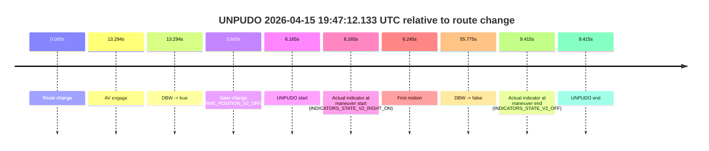
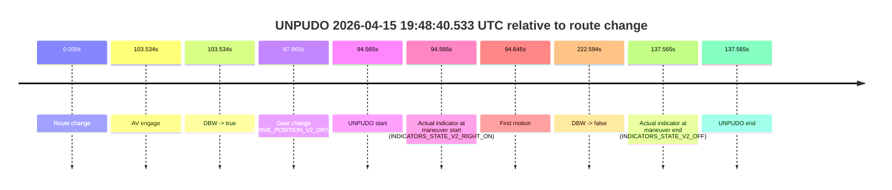
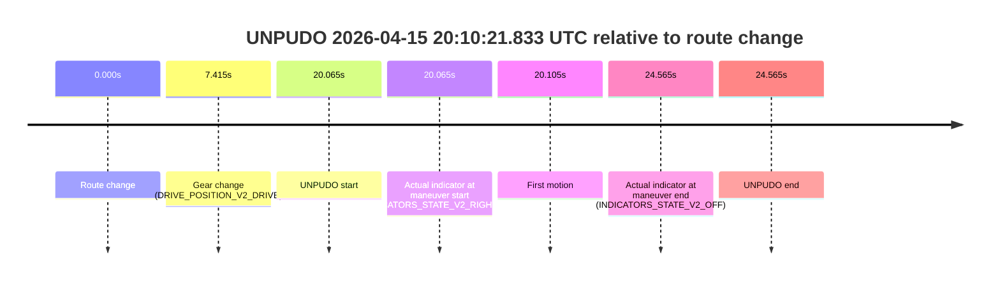

# Run Report: fme20009/2026-04-15--19-34-16--gen2-av-deffdfbc-1467-4216-a7dc-bc16a1164073

| Field | Value |
|---|---|
| Run ID | `fme20009/2026-04-15--19-34-16--gen2-av-deffdfbc-1467-4216-a7dc-bc16a1164073` |
| Date | `2026-04-15` |
| Model(s) | `plum-timeless-beaver` |
| Author | `peng.tang` |
| Event count | `6` |

## unpudo 2026-04-15 19:44:29.583 UTC

| Field | Value |
|---|---|
| Model | `plum-timeless-beaver` |
| Author | `peng.tang` |
| Run ID | `fme20009/2026-04-15--19-34-16--gen2-av-deffdfbc-1467-4216-a7dc-bc16a1164073` |
| Date | `2026-04-15` |
| Time (UTC) | `19:44:29.583` |
| Event type | `unpudo` |
| Disengagement type | `failed_to_unpudo` |
| Route change | `found` |
| Console | [run](https://console.sso.wayve.ai/run/fme20009/2026-04-15--19-34-16--gen2-av-deffdfbc-1467-4216-a7dc-bc16a1164073?id=&time-unixus=1776282269583305) |
| Foxglove | [segment](https://app.foxglove.dev/wayve-on-prem/p/prj_0dX18KZdVHg1fmmI/view?ds=foxglove-stream&ds.deviceName=fme20009&ds.start=2026-04-15T19%3A44%3A09.568305Z&ds.end=2026-04-15T19%3A45%3A13.503098Z&layoutId=lay_0e7VD4WIKDQGU73Y&time=2026-04-15T19%3A44%3A29.583305Z) |

### Event card: non-av

- Non-AV: there is no AV-owned portion anywhere inside the detected unpudo timeline, so it is kept for coverage but excluded from model success / failure scoring.

| Event | Time (UTC) | Delta from route change |
|---|---:|---:|
| Route change | 2026-04-15 19:44:19.568 | `0.000s` |
| AV engage | 2026-04-15 19:44:34.862 | `15.294s` |
| DBW -> true | 2026-04-15 19:44:34.862 | `15.294s` |
| Gear change (DRIVE_POSITION_V2_DRIVE) | 2026-04-15 19:44:24.033 | `4.465s` |
| UNPUDO start | 2026-04-15 19:44:29.583 | `10.015s` |
| Actual indicator at maneuver start (INDICATORS_STATE_V2_RIGHT_ON) | 2026-04-15 19:44:29.583 | `10.015s` |
| First motion | 2026-04-15 19:44:29.612 | `10.045s` |
| DBW -> false | 2026-04-15 19:45:03.503 | `43.935s` |
| Actual indicator at maneuver end (INDICATORS_STATE_V2_OFF) | 2026-04-15 19:44:33.183 | `13.615s` |
| UNPUDO end | 2026-04-15 19:44:33.183 | `13.615s` |

| Metric | Value |
|---|---|
| Outcome | `non-av` |
| Effective failure type | `none` |
| Route change status | `found` |
| DBW at event start | `false` |
| DBW at event end | `false` |
| Predicted gear at AV start | `DRIVE_POSITION_V2_DRIVE` |
| Actual gear at AV start | `DRIVE_POSITION_V2_DRIVE` |
| Predicted gear at event start | `DRIVE_POSITION_V2_DRIVE` |
| Actual gear at event start | `DRIVE_POSITION_V2_DRIVE` |
| Planned indicator direction | `INDICATORS_STATE_V2_RIGHT_ON` |
| Controller indicator direction | `INDICATORS_STATE_V2_RIGHT_ON` |
| Actual indicator direction | `INDICATORS_STATE_V2_RIGHT_ON` |
| Actual indicator at maneuver end | `INDICATORS_STATE_V2_OFF` |
| Driver accel help in AV | `false` |
| Driver accel help timestamp | `n/a` |
| Max accel pedal pct in AV | `0.0%` |
| Max brake pedal pct in AV | `0.0%` |
| Max speed mps in AV | `0.000` |
| Route -> AV | `15.294s` |
| AV -> event start | `-5.279s` |
| AV -> first motion | `-5.249s` |
| AV duration before disengagement | `28.641s` |
| Trajectory waypoint count | `37` |
| Driving-plan step count | `11` |

The scored portion starts from the AV-owned window, not from the pre-AV setup. Route-change search in the stopped pre-event segment was `found`, with the baseline therefore set to route change. At the event anchor the model predicts `DRIVE_POSITION_V2_DRIVE` and the actual gear is `DRIVE_POSITION_V2_DRIVE`. The effective model outcome is `non-av` because `there is no AV-owned overlap inside the event timeline`.

### Resolution

| Field | Value |
|---|---|
| Final outcome | `non-av` |
| Do we agree with this label? | `yes` |
| Source disengagement type | `failed_to_unpudo` |
| Resolved effective failure type | `none` |
| Confidence | `high` |

## unpudo 2026-04-15 19:47:12.133 UTC

| Field | Value |
|---|---|
| Model | `plum-timeless-beaver` |
| Author | `peng.tang` |
| Run ID | `fme20009/2026-04-15--19-34-16--gen2-av-deffdfbc-1467-4216-a7dc-bc16a1164073` |
| Date | `2026-04-15` |
| Time (UTC) | `19:47:12.133` |
| Event type | `unpudo` |
| Disengagement type | `failed_to_unpudo` |
| Route change | `found` |
| Console | [run](https://console.sso.wayve.ai/run/fme20009/2026-04-15--19-34-16--gen2-av-deffdfbc-1467-4216-a7dc-bc16a1164073?id=&time-unixus=1776282432133298) |
| Foxglove | [segment](https://app.foxglove.dev/wayve-on-prem/p/prj_0dX18KZdVHg1fmmI/view?ds=foxglove-stream&ds.deviceName=fme20009&ds.start=2026-04-15T19%3A46%3A55.968266Z&ds.end=2026-04-15T19%3A48%3A11.743404Z&layoutId=lay_0e7VD4WIKDQGU73Y&time=2026-04-15T19%3A47%3A12.133298Z) |

### Event card: non-av

- Non-AV: there is no AV-owned portion anywhere inside the detected unpudo timeline, so it is kept for coverage but excluded from model success / failure scoring.

| Event | Time (UTC) | Delta from route change |
|---|---:|---:|
| Route change | 2026-04-15 19:47:05.968 | `0.000s` |
| AV engage | 2026-04-15 19:47:19.262 | `13.294s` |
| DBW -> true | 2026-04-15 19:47:19.262 | `13.294s` |
| Gear change (DRIVE_POSITION_V2_DRIVE) | 2026-04-15 19:47:09.633 | `3.665s` |
| UNPUDO start | 2026-04-15 19:47:12.133 | `6.165s` |
| Actual indicator at maneuver start (INDICATORS_STATE_V2_RIGHT_ON) | 2026-04-15 19:47:12.133 | `6.165s` |
| First motion | 2026-04-15 19:47:12.212 | `6.245s` |
| DBW -> false | 2026-04-15 19:48:01.743 | `55.775s` |
| Actual indicator at maneuver end (INDICATORS_STATE_V2_OFF) | 2026-04-15 19:47:15.383 | `9.415s` |
| UNPUDO end | 2026-04-15 19:47:15.383 | `9.415s` |

| Metric | Value |
|---|---|
| Outcome | `non-av` |
| Effective failure type | `none` |
| Route change status | `found` |
| DBW at event start | `false` |
| DBW at event end | `false` |
| Predicted gear at AV start | `DRIVE_POSITION_V2_DRIVE` |
| Actual gear at AV start | `DRIVE_POSITION_V2_DRIVE` |
| Predicted gear at event start | `DRIVE_POSITION_V2_DRIVE` |
| Actual gear at event start | `DRIVE_POSITION_V2_DRIVE` |
| Planned indicator direction | `INDICATORS_STATE_V2_OFF` |
| Controller indicator direction | `INDICATORS_STATE_V2_OFF` |
| Actual indicator direction | `INDICATORS_STATE_V2_RIGHT_ON` |
| Actual indicator at maneuver end | `INDICATORS_STATE_V2_OFF` |
| Driver accel help in AV | `false` |
| Driver accel help timestamp | `n/a` |
| Max accel pedal pct in AV | `0.0%` |
| Max brake pedal pct in AV | `0.0%` |
| Max speed mps in AV | `0.000` |
| Route -> AV | `13.294s` |
| AV -> event start | `-7.129s` |
| AV -> first motion | `-7.049s` |
| AV duration before disengagement | `42.481s` |
| Trajectory waypoint count | `36` |
| Driving-plan step count | `11` |

The scored portion starts from the AV-owned window, not from the pre-AV setup. Route-change search in the stopped pre-event segment was `found`, with the baseline therefore set to route change. At the event anchor the model predicts `DRIVE_POSITION_V2_DRIVE` and the actual gear is `DRIVE_POSITION_V2_DRIVE`. The effective model outcome is `non-av` because `there is no AV-owned overlap inside the event timeline`.

### Resolution

| Field | Value |
|---|---|
| Final outcome | `non-av` |
| Do we agree with this label? | `yes` |
| Source disengagement type | `failed_to_unpudo` |
| Resolved effective failure type | `none` |
| Confidence | `high` |

## unpudo 2026-04-15 19:48:40.533 UTC

| Field | Value |
|---|---|
| Model | `plum-timeless-beaver` |
| Author | `peng.tang` |
| Run ID | `fme20009/2026-04-15--19-34-16--gen2-av-deffdfbc-1467-4216-a7dc-bc16a1164073` |
| Date | `2026-04-15` |
| Time (UTC) | `19:48:40.533` |
| Event type | `unpudo` |
| Disengagement type | `failed_to_unpudo` |
| Route change | `found` |
| Console | [run](https://console.sso.wayve.ai/run/fme20009/2026-04-15--19-34-16--gen2-av-deffdfbc-1467-4216-a7dc-bc16a1164073?id=&time-unixus=1776282520533304) |
| Foxglove | [segment](https://app.foxglove.dev/wayve-on-prem/p/prj_0dX18KZdVHg1fmmI/view?ds=foxglove-stream&ds.deviceName=fme20009&ds.start=2026-04-15T19%3A46%3A55.968266Z&ds.end=2026-04-15T19%3A50%3A58.562044Z&layoutId=lay_0e7VD4WIKDQGU73Y&time=2026-04-15T19%3A48%3A40.533304Z) |

### Event card: fail

- Fail: AV owns part of the segment, but the event still resolves as a model-performance failure under the AV-only scoring rule.

| Event | Time (UTC) | Delta from route change |
|---|---:|---:|
| Route change | 2026-04-15 19:47:05.968 | `0.000s` |
| AV engage | 2026-04-15 19:48:49.502 | `103.534s` |
| DBW -> true | 2026-04-15 19:48:49.502 | `103.534s` |
| Gear change (DRIVE_POSITION_V2_DRIVE) | 2026-04-15 19:48:33.833 | `87.865s` |
| UNPUDO start | 2026-04-15 19:48:40.533 | `94.565s` |
| Actual indicator at maneuver start (INDICATORS_STATE_V2_RIGHT_ON) | 2026-04-15 19:48:40.533 | `94.565s` |
| First motion | 2026-04-15 19:48:40.613 | `94.645s` |
| DBW -> false | 2026-04-15 19:50:48.562 | `222.594s` |
| Actual indicator at maneuver end (INDICATORS_STATE_V2_OFF) | 2026-04-15 19:49:23.533 | `137.565s` |
| UNPUDO end | 2026-04-15 19:49:23.533 | `137.565s` |

| Metric | Value |
|---|---|
| Outcome | `fail` |
| Effective failure type | `failed_to_unpudo` |
| Route change status | `found` |
| DBW at event start | `false` |
| DBW at event end | `true` |
| Predicted gear at AV start | `DRIVE_POSITION_V2_DRIVE` |
| Actual gear at AV start | `DRIVE_POSITION_V2_DRIVE` |
| Predicted gear at event start | `DRIVE_POSITION_V2_DRIVE` |
| Actual gear at event start | `DRIVE_POSITION_V2_DRIVE` |
| Planned indicator direction | `INDICATORS_STATE_V2_RIGHT_ON` |
| Controller indicator direction | `INDICATORS_STATE_V2_RIGHT_ON` |
| Actual indicator direction | `INDICATORS_STATE_V2_RIGHT_ON` |
| Actual indicator at maneuver end | `INDICATORS_STATE_V2_OFF` |
| Driver accel help in AV | `false` |
| Driver accel help timestamp | `n/a` |
| Max accel pedal pct in AV | `0.0%` |
| Max brake pedal pct in AV | `9.9%` |
| Max speed mps in AV | `2.253` |
| Route -> AV | `103.534s` |
| AV -> event start | `-8.969s` |
| AV -> first motion | `-8.890s` |
| AV duration before disengagement | `119.060s` |
| Trajectory waypoint count | `36` |
| Driving-plan step count | `11` |

The scored portion starts from the AV-owned window, not from the pre-AV setup. Route-change search in the stopped pre-event segment was `found`, with the baseline therefore set to route change. At the event anchor the model predicts `DRIVE_POSITION_V2_DRIVE` and the actual gear is `DRIVE_POSITION_V2_DRIVE`. The effective model outcome is `fail` because `failed_to_unpudo`.

### Resolution

| Field | Value |
|---|---|
| Final outcome | `fail` |
| Do we agree with this label? | `yes` |
| Source disengagement type | `failed_to_unpudo` |
| Resolved effective failure type | `failed_to_unpudo` |
| Confidence | `high` |

## unpudo 2026-04-15 19:51:43.333 UTC

| Field | Value |
|---|---|
| Model | `plum-timeless-beaver` |
| Author | `peng.tang` |
| Run ID | `fme20009/2026-04-15--19-34-16--gen2-av-deffdfbc-1467-4216-a7dc-bc16a1164073` |
| Date | `2026-04-15` |
| Time (UTC) | `19:51:43.333` |
| Event type | `unpudo` |
| Disengagement type | `none observed` |
| Route change | `found` |
| Console | [run](https://console.sso.wayve.ai/run/fme20009/2026-04-15--19-34-16--gen2-av-deffdfbc-1467-4216-a7dc-bc16a1164073?id=&time-unixus=1776282703333302) |
| Foxglove | [segment](https://app.foxglove.dev/wayve-on-prem/p/prj_0dX18KZdVHg1fmmI/view?ds=foxglove-stream&ds.deviceName=fme20009&ds.start=2026-04-15T19%3A51%3A27.218247Z&ds.end=2026-04-15T19%3A52%3A45.222121Z&layoutId=lay_0e7VD4WIKDQGU73Y&time=2026-04-15T19%3A51%3A43.333302Z) |

### Event card: non-av

- Non-AV: there is no AV-owned portion anywhere inside the detected unpudo timeline, so it is kept for coverage but excluded from model success / failure scoring.

| Event | Time (UTC) | Delta from route change |
|---|---:|---:|
| Route change | 2026-04-15 19:51:37.218 | `0.000s` |
| AV engage | 2026-04-15 19:52:16.921 | `39.704s` |
| DBW -> true | 2026-04-15 19:52:16.921 | `39.704s` |
| Gear change (DRIVE_POSITION_V2_REVERSE) | 2026-04-15 19:51:39.633 | `2.415s` |
| UNPUDO start | 2026-04-15 19:51:43.333 | `6.115s` |
| Actual indicator at maneuver start (INDICATORS_STATE_V2_OFF) | 2026-04-15 19:51:43.333 | `6.115s` |
| First motion | 2026-04-15 19:51:55.592 | `18.375s` |
| DBW -> false | 2026-04-15 19:52:35.222 | `58.004s` |
| Actual indicator at maneuver end (INDICATORS_STATE_V2_OFF) | 2026-04-15 19:52:02.083 | `24.865s` |
| UNPUDO end | 2026-04-15 19:52:02.083 | `24.865s` |

| Metric | Value |
|---|---|
| Outcome | `non-av` |
| Effective failure type | `none` |
| Route change status | `found` |
| DBW at event start | `false` |
| DBW at event end | `false` |
| Predicted gear at AV start | `DRIVE_POSITION_V2_DRIVE` |
| Actual gear at AV start | `DRIVE_POSITION_V2_DRIVE` |
| Predicted gear at event start | `DRIVE_POSITION_V2_REVERSE` |
| Actual gear at event start | `DRIVE_POSITION_V2_REVERSE` |
| Planned indicator direction | `INDICATORS_STATE_V2_OFF` |
| Controller indicator direction | `INDICATORS_STATE_V2_OFF` |
| Actual indicator direction | `INDICATORS_STATE_V2_OFF` |
| Actual indicator at maneuver end | `INDICATORS_STATE_V2_OFF` |
| Driver accel help in AV | `false` |
| Driver accel help timestamp | `n/a` |
| Max accel pedal pct in AV | `0.0%` |
| Max brake pedal pct in AV | `0.0%` |
| Max speed mps in AV | `0.000` |
| Route -> AV | `39.704s` |
| AV -> event start | `-33.589s` |
| AV -> first motion | `-21.329s` |
| AV duration before disengagement | `18.300s` |
| Trajectory waypoint count | `36` |
| Driving-plan step count | `11` |

The scored portion starts from the AV-owned window, not from the pre-AV setup. Route-change search in the stopped pre-event segment was `found`, with the baseline therefore set to route change. At the event anchor the model predicts `DRIVE_POSITION_V2_REVERSE` and the actual gear is `DRIVE_POSITION_V2_REVERSE`. The effective model outcome is `non-av` because `there is no AV-owned overlap inside the event timeline`.

### Resolution

| Field | Value |
|---|---|
| Final outcome | `non-av` |
| Do we agree with this label? | `yes` |
| Source disengagement type | `none observed` |
| Resolved effective failure type | `none` |
| Confidence | `high` |

## unpudo 2026-04-15 19:53:13.833 UTC

| Field | Value |
|---|---|
| Model | `plum-timeless-beaver` |
| Author | `peng.tang` |
| Run ID | `fme20009/2026-04-15--19-34-16--gen2-av-deffdfbc-1467-4216-a7dc-bc16a1164073` |
| Date | `2026-04-15` |
| Time (UTC) | `19:53:13.833` |
| Event type | `unpudo` |
| Disengagement type | `failed_to_unpudo` |
| Route change | `found` |
| Console | [run](https://console.sso.wayve.ai/run/fme20009/2026-04-15--19-34-16--gen2-av-deffdfbc-1467-4216-a7dc-bc16a1164073?id=&time-unixus=1776282793833311) |
| Foxglove | [segment](https://app.foxglove.dev/wayve-on-prem/p/prj_0dX18KZdVHg1fmmI/view?ds=foxglove-stream&ds.deviceName=fme20009&ds.start=2026-04-15T19%3A51%3A27.218247Z&ds.end=2026-04-15T19%3A54%3A47.482029Z&layoutId=lay_0e7VD4WIKDQGU73Y&time=2026-04-15T19%3A53%3A13.833311Z) |

### Event card: non-av

- Non-AV: there is no AV-owned portion anywhere inside the detected unpudo timeline, so it is kept for coverage but excluded from model success / failure scoring.

| Event | Time (UTC) | Delta from route change |
|---|---:|---:|
| Route change | 2026-04-15 19:51:37.218 | `0.000s` |
| AV engage | 2026-04-15 19:53:27.523 | `110.305s` |
| DBW -> true | 2026-04-15 19:53:27.523 | `110.305s` |
| Gear change (DRIVE_POSITION_V2_REVERSE) | 2026-04-15 19:52:59.583 | `82.365s` |
| UNPUDO start | 2026-04-15 19:53:13.833 | `96.615s` |
| Actual indicator at maneuver start (INDICATORS_STATE_V2_RIGHT_ON) | 2026-04-15 19:53:13.833 | `96.615s` |
| First motion | 2026-04-15 19:53:16.212 | `98.995s` |
| DBW -> false | 2026-04-15 19:54:37.482 | `180.264s` |
| Actual indicator at maneuver end (INDICATORS_STATE_V2_OFF) | 2026-04-15 19:53:21.583 | `104.365s` |
| UNPUDO end | 2026-04-15 19:53:21.583 | `104.365s` |

| Metric | Value |
|---|---|
| Outcome | `non-av` |
| Effective failure type | `none` |
| Route change status | `found` |
| DBW at event start | `false` |
| DBW at event end | `false` |
| Predicted gear at AV start | `DRIVE_POSITION_V2_DRIVE` |
| Actual gear at AV start | `DRIVE_POSITION_V2_DRIVE` |
| Predicted gear at event start | `DRIVE_POSITION_V2_REVERSE` |
| Actual gear at event start | `DRIVE_POSITION_V2_REVERSE` |
| Planned indicator direction | `INDICATORS_STATE_V2_RIGHT_ON` |
| Controller indicator direction | `INDICATORS_STATE_V2_RIGHT_ON` |
| Actual indicator direction | `INDICATORS_STATE_V2_RIGHT_ON` |
| Actual indicator at maneuver end | `INDICATORS_STATE_V2_OFF` |
| Driver accel help in AV | `false` |
| Driver accel help timestamp | `n/a` |
| Max accel pedal pct in AV | `0.0%` |
| Max brake pedal pct in AV | `0.0%` |
| Max speed mps in AV | `0.000` |
| Route -> AV | `110.305s` |
| AV -> event start | `-13.690s` |
| AV -> first motion | `-11.310s` |
| AV duration before disengagement | `69.959s` |
| Trajectory waypoint count | `36` |
| Driving-plan step count | `11` |

The scored portion starts from the AV-owned window, not from the pre-AV setup. Route-change search in the stopped pre-event segment was `found`, with the baseline therefore set to route change. At the event anchor the model predicts `DRIVE_POSITION_V2_REVERSE` and the actual gear is `DRIVE_POSITION_V2_REVERSE`. The effective model outcome is `non-av` because `there is no AV-owned overlap inside the event timeline`.

### Resolution

| Field | Value |
|---|---|
| Final outcome | `non-av` |
| Do we agree with this label? | `yes` |
| Source disengagement type | `failed_to_unpudo` |
| Resolved effective failure type | `none` |
| Confidence | `high` |

## unpudo 2026-04-15 20:10:21.833 UTC

| Field | Value |
|---|---|
| Model | `plum-timeless-beaver` |
| Author | `peng.tang` |
| Run ID | `fme20009/2026-04-15--19-34-16--gen2-av-deffdfbc-1467-4216-a7dc-bc16a1164073` |
| Date | `2026-04-15` |
| Time (UTC) | `20:10:21.833` |
| Event type | `unpudo` |
| Disengagement type | `none observed` |
| Route change | `found` |
| Console | [run](https://console.sso.wayve.ai/run/fme20009/2026-04-15--19-34-16--gen2-av-deffdfbc-1467-4216-a7dc-bc16a1164073?id=&time-unixus=1776283821833302) |
| Foxglove | [segment](https://app.foxglove.dev/wayve-on-prem/p/prj_0dX18KZdVHg1fmmI/view?ds=foxglove-stream&ds.deviceName=fme20009&ds.start=2026-04-15T20%3A09%3A51.768276Z&ds.end=2026-04-15T20%3A10%3A36.333298Z&layoutId=lay_0e7VD4WIKDQGU73Y&time=2026-04-15T20%3A10%3A21.833302Z) |

### Event card: non-av

- Non-AV: there is no AV-owned portion anywhere inside the detected unpudo timeline, so it is kept for coverage but excluded from model success / failure scoring.

| Event | Time (UTC) | Delta from route change |
|---|---:|---:|
| Route change | 2026-04-15 20:10:01.768 | `0.000s` |
| Gear change (DRIVE_POSITION_V2_DRIVE) | 2026-04-15 20:10:09.183 | `7.415s` |
| UNPUDO start | 2026-04-15 20:10:21.833 | `20.065s` |
| Actual indicator at maneuver start (INDICATORS_STATE_V2_RIGHT_ON) | 2026-04-15 20:10:21.833 | `20.065s` |
| First motion | 2026-04-15 20:10:21.872 | `20.105s` |
| Actual indicator at maneuver end (INDICATORS_STATE_V2_OFF) | 2026-04-15 20:10:26.333 | `24.565s` |
| UNPUDO end | 2026-04-15 20:10:26.333 | `24.565s` |

| Metric | Value |
|---|---|
| Outcome | `non-av` |
| Effective failure type | `none` |
| Route change status | `found` |
| DBW at event start | `false` |
| DBW at event end | `false` |
| Predicted gear at AV start | `n/a` |
| Actual gear at AV start | `n/a` |
| Predicted gear at event start | `DRIVE_POSITION_V2_DRIVE` |
| Actual gear at event start | `DRIVE_POSITION_V2_DRIVE` |
| Planned indicator direction | `INDICATORS_STATE_V2_RIGHT_ON` |
| Controller indicator direction | `INDICATORS_STATE_V2_RIGHT_ON` |
| Actual indicator direction | `INDICATORS_STATE_V2_RIGHT_ON` |
| Actual indicator at maneuver end | `INDICATORS_STATE_V2_OFF` |
| Driver accel help in AV | `false` |
| Driver accel help timestamp | `n/a` |
| Max accel pedal pct in AV | `0.0%` |
| Max brake pedal pct in AV | `0.0%` |
| Max speed mps in AV | `0.000` |
| Route -> AV | `n/a` |
| AV -> event start | `n/a` |
| AV -> first motion | `n/a` |
| AV duration before disengagement | `n/a` |
| Trajectory waypoint count | `36` |
| Driving-plan step count | `11` |

The scored portion starts from the AV-owned window, not from the pre-AV setup. Route-change search in the stopped pre-event segment was `found`, with the baseline therefore set to route change. At the event anchor the model predicts `DRIVE_POSITION_V2_DRIVE` and the actual gear is `DRIVE_POSITION_V2_DRIVE`. The effective model outcome is `non-av` because `there is no AV-owned overlap inside the event timeline`.

### Resolution

| Field | Value |
|---|---|
| Final outcome | `non-av` |
| Do we agree with this label? | `yes` |
| Source disengagement type | `none observed` |
| Resolved effective failure type | `none` |
| Confidence | `high` |
