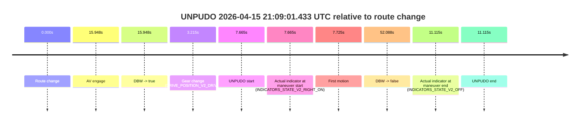
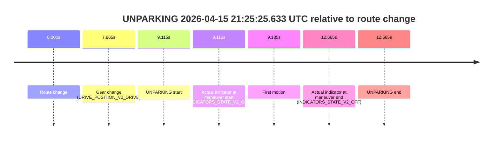

# Run Report: fme20009/2026-04-15--20-53-38--gen2-av-7abe5412-7c60-4869-bc11-fe27848d4294

| Field | Value |
|---|---|
| Run ID | `fme20009/2026-04-15--20-53-38--gen2-av-7abe5412-7c60-4869-bc11-fe27848d4294` |
| Date | `2026-04-15` |
| Model(s) | `plum-timeless-beaver` |
| Author | `peng.tang` |
| Event count | `3` |

## unpudo 2026-04-15 21:09:01.433 UTC

| Field | Value |
|---|---|
| Model | `plum-timeless-beaver` |
| Author | `peng.tang` |
| Run ID | `fme20009/2026-04-15--20-53-38--gen2-av-7abe5412-7c60-4869-bc11-fe27848d4294` |
| Date | `2026-04-15` |
| Time (UTC) | `21:09:01.433` |
| Event type | `unpudo` |
| Disengagement type | `failed_to_unpudo` |
| Route change | `found` |
| Console | [run](https://console.sso.wayve.ai/run/fme20009/2026-04-15--20-53-38--gen2-av-7abe5412-7c60-4869-bc11-fe27848d4294?id=&time-unixus=1776287341433311) |
| Foxglove | [segment](https://app.foxglove.dev/wayve-on-prem/p/prj_0dX18KZdVHg1fmmI/view?ds=foxglove-stream&ds.deviceName=fme20009&ds.start=2026-04-15T21%3A08%3A43.768357Z&ds.end=2026-04-15T21%3A09%3A55.856280Z&layoutId=lay_0e7VD4WIKDQGU73Y&time=2026-04-15T21%3A09%3A01.433311Z) |

### Event card: accidental

- Accidental: AV ownership is present for less than `2s`, so this is treated as an accidental brush with the maneuver rather than a meaningful model attempt.

| Event | Time (UTC) | Delta from route change |
|---|---:|---:|
| Route change | 2026-04-15 21:08:53.768 | `0.000s` |
| AV engage | 2026-04-15 21:09:09.716 | `15.948s` |
| DBW -> true | 2026-04-15 21:09:09.716 | `15.948s` |
| Gear change (DRIVE_POSITION_V2_DRIVE) | 2026-04-15 21:08:56.983 | `3.215s` |
| UNPUDO start | 2026-04-15 21:09:01.433 | `7.665s` |
| Actual indicator at maneuver start (INDICATORS_STATE_V2_RIGHT_ON) | 2026-04-15 21:09:01.433 | `7.665s` |
| First motion | 2026-04-15 21:09:01.492 | `7.725s` |
| DBW -> false | 2026-04-15 21:09:45.856 | `52.088s` |
| Actual indicator at maneuver end (INDICATORS_STATE_V2_OFF) | 2026-04-15 21:09:04.883 | `11.115s` |
| UNPUDO end | 2026-04-15 21:09:04.883 | `11.115s` |

| Metric | Value |
|---|---|
| Outcome | `accidental` |
| Effective failure type | `none` |
| Route change status | `found` |
| DBW at event start | `false` |
| DBW at event end | `false` |
| Predicted gear at AV start | `DRIVE_POSITION_V2_DRIVE` |
| Actual gear at AV start | `DRIVE_POSITION_V2_DRIVE` |
| Predicted gear at event start | `DRIVE_POSITION_V2_DRIVE` |
| Actual gear at event start | `DRIVE_POSITION_V2_DRIVE` |
| Planned indicator direction | `INDICATORS_STATE_V2_RIGHT_ON` |
| Controller indicator direction | `INDICATORS_STATE_V2_RIGHT_ON` |
| Actual indicator direction | `INDICATORS_STATE_V2_RIGHT_ON` |
| Actual indicator at maneuver end | `INDICATORS_STATE_V2_OFF` |
| Driver accel help in AV | `false` |
| Driver accel help timestamp | `n/a` |
| Max accel pedal pct in AV | `0.0%` |
| Max brake pedal pct in AV | `0.0%` |
| Max speed mps in AV | `0.000` |
| Route -> AV | `15.948s` |
| AV -> event start | `-8.283s` |
| AV -> first motion | `-8.224s` |
| AV duration before disengagement | `36.140s` |
| Trajectory waypoint count | `35` |
| Driving-plan step count | `11` |

The scored portion starts from the AV-owned window, not from the pre-AV setup. Route-change search in the stopped pre-event segment was `found`, with the baseline therefore set to route change. At the event anchor the model predicts `DRIVE_POSITION_V2_DRIVE` and the actual gear is `DRIVE_POSITION_V2_DRIVE`. The effective model outcome is `accidental` because `the AV-owned portion is shorter than 2s`.

### Resolution

| Field | Value |
|---|---|
| Final outcome | `accidental` |
| Do we agree with this label? | `yes` |
| Source disengagement type | `failed_to_unpudo` |
| Resolved effective failure type | `none` |
| Confidence | `high` |

## unpudo 2026-04-15 21:19:41.483 UTC

| Field | Value |
|---|---|
| Model | `plum-timeless-beaver` |
| Author | `peng.tang` |
| Run ID | `fme20009/2026-04-15--20-53-38--gen2-av-7abe5412-7c60-4869-bc11-fe27848d4294` |
| Date | `2026-04-15` |
| Time (UTC) | `21:19:41.483` |
| Event type | `unpudo` |
| Disengagement type | `failed_to_unpudo` |
| Route change | `found` |
| Console | [run](https://console.sso.wayve.ai/run/fme20009/2026-04-15--20-53-38--gen2-av-7abe5412-7c60-4869-bc11-fe27848d4294?id=&time-unixus=1776287981483316) |
| Foxglove | [segment](https://app.foxglove.dev/wayve-on-prem/p/prj_0dX18KZdVHg1fmmI/view?ds=foxglove-stream&ds.deviceName=fme20009&ds.start=2026-04-15T21%3A19%3A12.918298Z&ds.end=2026-04-15T21%3A22%3A42.716487Z&layoutId=lay_0e7VD4WIKDQGU73Y&time=2026-04-15T21%3A19%3A41.483316Z) |

### Event card: accidental

- Accidental: AV ownership is present for less than `2s`, so this is treated as an accidental brush with the maneuver rather than a meaningful model attempt.

| Event | Time (UTC) | Delta from route change |
|---|---:|---:|
| Route change | 2026-04-15 21:19:22.918 | `0.000s` |
| AV engage | 2026-04-15 21:19:46.677 | `23.759s` |
| DBW -> true | 2026-04-15 21:19:46.677 | `23.759s` |
| Gear change (DRIVE_POSITION_V2_DRIVE) | 2026-04-15 21:19:36.883 | `13.965s` |
| UNPUDO start | 2026-04-15 21:19:41.483 | `18.565s` |
| Actual indicator at maneuver start (INDICATORS_STATE_V2_RIGHT_ON) | 2026-04-15 21:19:41.483 | `18.565s` |
| First motion | 2026-04-15 21:19:41.512 | `18.595s` |
| DBW -> false | 2026-04-15 21:22:32.716 | `189.798s` |
| Actual indicator at maneuver end (INDICATORS_STATE_V2_OFF) | 2026-04-15 21:19:44.633 | `21.715s` |
| UNPUDO end | 2026-04-15 21:19:44.633 | `21.715s` |

| Metric | Value |
|---|---|
| Outcome | `accidental` |
| Effective failure type | `none` |
| Route change status | `found` |
| DBW at event start | `false` |
| DBW at event end | `false` |
| Predicted gear at AV start | `DRIVE_POSITION_V2_DRIVE` |
| Actual gear at AV start | `DRIVE_POSITION_V2_DRIVE` |
| Predicted gear at event start | `DRIVE_POSITION_V2_DRIVE` |
| Actual gear at event start | `DRIVE_POSITION_V2_DRIVE` |
| Planned indicator direction | `INDICATORS_STATE_V2_RIGHT_ON` |
| Controller indicator direction | `INDICATORS_STATE_V2_RIGHT_ON` |
| Actual indicator direction | `INDICATORS_STATE_V2_RIGHT_ON` |
| Actual indicator at maneuver end | `INDICATORS_STATE_V2_OFF` |
| Driver accel help in AV | `false` |
| Driver accel help timestamp | `n/a` |
| Max accel pedal pct in AV | `0.0%` |
| Max brake pedal pct in AV | `0.0%` |
| Max speed mps in AV | `0.000` |
| Route -> AV | `23.759s` |
| AV -> event start | `-5.194s` |
| AV -> first motion | `-5.165s` |
| AV duration before disengagement | `166.039s` |
| Trajectory waypoint count | `36` |
| Driving-plan step count | `11` |

The scored portion starts from the AV-owned window, not from the pre-AV setup. Route-change search in the stopped pre-event segment was `found`, with the baseline therefore set to route change. At the event anchor the model predicts `DRIVE_POSITION_V2_DRIVE` and the actual gear is `DRIVE_POSITION_V2_DRIVE`. The effective model outcome is `accidental` because `the AV-owned portion is shorter than 2s`.

### Resolution

| Field | Value |
|---|---|
| Final outcome | `accidental` |
| Do we agree with this label? | `yes` |
| Source disengagement type | `failed_to_unpudo` |
| Resolved effective failure type | `none` |
| Confidence | `high` |

## unparking 2026-04-15 21:25:25.633 UTC

| Field | Value |
|---|---|
| Model | `plum-timeless-beaver` |
| Author | `peng.tang` |
| Run ID | `fme20009/2026-04-15--20-53-38--gen2-av-7abe5412-7c60-4869-bc11-fe27848d4294` |
| Date | `2026-04-15` |
| Time (UTC) | `21:25:25.633` |
| Event type | `unparking` |
| Disengagement type | `none observed` |
| Route change | `found` |
| Console | [run](https://console.sso.wayve.ai/run/fme20009/2026-04-15--20-53-38--gen2-av-7abe5412-7c60-4869-bc11-fe27848d4294?id=&time-unixus=1776288325633297) |
| Foxglove | [segment](https://app.foxglove.dev/wayve-on-prem/p/prj_0dX18KZdVHg1fmmI/view?ds=foxglove-stream&ds.deviceName=fme20009&ds.start=2026-04-15T21%3A25%3A06.518263Z&ds.end=2026-04-15T21%3A25%3A39.083309Z&layoutId=lay_0e7VD4WIKDQGU73Y&time=2026-04-15T21%3A25%3A25.633297Z) |

### Event card: non-av

- Non-AV: the detected unparking starts outside AV ownership, so it is kept for coverage but excluded from model success / failure scoring.

| Event | Time (UTC) | Delta from route change |
|---|---:|---:|
| Route change | 2026-04-15 21:25:16.518 | `0.000s` |
| Gear change (DRIVE_POSITION_V2_DRIVE) | 2026-04-15 21:25:24.383 | `7.865s` |
| UNPARKING start | 2026-04-15 21:25:25.633 | `9.115s` |
| Actual indicator at maneuver start (INDICATORS_STATE_V2_OFF) | 2026-04-15 21:25:25.633 | `9.115s` |
| First motion | 2026-04-15 21:25:25.653 | `9.135s` |
| Actual indicator at maneuver end (INDICATORS_STATE_V2_OFF) | 2026-04-15 21:25:29.083 | `12.565s` |
| UNPARKING end | 2026-04-15 21:25:29.083 | `12.565s` |

| Metric | Value |
|---|---|
| Outcome | `non-av` |
| Effective failure type | `none` |
| Route change status | `found` |
| DBW at event start | `false` |
| DBW at event end | `false` |
| Predicted gear at AV start | `n/a` |
| Actual gear at AV start | `n/a` |
| Predicted gear at event start | `DRIVE_POSITION_V2_DRIVE` |
| Actual gear at event start | `DRIVE_POSITION_V2_DRIVE` |
| Planned indicator direction | `INDICATORS_STATE_V2_OFF` |
| Controller indicator direction | `INDICATORS_STATE_V2_OFF` |
| Actual indicator direction | `INDICATORS_STATE_V2_OFF` |
| Actual indicator at maneuver end | `INDICATORS_STATE_V2_OFF` |
| Driver accel help in AV | `false` |
| Driver accel help timestamp | `n/a` |
| Max accel pedal pct in AV | `0.0%` |
| Max brake pedal pct in AV | `0.0%` |
| Max speed mps in AV | `0.000` |
| Route -> AV | `n/a` |
| AV -> event start | `n/a` |
| AV -> first motion | `n/a` |
| AV duration before disengagement | `n/a` |
| Trajectory waypoint count | `35` |
| Driving-plan step count | `11` |

The scored portion starts from the AV-owned window, not from the pre-AV setup. Route-change search in the stopped pre-event segment was `found`, with the baseline therefore set to route change. At the event anchor the model predicts `DRIVE_POSITION_V2_DRIVE` and the actual gear is `DRIVE_POSITION_V2_DRIVE`. The effective model outcome is `non-av` because `the event does not begin in AV ownership`.

### Resolution

| Field | Value |
|---|---|
| Final outcome | `non-av` |
| Do we agree with this label? | `yes` |
| Source disengagement type | `none observed` |
| Resolved effective failure type | `none` |
| Confidence | `high` |
