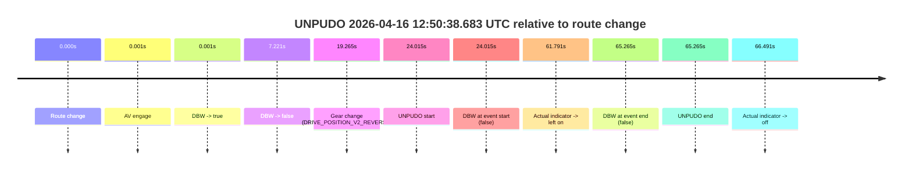
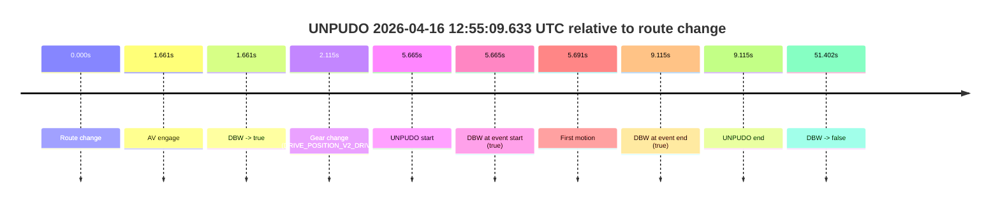
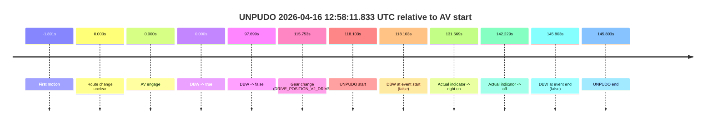
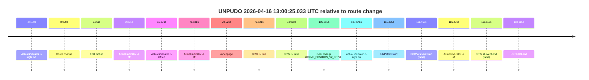
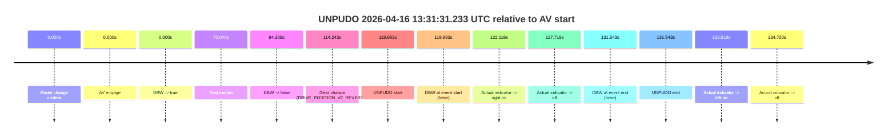
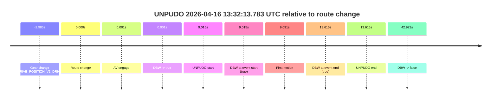

# Run Report: fme20009/2026-04-16--12-35-12--gen2-av-b61aff24-57ea-46f1-b166-ea73856ef968

| Field | Value |
|---|---|
| Run ID | `fme20009/2026-04-16--12-35-12--gen2-av-b61aff24-57ea-46f1-b166-ea73856ef968` |
| Date | `2026-04-16` |
| Model(s) | `armadillo-amethyst-squeaky` |
| Author | `guy.geva` |
| Event count | `7` |

## unpudo 2026-04-16 12:46:08.833 UTC

| Field | Value |
|---|---|
| Model | `armadillo-amethyst-squeaky` |
| Author | `guy.geva` |
| Run ID | `fme20009/2026-04-16--12-35-12--gen2-av-b61aff24-57ea-46f1-b166-ea73856ef968` |
| Date | `2026-04-16` |
| Time (UTC) | `12:46:08.833` |
| Event type | `unpudo` |
| Disengagement type | `none observed` |
| Route change | `found` |
| Console | [run](https://console.sso.wayve.ai/run/fme20009/2026-04-16--12-35-12--gen2-av-b61aff24-57ea-46f1-b166-ea73856ef968?id=&time-unixus=1776343568833315) |
| Foxglove | [segment](https://app.foxglove.dev/wayve-on-prem/p/prj_0dX18KZdVHg1fmmI/view?ds=foxglove-stream&ds.deviceName=fme20009&ds.start=2026-04-16T12%3A45%3A31.483307Z&ds.end=2026-04-16T12%3A47%3A46.289436Z&layoutId=lay_0e7VD4WIKDQGU73Y&time=2026-04-16T12%3A46%3A08.833315Z) |

### Event card: pass

- Pass: AV owns the credited unpudo from route change through the official unpudo window, the gear state is aligned at the anchor, and the vehicle moves without driver accelerator help in AV.

| Event | Time (UTC) | Delta from route change |
|---|---:|---:|
| Gear change (DRIVE_POSITION_V2_DRIVE) | 2026-04-16 12:45:41.483 | `-2.935s` |
| Route change | 2026-04-16 12:45:44.418 | `0.000s` |
| AV engage | 2026-04-16 12:45:44.419 | `0.001s` |
| DBW -> true | 2026-04-16 12:45:44.419 | `0.001s` |
| UNPUDO start | 2026-04-16 12:46:08.833 | `24.415s` |
| DBW at event start (true) | 2026-04-16 12:46:08.833 | `24.415s` |
| First motion | 2026-04-16 12:46:08.879 | `24.461s` |
| DBW at event end (true) | 2026-04-16 12:46:13.933 | `29.515s` |
| UNPUDO end | 2026-04-16 12:46:13.933 | `29.515s` |
| DBW -> false | 2026-04-16 12:47:36.289 | `111.871s` |

| Metric | Value |
|---|---|
| Outcome | `pass` |
| Effective failure type | `none` |
| Route change status | `found` |
| DBW at event start | `true` |
| DBW at event end | `true` |
| Predicted gear at AV start | `DRIVE_POSITION_V2_DRIVE` |
| Actual gear at AV start | `DRIVE_POSITION_V2_DRIVE` |
| Predicted gear at event start | `DRIVE_POSITION_V2_DRIVE` |
| Actual gear at event start | `DRIVE_POSITION_V2_DRIVE` |
| Planned indicator direction | `INDICATORS_STATE_V2_RIGHT_ON` |
| Controller indicator direction | `INDICATORS_STATE_V2_RIGHT_ON` |
| Actual indicator direction | `INDICATORS_STATE_V2_OFF` |
| Actual indicator at maneuver end | `INDICATORS_STATE_V2_OFF` |
| Driver accel help in AV | `false` |
| Driver accel help timestamp | `n/a` |
| Max accel pedal pct in AV | `0.0%` |
| Max brake pedal pct in AV | `10.5%` |
| Max speed mps in AV | `3.147` |
| Success timing baseline | `route change` |
| Route -> AV | `0.001s` |
| AV -> event start | `24.414s` |
| AV -> first motion | `24.461s` |
| Success baseline -> event start | `24.415s` |
| Success baseline -> first motion | `24.461s` |
| AV duration before disengagement | `111.870s` |
| Trajectory waypoint count | `36` |
| Driving-plan step count | `11` |

The scored portion starts from the AV-owned window, not from the pre-AV setup. Route-change search in the stopped pre-event segment was `found`, with the baseline therefore set to route change. At the event anchor the model predicts `DRIVE_POSITION_V2_DRIVE` and the actual gear is `DRIVE_POSITION_V2_DRIVE`. The effective model outcome is `pass` because `the credited unpudo stays AV-owned through the official unpudo window.`

### Resolution

| Field | Value |
|---|---|
| Final outcome | `pass` |
| Do we agree with this label? | `yes` |
| Source disengagement type | `none observed` |
| Resolved effective failure type | `none` |
| Confidence | `high` |

## unpudo 2026-04-16 12:50:38.683 UTC

| Field | Value |
|---|---|
| Model | `armadillo-amethyst-squeaky` |
| Author | `guy.geva` |
| Run ID | `fme20009/2026-04-16--12-35-12--gen2-av-b61aff24-57ea-46f1-b166-ea73856ef968` |
| Date | `2026-04-16` |
| Time (UTC) | `12:50:38.683` |
| Event type | `unpudo` |
| Disengagement type | `none observed` |
| Route change | `found` |
| Console | [run](https://console.sso.wayve.ai/run/fme20009/2026-04-16--12-35-12--gen2-av-b61aff24-57ea-46f1-b166-ea73856ef968?id=&time-unixus=1776343838683319) |
| Foxglove | [segment](https://app.foxglove.dev/wayve-on-prem/p/prj_0dX18KZdVHg1fmmI/view?ds=foxglove-stream&ds.deviceName=fme20009&ds.start=2026-04-16T12%3A50%3A04.668281Z&ds.end=2026-04-16T12%3A51%3A29.933326Z&layoutId=lay_0e7VD4WIKDQGU73Y&time=2026-04-16T12%3A50%3A38.683319Z) |

### Event card: fail

- Fail: the credited unpudo does not stay AV-owned. The event window starts with DBW false, and the maneuver outcome lands outside a clean AV-owned segment.

| Event | Time (UTC) | Delta from route change |
|---|---:|---:|
| Route change | 2026-04-16 12:50:14.668 | `0.000s` |
| AV engage | 2026-04-16 12:50:14.669 | `0.001s` |
| DBW -> true | 2026-04-16 12:50:14.669 | `0.001s` |
| DBW -> false | 2026-04-16 12:50:21.889 | `7.221s` |
| Gear change (DRIVE_POSITION_V2_REVERSE) | 2026-04-16 12:50:33.933 | `19.265s` |
| UNPUDO start | 2026-04-16 12:50:38.683 | `24.015s` |
| DBW at event start (false) | 2026-04-16 12:50:38.683 | `24.015s` |
| Actual indicator -> left on | 2026-04-16 12:51:16.459 | `61.791s` |
| DBW at event end (false) | 2026-04-16 12:51:19.933 | `65.265s` |
| UNPUDO end | 2026-04-16 12:51:19.933 | `65.265s` |
| Actual indicator -> off | 2026-04-16 12:51:21.159 | `66.491s` |

| Metric | Value |
|---|---|
| Outcome | `fail` |
| Effective failure type | `not_av_owned` |
| Route change status | `found` |
| DBW at event start | `false` |
| DBW at event end | `false` |
| Predicted gear at AV start | `DRIVE_POSITION_V2_REVERSE` |
| Actual gear at AV start | `DRIVE_POSITION_V2_REVERSE` |
| Predicted gear at event start | `DRIVE_POSITION_V2_REVERSE` |
| Actual gear at event start | `DRIVE_POSITION_V2_REVERSE` |
| Planned indicator direction | `INDICATORS_STATE_V2_OFF` |
| Controller indicator direction | `INDICATORS_STATE_V2_OFF` |
| Actual indicator direction | `INDICATORS_STATE_V2_OFF` |
| Actual indicator at maneuver end | `INDICATORS_STATE_V2_LEFT_ON` |
| Driver accel help in AV | `false` |
| Driver accel help timestamp | `n/a` |
| Max accel pedal pct in AV | `0.0%` |
| Max brake pedal pct in AV | `8.0%` |
| Max speed mps in AV | `0.000` |
| Success timing baseline | `route change` |
| Route -> AV | `0.001s` |
| AV -> event start | `24.014s` |
| AV -> first motion | `n/a` |
| Success baseline -> event start | `24.015s` |
| Success baseline -> first motion | `n/a` |
| AV duration before disengagement | `7.220s` |
| Trajectory waypoint count | `37` |
| Driving-plan step count | `11` |

The scored portion starts from the AV-owned window, not from the pre-AV setup. Route-change search in the stopped pre-event segment was `found`, with the baseline therefore set to route change. At the event anchor the model predicts `DRIVE_POSITION_V2_REVERSE` and the actual gear is `DRIVE_POSITION_V2_REVERSE`. The effective model outcome is `fail` because `not_av_owned.`

### Resolution

| Field | Value |
|---|---|
| Final outcome | `fail` |
| Do we agree with this label? | `yes` |
| Source disengagement type | `none observed` |
| Resolved effective failure type | `not_av_owned` |
| Confidence | `high` |

## unpudo 2026-04-16 12:55:09.633 UTC

| Field | Value |
|---|---|
| Model | `armadillo-amethyst-squeaky` |
| Author | `guy.geva` |
| Run ID | `fme20009/2026-04-16--12-35-12--gen2-av-b61aff24-57ea-46f1-b166-ea73856ef968` |
| Date | `2026-04-16` |
| Time (UTC) | `12:55:09.633` |
| Event type | `unpudo` |
| Disengagement type | `none observed` |
| Route change | `found` |
| Console | [run](https://console.sso.wayve.ai/run/fme20009/2026-04-16--12-35-12--gen2-av-b61aff24-57ea-46f1-b166-ea73856ef968?id=&time-unixus=1776344109633320) |
| Foxglove | [segment](https://app.foxglove.dev/wayve-on-prem/p/prj_0dX18KZdVHg1fmmI/view?ds=foxglove-stream&ds.deviceName=fme20009&ds.start=2026-04-16T12%3A54%3A53.968348Z&ds.end=2026-04-16T12%3A56%3A05.370511Z&layoutId=lay_0e7VD4WIKDQGU73Y&time=2026-04-16T12%3A55%3A09.633320Z) |

### Event card: pass

- Pass: AV owns the credited unpudo from route change through the official unpudo window, the gear state is aligned at the anchor, and the vehicle moves without driver accelerator help in AV.

| Event | Time (UTC) | Delta from route change |
|---|---:|---:|
| Route change | 2026-04-16 12:55:03.968 | `0.000s` |
| AV engage | 2026-04-16 12:55:05.629 | `1.661s` |
| DBW -> true | 2026-04-16 12:55:05.629 | `1.661s` |
| Gear change (DRIVE_POSITION_V2_DRIVE) | 2026-04-16 12:55:06.083 | `2.115s` |
| UNPUDO start | 2026-04-16 12:55:09.633 | `5.665s` |
| DBW at event start (true) | 2026-04-16 12:55:09.633 | `5.665s` |
| First motion | 2026-04-16 12:55:09.659 | `5.691s` |
| DBW at event end (true) | 2026-04-16 12:55:13.083 | `9.115s` |
| UNPUDO end | 2026-04-16 12:55:13.083 | `9.115s` |
| DBW -> false | 2026-04-16 12:55:55.370 | `51.402s` |

| Metric | Value |
|---|---|
| Outcome | `pass` |
| Effective failure type | `none` |
| Route change status | `found` |
| DBW at event start | `true` |
| DBW at event end | `true` |
| Predicted gear at AV start | `DRIVE_POSITION_V2_DRIVE` |
| Actual gear at AV start | `DRIVE_POSITION_V2_PARK` |
| Predicted gear at event start | `DRIVE_POSITION_V2_DRIVE` |
| Actual gear at event start | `DRIVE_POSITION_V2_DRIVE` |
| Planned indicator direction | `INDICATORS_STATE_V2_RIGHT_ON` |
| Controller indicator direction | `INDICATORS_STATE_V2_OFF` |
| Actual indicator direction | `INDICATORS_STATE_V2_OFF` |
| Actual indicator at maneuver end | `INDICATORS_STATE_V2_OFF` |
| Driver accel help in AV | `false` |
| Driver accel help timestamp | `n/a` |
| Max accel pedal pct in AV | `0.0%` |
| Max brake pedal pct in AV | `8.0%` |
| Max speed mps in AV | `4.569` |
| Success timing baseline | `route change` |
| Route -> AV | `1.661s` |
| AV -> event start | `4.004s` |
| AV -> first motion | `4.030s` |
| Success baseline -> event start | `5.665s` |
| Success baseline -> first motion | `5.691s` |
| AV duration before disengagement | `49.741s` |
| Trajectory waypoint count | `36` |
| Driving-plan step count | `11` |

The scored portion starts from the AV-owned window, not from the pre-AV setup. Route-change search in the stopped pre-event segment was `found`, with the baseline therefore set to route change. At the event anchor the model predicts `DRIVE_POSITION_V2_DRIVE` and the actual gear is `DRIVE_POSITION_V2_DRIVE`. The effective model outcome is `pass` because `the credited unpudo stays AV-owned through the official unpudo window.`

### Resolution

| Field | Value |
|---|---|
| Final outcome | `pass` |
| Do we agree with this label? | `yes` |
| Source disengagement type | `none observed` |
| Resolved effective failure type | `none` |
| Confidence | `high` |

## unpudo 2026-04-16 12:58:11.833 UTC

| Field | Value |
|---|---|
| Model | `armadillo-amethyst-squeaky` |
| Author | `guy.geva` |
| Run ID | `fme20009/2026-04-16--12-35-12--gen2-av-b61aff24-57ea-46f1-b166-ea73856ef968` |
| Date | `2026-04-16` |
| Time (UTC) | `12:58:11.833` |
| Event type | `unpudo` |
| Disengagement type | `none observed` |
| Route change | `unclear` |
| Console | [run](https://console.sso.wayve.ai/run/fme20009/2026-04-16--12-35-12--gen2-av-b61aff24-57ea-46f1-b166-ea73856ef968?id=&time-unixus=1776344291833324) |
| Foxglove | [segment](https://app.foxglove.dev/wayve-on-prem/p/prj_0dX18KZdVHg1fmmI/view?ds=foxglove-stream&ds.deviceName=fme20009&ds.start=2026-04-16T12%3A56%3A03.730753Z&ds.end=2026-04-16T12%3A58%3A49.533321Z&layoutId=lay_0e7VD4WIKDQGU73Y&time=2026-04-16T12%3A58%3A11.833324Z) |

### Event card: fail

- Fail: the credited unpudo does not stay AV-owned. The event window starts with DBW false, and the maneuver outcome lands outside a clean AV-owned segment.

| Event | Time (UTC) | Delta from AV start |
|---|---:|---:|
| First motion | 2026-04-16 12:56:11.839 | `-1.891s` |
| Route change unclear | 2026-04-16 12:56:13.730 | `0.000s` |
| AV engage | 2026-04-16 12:56:13.730 | `0.000s` |
| DBW -> true | 2026-04-16 12:56:13.730 | `0.000s` |
| DBW -> false | 2026-04-16 12:57:51.429 | `97.699s` |
| Gear change (DRIVE_POSITION_V2_DRIVE) | 2026-04-16 12:58:09.483 | `115.753s` |
| UNPUDO start | 2026-04-16 12:58:11.833 | `118.103s` |
| DBW at event start (false) | 2026-04-16 12:58:11.833 | `118.103s` |
| Actual indicator -> right on | 2026-04-16 12:58:25.399 | `131.669s` |
| Actual indicator -> off | 2026-04-16 12:58:35.959 | `142.229s` |
| DBW at event end (false) | 2026-04-16 12:58:39.533 | `145.803s` |
| UNPUDO end | 2026-04-16 12:58:39.533 | `145.803s` |

| Metric | Value |
|---|---|
| Outcome | `fail` |
| Effective failure type | `completed_outside_av` |
| Route change status | `unclear` |
| DBW at event start | `false` |
| DBW at event end | `false` |
| Predicted gear at AV start | `DRIVE_POSITION_V2_DRIVE` |
| Actual gear at AV start | `DRIVE_POSITION_V2_DRIVE` |
| Predicted gear at event start | `DRIVE_POSITION_V2_DRIVE` |
| Actual gear at event start | `DRIVE_POSITION_V2_DRIVE` |
| Planned indicator direction | `INDICATORS_STATE_V2_OFF` |
| Controller indicator direction | `INDICATORS_STATE_V2_OFF` |
| Actual indicator direction | `INDICATORS_STATE_V2_OFF` |
| Actual indicator at maneuver end | `INDICATORS_STATE_V2_OFF` |
| Driver accel help in AV | `false` |
| Driver accel help timestamp | `n/a` |
| Max accel pedal pct in AV | `0.0%` |
| Max brake pedal pct in AV | `22.9%` |
| Max speed mps in AV | `7.456` |
| Success timing baseline | `AV start` |
| Route -> AV | `n/a` |
| AV -> event start | `118.103s` |
| AV -> first motion | `-1.891s` |
| Success baseline -> event start | `118.103s` |
| Success baseline -> first motion | `-1.891s` |
| AV duration before disengagement | `97.699s` |
| Trajectory waypoint count | `36` |
| Driving-plan step count | `11` |

The scored portion starts from the AV-owned window, not from the pre-AV setup. Route-change search in the stopped pre-event segment was `unclear`, with the baseline therefore set to AV start. At the event anchor the model predicts `DRIVE_POSITION_V2_DRIVE` and the actual gear is `DRIVE_POSITION_V2_DRIVE`. The effective model outcome is `fail` because `completed_outside_av.`

### Resolution

| Field | Value |
|---|---|
| Final outcome | `fail` |
| Do we agree with this label? | `yes` |
| Source disengagement type | `none observed` |
| Resolved effective failure type | `completed_outside_av` |
| Confidence | `medium` |

## unpudo 2026-04-16 13:00:25.033 UTC

| Field | Value |
|---|---|
| Model | `armadillo-amethyst-squeaky` |
| Author | `guy.geva` |
| Run ID | `fme20009/2026-04-16--12-35-12--gen2-av-b61aff24-57ea-46f1-b166-ea73856ef968` |
| Date | `2026-04-16` |
| Time (UTC) | `13:00:25.033` |
| Event type | `unpudo` |
| Disengagement type | `none observed` |
| Route change | `found` |
| Console | [run](https://console.sso.wayve.ai/run/fme20009/2026-04-16--12-35-12--gen2-av-b61aff24-57ea-46f1-b166-ea73856ef968?id=&time-unixus=1776344425033322) |
| Foxglove | [segment](https://app.foxglove.dev/wayve-on-prem/p/prj_0dX18KZdVHg1fmmI/view?ds=foxglove-stream&ds.deviceName=fme20009&ds.start=2026-04-16T12%3A58%3A23.568251Z&ds.end=2026-04-16T13%3A00%3A41.683303Z&layoutId=lay_0e7VD4WIKDQGU73Y&time=2026-04-16T13%3A00%3A25.033322Z) |

### Event card: fail

- Fail: the credited unpudo does not stay AV-owned. The event window starts with DBW false, and the maneuver outcome lands outside a clean AV-owned segment.

| Event | Time (UTC) | Delta from route change |
|---|---:|---:|
| Actual indicator -> right on | 2026-04-16 12:58:25.399 | `-8.169s` |
| Route change | 2026-04-16 12:58:33.568 | `0.000s` |
| First motion | 2026-04-16 12:58:33.579 | `0.011s` |
| Actual indicator -> off | 2026-04-16 12:58:35.959 | `2.391s` |
| Actual indicator -> left on | 2026-04-16 12:59:24.839 | `51.271s` |
| Actual indicator -> off | 2026-04-16 12:59:45.159 | `71.591s` |
| AV engage | 2026-04-16 12:59:53.089 | `79.521s` |
| DBW -> true | 2026-04-16 12:59:53.089 | `79.521s` |
| DBW -> false | 2026-04-16 12:59:58.469 | `84.902s` |
| Gear change (DRIVE_POSITION_V2_DRIVE) | 2026-04-16 13:00:20.383 | `106.815s` |
| Actual indicator -> right on | 2026-04-16 13:00:21.239 | `107.671s` |
| UNPUDO start | 2026-04-16 13:00:25.033 | `111.465s` |
| DBW at event start (false) | 2026-04-16 13:00:25.033 | `111.465s` |
| Actual indicator -> off | 2026-04-16 13:00:30.039 | `116.471s` |
| DBW at event end (false) | 2026-04-16 13:00:31.683 | `118.115s` |
| UNPUDO end | 2026-04-16 13:00:31.683 | `118.115s` |

| Metric | Value |
|---|---|
| Outcome | `fail` |
| Effective failure type | `completed_outside_av` |
| Route change status | `found` |
| DBW at event start | `false` |
| DBW at event end | `false` |
| Predicted gear at AV start | `DRIVE_POSITION_V2_REVERSE` |
| Actual gear at AV start | `DRIVE_POSITION_V2_PARK` |
| Predicted gear at event start | `DRIVE_POSITION_V2_DRIVE` |
| Actual gear at event start | `DRIVE_POSITION_V2_DRIVE` |
| Planned indicator direction | `INDICATORS_STATE_V2_LEFT_ON` |
| Controller indicator direction | `INDICATORS_STATE_V2_LEFT_ON` |
| Actual indicator direction | `INDICATORS_STATE_V2_RIGHT_ON` |
| Actual indicator at maneuver end | `INDICATORS_STATE_V2_OFF` |
| Driver accel help in AV | `false` |
| Driver accel help timestamp | `n/a` |
| Max accel pedal pct in AV | `0.0%` |
| Max brake pedal pct in AV | `8.8%` |
| Max speed mps in AV | `0.000` |
| Success timing baseline | `route change` |
| Route -> AV | `79.521s` |
| AV -> event start | `31.944s` |
| AV -> first motion | `-79.510s` |
| Success baseline -> event start | `111.465s` |
| Success baseline -> first motion | `0.011s` |
| AV duration before disengagement | `5.380s` |
| Trajectory waypoint count | `36` |
| Driving-plan step count | `11` |

The scored portion starts from the AV-owned window, not from the pre-AV setup. Route-change search in the stopped pre-event segment was `found`, with the baseline therefore set to route change. At the event anchor the model predicts `DRIVE_POSITION_V2_DRIVE` and the actual gear is `DRIVE_POSITION_V2_DRIVE`. The effective model outcome is `fail` because `completed_outside_av.`

### Resolution

| Field | Value |
|---|---|
| Final outcome | `fail` |
| Do we agree with this label? | `yes` |
| Source disengagement type | `none observed` |
| Resolved effective failure type | `completed_outside_av` |
| Confidence | `high` |

## unpudo 2026-04-16 13:31:31.233 UTC

| Field | Value |
|---|---|
| Model | `armadillo-amethyst-squeaky` |
| Author | `guy.geva` |
| Run ID | `fme20009/2026-04-16--12-35-12--gen2-av-b61aff24-57ea-46f1-b166-ea73856ef968` |
| Date | `2026-04-16` |
| Time (UTC) | `13:31:31.233` |
| Event type | `unpudo` |
| Disengagement type | `none observed` |
| Route change | `unclear` |
| Console | [run](https://console.sso.wayve.ai/run/fme20009/2026-04-16--12-35-12--gen2-av-b61aff24-57ea-46f1-b166-ea73856ef968?id=&time-unixus=1776346291233313) |
| Foxglove | [segment](https://app.foxglove.dev/wayve-on-prem/p/prj_0dX18KZdVHg1fmmI/view?ds=foxglove-stream&ds.deviceName=fme20009&ds.start=2026-04-16T13%3A29%3A21.240074Z&ds.end=2026-04-16T13%3A31%3A52.783329Z&layoutId=lay_0e7VD4WIKDQGU73Y&time=2026-04-16T13%3A31%3A31.233313Z) |

### Event card: fail

- Fail: the credited unpudo does not stay AV-owned. The event window starts with DBW false, and the maneuver outcome lands outside a clean AV-owned segment.

| Event | Time (UTC) | Delta from AV start |
|---|---:|---:|
| Route change unclear | 2026-04-16 13:29:31.240 | `0.000s` |
| AV engage | 2026-04-16 13:29:31.240 | `0.000s` |
| DBW -> true | 2026-04-16 13:29:31.240 | `0.000s` |
| First motion | 2026-04-16 13:30:41.279 | `70.040s` |
| DBW -> false | 2026-04-16 13:31:05.548 | `94.309s` |
| Gear change (DRIVE_POSITION_V2_REVERSE) | 2026-04-16 13:31:25.483 | `114.243s` |
| UNPUDO start | 2026-04-16 13:31:31.233 | `119.993s` |
| DBW at event start (false) | 2026-04-16 13:31:31.233 | `119.993s` |
| Actual indicator -> right on | 2026-04-16 13:31:33.359 | `122.119s` |
| Actual indicator -> off | 2026-04-16 13:31:38.959 | `127.719s` |
| DBW at event end (false) | 2026-04-16 13:31:42.783 | `131.543s` |
| UNPUDO end | 2026-04-16 13:31:42.783 | `131.543s` |
| Actual indicator -> left on | 2026-04-16 13:31:44.059 | `132.819s` |
| Actual indicator -> off | 2026-04-16 13:31:45.959 | `134.720s` |

| Metric | Value |
|---|---|
| Outcome | `fail` |
| Effective failure type | `not_av_owned` |
| Route change status | `unclear` |
| DBW at event start | `false` |
| DBW at event end | `false` |
| Predicted gear at AV start | `DRIVE_POSITION_V2_DRIVE` |
| Actual gear at AV start | `DRIVE_POSITION_V2_DRIVE` |
| Predicted gear at event start | `DRIVE_POSITION_V2_REVERSE` |
| Actual gear at event start | `DRIVE_POSITION_V2_REVERSE` |
| Planned indicator direction | `INDICATORS_STATE_V2_OFF` |
| Controller indicator direction | `INDICATORS_STATE_V2_OFF` |
| Actual indicator direction | `INDICATORS_STATE_V2_OFF` |
| Actual indicator at maneuver end | `INDICATORS_STATE_V2_OFF` |
| Driver accel help in AV | `false` |
| Driver accel help timestamp | `n/a` |
| Max accel pedal pct in AV | `0.0%` |
| Max brake pedal pct in AV | `19.0%` |
| Max speed mps in AV | `5.464` |
| Success timing baseline | `AV start` |
| Route -> AV | `n/a` |
| AV -> event start | `119.993s` |
| AV -> first motion | `70.040s` |
| Success baseline -> event start | `119.993s` |
| Success baseline -> first motion | `70.040s` |
| AV duration before disengagement | `94.309s` |
| Trajectory waypoint count | `36` |
| Driving-plan step count | `11` |

The scored portion starts from the AV-owned window, not from the pre-AV setup. Route-change search in the stopped pre-event segment was `unclear`, with the baseline therefore set to AV start. At the event anchor the model predicts `DRIVE_POSITION_V2_REVERSE` and the actual gear is `DRIVE_POSITION_V2_REVERSE`. The effective model outcome is `fail` because `not_av_owned.`

### Resolution

| Field | Value |
|---|---|
| Final outcome | `fail` |
| Do we agree with this label? | `yes` |
| Source disengagement type | `none observed` |
| Resolved effective failure type | `not_av_owned` |
| Confidence | `medium` |

## unpudo 2026-04-16 13:32:13.783 UTC

| Field | Value |
|---|---|
| Model | `armadillo-amethyst-squeaky` |
| Author | `guy.geva` |
| Run ID | `fme20009/2026-04-16--12-35-12--gen2-av-b61aff24-57ea-46f1-b166-ea73856ef968` |
| Date | `2026-04-16` |
| Time (UTC) | `13:32:13.783` |
| Event type | `unpudo` |
| Disengagement type | `none observed` |
| Route change | `found` |
| Console | [run](https://console.sso.wayve.ai/run/fme20009/2026-04-16--12-35-12--gen2-av-b61aff24-57ea-46f1-b166-ea73856ef968?id=&time-unixus=1776346333783324) |
| Foxglove | [segment](https://app.foxglove.dev/wayve-on-prem/p/prj_0dX18KZdVHg1fmmI/view?ds=foxglove-stream&ds.deviceName=fme20009&ds.start=2026-04-16T13%3A31%3A51.783307Z&ds.end=2026-04-16T13%3A32%3A57.690779Z&layoutId=lay_0e7VD4WIKDQGU73Y&time=2026-04-16T13%3A32%3A13.783324Z) |

### Event card: pass

- Pass: AV owns the credited unpudo from route change through the official unpudo window, the gear state is aligned at the anchor, and the vehicle moves without driver accelerator help in AV.

| Event | Time (UTC) | Delta from route change |
|---|---:|---:|
| Gear change (DRIVE_POSITION_V2_DRIVE) | 2026-04-16 13:32:01.783 | `-2.985s` |
| Route change | 2026-04-16 13:32:04.768 | `0.000s` |
| AV engage | 2026-04-16 13:32:04.768 | `0.001s` |
| DBW -> true | 2026-04-16 13:32:04.768 | `0.001s` |
| UNPUDO start | 2026-04-16 13:32:13.783 | `9.015s` |
| DBW at event start (true) | 2026-04-16 13:32:13.783 | `9.015s` |
| First motion | 2026-04-16 13:32:13.859 | `9.091s` |
| DBW at event end (true) | 2026-04-16 13:32:18.383 | `13.615s` |
| UNPUDO end | 2026-04-16 13:32:18.383 | `13.615s` |
| DBW -> false | 2026-04-16 13:32:47.690 | `42.923s` |

| Metric | Value |
|---|---|
| Outcome | `pass` |
| Effective failure type | `none` |
| Route change status | `found` |
| DBW at event start | `true` |
| DBW at event end | `true` |
| Predicted gear at AV start | `DRIVE_POSITION_V2_DRIVE` |
| Actual gear at AV start | `DRIVE_POSITION_V2_DRIVE` |
| Predicted gear at event start | `DRIVE_POSITION_V2_DRIVE` |
| Actual gear at event start | `DRIVE_POSITION_V2_DRIVE` |
| Planned indicator direction | `INDICATORS_STATE_V2_RIGHT_ON` |
| Controller indicator direction | `INDICATORS_STATE_V2_RIGHT_ON` |
| Actual indicator direction | `INDICATORS_STATE_V2_OFF` |
| Actual indicator at maneuver end | `INDICATORS_STATE_V2_OFF` |
| Driver accel help in AV | `false` |
| Driver accel help timestamp | `n/a` |
| Max accel pedal pct in AV | `0.0%` |
| Max brake pedal pct in AV | `8.0%` |
| Max speed mps in AV | `4.044` |
| Success timing baseline | `route change` |
| Route -> AV | `0.001s` |
| AV -> event start | `9.014s` |
| AV -> first motion | `9.091s` |
| Success baseline -> event start | `9.015s` |
| Success baseline -> first motion | `9.091s` |
| AV duration before disengagement | `42.922s` |
| Trajectory waypoint count | `37` |
| Driving-plan step count | `11` |

The scored portion starts from the AV-owned window, not from the pre-AV setup. Route-change search in the stopped pre-event segment was `found`, with the baseline therefore set to route change. At the event anchor the model predicts `DRIVE_POSITION_V2_DRIVE` and the actual gear is `DRIVE_POSITION_V2_DRIVE`. The effective model outcome is `pass` because `the credited unpudo stays AV-owned through the official unpudo window.`

### Resolution

| Field | Value |
|---|---|
| Final outcome | `pass` |
| Do we agree with this label? | `yes` |
| Source disengagement type | `none observed` |
| Resolved effective failure type | `none` |
| Confidence | `high` |
