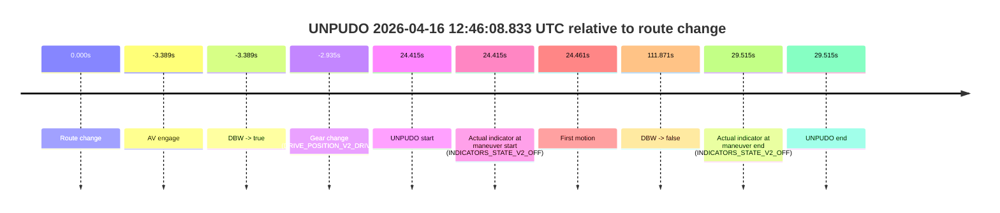
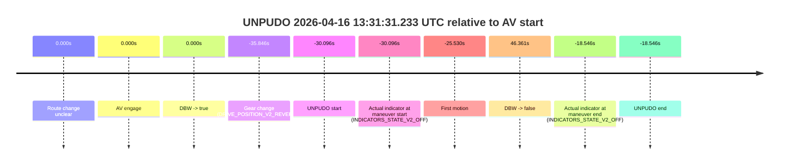
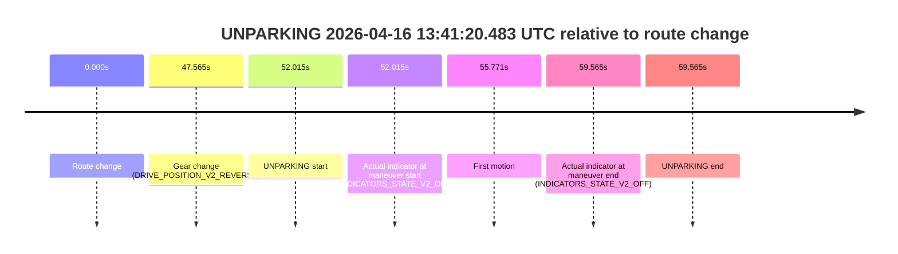

# Run Report: fme20009/2026-04-16--12-35-12--gen2-av-b61aff24-57ea-46f1-b166-ea73856ef968

| Field | Value |
|---|---|
| Run ID | `fme20009/2026-04-16--12-35-12--gen2-av-b61aff24-57ea-46f1-b166-ea73856ef968` |
| Date | `2026-04-16` |
| Model(s) | `armadillo-amethyst-squeaky` |
| Author | `guy.geva` |
| Event count | `9` |

## unpudo 2026-04-16 12:46:08.833 UTC

| Field | Value |
|---|---|
| Model | `armadillo-amethyst-squeaky` |
| Author | `guy.geva` |
| Run ID | `fme20009/2026-04-16--12-35-12--gen2-av-b61aff24-57ea-46f1-b166-ea73856ef968` |
| Date | `2026-04-16` |
| Time (UTC) | `12:46:08.833` |
| Event type | `unpudo` |
| Disengagement type | `none observed` |
| Route change | `found` |
| Console | [run](https://console.sso.wayve.ai/run/fme20009/2026-04-16--12-35-12--gen2-av-b61aff24-57ea-46f1-b166-ea73856ef968?id=&time-unixus=1776343568833315) |
| Foxglove | [segment](https://app.foxglove.dev/wayve-on-prem/p/prj_0dX18KZdVHg1fmmI/view?ds=foxglove-stream&ds.deviceName=fme20009&ds.start=2026-04-16T12%3A45%3A31.029639Z&ds.end=2026-04-16T12%3A47%3A46.289436Z&layoutId=lay_0e7VD4WIKDQGU73Y&time=2026-04-16T12%3A46%3A08.833315Z) |

### Event card: pass

- Pass: AV owns the credited unpudo through the official event window, the gear state is aligned at the anchor, and the vehicle moves without driver accelerator help in AV.

| Event | Time (UTC) | Delta from route change |
|---|---:|---:|
| Route change | 2026-04-16 12:45:44.418 | `0.000s` |
| AV engage | 2026-04-16 12:45:41.029 | `-3.389s` |
| DBW -> true | 2026-04-16 12:45:41.029 | `-3.389s` |
| Gear change (DRIVE_POSITION_V2_DRIVE) | 2026-04-16 12:45:41.483 | `-2.935s` |
| UNPUDO start | 2026-04-16 12:46:08.833 | `24.415s` |
| Actual indicator at maneuver start (INDICATORS_STATE_V2_OFF) | 2026-04-16 12:46:08.833 | `24.415s` |
| First motion | 2026-04-16 12:46:08.879 | `24.461s` |
| DBW -> false | 2026-04-16 12:47:36.289 | `111.871s` |
| Actual indicator at maneuver end (INDICATORS_STATE_V2_OFF) | 2026-04-16 12:46:13.933 | `29.515s` |
| UNPUDO end | 2026-04-16 12:46:13.933 | `29.515s` |

| Metric | Value |
|---|---|
| Outcome | `pass` |
| Effective failure type | `none` |
| Route change status | `found` |
| DBW at event start | `true` |
| DBW at event end | `true` |
| Predicted gear at AV start | `DRIVE_POSITION_V2_DRIVE` |
| Actual gear at AV start | `DRIVE_POSITION_V2_PARK` |
| Predicted gear at event start | `DRIVE_POSITION_V2_DRIVE` |
| Actual gear at event start | `DRIVE_POSITION_V2_DRIVE` |
| Planned indicator direction | `INDICATORS_STATE_V2_RIGHT_ON` |
| Controller indicator direction | `INDICATORS_STATE_V2_RIGHT_ON` |
| Actual indicator direction | `INDICATORS_STATE_V2_OFF` |
| Actual indicator at maneuver end | `INDICATORS_STATE_V2_OFF` |
| Driver accel help in AV | `false` |
| Driver accel help timestamp | `n/a` |
| Max accel pedal pct in AV | `0.0%` |
| Max brake pedal pct in AV | `10.5%` |
| Max speed mps in AV | `3.147` |
| Route -> AV | `-3.389s` |
| AV -> event start | `27.804s` |
| AV -> first motion | `27.850s` |
| AV duration before disengagement | `115.260s` |
| Trajectory waypoint count | `36` |
| Driving-plan step count | `11` |

The scored portion starts from the AV-owned window, not from the pre-AV setup. Route-change search in the stopped pre-event segment was `found`, with the baseline therefore set to route change. At the event anchor the model predicts `DRIVE_POSITION_V2_DRIVE` and the actual gear is `DRIVE_POSITION_V2_DRIVE`. The effective model outcome is `pass` because `the credited maneuver stays AV-owned through the official event end`.

### Resolution

| Field | Value |
|---|---|
| Final outcome | `pass` |
| Do we agree with this label? | `yes` |
| Source disengagement type | `none observed` |
| Resolved effective failure type | `none` |
| Confidence | `high` |

## unpudo 2026-04-16 12:50:38.683 UTC

| Field | Value |
|---|---|
| Model | `armadillo-amethyst-squeaky` |
| Author | `guy.geva` |
| Run ID | `fme20009/2026-04-16--12-35-12--gen2-av-b61aff24-57ea-46f1-b166-ea73856ef968` |
| Date | `2026-04-16` |
| Time (UTC) | `12:50:38.683` |
| Event type | `unpudo` |
| Disengagement type | `none observed` |
| Route change | `found` |
| Console | [run](https://console.sso.wayve.ai/run/fme20009/2026-04-16--12-35-12--gen2-av-b61aff24-57ea-46f1-b166-ea73856ef968?id=&time-unixus=1776343838683319) |
| Foxglove | [segment](https://app.foxglove.dev/wayve-on-prem/p/prj_0dX18KZdVHg1fmmI/view?ds=foxglove-stream&ds.deviceName=fme20009&ds.start=2026-04-16T12%3A50%3A04.668281Z&ds.end=2026-04-16T12%3A54%3A06.568839Z&layoutId=lay_0e7VD4WIKDQGU73Y&time=2026-04-16T12%3A50%3A38.683319Z) |

### Event card: accidental

- Accidental: AV ownership is present for less than `2s`, so this is treated as an accidental brush with the maneuver rather than a meaningful model attempt.

| Event | Time (UTC) | Delta from route change |
|---|---:|---:|
| Route change | 2026-04-16 12:50:14.668 | `0.000s` |
| AV engage | 2026-04-16 12:51:23.989 | `69.321s` |
| DBW -> true | 2026-04-16 12:51:23.989 | `69.321s` |
| Gear change (DRIVE_POSITION_V2_REVERSE) | 2026-04-16 12:50:33.933 | `19.265s` |
| UNPUDO start | 2026-04-16 12:50:38.683 | `24.015s` |
| Actual indicator at maneuver start (INDICATORS_STATE_V2_OFF) | 2026-04-16 12:50:38.683 | `24.015s` |
| First motion | 2026-04-16 12:50:44.639 | `29.971s` |
| DBW -> false | 2026-04-16 12:53:56.568 | `221.901s` |
| Actual indicator at maneuver end (INDICATORS_STATE_V2_LEFT_ON) | 2026-04-16 12:51:19.933 | `65.265s` |
| UNPUDO end | 2026-04-16 12:51:19.933 | `65.265s` |

| Metric | Value |
|---|---|
| Outcome | `accidental` |
| Effective failure type | `none` |
| Route change status | `found` |
| DBW at event start | `false` |
| DBW at event end | `false` |
| Predicted gear at AV start | `DRIVE_POSITION_V2_DRIVE` |
| Actual gear at AV start | `DRIVE_POSITION_V2_DRIVE` |
| Predicted gear at event start | `DRIVE_POSITION_V2_REVERSE` |
| Actual gear at event start | `DRIVE_POSITION_V2_REVERSE` |
| Planned indicator direction | `INDICATORS_STATE_V2_OFF` |
| Controller indicator direction | `INDICATORS_STATE_V2_OFF` |
| Actual indicator direction | `INDICATORS_STATE_V2_OFF` |
| Actual indicator at maneuver end | `INDICATORS_STATE_V2_LEFT_ON` |
| Driver accel help in AV | `false` |
| Driver accel help timestamp | `n/a` |
| Max accel pedal pct in AV | `0.0%` |
| Max brake pedal pct in AV | `0.0%` |
| Max speed mps in AV | `0.000` |
| Route -> AV | `69.321s` |
| AV -> event start | `-45.306s` |
| AV -> first motion | `-39.350s` |
| AV duration before disengagement | `152.579s` |
| Trajectory waypoint count | `37` |
| Driving-plan step count | `11` |

The scored portion starts from the AV-owned window, not from the pre-AV setup. Route-change search in the stopped pre-event segment was `found`, with the baseline therefore set to route change. At the event anchor the model predicts `DRIVE_POSITION_V2_REVERSE` and the actual gear is `DRIVE_POSITION_V2_REVERSE`. The effective model outcome is `accidental` because `the AV-owned portion is shorter than 2s`.

### Resolution

| Field | Value |
|---|---|
| Final outcome | `accidental` |
| Do we agree with this label? | `yes` |
| Source disengagement type | `none observed` |
| Resolved effective failure type | `none` |
| Confidence | `high` |

## unpudo 2026-04-16 12:55:09.633 UTC

| Field | Value |
|---|---|
| Model | `armadillo-amethyst-squeaky` |
| Author | `guy.geva` |
| Run ID | `fme20009/2026-04-16--12-35-12--gen2-av-b61aff24-57ea-46f1-b166-ea73856ef968` |
| Date | `2026-04-16` |
| Time (UTC) | `12:55:09.633` |
| Event type | `unpudo` |
| Disengagement type | `none observed` |
| Route change | `found` |
| Console | [run](https://console.sso.wayve.ai/run/fme20009/2026-04-16--12-35-12--gen2-av-b61aff24-57ea-46f1-b166-ea73856ef968?id=&time-unixus=1776344109633320) |
| Foxglove | [segment](https://app.foxglove.dev/wayve-on-prem/p/prj_0dX18KZdVHg1fmmI/view?ds=foxglove-stream&ds.deviceName=fme20009&ds.start=2026-04-16T12%3A54%3A53.968348Z&ds.end=2026-04-16T12%3A56%3A05.370511Z&layoutId=lay_0e7VD4WIKDQGU73Y&time=2026-04-16T12%3A55%3A09.633320Z) |

### Event card: pass

- Pass: AV owns the credited unpudo through the official event window, the gear state is aligned at the anchor, and the vehicle moves without driver accelerator help in AV.

| Event | Time (UTC) | Delta from route change |
|---|---:|---:|
| Route change | 2026-04-16 12:55:03.968 | `0.000s` |
| AV engage | 2026-04-16 12:55:05.629 | `1.661s` |
| DBW -> true | 2026-04-16 12:55:05.629 | `1.661s` |
| Gear change (DRIVE_POSITION_V2_DRIVE) | 2026-04-16 12:55:06.083 | `2.115s` |
| UNPUDO start | 2026-04-16 12:55:09.633 | `5.665s` |
| Actual indicator at maneuver start (INDICATORS_STATE_V2_OFF) | 2026-04-16 12:55:09.633 | `5.665s` |
| First motion | 2026-04-16 12:55:09.659 | `5.691s` |
| DBW -> false | 2026-04-16 12:55:55.370 | `51.402s` |
| Actual indicator at maneuver end (INDICATORS_STATE_V2_OFF) | 2026-04-16 12:55:13.083 | `9.115s` |
| UNPUDO end | 2026-04-16 12:55:13.083 | `9.115s` |

| Metric | Value |
|---|---|
| Outcome | `pass` |
| Effective failure type | `none` |
| Route change status | `found` |
| DBW at event start | `true` |
| DBW at event end | `true` |
| Predicted gear at AV start | `DRIVE_POSITION_V2_DRIVE` |
| Actual gear at AV start | `DRIVE_POSITION_V2_PARK` |
| Predicted gear at event start | `DRIVE_POSITION_V2_DRIVE` |
| Actual gear at event start | `DRIVE_POSITION_V2_DRIVE` |
| Planned indicator direction | `INDICATORS_STATE_V2_RIGHT_ON` |
| Controller indicator direction | `INDICATORS_STATE_V2_OFF` |
| Actual indicator direction | `INDICATORS_STATE_V2_OFF` |
| Actual indicator at maneuver end | `INDICATORS_STATE_V2_OFF` |
| Driver accel help in AV | `false` |
| Driver accel help timestamp | `n/a` |
| Max accel pedal pct in AV | `0.0%` |
| Max brake pedal pct in AV | `8.0%` |
| Max speed mps in AV | `4.569` |
| Route -> AV | `1.661s` |
| AV -> event start | `4.004s` |
| AV -> first motion | `4.030s` |
| AV duration before disengagement | `49.741s` |
| Trajectory waypoint count | `36` |
| Driving-plan step count | `11` |

The scored portion starts from the AV-owned window, not from the pre-AV setup. Route-change search in the stopped pre-event segment was `found`, with the baseline therefore set to route change. At the event anchor the model predicts `DRIVE_POSITION_V2_DRIVE` and the actual gear is `DRIVE_POSITION_V2_DRIVE`. The effective model outcome is `pass` because `the credited maneuver stays AV-owned through the official event end`.

### Resolution

| Field | Value |
|---|---|
| Final outcome | `pass` |
| Do we agree with this label? | `yes` |
| Source disengagement type | `none observed` |
| Resolved effective failure type | `none` |
| Confidence | `high` |

## unpudo 2026-04-16 12:58:11.833 UTC

| Field | Value |
|---|---|
| Model | `armadillo-amethyst-squeaky` |
| Author | `guy.geva` |
| Run ID | `fme20009/2026-04-16--12-35-12--gen2-av-b61aff24-57ea-46f1-b166-ea73856ef968` |
| Date | `2026-04-16` |
| Time (UTC) | `12:58:11.833` |
| Event type | `unpudo` |
| Disengagement type | `none observed` |
| Route change | `unclear` |
| Console | [run](https://console.sso.wayve.ai/run/fme20009/2026-04-16--12-35-12--gen2-av-b61aff24-57ea-46f1-b166-ea73856ef968?id=&time-unixus=1776344291833324) |
| Foxglove | [segment](https://app.foxglove.dev/wayve-on-prem/p/prj_0dX18KZdVHg1fmmI/view?ds=foxglove-stream&ds.deviceName=fme20009&ds.start=2026-04-16T12%3A57%3A59.483321Z&ds.end=2026-04-16T12%3A59%3A27.629429Z&layoutId=lay_0e7VD4WIKDQGU73Y&time=2026-04-16T12%3A58%3A11.833324Z) |

### Event card: accidental

- Accidental: AV ownership is present for less than `2s`, so this is treated as an accidental brush with the maneuver rather than a meaningful model attempt.

| Event | Time (UTC) | Delta from AV start |
|---|---:|---:|
| Route change unclear | 2026-04-16 12:58:42.189 | `0.000s` |
| AV engage | 2026-04-16 12:58:42.189 | `0.000s` |
| DBW -> true | 2026-04-16 12:58:42.189 | `0.000s` |
| Gear change (DRIVE_POSITION_V2_DRIVE) | 2026-04-16 12:58:09.483 | `-32.706s` |
| UNPUDO start | 2026-04-16 12:58:11.833 | `-30.356s` |
| Actual indicator at maneuver start (INDICATORS_STATE_V2_OFF) | 2026-04-16 12:58:11.833 | `-30.356s` |
| First motion | 2026-04-16 12:58:12.019 | `-30.169s` |
| DBW -> false | 2026-04-16 12:59:17.629 | `35.440s` |
| Actual indicator at maneuver end (INDICATORS_STATE_V2_OFF) | 2026-04-16 12:58:39.533 | `-2.656s` |
| UNPUDO end | 2026-04-16 12:58:39.533 | `-2.656s` |

| Metric | Value |
|---|---|
| Outcome | `accidental` |
| Effective failure type | `none` |
| Route change status | `unclear` |
| DBW at event start | `false` |
| DBW at event end | `false` |
| Predicted gear at AV start | `DRIVE_POSITION_V2_DRIVE` |
| Actual gear at AV start | `DRIVE_POSITION_V2_DRIVE` |
| Predicted gear at event start | `DRIVE_POSITION_V2_DRIVE` |
| Actual gear at event start | `DRIVE_POSITION_V2_DRIVE` |
| Planned indicator direction | `INDICATORS_STATE_V2_OFF` |
| Controller indicator direction | `INDICATORS_STATE_V2_OFF` |
| Actual indicator direction | `INDICATORS_STATE_V2_OFF` |
| Actual indicator at maneuver end | `INDICATORS_STATE_V2_OFF` |
| Driver accel help in AV | `false` |
| Driver accel help timestamp | `n/a` |
| Max accel pedal pct in AV | `0.0%` |
| Max brake pedal pct in AV | `0.0%` |
| Max speed mps in AV | `0.000` |
| Route -> AV | `n/a` |
| AV -> event start | `-30.356s` |
| AV -> first motion | `-30.169s` |
| AV duration before disengagement | `35.440s` |
| Trajectory waypoint count | `36` |
| Driving-plan step count | `11` |

The scored portion starts from the AV-owned window, not from the pre-AV setup. Route-change search in the stopped pre-event segment was `unclear`, with the baseline therefore set to AV start. At the event anchor the model predicts `DRIVE_POSITION_V2_DRIVE` and the actual gear is `DRIVE_POSITION_V2_DRIVE`. The effective model outcome is `accidental` because `the AV-owned portion is shorter than 2s`.

### Resolution

| Field | Value |
|---|---|
| Final outcome | `accidental` |
| Do we agree with this label? | `yes` |
| Source disengagement type | `none observed` |
| Resolved effective failure type | `none` |
| Confidence | `medium` |

## unpudo 2026-04-16 13:00:25.033 UTC

| Field | Value |
|---|---|
| Model | `armadillo-amethyst-squeaky` |
| Author | `guy.geva` |
| Run ID | `fme20009/2026-04-16--12-35-12--gen2-av-b61aff24-57ea-46f1-b166-ea73856ef968` |
| Date | `2026-04-16` |
| Time (UTC) | `13:00:25.033` |
| Event type | `unpudo` |
| Disengagement type | `none observed` |
| Route change | `found` |
| Console | [run](https://console.sso.wayve.ai/run/fme20009/2026-04-16--12-35-12--gen2-av-b61aff24-57ea-46f1-b166-ea73856ef968?id=&time-unixus=1776344425033322) |
| Foxglove | [segment](https://app.foxglove.dev/wayve-on-prem/p/prj_0dX18KZdVHg1fmmI/view?ds=foxglove-stream&ds.deviceName=fme20009&ds.start=2026-04-16T12%3A58%3A23.568251Z&ds.end=2026-04-16T13%3A03%3A13.010638Z&layoutId=lay_0e7VD4WIKDQGU73Y&time=2026-04-16T13%3A00%3A25.033322Z) |

### Event card: accidental

- Accidental: AV ownership is present for less than `2s`, so this is treated as an accidental brush with the maneuver rather than a meaningful model attempt.

| Event | Time (UTC) | Delta from route change |
|---|---:|---:|
| Route change | 2026-04-16 12:58:33.568 | `0.000s` |
| AV engage | 2026-04-16 13:00:34.490 | `120.922s` |
| DBW -> true | 2026-04-16 13:00:34.490 | `120.922s` |
| Gear change (DRIVE_POSITION_V2_DRIVE) | 2026-04-16 13:00:20.383 | `106.815s` |
| UNPUDO start | 2026-04-16 13:00:25.033 | `111.465s` |
| Actual indicator at maneuver start (INDICATORS_STATE_V2_RIGHT_ON) | 2026-04-16 13:00:25.033 | `111.465s` |
| First motion | 2026-04-16 13:00:25.159 | `111.591s` |
| DBW -> false | 2026-04-16 13:03:03.010 | `269.442s` |
| Actual indicator at maneuver end (INDICATORS_STATE_V2_OFF) | 2026-04-16 13:00:31.683 | `118.115s` |
| UNPUDO end | 2026-04-16 13:00:31.683 | `118.115s` |

| Metric | Value |
|---|---|
| Outcome | `accidental` |
| Effective failure type | `none` |
| Route change status | `found` |
| DBW at event start | `false` |
| DBW at event end | `false` |
| Predicted gear at AV start | `DRIVE_POSITION_V2_DRIVE` |
| Actual gear at AV start | `DRIVE_POSITION_V2_DRIVE` |
| Predicted gear at event start | `DRIVE_POSITION_V2_DRIVE` |
| Actual gear at event start | `DRIVE_POSITION_V2_DRIVE` |
| Planned indicator direction | `INDICATORS_STATE_V2_LEFT_ON` |
| Controller indicator direction | `INDICATORS_STATE_V2_LEFT_ON` |
| Actual indicator direction | `INDICATORS_STATE_V2_RIGHT_ON` |
| Actual indicator at maneuver end | `INDICATORS_STATE_V2_OFF` |
| Driver accel help in AV | `false` |
| Driver accel help timestamp | `n/a` |
| Max accel pedal pct in AV | `0.0%` |
| Max brake pedal pct in AV | `0.0%` |
| Max speed mps in AV | `0.000` |
| Route -> AV | `120.922s` |
| AV -> event start | `-9.457s` |
| AV -> first motion | `-9.331s` |
| AV duration before disengagement | `148.520s` |
| Trajectory waypoint count | `36` |
| Driving-plan step count | `11` |

The scored portion starts from the AV-owned window, not from the pre-AV setup. Route-change search in the stopped pre-event segment was `found`, with the baseline therefore set to route change. At the event anchor the model predicts `DRIVE_POSITION_V2_DRIVE` and the actual gear is `DRIVE_POSITION_V2_DRIVE`. The effective model outcome is `accidental` because `the AV-owned portion is shorter than 2s`.

### Resolution

| Field | Value |
|---|---|
| Final outcome | `accidental` |
| Do we agree with this label? | `yes` |
| Source disengagement type | `none observed` |
| Resolved effective failure type | `none` |
| Confidence | `high` |

## unpudo 2026-04-16 13:22:06.583 UTC

| Field | Value |
|---|---|
| Model | `armadillo-amethyst-squeaky` |
| Author | `guy.geva` |
| Run ID | `fme20009/2026-04-16--12-35-12--gen2-av-b61aff24-57ea-46f1-b166-ea73856ef968` |
| Date | `2026-04-16` |
| Time (UTC) | `13:22:06.583` |
| Event type | `unpudo` |
| Disengagement type | `failed_to_pudo` |
| Route change | `unclear` |
| Console | [run](https://console.sso.wayve.ai/run/fme20009/2026-04-16--12-35-12--gen2-av-b61aff24-57ea-46f1-b166-ea73856ef968?id=&time-unixus=1776345726583321) |
| Foxglove | [segment](https://app.foxglove.dev/wayve-on-prem/p/prj_0dX18KZdVHg1fmmI/view?ds=foxglove-stream&ds.deviceName=fme20009&ds.start=2026-04-16T13%3A21%3A11.583303Z&ds.end=2026-04-16T13%3A22%3A31.533320Z&layoutId=lay_0e7VD4WIKDQGU73Y&time=2026-04-16T13%3A22%3A06.583321Z) |

### Event card: fail

- Fail: AV owns part of the segment, but the event still resolves as a model-performance failure under the AV-only scoring rule.

| Event | Time (UTC) | Delta from AV start |
|---|---:|---:|
| Route change unclear | 2026-04-16 13:22:05.309 | `0.000s` |
| AV engage | 2026-04-16 13:22:05.309 | `0.000s` |
| DBW -> true | 2026-04-16 13:22:05.309 | `0.000s` |
| Gear change (DRIVE_POSITION_V2_DRIVE) | 2026-04-16 13:21:21.583 | `-43.727s` |
| UNPUDO start | 2026-04-16 13:22:06.583 | `1.273s` |
| Actual indicator at maneuver start (INDICATORS_STATE_V2_OFF) | 2026-04-16 13:22:06.583 | `1.273s` |
| First motion | 2026-04-16 13:22:06.639 | `1.330s` |
| DBW -> false | 2026-04-16 13:22:15.849 | `10.540s` |
| Actual indicator at maneuver end (INDICATORS_STATE_V2_OFF) | 2026-04-16 13:22:21.533 | `16.223s` |
| UNPUDO end | 2026-04-16 13:22:21.533 | `16.223s` |

| Metric | Value |
|---|---|
| Outcome | `fail` |
| Effective failure type | `failed_to_pudo` |
| Route change status | `unclear` |
| DBW at event start | `true` |
| DBW at event end | `false` |
| Predicted gear at AV start | `DRIVE_POSITION_V2_DRIVE` |
| Actual gear at AV start | `DRIVE_POSITION_V2_DRIVE` |
| Predicted gear at event start | `DRIVE_POSITION_V2_DRIVE` |
| Actual gear at event start | `DRIVE_POSITION_V2_DRIVE` |
| Planned indicator direction | `INDICATORS_STATE_V2_OFF` |
| Controller indicator direction | `INDICATORS_STATE_V2_OFF` |
| Actual indicator direction | `INDICATORS_STATE_V2_OFF` |
| Actual indicator at maneuver end | `INDICATORS_STATE_V2_OFF` |
| Driver accel help in AV | `false` |
| Driver accel help timestamp | `n/a` |
| Max accel pedal pct in AV | `0.0%` |
| Max brake pedal pct in AV | `8.0%` |
| Max speed mps in AV | `2.039` |
| Route -> AV | `n/a` |
| AV -> event start | `1.273s` |
| AV -> first motion | `1.330s` |
| AV duration before disengagement | `10.540s` |
| Trajectory waypoint count | `37` |
| Driving-plan step count | `11` |

The scored portion starts from the AV-owned window, not from the pre-AV setup. Route-change search in the stopped pre-event segment was `unclear`, with the baseline therefore set to AV start. At the event anchor the model predicts `DRIVE_POSITION_V2_DRIVE` and the actual gear is `DRIVE_POSITION_V2_DRIVE`. The effective model outcome is `fail` because `failed_to_pudo`.

### Resolution

| Field | Value |
|---|---|
| Final outcome | `fail` |
| Do we agree with this label? | `yes` |
| Source disengagement type | `failed_to_pudo` |
| Resolved effective failure type | `failed_to_pudo` |
| Confidence | `medium` |

## unpudo 2026-04-16 13:31:31.233 UTC

| Field | Value |
|---|---|
| Model | `armadillo-amethyst-squeaky` |
| Author | `guy.geva` |
| Run ID | `fme20009/2026-04-16--12-35-12--gen2-av-b61aff24-57ea-46f1-b166-ea73856ef968` |
| Date | `2026-04-16` |
| Time (UTC) | `13:31:31.233` |
| Event type | `unpudo` |
| Disengagement type | `none observed` |
| Route change | `unclear` |
| Console | [run](https://console.sso.wayve.ai/run/fme20009/2026-04-16--12-35-12--gen2-av-b61aff24-57ea-46f1-b166-ea73856ef968?id=&time-unixus=1776346291233313) |
| Foxglove | [segment](https://app.foxglove.dev/wayve-on-prem/p/prj_0dX18KZdVHg1fmmI/view?ds=foxglove-stream&ds.deviceName=fme20009&ds.start=2026-04-16T13%3A31%3A15.483314Z&ds.end=2026-04-16T13%3A32%3A57.690779Z&layoutId=lay_0e7VD4WIKDQGU73Y&time=2026-04-16T13%3A31%3A31.233313Z) |

### Event card: accidental

- Accidental: AV ownership is present for less than `2s`, so this is treated as an accidental brush with the maneuver rather than a meaningful model attempt.

| Event | Time (UTC) | Delta from AV start |
|---|---:|---:|
| Route change unclear | 2026-04-16 13:32:01.329 | `0.000s` |
| AV engage | 2026-04-16 13:32:01.329 | `0.000s` |
| DBW -> true | 2026-04-16 13:32:01.329 | `0.000s` |
| Gear change (DRIVE_POSITION_V2_REVERSE) | 2026-04-16 13:31:25.483 | `-35.846s` |
| UNPUDO start | 2026-04-16 13:31:31.233 | `-30.096s` |
| Actual indicator at maneuver start (INDICATORS_STATE_V2_OFF) | 2026-04-16 13:31:31.233 | `-30.096s` |
| First motion | 2026-04-16 13:31:35.799 | `-25.530s` |
| DBW -> false | 2026-04-16 13:32:47.690 | `46.361s` |
| Actual indicator at maneuver end (INDICATORS_STATE_V2_OFF) | 2026-04-16 13:31:42.783 | `-18.546s` |
| UNPUDO end | 2026-04-16 13:31:42.783 | `-18.546s` |

| Metric | Value |
|---|---|
| Outcome | `accidental` |
| Effective failure type | `none` |
| Route change status | `unclear` |
| DBW at event start | `false` |
| DBW at event end | `false` |
| Predicted gear at AV start | `DRIVE_POSITION_V2_DRIVE` |
| Actual gear at AV start | `DRIVE_POSITION_V2_PARK` |
| Predicted gear at event start | `DRIVE_POSITION_V2_REVERSE` |
| Actual gear at event start | `DRIVE_POSITION_V2_REVERSE` |
| Planned indicator direction | `INDICATORS_STATE_V2_OFF` |
| Controller indicator direction | `INDICATORS_STATE_V2_OFF` |
| Actual indicator direction | `INDICATORS_STATE_V2_OFF` |
| Actual indicator at maneuver end | `INDICATORS_STATE_V2_OFF` |
| Driver accel help in AV | `false` |
| Driver accel help timestamp | `n/a` |
| Max accel pedal pct in AV | `0.0%` |
| Max brake pedal pct in AV | `0.0%` |
| Max speed mps in AV | `0.000` |
| Route -> AV | `n/a` |
| AV -> event start | `-30.096s` |
| AV -> first motion | `-25.530s` |
| AV duration before disengagement | `46.361s` |
| Trajectory waypoint count | `36` |
| Driving-plan step count | `11` |

The scored portion starts from the AV-owned window, not from the pre-AV setup. Route-change search in the stopped pre-event segment was `unclear`, with the baseline therefore set to AV start. At the event anchor the model predicts `DRIVE_POSITION_V2_REVERSE` and the actual gear is `DRIVE_POSITION_V2_REVERSE`. The effective model outcome is `accidental` because `the AV-owned portion is shorter than 2s`.

### Resolution

| Field | Value |
|---|---|
| Final outcome | `accidental` |
| Do we agree with this label? | `yes` |
| Source disengagement type | `none observed` |
| Resolved effective failure type | `none` |
| Confidence | `medium` |

## unpudo 2026-04-16 13:32:13.783 UTC

| Field | Value |
|---|---|
| Model | `armadillo-amethyst-squeaky` |
| Author | `guy.geva` |
| Run ID | `fme20009/2026-04-16--12-35-12--gen2-av-b61aff24-57ea-46f1-b166-ea73856ef968` |
| Date | `2026-04-16` |
| Time (UTC) | `13:32:13.783` |
| Event type | `unpudo` |
| Disengagement type | `none observed` |
| Route change | `found` |
| Console | [run](https://console.sso.wayve.ai/run/fme20009/2026-04-16--12-35-12--gen2-av-b61aff24-57ea-46f1-b166-ea73856ef968?id=&time-unixus=1776346333783324) |
| Foxglove | [segment](https://app.foxglove.dev/wayve-on-prem/p/prj_0dX18KZdVHg1fmmI/view?ds=foxglove-stream&ds.deviceName=fme20009&ds.start=2026-04-16T13%3A31%3A51.329612Z&ds.end=2026-04-16T13%3A32%3A57.690779Z&layoutId=lay_0e7VD4WIKDQGU73Y&time=2026-04-16T13%3A32%3A13.783324Z) |

### Event card: pass

- Pass: AV owns the credited unpudo through the official event window, the gear state is aligned at the anchor, and the vehicle moves without driver accelerator help in AV.

| Event | Time (UTC) | Delta from route change |
|---|---:|---:|
| Route change | 2026-04-16 13:32:04.768 | `0.000s` |
| AV engage | 2026-04-16 13:32:01.329 | `-3.439s` |
| DBW -> true | 2026-04-16 13:32:01.329 | `-3.439s` |
| Gear change (DRIVE_POSITION_V2_DRIVE) | 2026-04-16 13:32:01.783 | `-2.985s` |
| UNPUDO start | 2026-04-16 13:32:13.783 | `9.015s` |
| Actual indicator at maneuver start (INDICATORS_STATE_V2_OFF) | 2026-04-16 13:32:13.783 | `9.015s` |
| First motion | 2026-04-16 13:32:13.859 | `9.091s` |
| DBW -> false | 2026-04-16 13:32:47.690 | `42.923s` |
| Actual indicator at maneuver end (INDICATORS_STATE_V2_OFF) | 2026-04-16 13:32:18.383 | `13.615s` |
| UNPUDO end | 2026-04-16 13:32:18.383 | `13.615s` |

| Metric | Value |
|---|---|
| Outcome | `pass` |
| Effective failure type | `none` |
| Route change status | `found` |
| DBW at event start | `true` |
| DBW at event end | `true` |
| Predicted gear at AV start | `DRIVE_POSITION_V2_DRIVE` |
| Actual gear at AV start | `DRIVE_POSITION_V2_PARK` |
| Predicted gear at event start | `DRIVE_POSITION_V2_DRIVE` |
| Actual gear at event start | `DRIVE_POSITION_V2_DRIVE` |
| Planned indicator direction | `INDICATORS_STATE_V2_RIGHT_ON` |
| Controller indicator direction | `INDICATORS_STATE_V2_RIGHT_ON` |
| Actual indicator direction | `INDICATORS_STATE_V2_OFF` |
| Actual indicator at maneuver end | `INDICATORS_STATE_V2_OFF` |
| Driver accel help in AV | `false` |
| Driver accel help timestamp | `n/a` |
| Max accel pedal pct in AV | `0.0%` |
| Max brake pedal pct in AV | `8.0%` |
| Max speed mps in AV | `4.044` |
| Route -> AV | `-3.439s` |
| AV -> event start | `12.454s` |
| AV -> first motion | `12.530s` |
| AV duration before disengagement | `46.361s` |
| Trajectory waypoint count | `37` |
| Driving-plan step count | `11` |

The scored portion starts from the AV-owned window, not from the pre-AV setup. Route-change search in the stopped pre-event segment was `found`, with the baseline therefore set to route change. At the event anchor the model predicts `DRIVE_POSITION_V2_DRIVE` and the actual gear is `DRIVE_POSITION_V2_DRIVE`. The effective model outcome is `pass` because `the credited maneuver stays AV-owned through the official event end`.

### Resolution

| Field | Value |
|---|---|
| Final outcome | `pass` |
| Do we agree with this label? | `yes` |
| Source disengagement type | `none observed` |
| Resolved effective failure type | `none` |
| Confidence | `high` |

## unparking 2026-04-16 13:41:20.483 UTC

| Field | Value |
|---|---|
| Model | `armadillo-amethyst-squeaky` |
| Author | `guy.geva` |
| Run ID | `fme20009/2026-04-16--12-35-12--gen2-av-b61aff24-57ea-46f1-b166-ea73856ef968` |
| Date | `2026-04-16` |
| Time (UTC) | `13:41:20.483` |
| Event type | `unparking` |
| Disengagement type | `none observed` |
| Route change | `found` |
| Console | [run](https://console.sso.wayve.ai/run/fme20009/2026-04-16--12-35-12--gen2-av-b61aff24-57ea-46f1-b166-ea73856ef968?id=&time-unixus=1776346880483308) |
| Foxglove | [segment](https://app.foxglove.dev/wayve-on-prem/p/prj_0dX18KZdVHg1fmmI/view?ds=foxglove-stream&ds.deviceName=fme20009&ds.start=2026-04-16T13%3A40%3A18.468333Z&ds.end=2026-04-16T13%3A41%3A38.033324Z&layoutId=lay_0e7VD4WIKDQGU73Y&time=2026-04-16T13%3A41%3A20.483308Z) |

### Event card: non-av

- Non-AV: the detected unparking starts outside AV ownership, so it is kept for coverage but excluded from model success / failure scoring.

| Event | Time (UTC) | Delta from route change |
|---|---:|---:|
| Route change | 2026-04-16 13:40:28.468 | `0.000s` |
| Gear change (DRIVE_POSITION_V2_REVERSE) | 2026-04-16 13:41:16.033 | `47.565s` |
| UNPARKING start | 2026-04-16 13:41:20.483 | `52.015s` |
| Actual indicator at maneuver start (INDICATORS_STATE_V2_OFF) | 2026-04-16 13:41:20.483 | `52.015s` |
| First motion | 2026-04-16 13:41:24.239 | `55.771s` |
| Actual indicator at maneuver end (INDICATORS_STATE_V2_OFF) | 2026-04-16 13:41:28.033 | `59.565s` |
| UNPARKING end | 2026-04-16 13:41:28.033 | `59.565s` |

| Metric | Value |
|---|---|
| Outcome | `non-av` |
| Effective failure type | `none` |
| Route change status | `found` |
| DBW at event start | `false` |
| DBW at event end | `false` |
| Predicted gear at AV start | `n/a` |
| Actual gear at AV start | `n/a` |
| Predicted gear at event start | `DRIVE_POSITION_V2_REVERSE` |
| Actual gear at event start | `DRIVE_POSITION_V2_REVERSE` |
| Planned indicator direction | `INDICATORS_STATE_V2_OFF` |
| Controller indicator direction | `INDICATORS_STATE_V2_OFF` |
| Actual indicator direction | `INDICATORS_STATE_V2_OFF` |
| Actual indicator at maneuver end | `INDICATORS_STATE_V2_OFF` |
| Driver accel help in AV | `false` |
| Driver accel help timestamp | `n/a` |
| Max accel pedal pct in AV | `0.0%` |
| Max brake pedal pct in AV | `0.0%` |
| Max speed mps in AV | `0.000` |
| Route -> AV | `n/a` |
| AV -> event start | `n/a` |
| AV -> first motion | `n/a` |
| AV duration before disengagement | `n/a` |
| Trajectory waypoint count | `37` |
| Driving-plan step count | `11` |

The scored portion starts from the AV-owned window, not from the pre-AV setup. Route-change search in the stopped pre-event segment was `found`, with the baseline therefore set to route change. At the event anchor the model predicts `DRIVE_POSITION_V2_REVERSE` and the actual gear is `DRIVE_POSITION_V2_REVERSE`. The effective model outcome is `non-av` because `the event does not begin in AV ownership`.

### Resolution

| Field | Value |
|---|---|
| Final outcome | `non-av` |
| Do we agree with this label? | `yes` |
| Source disengagement type | `none observed` |
| Resolved effective failure type | `none` |
| Confidence | `high` |
