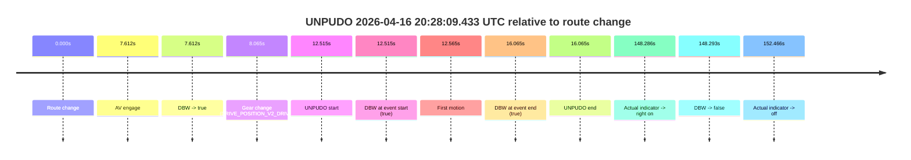
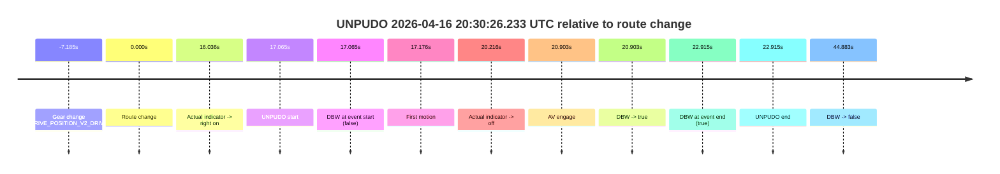

# Run Report: fme20009/2026-04-16--20-09-19--gen2-av-782eb400-dfda-4ff2-8eb6-747663e66bf4

| Field | Value |
|---|---|
| Run ID | `fme20009/2026-04-16--20-09-19--gen2-av-782eb400-dfda-4ff2-8eb6-747663e66bf4` |
| Date | `2026-04-16` |
| Model(s) | `armadillo-amethyst-squeaky` |
| Author | `guy.geva` |
| Event count | `2` |

## unpudo 2026-04-16 20:28:09.433 UTC

| Field | Value |
|---|---|
| Model | `armadillo-amethyst-squeaky` |
| Author | `guy.geva` |
| Run ID | `fme20009/2026-04-16--20-09-19--gen2-av-782eb400-dfda-4ff2-8eb6-747663e66bf4` |
| Date | `2026-04-16` |
| Time (UTC) | `20:28:09.433` |
| Event type | `unpudo` |
| Disengagement type | `none observed` |
| Route change | `found` |
| Console | [run](https://console.sso.wayve.ai/run/fme20009/2026-04-16--20-09-19--gen2-av-782eb400-dfda-4ff2-8eb6-747663e66bf4?id=&time-unixus=1776371289433304) |
| Foxglove | [segment](https://app.foxglove.dev/wayve-on-prem/p/prj_0dX18KZdVHg1fmmI/view?ds=foxglove-stream&ds.deviceName=fme20009&ds.start=2026-04-16T20%3A27%3A46.918486Z&ds.end=2026-04-16T20%3A30%3A35.211325Z&layoutId=lay_0e7VD4WIKDQGU73Y&time=2026-04-16T20%3A28%3A09.433304Z) |

### Event card: pass

- Pass: AV owns the credited unpudo through the official event window, the gear state is aligned at the anchor, and the vehicle moves without driver accelerator help in AV.

| Event | Time (UTC) | Delta from route change |
|---|---:|---:|
| Route change | 2026-04-16 20:27:56.918 | `0.000s` |
| AV engage | 2026-04-16 20:28:04.530 | `7.612s` |
| DBW -> true | 2026-04-16 20:28:04.530 | `7.612s` |
| Gear change (DRIVE_POSITION_V2_DRIVE) | 2026-04-16 20:28:04.983 | `8.065s` |
| UNPUDO start | 2026-04-16 20:28:09.433 | `12.515s` |
| DBW at event start (true) | 2026-04-16 20:28:09.433 | `12.515s` |
| First motion | 2026-04-16 20:28:09.483 | `12.565s` |
| DBW at event end (true) | 2026-04-16 20:28:12.983 | `16.065s` |
| UNPUDO end | 2026-04-16 20:28:12.983 | `16.065s` |
| Actual indicator -> right on | 2026-04-16 20:30:25.204 | `148.286s` |
| DBW -> false | 2026-04-16 20:30:25.211 | `148.293s` |
| Actual indicator -> off | 2026-04-16 20:30:29.384 | `152.466s` |

| Metric | Value |
|---|---|
| Outcome | `pass` |
| Effective failure type | `none` |
| Route change status | `found` |
| DBW at event start | `true` |
| DBW at event end | `true` |
| Predicted gear at AV start | `DRIVE_POSITION_V2_DRIVE` |
| Actual gear at AV start | `DRIVE_POSITION_V2_PARK` |
| Predicted gear at event start | `DRIVE_POSITION_V2_DRIVE` |
| Actual gear at event start | `DRIVE_POSITION_V2_DRIVE` |
| Planned indicator direction | `INDICATORS_STATE_V2_RIGHT_ON` |
| Controller indicator direction | `INDICATORS_STATE_V2_RIGHT_ON` |
| Actual indicator direction | `INDICATORS_STATE_V2_OFF` |
| Actual indicator at maneuver end | `INDICATORS_STATE_V2_OFF` |
| Driver accel help in AV | `false` |
| Driver accel help timestamp | `n/a` |
| Max accel pedal pct in AV | `0.0%` |
| Max brake pedal pct in AV | `0.0%` |
| Max speed mps in AV | `5.086` |
| Success timing baseline | `route change` |
| Route -> AV | `7.612s` |
| AV -> event start | `4.903s` |
| AV -> first motion | `4.954s` |
| Success baseline -> event start | `12.515s` |
| Success baseline -> first motion | `12.565s` |
| AV duration before disengagement | `140.681s` |
| Trajectory waypoint count | `36` |
| Driving-plan step count | `11` |

The scored portion starts from the AV-owned window, not from the pre-AV setup. Route-change search in the stopped pre-event segment was `found`, with the baseline therefore set to route change. At the event anchor the model predicts `DRIVE_POSITION_V2_DRIVE` and the actual gear is `DRIVE_POSITION_V2_DRIVE`. The effective model outcome is `pass` because `the credited maneuver stays AV-owned through the official event end`.

### Resolution

| Field | Value |
|---|---|
| Final outcome | `pass` |
| Do we agree with this label? | `yes` |
| Source disengagement type | `none observed` |
| Resolved effective failure type | `none` |
| Confidence | `high` |

## unpudo 2026-04-16 20:30:26.233 UTC

| Field | Value |
|---|---|
| Model | `armadillo-amethyst-squeaky` |
| Author | `guy.geva` |
| Run ID | `fme20009/2026-04-16--20-09-19--gen2-av-782eb400-dfda-4ff2-8eb6-747663e66bf4` |
| Date | `2026-04-16` |
| Time (UTC) | `20:30:26.233` |
| Event type | `unpudo` |
| Disengagement type | `failed_to_unpudo` |
| Route change | `found` |
| Console | [run](https://console.sso.wayve.ai/run/fme20009/2026-04-16--20-09-19--gen2-av-782eb400-dfda-4ff2-8eb6-747663e66bf4?id=&time-unixus=1776371426233302) |
| Foxglove | [segment](https://app.foxglove.dev/wayve-on-prem/p/prj_0dX18KZdVHg1fmmI/view?ds=foxglove-stream&ds.deviceName=fme20009&ds.start=2026-04-16T20%3A29%3A51.983328Z&ds.end=2026-04-16T20%3A31%3A04.051157Z&layoutId=lay_0e7VD4WIKDQGU73Y&time=2026-04-16T20%3A30%3A26.233302Z) |

### Event card: fail

- Fail: AV owns part of the segment, but the event still resolves as a model-performance failure under the AV-only scoring rule.

| Event | Time (UTC) | Delta from route change |
|---|---:|---:|
| Gear change (DRIVE_POSITION_V2_DRIVE) | 2026-04-16 20:30:01.983 | `-7.185s` |
| Route change | 2026-04-16 20:30:09.168 | `0.000s` |
| Actual indicator -> right on | 2026-04-16 20:30:25.204 | `16.036s` |
| UNPUDO start | 2026-04-16 20:30:26.233 | `17.065s` |
| DBW at event start (false) | 2026-04-16 20:30:26.233 | `17.065s` |
| First motion | 2026-04-16 20:30:26.344 | `17.176s` |
| Actual indicator -> off | 2026-04-16 20:30:29.384 | `20.216s` |
| AV engage | 2026-04-16 20:30:30.071 | `20.903s` |
| DBW -> true | 2026-04-16 20:30:30.071 | `20.903s` |
| DBW at event end (true) | 2026-04-16 20:30:32.083 | `22.915s` |
| UNPUDO end | 2026-04-16 20:30:32.083 | `22.915s` |
| DBW -> false | 2026-04-16 20:30:54.051 | `44.883s` |

| Metric | Value |
|---|---|
| Outcome | `fail` |
| Effective failure type | `failed_to_unpudo` |
| Route change status | `found` |
| DBW at event start | `false` |
| DBW at event end | `true` |
| Predicted gear at AV start | `DRIVE_POSITION_V2_DRIVE` |
| Actual gear at AV start | `DRIVE_POSITION_V2_DRIVE` |
| Predicted gear at event start | `DRIVE_POSITION_V2_DRIVE` |
| Actual gear at event start | `DRIVE_POSITION_V2_DRIVE` |
| Planned indicator direction | `INDICATORS_STATE_V2_RIGHT_ON` |
| Controller indicator direction | `INDICATORS_STATE_V2_RIGHT_ON` |
| Actual indicator direction | `INDICATORS_STATE_V2_RIGHT_ON` |
| Actual indicator at maneuver end | `INDICATORS_STATE_V2_OFF` |
| Driver accel help in AV | `false` |
| Driver accel help timestamp | `n/a` |
| Max accel pedal pct in AV | `0.0%` |
| Max brake pedal pct in AV | `0.0%` |
| Max speed mps in AV | `2.500` |
| Success timing baseline | `route change` |
| Route -> AV | `20.903s` |
| AV -> event start | `-3.838s` |
| AV -> first motion | `-3.727s` |
| Success baseline -> event start | `17.065s` |
| Success baseline -> first motion | `17.176s` |
| AV duration before disengagement | `23.980s` |
| Trajectory waypoint count | `36` |
| Driving-plan step count | `11` |

The scored portion starts from the AV-owned window, not from the pre-AV setup. Route-change search in the stopped pre-event segment was `found`, with the baseline therefore set to route change. At the event anchor the model predicts `DRIVE_POSITION_V2_DRIVE` and the actual gear is `DRIVE_POSITION_V2_DRIVE`. The effective model outcome is `fail` because `failed_to_unpudo`.

### Resolution

| Field | Value |
|---|---|
| Final outcome | `fail` |
| Do we agree with this label? | `yes` |
| Source disengagement type | `failed_to_unpudo` |
| Resolved effective failure type | `failed_to_unpudo` |
| Confidence | `high` |
