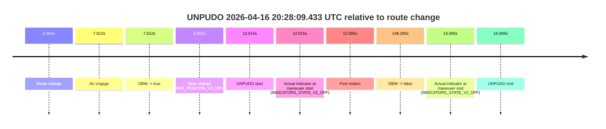
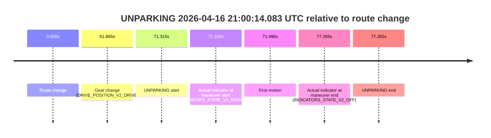

# Run Report: fme20009/2026-04-16--20-09-19--gen2-av-782eb400-dfda-4ff2-8eb6-747663e66bf4

| Field | Value |
|---|---|
| Run ID | `fme20009/2026-04-16--20-09-19--gen2-av-782eb400-dfda-4ff2-8eb6-747663e66bf4` |
| Date | `2026-04-16` |
| Model(s) | `armadillo-amethyst-squeaky` |
| Author | `guy.geva` |
| Event count | `7` |

## unpudo 2026-04-16 20:28:09.433 UTC

| Field | Value |
|---|---|
| Model | `armadillo-amethyst-squeaky` |
| Author | `guy.geva` |
| Run ID | `fme20009/2026-04-16--20-09-19--gen2-av-782eb400-dfda-4ff2-8eb6-747663e66bf4` |
| Date | `2026-04-16` |
| Time (UTC) | `20:28:09.433` |
| Event type | `unpudo` |
| Disengagement type | `none observed` |
| Route change | `found` |
| Console | [run](https://console.sso.wayve.ai/run/fme20009/2026-04-16--20-09-19--gen2-av-782eb400-dfda-4ff2-8eb6-747663e66bf4?id=&time-unixus=1776371289433304) |
| Foxglove | [segment](https://app.foxglove.dev/wayve-on-prem/p/prj_0dX18KZdVHg1fmmI/view?ds=foxglove-stream&ds.deviceName=fme20009&ds.start=2026-04-16T20%3A27%3A46.918486Z&ds.end=2026-04-16T20%3A30%3A35.211325Z&layoutId=lay_0e7VD4WIKDQGU73Y&time=2026-04-16T20%3A28%3A09.433304Z) |

### Event card: pass

- Pass: AV owns the credited unpudo through the official event window, the gear state is aligned at the anchor, and the vehicle moves without driver accelerator help in AV.

| Event | Time (UTC) | Delta from route change |
|---|---:|---:|
| Route change | 2026-04-16 20:27:56.918 | `0.000s` |
| AV engage | 2026-04-16 20:28:04.530 | `7.612s` |
| DBW -> true | 2026-04-16 20:28:04.530 | `7.612s` |
| Gear change (DRIVE_POSITION_V2_DRIVE) | 2026-04-16 20:28:04.983 | `8.065s` |
| UNPUDO start | 2026-04-16 20:28:09.433 | `12.515s` |
| Actual indicator at maneuver start (INDICATORS_STATE_V2_OFF) | 2026-04-16 20:28:09.433 | `12.515s` |
| First motion | 2026-04-16 20:28:09.483 | `12.565s` |
| DBW -> false | 2026-04-16 20:30:25.211 | `148.293s` |
| Actual indicator at maneuver end (INDICATORS_STATE_V2_OFF) | 2026-04-16 20:28:12.983 | `16.065s` |
| UNPUDO end | 2026-04-16 20:28:12.983 | `16.065s` |

| Metric | Value |
|---|---|
| Outcome | `pass` |
| Effective failure type | `none` |
| Route change status | `found` |
| DBW at event start | `true` |
| DBW at event end | `true` |
| Predicted gear at AV start | `DRIVE_POSITION_V2_DRIVE` |
| Actual gear at AV start | `DRIVE_POSITION_V2_PARK` |
| Predicted gear at event start | `DRIVE_POSITION_V2_DRIVE` |
| Actual gear at event start | `DRIVE_POSITION_V2_DRIVE` |
| Planned indicator direction | `INDICATORS_STATE_V2_RIGHT_ON` |
| Controller indicator direction | `INDICATORS_STATE_V2_RIGHT_ON` |
| Actual indicator direction | `INDICATORS_STATE_V2_OFF` |
| Actual indicator at maneuver end | `INDICATORS_STATE_V2_OFF` |
| Driver accel help in AV | `false` |
| Driver accel help timestamp | `n/a` |
| Max accel pedal pct in AV | `0.0%` |
| Max brake pedal pct in AV | `8.0%` |
| Max speed mps in AV | `5.086` |
| Route -> AV | `7.612s` |
| AV -> event start | `4.903s` |
| AV -> first motion | `4.954s` |
| AV duration before disengagement | `140.681s` |
| Trajectory waypoint count | `36` |
| Driving-plan step count | `11` |

The scored portion starts from the AV-owned window, not from the pre-AV setup. Route-change search in the stopped pre-event segment was `found`, with the baseline therefore set to route change. At the event anchor the model predicts `DRIVE_POSITION_V2_DRIVE` and the actual gear is `DRIVE_POSITION_V2_DRIVE`. The effective model outcome is `pass` because `the credited maneuver stays AV-owned through the official event end`.

### Resolution

| Field | Value |
|---|---|
| Final outcome | `pass` |
| Do we agree with this label? | `yes` |
| Source disengagement type | `none observed` |
| Resolved effective failure type | `none` |
| Confidence | `high` |

## unpudo 2026-04-16 20:30:26.233 UTC

| Field | Value |
|---|---|
| Model | `armadillo-amethyst-squeaky` |
| Author | `guy.geva` |
| Run ID | `fme20009/2026-04-16--20-09-19--gen2-av-782eb400-dfda-4ff2-8eb6-747663e66bf4` |
| Date | `2026-04-16` |
| Time (UTC) | `20:30:26.233` |
| Event type | `unpudo` |
| Disengagement type | `failed_to_unpudo` |
| Route change | `found` |
| Console | [run](https://console.sso.wayve.ai/run/fme20009/2026-04-16--20-09-19--gen2-av-782eb400-dfda-4ff2-8eb6-747663e66bf4?id=&time-unixus=1776371426233302) |
| Foxglove | [segment](https://app.foxglove.dev/wayve-on-prem/p/prj_0dX18KZdVHg1fmmI/view?ds=foxglove-stream&ds.deviceName=fme20009&ds.start=2026-04-16T20%3A29%3A51.983328Z&ds.end=2026-04-16T20%3A31%3A04.051157Z&layoutId=lay_0e7VD4WIKDQGU73Y&time=2026-04-16T20%3A30%3A26.233302Z) |

### Event card: non-av

- Non-AV: the detected unpudo starts outside AV ownership, so it is kept for coverage but excluded from model success / failure scoring.

| Event | Time (UTC) | Delta from route change |
|---|---:|---:|
| Route change | 2026-04-16 20:30:09.168 | `0.000s` |
| AV engage | 2026-04-16 20:30:30.071 | `20.903s` |
| DBW -> true | 2026-04-16 20:30:30.071 | `20.903s` |
| Gear change (DRIVE_POSITION_V2_DRIVE) | 2026-04-16 20:30:01.983 | `-7.185s` |
| UNPUDO start | 2026-04-16 20:30:26.233 | `17.065s` |
| Actual indicator at maneuver start (INDICATORS_STATE_V2_RIGHT_ON) | 2026-04-16 20:30:26.233 | `17.065s` |
| First motion | 2026-04-16 20:30:26.344 | `17.176s` |
| DBW -> false | 2026-04-16 20:30:54.051 | `44.883s` |
| Actual indicator at maneuver end (INDICATORS_STATE_V2_OFF) | 2026-04-16 20:30:32.083 | `22.915s` |
| UNPUDO end | 2026-04-16 20:30:32.083 | `22.915s` |

| Metric | Value |
|---|---|
| Outcome | `non-av` |
| Effective failure type | `none` |
| Route change status | `found` |
| DBW at event start | `false` |
| DBW at event end | `true` |
| Predicted gear at AV start | `DRIVE_POSITION_V2_DRIVE` |
| Actual gear at AV start | `DRIVE_POSITION_V2_DRIVE` |
| Predicted gear at event start | `DRIVE_POSITION_V2_DRIVE` |
| Actual gear at event start | `DRIVE_POSITION_V2_DRIVE` |
| Planned indicator direction | `INDICATORS_STATE_V2_RIGHT_ON` |
| Controller indicator direction | `INDICATORS_STATE_V2_RIGHT_ON` |
| Actual indicator direction | `INDICATORS_STATE_V2_RIGHT_ON` |
| Actual indicator at maneuver end | `INDICATORS_STATE_V2_OFF` |
| Driver accel help in AV | `false` |
| Driver accel help timestamp | `n/a` |
| Max accel pedal pct in AV | `0.0%` |
| Max brake pedal pct in AV | `0.0%` |
| Max speed mps in AV | `2.500` |
| Route -> AV | `20.903s` |
| AV -> event start | `-3.838s` |
| AV -> first motion | `-3.727s` |
| AV duration before disengagement | `23.980s` |
| Trajectory waypoint count | `36` |
| Driving-plan step count | `11` |

The scored portion starts from the AV-owned window, not from the pre-AV setup. Route-change search in the stopped pre-event segment was `found`, with the baseline therefore set to route change. At the event anchor the model predicts `DRIVE_POSITION_V2_DRIVE` and the actual gear is `DRIVE_POSITION_V2_DRIVE`. The effective model outcome is `non-av` because `the event does not begin in AV ownership`.

### Resolution

| Field | Value |
|---|---|
| Final outcome | `non-av` |
| Do we agree with this label? | `yes` |
| Source disengagement type | `failed_to_unpudo` |
| Resolved effective failure type | `none` |
| Confidence | `high` |

## unpudo 2026-04-16 20:35:35.083 UTC

| Field | Value |
|---|---|
| Model | `armadillo-amethyst-squeaky` |
| Author | `guy.geva` |
| Run ID | `fme20009/2026-04-16--20-09-19--gen2-av-782eb400-dfda-4ff2-8eb6-747663e66bf4` |
| Date | `2026-04-16` |
| Time (UTC) | `20:35:35.083` |
| Event type | `unpudo` |
| Disengagement type | `failed_to_unpudo` |
| Route change | `found` |
| Console | [run](https://console.sso.wayve.ai/run/fme20009/2026-04-16--20-09-19--gen2-av-782eb400-dfda-4ff2-8eb6-747663e66bf4?id=&time-unixus=1776371735083304) |
| Foxglove | [segment](https://app.foxglove.dev/wayve-on-prem/p/prj_0dX18KZdVHg1fmmI/view?ds=foxglove-stream&ds.deviceName=fme20009&ds.start=2026-04-16T20%3A35%3A06.583298Z&ds.end=2026-04-16T20%3A35%3A54.229882Z&layoutId=lay_0e7VD4WIKDQGU73Y&time=2026-04-16T20%3A35%3A35.083304Z) |

### Event card: accidental

- Accidental: AV ownership is present for less than `2s`, so this is treated as an accidental brush with the maneuver rather than a meaningful model attempt.

| Event | Time (UTC) | Delta from route change |
|---|---:|---:|
| Route change | 2026-04-16 20:35:22.368 | `0.000s` |
| AV engage | 2026-04-16 20:35:43.230 | `20.862s` |
| DBW -> true | 2026-04-16 20:35:43.230 | `20.862s` |
| Gear change (DRIVE_POSITION_V2_DRIVE) | 2026-04-16 20:35:16.583 | `-5.785s` |
| UNPUDO start | 2026-04-16 20:35:35.083 | `12.715s` |
| Actual indicator at maneuver start (INDICATORS_STATE_V2_RIGHT_ON) | 2026-04-16 20:35:35.083 | `12.715s` |
| First motion | 2026-04-16 20:35:35.123 | `12.756s` |
| DBW -> false | 2026-04-16 20:35:44.229 | `21.862s` |
| Actual indicator at maneuver end (INDICATORS_STATE_V2_OFF) | 2026-04-16 20:35:40.233 | `17.865s` |
| UNPUDO end | 2026-04-16 20:35:40.233 | `17.865s` |

| Metric | Value |
|---|---|
| Outcome | `accidental` |
| Effective failure type | `none` |
| Route change status | `found` |
| DBW at event start | `false` |
| DBW at event end | `false` |
| Predicted gear at AV start | `DRIVE_POSITION_V2_DRIVE` |
| Actual gear at AV start | `DRIVE_POSITION_V2_DRIVE` |
| Predicted gear at event start | `DRIVE_POSITION_V2_DRIVE` |
| Actual gear at event start | `DRIVE_POSITION_V2_DRIVE` |
| Planned indicator direction | `INDICATORS_STATE_V2_RIGHT_ON` |
| Controller indicator direction | `INDICATORS_STATE_V2_RIGHT_ON` |
| Actual indicator direction | `INDICATORS_STATE_V2_RIGHT_ON` |
| Actual indicator at maneuver end | `INDICATORS_STATE_V2_OFF` |
| Driver accel help in AV | `false` |
| Driver accel help timestamp | `n/a` |
| Max accel pedal pct in AV | `0.0%` |
| Max brake pedal pct in AV | `0.0%` |
| Max speed mps in AV | `0.000` |
| Route -> AV | `20.862s` |
| AV -> event start | `-8.147s` |
| AV -> first motion | `-8.106s` |
| AV duration before disengagement | `1.000s` |
| Trajectory waypoint count | `37` |
| Driving-plan step count | `11` |

The scored portion starts from the AV-owned window, not from the pre-AV setup. Route-change search in the stopped pre-event segment was `found`, with the baseline therefore set to route change. At the event anchor the model predicts `DRIVE_POSITION_V2_DRIVE` and the actual gear is `DRIVE_POSITION_V2_DRIVE`. The effective model outcome is `accidental` because `the AV-owned portion is shorter than 2s`.

### Resolution

| Field | Value |
|---|---|
| Final outcome | `accidental` |
| Do we agree with this label? | `yes` |
| Source disengagement type | `failed_to_unpudo` |
| Resolved effective failure type | `none` |
| Confidence | `high` |

## unpudo 2026-04-16 20:38:23.533 UTC

| Field | Value |
|---|---|
| Model | `armadillo-amethyst-squeaky` |
| Author | `guy.geva` |
| Run ID | `fme20009/2026-04-16--20-09-19--gen2-av-782eb400-dfda-4ff2-8eb6-747663e66bf4` |
| Date | `2026-04-16` |
| Time (UTC) | `20:38:23.533` |
| Event type | `unpudo` |
| Disengagement type | `failed_to_unpudo` |
| Route change | `found` |
| Console | [run](https://console.sso.wayve.ai/run/fme20009/2026-04-16--20-09-19--gen2-av-782eb400-dfda-4ff2-8eb6-747663e66bf4?id=&time-unixus=1776371903533318) |
| Foxglove | [segment](https://app.foxglove.dev/wayve-on-prem/p/prj_0dX18KZdVHg1fmmI/view?ds=foxglove-stream&ds.deviceName=fme20009&ds.start=2026-04-16T20%3A37%3A34.818595Z&ds.end=2026-04-16T20%3A39%3A50.090116Z&layoutId=lay_0e7VD4WIKDQGU73Y&time=2026-04-16T20%3A38%3A23.533318Z) |

### Event card: accidental

- Accidental: AV ownership is present for less than `2s`, so this is treated as an accidental brush with the maneuver rather than a meaningful model attempt.

| Event | Time (UTC) | Delta from route change |
|---|---:|---:|
| Route change | 2026-04-16 20:37:44.818 | `0.000s` |
| AV engage | 2026-04-16 20:38:33.989 | `49.171s` |
| DBW -> true | 2026-04-16 20:38:33.989 | `49.171s` |
| Gear change (DRIVE_POSITION_V2_DRIVE) | 2026-04-16 20:37:54.933 | `10.115s` |
| UNPUDO start | 2026-04-16 20:38:23.533 | `38.715s` |
| Actual indicator at maneuver start (INDICATORS_STATE_V2_RIGHT_ON) | 2026-04-16 20:38:23.533 | `38.715s` |
| First motion | 2026-04-16 20:38:23.624 | `38.806s` |
| DBW -> false | 2026-04-16 20:39:40.090 | `115.272s` |
| Actual indicator at maneuver end (INDICATORS_STATE_V2_OFF) | 2026-04-16 20:38:28.983 | `44.165s` |
| UNPUDO end | 2026-04-16 20:38:28.983 | `44.165s` |

| Metric | Value |
|---|---|
| Outcome | `accidental` |
| Effective failure type | `none` |
| Route change status | `found` |
| DBW at event start | `false` |
| DBW at event end | `false` |
| Predicted gear at AV start | `DRIVE_POSITION_V2_DRIVE` |
| Actual gear at AV start | `DRIVE_POSITION_V2_DRIVE` |
| Predicted gear at event start | `DRIVE_POSITION_V2_DRIVE` |
| Actual gear at event start | `DRIVE_POSITION_V2_DRIVE` |
| Planned indicator direction | `INDICATORS_STATE_V2_RIGHT_ON` |
| Controller indicator direction | `INDICATORS_STATE_V2_RIGHT_ON` |
| Actual indicator direction | `INDICATORS_STATE_V2_RIGHT_ON` |
| Actual indicator at maneuver end | `INDICATORS_STATE_V2_OFF` |
| Driver accel help in AV | `false` |
| Driver accel help timestamp | `n/a` |
| Max accel pedal pct in AV | `0.0%` |
| Max brake pedal pct in AV | `0.0%` |
| Max speed mps in AV | `0.000` |
| Route -> AV | `49.171s` |
| AV -> event start | `-10.457s` |
| AV -> first motion | `-10.366s` |
| AV duration before disengagement | `66.100s` |
| Trajectory waypoint count | `36` |
| Driving-plan step count | `11` |

The scored portion starts from the AV-owned window, not from the pre-AV setup. Route-change search in the stopped pre-event segment was `found`, with the baseline therefore set to route change. At the event anchor the model predicts `DRIVE_POSITION_V2_DRIVE` and the actual gear is `DRIVE_POSITION_V2_DRIVE`. The effective model outcome is `accidental` because `the AV-owned portion is shorter than 2s`.

### Resolution

| Field | Value |
|---|---|
| Final outcome | `accidental` |
| Do we agree with this label? | `yes` |
| Source disengagement type | `failed_to_unpudo` |
| Resolved effective failure type | `none` |
| Confidence | `high` |

## unpudo 2026-04-16 20:45:56.033 UTC

| Field | Value |
|---|---|
| Model | `armadillo-amethyst-squeaky` |
| Author | `guy.geva` |
| Run ID | `fme20009/2026-04-16--20-09-19--gen2-av-782eb400-dfda-4ff2-8eb6-747663e66bf4` |
| Date | `2026-04-16` |
| Time (UTC) | `20:45:56.033` |
| Event type | `unpudo` |
| Disengagement type | `none observed` |
| Route change | `found` |
| Console | [run](https://console.sso.wayve.ai/run/fme20009/2026-04-16--20-09-19--gen2-av-782eb400-dfda-4ff2-8eb6-747663e66bf4?id=&time-unixus=1776372356033305) |
| Foxglove | [segment](https://app.foxglove.dev/wayve-on-prem/p/prj_0dX18KZdVHg1fmmI/view?ds=foxglove-stream&ds.deviceName=fme20009&ds.start=2026-04-16T20%3A45%3A32.668262Z&ds.end=2026-04-16T20%3A47%3A54.510172Z&layoutId=lay_0e7VD4WIKDQGU73Y&time=2026-04-16T20%3A45%3A56.033305Z) |

### Event card: accidental

- Accidental: AV ownership is present for less than `2s`, so this is treated as an accidental brush with the maneuver rather than a meaningful model attempt.

| Event | Time (UTC) | Delta from route change |
|---|---:|---:|
| Route change | 2026-04-16 20:45:42.668 | `0.000s` |
| AV engage | 2026-04-16 20:46:09.651 | `26.983s` |
| DBW -> true | 2026-04-16 20:46:09.651 | `26.983s` |
| Gear change (DRIVE_POSITION_V2_DRIVE) | 2026-04-16 20:45:48.983 | `6.315s` |
| UNPUDO start | 2026-04-16 20:45:56.033 | `13.365s` |
| Actual indicator at maneuver start (INDICATORS_STATE_V2_RIGHT_ON) | 2026-04-16 20:45:56.033 | `13.365s` |
| First motion | 2026-04-16 20:45:56.163 | `13.496s` |
| DBW -> false | 2026-04-16 20:47:44.510 | `121.842s` |
| Actual indicator at maneuver end (INDICATORS_STATE_V2_LEFT_ON) | 2026-04-16 20:46:04.483 | `21.815s` |
| UNPUDO end | 2026-04-16 20:46:04.483 | `21.815s` |

| Metric | Value |
|---|---|
| Outcome | `accidental` |
| Effective failure type | `none` |
| Route change status | `found` |
| DBW at event start | `false` |
| DBW at event end | `false` |
| Predicted gear at AV start | `DRIVE_POSITION_V2_DRIVE` |
| Actual gear at AV start | `DRIVE_POSITION_V2_DRIVE` |
| Predicted gear at event start | `DRIVE_POSITION_V2_DRIVE` |
| Actual gear at event start | `DRIVE_POSITION_V2_DRIVE` |
| Planned indicator direction | `INDICATORS_STATE_V2_RIGHT_ON` |
| Controller indicator direction | `INDICATORS_STATE_V2_RIGHT_ON` |
| Actual indicator direction | `INDICATORS_STATE_V2_RIGHT_ON` |
| Actual indicator at maneuver end | `INDICATORS_STATE_V2_LEFT_ON` |
| Driver accel help in AV | `false` |
| Driver accel help timestamp | `n/a` |
| Max accel pedal pct in AV | `0.0%` |
| Max brake pedal pct in AV | `0.0%` |
| Max speed mps in AV | `0.000` |
| Route -> AV | `26.983s` |
| AV -> event start | `-13.618s` |
| AV -> first motion | `-13.487s` |
| AV duration before disengagement | `94.859s` |
| Trajectory waypoint count | `36` |
| Driving-plan step count | `11` |

The scored portion starts from the AV-owned window, not from the pre-AV setup. Route-change search in the stopped pre-event segment was `found`, with the baseline therefore set to route change. At the event anchor the model predicts `DRIVE_POSITION_V2_DRIVE` and the actual gear is `DRIVE_POSITION_V2_DRIVE`. The effective model outcome is `accidental` because `the AV-owned portion is shorter than 2s`.

### Resolution

| Field | Value |
|---|---|
| Final outcome | `accidental` |
| Do we agree with this label? | `yes` |
| Source disengagement type | `none observed` |
| Resolved effective failure type | `none` |
| Confidence | `high` |

## unpudo 2026-04-16 20:49:55.533 UTC

| Field | Value |
|---|---|
| Model | `armadillo-amethyst-squeaky` |
| Author | `guy.geva` |
| Run ID | `fme20009/2026-04-16--20-09-19--gen2-av-782eb400-dfda-4ff2-8eb6-747663e66bf4` |
| Date | `2026-04-16` |
| Time (UTC) | `20:49:55.533` |
| Event type | `unpudo` |
| Disengagement type | `failed_to_unpudo` |
| Route change | `found` |
| Console | [run](https://console.sso.wayve.ai/run/fme20009/2026-04-16--20-09-19--gen2-av-782eb400-dfda-4ff2-8eb6-747663e66bf4?id=&time-unixus=1776372595533306) |
| Foxglove | [segment](https://app.foxglove.dev/wayve-on-prem/p/prj_0dX18KZdVHg1fmmI/view?ds=foxglove-stream&ds.deviceName=fme20009&ds.start=2026-04-16T20%3A48%3A37.868263Z&ds.end=2026-04-16T20%3A50%3A49.391990Z&layoutId=lay_0e7VD4WIKDQGU73Y&time=2026-04-16T20%3A49%3A55.533306Z) |

### Event card: accidental

- Accidental: AV ownership is present for less than `2s`, so this is treated as an accidental brush with the maneuver rather than a meaningful model attempt.

| Event | Time (UTC) | Delta from route change |
|---|---:|---:|
| Route change | 2026-04-16 20:48:47.868 | `0.000s` |
| AV engage | 2026-04-16 20:50:02.950 | `75.082s` |
| DBW -> true | 2026-04-16 20:50:02.950 | `75.082s` |
| Gear change (DRIVE_POSITION_V2_DRIVE) | 2026-04-16 20:49:43.783 | `55.915s` |
| UNPUDO start | 2026-04-16 20:49:55.533 | `67.665s` |
| Actual indicator at maneuver start (INDICATORS_STATE_V2_RIGHT_ON) | 2026-04-16 20:49:55.533 | `67.665s` |
| First motion | 2026-04-16 20:49:55.583 | `67.715s` |
| DBW -> false | 2026-04-16 20:50:39.391 | `111.524s` |
| Actual indicator at maneuver end (INDICATORS_STATE_V2_OFF) | 2026-04-16 20:50:01.033 | `73.165s` |
| UNPUDO end | 2026-04-16 20:50:01.033 | `73.165s` |

| Metric | Value |
|---|---|
| Outcome | `accidental` |
| Effective failure type | `none` |
| Route change status | `found` |
| DBW at event start | `false` |
| DBW at event end | `false` |
| Predicted gear at AV start | `DRIVE_POSITION_V2_DRIVE` |
| Actual gear at AV start | `DRIVE_POSITION_V2_DRIVE` |
| Predicted gear at event start | `DRIVE_POSITION_V2_DRIVE` |
| Actual gear at event start | `DRIVE_POSITION_V2_DRIVE` |
| Planned indicator direction | `INDICATORS_STATE_V2_RIGHT_ON` |
| Controller indicator direction | `INDICATORS_STATE_V2_RIGHT_ON` |
| Actual indicator direction | `INDICATORS_STATE_V2_RIGHT_ON` |
| Actual indicator at maneuver end | `INDICATORS_STATE_V2_OFF` |
| Driver accel help in AV | `false` |
| Driver accel help timestamp | `n/a` |
| Max accel pedal pct in AV | `0.0%` |
| Max brake pedal pct in AV | `0.0%` |
| Max speed mps in AV | `0.000` |
| Route -> AV | `75.082s` |
| AV -> event start | `-7.417s` |
| AV -> first motion | `-7.366s` |
| AV duration before disengagement | `36.442s` |
| Trajectory waypoint count | `36` |
| Driving-plan step count | `11` |

The scored portion starts from the AV-owned window, not from the pre-AV setup. Route-change search in the stopped pre-event segment was `found`, with the baseline therefore set to route change. At the event anchor the model predicts `DRIVE_POSITION_V2_DRIVE` and the actual gear is `DRIVE_POSITION_V2_DRIVE`. The effective model outcome is `accidental` because `the AV-owned portion is shorter than 2s`.

### Resolution

| Field | Value |
|---|---|
| Final outcome | `accidental` |
| Do we agree with this label? | `yes` |
| Source disengagement type | `failed_to_unpudo` |
| Resolved effective failure type | `none` |
| Confidence | `high` |

## unparking 2026-04-16 21:00:14.083 UTC

| Field | Value |
|---|---|
| Model | `armadillo-amethyst-squeaky` |
| Author | `guy.geva` |
| Run ID | `fme20009/2026-04-16--20-09-19--gen2-av-782eb400-dfda-4ff2-8eb6-747663e66bf4` |
| Date | `2026-04-16` |
| Time (UTC) | `21:00:14.083` |
| Event type | `unparking` |
| Disengagement type | `failed_to_unpudo` |
| Route change | `found` |
| Console | [run](https://console.sso.wayve.ai/run/fme20009/2026-04-16--20-09-19--gen2-av-782eb400-dfda-4ff2-8eb6-747663e66bf4?id=&time-unixus=1776373214083301) |
| Foxglove | [segment](https://app.foxglove.dev/wayve-on-prem/p/prj_0dX18KZdVHg1fmmI/view?ds=foxglove-stream&ds.deviceName=fme20009&ds.start=2026-04-16T20%3A58%3A52.768308Z&ds.end=2026-04-16T21%3A00%3A30.033329Z&layoutId=lay_0e7VD4WIKDQGU73Y&time=2026-04-16T21%3A00%3A14.083301Z) |

### Event card: non-av

- Non-AV: the detected unparking starts outside AV ownership, so it is kept for coverage but excluded from model success / failure scoring.

| Event | Time (UTC) | Delta from route change |
|---|---:|---:|
| Route change | 2026-04-16 20:59:02.768 | `0.000s` |
| Gear change (DRIVE_POSITION_V2_DRIVE) | 2026-04-16 21:00:04.433 | `61.665s` |
| UNPARKING start | 2026-04-16 21:00:14.083 | `71.315s` |
| Actual indicator at maneuver start (INDICATORS_STATE_V2_RIGHT_ON) | 2026-04-16 21:00:14.083 | `71.315s` |
| First motion | 2026-04-16 21:00:14.264 | `71.496s` |
| Actual indicator at maneuver end (INDICATORS_STATE_V2_OFF) | 2026-04-16 21:00:20.033 | `77.265s` |
| UNPARKING end | 2026-04-16 21:00:20.033 | `77.265s` |

| Metric | Value |
|---|---|
| Outcome | `non-av` |
| Effective failure type | `none` |
| Route change status | `found` |
| DBW at event start | `false` |
| DBW at event end | `false` |
| Predicted gear at AV start | `n/a` |
| Actual gear at AV start | `n/a` |
| Predicted gear at event start | `DRIVE_POSITION_V2_DRIVE` |
| Actual gear at event start | `DRIVE_POSITION_V2_DRIVE` |
| Planned indicator direction | `INDICATORS_STATE_V2_RIGHT_ON` |
| Controller indicator direction | `INDICATORS_STATE_V2_RIGHT_ON` |
| Actual indicator direction | `INDICATORS_STATE_V2_RIGHT_ON` |
| Actual indicator at maneuver end | `INDICATORS_STATE_V2_OFF` |
| Driver accel help in AV | `false` |
| Driver accel help timestamp | `n/a` |
| Max accel pedal pct in AV | `0.0%` |
| Max brake pedal pct in AV | `0.0%` |
| Max speed mps in AV | `0.000` |
| Route -> AV | `n/a` |
| AV -> event start | `n/a` |
| AV -> first motion | `n/a` |
| AV duration before disengagement | `n/a` |
| Trajectory waypoint count | `37` |
| Driving-plan step count | `11` |

The scored portion starts from the AV-owned window, not from the pre-AV setup. Route-change search in the stopped pre-event segment was `found`, with the baseline therefore set to route change. At the event anchor the model predicts `DRIVE_POSITION_V2_DRIVE` and the actual gear is `DRIVE_POSITION_V2_DRIVE`. The effective model outcome is `non-av` because `the event does not begin in AV ownership`.

### Resolution

| Field | Value |
|---|---|
| Final outcome | `non-av` |
| Do we agree with this label? | `yes` |
| Source disengagement type | `failed_to_unpudo` |
| Resolved effective failure type | `none` |
| Confidence | `high` |
