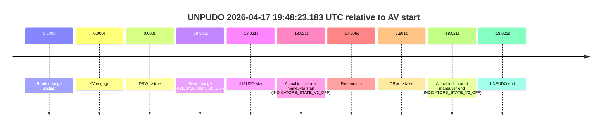
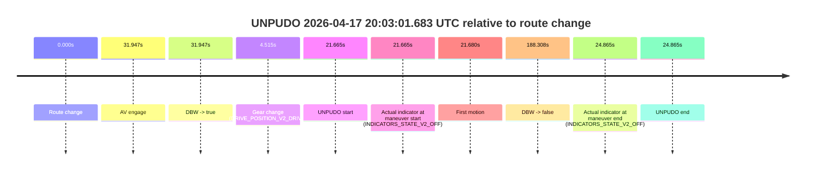
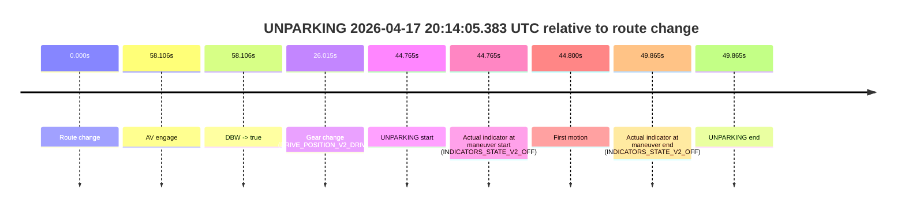

# Run Report: fme20009/2026-04-17--19-07-34--gen2-av-749fd905-72e0-4432-960c-70d355c09b03

| Field | Value |
|---|---|
| Run ID | `fme20009/2026-04-17--19-07-34--gen2-av-749fd905-72e0-4432-960c-70d355c09b03` |
| Date | `2026-04-17` |
| Model(s) | `plum-timeless-beaver` |
| Author | `peng.tang` |
| Event count | `3` |

## unpudo 2026-04-17 19:48:23.183 UTC

| Field | Value |
|---|---|
| Model | `plum-timeless-beaver` |
| Author | `peng.tang` |
| Run ID | `fme20009/2026-04-17--19-07-34--gen2-av-749fd905-72e0-4432-960c-70d355c09b03` |
| Date | `2026-04-17` |
| Time (UTC) | `19:48:23.183` |
| Event type | `unpudo` |
| Disengagement type | `none observed` |
| Route change | `unclear` |
| Console | [run](https://console.sso.wayve.ai/run/fme20009/2026-04-17--19-07-34--gen2-av-749fd905-72e0-4432-960c-70d355c09b03?id=&time-unixus=1776455303183301) |
| Foxglove | [segment](https://app.foxglove.dev/wayve-on-prem/p/prj_0dX18KZdVHg1fmmI/view?ds=foxglove-stream&ds.deviceName=fme20009&ds.start=2026-04-17T19%3A48%3A11.233307Z&ds.end=2026-04-17T19%3A48%3A59.105546Z&layoutId=lay_0e7VD4WIKDQGU73Y&time=2026-04-17T19%3A48%3A23.183301Z) |

### Event card: non-av

- Non-AV: there is no AV-owned portion anywhere inside the detected unpudo timeline, so it is kept for coverage but excluded from model success / failure scoring.

| Event | Time (UTC) | Delta from AV start |
|---|---:|---:|
| Route change unclear | 2026-04-17 19:48:41.204 | `0.000s` |
| AV engage | 2026-04-17 19:48:41.204 | `0.000s` |
| DBW -> true | 2026-04-17 19:48:41.204 | `0.000s` |
| Gear change (DRIVE_POSITION_V2_DRIVE) | 2026-04-17 19:48:21.233 | `-19.971s` |
| UNPUDO start | 2026-04-17 19:48:23.183 | `-18.021s` |
| Actual indicator at maneuver start (INDICATORS_STATE_V2_OFF) | 2026-04-17 19:48:23.183 | `-18.021s` |
| First motion | 2026-04-17 19:48:23.298 | `-17.906s` |
| DBW -> false | 2026-04-17 19:48:49.105 | `7.901s` |
| Actual indicator at maneuver end (INDICATORS_STATE_V2_OFF) | 2026-04-17 19:48:23.183 | `-18.021s` |
| UNPUDO end | 2026-04-17 19:48:23.183 | `-18.021s` |

| Metric | Value |
|---|---|
| Outcome | `non-av` |
| Effective failure type | `none` |
| Route change status | `unclear` |
| DBW at event start | `false` |
| DBW at event end | `false` |
| Predicted gear at AV start | `DRIVE_POSITION_V2_DRIVE` |
| Actual gear at AV start | `DRIVE_POSITION_V2_PARK` |
| Predicted gear at event start | `DRIVE_POSITION_V2_DRIVE` |
| Actual gear at event start | `DRIVE_POSITION_V2_DRIVE` |
| Planned indicator direction | `INDICATORS_STATE_V2_OFF` |
| Controller indicator direction | `INDICATORS_STATE_V2_OFF` |
| Actual indicator direction | `INDICATORS_STATE_V2_OFF` |
| Actual indicator at maneuver end | `INDICATORS_STATE_V2_OFF` |
| Driver accel help in AV | `false` |
| Driver accel help timestamp | `n/a` |
| Max accel pedal pct in AV | `0.0%` |
| Max brake pedal pct in AV | `0.0%` |
| Max speed mps in AV | `0.000` |
| Route -> AV | `n/a` |
| AV -> event start | `-18.021s` |
| AV -> first motion | `-17.906s` |
| AV duration before disengagement | `7.901s` |
| Trajectory waypoint count | `37` |
| Driving-plan step count | `11` |

The scored portion starts from the AV-owned window, not from the pre-AV setup. Route-change search in the stopped pre-event segment was `unclear`, with the baseline therefore set to AV start. At the event anchor the model predicts `DRIVE_POSITION_V2_DRIVE` and the actual gear is `DRIVE_POSITION_V2_DRIVE`. The effective model outcome is `non-av` because `there is no AV-owned overlap inside the event timeline`.

### Resolution

| Field | Value |
|---|---|
| Final outcome | `non-av` |
| Do we agree with this label? | `yes` |
| Source disengagement type | `none observed` |
| Resolved effective failure type | `none` |
| Confidence | `medium` |

## unpudo 2026-04-17 20:03:01.683 UTC

| Field | Value |
|---|---|
| Model | `plum-timeless-beaver` |
| Author | `peng.tang` |
| Run ID | `fme20009/2026-04-17--19-07-34--gen2-av-749fd905-72e0-4432-960c-70d355c09b03` |
| Date | `2026-04-17` |
| Time (UTC) | `20:03:01.683` |
| Event type | `unpudo` |
| Disengagement type | `none observed` |
| Route change | `found` |
| Console | [run](https://console.sso.wayve.ai/run/fme20009/2026-04-17--19-07-34--gen2-av-749fd905-72e0-4432-960c-70d355c09b03?id=&time-unixus=1776456181683326) |
| Foxglove | [segment](https://app.foxglove.dev/wayve-on-prem/p/prj_0dX18KZdVHg1fmmI/view?ds=foxglove-stream&ds.deviceName=fme20009&ds.start=2026-04-17T20%3A02%3A30.018241Z&ds.end=2026-04-17T20%3A05%3A58.325870Z&layoutId=lay_0e7VD4WIKDQGU73Y&time=2026-04-17T20%3A03%3A01.683326Z) |

### Event card: non-av

- Non-AV: there is no AV-owned portion anywhere inside the detected unpudo timeline, so it is kept for coverage but excluded from model success / failure scoring.

| Event | Time (UTC) | Delta from route change |
|---|---:|---:|
| Route change | 2026-04-17 20:02:40.018 | `0.000s` |
| AV engage | 2026-04-17 20:03:11.965 | `31.947s` |
| DBW -> true | 2026-04-17 20:03:11.965 | `31.947s` |
| Gear change (DRIVE_POSITION_V2_DRIVE) | 2026-04-17 20:02:44.533 | `4.515s` |
| UNPUDO start | 2026-04-17 20:03:01.683 | `21.665s` |
| Actual indicator at maneuver start (INDICATORS_STATE_V2_OFF) | 2026-04-17 20:03:01.683 | `21.665s` |
| First motion | 2026-04-17 20:03:01.698 | `21.680s` |
| DBW -> false | 2026-04-17 20:05:48.325 | `188.308s` |
| Actual indicator at maneuver end (INDICATORS_STATE_V2_OFF) | 2026-04-17 20:03:04.883 | `24.865s` |
| UNPUDO end | 2026-04-17 20:03:04.883 | `24.865s` |

| Metric | Value |
|---|---|
| Outcome | `non-av` |
| Effective failure type | `none` |
| Route change status | `found` |
| DBW at event start | `false` |
| DBW at event end | `false` |
| Predicted gear at AV start | `DRIVE_POSITION_V2_DRIVE` |
| Actual gear at AV start | `DRIVE_POSITION_V2_DRIVE` |
| Predicted gear at event start | `DRIVE_POSITION_V2_DRIVE` |
| Actual gear at event start | `DRIVE_POSITION_V2_DRIVE` |
| Planned indicator direction | `INDICATORS_STATE_V2_RIGHT_ON` |
| Controller indicator direction | `INDICATORS_STATE_V2_RIGHT_ON` |
| Actual indicator direction | `INDICATORS_STATE_V2_OFF` |
| Actual indicator at maneuver end | `INDICATORS_STATE_V2_OFF` |
| Driver accel help in AV | `false` |
| Driver accel help timestamp | `n/a` |
| Max accel pedal pct in AV | `0.0%` |
| Max brake pedal pct in AV | `0.0%` |
| Max speed mps in AV | `0.000` |
| Route -> AV | `31.947s` |
| AV -> event start | `-10.282s` |
| AV -> first motion | `-10.267s` |
| AV duration before disengagement | `156.360s` |
| Trajectory waypoint count | `37` |
| Driving-plan step count | `11` |

The scored portion starts from the AV-owned window, not from the pre-AV setup. Route-change search in the stopped pre-event segment was `found`, with the baseline therefore set to route change. At the event anchor the model predicts `DRIVE_POSITION_V2_DRIVE` and the actual gear is `DRIVE_POSITION_V2_DRIVE`. The effective model outcome is `non-av` because `there is no AV-owned overlap inside the event timeline`.

### Resolution

| Field | Value |
|---|---|
| Final outcome | `non-av` |
| Do we agree with this label? | `yes` |
| Source disengagement type | `none observed` |
| Resolved effective failure type | `none` |
| Confidence | `high` |

## unparking 2026-04-17 20:14:05.383 UTC

| Field | Value |
|---|---|
| Model | `plum-timeless-beaver` |
| Author | `peng.tang` |
| Run ID | `fme20009/2026-04-17--19-07-34--gen2-av-749fd905-72e0-4432-960c-70d355c09b03` |
| Date | `2026-04-17` |
| Time (UTC) | `20:14:05.383` |
| Event type | `unparking` |
| Disengagement type | `none observed` |
| Route change | `found` |
| Console | [run](https://console.sso.wayve.ai/run/fme20009/2026-04-17--19-07-34--gen2-av-749fd905-72e0-4432-960c-70d355c09b03?id=&time-unixus=1776456845383317) |
| Foxglove | [segment](https://app.foxglove.dev/wayve-on-prem/p/prj_0dX18KZdVHg1fmmI/view?ds=foxglove-stream&ds.deviceName=fme20009&ds.start=2026-04-17T20%3A13%3A10.618362Z&ds.end=2026-04-17T20%3A14%3A20.483320Z&layoutId=lay_0e7VD4WIKDQGU73Y&time=2026-04-17T20%3A14%3A05.383317Z) |

### Event card: non-av

- Non-AV: there is no AV-owned portion anywhere inside the detected unparking timeline, so it is kept for coverage but excluded from model success / failure scoring.

| Event | Time (UTC) | Delta from route change |
|---|---:|---:|
| Route change | 2026-04-17 20:13:20.618 | `0.000s` |
| AV engage | 2026-04-17 20:14:18.724 | `58.106s` |
| DBW -> true | 2026-04-17 20:14:18.724 | `58.106s` |
| Gear change (DRIVE_POSITION_V2_DRIVE) | 2026-04-17 20:13:46.633 | `26.015s` |
| UNPARKING start | 2026-04-17 20:14:05.383 | `44.765s` |
| Actual indicator at maneuver start (INDICATORS_STATE_V2_OFF) | 2026-04-17 20:14:05.383 | `44.765s` |
| First motion | 2026-04-17 20:14:05.418 | `44.800s` |
| Actual indicator at maneuver end (INDICATORS_STATE_V2_OFF) | 2026-04-17 20:14:10.483 | `49.865s` |
| UNPARKING end | 2026-04-17 20:14:10.483 | `49.865s` |

| Metric | Value |
|---|---|
| Outcome | `non-av` |
| Effective failure type | `none` |
| Route change status | `found` |
| DBW at event start | `false` |
| DBW at event end | `false` |
| Predicted gear at AV start | `DRIVE_POSITION_V2_DRIVE` |
| Actual gear at AV start | `DRIVE_POSITION_V2_DRIVE` |
| Predicted gear at event start | `DRIVE_POSITION_V2_DRIVE` |
| Actual gear at event start | `DRIVE_POSITION_V2_DRIVE` |
| Planned indicator direction | `INDICATORS_STATE_V2_RIGHT_ON` |
| Controller indicator direction | `INDICATORS_STATE_V2_RIGHT_ON` |
| Actual indicator direction | `INDICATORS_STATE_V2_OFF` |
| Actual indicator at maneuver end | `INDICATORS_STATE_V2_OFF` |
| Driver accel help in AV | `false` |
| Driver accel help timestamp | `n/a` |
| Max accel pedal pct in AV | `0.0%` |
| Max brake pedal pct in AV | `0.0%` |
| Max speed mps in AV | `0.000` |
| Route -> AV | `58.106s` |
| AV -> event start | `-13.341s` |
| AV -> first motion | `-13.306s` |
| AV duration before disengagement | `n/a` |
| Trajectory waypoint count | `37` |
| Driving-plan step count | `11` |

The scored portion starts from the AV-owned window, not from the pre-AV setup. Route-change search in the stopped pre-event segment was `found`, with the baseline therefore set to route change. At the event anchor the model predicts `DRIVE_POSITION_V2_DRIVE` and the actual gear is `DRIVE_POSITION_V2_DRIVE`. The effective model outcome is `non-av` because `there is no AV-owned overlap inside the event timeline`.

### Resolution

| Field | Value |
|---|---|
| Final outcome | `non-av` |
| Do we agree with this label? | `yes` |
| Source disengagement type | `none observed` |
| Resolved effective failure type | `none` |
| Confidence | `high` |
