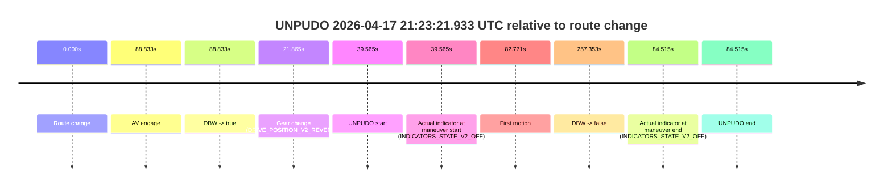
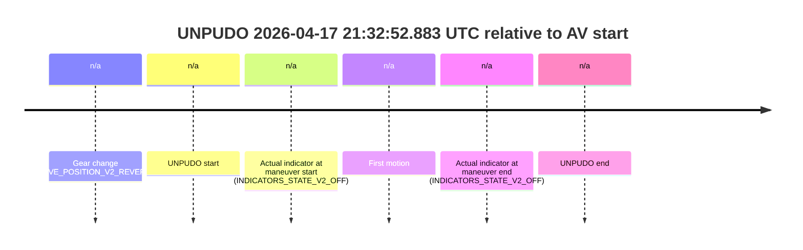

# Run Report: fme20009/2026-04-17--20-53-02--gen2-av-0065c15c-a07d-4751-a733-2aa42d07a5b4

| Field | Value |
|---|---|
| Run ID | `fme20009/2026-04-17--20-53-02--gen2-av-0065c15c-a07d-4751-a733-2aa42d07a5b4` |
| Date | `2026-04-17` |
| Model(s) | `armadillo-amethyst-squeaky` |
| Author | `guy.geva` |
| Event count | `3` |

## unpudo 2026-04-17 21:05:15.433 UTC

| Field | Value |
|---|---|
| Model | `armadillo-amethyst-squeaky` |
| Author | `guy.geva` |
| Run ID | `fme20009/2026-04-17--20-53-02--gen2-av-0065c15c-a07d-4751-a733-2aa42d07a5b4` |
| Date | `2026-04-17` |
| Time (UTC) | `21:05:15.433` |
| Event type | `unpudo` |
| Disengagement type | `none observed` |
| Route change | `found` |
| Console | [run](https://console.sso.wayve.ai/run/fme20009/2026-04-17--20-53-02--gen2-av-0065c15c-a07d-4751-a733-2aa42d07a5b4?id=&time-unixus=1776459915433302) |
| Foxglove | [segment](https://app.foxglove.dev/wayve-on-prem/p/prj_0dX18KZdVHg1fmmI/view?ds=foxglove-stream&ds.deviceName=fme20009&ds.start=2026-04-17T21%3A04%3A57.168280Z&ds.end=2026-04-17T21%3A08%3A05.921860Z&layoutId=lay_0e7VD4WIKDQGU73Y&time=2026-04-17T21%3A05%3A15.433302Z) |

### Event card: non-av

- Non-AV: there is no AV-owned portion anywhere inside the detected unpudo timeline, so it is kept for coverage but excluded from model success / failure scoring.

| Event | Time (UTC) | Delta from route change |
|---|---:|---:|
| Route change | 2026-04-17 21:05:07.168 | `0.000s` |
| AV engage | 2026-04-17 21:06:30.841 | `83.673s` |
| DBW -> true | 2026-04-17 21:06:30.841 | `83.673s` |
| Gear change (DRIVE_POSITION_V2_DRIVE) | 2026-04-17 21:05:13.033 | `5.865s` |
| UNPUDO start | 2026-04-17 21:05:15.433 | `8.265s` |
| Actual indicator at maneuver start (INDICATORS_STATE_V2_OFF) | 2026-04-17 21:05:15.433 | `8.265s` |
| First motion | 2026-04-17 21:05:15.479 | `8.311s` |
| DBW -> false | 2026-04-17 21:07:55.921 | `168.754s` |
| Actual indicator at maneuver end (INDICATORS_STATE_V2_RIGHT_ON) | 2026-04-17 21:06:24.233 | `77.065s` |
| UNPUDO end | 2026-04-17 21:06:24.233 | `77.065s` |

| Metric | Value |
|---|---|
| Outcome | `non-av` |
| Effective failure type | `none` |
| Route change status | `found` |
| DBW at event start | `false` |
| DBW at event end | `false` |
| Predicted gear at AV start | `DRIVE_POSITION_V2_DRIVE` |
| Actual gear at AV start | `DRIVE_POSITION_V2_DRIVE` |
| Predicted gear at event start | `DRIVE_POSITION_V2_DRIVE` |
| Actual gear at event start | `DRIVE_POSITION_V2_DRIVE` |
| Planned indicator direction | `INDICATORS_STATE_V2_OFF` |
| Controller indicator direction | `INDICATORS_STATE_V2_OFF` |
| Actual indicator direction | `INDICATORS_STATE_V2_OFF` |
| Actual indicator at maneuver end | `INDICATORS_STATE_V2_RIGHT_ON` |
| Driver accel help in AV | `false` |
| Driver accel help timestamp | `n/a` |
| Max accel pedal pct in AV | `0.0%` |
| Max brake pedal pct in AV | `0.0%` |
| Max speed mps in AV | `0.000` |
| Route -> AV | `83.673s` |
| AV -> event start | `-75.408s` |
| AV -> first motion | `-75.363s` |
| AV duration before disengagement | `85.080s` |
| Trajectory waypoint count | `36` |
| Driving-plan step count | `11` |

The scored portion starts from the AV-owned window, not from the pre-AV setup. Route-change search in the stopped pre-event segment was `found`, with the baseline therefore set to route change. At the event anchor the model predicts `DRIVE_POSITION_V2_DRIVE` and the actual gear is `DRIVE_POSITION_V2_DRIVE`. The effective model outcome is `non-av` because `there is no AV-owned overlap inside the event timeline`.

### Resolution

| Field | Value |
|---|---|
| Final outcome | `non-av` |
| Do we agree with this label? | `yes` |
| Source disengagement type | `none observed` |
| Resolved effective failure type | `none` |
| Confidence | `high` |

## unpudo 2026-04-17 21:23:21.933 UTC

| Field | Value |
|---|---|
| Model | `armadillo-amethyst-squeaky` |
| Author | `guy.geva` |
| Run ID | `fme20009/2026-04-17--20-53-02--gen2-av-0065c15c-a07d-4751-a733-2aa42d07a5b4` |
| Date | `2026-04-17` |
| Time (UTC) | `21:23:21.933` |
| Event type | `unpudo` |
| Disengagement type | `none observed` |
| Route change | `found` |
| Console | [run](https://console.sso.wayve.ai/run/fme20009/2026-04-17--20-53-02--gen2-av-0065c15c-a07d-4751-a733-2aa42d07a5b4?id=&time-unixus=1776461001933326) |
| Foxglove | [segment](https://app.foxglove.dev/wayve-on-prem/p/prj_0dX18KZdVHg1fmmI/view?ds=foxglove-stream&ds.deviceName=fme20009&ds.start=2026-04-17T21%3A22%3A32.368282Z&ds.end=2026-04-17T21%3A27%3A09.721587Z&layoutId=lay_0e7VD4WIKDQGU73Y&time=2026-04-17T21%3A23%3A21.933326Z) |

### Event card: non-av

- Non-AV: there is no AV-owned portion anywhere inside the detected unpudo timeline, so it is kept for coverage but excluded from model success / failure scoring.

| Event | Time (UTC) | Delta from route change |
|---|---:|---:|
| Route change | 2026-04-17 21:22:42.368 | `0.000s` |
| AV engage | 2026-04-17 21:24:11.201 | `88.833s` |
| DBW -> true | 2026-04-17 21:24:11.201 | `88.833s` |
| Gear change (DRIVE_POSITION_V2_REVERSE) | 2026-04-17 21:23:04.233 | `21.865s` |
| UNPUDO start | 2026-04-17 21:23:21.933 | `39.565s` |
| Actual indicator at maneuver start (INDICATORS_STATE_V2_OFF) | 2026-04-17 21:23:21.933 | `39.565s` |
| First motion | 2026-04-17 21:24:05.139 | `82.771s` |
| DBW -> false | 2026-04-17 21:26:59.721 | `257.353s` |
| Actual indicator at maneuver end (INDICATORS_STATE_V2_OFF) | 2026-04-17 21:24:06.883 | `84.515s` |
| UNPUDO end | 2026-04-17 21:24:06.883 | `84.515s` |

| Metric | Value |
|---|---|
| Outcome | `non-av` |
| Effective failure type | `none` |
| Route change status | `found` |
| DBW at event start | `false` |
| DBW at event end | `false` |
| Predicted gear at AV start | `DRIVE_POSITION_V2_DRIVE` |
| Actual gear at AV start | `DRIVE_POSITION_V2_DRIVE` |
| Predicted gear at event start | `DRIVE_POSITION_V2_REVERSE` |
| Actual gear at event start | `DRIVE_POSITION_V2_REVERSE` |
| Planned indicator direction | `INDICATORS_STATE_V2_OFF` |
| Controller indicator direction | `INDICATORS_STATE_V2_OFF` |
| Actual indicator direction | `INDICATORS_STATE_V2_OFF` |
| Actual indicator at maneuver end | `INDICATORS_STATE_V2_OFF` |
| Driver accel help in AV | `false` |
| Driver accel help timestamp | `n/a` |
| Max accel pedal pct in AV | `0.0%` |
| Max brake pedal pct in AV | `0.0%` |
| Max speed mps in AV | `0.000` |
| Route -> AV | `88.833s` |
| AV -> event start | `-49.268s` |
| AV -> first motion | `-6.062s` |
| AV duration before disengagement | `168.520s` |
| Trajectory waypoint count | `36` |
| Driving-plan step count | `11` |

The scored portion starts from the AV-owned window, not from the pre-AV setup. Route-change search in the stopped pre-event segment was `found`, with the baseline therefore set to route change. At the event anchor the model predicts `DRIVE_POSITION_V2_REVERSE` and the actual gear is `DRIVE_POSITION_V2_REVERSE`. The effective model outcome is `non-av` because `there is no AV-owned overlap inside the event timeline`.

### Resolution

| Field | Value |
|---|---|
| Final outcome | `non-av` |
| Do we agree with this label? | `yes` |
| Source disengagement type | `none observed` |
| Resolved effective failure type | `none` |
| Confidence | `high` |

## unpudo 2026-04-17 21:32:52.883 UTC

| Field | Value |
|---|---|
| Model | `armadillo-amethyst-squeaky` |
| Author | `guy.geva` |
| Run ID | `fme20009/2026-04-17--20-53-02--gen2-av-0065c15c-a07d-4751-a733-2aa42d07a5b4` |
| Date | `2026-04-17` |
| Time (UTC) | `21:32:52.883` |
| Event type | `unpudo` |
| Disengagement type | `none observed` |
| Route change | `unclear` |
| Console | [run](https://console.sso.wayve.ai/run/fme20009/2026-04-17--20-53-02--gen2-av-0065c15c-a07d-4751-a733-2aa42d07a5b4?id=&time-unixus=1776461572883322) |
| Foxglove | [segment](https://app.foxglove.dev/wayve-on-prem/p/prj_0dX18KZdVHg1fmmI/view?ds=foxglove-stream&ds.deviceName=fme20009&ds.start=2026-04-17T21%3A32%3A38.833305Z&ds.end=2026-04-17T21%3A33%3A19.983318Z&layoutId=lay_0e7VD4WIKDQGU73Y&time=2026-04-17T21%3A32%3A52.883322Z) |

### Event card: non-av

- Non-AV: there is no AV-owned portion anywhere inside the detected unpudo timeline, so it is kept for coverage but excluded from model success / failure scoring.

| Event | Time (UTC) | Delta from AV start |
|---|---:|---:|
| Gear change (DRIVE_POSITION_V2_REVERSE) | 2026-04-17 21:32:48.833 | `n/a` |
| UNPUDO start | 2026-04-17 21:32:52.883 | `n/a` |
| Actual indicator at maneuver start (INDICATORS_STATE_V2_OFF) | 2026-04-17 21:32:52.883 | `n/a` |
| First motion | 2026-04-17 21:33:06.718 | `n/a` |
| Actual indicator at maneuver end (INDICATORS_STATE_V2_OFF) | 2026-04-17 21:33:09.983 | `n/a` |
| UNPUDO end | 2026-04-17 21:33:09.983 | `n/a` |

| Metric | Value |
|---|---|
| Outcome | `non-av` |
| Effective failure type | `none` |
| Route change status | `unclear` |
| DBW at event start | `false` |
| DBW at event end | `false` |
| Predicted gear at AV start | `n/a` |
| Actual gear at AV start | `n/a` |
| Predicted gear at event start | `DRIVE_POSITION_V2_REVERSE` |
| Actual gear at event start | `DRIVE_POSITION_V2_REVERSE` |
| Planned indicator direction | `INDICATORS_STATE_V2_OFF` |
| Controller indicator direction | `INDICATORS_STATE_V2_OFF` |
| Actual indicator direction | `INDICATORS_STATE_V2_OFF` |
| Actual indicator at maneuver end | `INDICATORS_STATE_V2_OFF` |
| Driver accel help in AV | `false` |
| Driver accel help timestamp | `n/a` |
| Max accel pedal pct in AV | `0.0%` |
| Max brake pedal pct in AV | `0.0%` |
| Max speed mps in AV | `0.000` |
| Route -> AV | `n/a` |
| AV -> event start | `n/a` |
| AV -> first motion | `n/a` |
| AV duration before disengagement | `n/a` |
| Trajectory waypoint count | `37` |
| Driving-plan step count | `11` |

The scored portion starts from the AV-owned window, not from the pre-AV setup. Route-change search in the stopped pre-event segment was `unclear`, with the baseline therefore set to AV start. At the event anchor the model predicts `DRIVE_POSITION_V2_REVERSE` and the actual gear is `DRIVE_POSITION_V2_REVERSE`. The effective model outcome is `non-av` because `there is no AV-owned overlap inside the event timeline`.

### Resolution

| Field | Value |
|---|---|
| Final outcome | `non-av` |
| Do we agree with this label? | `yes` |
| Source disengagement type | `none observed` |
| Resolved effective failure type | `none` |
| Confidence | `medium` |
