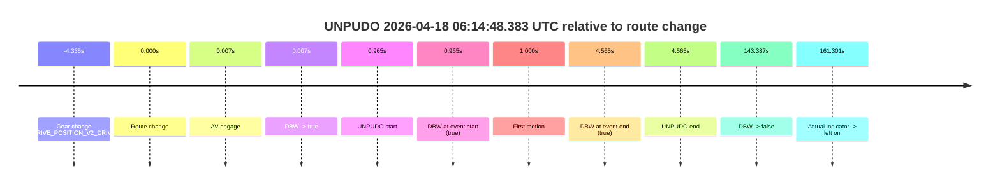
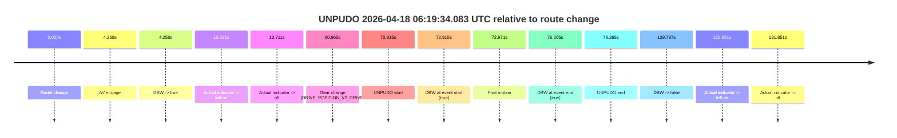

# Run Report: fme20009/2026-04-18--06-07-44--gen2-av-770f77fc-8433-4754-b8bb-8665dd638d6e

| Field | Value |
|---|---|
| Run ID | `fme20009/2026-04-18--06-07-44--gen2-av-770f77fc-8433-4754-b8bb-8665dd638d6e` |
| Date | `2026-04-18` |
| Model(s) | `armadillo-amethyst-squeaky` |
| Author | `guy.geva` |
| Event count | `2` |

## unpudo 2026-04-18 06:14:48.383 UTC

| Field | Value |
|---|---|
| Model | `armadillo-amethyst-squeaky` |
| Author | `guy.geva` |
| Run ID | `fme20009/2026-04-18--06-07-44--gen2-av-770f77fc-8433-4754-b8bb-8665dd638d6e` |
| Date | `2026-04-18` |
| Time (UTC) | `06:14:48.383` |
| Event type | `unpudo` |
| Disengagement type | `none observed` |
| Route change | `found` |
| Console | [run](https://console.sso.wayve.ai/run/fme20009/2026-04-18--06-07-44--gen2-av-770f77fc-8433-4754-b8bb-8665dd638d6e?id=&time-unixus=1776492888383296) |
| Foxglove | [segment](https://app.foxglove.dev/wayve-on-prem/p/prj_0dX18KZdVHg1fmmI/view?ds=foxglove-stream&ds.deviceName=fme20009&ds.start=2026-04-18T06%3A14%3A33.083309Z&ds.end=2026-04-18T06%3A17%3A20.805824Z&layoutId=lay_0e7VD4WIKDQGU73Y&time=2026-04-18T06%3A14%3A48.383296Z) |

### Event card: pass

- Pass: AV owns the credited unpudo through the official event window, the gear state is aligned at the anchor, and the vehicle moves without driver accelerator help in AV.

| Event | Time (UTC) | Delta from route change |
|---|---:|---:|
| Gear change (DRIVE_POSITION_V2_DRIVE) | 2026-04-18 06:14:43.083 | `-4.335s` |
| Route change | 2026-04-18 06:14:47.418 | `0.000s` |
| AV engage | 2026-04-18 06:14:47.425 | `0.007s` |
| DBW -> true | 2026-04-18 06:14:47.425 | `0.007s` |
| UNPUDO start | 2026-04-18 06:14:48.383 | `0.965s` |
| DBW at event start (true) | 2026-04-18 06:14:48.383 | `0.965s` |
| First motion | 2026-04-18 06:14:48.418 | `1.000s` |
| DBW at event end (true) | 2026-04-18 06:14:51.983 | `4.565s` |
| UNPUDO end | 2026-04-18 06:14:51.983 | `4.565s` |
| DBW -> false | 2026-04-18 06:17:10.805 | `143.387s` |
| Actual indicator -> left on | 2026-04-18 06:17:28.719 | `161.301s` |

| Metric | Value |
|---|---|
| Outcome | `pass` |
| Effective failure type | `none` |
| Route change status | `found` |
| DBW at event start | `true` |
| DBW at event end | `true` |
| Predicted gear at AV start | `DRIVE_POSITION_V2_DRIVE` |
| Actual gear at AV start | `DRIVE_POSITION_V2_DRIVE` |
| Predicted gear at event start | `DRIVE_POSITION_V2_DRIVE` |
| Actual gear at event start | `DRIVE_POSITION_V2_DRIVE` |
| Planned indicator direction | `INDICATORS_STATE_V2_RIGHT_ON` |
| Controller indicator direction | `INDICATORS_STATE_V2_RIGHT_ON` |
| Actual indicator direction | `INDICATORS_STATE_V2_OFF` |
| Actual indicator at maneuver end | `INDICATORS_STATE_V2_OFF` |
| Driver accel help in AV | `false` |
| Driver accel help timestamp | `n/a` |
| Max accel pedal pct in AV | `0.0%` |
| Max brake pedal pct in AV | `0.0%` |
| Max speed mps in AV | `4.389` |
| Success timing baseline | `route change` |
| Route -> AV | `0.007s` |
| AV -> event start | `0.958s` |
| AV -> first motion | `0.994s` |
| Success baseline -> event start | `0.965s` |
| Success baseline -> first motion | `1.000s` |
| AV duration before disengagement | `143.381s` |
| Trajectory waypoint count | `36` |
| Driving-plan step count | `11` |

The scored portion starts from the AV-owned window, not from the pre-AV setup. Route-change search in the stopped pre-event segment was `found`, with the baseline therefore set to route change. At the event anchor the model predicts `DRIVE_POSITION_V2_DRIVE` and the actual gear is `DRIVE_POSITION_V2_DRIVE`. The effective model outcome is `pass` because `the credited maneuver stays AV-owned through the official event end`.

### Resolution

| Field | Value |
|---|---|
| Final outcome | `pass` |
| Do we agree with this label? | `yes` |
| Source disengagement type | `none observed` |
| Resolved effective failure type | `none` |
| Confidence | `high` |

## unpudo 2026-04-18 06:19:34.083 UTC

| Field | Value |
|---|---|
| Model | `armadillo-amethyst-squeaky` |
| Author | `guy.geva` |
| Run ID | `fme20009/2026-04-18--06-07-44--gen2-av-770f77fc-8433-4754-b8bb-8665dd638d6e` |
| Date | `2026-04-18` |
| Time (UTC) | `06:19:34.083` |
| Event type | `unpudo` |
| Disengagement type | `none observed` |
| Route change | `found` |
| Console | [run](https://console.sso.wayve.ai/run/fme20009/2026-04-18--06-07-44--gen2-av-770f77fc-8433-4754-b8bb-8665dd638d6e?id=&time-unixus=1776493174083296) |
| Foxglove | [segment](https://app.foxglove.dev/wayve-on-prem/p/prj_0dX18KZdVHg1fmmI/view?ds=foxglove-stream&ds.deviceName=fme20009&ds.start=2026-04-18T06%3A18%3A11.168271Z&ds.end=2026-04-18T06%3A20%3A40.965590Z&layoutId=lay_0e7VD4WIKDQGU73Y&time=2026-04-18T06%3A19%3A34.083296Z) |

### Event card: pass

- Pass: AV owns the credited unpudo through the official event window, the gear state is aligned at the anchor, and the vehicle moves without driver accelerator help in AV.

| Event | Time (UTC) | Delta from route change |
|---|---:|---:|
| Route change | 2026-04-18 06:18:21.168 | `0.000s` |
| AV engage | 2026-04-18 06:18:25.425 | `4.258s` |
| DBW -> true | 2026-04-18 06:18:25.425 | `4.258s` |
| Actual indicator -> left on | 2026-04-18 06:18:31.198 | `10.031s` |
| Actual indicator -> off | 2026-04-18 06:18:34.878 | `13.711s` |
| Gear change (DRIVE_POSITION_V2_DRIVE) | 2026-04-18 06:19:22.133 | `60.965s` |
| UNPUDO start | 2026-04-18 06:19:34.083 | `72.915s` |
| DBW at event start (true) | 2026-04-18 06:19:34.083 | `72.915s` |
| First motion | 2026-04-18 06:19:34.138 | `72.971s` |
| DBW at event end (true) | 2026-04-18 06:19:37.433 | `76.265s` |
| UNPUDO end | 2026-04-18 06:19:37.433 | `76.265s` |
| DBW -> false | 2026-04-18 06:20:30.965 | `129.797s` |
| Actual indicator -> left on | 2026-04-18 06:20:31.119 | `129.951s` |
| Actual indicator -> off | 2026-04-18 06:20:33.019 | `131.851s` |

| Metric | Value |
|---|---|
| Outcome | `pass` |
| Effective failure type | `none` |
| Route change status | `found` |
| DBW at event start | `true` |
| DBW at event end | `true` |
| Predicted gear at AV start | `DRIVE_POSITION_V2_DRIVE` |
| Actual gear at AV start | `DRIVE_POSITION_V2_PARK` |
| Predicted gear at event start | `DRIVE_POSITION_V2_DRIVE` |
| Actual gear at event start | `DRIVE_POSITION_V2_DRIVE` |
| Planned indicator direction | `INDICATORS_STATE_V2_LEFT_ON` |
| Controller indicator direction | `INDICATORS_STATE_V2_LEFT_ON` |
| Actual indicator direction | `INDICATORS_STATE_V2_OFF` |
| Actual indicator at maneuver end | `INDICATORS_STATE_V2_OFF` |
| Driver accel help in AV | `false` |
| Driver accel help timestamp | `n/a` |
| Max accel pedal pct in AV | `0.0%` |
| Max brake pedal pct in AV | `0.0%` |
| Max speed mps in AV | `5.500` |
| Success timing baseline | `route change` |
| Route -> AV | `4.258s` |
| AV -> event start | `68.657s` |
| AV -> first motion | `68.713s` |
| Success baseline -> event start | `72.915s` |
| Success baseline -> first motion | `72.971s` |
| AV duration before disengagement | `125.540s` |
| Trajectory waypoint count | `36` |
| Driving-plan step count | `11` |

The scored portion starts from the AV-owned window, not from the pre-AV setup. Route-change search in the stopped pre-event segment was `found`, with the baseline therefore set to route change. At the event anchor the model predicts `DRIVE_POSITION_V2_DRIVE` and the actual gear is `DRIVE_POSITION_V2_DRIVE`. The effective model outcome is `pass` because `the credited maneuver stays AV-owned through the official event end`.

### Resolution

| Field | Value |
|---|---|
| Final outcome | `pass` |
| Do we agree with this label? | `yes` |
| Source disengagement type | `none observed` |
| Resolved effective failure type | `none` |
| Confidence | `high` |
