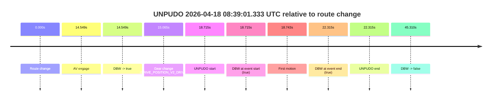
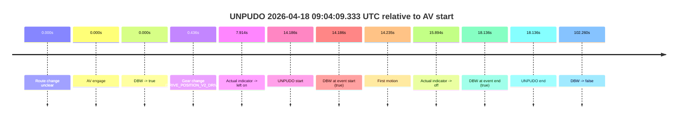

# Run Report: fme20009/2026-04-18--08-16-54--gen2-av-338a30d3-3361-4f0b-a059-9cf59b4bafab

| Field | Value |
|---|---|
| Run ID | `fme20009/2026-04-18--08-16-54--gen2-av-338a30d3-3361-4f0b-a059-9cf59b4bafab` |
| Date | `2026-04-18` |
| Model(s) | `armadillo-amethyst-squeaky` |
| Author | `guy.geva` |
| Event count | `4` |

## unpudo 2026-04-18 08:39:01.333 UTC

| Field | Value |
|---|---|
| Model | `armadillo-amethyst-squeaky` |
| Author | `guy.geva` |
| Run ID | `fme20009/2026-04-18--08-16-54--gen2-av-338a30d3-3361-4f0b-a059-9cf59b4bafab` |
| Date | `2026-04-18` |
| Time (UTC) | `08:39:01.333` |
| Event type | `unpudo` |
| Disengagement type | `none observed` |
| Route change | `found` |
| Console | [run](https://console.sso.wayve.ai/run/fme20009/2026-04-18--08-16-54--gen2-av-338a30d3-3361-4f0b-a059-9cf59b4bafab?id=&time-unixus=1776501541333299) |
| Foxglove | [segment](https://app.foxglove.dev/wayve-on-prem/p/prj_0dX18KZdVHg1fmmI/view?ds=foxglove-stream&ds.deviceName=fme20009&ds.start=2026-04-18T08%3A38%3A32.618263Z&ds.end=2026-04-18T08%3A39%3A37.928430Z&layoutId=lay_0e7VD4WIKDQGU73Y&time=2026-04-18T08%3A39%3A01.333299Z) |

### Event card: pass

- Pass: AV owns the credited unpudo through the official event window, the gear state is aligned at the anchor, and the vehicle moves without driver accelerator help in AV.

| Event | Time (UTC) | Delta from route change |
|---|---:|---:|
| Route change | 2026-04-18 08:38:42.618 | `0.000s` |
| AV engage | 2026-04-18 08:38:57.167 | `14.549s` |
| DBW -> true | 2026-04-18 08:38:57.167 | `14.549s` |
| Gear change (DRIVE_POSITION_V2_DRIVE) | 2026-04-18 08:38:57.683 | `15.065s` |
| UNPUDO start | 2026-04-18 08:39:01.333 | `18.715s` |
| DBW at event start (true) | 2026-04-18 08:39:01.333 | `18.715s` |
| First motion | 2026-04-18 08:39:01.361 | `18.743s` |
| DBW at event end (true) | 2026-04-18 08:39:04.933 | `22.315s` |
| UNPUDO end | 2026-04-18 08:39:04.933 | `22.315s` |
| DBW -> false | 2026-04-18 08:39:27.928 | `45.310s` |

| Metric | Value |
|---|---|
| Outcome | `pass` |
| Effective failure type | `none` |
| Route change status | `found` |
| DBW at event start | `true` |
| DBW at event end | `true` |
| Predicted gear at AV start | `DRIVE_POSITION_V2_DRIVE` |
| Actual gear at AV start | `DRIVE_POSITION_V2_PARK` |
| Predicted gear at event start | `DRIVE_POSITION_V2_DRIVE` |
| Actual gear at event start | `DRIVE_POSITION_V2_DRIVE` |
| Planned indicator direction | `INDICATORS_STATE_V2_OFF` |
| Controller indicator direction | `INDICATORS_STATE_V2_OFF` |
| Actual indicator direction | `INDICATORS_STATE_V2_OFF` |
| Actual indicator at maneuver end | `INDICATORS_STATE_V2_OFF` |
| Driver accel help in AV | `false` |
| Driver accel help timestamp | `n/a` |
| Max accel pedal pct in AV | `0.0%` |
| Max brake pedal pct in AV | `0.0%` |
| Max speed mps in AV | `4.642` |
| Success timing baseline | `route change` |
| Route -> AV | `14.549s` |
| AV -> event start | `4.166s` |
| AV -> first motion | `4.194s` |
| Success baseline -> event start | `18.715s` |
| Success baseline -> first motion | `18.743s` |
| AV duration before disengagement | `30.761s` |
| Trajectory waypoint count | `35` |
| Driving-plan step count | `11` |

The scored portion starts from the AV-owned window, not from the pre-AV setup. Route-change search in the stopped pre-event segment was `found`, with the baseline therefore set to route change. At the event anchor the model predicts `DRIVE_POSITION_V2_DRIVE` and the actual gear is `DRIVE_POSITION_V2_DRIVE`. The effective model outcome is `pass` because `the credited maneuver stays AV-owned through the official event end`.

### Resolution

| Field | Value |
|---|---|
| Final outcome | `pass` |
| Do we agree with this label? | `yes` |
| Source disengagement type | `none observed` |
| Resolved effective failure type | `none` |
| Confidence | `high` |

## unpudo 2026-04-18 09:04:09.333 UTC

| Field | Value |
|---|---|
| Model | `armadillo-amethyst-squeaky` |
| Author | `guy.geva` |
| Run ID | `fme20009/2026-04-18--08-16-54--gen2-av-338a30d3-3361-4f0b-a059-9cf59b4bafab` |
| Date | `2026-04-18` |
| Time (UTC) | `09:04:09.333` |
| Event type | `unpudo` |
| Disengagement type | `none observed` |
| Route change | `unclear` |
| Console | [run](https://console.sso.wayve.ai/run/fme20009/2026-04-18--08-16-54--gen2-av-338a30d3-3361-4f0b-a059-9cf59b4bafab?id=&time-unixus=1776503049333302) |
| Foxglove | [segment](https://app.foxglove.dev/wayve-on-prem/p/prj_0dX18KZdVHg1fmmI/view?ds=foxglove-stream&ds.deviceName=fme20009&ds.start=2026-04-18T09%3A03%3A45.147365Z&ds.end=2026-04-18T09%3A05%3A47.407382Z&layoutId=lay_0e7VD4WIKDQGU73Y&time=2026-04-18T09%3A04%3A09.333302Z) |

### Event card: pass

- Pass: AV owns the credited unpudo through the official event window, the gear state is aligned at the anchor, and the vehicle moves without driver accelerator help in AV.

| Event | Time (UTC) | Delta from AV start |
|---|---:|---:|
| Route change unclear | 2026-04-18 09:03:55.147 | `0.000s` |
| AV engage | 2026-04-18 09:03:55.147 | `0.000s` |
| DBW -> true | 2026-04-18 09:03:55.147 | `0.000s` |
| Gear change (DRIVE_POSITION_V2_DRIVE) | 2026-04-18 09:03:55.583 | `0.436s` |
| Actual indicator -> left on | 2026-04-18 09:04:03.061 | `7.914s` |
| UNPUDO start | 2026-04-18 09:04:09.333 | `14.186s` |
| DBW at event start (true) | 2026-04-18 09:04:09.333 | `14.186s` |
| First motion | 2026-04-18 09:04:09.381 | `14.235s` |
| Actual indicator -> off | 2026-04-18 09:04:11.041 | `15.894s` |
| DBW at event end (true) | 2026-04-18 09:04:13.283 | `18.136s` |
| UNPUDO end | 2026-04-18 09:04:13.283 | `18.136s` |
| DBW -> false | 2026-04-18 09:05:37.407 | `102.260s` |

| Metric | Value |
|---|---|
| Outcome | `pass` |
| Effective failure type | `none` |
| Route change status | `unclear` |
| DBW at event start | `true` |
| DBW at event end | `true` |
| Predicted gear at AV start | `DRIVE_POSITION_V2_DRIVE` |
| Actual gear at AV start | `DRIVE_POSITION_V2_PARK` |
| Predicted gear at event start | `DRIVE_POSITION_V2_DRIVE` |
| Actual gear at event start | `DRIVE_POSITION_V2_DRIVE` |
| Planned indicator direction | `INDICATORS_STATE_V2_LEFT_ON` |
| Controller indicator direction | `INDICATORS_STATE_V2_LEFT_ON` |
| Actual indicator direction | `INDICATORS_STATE_V2_LEFT_ON` |
| Actual indicator at maneuver end | `INDICATORS_STATE_V2_OFF` |
| Driver accel help in AV | `false` |
| Driver accel help timestamp | `n/a` |
| Max accel pedal pct in AV | `0.0%` |
| Max brake pedal pct in AV | `0.0%` |
| Max speed mps in AV | `4.642` |
| Success timing baseline | `AV start` |
| Route -> AV | `n/a` |
| AV -> event start | `14.186s` |
| AV -> first motion | `14.235s` |
| Success baseline -> event start | `14.186s` |
| Success baseline -> first motion | `14.235s` |
| AV duration before disengagement | `102.260s` |
| Trajectory waypoint count | `35` |
| Driving-plan step count | `11` |

The scored portion starts from the AV-owned window, not from the pre-AV setup. Route-change search in the stopped pre-event segment was `unclear`, with the baseline therefore set to AV start. At the event anchor the model predicts `DRIVE_POSITION_V2_DRIVE` and the actual gear is `DRIVE_POSITION_V2_DRIVE`. The effective model outcome is `pass` because `the credited maneuver stays AV-owned through the official event end`.

### Resolution

| Field | Value |
|---|---|
| Final outcome | `pass` |
| Do we agree with this label? | `yes` |
| Source disengagement type | `none observed` |
| Resolved effective failure type | `none` |
| Confidence | `medium` |

## unpudo 2026-04-18 09:18:35.183 UTC

| Field | Value |
|---|---|
| Model | `armadillo-amethyst-squeaky` |
| Author | `guy.geva` |
| Run ID | `fme20009/2026-04-18--08-16-54--gen2-av-338a30d3-3361-4f0b-a059-9cf59b4bafab` |
| Date | `2026-04-18` |
| Time (UTC) | `09:18:35.183` |
| Event type | `unpudo` |
| Disengagement type | `none observed` |
| Route change | `found` |
| Console | [run](https://console.sso.wayve.ai/run/fme20009/2026-04-18--08-16-54--gen2-av-338a30d3-3361-4f0b-a059-9cf59b4bafab?id=&time-unixus=1776503915183316) |
| Foxglove | [segment](https://app.foxglove.dev/wayve-on-prem/p/prj_0dX18KZdVHg1fmmI/view?ds=foxglove-stream&ds.deviceName=fme20009&ds.start=2026-04-18T09%3A17%3A18.018266Z&ds.end=2026-04-18T09%3A19%3A05.468521Z&layoutId=lay_0e7VD4WIKDQGU73Y&time=2026-04-18T09%3A18%3A35.183316Z) |

### Event card: pass

- Pass: AV owns the credited unpudo through the official event window, the gear state is aligned at the anchor, and the vehicle moves without driver accelerator help in AV.

| Event | Time (UTC) | Delta from route change |
|---|---:|---:|
| Route change | 2026-04-18 09:17:28.018 | `0.000s` |
| AV engage | 2026-04-18 09:18:30.947 | `62.929s` |
| DBW -> true | 2026-04-18 09:18:30.947 | `62.929s` |
| Gear change (DRIVE_POSITION_V2_DRIVE) | 2026-04-18 09:18:31.483 | `63.465s` |
| UNPUDO start | 2026-04-18 09:18:35.183 | `67.165s` |
| DBW at event start (true) | 2026-04-18 09:18:35.183 | `67.165s` |
| First motion | 2026-04-18 09:18:35.221 | `67.203s` |
| DBW at event end (true) | 2026-04-18 09:18:39.033 | `71.015s` |
| UNPUDO end | 2026-04-18 09:18:39.033 | `71.015s` |
| DBW -> false | 2026-04-18 09:18:55.468 | `87.450s` |

| Metric | Value |
|---|---|
| Outcome | `pass` |
| Effective failure type | `none` |
| Route change status | `found` |
| DBW at event start | `true` |
| DBW at event end | `true` |
| Predicted gear at AV start | `DRIVE_POSITION_V2_DRIVE` |
| Actual gear at AV start | `DRIVE_POSITION_V2_PARK` |
| Predicted gear at event start | `DRIVE_POSITION_V2_DRIVE` |
| Actual gear at event start | `DRIVE_POSITION_V2_DRIVE` |
| Planned indicator direction | `INDICATORS_STATE_V2_LEFT_ON` |
| Controller indicator direction | `INDICATORS_STATE_V2_LEFT_ON` |
| Actual indicator direction | `INDICATORS_STATE_V2_OFF` |
| Actual indicator at maneuver end | `INDICATORS_STATE_V2_OFF` |
| Driver accel help in AV | `false` |
| Driver accel help timestamp | `n/a` |
| Max accel pedal pct in AV | `0.0%` |
| Max brake pedal pct in AV | `0.0%` |
| Max speed mps in AV | `4.992` |
| Success timing baseline | `route change` |
| Route -> AV | `62.929s` |
| AV -> event start | `4.236s` |
| AV -> first motion | `4.274s` |
| Success baseline -> event start | `67.165s` |
| Success baseline -> first motion | `67.203s` |
| AV duration before disengagement | `24.521s` |
| Trajectory waypoint count | `36` |
| Driving-plan step count | `11` |

The scored portion starts from the AV-owned window, not from the pre-AV setup. Route-change search in the stopped pre-event segment was `found`, with the baseline therefore set to route change. At the event anchor the model predicts `DRIVE_POSITION_V2_DRIVE` and the actual gear is `DRIVE_POSITION_V2_DRIVE`. The effective model outcome is `pass` because `the credited maneuver stays AV-owned through the official event end`.

### Resolution

| Field | Value |
|---|---|
| Final outcome | `pass` |
| Do we agree with this label? | `yes` |
| Source disengagement type | `none observed` |
| Resolved effective failure type | `none` |
| Confidence | `high` |

## unpudo 2026-04-18 09:21:04.933 UTC

| Field | Value |
|---|---|
| Model | `armadillo-amethyst-squeaky` |
| Author | `guy.geva` |
| Run ID | `fme20009/2026-04-18--08-16-54--gen2-av-338a30d3-3361-4f0b-a059-9cf59b4bafab` |
| Date | `2026-04-18` |
| Time (UTC) | `09:21:04.933` |
| Event type | `unpudo` |
| Disengagement type | `none observed` |
| Route change | `found` |
| Console | [run](https://console.sso.wayve.ai/run/fme20009/2026-04-18--08-16-54--gen2-av-338a30d3-3361-4f0b-a059-9cf59b4bafab?id=&time-unixus=1776504064933302) |
| Foxglove | [segment](https://app.foxglove.dev/wayve-on-prem/p/prj_0dX18KZdVHg1fmmI/view?ds=foxglove-stream&ds.deviceName=fme20009&ds.start=2026-04-18T09%3A19%3A16.668266Z&ds.end=2026-04-18T09%3A22%3A44.927269Z&layoutId=lay_0e7VD4WIKDQGU73Y&time=2026-04-18T09%3A21%3A04.933302Z) |

### Event card: pass

- Pass: AV owns the credited unpudo through the official event window, the gear state is aligned at the anchor, and the vehicle moves without driver accelerator help in AV.

| Event | Time (UTC) | Delta from route change |
|---|---:|---:|
| Route change | 2026-04-18 09:19:26.668 | `0.000s` |
| AV engage | 2026-04-18 09:20:59.507 | `92.839s` |
| DBW -> true | 2026-04-18 09:20:59.507 | `92.839s` |
| Gear change (DRIVE_POSITION_V2_DRIVE) | 2026-04-18 09:20:59.983 | `93.315s` |
| UNPUDO start | 2026-04-18 09:21:04.933 | `98.265s` |
| DBW at event start (true) | 2026-04-18 09:21:04.933 | `98.265s` |
| First motion | 2026-04-18 09:21:04.961 | `98.293s` |
| DBW at event end (true) | 2026-04-18 09:21:08.833 | `102.165s` |
| UNPUDO end | 2026-04-18 09:21:08.833 | `102.165s` |
| DBW -> false | 2026-04-18 09:22:34.927 | `188.259s` |

| Metric | Value |
|---|---|
| Outcome | `pass` |
| Effective failure type | `none` |
| Route change status | `found` |
| DBW at event start | `true` |
| DBW at event end | `true` |
| Predicted gear at AV start | `DRIVE_POSITION_V2_DRIVE` |
| Actual gear at AV start | `DRIVE_POSITION_V2_PARK` |
| Predicted gear at event start | `DRIVE_POSITION_V2_DRIVE` |
| Actual gear at event start | `DRIVE_POSITION_V2_DRIVE` |
| Planned indicator direction | `INDICATORS_STATE_V2_RIGHT_ON` |
| Controller indicator direction | `INDICATORS_STATE_V2_RIGHT_ON` |
| Actual indicator direction | `INDICATORS_STATE_V2_OFF` |
| Actual indicator at maneuver end | `INDICATORS_STATE_V2_OFF` |
| Driver accel help in AV | `false` |
| Driver accel help timestamp | `n/a` |
| Max accel pedal pct in AV | `0.0%` |
| Max brake pedal pct in AV | `0.0%` |
| Max speed mps in AV | `4.447` |
| Success timing baseline | `route change` |
| Route -> AV | `92.839s` |
| AV -> event start | `5.426s` |
| AV -> first motion | `5.454s` |
| Success baseline -> event start | `98.265s` |
| Success baseline -> first motion | `98.293s` |
| AV duration before disengagement | `95.420s` |
| Trajectory waypoint count | `35` |
| Driving-plan step count | `11` |

The scored portion starts from the AV-owned window, not from the pre-AV setup. Route-change search in the stopped pre-event segment was `found`, with the baseline therefore set to route change. At the event anchor the model predicts `DRIVE_POSITION_V2_DRIVE` and the actual gear is `DRIVE_POSITION_V2_DRIVE`. The effective model outcome is `pass` because `the credited maneuver stays AV-owned through the official event end`.

### Resolution

| Field | Value |
|---|---|
| Final outcome | `pass` |
| Do we agree with this label? | `yes` |
| Source disengagement type | `none observed` |
| Resolved effective failure type | `none` |
| Confidence | `high` |
