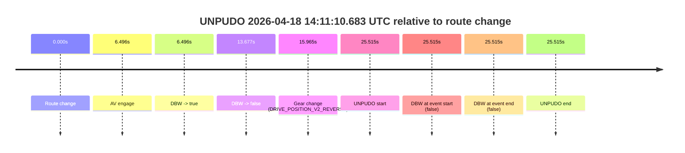
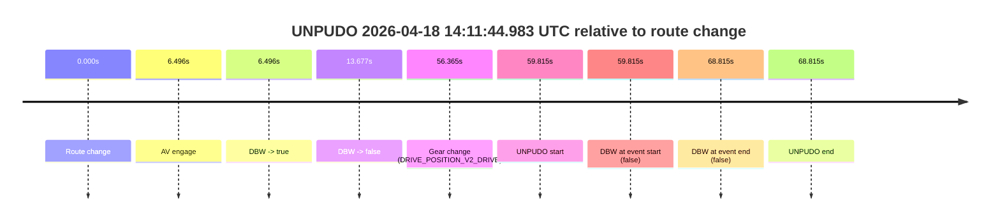
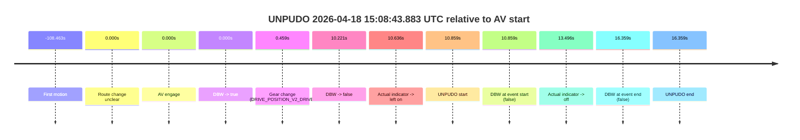
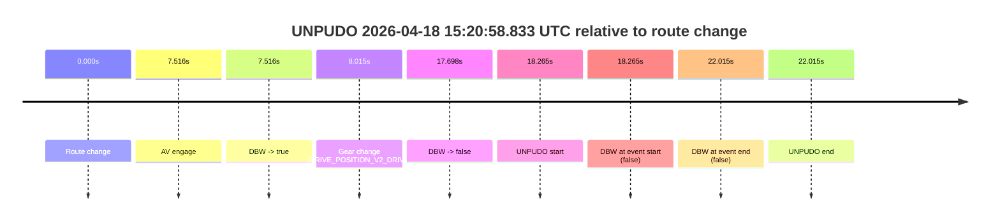
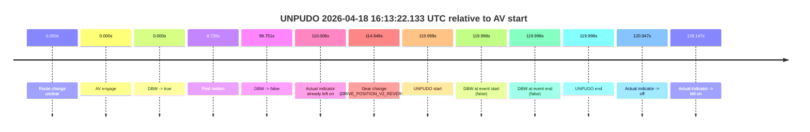

# Run Report: fme20009/2026-04-18--14-00-51--gen2-av-fa240476-d7e6-4183-90da-e8414b3bb819

| Field | Value |
|---|---|
| Run ID | `fme20009/2026-04-18--14-00-51--gen2-av-fa240476-d7e6-4183-90da-e8414b3bb819` |
| Date | `2026-04-18` |
| Model(s) | `pink-manta-ray-smooth` |
| Author | `guy.geva` |
| Event count | `6` |

## unpudo 2026-04-18 14:11:10.683 UTC

| Field | Value |
|---|---|
| Model | `pink-manta-ray-smooth` |
| Author | `guy.geva` |
| Run ID | `fme20009/2026-04-18--14-00-51--gen2-av-fa240476-d7e6-4183-90da-e8414b3bb819` |
| Date | `2026-04-18` |
| Time (UTC) | `14:11:10.683` |
| Event type | `unpudo` |
| Disengagement type | `none observed` |
| Route change | `found` |
| Console | [run](https://console.sso.wayve.ai/run/fme20009/2026-04-18--14-00-51--gen2-av-fa240476-d7e6-4183-90da-e8414b3bb819?id=&time-unixus=1776521470683303) |
| Foxglove | [segment](https://app.foxglove.dev/wayve-on-prem/p/prj_0dX18KZdVHg1fmmI/view?ds=foxglove-stream&ds.deviceName=fme20009&ds.start=2026-04-18T14%3A10%3A35.168263Z&ds.end=2026-04-18T14%3A11%3A20.683303Z&layoutId=lay_0e7VD4WIKDQGU73Y&time=2026-04-18T14%3A11%3A10.683303Z) |

### Event card: fail

- Fail: the credited unpudo does not stay AV-owned. The event window starts with DBW false, and the maneuver outcome lands outside a clean AV-owned segment.

| Event | Time (UTC) | Delta from route change |
|---|---:|---:|
| Route change | 2026-04-18 14:10:45.168 | `0.000s` |
| AV engage | 2026-04-18 14:10:51.664 | `6.496s` |
| DBW -> true | 2026-04-18 14:10:51.664 | `6.496s` |
| DBW -> false | 2026-04-18 14:10:58.844 | `13.677s` |
| Gear change (DRIVE_POSITION_V2_REVERSE) | 2026-04-18 14:11:01.133 | `15.965s` |
| UNPUDO start | 2026-04-18 14:11:10.683 | `25.515s` |
| DBW at event start (false) | 2026-04-18 14:11:10.683 | `25.515s` |
| DBW at event end (false) | 2026-04-18 14:11:10.683 | `25.515s` |
| UNPUDO end | 2026-04-18 14:11:10.683 | `25.515s` |

| Metric | Value |
|---|---|
| Outcome | `fail` |
| Effective failure type | `not_av_owned` |
| Route change status | `found` |
| DBW at event start | `false` |
| DBW at event end | `false` |
| Predicted gear at AV start | `DRIVE_POSITION_V2_REVERSE` |
| Actual gear at AV start | `DRIVE_POSITION_V2_PARK` |
| Predicted gear at event start | `DRIVE_POSITION_V2_REVERSE` |
| Actual gear at event start | `DRIVE_POSITION_V2_REVERSE` |
| Planned indicator direction | `INDICATORS_STATE_V2_OFF` |
| Controller indicator direction | `INDICATORS_STATE_V2_OFF` |
| Actual indicator direction | `INDICATORS_STATE_V2_OFF` |
| Actual indicator at maneuver end | `INDICATORS_STATE_V2_OFF` |
| Driver accel help in AV | `false` |
| Driver accel help timestamp | `n/a` |
| Max accel pedal pct in AV | `0.0%` |
| Max brake pedal pct in AV | `8.0%` |
| Max speed mps in AV | `0.000` |
| Success timing baseline | `route change` |
| Route -> AV | `6.496s` |
| AV -> event start | `19.019s` |
| AV -> first motion | `n/a` |
| Success baseline -> event start | `25.515s` |
| Success baseline -> first motion | `n/a` |
| AV duration before disengagement | `7.180s` |
| Trajectory waypoint count | `36` |
| Driving-plan step count | `11` |

The scored portion starts from the AV-owned window, not from the pre-AV setup. Route-change search in the stopped pre-event segment was `found`, with the baseline therefore set to route change. At the event anchor the model predicts `DRIVE_POSITION_V2_REVERSE` and the actual gear is `DRIVE_POSITION_V2_REVERSE`. The effective model outcome is `fail` because `not_av_owned.`

### Resolution

| Field | Value |
|---|---|
| Final outcome | `fail` |
| Do we agree with this label? | `yes` |
| Source disengagement type | `none observed` |
| Resolved effective failure type | `not_av_owned` |
| Confidence | `high` |

## unpudo 2026-04-18 14:11:44.983 UTC

| Field | Value |
|---|---|
| Model | `pink-manta-ray-smooth` |
| Author | `guy.geva` |
| Run ID | `fme20009/2026-04-18--14-00-51--gen2-av-fa240476-d7e6-4183-90da-e8414b3bb819` |
| Date | `2026-04-18` |
| Time (UTC) | `14:11:44.983` |
| Event type | `unpudo` |
| Disengagement type | `none observed` |
| Route change | `found` |
| Console | [run](https://console.sso.wayve.ai/run/fme20009/2026-04-18--14-00-51--gen2-av-fa240476-d7e6-4183-90da-e8414b3bb819?id=&time-unixus=1776521504983309) |
| Foxglove | [segment](https://app.foxglove.dev/wayve-on-prem/p/prj_0dX18KZdVHg1fmmI/view?ds=foxglove-stream&ds.deviceName=fme20009&ds.start=2026-04-18T14%3A10%3A35.168263Z&ds.end=2026-04-18T14%3A12%3A03.983330Z&layoutId=lay_0e7VD4WIKDQGU73Y&time=2026-04-18T14%3A11%3A44.983309Z) |

### Event card: fail

- Fail: the credited unpudo does not stay AV-owned. The event window starts with DBW false, and the maneuver outcome lands outside a clean AV-owned segment.

| Event | Time (UTC) | Delta from route change |
|---|---:|---:|
| Route change | 2026-04-18 14:10:45.168 | `0.000s` |
| AV engage | 2026-04-18 14:10:51.664 | `6.496s` |
| DBW -> true | 2026-04-18 14:10:51.664 | `6.496s` |
| DBW -> false | 2026-04-18 14:10:58.844 | `13.677s` |
| Gear change (DRIVE_POSITION_V2_DRIVE) | 2026-04-18 14:11:41.533 | `56.365s` |
| UNPUDO start | 2026-04-18 14:11:44.983 | `59.815s` |
| DBW at event start (false) | 2026-04-18 14:11:44.983 | `59.815s` |
| DBW at event end (false) | 2026-04-18 14:11:53.983 | `68.815s` |
| UNPUDO end | 2026-04-18 14:11:53.983 | `68.815s` |

| Metric | Value |
|---|---|
| Outcome | `fail` |
| Effective failure type | `not_av_owned` |
| Route change status | `found` |
| DBW at event start | `false` |
| DBW at event end | `false` |
| Predicted gear at AV start | `DRIVE_POSITION_V2_REVERSE` |
| Actual gear at AV start | `DRIVE_POSITION_V2_PARK` |
| Predicted gear at event start | `DRIVE_POSITION_V2_DRIVE` |
| Actual gear at event start | `DRIVE_POSITION_V2_DRIVE` |
| Planned indicator direction | `INDICATORS_STATE_V2_OFF` |
| Controller indicator direction | `INDICATORS_STATE_V2_OFF` |
| Actual indicator direction | `INDICATORS_STATE_V2_OFF` |
| Actual indicator at maneuver end | `INDICATORS_STATE_V2_OFF` |
| Driver accel help in AV | `false` |
| Driver accel help timestamp | `n/a` |
| Max accel pedal pct in AV | `0.0%` |
| Max brake pedal pct in AV | `8.0%` |
| Max speed mps in AV | `0.000` |
| Success timing baseline | `route change` |
| Route -> AV | `6.496s` |
| AV -> event start | `53.319s` |
| AV -> first motion | `n/a` |
| Success baseline -> event start | `59.815s` |
| Success baseline -> first motion | `n/a` |
| AV duration before disengagement | `7.180s` |
| Trajectory waypoint count | `36` |
| Driving-plan step count | `11` |

The scored portion starts from the AV-owned window, not from the pre-AV setup. Route-change search in the stopped pre-event segment was `found`, with the baseline therefore set to route change. At the event anchor the model predicts `DRIVE_POSITION_V2_DRIVE` and the actual gear is `DRIVE_POSITION_V2_DRIVE`. The effective model outcome is `fail` because `not_av_owned.`

### Resolution

| Field | Value |
|---|---|
| Final outcome | `fail` |
| Do we agree with this label? | `yes` |
| Source disengagement type | `none observed` |
| Resolved effective failure type | `not_av_owned` |
| Confidence | `high` |

## unpudo 2026-04-18 15:08:43.883 UTC

| Field | Value |
|---|---|
| Model | `pink-manta-ray-smooth` |
| Author | `guy.geva` |
| Run ID | `fme20009/2026-04-18--14-00-51--gen2-av-fa240476-d7e6-4183-90da-e8414b3bb819` |
| Date | `2026-04-18` |
| Time (UTC) | `15:08:43.883` |
| Event type | `unpudo` |
| Disengagement type | `none observed` |
| Route change | `unclear` |
| Console | [run](https://console.sso.wayve.ai/run/fme20009/2026-04-18--14-00-51--gen2-av-fa240476-d7e6-4183-90da-e8414b3bb819?id=&time-unixus=1776524923883307) |
| Foxglove | [segment](https://app.foxglove.dev/wayve-on-prem/p/prj_0dX18KZdVHg1fmmI/view?ds=foxglove-stream&ds.deviceName=fme20009&ds.start=2026-04-18T15%3A08%3A23.024796Z&ds.end=2026-04-18T15%3A08%3A59.383304Z&layoutId=lay_0e7VD4WIKDQGU73Y&time=2026-04-18T15%3A08%3A43.883307Z) |

### Event card: fail

- Fail: the credited unpudo does not stay AV-owned. The event window starts with DBW false, and the maneuver outcome lands outside a clean AV-owned segment.

| Event | Time (UTC) | Delta from AV start |
|---|---:|---:|
| First motion | 2026-04-18 15:06:44.561 | `-108.463s` |
| Route change unclear | 2026-04-18 15:08:33.024 | `0.000s` |
| AV engage | 2026-04-18 15:08:33.024 | `0.000s` |
| DBW -> true | 2026-04-18 15:08:33.024 | `0.000s` |
| Gear change (DRIVE_POSITION_V2_DRIVE) | 2026-04-18 15:08:33.483 | `0.459s` |
| DBW -> false | 2026-04-18 15:08:43.245 | `10.221s` |
| Actual indicator -> left on | 2026-04-18 15:08:43.661 | `10.636s` |
| UNPUDO start | 2026-04-18 15:08:43.883 | `10.859s` |
| DBW at event start (false) | 2026-04-18 15:08:43.883 | `10.859s` |
| Actual indicator -> off | 2026-04-18 15:08:46.521 | `13.496s` |
| DBW at event end (false) | 2026-04-18 15:08:49.383 | `16.359s` |
| UNPUDO end | 2026-04-18 15:08:49.383 | `16.359s` |

| Metric | Value |
|---|---|
| Outcome | `fail` |
| Effective failure type | `completed_outside_av` |
| Route change status | `unclear` |
| DBW at event start | `false` |
| DBW at event end | `false` |
| Predicted gear at AV start | `DRIVE_POSITION_V2_DRIVE` |
| Actual gear at AV start | `DRIVE_POSITION_V2_PARK` |
| Predicted gear at event start | `DRIVE_POSITION_V2_DRIVE` |
| Actual gear at event start | `DRIVE_POSITION_V2_DRIVE` |
| Planned indicator direction | `INDICATORS_STATE_V2_LEFT_ON` |
| Controller indicator direction | `INDICATORS_STATE_V2_LEFT_ON` |
| Actual indicator direction | `INDICATORS_STATE_V2_LEFT_ON` |
| Actual indicator at maneuver end | `INDICATORS_STATE_V2_OFF` |
| Driver accel help in AV | `false` |
| Driver accel help timestamp | `n/a` |
| Max accel pedal pct in AV | `0.0%` |
| Max brake pedal pct in AV | `8.0%` |
| Max speed mps in AV | `0.000` |
| Success timing baseline | `AV start` |
| Route -> AV | `n/a` |
| AV -> event start | `10.859s` |
| AV -> first motion | `-108.463s` |
| Success baseline -> event start | `10.859s` |
| Success baseline -> first motion | `-108.463s` |
| AV duration before disengagement | `10.221s` |
| Trajectory waypoint count | `34` |
| Driving-plan step count | `11` |

The scored portion starts from the AV-owned window, not from the pre-AV setup. Route-change search in the stopped pre-event segment was `unclear`, with the baseline therefore set to AV start. At the event anchor the model predicts `DRIVE_POSITION_V2_DRIVE` and the actual gear is `DRIVE_POSITION_V2_DRIVE`. The effective model outcome is `fail` because `completed_outside_av.`

### Resolution

| Field | Value |
|---|---|
| Final outcome | `fail` |
| Do we agree with this label? | `yes` |
| Source disengagement type | `none observed` |
| Resolved effective failure type | `completed_outside_av` |
| Confidence | `medium` |

## unpudo 2026-04-18 15:14:30.733 UTC

| Field | Value |
|---|---|
| Model | `pink-manta-ray-smooth` |
| Author | `guy.geva` |
| Run ID | `fme20009/2026-04-18--14-00-51--gen2-av-fa240476-d7e6-4183-90da-e8414b3bb819` |
| Date | `2026-04-18` |
| Time (UTC) | `15:14:30.733` |
| Event type | `unpudo` |
| Disengagement type | `none observed` |
| Route change | `found` |
| Console | [run](https://console.sso.wayve.ai/run/fme20009/2026-04-18--14-00-51--gen2-av-fa240476-d7e6-4183-90da-e8414b3bb819?id=&time-unixus=1776525270733313) |
| Foxglove | [segment](https://app.foxglove.dev/wayve-on-prem/p/prj_0dX18KZdVHg1fmmI/view?ds=foxglove-stream&ds.deviceName=fme20009&ds.start=2026-04-18T15%3A13%3A53.818315Z&ds.end=2026-04-18T15%3A14%3A45.683325Z&layoutId=lay_0e7VD4WIKDQGU73Y&time=2026-04-18T15%3A14%3A30.733313Z) |

### Event card: fail

- Fail: the credited unpudo does not stay AV-owned. The event window starts with DBW false, and the maneuver outcome lands outside a clean AV-owned segment.

| Event | Time (UTC) | Delta from route change |
|---|---:|---:|
| Route change | 2026-04-18 15:14:03.818 | `0.000s` |
| AV engage | 2026-04-18 15:14:21.984 | `18.167s` |
| DBW -> true | 2026-04-18 15:14:21.984 | `18.167s` |
| Gear change (DRIVE_POSITION_V2_DRIVE) | 2026-04-18 15:14:22.483 | `18.665s` |
| DBW -> false | 2026-04-18 15:14:30.106 | `26.288s` |
| UNPUDO start | 2026-04-18 15:14:30.733 | `26.915s` |
| DBW at event start (false) | 2026-04-18 15:14:30.733 | `26.915s` |
| DBW at event end (false) | 2026-04-18 15:14:35.683 | `31.865s` |
| UNPUDO end | 2026-04-18 15:14:35.683 | `31.865s` |

| Metric | Value |
|---|---|
| Outcome | `fail` |
| Effective failure type | `not_av_owned` |
| Route change status | `found` |
| DBW at event start | `false` |
| DBW at event end | `false` |
| Predicted gear at AV start | `DRIVE_POSITION_V2_DRIVE` |
| Actual gear at AV start | `DRIVE_POSITION_V2_PARK` |
| Predicted gear at event start | `DRIVE_POSITION_V2_DRIVE` |
| Actual gear at event start | `DRIVE_POSITION_V2_DRIVE` |
| Planned indicator direction | `INDICATORS_STATE_V2_RIGHT_ON` |
| Controller indicator direction | `INDICATORS_STATE_V2_RIGHT_ON` |
| Actual indicator direction | `INDICATORS_STATE_V2_OFF` |
| Actual indicator at maneuver end | `INDICATORS_STATE_V2_OFF` |
| Driver accel help in AV | `false` |
| Driver accel help timestamp | `n/a` |
| Max accel pedal pct in AV | `0.0%` |
| Max brake pedal pct in AV | `9.6%` |
| Max speed mps in AV | `0.000` |
| Success timing baseline | `route change` |
| Route -> AV | `18.167s` |
| AV -> event start | `8.748s` |
| AV -> first motion | `n/a` |
| Success baseline -> event start | `26.915s` |
| Success baseline -> first motion | `n/a` |
| AV duration before disengagement | `8.121s` |
| Trajectory waypoint count | `35` |
| Driving-plan step count | `11` |

The scored portion starts from the AV-owned window, not from the pre-AV setup. Route-change search in the stopped pre-event segment was `found`, with the baseline therefore set to route change. At the event anchor the model predicts `DRIVE_POSITION_V2_DRIVE` and the actual gear is `DRIVE_POSITION_V2_DRIVE`. The effective model outcome is `fail` because `not_av_owned.`

### Resolution

| Field | Value |
|---|---|
| Final outcome | `fail` |
| Do we agree with this label? | `yes` |
| Source disengagement type | `none observed` |
| Resolved effective failure type | `not_av_owned` |
| Confidence | `high` |

## unpudo 2026-04-18 15:20:58.833 UTC

| Field | Value |
|---|---|
| Model | `pink-manta-ray-smooth` |
| Author | `guy.geva` |
| Run ID | `fme20009/2026-04-18--14-00-51--gen2-av-fa240476-d7e6-4183-90da-e8414b3bb819` |
| Date | `2026-04-18` |
| Time (UTC) | `15:20:58.833` |
| Event type | `unpudo` |
| Disengagement type | `none observed` |
| Route change | `found` |
| Console | [run](https://console.sso.wayve.ai/run/fme20009/2026-04-18--14-00-51--gen2-av-fa240476-d7e6-4183-90da-e8414b3bb819?id=&time-unixus=1776525658833308) |
| Foxglove | [segment](https://app.foxglove.dev/wayve-on-prem/p/prj_0dX18KZdVHg1fmmI/view?ds=foxglove-stream&ds.deviceName=fme20009&ds.start=2026-04-18T15%3A20%3A30.568346Z&ds.end=2026-04-18T15%3A21%3A12.583303Z&layoutId=lay_0e7VD4WIKDQGU73Y&time=2026-04-18T15%3A20%3A58.833308Z) |

### Event card: fail

- Fail: the credited unpudo does not stay AV-owned. The event window starts with DBW false, and the maneuver outcome lands outside a clean AV-owned segment.

| Event | Time (UTC) | Delta from route change |
|---|---:|---:|
| Route change | 2026-04-18 15:20:40.568 | `0.000s` |
| AV engage | 2026-04-18 15:20:48.084 | `7.516s` |
| DBW -> true | 2026-04-18 15:20:48.084 | `7.516s` |
| Gear change (DRIVE_POSITION_V2_DRIVE) | 2026-04-18 15:20:48.583 | `8.015s` |
| DBW -> false | 2026-04-18 15:20:58.266 | `17.698s` |
| UNPUDO start | 2026-04-18 15:20:58.833 | `18.265s` |
| DBW at event start (false) | 2026-04-18 15:20:58.833 | `18.265s` |
| DBW at event end (false) | 2026-04-18 15:21:02.583 | `22.015s` |
| UNPUDO end | 2026-04-18 15:21:02.583 | `22.015s` |

| Metric | Value |
|---|---|
| Outcome | `fail` |
| Effective failure type | `not_av_owned` |
| Route change status | `found` |
| DBW at event start | `false` |
| DBW at event end | `false` |
| Predicted gear at AV start | `DRIVE_POSITION_V2_DRIVE` |
| Actual gear at AV start | `DRIVE_POSITION_V2_PARK` |
| Predicted gear at event start | `DRIVE_POSITION_V2_DRIVE` |
| Actual gear at event start | `DRIVE_POSITION_V2_DRIVE` |
| Planned indicator direction | `INDICATORS_STATE_V2_RIGHT_ON` |
| Controller indicator direction | `INDICATORS_STATE_V2_RIGHT_ON` |
| Actual indicator direction | `INDICATORS_STATE_V2_OFF` |
| Actual indicator at maneuver end | `INDICATORS_STATE_V2_OFF` |
| Driver accel help in AV | `false` |
| Driver accel help timestamp | `n/a` |
| Max accel pedal pct in AV | `0.0%` |
| Max brake pedal pct in AV | `8.0%` |
| Max speed mps in AV | `0.000` |
| Success timing baseline | `route change` |
| Route -> AV | `7.516s` |
| AV -> event start | `10.749s` |
| AV -> first motion | `n/a` |
| Success baseline -> event start | `18.265s` |
| Success baseline -> first motion | `n/a` |
| AV duration before disengagement | `10.182s` |
| Trajectory waypoint count | `35` |
| Driving-plan step count | `11` |

The scored portion starts from the AV-owned window, not from the pre-AV setup. Route-change search in the stopped pre-event segment was `found`, with the baseline therefore set to route change. At the event anchor the model predicts `DRIVE_POSITION_V2_DRIVE` and the actual gear is `DRIVE_POSITION_V2_DRIVE`. The effective model outcome is `fail` because `not_av_owned.`

### Resolution

| Field | Value |
|---|---|
| Final outcome | `fail` |
| Do we agree with this label? | `yes` |
| Source disengagement type | `none observed` |
| Resolved effective failure type | `not_av_owned` |
| Confidence | `high` |

## unpudo 2026-04-18 16:13:22.133 UTC

| Field | Value |
|---|---|
| Model | `pink-manta-ray-smooth` |
| Author | `guy.geva` |
| Run ID | `fme20009/2026-04-18--14-00-51--gen2-av-fa240476-d7e6-4183-90da-e8414b3bb819` |
| Date | `2026-04-18` |
| Time (UTC) | `16:13:22.133` |
| Event type | `unpudo` |
| Disengagement type | `none observed` |
| Route change | `unclear` |
| Console | [run](https://console.sso.wayve.ai/run/fme20009/2026-04-18--14-00-51--gen2-av-fa240476-d7e6-4183-90da-e8414b3bb819?id=&time-unixus=1776528802133292) |
| Foxglove | [segment](https://app.foxglove.dev/wayve-on-prem/p/prj_0dX18KZdVHg1fmmI/view?ds=foxglove-stream&ds.deviceName=fme20009&ds.start=2026-04-18T16%3A11%3A12.134839Z&ds.end=2026-04-18T16%3A13%3A32.133292Z&layoutId=lay_0e7VD4WIKDQGU73Y&time=2026-04-18T16%3A13%3A22.133292Z) |

### Event card: fail

- Fail: the credited unpudo does not stay AV-owned. The event window starts with DBW false, and the maneuver outcome lands outside a clean AV-owned segment.

| Event | Time (UTC) | Delta from AV start |
|---|---:|---:|
| Route change unclear | 2026-04-18 16:11:22.134 | `0.000s` |
| AV engage | 2026-04-18 16:11:22.134 | `0.000s` |
| DBW -> true | 2026-04-18 16:11:22.134 | `0.000s` |
| First motion | 2026-04-18 16:11:30.861 | `8.726s` |
| DBW -> false | 2026-04-18 16:13:00.885 | `98.751s` |
| Actual indicator already left on | 2026-04-18 16:13:12.141 | `110.006s` |
| Gear change (DRIVE_POSITION_V2_REVERSE) | 2026-04-18 16:13:16.783 | `114.648s` |
| UNPUDO start | 2026-04-18 16:13:22.133 | `119.998s` |
| DBW at event start (false) | 2026-04-18 16:13:22.133 | `119.998s` |
| DBW at event end (false) | 2026-04-18 16:13:22.133 | `119.998s` |
| UNPUDO end | 2026-04-18 16:13:22.133 | `119.998s` |
| Actual indicator -> off | 2026-04-18 16:13:23.081 | `120.947s` |
| Actual indicator -> left on | 2026-04-18 16:13:41.281 | `139.147s` |

| Metric | Value |
|---|---|
| Outcome | `fail` |
| Effective failure type | `not_av_owned` |
| Route change status | `unclear` |
| DBW at event start | `false` |
| DBW at event end | `false` |
| Predicted gear at AV start | `DRIVE_POSITION_V2_DRIVE` |
| Actual gear at AV start | `DRIVE_POSITION_V2_DRIVE` |
| Predicted gear at event start | `DRIVE_POSITION_V2_REVERSE` |
| Actual gear at event start | `DRIVE_POSITION_V2_REVERSE` |
| Planned indicator direction | `INDICATORS_STATE_V2_OFF` |
| Controller indicator direction | `INDICATORS_STATE_V2_OFF` |
| Actual indicator direction | `INDICATORS_STATE_V2_LEFT_ON` |
| Actual indicator at maneuver end | `INDICATORS_STATE_V2_LEFT_ON` |
| Driver accel help in AV | `false` |
| Driver accel help timestamp | `n/a` |
| Max accel pedal pct in AV | `0.0%` |
| Max brake pedal pct in AV | `8.0%` |
| Max speed mps in AV | `7.544` |
| Success timing baseline | `AV start` |
| Route -> AV | `n/a` |
| AV -> event start | `119.998s` |
| AV -> first motion | `8.726s` |
| Success baseline -> event start | `119.998s` |
| Success baseline -> first motion | `8.726s` |
| AV duration before disengagement | `98.751s` |
| Trajectory waypoint count | `35` |
| Driving-plan step count | `11` |

The scored portion starts from the AV-owned window, not from the pre-AV setup. Route-change search in the stopped pre-event segment was `unclear`, with the baseline therefore set to AV start. At the event anchor the model predicts `DRIVE_POSITION_V2_REVERSE` and the actual gear is `DRIVE_POSITION_V2_REVERSE`. The effective model outcome is `fail` because `not_av_owned.`

### Resolution

| Field | Value |
|---|---|
| Final outcome | `fail` |
| Do we agree with this label? | `yes` |
| Source disengagement type | `none observed` |
| Resolved effective failure type | `not_av_owned` |
| Confidence | `medium` |
