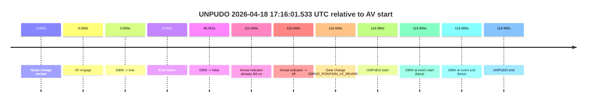
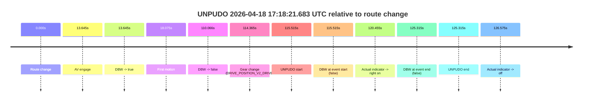
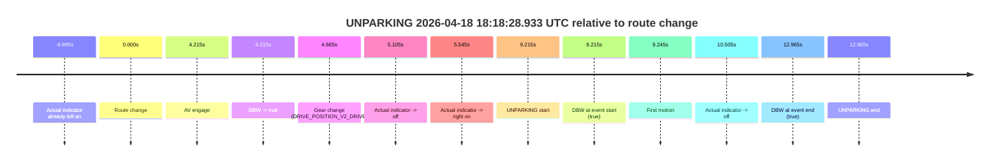

# Run Report: fme20009/2026-04-18--16-58-08--gen2-av-4a983ca6-b715-4fe9-8900-652e1c19580d

| Field | Value |
|---|---|
| Run ID | `fme20009/2026-04-18--16-58-08--gen2-av-4a983ca6-b715-4fe9-8900-652e1c19580d` |
| Date | `2026-04-18` |
| Model(s) | `pink-manta-ray-smooth` |
| Author | `guy.geva` |
| Event count | `3` |

## unpudo 2026-04-18 17:16:01.533 UTC

| Field | Value |
|---|---|
| Model | `pink-manta-ray-smooth` |
| Author | `guy.geva` |
| Run ID | `fme20009/2026-04-18--16-58-08--gen2-av-4a983ca6-b715-4fe9-8900-652e1c19580d` |
| Date | `2026-04-18` |
| Time (UTC) | `17:16:01.533` |
| Event type | `unpudo` |
| Disengagement type | `none observed` |
| Route change | `unclear` |
| Console | [run](https://console.sso.wayve.ai/run/fme20009/2026-04-18--16-58-08--gen2-av-4a983ca6-b715-4fe9-8900-652e1c19580d?id=&time-unixus=1776532561533296) |
| Foxglove | [segment](https://app.foxglove.dev/wayve-on-prem/p/prj_0dX18KZdVHg1fmmI/view?ds=foxglove-stream&ds.deviceName=fme20009&ds.start=2026-04-18T17%3A13%3A51.542944Z&ds.end=2026-04-18T17%3A16%3A11.533296Z&layoutId=lay_0e7VD4WIKDQGU73Y&time=2026-04-18T17%3A16%3A01.533296Z) |

### Event card: fail

- Fail: the credited unpudo does not stay AV-owned. The event window starts with DBW false, and the maneuver outcome lands outside a clean AV-owned segment.

| Event | Time (UTC) | Delta from AV start |
|---|---:|---:|
| Route change unclear | 2026-04-18 17:14:01.542 | `0.000s` |
| AV engage | 2026-04-18 17:14:01.542 | `0.000s` |
| DBW -> true | 2026-04-18 17:14:01.542 | `0.000s` |
| First motion | 2026-04-18 17:14:01.543 | `0.000s` |
| DBW -> false | 2026-04-18 17:14:47.594 | `46.051s` |
| Actual indicator already left on | 2026-04-18 17:15:51.543 | `110.000s` |
| Actual indicator -> off | 2026-04-18 17:15:51.983 | `110.440s` |
| Gear change (DRIVE_POSITION_V2_REVERSE) | 2026-04-18 17:15:57.583 | `116.040s` |
| UNPUDO start | 2026-04-18 17:16:01.533 | `119.990s` |
| DBW at event start (false) | 2026-04-18 17:16:01.533 | `119.990s` |
| DBW at event end (false) | 2026-04-18 17:16:01.533 | `119.990s` |
| UNPUDO end | 2026-04-18 17:16:01.533 | `119.990s` |

| Metric | Value |
|---|---|
| Outcome | `fail` |
| Effective failure type | `not_av_owned` |
| Route change status | `unclear` |
| DBW at event start | `false` |
| DBW at event end | `false` |
| Predicted gear at AV start | `DRIVE_POSITION_V2_DRIVE` |
| Actual gear at AV start | `DRIVE_POSITION_V2_DRIVE` |
| Predicted gear at event start | `DRIVE_POSITION_V2_REVERSE` |
| Actual gear at event start | `DRIVE_POSITION_V2_REVERSE` |
| Planned indicator direction | `INDICATORS_STATE_V2_OFF` |
| Controller indicator direction | `INDICATORS_STATE_V2_OFF` |
| Actual indicator direction | `INDICATORS_STATE_V2_OFF` |
| Actual indicator at maneuver end | `INDICATORS_STATE_V2_OFF` |
| Driver accel help in AV | `false` |
| Driver accel help timestamp | `n/a` |
| Max accel pedal pct in AV | `0.0%` |
| Max brake pedal pct in AV | `8.0%` |
| Max speed mps in AV | `2.869` |
| Success timing baseline | `AV start` |
| Route -> AV | `n/a` |
| AV -> event start | `119.990s` |
| AV -> first motion | `0.000s` |
| Success baseline -> event start | `119.990s` |
| Success baseline -> first motion | `0.000s` |
| AV duration before disengagement | `46.051s` |
| Trajectory waypoint count | `36` |
| Driving-plan step count | `11` |

The scored portion starts from the AV-owned window, not from the pre-AV setup. Route-change search in the stopped pre-event segment was `unclear`, with the baseline therefore set to AV start. At the event anchor the model predicts `DRIVE_POSITION_V2_REVERSE` and the actual gear is `DRIVE_POSITION_V2_REVERSE`. The effective model outcome is `fail` because `not_av_owned.`

### Resolution

| Field | Value |
|---|---|
| Final outcome | `fail` |
| Do we agree with this label? | `yes` |
| Source disengagement type | `none observed` |
| Resolved effective failure type | `not_av_owned` |
| Confidence | `medium` |

## unpudo 2026-04-18 17:18:21.683 UTC

| Field | Value |
|---|---|
| Model | `pink-manta-ray-smooth` |
| Author | `guy.geva` |
| Run ID | `fme20009/2026-04-18--16-58-08--gen2-av-4a983ca6-b715-4fe9-8900-652e1c19580d` |
| Date | `2026-04-18` |
| Time (UTC) | `17:18:21.683` |
| Event type | `unpudo` |
| Disengagement type | `none observed` |
| Route change | `found` |
| Console | [run](https://console.sso.wayve.ai/run/fme20009/2026-04-18--16-58-08--gen2-av-4a983ca6-b715-4fe9-8900-652e1c19580d?id=&time-unixus=1776532701683308) |
| Foxglove | [segment](https://app.foxglove.dev/wayve-on-prem/p/prj_0dX18KZdVHg1fmmI/view?ds=foxglove-stream&ds.deviceName=fme20009&ds.start=2026-04-18T17%3A16%3A16.168281Z&ds.end=2026-04-18T17%3A18%3A41.483306Z&layoutId=lay_0e7VD4WIKDQGU73Y&time=2026-04-18T17%3A18%3A21.683308Z) |

### Event card: fail

- Fail: the credited unpudo does not stay AV-owned. The event window starts with DBW false, and the maneuver outcome lands outside a clean AV-owned segment.

| Event | Time (UTC) | Delta from route change |
|---|---:|---:|
| Route change | 2026-04-18 17:16:26.168 | `0.000s` |
| AV engage | 2026-04-18 17:16:39.813 | `13.645s` |
| DBW -> true | 2026-04-18 17:16:39.813 | `13.645s` |
| First motion | 2026-04-18 17:16:44.243 | `18.075s` |
| DBW -> false | 2026-04-18 17:18:16.233 | `110.066s` |
| Gear change (DRIVE_POSITION_V2_DRIVE) | 2026-04-18 17:18:20.533 | `114.365s` |
| UNPUDO start | 2026-04-18 17:18:21.683 | `115.515s` |
| DBW at event start (false) | 2026-04-18 17:18:21.683 | `115.515s` |
| Actual indicator -> right on | 2026-04-18 17:18:26.623 | `120.455s` |
| DBW at event end (false) | 2026-04-18 17:18:31.483 | `125.315s` |
| UNPUDO end | 2026-04-18 17:18:31.483 | `125.315s` |
| Actual indicator -> off | 2026-04-18 17:18:32.743 | `126.575s` |

| Metric | Value |
|---|---|
| Outcome | `fail` |
| Effective failure type | `not_av_owned` |
| Route change status | `found` |
| DBW at event start | `false` |
| DBW at event end | `false` |
| Predicted gear at AV start | `DRIVE_POSITION_V2_DRIVE` |
| Actual gear at AV start | `DRIVE_POSITION_V2_PARK` |
| Predicted gear at event start | `DRIVE_POSITION_V2_DRIVE` |
| Actual gear at event start | `DRIVE_POSITION_V2_DRIVE` |
| Planned indicator direction | `INDICATORS_STATE_V2_OFF` |
| Controller indicator direction | `INDICATORS_STATE_V2_OFF` |
| Actual indicator direction | `INDICATORS_STATE_V2_OFF` |
| Actual indicator at maneuver end | `INDICATORS_STATE_V2_RIGHT_ON` |
| Driver accel help in AV | `false` |
| Driver accel help timestamp | `n/a` |
| Max accel pedal pct in AV | `0.0%` |
| Max brake pedal pct in AV | `11.0%` |
| Max speed mps in AV | `7.081` |
| Success timing baseline | `route change` |
| Route -> AV | `13.645s` |
| AV -> event start | `101.870s` |
| AV -> first motion | `4.430s` |
| Success baseline -> event start | `115.515s` |
| Success baseline -> first motion | `18.075s` |
| AV duration before disengagement | `96.421s` |
| Trajectory waypoint count | `37` |
| Driving-plan step count | `11` |

The scored portion starts from the AV-owned window, not from the pre-AV setup. Route-change search in the stopped pre-event segment was `found`, with the baseline therefore set to route change. At the event anchor the model predicts `DRIVE_POSITION_V2_DRIVE` and the actual gear is `DRIVE_POSITION_V2_DRIVE`. The effective model outcome is `fail` because `not_av_owned.`

### Resolution

| Field | Value |
|---|---|
| Final outcome | `fail` |
| Do we agree with this label? | `yes` |
| Source disengagement type | `none observed` |
| Resolved effective failure type | `not_av_owned` |
| Confidence | `high` |

## unparking 2026-04-18 18:18:28.933 UTC

| Field | Value |
|---|---|
| Model | `pink-manta-ray-smooth` |
| Author | `guy.geva` |
| Run ID | `fme20009/2026-04-18--16-58-08--gen2-av-4a983ca6-b715-4fe9-8900-652e1c19580d` |
| Date | `2026-04-18` |
| Time (UTC) | `18:18:28.933` |
| Event type | `unparking` |
| Disengagement type | `none observed` |
| Route change | `found` |
| Console | [run](https://console.sso.wayve.ai/run/fme20009/2026-04-18--16-58-08--gen2-av-4a983ca6-b715-4fe9-8900-652e1c19580d?id=&time-unixus=1776536308933333) |
| Foxglove | [segment](https://app.foxglove.dev/wayve-on-prem/p/prj_0dX18KZdVHg1fmmI/view?ds=foxglove-stream&ds.deviceName=fme20009&ds.start=2026-04-18T18%3A18%3A09.718284Z&ds.end=2026-04-18T18%3A18%3A42.683319Z&layoutId=lay_0e7VD4WIKDQGU73Y&time=2026-04-18T18%3A18%3A28.933333Z) |

### Event card: pass

- Pass: AV owns the credited unparking through the official event window, the gear state is aligned at the anchor, and the vehicle moves without driver accelerator help in AV.

| Event | Time (UTC) | Delta from route change |
|---|---:|---:|
| Actual indicator already left on | 2026-04-18 18:18:09.723 | `-9.995s` |
| Route change | 2026-04-18 18:18:19.718 | `0.000s` |
| AV engage | 2026-04-18 18:18:23.933 | `4.215s` |
| DBW -> true | 2026-04-18 18:18:23.933 | `4.215s` |
| Gear change (DRIVE_POSITION_V2_DRIVE) | 2026-04-18 18:18:24.383 | `4.665s` |
| Actual indicator -> off | 2026-04-18 18:18:24.823 | `5.105s` |
| Actual indicator -> right on | 2026-04-18 18:18:25.263 | `5.545s` |
| UNPARKING start | 2026-04-18 18:18:28.933 | `9.215s` |
| DBW at event start (true) | 2026-04-18 18:18:28.933 | `9.215s` |
| First motion | 2026-04-18 18:18:28.963 | `9.245s` |
| Actual indicator -> off | 2026-04-18 18:18:30.223 | `10.505s` |
| DBW at event end (true) | 2026-04-18 18:18:32.683 | `12.965s` |
| UNPARKING end | 2026-04-18 18:18:32.683 | `12.965s` |

| Metric | Value |
|---|---|
| Outcome | `pass` |
| Effective failure type | `none` |
| Route change status | `found` |
| DBW at event start | `true` |
| DBW at event end | `true` |
| Predicted gear at AV start | `DRIVE_POSITION_V2_DRIVE` |
| Actual gear at AV start | `DRIVE_POSITION_V2_PARK` |
| Predicted gear at event start | `DRIVE_POSITION_V2_DRIVE` |
| Actual gear at event start | `DRIVE_POSITION_V2_DRIVE` |
| Planned indicator direction | `INDICATORS_STATE_V2_RIGHT_ON` |
| Controller indicator direction | `INDICATORS_STATE_V2_RIGHT_ON` |
| Actual indicator direction | `INDICATORS_STATE_V2_RIGHT_ON` |
| Actual indicator at maneuver end | `INDICATORS_STATE_V2_OFF` |
| Driver accel help in AV | `false` |
| Driver accel help timestamp | `n/a` |
| Max accel pedal pct in AV | `0.0%` |
| Max brake pedal pct in AV | `0.0%` |
| Max speed mps in AV | `4.467` |
| Success timing baseline | `route change` |
| Route -> AV | `4.215s` |
| AV -> event start | `5.000s` |
| AV -> first motion | `5.030s` |
| Success baseline -> event start | `9.215s` |
| Success baseline -> first motion | `9.245s` |
| AV duration before disengagement | `n/a` |
| Trajectory waypoint count | `36` |
| Driving-plan step count | `11` |

The scored portion starts from the AV-owned window, not from the pre-AV setup. Route-change search in the stopped pre-event segment was `found`, with the baseline therefore set to route change. At the event anchor the model predicts `DRIVE_POSITION_V2_DRIVE` and the actual gear is `DRIVE_POSITION_V2_DRIVE`. The effective model outcome is `pass` because `the credited maneuver stays AV-owned through the official event end.`

### Resolution

| Field | Value |
|---|---|
| Final outcome | `pass` |
| Do we agree with this label? | `yes` |
| Source disengagement type | `none observed` |
| Resolved effective failure type | `none` |
| Confidence | `high` |
