# Run Report: fme20009/2026-04-19--05-51-41--gen2-av-de5cf318-085d-434c-bbad-44a85d521e9e

| Field | Value |
|---|---|
| Run ID | `fme20009/2026-04-19--05-51-41--gen2-av-de5cf318-085d-434c-bbad-44a85d521e9e` |
| Date | `2026-04-19` |
| Model(s) | `armadillo-amethyst-squeaky` |
| Author | `guy.geva` |
| Event count | `13` |

## unpudo 2026-04-19 06:05:36.083 UTC

| Field | Value |
|---|---|
| Model | `armadillo-amethyst-squeaky` |
| Author | `guy.geva` |
| Run ID | `fme20009/2026-04-19--05-51-41--gen2-av-de5cf318-085d-434c-bbad-44a85d521e9e` |
| Date | `2026-04-19` |
| Time (UTC) | `06:05:36.083` |
| Event type | `unpudo` |
| Disengagement type | `none observed` |
| Route change | `found` |
| Console | [run](https://console.sso.wayve.ai/run/fme20009/2026-04-19--05-51-41--gen2-av-de5cf318-085d-434c-bbad-44a85d521e9e?id=&time-unixus=1776578736083308) |
| Foxglove | [segment](https://app.foxglove.dev/wayve-on-prem/p/prj_0dX18KZdVHg1fmmI/view?ds=foxglove-stream&ds.deviceName=fme20009&ds.start=2026-04-19T06%3A03%3A56.268262Z&ds.end=2026-04-19T06%3A05%3A46.083308Z&layoutId=lay_0e7VD4WIKDQGU73Y&time=2026-04-19T06%3A05%3A36.083308Z) |

### Event card: fail

- Fail: the credited unpudo does not stay AV-owned. The event window starts with DBW false, and the maneuver outcome lands outside a clean AV-owned segment.

| Event | Time (UTC) | Delta from route change |
|---|---:|---:|
| Route change | 2026-04-19 06:04:06.268 | `0.000s` |
| Actual indicator -> right on | 2026-04-19 06:04:11.460 | `5.192s` |
| First motion | 2026-04-19 06:04:12.720 | `6.452s` |
| Actual indicator -> off | 2026-04-19 06:04:13.960 | `7.692s` |
| Actual indicator -> right on | 2026-04-19 06:04:15.400 | `9.132s` |
| Actual indicator -> off | 2026-04-19 06:04:17.299 | `11.032s` |
| AV engage | 2026-04-19 06:04:23.146 | `16.878s` |
| DBW -> true | 2026-04-19 06:04:23.146 | `16.878s` |
| Gear change (DRIVE_POSITION_V2_DRIVE) | 2026-04-19 06:05:18.283 | `72.015s` |
| DBW -> false | 2026-04-19 06:05:22.867 | `76.599s` |
| UNPUDO start | 2026-04-19 06:05:36.083 | `89.815s` |
| DBW at event start (false) | 2026-04-19 06:05:36.083 | `89.815s` |
| DBW at event end (false) | 2026-04-19 06:05:36.083 | `89.815s` |
| UNPUDO end | 2026-04-19 06:05:36.083 | `89.815s` |

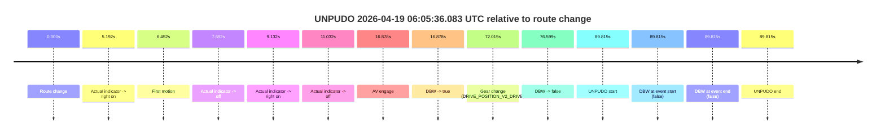

| Metric | Value |
|---|---|
| Outcome | `fail` |
| Effective failure type | `completed_outside_av` |
| Route change status | `found` |
| DBW at event start | `false` |
| DBW at event end | `false` |
| Predicted gear at AV start | `DRIVE_POSITION_V2_DRIVE` |
| Actual gear at AV start | `DRIVE_POSITION_V2_DRIVE` |
| Predicted gear at event start | `DRIVE_POSITION_V2_DRIVE` |
| Actual gear at event start | `DRIVE_POSITION_V2_DRIVE` |
| Planned indicator direction | `INDICATORS_STATE_V2_OFF` |
| Controller indicator direction | `INDICATORS_STATE_V2_OFF` |
| Actual indicator direction | `INDICATORS_STATE_V2_OFF` |
| Actual indicator at maneuver end | `INDICATORS_STATE_V2_OFF` |
| Driver accel help in AV | `false` |
| Driver accel help timestamp | `n/a` |
| Max accel pedal pct in AV | `0.0%` |
| Max brake pedal pct in AV | `17.9%` |
| Max speed mps in AV | `7.408` |
| Success timing baseline | `route change` |
| Route -> AV | `16.878s` |
| AV -> event start | `72.937s` |
| AV -> first motion | `-10.427s` |
| Success baseline -> event start | `89.815s` |
| Success baseline -> first motion | `6.452s` |
| AV duration before disengagement | `59.721s` |
| Trajectory waypoint count | `36` |
| Driving-plan step count | `11` |

The scored portion starts from the AV-owned window, not from the pre-AV setup. Route-change search in the stopped pre-event segment was `found`, with the baseline therefore set to route change. At the event anchor the model predicts `DRIVE_POSITION_V2_DRIVE` and the actual gear is `DRIVE_POSITION_V2_DRIVE`. The effective model outcome is `fail` because `completed_outside_av.`

### Resolution

| Field | Value |
|---|---|
| Final outcome | `fail` |
| Do we agree with this label? | `yes` |
| Source disengagement type | `none observed` |
| Resolved effective failure type | `completed_outside_av` |
| Confidence | `high` |

## unpudo 2026-04-19 06:12:49.283 UTC

| Field | Value |
|---|---|
| Model | `armadillo-amethyst-squeaky` |
| Author | `guy.geva` |
| Run ID | `fme20009/2026-04-19--05-51-41--gen2-av-de5cf318-085d-434c-bbad-44a85d521e9e` |
| Date | `2026-04-19` |
| Time (UTC) | `06:12:49.283` |
| Event type | `unpudo` |
| Disengagement type | `none observed` |
| Route change | `unclear` |
| Console | [run](https://console.sso.wayve.ai/run/fme20009/2026-04-19--05-51-41--gen2-av-de5cf318-085d-434c-bbad-44a85d521e9e?id=&time-unixus=1776579169283308) |
| Foxglove | [segment](https://app.foxglove.dev/wayve-on-prem/p/prj_0dX18KZdVHg1fmmI/view?ds=foxglove-stream&ds.deviceName=fme20009&ds.start=2026-04-19T06%3A10%3A39.287870Z&ds.end=2026-04-19T06%3A13%3A32.933315Z&layoutId=lay_0e7VD4WIKDQGU73Y&time=2026-04-19T06%3A12%3A49.283308Z) |

### Event card: fail

- Fail: the credited unpudo does not stay AV-owned. The event window starts with DBW false, and the maneuver outcome lands outside a clean AV-owned segment.

| Event | Time (UTC) | Delta from AV start |
|---|---:|---:|
| Route change unclear | 2026-04-19 06:10:49.287 | `0.000s` |
| AV engage | 2026-04-19 06:10:49.287 | `0.000s` |
| DBW -> true | 2026-04-19 06:10:49.287 | `0.000s` |
| First motion | 2026-04-19 06:11:06.500 | `17.212s` |
| DBW -> false | 2026-04-19 06:12:43.387 | `114.099s` |
| Gear change (DRIVE_POSITION_V2_DRIVE) | 2026-04-19 06:12:47.583 | `118.295s` |
| UNPUDO start | 2026-04-19 06:12:49.283 | `119.995s` |
| DBW at event start (false) | 2026-04-19 06:12:49.283 | `119.995s` |
| Actual indicator -> left on | 2026-04-19 06:13:00.120 | `130.832s` |
| DBW at event end (false) | 2026-04-19 06:13:22.933 | `153.645s` |
| UNPUDO end | 2026-04-19 06:13:22.933 | `153.645s` |
| Actual indicator -> off | 2026-04-19 06:13:27.860 | `158.573s` |
| Actual indicator -> left on | 2026-04-19 06:13:28.280 | `158.992s` |
| Actual indicator -> off | 2026-04-19 06:13:29.820 | `160.532s` |
| Actual indicator -> left on | 2026-04-19 06:13:30.079 | `160.792s` |
| Actual indicator -> off | 2026-04-19 06:13:34.640 | `165.353s` |
| Actual indicator -> right on | 2026-04-19 06:13:41.980 | `172.693s` |

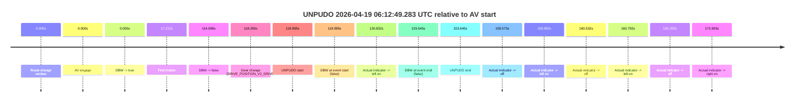

| Metric | Value |
|---|---|
| Outcome | `fail` |
| Effective failure type | `not_av_owned` |
| Route change status | `unclear` |
| DBW at event start | `false` |
| DBW at event end | `false` |
| Predicted gear at AV start | `DRIVE_POSITION_V2_DRIVE` |
| Actual gear at AV start | `DRIVE_POSITION_V2_DRIVE` |
| Predicted gear at event start | `DRIVE_POSITION_V2_DRIVE` |
| Actual gear at event start | `DRIVE_POSITION_V2_DRIVE` |
| Planned indicator direction | `INDICATORS_STATE_V2_OFF` |
| Controller indicator direction | `INDICATORS_STATE_V2_OFF` |
| Actual indicator direction | `INDICATORS_STATE_V2_OFF` |
| Actual indicator at maneuver end | `INDICATORS_STATE_V2_LEFT_ON` |
| Driver accel help in AV | `false` |
| Driver accel help timestamp | `n/a` |
| Max accel pedal pct in AV | `0.0%` |
| Max brake pedal pct in AV | `21.1%` |
| Max speed mps in AV | `8.225` |
| Success timing baseline | `AV start` |
| Route -> AV | `n/a` |
| AV -> event start | `119.995s` |
| AV -> first motion | `17.212s` |
| Success baseline -> event start | `119.995s` |
| Success baseline -> first motion | `17.212s` |
| AV duration before disengagement | `114.099s` |
| Trajectory waypoint count | `36` |
| Driving-plan step count | `11` |

The scored portion starts from the AV-owned window, not from the pre-AV setup. Route-change search in the stopped pre-event segment was `unclear`, with the baseline therefore set to AV start. At the event anchor the model predicts `DRIVE_POSITION_V2_DRIVE` and the actual gear is `DRIVE_POSITION_V2_DRIVE`. The effective model outcome is `fail` because `not_av_owned.`

### Resolution

| Field | Value |
|---|---|
| Final outcome | `fail` |
| Do we agree with this label? | `yes` |
| Source disengagement type | `none observed` |
| Resolved effective failure type | `not_av_owned` |
| Confidence | `medium` |

## unpudo 2026-04-19 06:23:02.733 UTC

| Field | Value |
|---|---|
| Model | `armadillo-amethyst-squeaky` |
| Author | `guy.geva` |
| Run ID | `fme20009/2026-04-19--05-51-41--gen2-av-de5cf318-085d-434c-bbad-44a85d521e9e` |
| Date | `2026-04-19` |
| Time (UTC) | `06:23:02.733` |
| Event type | `unpudo` |
| Disengagement type | `none observed` |
| Route change | `found` |
| Console | [run](https://console.sso.wayve.ai/run/fme20009/2026-04-19--05-51-41--gen2-av-de5cf318-085d-434c-bbad-44a85d521e9e?id=&time-unixus=1776579782733310) |
| Foxglove | [segment](https://app.foxglove.dev/wayve-on-prem/p/prj_0dX18KZdVHg1fmmI/view?ds=foxglove-stream&ds.deviceName=fme20009&ds.start=2026-04-19T06%3A22%3A48.633305Z&ds.end=2026-04-19T06%3A24%3A31.227252Z&layoutId=lay_0e7VD4WIKDQGU73Y&time=2026-04-19T06%3A23%3A02.733310Z) |

### Event card: pass

- Pass: AV owns the credited unpudo from route change through the official unpudo window, the gear state is aligned at the anchor, and the vehicle moves without driver accelerator help in AV.

| Event | Time (UTC) | Delta from route change |
|---|---:|---:|
| Gear change (DRIVE_POSITION_V2_DRIVE) | 2026-04-19 06:22:58.633 | `-3.135s` |
| Route change | 2026-04-19 06:23:01.768 | `0.000s` |
| AV engage | 2026-04-19 06:23:01.777 | `0.009s` |
| DBW -> true | 2026-04-19 06:23:01.777 | `0.009s` |
| UNPUDO start | 2026-04-19 06:23:02.733 | `0.965s` |
| DBW at event start (true) | 2026-04-19 06:23:02.733 | `0.965s` |
| First motion | 2026-04-19 06:23:02.780 | `1.013s` |
| DBW at event end (true) | 2026-04-19 06:23:05.983 | `4.215s` |
| UNPUDO end | 2026-04-19 06:23:05.983 | `4.215s` |
| DBW -> false | 2026-04-19 06:24:21.227 | `79.459s` |

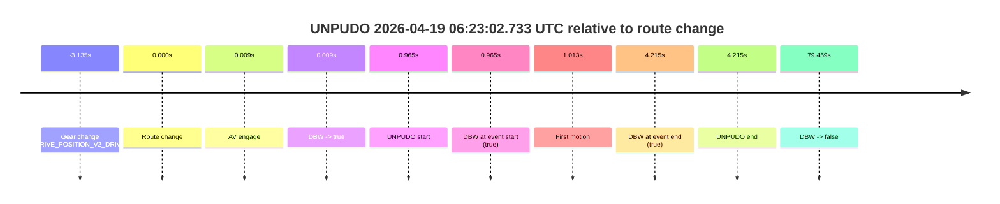

| Metric | Value |
|---|---|
| Outcome | `pass` |
| Effective failure type | `none` |
| Route change status | `found` |
| DBW at event start | `true` |
| DBW at event end | `true` |
| Predicted gear at AV start | `DRIVE_POSITION_V2_DRIVE` |
| Actual gear at AV start | `DRIVE_POSITION_V2_DRIVE` |
| Predicted gear at event start | `DRIVE_POSITION_V2_DRIVE` |
| Actual gear at event start | `DRIVE_POSITION_V2_DRIVE` |
| Planned indicator direction | `INDICATORS_STATE_V2_LEFT_ON` |
| Controller indicator direction | `INDICATORS_STATE_V2_LEFT_ON` |
| Actual indicator direction | `INDICATORS_STATE_V2_OFF` |
| Actual indicator at maneuver end | `INDICATORS_STATE_V2_OFF` |
| Driver accel help in AV | `false` |
| Driver accel help timestamp | `n/a` |
| Max accel pedal pct in AV | `0.0%` |
| Max brake pedal pct in AV | `10.5%` |
| Max speed mps in AV | `5.489` |
| Success timing baseline | `route change` |
| Route -> AV | `0.009s` |
| AV -> event start | `0.956s` |
| AV -> first motion | `1.003s` |
| Success baseline -> event start | `0.965s` |
| Success baseline -> first motion | `1.013s` |
| AV duration before disengagement | `79.450s` |
| Trajectory waypoint count | `37` |
| Driving-plan step count | `11` |

The scored portion starts from the AV-owned window, not from the pre-AV setup. Route-change search in the stopped pre-event segment was `found`, with the baseline therefore set to route change. At the event anchor the model predicts `DRIVE_POSITION_V2_DRIVE` and the actual gear is `DRIVE_POSITION_V2_DRIVE`. The effective model outcome is `pass` because `the credited unpudo stays AV-owned through the official unpudo window.`

### Resolution

| Field | Value |
|---|---|
| Final outcome | `pass` |
| Do we agree with this label? | `yes` |
| Source disengagement type | `none observed` |
| Resolved effective failure type | `none` |
| Confidence | `high` |

## unpudo 2026-04-19 06:24:47.883 UTC

| Field | Value |
|---|---|
| Model | `armadillo-amethyst-squeaky` |
| Author | `guy.geva` |
| Run ID | `fme20009/2026-04-19--05-51-41--gen2-av-de5cf318-085d-434c-bbad-44a85d521e9e` |
| Date | `2026-04-19` |
| Time (UTC) | `06:24:47.883` |
| Event type | `unpudo` |
| Disengagement type | `none observed` |
| Route change | `found` |
| Console | [run](https://console.sso.wayve.ai/run/fme20009/2026-04-19--05-51-41--gen2-av-de5cf318-085d-434c-bbad-44a85d521e9e?id=&time-unixus=1776579887883317) |
| Foxglove | [segment](https://app.foxglove.dev/wayve-on-prem/p/prj_0dX18KZdVHg1fmmI/view?ds=foxglove-stream&ds.deviceName=fme20009&ds.start=2026-04-19T06%3A22%3A51.768322Z&ds.end=2026-04-19T06%3A25%3A12.333310Z&layoutId=lay_0e7VD4WIKDQGU73Y&time=2026-04-19T06%3A24%3A47.883317Z) |

### Event card: fail

- Fail: the credited unpudo does not stay AV-owned. The event window starts with DBW false, and the maneuver outcome lands outside a clean AV-owned segment.

| Event | Time (UTC) | Delta from route change |
|---|---:|---:|
| Route change | 2026-04-19 06:23:01.768 | `0.000s` |
| AV engage | 2026-04-19 06:23:01.777 | `0.009s` |
| DBW -> true | 2026-04-19 06:23:01.777 | `0.009s` |
| First motion | 2026-04-19 06:23:02.780 | `1.013s` |
| DBW -> false | 2026-04-19 06:24:21.227 | `79.459s` |
| Gear change (DRIVE_POSITION_V2_REVERSE) | 2026-04-19 06:24:42.283 | `100.515s` |
| UNPUDO start | 2026-04-19 06:24:47.883 | `106.115s` |
| DBW at event start (false) | 2026-04-19 06:24:47.883 | `106.115s` |
| Actual indicator -> right on | 2026-04-19 06:24:57.660 | `115.892s` |
| Actual indicator -> off | 2026-04-19 06:24:59.680 | `117.912s` |
| DBW at event end (false) | 2026-04-19 06:25:02.333 | `120.565s` |
| UNPUDO end | 2026-04-19 06:25:02.333 | `120.565s` |

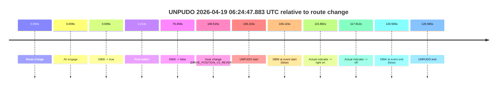

| Metric | Value |
|---|---|
| Outcome | `fail` |
| Effective failure type | `not_av_owned` |
| Route change status | `found` |
| DBW at event start | `false` |
| DBW at event end | `false` |
| Predicted gear at AV start | `DRIVE_POSITION_V2_DRIVE` |
| Actual gear at AV start | `DRIVE_POSITION_V2_DRIVE` |
| Predicted gear at event start | `DRIVE_POSITION_V2_REVERSE` |
| Actual gear at event start | `DRIVE_POSITION_V2_REVERSE` |
| Planned indicator direction | `INDICATORS_STATE_V2_RIGHT_ON` |
| Controller indicator direction | `INDICATORS_STATE_V2_RIGHT_ON` |
| Actual indicator direction | `INDICATORS_STATE_V2_OFF` |
| Actual indicator at maneuver end | `INDICATORS_STATE_V2_OFF` |
| Driver accel help in AV | `false` |
| Driver accel help timestamp | `n/a` |
| Max accel pedal pct in AV | `0.0%` |
| Max brake pedal pct in AV | `10.5%` |
| Max speed mps in AV | `8.319` |
| Success timing baseline | `route change` |
| Route -> AV | `0.009s` |
| AV -> event start | `106.106s` |
| AV -> first motion | `1.003s` |
| Success baseline -> event start | `106.115s` |
| Success baseline -> first motion | `1.013s` |
| AV duration before disengagement | `79.450s` |
| Trajectory waypoint count | `36` |
| Driving-plan step count | `11` |

The scored portion starts from the AV-owned window, not from the pre-AV setup. Route-change search in the stopped pre-event segment was `found`, with the baseline therefore set to route change. At the event anchor the model predicts `DRIVE_POSITION_V2_REVERSE` and the actual gear is `DRIVE_POSITION_V2_REVERSE`. The effective model outcome is `fail` because `not_av_owned.`

### Resolution

| Field | Value |
|---|---|
| Final outcome | `fail` |
| Do we agree with this label? | `yes` |
| Source disengagement type | `none observed` |
| Resolved effective failure type | `not_av_owned` |
| Confidence | `high` |

## unpudo 2026-04-19 06:41:21.233 UTC

| Field | Value |
|---|---|
| Model | `armadillo-amethyst-squeaky` |
| Author | `guy.geva` |
| Run ID | `fme20009/2026-04-19--05-51-41--gen2-av-de5cf318-085d-434c-bbad-44a85d521e9e` |
| Date | `2026-04-19` |
| Time (UTC) | `06:41:21.233` |
| Event type | `unpudo` |
| Disengagement type | `none observed` |
| Route change | `found` |
| Console | [run](https://console.sso.wayve.ai/run/fme20009/2026-04-19--05-51-41--gen2-av-de5cf318-085d-434c-bbad-44a85d521e9e?id=&time-unixus=1776580881233320) |
| Foxglove | [segment](https://app.foxglove.dev/wayve-on-prem/p/prj_0dX18KZdVHg1fmmI/view?ds=foxglove-stream&ds.deviceName=fme20009&ds.start=2026-04-19T06%3A39%3A26.318238Z&ds.end=2026-04-19T06%3A41%3A35.683299Z&layoutId=lay_0e7VD4WIKDQGU73Y&time=2026-04-19T06%3A41%3A21.233320Z) |

### Event card: fail

- Fail: the credited unpudo does not stay AV-owned. The event window starts with DBW false, and the maneuver outcome lands outside a clean AV-owned segment.

| Event | Time (UTC) | Delta from route change |
|---|---:|---:|
| Route change | 2026-04-19 06:39:36.318 | `0.000s` |
| Actual indicator -> right on | 2026-04-19 06:39:53.659 | `17.342s` |
| First motion | 2026-04-19 06:39:54.859 | `18.542s` |
| Actual indicator -> off | 2026-04-19 06:39:56.980 | `20.662s` |
| AV engage | 2026-04-19 06:41:16.727 | `100.409s` |
| DBW -> true | 2026-04-19 06:41:16.727 | `100.409s` |
| Gear change (DRIVE_POSITION_V2_DRIVE) | 2026-04-19 06:41:17.233 | `100.915s` |
| DBW -> false | 2026-04-19 06:41:20.608 | `104.290s` |
| Actual indicator -> left on | 2026-04-19 06:41:21.000 | `104.682s` |
| UNPUDO start | 2026-04-19 06:41:21.233 | `104.915s` |
| DBW at event start (false) | 2026-04-19 06:41:21.233 | `104.915s` |
| Actual indicator -> off | 2026-04-19 06:41:24.240 | `107.922s` |
| DBW at event end (false) | 2026-04-19 06:41:25.683 | `109.365s` |
| UNPUDO end | 2026-04-19 06:41:25.683 | `109.365s` |

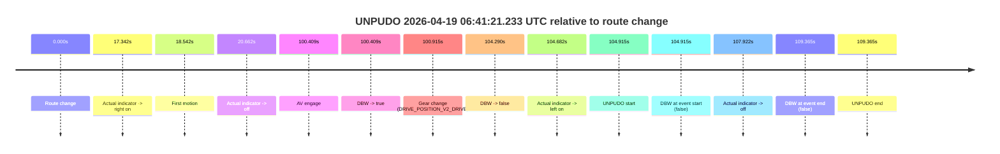

| Metric | Value |
|---|---|
| Outcome | `fail` |
| Effective failure type | `completed_outside_av` |
| Route change status | `found` |
| DBW at event start | `false` |
| DBW at event end | `false` |
| Predicted gear at AV start | `DRIVE_POSITION_V2_DRIVE` |
| Actual gear at AV start | `DRIVE_POSITION_V2_PARK` |
| Predicted gear at event start | `DRIVE_POSITION_V2_DRIVE` |
| Actual gear at event start | `DRIVE_POSITION_V2_DRIVE` |
| Planned indicator direction | `INDICATORS_STATE_V2_LEFT_ON` |
| Controller indicator direction | `INDICATORS_STATE_V2_LEFT_ON` |
| Actual indicator direction | `INDICATORS_STATE_V2_LEFT_ON` |
| Actual indicator at maneuver end | `INDICATORS_STATE_V2_OFF` |
| Driver accel help in AV | `false` |
| Driver accel help timestamp | `n/a` |
| Max accel pedal pct in AV | `0.0%` |
| Max brake pedal pct in AV | `9.9%` |
| Max speed mps in AV | `0.000` |
| Success timing baseline | `route change` |
| Route -> AV | `100.409s` |
| AV -> event start | `4.506s` |
| AV -> first motion | `-81.867s` |
| Success baseline -> event start | `104.915s` |
| Success baseline -> first motion | `18.542s` |
| AV duration before disengagement | `3.881s` |
| Trajectory waypoint count | `35` |
| Driving-plan step count | `11` |

The scored portion starts from the AV-owned window, not from the pre-AV setup. Route-change search in the stopped pre-event segment was `found`, with the baseline therefore set to route change. At the event anchor the model predicts `DRIVE_POSITION_V2_DRIVE` and the actual gear is `DRIVE_POSITION_V2_DRIVE`. The effective model outcome is `fail` because `completed_outside_av.`

### Resolution

| Field | Value |
|---|---|
| Final outcome | `fail` |
| Do we agree with this label? | `yes` |
| Source disengagement type | `none observed` |
| Resolved effective failure type | `completed_outside_av` |
| Confidence | `high` |

## unpudo 2026-04-19 06:44:11.933 UTC

| Field | Value |
|---|---|
| Model | `armadillo-amethyst-squeaky` |
| Author | `guy.geva` |
| Run ID | `fme20009/2026-04-19--05-51-41--gen2-av-de5cf318-085d-434c-bbad-44a85d521e9e` |
| Date | `2026-04-19` |
| Time (UTC) | `06:44:11.933` |
| Event type | `unpudo` |
| Disengagement type | `none observed` |
| Route change | `found` |
| Console | [run](https://console.sso.wayve.ai/run/fme20009/2026-04-19--05-51-41--gen2-av-de5cf318-085d-434c-bbad-44a85d521e9e?id=&time-unixus=1776581051933321) |
| Foxglove | [segment](https://app.foxglove.dev/wayve-on-prem/p/prj_0dX18KZdVHg1fmmI/view?ds=foxglove-stream&ds.deviceName=fme20009&ds.start=2026-04-19T06%3A43%3A51.733318Z&ds.end=2026-04-19T06%3A44%3A26.883307Z&layoutId=lay_0e7VD4WIKDQGU73Y&time=2026-04-19T06%3A44%3A11.933321Z) |

### Event card: fail

- Fail: the credited unpudo does not stay AV-owned. The event window starts with DBW false, and the maneuver outcome lands outside a clean AV-owned segment.

| Event | Time (UTC) | Delta from route change |
|---|---:|---:|
| Gear change (DRIVE_POSITION_V2_DRIVE) | 2026-04-19 06:44:01.733 | `-3.185s` |
| Route change | 2026-04-19 06:44:04.918 | `0.000s` |
| AV engage | 2026-04-19 06:44:04.926 | `0.008s` |
| DBW -> true | 2026-04-19 06:44:04.926 | `0.008s` |
| DBW -> false | 2026-04-19 06:44:08.827 | `3.909s` |
| UNPUDO start | 2026-04-19 06:44:11.933 | `7.015s` |
| DBW at event start (false) | 2026-04-19 06:44:11.933 | `7.015s` |
| DBW at event end (false) | 2026-04-19 06:44:16.883 | `11.965s` |
| UNPUDO end | 2026-04-19 06:44:16.883 | `11.965s` |

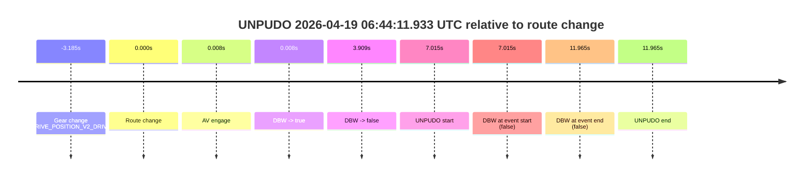

| Metric | Value |
|---|---|
| Outcome | `fail` |
| Effective failure type | `not_av_owned` |
| Route change status | `found` |
| DBW at event start | `false` |
| DBW at event end | `false` |
| Predicted gear at AV start | `DRIVE_POSITION_V2_DRIVE` |
| Actual gear at AV start | `DRIVE_POSITION_V2_DRIVE` |
| Predicted gear at event start | `DRIVE_POSITION_V2_DRIVE` |
| Actual gear at event start | `DRIVE_POSITION_V2_DRIVE` |
| Planned indicator direction | `INDICATORS_STATE_V2_RIGHT_ON` |
| Controller indicator direction | `INDICATORS_STATE_V2_RIGHT_ON` |
| Actual indicator direction | `INDICATORS_STATE_V2_OFF` |
| Actual indicator at maneuver end | `INDICATORS_STATE_V2_OFF` |
| Driver accel help in AV | `false` |
| Driver accel help timestamp | `n/a` |
| Max accel pedal pct in AV | `0.0%` |
| Max brake pedal pct in AV | `8.0%` |
| Max speed mps in AV | `0.000` |
| Success timing baseline | `route change` |
| Route -> AV | `0.008s` |
| AV -> event start | `7.007s` |
| AV -> first motion | `n/a` |
| Success baseline -> event start | `7.015s` |
| Success baseline -> first motion | `n/a` |
| AV duration before disengagement | `3.901s` |
| Trajectory waypoint count | `36` |
| Driving-plan step count | `11` |

The scored portion starts from the AV-owned window, not from the pre-AV setup. Route-change search in the stopped pre-event segment was `found`, with the baseline therefore set to route change. At the event anchor the model predicts `DRIVE_POSITION_V2_DRIVE` and the actual gear is `DRIVE_POSITION_V2_DRIVE`. The effective model outcome is `fail` because `not_av_owned.`

### Resolution

| Field | Value |
|---|---|
| Final outcome | `fail` |
| Do we agree with this label? | `yes` |
| Source disengagement type | `none observed` |
| Resolved effective failure type | `not_av_owned` |
| Confidence | `high` |

## unpudo 2026-04-19 06:48:54.133 UTC

| Field | Value |
|---|---|
| Model | `armadillo-amethyst-squeaky` |
| Author | `guy.geva` |
| Run ID | `fme20009/2026-04-19--05-51-41--gen2-av-de5cf318-085d-434c-bbad-44a85d521e9e` |
| Date | `2026-04-19` |
| Time (UTC) | `06:48:54.133` |
| Event type | `unpudo` |
| Disengagement type | `none observed` |
| Route change | `found` |
| Console | [run](https://console.sso.wayve.ai/run/fme20009/2026-04-19--05-51-41--gen2-av-de5cf318-085d-434c-bbad-44a85d521e9e?id=&time-unixus=1776581334133316) |
| Foxglove | [segment](https://app.foxglove.dev/wayve-on-prem/p/prj_0dX18KZdVHg1fmmI/view?ds=foxglove-stream&ds.deviceName=fme20009&ds.start=2026-04-19T06%3A48%3A24.768300Z&ds.end=2026-04-19T06%3A49%3A55.468414Z&layoutId=lay_0e7VD4WIKDQGU73Y&time=2026-04-19T06%3A48%3A54.133316Z) |

### Event card: pass

- Pass: AV owns the credited unpudo from route change through the official unpudo window, the gear state is aligned at the anchor, and the vehicle moves without driver accelerator help in AV.

| Event | Time (UTC) | Delta from route change |
|---|---:|---:|
| Route change | 2026-04-19 06:48:34.768 | `0.000s` |
| AV engage | 2026-04-19 06:48:50.147 | `15.379s` |
| DBW -> true | 2026-04-19 06:48:50.147 | `15.379s` |
| Gear change (DRIVE_POSITION_V2_DRIVE) | 2026-04-19 06:48:50.533 | `15.765s` |
| UNPUDO start | 2026-04-19 06:48:54.133 | `19.365s` |
| DBW at event start (true) | 2026-04-19 06:48:54.133 | `19.365s` |
| First motion | 2026-04-19 06:48:54.160 | `19.392s` |
| DBW at event end (true) | 2026-04-19 06:48:57.383 | `22.615s` |
| UNPUDO end | 2026-04-19 06:48:57.383 | `22.615s` |
| DBW -> false | 2026-04-19 06:49:45.468 | `70.700s` |
| Actual indicator -> right on | 2026-04-19 06:49:46.520 | `71.752s` |
| Actual indicator -> off | 2026-04-19 06:49:48.340 | `73.572s` |

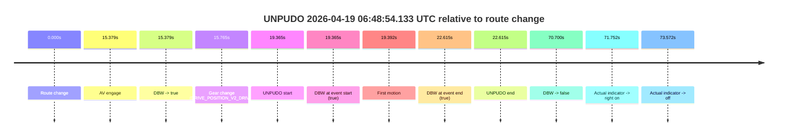

| Metric | Value |
|---|---|
| Outcome | `pass` |
| Effective failure type | `none` |
| Route change status | `found` |
| DBW at event start | `true` |
| DBW at event end | `true` |
| Predicted gear at AV start | `DRIVE_POSITION_V2_DRIVE` |
| Actual gear at AV start | `DRIVE_POSITION_V2_PARK` |
| Predicted gear at event start | `DRIVE_POSITION_V2_DRIVE` |
| Actual gear at event start | `DRIVE_POSITION_V2_DRIVE` |
| Planned indicator direction | `INDICATORS_STATE_V2_OFF` |
| Controller indicator direction | `INDICATORS_STATE_V2_OFF` |
| Actual indicator direction | `INDICATORS_STATE_V2_OFF` |
| Actual indicator at maneuver end | `INDICATORS_STATE_V2_OFF` |
| Driver accel help in AV | `false` |
| Driver accel help timestamp | `n/a` |
| Max accel pedal pct in AV | `0.0%` |
| Max brake pedal pct in AV | `12.6%` |
| Max speed mps in AV | `5.514` |
| Success timing baseline | `route change` |
| Route -> AV | `15.379s` |
| AV -> event start | `3.986s` |
| AV -> first motion | `4.013s` |
| Success baseline -> event start | `19.365s` |
| Success baseline -> first motion | `19.392s` |
| AV duration before disengagement | `55.321s` |
| Trajectory waypoint count | `37` |
| Driving-plan step count | `11` |

The scored portion starts from the AV-owned window, not from the pre-AV setup. Route-change search in the stopped pre-event segment was `found`, with the baseline therefore set to route change. At the event anchor the model predicts `DRIVE_POSITION_V2_DRIVE` and the actual gear is `DRIVE_POSITION_V2_DRIVE`. The effective model outcome is `pass` because `the credited unpudo stays AV-owned through the official unpudo window.`

### Resolution

| Field | Value |
|---|---|
| Final outcome | `pass` |
| Do we agree with this label? | `yes` |
| Source disengagement type | `none observed` |
| Resolved effective failure type | `none` |
| Confidence | `high` |

## unpudo 2026-04-19 06:54:41.383 UTC

| Field | Value |
|---|---|
| Model | `armadillo-amethyst-squeaky` |
| Author | `guy.geva` |
| Run ID | `fme20009/2026-04-19--05-51-41--gen2-av-de5cf318-085d-434c-bbad-44a85d521e9e` |
| Date | `2026-04-19` |
| Time (UTC) | `06:54:41.383` |
| Event type | `unpudo` |
| Disengagement type | `none observed` |
| Route change | `found` |
| Console | [run](https://console.sso.wayve.ai/run/fme20009/2026-04-19--05-51-41--gen2-av-de5cf318-085d-434c-bbad-44a85d521e9e?id=&time-unixus=1776581681383321) |
| Foxglove | [segment](https://app.foxglove.dev/wayve-on-prem/p/prj_0dX18KZdVHg1fmmI/view?ds=foxglove-stream&ds.deviceName=fme20009&ds.start=2026-04-19T06%3A52%3A52.268267Z&ds.end=2026-04-19T06%3A54%3A59.933308Z&layoutId=lay_0e7VD4WIKDQGU73Y&time=2026-04-19T06%3A54%3A41.383321Z) |

### Event card: fail

- Fail: the credited unpudo does not stay AV-owned. The event window starts with DBW false, and the maneuver outcome lands outside a clean AV-owned segment.

| Event | Time (UTC) | Delta from route change |
|---|---:|---:|
| Route change | 2026-04-19 06:53:02.268 | `0.000s` |
| AV engage | 2026-04-19 06:53:02.277 | `0.009s` |
| DBW -> true | 2026-04-19 06:53:02.277 | `0.009s` |
| First motion | 2026-04-19 06:53:10.400 | `8.133s` |
| Gear change (DRIVE_POSITION_V2_DRIVE) | 2026-04-19 06:54:05.733 | `63.465s` |
| DBW -> false | 2026-04-19 06:54:20.987 | `78.719s` |
| Actual indicator -> right on | 2026-04-19 06:54:39.120 | `96.852s` |
| UNPUDO start | 2026-04-19 06:54:41.383 | `99.115s` |
| DBW at event start (false) | 2026-04-19 06:54:41.383 | `99.115s` |
| Actual indicator -> off | 2026-04-19 06:54:44.220 | `101.952s` |
| DBW at event end (false) | 2026-04-19 06:54:49.933 | `107.665s` |
| UNPUDO end | 2026-04-19 06:54:49.933 | `107.665s` |

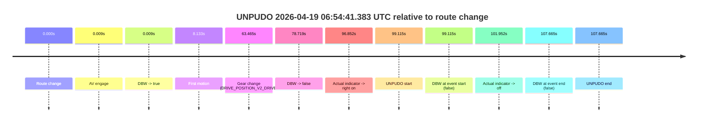

| Metric | Value |
|---|---|
| Outcome | `fail` |
| Effective failure type | `not_av_owned` |
| Route change status | `found` |
| DBW at event start | `false` |
| DBW at event end | `false` |
| Predicted gear at AV start | `DRIVE_POSITION_V2_PARK` |
| Actual gear at AV start | `DRIVE_POSITION_V2_PARK` |
| Predicted gear at event start | `DRIVE_POSITION_V2_DRIVE` |
| Actual gear at event start | `DRIVE_POSITION_V2_DRIVE` |
| Planned indicator direction | `INDICATORS_STATE_V2_RIGHT_ON` |
| Controller indicator direction | `INDICATORS_STATE_V2_RIGHT_ON` |
| Actual indicator direction | `INDICATORS_STATE_V2_RIGHT_ON` |
| Actual indicator at maneuver end | `INDICATORS_STATE_V2_OFF` |
| Driver accel help in AV | `false` |
| Driver accel help timestamp | `n/a` |
| Max accel pedal pct in AV | `0.0%` |
| Max brake pedal pct in AV | `17.0%` |
| Max speed mps in AV | `8.208` |
| Success timing baseline | `route change` |
| Route -> AV | `0.009s` |
| AV -> event start | `99.106s` |
| AV -> first motion | `8.123s` |
| Success baseline -> event start | `99.115s` |
| Success baseline -> first motion | `8.133s` |
| AV duration before disengagement | `78.710s` |
| Trajectory waypoint count | `37` |
| Driving-plan step count | `11` |

The scored portion starts from the AV-owned window, not from the pre-AV setup. Route-change search in the stopped pre-event segment was `found`, with the baseline therefore set to route change. At the event anchor the model predicts `DRIVE_POSITION_V2_DRIVE` and the actual gear is `DRIVE_POSITION_V2_DRIVE`. The effective model outcome is `fail` because `not_av_owned.`

### Resolution

| Field | Value |
|---|---|
| Final outcome | `fail` |
| Do we agree with this label? | `yes` |
| Source disengagement type | `none observed` |
| Resolved effective failure type | `not_av_owned` |
| Confidence | `high` |

## unpudo 2026-04-19 06:54:58.683 UTC

| Field | Value |
|---|---|
| Model | `armadillo-amethyst-squeaky` |
| Author | `guy.geva` |
| Run ID | `fme20009/2026-04-19--05-51-41--gen2-av-de5cf318-085d-434c-bbad-44a85d521e9e` |
| Date | `2026-04-19` |
| Time (UTC) | `06:54:58.683` |
| Event type | `unpudo` |
| Disengagement type | `none observed` |
| Route change | `found` |
| Console | [run](https://console.sso.wayve.ai/run/fme20009/2026-04-19--05-51-41--gen2-av-de5cf318-085d-434c-bbad-44a85d521e9e?id=&time-unixus=1776581698683299) |
| Foxglove | [segment](https://app.foxglove.dev/wayve-on-prem/p/prj_0dX18KZdVHg1fmmI/view?ds=foxglove-stream&ds.deviceName=fme20009&ds.start=2026-04-19T06%3A52%3A52.268267Z&ds.end=2026-04-19T06%3A55%3A21.983330Z&layoutId=lay_0e7VD4WIKDQGU73Y&time=2026-04-19T06%3A54%3A58.683299Z) |

### Event card: fail

- Fail: the credited unpudo does not stay AV-owned. The event window starts with DBW false, and the maneuver outcome lands outside a clean AV-owned segment.

| Event | Time (UTC) | Delta from route change |
|---|---:|---:|
| Route change | 2026-04-19 06:53:02.268 | `0.000s` |
| AV engage | 2026-04-19 06:53:02.277 | `0.009s` |
| DBW -> true | 2026-04-19 06:53:02.277 | `0.009s` |
| First motion | 2026-04-19 06:53:10.400 | `8.133s` |
| DBW -> false | 2026-04-19 06:54:20.987 | `78.719s` |
| Actual indicator -> right on | 2026-04-19 06:54:39.120 | `96.852s` |
| Actual indicator -> off | 2026-04-19 06:54:44.220 | `101.952s` |
| Gear change (DRIVE_POSITION_V2_REVERSE) | 2026-04-19 06:54:55.483 | `113.215s` |
| UNPUDO start | 2026-04-19 06:54:58.683 | `116.415s` |
| DBW at event start (false) | 2026-04-19 06:54:58.683 | `116.415s` |
| DBW at event end (false) | 2026-04-19 06:55:11.983 | `129.715s` |
| UNPUDO end | 2026-04-19 06:55:11.983 | `129.715s` |
| Actual indicator -> left on | 2026-04-19 06:55:18.340 | `136.072s` |
| Actual indicator -> off | 2026-04-19 06:55:27.260 | `144.992s` |

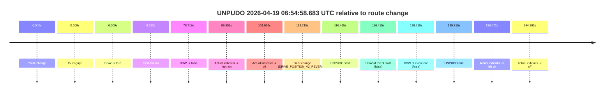

| Metric | Value |
|---|---|
| Outcome | `fail` |
| Effective failure type | `not_av_owned` |
| Route change status | `found` |
| DBW at event start | `false` |
| DBW at event end | `false` |
| Predicted gear at AV start | `DRIVE_POSITION_V2_PARK` |
| Actual gear at AV start | `DRIVE_POSITION_V2_PARK` |
| Predicted gear at event start | `DRIVE_POSITION_V2_REVERSE` |
| Actual gear at event start | `DRIVE_POSITION_V2_REVERSE` |
| Planned indicator direction | `INDICATORS_STATE_V2_OFF` |
| Controller indicator direction | `INDICATORS_STATE_V2_OFF` |
| Actual indicator direction | `INDICATORS_STATE_V2_OFF` |
| Actual indicator at maneuver end | `INDICATORS_STATE_V2_OFF` |
| Driver accel help in AV | `false` |
| Driver accel help timestamp | `n/a` |
| Max accel pedal pct in AV | `0.0%` |
| Max brake pedal pct in AV | `17.0%` |
| Max speed mps in AV | `8.208` |
| Success timing baseline | `route change` |
| Route -> AV | `0.009s` |
| AV -> event start | `116.406s` |
| AV -> first motion | `8.123s` |
| Success baseline -> event start | `116.415s` |
| Success baseline -> first motion | `8.133s` |
| AV duration before disengagement | `78.710s` |
| Trajectory waypoint count | `36` |
| Driving-plan step count | `11` |

The scored portion starts from the AV-owned window, not from the pre-AV setup. Route-change search in the stopped pre-event segment was `found`, with the baseline therefore set to route change. At the event anchor the model predicts `DRIVE_POSITION_V2_REVERSE` and the actual gear is `DRIVE_POSITION_V2_REVERSE`. The effective model outcome is `fail` because `not_av_owned.`

### Resolution

| Field | Value |
|---|---|
| Final outcome | `fail` |
| Do we agree with this label? | `yes` |
| Source disengagement type | `none observed` |
| Resolved effective failure type | `not_av_owned` |
| Confidence | `high` |

## unpudo 2026-04-19 06:58:52.183 UTC

| Field | Value |
|---|---|
| Model | `armadillo-amethyst-squeaky` |
| Author | `guy.geva` |
| Run ID | `fme20009/2026-04-19--05-51-41--gen2-av-de5cf318-085d-434c-bbad-44a85d521e9e` |
| Date | `2026-04-19` |
| Time (UTC) | `06:58:52.183` |
| Event type | `unpudo` |
| Disengagement type | `none observed` |
| Route change | `found` |
| Console | [run](https://console.sso.wayve.ai/run/fme20009/2026-04-19--05-51-41--gen2-av-de5cf318-085d-434c-bbad-44a85d521e9e?id=&time-unixus=1776581932183299) |
| Foxglove | [segment](https://app.foxglove.dev/wayve-on-prem/p/prj_0dX18KZdVHg1fmmI/view?ds=foxglove-stream&ds.deviceName=fme20009&ds.start=2026-04-19T06%3A56%3A49.118483Z&ds.end=2026-04-19T06%3A59%3A02.183299Z&layoutId=lay_0e7VD4WIKDQGU73Y&time=2026-04-19T06%3A58%3A52.183299Z) |

### Event card: fail

- Fail: the credited unpudo does not stay AV-owned. The event window starts with DBW false, and the maneuver outcome lands outside a clean AV-owned segment.

| Event | Time (UTC) | Delta from route change |
|---|---:|---:|
| Route change | 2026-04-19 06:56:59.118 | `0.000s` |
| AV engage | 2026-04-19 06:56:59.127 | `0.009s` |
| DBW -> true | 2026-04-19 06:56:59.127 | `0.009s` |
| First motion | 2026-04-19 06:57:03.020 | `3.902s` |
| DBW -> false | 2026-04-19 06:58:28.147 | `89.029s` |
| Actual indicator -> left on | 2026-04-19 06:58:31.579 | `92.462s` |
| Actual indicator -> off | 2026-04-19 06:58:36.419 | `97.301s` |
| Gear change (DRIVE_POSITION_V2_REVERSE) | 2026-04-19 06:58:48.383 | `109.265s` |
| UNPUDO start | 2026-04-19 06:58:52.183 | `113.065s` |
| DBW at event start (false) | 2026-04-19 06:58:52.183 | `113.065s` |
| DBW at event end (false) | 2026-04-19 06:58:52.183 | `113.065s` |
| UNPUDO end | 2026-04-19 06:58:52.183 | `113.065s` |

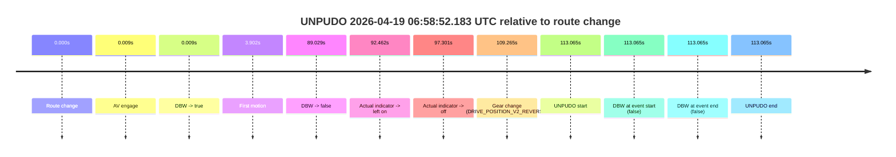

| Metric | Value |
|---|---|
| Outcome | `fail` |
| Effective failure type | `not_av_owned` |
| Route change status | `found` |
| DBW at event start | `false` |
| DBW at event end | `false` |
| Predicted gear at AV start | `DRIVE_POSITION_V2_PARK` |
| Actual gear at AV start | `DRIVE_POSITION_V2_PARK` |
| Predicted gear at event start | `DRIVE_POSITION_V2_REVERSE` |
| Actual gear at event start | `DRIVE_POSITION_V2_REVERSE` |
| Planned indicator direction | `INDICATORS_STATE_V2_RIGHT_ON` |
| Controller indicator direction | `INDICATORS_STATE_V2_RIGHT_ON` |
| Actual indicator direction | `INDICATORS_STATE_V2_OFF` |
| Actual indicator at maneuver end | `INDICATORS_STATE_V2_OFF` |
| Driver accel help in AV | `false` |
| Driver accel help timestamp | `n/a` |
| Max accel pedal pct in AV | `0.0%` |
| Max brake pedal pct in AV | `8.9%` |
| Max speed mps in AV | `8.239` |
| Success timing baseline | `route change` |
| Route -> AV | `0.009s` |
| AV -> event start | `113.056s` |
| AV -> first motion | `3.893s` |
| Success baseline -> event start | `113.065s` |
| Success baseline -> first motion | `3.902s` |
| AV duration before disengagement | `89.020s` |
| Trajectory waypoint count | `36` |
| Driving-plan step count | `11` |

The scored portion starts from the AV-owned window, not from the pre-AV setup. Route-change search in the stopped pre-event segment was `found`, with the baseline therefore set to route change. At the event anchor the model predicts `DRIVE_POSITION_V2_REVERSE` and the actual gear is `DRIVE_POSITION_V2_REVERSE`. The effective model outcome is `fail` because `not_av_owned.`

### Resolution

| Field | Value |
|---|---|
| Final outcome | `fail` |
| Do we agree with this label? | `yes` |
| Source disengagement type | `none observed` |
| Resolved effective failure type | `not_av_owned` |
| Confidence | `high` |

## unpudo 2026-04-19 07:14:28.583 UTC

| Field | Value |
|---|---|
| Model | `armadillo-amethyst-squeaky` |
| Author | `guy.geva` |
| Run ID | `fme20009/2026-04-19--05-51-41--gen2-av-de5cf318-085d-434c-bbad-44a85d521e9e` |
| Date | `2026-04-19` |
| Time (UTC) | `07:14:28.583` |
| Event type | `unpudo` |
| Disengagement type | `none observed` |
| Route change | `found` |
| Console | [run](https://console.sso.wayve.ai/run/fme20009/2026-04-19--05-51-41--gen2-av-de5cf318-085d-434c-bbad-44a85d521e9e?id=&time-unixus=1776582868583311) |
| Foxglove | [segment](https://app.foxglove.dev/wayve-on-prem/p/prj_0dX18KZdVHg1fmmI/view?ds=foxglove-stream&ds.deviceName=fme20009&ds.start=2026-04-19T07%3A14%3A13.933326Z&ds.end=2026-04-19T07%3A15%3A47.167322Z&layoutId=lay_0e7VD4WIKDQGU73Y&time=2026-04-19T07%3A14%3A28.583311Z) |

### Event card: pass

- Pass: AV owns the credited unpudo from route change through the official unpudo window, the gear state is aligned at the anchor, and the vehicle moves without driver accelerator help in AV.

| Event | Time (UTC) | Delta from route change |
|---|---:|---:|
| Gear change (DRIVE_POSITION_V2_DRIVE) | 2026-04-19 07:14:23.933 | `-2.235s` |
| Route change | 2026-04-19 07:14:26.168 | `0.000s` |
| AV engage | 2026-04-19 07:14:26.176 | `0.008s` |
| DBW -> true | 2026-04-19 07:14:26.176 | `0.008s` |
| UNPUDO start | 2026-04-19 07:14:28.583 | `2.415s` |
| DBW at event start (true) | 2026-04-19 07:14:28.583 | `2.415s` |
| First motion | 2026-04-19 07:14:28.619 | `2.452s` |
| DBW at event end (true) | 2026-04-19 07:14:32.533 | `6.365s` |
| UNPUDO end | 2026-04-19 07:14:32.533 | `6.365s` |
| DBW -> false | 2026-04-19 07:15:37.167 | `70.999s` |
| Actual indicator -> left on | 2026-04-19 07:15:41.560 | `75.392s` |
| Actual indicator -> off | 2026-04-19 07:15:47.100 | `80.932s` |
| Actual indicator -> left on | 2026-04-19 07:15:51.880 | `85.713s` |
| Actual indicator -> off | 2026-04-19 07:15:54.160 | `87.992s` |

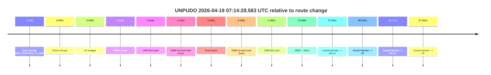

| Metric | Value |
|---|---|
| Outcome | `pass` |
| Effective failure type | `none` |
| Route change status | `found` |
| DBW at event start | `true` |
| DBW at event end | `true` |
| Predicted gear at AV start | `DRIVE_POSITION_V2_DRIVE` |
| Actual gear at AV start | `DRIVE_POSITION_V2_DRIVE` |
| Predicted gear at event start | `DRIVE_POSITION_V2_DRIVE` |
| Actual gear at event start | `DRIVE_POSITION_V2_DRIVE` |
| Planned indicator direction | `INDICATORS_STATE_V2_RIGHT_ON` |
| Controller indicator direction | `INDICATORS_STATE_V2_RIGHT_ON` |
| Actual indicator direction | `INDICATORS_STATE_V2_OFF` |
| Actual indicator at maneuver end | `INDICATORS_STATE_V2_OFF` |
| Driver accel help in AV | `false` |
| Driver accel help timestamp | `n/a` |
| Max accel pedal pct in AV | `0.0%` |
| Max brake pedal pct in AV | `11.1%` |
| Max speed mps in AV | `4.558` |
| Success timing baseline | `route change` |
| Route -> AV | `0.008s` |
| AV -> event start | `2.407s` |
| AV -> first motion | `2.443s` |
| Success baseline -> event start | `2.415s` |
| Success baseline -> first motion | `2.452s` |
| AV duration before disengagement | `70.991s` |
| Trajectory waypoint count | `36` |
| Driving-plan step count | `11` |

The scored portion starts from the AV-owned window, not from the pre-AV setup. Route-change search in the stopped pre-event segment was `found`, with the baseline therefore set to route change. At the event anchor the model predicts `DRIVE_POSITION_V2_DRIVE` and the actual gear is `DRIVE_POSITION_V2_DRIVE`. The effective model outcome is `pass` because `the credited unpudo stays AV-owned through the official unpudo window.`

### Resolution

| Field | Value |
|---|---|
| Final outcome | `pass` |
| Do we agree with this label? | `yes` |
| Source disengagement type | `none observed` |
| Resolved effective failure type | `none` |
| Confidence | `high` |

## unpudo 2026-04-19 07:27:28.633 UTC

| Field | Value |
|---|---|
| Model | `armadillo-amethyst-squeaky` |
| Author | `guy.geva` |
| Run ID | `fme20009/2026-04-19--05-51-41--gen2-av-de5cf318-085d-434c-bbad-44a85d521e9e` |
| Date | `2026-04-19` |
| Time (UTC) | `07:27:28.633` |
| Event type | `unpudo` |
| Disengagement type | `none observed` |
| Route change | `found` |
| Console | [run](https://console.sso.wayve.ai/run/fme20009/2026-04-19--05-51-41--gen2-av-de5cf318-085d-434c-bbad-44a85d521e9e?id=&time-unixus=1776583648633299) |
| Foxglove | [segment](https://app.foxglove.dev/wayve-on-prem/p/prj_0dX18KZdVHg1fmmI/view?ds=foxglove-stream&ds.deviceName=fme20009&ds.start=2026-04-19T07%3A26%3A34.318251Z&ds.end=2026-04-19T07%3A28%3A22.933314Z&layoutId=lay_0e7VD4WIKDQGU73Y&time=2026-04-19T07%3A27%3A28.633299Z) |

### Event card: fail

- Fail: the credited unpudo does not stay AV-owned. The event window starts with DBW false, and the maneuver outcome lands outside a clean AV-owned segment.

| Event | Time (UTC) | Delta from route change |
|---|---:|---:|
| Route change | 2026-04-19 07:26:44.318 | `0.000s` |
| First motion | 2026-04-19 07:26:44.320 | `0.002s` |
| AV engage | 2026-04-19 07:26:44.327 | `0.009s` |
| DBW -> true | 2026-04-19 07:26:44.327 | `0.009s` |
| DBW -> false | 2026-04-19 07:27:21.247 | `36.929s` |
| Gear change (DRIVE_POSITION_V2_REVERSE) | 2026-04-19 07:27:21.983 | `37.665s` |
| UNPUDO start | 2026-04-19 07:27:28.633 | `44.315s` |
| DBW at event start (false) | 2026-04-19 07:27:28.633 | `44.315s` |
| DBW at event end (true) | 2026-04-19 07:28:12.933 | `88.615s` |
| UNPUDO end | 2026-04-19 07:28:12.933 | `88.615s` |

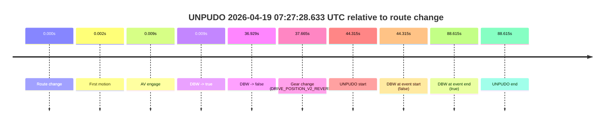

| Metric | Value |
|---|---|
| Outcome | `fail` |
| Effective failure type | `completed_outside_av` |
| Route change status | `found` |
| DBW at event start | `false` |
| DBW at event end | `true` |
| Predicted gear at AV start | `DRIVE_POSITION_V2_DRIVE` |
| Actual gear at AV start | `DRIVE_POSITION_V2_DRIVE` |
| Predicted gear at event start | `DRIVE_POSITION_V2_REVERSE` |
| Actual gear at event start | `DRIVE_POSITION_V2_REVERSE` |
| Planned indicator direction | `INDICATORS_STATE_V2_OFF` |
| Controller indicator direction | `INDICATORS_STATE_V2_OFF` |
| Actual indicator direction | `INDICATORS_STATE_V2_OFF` |
| Actual indicator at maneuver end | `INDICATORS_STATE_V2_OFF` |
| Driver accel help in AV | `false` |
| Driver accel help timestamp | `n/a` |
| Max accel pedal pct in AV | `0.0%` |
| Max brake pedal pct in AV | `27.6%` |
| Max speed mps in AV | `8.175` |
| Success timing baseline | `route change` |
| Route -> AV | `0.009s` |
| AV -> event start | `44.306s` |
| AV -> first motion | `-0.007s` |
| Success baseline -> event start | `44.315s` |
| Success baseline -> first motion | `0.002s` |
| AV duration before disengagement | `36.921s` |
| Trajectory waypoint count | `35` |
| Driving-plan step count | `11` |

The scored portion starts from the AV-owned window, not from the pre-AV setup. Route-change search in the stopped pre-event segment was `found`, with the baseline therefore set to route change. At the event anchor the model predicts `DRIVE_POSITION_V2_REVERSE` and the actual gear is `DRIVE_POSITION_V2_REVERSE`. The effective model outcome is `fail` because `completed_outside_av.`

### Resolution

| Field | Value |
|---|---|
| Final outcome | `fail` |
| Do we agree with this label? | `yes` |
| Source disengagement type | `none observed` |
| Resolved effective failure type | `completed_outside_av` |
| Confidence | `high` |

## unpudo 2026-04-19 07:40:40.083 UTC

| Field | Value |
|---|---|
| Model | `armadillo-amethyst-squeaky` |
| Author | `guy.geva` |
| Run ID | `fme20009/2026-04-19--05-51-41--gen2-av-de5cf318-085d-434c-bbad-44a85d521e9e` |
| Date | `2026-04-19` |
| Time (UTC) | `07:40:40.083` |
| Event type | `unpudo` |
| Disengagement type | `none observed` |
| Route change | `found` |
| Console | [run](https://console.sso.wayve.ai/run/fme20009/2026-04-19--05-51-41--gen2-av-de5cf318-085d-434c-bbad-44a85d521e9e?id=&time-unixus=1776584440083293) |
| Foxglove | [segment](https://app.foxglove.dev/wayve-on-prem/p/prj_0dX18KZdVHg1fmmI/view?ds=foxglove-stream&ds.deviceName=fme20009&ds.start=2026-04-19T07%3A40%3A16.468772Z&ds.end=2026-04-19T07%3A40%3A53.633297Z&layoutId=lay_0e7VD4WIKDQGU73Y&time=2026-04-19T07%3A40%3A40.083293Z) |

### Event card: fail

- Fail: the credited unpudo does not stay AV-owned. The event window starts with DBW false, and the maneuver outcome lands outside a clean AV-owned segment.

| Event | Time (UTC) | Delta from route change |
|---|---:|---:|
| Route change | 2026-04-19 07:40:26.468 | `0.000s` |
| AV engage | 2026-04-19 07:40:34.287 | `7.819s` |
| DBW -> true | 2026-04-19 07:40:34.287 | `7.819s` |
| Gear change (DRIVE_POSITION_V2_DRIVE) | 2026-04-19 07:40:34.733 | `8.265s` |
| DBW -> false | 2026-04-19 07:40:39.567 | `13.099s` |
| Actual indicator -> right on | 2026-04-19 07:40:39.880 | `13.411s` |
| UNPUDO start | 2026-04-19 07:40:40.083 | `13.615s` |
| DBW at event start (false) | 2026-04-19 07:40:40.083 | `13.615s` |
| Actual indicator -> off | 2026-04-19 07:40:41.680 | `15.211s` |
| DBW at event end (false) | 2026-04-19 07:40:43.633 | `17.165s` |
| UNPUDO end | 2026-04-19 07:40:43.633 | `17.165s` |

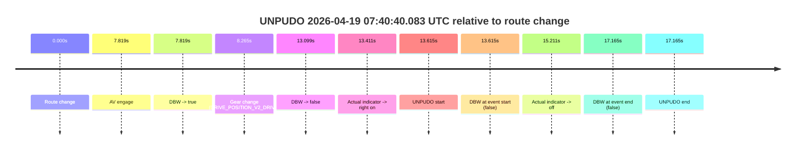

| Metric | Value |
|---|---|
| Outcome | `fail` |
| Effective failure type | `not_av_owned` |
| Route change status | `found` |
| DBW at event start | `false` |
| DBW at event end | `false` |
| Predicted gear at AV start | `DRIVE_POSITION_V2_DRIVE` |
| Actual gear at AV start | `DRIVE_POSITION_V2_PARK` |
| Predicted gear at event start | `DRIVE_POSITION_V2_DRIVE` |
| Actual gear at event start | `DRIVE_POSITION_V2_DRIVE` |
| Planned indicator direction | `INDICATORS_STATE_V2_RIGHT_ON` |
| Controller indicator direction | `INDICATORS_STATE_V2_RIGHT_ON` |
| Actual indicator direction | `INDICATORS_STATE_V2_RIGHT_ON` |
| Actual indicator at maneuver end | `INDICATORS_STATE_V2_OFF` |
| Driver accel help in AV | `false` |
| Driver accel help timestamp | `n/a` |
| Max accel pedal pct in AV | `0.0%` |
| Max brake pedal pct in AV | `8.0%` |
| Max speed mps in AV | `0.000` |
| Success timing baseline | `route change` |
| Route -> AV | `7.819s` |
| AV -> event start | `5.796s` |
| AV -> first motion | `n/a` |
| Success baseline -> event start | `13.615s` |
| Success baseline -> first motion | `n/a` |
| AV duration before disengagement | `5.280s` |
| Trajectory waypoint count | `34` |
| Driving-plan step count | `11` |

The scored portion starts from the AV-owned window, not from the pre-AV setup. Route-change search in the stopped pre-event segment was `found`, with the baseline therefore set to route change. At the event anchor the model predicts `DRIVE_POSITION_V2_DRIVE` and the actual gear is `DRIVE_POSITION_V2_DRIVE`. The effective model outcome is `fail` because `not_av_owned.`

### Resolution

| Field | Value |
|---|---|
| Final outcome | `fail` |
| Do we agree with this label? | `yes` |
| Source disengagement type | `none observed` |
| Resolved effective failure type | `not_av_owned` |
| Confidence | `high` |
