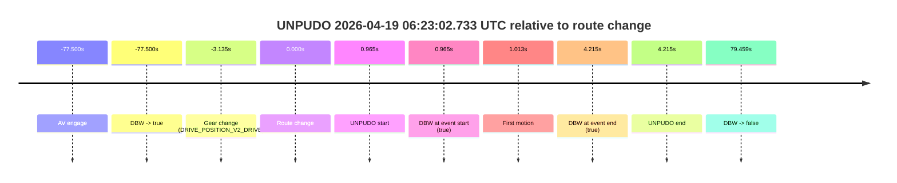
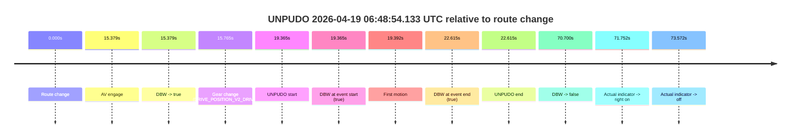
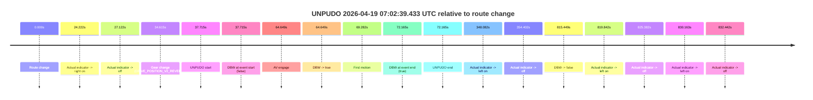
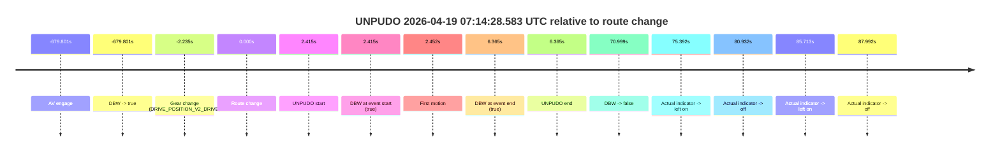
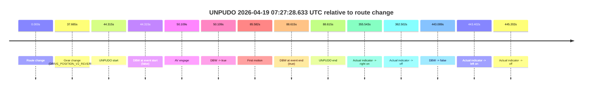

# Run Report: fme20009/2026-04-19--05-51-41--gen2-av-de5cf318-085d-434c-bbad-44a85d521e9e

| Field | Value |
|---|---|
| Run ID | `fme20009/2026-04-19--05-51-41--gen2-av-de5cf318-085d-434c-bbad-44a85d521e9e` |
| Date | `2026-04-19` |
| Model(s) | `armadillo-amethyst-squeaky` |
| Author | `guy.geva` |
| Event count | `5` |

## unpudo 2026-04-19 06:23:02.733 UTC

| Field | Value |
|---|---|
| Model | `armadillo-amethyst-squeaky` |
| Author | `guy.geva` |
| Run ID | `fme20009/2026-04-19--05-51-41--gen2-av-de5cf318-085d-434c-bbad-44a85d521e9e` |
| Date | `2026-04-19` |
| Time (UTC) | `06:23:02.733` |
| Event type | `unpudo` |
| Disengagement type | `none observed` |
| Route change | `found` |
| Console | [run](https://console.sso.wayve.ai/run/fme20009/2026-04-19--05-51-41--gen2-av-de5cf318-085d-434c-bbad-44a85d521e9e?id=&time-unixus=1776579782733310) |
| Foxglove | [segment](https://app.foxglove.dev/wayve-on-prem/p/prj_0dX18KZdVHg1fmmI/view?ds=foxglove-stream&ds.deviceName=fme20009&ds.start=2026-04-19T06%3A21%3A34.268368Z&ds.end=2026-04-19T06%3A24%3A31.227252Z&layoutId=lay_0e7VD4WIKDQGU73Y&time=2026-04-19T06%3A23%3A02.733310Z) |

### Event card: pass

- Pass: AV owns the credited unpudo through the official event window, the gear state is aligned at the anchor, and the vehicle moves without driver accelerator help in AV.

| Event | Time (UTC) | Delta from route change |
|---|---:|---:|
| AV engage | 2026-04-19 06:21:44.268 | `-77.500s` |
| DBW -> true | 2026-04-19 06:21:44.268 | `-77.500s` |
| Gear change (DRIVE_POSITION_V2_DRIVE) | 2026-04-19 06:22:58.633 | `-3.135s` |
| Route change | 2026-04-19 06:23:01.768 | `0.000s` |
| UNPUDO start | 2026-04-19 06:23:02.733 | `0.965s` |
| DBW at event start (true) | 2026-04-19 06:23:02.733 | `0.965s` |
| First motion | 2026-04-19 06:23:02.780 | `1.013s` |
| DBW at event end (true) | 2026-04-19 06:23:05.983 | `4.215s` |
| UNPUDO end | 2026-04-19 06:23:05.983 | `4.215s` |
| DBW -> false | 2026-04-19 06:24:21.227 | `79.459s` |

| Metric | Value |
|---|---|
| Outcome | `pass` |
| Effective failure type | `none` |
| Route change status | `found` |
| DBW at event start | `true` |
| DBW at event end | `true` |
| Predicted gear at AV start | `DRIVE_POSITION_V2_DRIVE` |
| Actual gear at AV start | `DRIVE_POSITION_V2_DRIVE` |
| Predicted gear at event start | `DRIVE_POSITION_V2_DRIVE` |
| Actual gear at event start | `DRIVE_POSITION_V2_DRIVE` |
| Planned indicator direction | `INDICATORS_STATE_V2_LEFT_ON` |
| Controller indicator direction | `INDICATORS_STATE_V2_LEFT_ON` |
| Actual indicator direction | `INDICATORS_STATE_V2_OFF` |
| Actual indicator at maneuver end | `INDICATORS_STATE_V2_OFF` |
| Driver accel help in AV | `false` |
| Driver accel help timestamp | `n/a` |
| Max accel pedal pct in AV | `0.0%` |
| Max brake pedal pct in AV | `0.0%` |
| Max speed mps in AV | `5.489` |
| Success timing baseline | `AV start` |
| Route -> AV | `-77.500s` |
| AV -> event start | `78.465s` |
| AV -> first motion | `78.513s` |
| Success baseline -> event start | `78.465s` |
| Success baseline -> first motion | `78.513s` |
| AV duration before disengagement | `156.959s` |
| Trajectory waypoint count | `37` |
| Driving-plan step count | `11` |

The scored portion starts from the AV-owned window, not from the pre-AV setup. Route-change search in the stopped pre-event segment was `found`, with the baseline therefore set to route change. At the event anchor the model predicts `DRIVE_POSITION_V2_DRIVE` and the actual gear is `DRIVE_POSITION_V2_DRIVE`. The effective model outcome is `pass` because `the credited maneuver stays AV-owned through the official event end`.

### Resolution

| Field | Value |
|---|---|
| Final outcome | `pass` |
| Do we agree with this label? | `yes` |
| Source disengagement type | `none observed` |
| Resolved effective failure type | `none` |
| Confidence | `high` |

## unpudo 2026-04-19 06:48:54.133 UTC

| Field | Value |
|---|---|
| Model | `armadillo-amethyst-squeaky` |
| Author | `guy.geva` |
| Run ID | `fme20009/2026-04-19--05-51-41--gen2-av-de5cf318-085d-434c-bbad-44a85d521e9e` |
| Date | `2026-04-19` |
| Time (UTC) | `06:48:54.133` |
| Event type | `unpudo` |
| Disengagement type | `none observed` |
| Route change | `found` |
| Console | [run](https://console.sso.wayve.ai/run/fme20009/2026-04-19--05-51-41--gen2-av-de5cf318-085d-434c-bbad-44a85d521e9e?id=&time-unixus=1776581334133316) |
| Foxglove | [segment](https://app.foxglove.dev/wayve-on-prem/p/prj_0dX18KZdVHg1fmmI/view?ds=foxglove-stream&ds.deviceName=fme20009&ds.start=2026-04-19T06%3A48%3A24.768300Z&ds.end=2026-04-19T06%3A49%3A55.468414Z&layoutId=lay_0e7VD4WIKDQGU73Y&time=2026-04-19T06%3A48%3A54.133316Z) |

### Event card: pass

- Pass: AV owns the credited unpudo through the official event window, the gear state is aligned at the anchor, and the vehicle moves without driver accelerator help in AV.

| Event | Time (UTC) | Delta from route change |
|---|---:|---:|
| Route change | 2026-04-19 06:48:34.768 | `0.000s` |
| AV engage | 2026-04-19 06:48:50.147 | `15.379s` |
| DBW -> true | 2026-04-19 06:48:50.147 | `15.379s` |
| Gear change (DRIVE_POSITION_V2_DRIVE) | 2026-04-19 06:48:50.533 | `15.765s` |
| UNPUDO start | 2026-04-19 06:48:54.133 | `19.365s` |
| DBW at event start (true) | 2026-04-19 06:48:54.133 | `19.365s` |
| First motion | 2026-04-19 06:48:54.160 | `19.392s` |
| DBW at event end (true) | 2026-04-19 06:48:57.383 | `22.615s` |
| UNPUDO end | 2026-04-19 06:48:57.383 | `22.615s` |
| DBW -> false | 2026-04-19 06:49:45.468 | `70.700s` |
| Actual indicator -> right on | 2026-04-19 06:49:46.520 | `71.752s` |
| Actual indicator -> off | 2026-04-19 06:49:48.340 | `73.572s` |

| Metric | Value |
|---|---|
| Outcome | `pass` |
| Effective failure type | `none` |
| Route change status | `found` |
| DBW at event start | `true` |
| DBW at event end | `true` |
| Predicted gear at AV start | `DRIVE_POSITION_V2_DRIVE` |
| Actual gear at AV start | `DRIVE_POSITION_V2_PARK` |
| Predicted gear at event start | `DRIVE_POSITION_V2_DRIVE` |
| Actual gear at event start | `DRIVE_POSITION_V2_DRIVE` |
| Planned indicator direction | `INDICATORS_STATE_V2_OFF` |
| Controller indicator direction | `INDICATORS_STATE_V2_OFF` |
| Actual indicator direction | `INDICATORS_STATE_V2_OFF` |
| Actual indicator at maneuver end | `INDICATORS_STATE_V2_OFF` |
| Driver accel help in AV | `false` |
| Driver accel help timestamp | `n/a` |
| Max accel pedal pct in AV | `0.0%` |
| Max brake pedal pct in AV | `0.0%` |
| Max speed mps in AV | `5.514` |
| Success timing baseline | `route change` |
| Route -> AV | `15.379s` |
| AV -> event start | `3.986s` |
| AV -> first motion | `4.013s` |
| Success baseline -> event start | `19.365s` |
| Success baseline -> first motion | `19.392s` |
| AV duration before disengagement | `55.321s` |
| Trajectory waypoint count | `37` |
| Driving-plan step count | `11` |

The scored portion starts from the AV-owned window, not from the pre-AV setup. Route-change search in the stopped pre-event segment was `found`, with the baseline therefore set to route change. At the event anchor the model predicts `DRIVE_POSITION_V2_DRIVE` and the actual gear is `DRIVE_POSITION_V2_DRIVE`. The effective model outcome is `pass` because `the credited maneuver stays AV-owned through the official event end`.

### Resolution

| Field | Value |
|---|---|
| Final outcome | `pass` |
| Do we agree with this label? | `yes` |
| Source disengagement type | `none observed` |
| Resolved effective failure type | `none` |
| Confidence | `high` |

## unpudo 2026-04-19 07:02:39.433 UTC

| Field | Value |
|---|---|
| Model | `armadillo-amethyst-squeaky` |
| Author | `guy.geva` |
| Run ID | `fme20009/2026-04-19--05-51-41--gen2-av-de5cf318-085d-434c-bbad-44a85d521e9e` |
| Date | `2026-04-19` |
| Time (UTC) | `07:02:39.433` |
| Event type | `unpudo` |
| Disengagement type | `none observed` |
| Route change | `found` |
| Console | [run](https://console.sso.wayve.ai/run/fme20009/2026-04-19--05-51-41--gen2-av-de5cf318-085d-434c-bbad-44a85d521e9e?id=&time-unixus=1776582159433307) |
| Foxglove | [segment](https://app.foxglove.dev/wayve-on-prem/p/prj_0dX18KZdVHg1fmmI/view?ds=foxglove-stream&ds.deviceName=fme20009&ds.start=2026-04-19T07%3A01%3A51.718303Z&ds.end=2026-04-19T07%3A15%3A47.167322Z&layoutId=lay_0e7VD4WIKDQGU73Y&time=2026-04-19T07%3A02%3A39.433307Z) |

### Event card: pass

- Pass: AV owns the credited unpudo through the official event window, the gear state is aligned at the anchor, and the vehicle moves without driver accelerator help in AV.

| Event | Time (UTC) | Delta from route change |
|---|---:|---:|
| Route change | 2026-04-19 07:02:01.718 | `0.000s` |
| Actual indicator -> right on | 2026-04-19 07:02:25.940 | `24.222s` |
| Actual indicator -> off | 2026-04-19 07:02:28.840 | `27.122s` |
| Gear change (DRIVE_POSITION_V2_REVERSE) | 2026-04-19 07:02:36.333 | `34.615s` |
| UNPUDO start | 2026-04-19 07:02:39.433 | `37.715s` |
| DBW at event start (false) | 2026-04-19 07:02:39.433 | `37.715s` |
| AV engage | 2026-04-19 07:03:06.367 | `64.649s` |
| DBW -> true | 2026-04-19 07:03:06.367 | `64.649s` |
| First motion | 2026-04-19 07:03:11.000 | `69.282s` |
| DBW at event end (true) | 2026-04-19 07:03:13.883 | `72.165s` |
| UNPUDO end | 2026-04-19 07:03:13.883 | `72.165s` |
| Actual indicator -> left on | 2026-04-19 07:07:49.799 | `348.082s` |
| Actual indicator -> off | 2026-04-19 07:07:56.119 | `354.402s` |
| DBW -> false | 2026-04-19 07:15:37.167 | `815.449s` |
| Actual indicator -> left on | 2026-04-19 07:15:41.560 | `819.842s` |
| Actual indicator -> off | 2026-04-19 07:15:47.100 | `825.382s` |
| Actual indicator -> left on | 2026-04-19 07:15:51.880 | `830.163s` |
| Actual indicator -> off | 2026-04-19 07:15:54.160 | `832.442s` |

| Metric | Value |
|---|---|
| Outcome | `pass` |
| Effective failure type | `none` |
| Route change status | `found` |
| DBW at event start | `false` |
| DBW at event end | `true` |
| Predicted gear at AV start | `DRIVE_POSITION_V2_DRIVE` |
| Actual gear at AV start | `DRIVE_POSITION_V2_PARK` |
| Predicted gear at event start | `DRIVE_POSITION_V2_REVERSE` |
| Actual gear at event start | `DRIVE_POSITION_V2_REVERSE` |
| Planned indicator direction | `INDICATORS_STATE_V2_OFF` |
| Controller indicator direction | `INDICATORS_STATE_V2_OFF` |
| Actual indicator direction | `INDICATORS_STATE_V2_OFF` |
| Actual indicator at maneuver end | `INDICATORS_STATE_V2_OFF` |
| Driver accel help in AV | `false` |
| Driver accel help timestamp | `n/a` |
| Max accel pedal pct in AV | `0.0%` |
| Max brake pedal pct in AV | `25.6%` |
| Max speed mps in AV | `4.667` |
| Success timing baseline | `route change` |
| Route -> AV | `64.649s` |
| AV -> event start | `-26.934s` |
| AV -> first motion | `4.633s` |
| Success baseline -> event start | `37.715s` |
| Success baseline -> first motion | `69.282s` |
| AV duration before disengagement | `750.800s` |
| Trajectory waypoint count | `35` |
| Driving-plan step count | `11` |

The scored portion starts from the AV-owned window, not from the pre-AV setup. Route-change search in the stopped pre-event segment was `found`, with the baseline therefore set to route change. At the event anchor the model predicts `DRIVE_POSITION_V2_REVERSE` and the actual gear is `DRIVE_POSITION_V2_REVERSE`. The effective model outcome is `pass` because `the credited maneuver stays AV-owned through the official event end`.

### Resolution

| Field | Value |
|---|---|
| Final outcome | `pass` |
| Do we agree with this label? | `yes` |
| Source disengagement type | `none observed` |
| Resolved effective failure type | `none` |
| Confidence | `high` |

## unpudo 2026-04-19 07:14:28.583 UTC

| Field | Value |
|---|---|
| Model | `armadillo-amethyst-squeaky` |
| Author | `guy.geva` |
| Run ID | `fme20009/2026-04-19--05-51-41--gen2-av-de5cf318-085d-434c-bbad-44a85d521e9e` |
| Date | `2026-04-19` |
| Time (UTC) | `07:14:28.583` |
| Event type | `unpudo` |
| Disengagement type | `none observed` |
| Route change | `found` |
| Console | [run](https://console.sso.wayve.ai/run/fme20009/2026-04-19--05-51-41--gen2-av-de5cf318-085d-434c-bbad-44a85d521e9e?id=&time-unixus=1776582868583311) |
| Foxglove | [segment](https://app.foxglove.dev/wayve-on-prem/p/prj_0dX18KZdVHg1fmmI/view?ds=foxglove-stream&ds.deviceName=fme20009&ds.start=2026-04-19T07%3A02%3A56.367374Z&ds.end=2026-04-19T07%3A15%3A47.167322Z&layoutId=lay_0e7VD4WIKDQGU73Y&time=2026-04-19T07%3A14%3A28.583311Z) |

### Event card: pass

- Pass: AV owns the credited unpudo through the official event window, the gear state is aligned at the anchor, and the vehicle moves without driver accelerator help in AV.

| Event | Time (UTC) | Delta from route change |
|---|---:|---:|
| AV engage | 2026-04-19 07:03:06.367 | `-679.801s` |
| DBW -> true | 2026-04-19 07:03:06.367 | `-679.801s` |
| Gear change (DRIVE_POSITION_V2_DRIVE) | 2026-04-19 07:14:23.933 | `-2.235s` |
| Route change | 2026-04-19 07:14:26.168 | `0.000s` |
| UNPUDO start | 2026-04-19 07:14:28.583 | `2.415s` |
| DBW at event start (true) | 2026-04-19 07:14:28.583 | `2.415s` |
| First motion | 2026-04-19 07:14:28.619 | `2.452s` |
| DBW at event end (true) | 2026-04-19 07:14:32.533 | `6.365s` |
| UNPUDO end | 2026-04-19 07:14:32.533 | `6.365s` |
| DBW -> false | 2026-04-19 07:15:37.167 | `70.999s` |
| Actual indicator -> left on | 2026-04-19 07:15:41.560 | `75.392s` |
| Actual indicator -> off | 2026-04-19 07:15:47.100 | `80.932s` |
| Actual indicator -> left on | 2026-04-19 07:15:51.880 | `85.713s` |
| Actual indicator -> off | 2026-04-19 07:15:54.160 | `87.992s` |

| Metric | Value |
|---|---|
| Outcome | `pass` |
| Effective failure type | `none` |
| Route change status | `found` |
| DBW at event start | `true` |
| DBW at event end | `true` |
| Predicted gear at AV start | `DRIVE_POSITION_V2_DRIVE` |
| Actual gear at AV start | `DRIVE_POSITION_V2_PARK` |
| Predicted gear at event start | `DRIVE_POSITION_V2_DRIVE` |
| Actual gear at event start | `DRIVE_POSITION_V2_DRIVE` |
| Planned indicator direction | `INDICATORS_STATE_V2_RIGHT_ON` |
| Controller indicator direction | `INDICATORS_STATE_V2_RIGHT_ON` |
| Actual indicator direction | `INDICATORS_STATE_V2_OFF` |
| Actual indicator at maneuver end | `INDICATORS_STATE_V2_OFF` |
| Driver accel help in AV | `false` |
| Driver accel help timestamp | `n/a` |
| Max accel pedal pct in AV | `0.0%` |
| Max brake pedal pct in AV | `0.0%` |
| Max speed mps in AV | `4.558` |
| Success timing baseline | `AV start` |
| Route -> AV | `-679.801s` |
| AV -> event start | `682.216s` |
| AV -> first motion | `682.253s` |
| Success baseline -> event start | `682.216s` |
| Success baseline -> first motion | `682.253s` |
| AV duration before disengagement | `750.800s` |
| Trajectory waypoint count | `36` |
| Driving-plan step count | `11` |

The scored portion starts from the AV-owned window, not from the pre-AV setup. Route-change search in the stopped pre-event segment was `found`, with the baseline therefore set to route change. At the event anchor the model predicts `DRIVE_POSITION_V2_DRIVE` and the actual gear is `DRIVE_POSITION_V2_DRIVE`. The effective model outcome is `pass` because `the credited maneuver stays AV-owned through the official event end`.

### Resolution

| Field | Value |
|---|---|
| Final outcome | `pass` |
| Do we agree with this label? | `yes` |
| Source disengagement type | `none observed` |
| Resolved effective failure type | `none` |
| Confidence | `high` |

## unpudo 2026-04-19 07:27:28.633 UTC

| Field | Value |
|---|---|
| Model | `armadillo-amethyst-squeaky` |
| Author | `guy.geva` |
| Run ID | `fme20009/2026-04-19--05-51-41--gen2-av-de5cf318-085d-434c-bbad-44a85d521e9e` |
| Date | `2026-04-19` |
| Time (UTC) | `07:27:28.633` |
| Event type | `unpudo` |
| Disengagement type | `none observed` |
| Route change | `found` |
| Console | [run](https://console.sso.wayve.ai/run/fme20009/2026-04-19--05-51-41--gen2-av-de5cf318-085d-434c-bbad-44a85d521e9e?id=&time-unixus=1776583648633299) |
| Foxglove | [segment](https://app.foxglove.dev/wayve-on-prem/p/prj_0dX18KZdVHg1fmmI/view?ds=foxglove-stream&ds.deviceName=fme20009&ds.start=2026-04-19T07%3A26%3A34.318251Z&ds.end=2026-04-19T07%3A34%3A17.407256Z&layoutId=lay_0e7VD4WIKDQGU73Y&time=2026-04-19T07%3A27%3A28.633299Z) |

### Event card: pass

- Pass: AV owns the credited unpudo through the official event window, the gear state is aligned at the anchor, and the vehicle moves without driver accelerator help in AV.

| Event | Time (UTC) | Delta from route change |
|---|---:|---:|
| Route change | 2026-04-19 07:26:44.318 | `0.000s` |
| Gear change (DRIVE_POSITION_V2_REVERSE) | 2026-04-19 07:27:21.983 | `37.665s` |
| UNPUDO start | 2026-04-19 07:27:28.633 | `44.315s` |
| DBW at event start (false) | 2026-04-19 07:27:28.633 | `44.315s` |
| AV engage | 2026-04-19 07:27:34.427 | `50.109s` |
| DBW -> true | 2026-04-19 07:27:34.427 | `50.109s` |
| First motion | 2026-04-19 07:28:09.899 | `85.582s` |
| DBW at event end (true) | 2026-04-19 07:28:12.933 | `88.615s` |
| UNPUDO end | 2026-04-19 07:28:12.933 | `88.615s` |
| Actual indicator -> right on | 2026-04-19 07:32:39.860 | `355.543s` |
| Actual indicator -> off | 2026-04-19 07:32:46.819 | `362.502s` |
| DBW -> false | 2026-04-19 07:34:07.407 | `443.089s` |
| Actual indicator -> left on | 2026-04-19 07:34:07.719 | `443.402s` |
| Actual indicator -> off | 2026-04-19 07:34:09.520 | `445.202s` |

| Metric | Value |
|---|---|
| Outcome | `pass` |
| Effective failure type | `none` |
| Route change status | `found` |
| DBW at event start | `false` |
| DBW at event end | `true` |
| Predicted gear at AV start | `DRIVE_POSITION_V2_DRIVE` |
| Actual gear at AV start | `DRIVE_POSITION_V2_DRIVE` |
| Predicted gear at event start | `DRIVE_POSITION_V2_REVERSE` |
| Actual gear at event start | `DRIVE_POSITION_V2_REVERSE` |
| Planned indicator direction | `INDICATORS_STATE_V2_OFF` |
| Controller indicator direction | `INDICATORS_STATE_V2_OFF` |
| Actual indicator direction | `INDICATORS_STATE_V2_OFF` |
| Actual indicator at maneuver end | `INDICATORS_STATE_V2_OFF` |
| Driver accel help in AV | `false` |
| Driver accel help timestamp | `n/a` |
| Max accel pedal pct in AV | `0.0%` |
| Max brake pedal pct in AV | `9.6%` |
| Max speed mps in AV | `5.172` |
| Success timing baseline | `route change` |
| Route -> AV | `50.109s` |
| AV -> event start | `-5.794s` |
| AV -> first motion | `35.473s` |
| Success baseline -> event start | `44.315s` |
| Success baseline -> first motion | `85.582s` |
| AV duration before disengagement | `392.980s` |
| Trajectory waypoint count | `35` |
| Driving-plan step count | `11` |

The scored portion starts from the AV-owned window, not from the pre-AV setup. Route-change search in the stopped pre-event segment was `found`, with the baseline therefore set to route change. At the event anchor the model predicts `DRIVE_POSITION_V2_REVERSE` and the actual gear is `DRIVE_POSITION_V2_REVERSE`. The effective model outcome is `pass` because `the credited maneuver stays AV-owned through the official event end`.

### Resolution

| Field | Value |
|---|---|
| Final outcome | `pass` |
| Do we agree with this label? | `yes` |
| Source disengagement type | `none observed` |
| Resolved effective failure type | `none` |
| Confidence | `high` |
