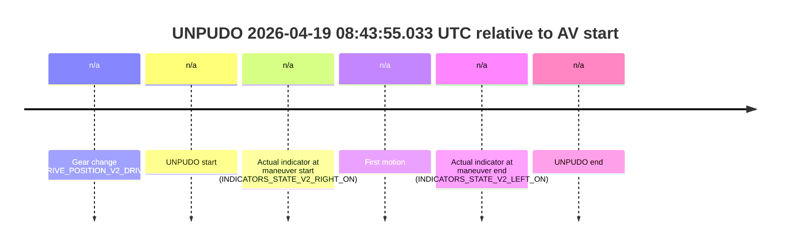
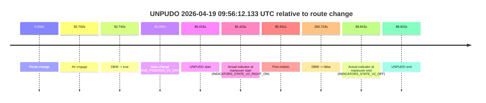
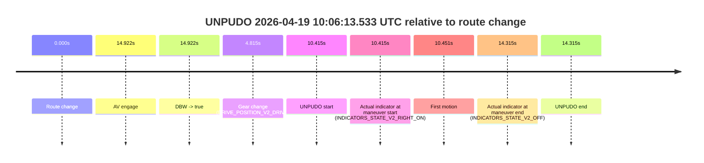

# Run Report: fme20009/2026-04-19--08-25-51--gen2-av-aefa6853-1db4-47ed-b110-00d929d8142b

| Field | Value |
|---|---|
| Run ID | `fme20009/2026-04-19--08-25-51--gen2-av-aefa6853-1db4-47ed-b110-00d929d8142b` |
| Date | `2026-04-19` |
| Model(s) | `armadillo-amethyst-squeaky` |
| Author | `guy.geva` |
| Event count | `15` |

## unpudo 2026-04-19 08:34:22.133 UTC

| Field | Value |
|---|---|
| Model | `armadillo-amethyst-squeaky` |
| Author | `guy.geva` |
| Run ID | `fme20009/2026-04-19--08-25-51--gen2-av-aefa6853-1db4-47ed-b110-00d929d8142b` |
| Date | `2026-04-19` |
| Time (UTC) | `08:34:22.133` |
| Event type | `unpudo` |
| Disengagement type | `failed_to_accelerate` |
| Route change | `found` |
| Console | [run](https://console.sso.wayve.ai/run/fme20009/2026-04-19--08-25-51--gen2-av-aefa6853-1db4-47ed-b110-00d929d8142b?id=&time-unixus=1776587662133305) |
| Foxglove | [segment](https://app.foxglove.dev/wayve-on-prem/p/prj_0dX18KZdVHg1fmmI/view?ds=foxglove-stream&ds.deviceName=fme20009&ds.start=2026-04-19T08%3A34%3A03.718443Z&ds.end=2026-04-19T08%3A34%3A49.233318Z&layoutId=lay_0e7VD4WIKDQGU73Y&time=2026-04-19T08%3A34%3A22.133305Z) |

### Event card: fail

- Fail: AV owns part of the segment, but the event still resolves as a model-performance failure under the AV-only scoring rule.

| Event | Time (UTC) | Delta from route change |
|---|---:|---:|
| Route change | 2026-04-19 08:34:13.718 | `0.000s` |
| AV engage | 2026-04-19 08:34:26.439 | `12.721s` |
| DBW -> true | 2026-04-19 08:34:26.439 | `12.721s` |
| Gear change (DRIVE_POSITION_V2_DRIVE) | 2026-04-19 08:34:20.183 | `6.465s` |
| UNPUDO start | 2026-04-19 08:34:22.133 | `8.415s` |
| Actual indicator at maneuver start (INDICATORS_STATE_V2_RIGHT_ON) | 2026-04-19 08:34:22.133 | `8.415s` |
| First motion | 2026-04-19 08:34:22.189 | `8.471s` |
| DBW -> false | 2026-04-19 08:34:36.040 | `22.322s` |
| Actual indicator at maneuver end (INDICATORS_STATE_V2_OFF) | 2026-04-19 08:34:39.233 | `25.515s` |
| UNPUDO end | 2026-04-19 08:34:39.233 | `25.515s` |

| Metric | Value |
|---|---|
| Outcome | `fail` |
| Effective failure type | `failed_to_accelerate` |
| Route change status | `found` |
| DBW at event start | `false` |
| DBW at event end | `false` |
| Predicted gear at AV start | `DRIVE_POSITION_V2_DRIVE` |
| Actual gear at AV start | `DRIVE_POSITION_V2_DRIVE` |
| Predicted gear at event start | `DRIVE_POSITION_V2_DRIVE` |
| Actual gear at event start | `DRIVE_POSITION_V2_DRIVE` |
| Planned indicator direction | `INDICATORS_STATE_V2_OFF` |
| Controller indicator direction | `INDICATORS_STATE_V2_OFF` |
| Actual indicator direction | `INDICATORS_STATE_V2_RIGHT_ON` |
| Actual indicator at maneuver end | `INDICATORS_STATE_V2_OFF` |
| Driver accel help in AV | `false` |
| Driver accel help timestamp | `n/a` |
| Max accel pedal pct in AV | `0.0%` |
| Max brake pedal pct in AV | `8.4%` |
| Max speed mps in AV | `0.000` |
| Route -> AV | `12.721s` |
| AV -> event start | `-4.306s` |
| AV -> first motion | `-4.250s` |
| AV duration before disengagement | `9.601s` |
| Trajectory waypoint count | `36` |
| Driving-plan step count | `11` |

The scored portion starts from the AV-owned window, not from the pre-AV setup. Route-change search in the stopped pre-event segment was `found`, with the baseline therefore set to route change. At the event anchor the model predicts `DRIVE_POSITION_V2_DRIVE` and the actual gear is `DRIVE_POSITION_V2_DRIVE`. The effective model outcome is `fail` because `failed_to_accelerate`.

### Resolution

| Field | Value |
|---|---|
| Final outcome | `fail` |
| Do we agree with this label? | `yes` |
| Source disengagement type | `failed_to_accelerate` |
| Resolved effective failure type | `failed_to_accelerate` |
| Confidence | `high` |

## unpudo 2026-04-19 08:43:55.033 UTC

| Field | Value |
|---|---|
| Model | `armadillo-amethyst-squeaky` |
| Author | `guy.geva` |
| Run ID | `fme20009/2026-04-19--08-25-51--gen2-av-aefa6853-1db4-47ed-b110-00d929d8142b` |
| Date | `2026-04-19` |
| Time (UTC) | `08:43:55.033` |
| Event type | `unpudo` |
| Disengagement type | `none observed` |
| Route change | `unclear` |
| Console | [run](https://console.sso.wayve.ai/run/fme20009/2026-04-19--08-25-51--gen2-av-aefa6853-1db4-47ed-b110-00d929d8142b?id=&time-unixus=1776588235033332) |
| Foxglove | [segment](https://app.foxglove.dev/wayve-on-prem/p/prj_0dX18KZdVHg1fmmI/view?ds=foxglove-stream&ds.deviceName=fme20009&ds.start=2026-04-19T08%3A43%3A39.033309Z&ds.end=2026-04-19T08%3A44%3A10.733329Z&layoutId=lay_0e7VD4WIKDQGU73Y&time=2026-04-19T08%3A43%3A55.033332Z) |

### Event card: non-av

- Non-AV: there is no AV-owned portion anywhere inside the detected unpudo timeline, so it is kept for coverage but excluded from model success / failure scoring.

| Event | Time (UTC) | Delta from AV start |
|---|---:|---:|
| Gear change (DRIVE_POSITION_V2_DRIVE) | 2026-04-19 08:43:49.033 | `n/a` |
| UNPUDO start | 2026-04-19 08:43:55.033 | `n/a` |
| Actual indicator at maneuver start (INDICATORS_STATE_V2_RIGHT_ON) | 2026-04-19 08:43:55.033 | `n/a` |
| First motion | 2026-04-19 08:43:55.109 | `n/a` |
| Actual indicator at maneuver end (INDICATORS_STATE_V2_LEFT_ON) | 2026-04-19 08:44:00.733 | `n/a` |
| UNPUDO end | 2026-04-19 08:44:00.733 | `n/a` |

| Metric | Value |
|---|---|
| Outcome | `non-av` |
| Effective failure type | `none` |
| Route change status | `unclear` |
| DBW at event start | `false` |
| DBW at event end | `false` |
| Predicted gear at AV start | `n/a` |
| Actual gear at AV start | `n/a` |
| Predicted gear at event start | `DRIVE_POSITION_V2_DRIVE` |
| Actual gear at event start | `DRIVE_POSITION_V2_DRIVE` |
| Planned indicator direction | `INDICATORS_STATE_V2_RIGHT_ON` |
| Controller indicator direction | `INDICATORS_STATE_V2_RIGHT_ON` |
| Actual indicator direction | `INDICATORS_STATE_V2_RIGHT_ON` |
| Actual indicator at maneuver end | `INDICATORS_STATE_V2_LEFT_ON` |
| Driver accel help in AV | `false` |
| Driver accel help timestamp | `n/a` |
| Max accel pedal pct in AV | `0.0%` |
| Max brake pedal pct in AV | `0.0%` |
| Max speed mps in AV | `0.000` |
| Route -> AV | `n/a` |
| AV -> event start | `n/a` |
| AV -> first motion | `n/a` |
| AV duration before disengagement | `n/a` |
| Trajectory waypoint count | `36` |
| Driving-plan step count | `11` |

The scored portion starts from the AV-owned window, not from the pre-AV setup. Route-change search in the stopped pre-event segment was `unclear`, with the baseline therefore set to AV start. At the event anchor the model predicts `DRIVE_POSITION_V2_DRIVE` and the actual gear is `DRIVE_POSITION_V2_DRIVE`. The effective model outcome is `non-av` because `there is no AV-owned overlap inside the event timeline`.

### Resolution

| Field | Value |
|---|---|
| Final outcome | `non-av` |
| Do we agree with this label? | `yes` |
| Source disengagement type | `none observed` |
| Resolved effective failure type | `none` |
| Confidence | `medium` |

## unpudo 2026-04-19 08:44:22.583 UTC

| Field | Value |
|---|---|
| Model | `armadillo-amethyst-squeaky` |
| Author | `guy.geva` |
| Run ID | `fme20009/2026-04-19--08-25-51--gen2-av-aefa6853-1db4-47ed-b110-00d929d8142b` |
| Date | `2026-04-19` |
| Time (UTC) | `08:44:22.583` |
| Event type | `unpudo` |
| Disengagement type | `none observed` |
| Route change | `unclear` |
| Console | [run](https://console.sso.wayve.ai/run/fme20009/2026-04-19--08-25-51--gen2-av-aefa6853-1db4-47ed-b110-00d929d8142b?id=&time-unixus=1776588262583307) |
| Foxglove | [segment](https://app.foxglove.dev/wayve-on-prem/p/prj_0dX18KZdVHg1fmmI/view?ds=foxglove-stream&ds.deviceName=fme20009&ds.start=2026-04-19T08%3A44%3A11.383318Z&ds.end=2026-04-19T08%3A44%3A36.083297Z&layoutId=lay_0e7VD4WIKDQGU73Y&time=2026-04-19T08%3A44%3A22.583307Z) |

### Event card: non-av

- Non-AV: there is no AV-owned portion anywhere inside the detected unpudo timeline, so it is kept for coverage but excluded from model success / failure scoring.

| Event | Time (UTC) | Delta from AV start |
|---|---:|---:|
| Gear change (DRIVE_POSITION_V2_DRIVE) | 2026-04-19 08:44:21.383 | `n/a` |
| UNPUDO start | 2026-04-19 08:44:22.583 | `n/a` |
| Actual indicator at maneuver start (INDICATORS_STATE_V2_OFF) | 2026-04-19 08:44:22.583 | `n/a` |
| First motion | 2026-04-19 08:44:22.709 | `n/a` |
| Actual indicator at maneuver end (INDICATORS_STATE_V2_OFF) | 2026-04-19 08:44:26.083 | `n/a` |
| UNPUDO end | 2026-04-19 08:44:26.083 | `n/a` |

| Metric | Value |
|---|---|
| Outcome | `non-av` |
| Effective failure type | `none` |
| Route change status | `unclear` |
| DBW at event start | `false` |
| DBW at event end | `false` |
| Predicted gear at AV start | `n/a` |
| Actual gear at AV start | `n/a` |
| Predicted gear at event start | `DRIVE_POSITION_V2_REVERSE` |
| Actual gear at event start | `DRIVE_POSITION_V2_DRIVE` |
| Planned indicator direction | `INDICATORS_STATE_V2_OFF` |
| Controller indicator direction | `INDICATORS_STATE_V2_OFF` |
| Actual indicator direction | `INDICATORS_STATE_V2_OFF` |
| Actual indicator at maneuver end | `INDICATORS_STATE_V2_OFF` |
| Driver accel help in AV | `false` |
| Driver accel help timestamp | `n/a` |
| Max accel pedal pct in AV | `0.0%` |
| Max brake pedal pct in AV | `0.0%` |
| Max speed mps in AV | `0.000` |
| Route -> AV | `n/a` |
| AV -> event start | `n/a` |
| AV -> first motion | `n/a` |
| AV duration before disengagement | `n/a` |
| Trajectory waypoint count | `37` |
| Driving-plan step count | `11` |

The scored portion starts from the AV-owned window, not from the pre-AV setup. Route-change search in the stopped pre-event segment was `unclear`, with the baseline therefore set to AV start. At the event anchor the model predicts `DRIVE_POSITION_V2_REVERSE` and the actual gear is `DRIVE_POSITION_V2_DRIVE`. The effective model outcome is `non-av` because `there is no AV-owned overlap inside the event timeline`.

### Resolution

| Field | Value |
|---|---|
| Final outcome | `non-av` |
| Do we agree with this label? | `yes` |
| Source disengagement type | `none observed` |
| Resolved effective failure type | `none` |
| Confidence | `medium` |

## unpudo 2026-04-19 08:45:07.533 UTC

| Field | Value |
|---|---|
| Model | `armadillo-amethyst-squeaky` |
| Author | `guy.geva` |
| Run ID | `fme20009/2026-04-19--08-25-51--gen2-av-aefa6853-1db4-47ed-b110-00d929d8142b` |
| Date | `2026-04-19` |
| Time (UTC) | `08:45:07.533` |
| Event type | `unpudo` |
| Disengagement type | `none observed` |
| Route change | `found` |
| Console | [run](https://console.sso.wayve.ai/run/fme20009/2026-04-19--08-25-51--gen2-av-aefa6853-1db4-47ed-b110-00d929d8142b?id=&time-unixus=1776588307533318) |
| Foxglove | [segment](https://app.foxglove.dev/wayve-on-prem/p/prj_0dX18KZdVHg1fmmI/view?ds=foxglove-stream&ds.deviceName=fme20009&ds.start=2026-04-19T08%3A44%3A49.268273Z&ds.end=2026-04-19T08%3A46%3A42.640381Z&layoutId=lay_0e7VD4WIKDQGU73Y&time=2026-04-19T08%3A45%3A07.533318Z) |

### Event card: pass

- Pass: AV owns the credited unpudo through the official event window, the gear state is aligned at the anchor, and the vehicle moves without driver accelerator help in AV.

| Event | Time (UTC) | Delta from route change |
|---|---:|---:|
| Route change | 2026-04-19 08:44:59.268 | `0.000s` |
| AV engage | 2026-04-19 08:45:03.400 | `4.132s` |
| DBW -> true | 2026-04-19 08:45:03.400 | `4.132s` |
| Gear change (DRIVE_POSITION_V2_DRIVE) | 2026-04-19 08:45:03.833 | `4.565s` |
| UNPUDO start | 2026-04-19 08:45:07.533 | `8.265s` |
| Actual indicator at maneuver start (INDICATORS_STATE_V2_OFF) | 2026-04-19 08:45:07.533 | `8.265s` |
| First motion | 2026-04-19 08:45:07.589 | `8.321s` |
| DBW -> false | 2026-04-19 08:46:32.640 | `93.372s` |
| Actual indicator at maneuver end (INDICATORS_STATE_V2_OFF) | 2026-04-19 08:45:11.683 | `12.415s` |
| UNPUDO end | 2026-04-19 08:45:11.683 | `12.415s` |

| Metric | Value |
|---|---|
| Outcome | `pass` |
| Effective failure type | `none` |
| Route change status | `found` |
| DBW at event start | `true` |
| DBW at event end | `true` |
| Predicted gear at AV start | `DRIVE_POSITION_V2_DRIVE` |
| Actual gear at AV start | `DRIVE_POSITION_V2_PARK` |
| Predicted gear at event start | `DRIVE_POSITION_V2_DRIVE` |
| Actual gear at event start | `DRIVE_POSITION_V2_DRIVE` |
| Planned indicator direction | `INDICATORS_STATE_V2_OFF` |
| Controller indicator direction | `INDICATORS_STATE_V2_OFF` |
| Actual indicator direction | `INDICATORS_STATE_V2_OFF` |
| Actual indicator at maneuver end | `INDICATORS_STATE_V2_OFF` |
| Driver accel help in AV | `false` |
| Driver accel help timestamp | `n/a` |
| Max accel pedal pct in AV | `0.0%` |
| Max brake pedal pct in AV | `0.0%` |
| Max speed mps in AV | `3.256` |
| Route -> AV | `4.132s` |
| AV -> event start | `4.133s` |
| AV -> first motion | `4.189s` |
| AV duration before disengagement | `89.240s` |
| Trajectory waypoint count | `36` |
| Driving-plan step count | `11` |

The scored portion starts from the AV-owned window, not from the pre-AV setup. Route-change search in the stopped pre-event segment was `found`, with the baseline therefore set to route change. At the event anchor the model predicts `DRIVE_POSITION_V2_DRIVE` and the actual gear is `DRIVE_POSITION_V2_DRIVE`. The effective model outcome is `pass` because `the credited maneuver stays AV-owned through the official event end`.

### Resolution

| Field | Value |
|---|---|
| Final outcome | `pass` |
| Do we agree with this label? | `yes` |
| Source disengagement type | `none observed` |
| Resolved effective failure type | `none` |
| Confidence | `high` |

## unpudo 2026-04-19 08:48:26.433 UTC

| Field | Value |
|---|---|
| Model | `armadillo-amethyst-squeaky` |
| Author | `guy.geva` |
| Run ID | `fme20009/2026-04-19--08-25-51--gen2-av-aefa6853-1db4-47ed-b110-00d929d8142b` |
| Date | `2026-04-19` |
| Time (UTC) | `08:48:26.433` |
| Event type | `unpudo` |
| Disengagement type | `failed_to_accelerate` |
| Route change | `found` |
| Console | [run](https://console.sso.wayve.ai/run/fme20009/2026-04-19--08-25-51--gen2-av-aefa6853-1db4-47ed-b110-00d929d8142b?id=&time-unixus=1776588506433309) |
| Foxglove | [segment](https://app.foxglove.dev/wayve-on-prem/p/prj_0dX18KZdVHg1fmmI/view?ds=foxglove-stream&ds.deviceName=fme20009&ds.start=2026-04-19T08%3A47%3A59.318425Z&ds.end=2026-04-19T08%3A49%3A15.383315Z&layoutId=lay_0e7VD4WIKDQGU73Y&time=2026-04-19T08%3A48%3A26.433309Z) |

### Event card: fail

- Fail: AV owns part of the segment, but the event still resolves as a model-performance failure under the AV-only scoring rule.

| Event | Time (UTC) | Delta from route change |
|---|---:|---:|
| Route change | 2026-04-19 08:48:09.318 | `0.000s` |
| AV engage | 2026-04-19 08:48:51.600 | `42.282s` |
| DBW -> true | 2026-04-19 08:48:51.600 | `42.282s` |
| Gear change (DRIVE_POSITION_V2_DRIVE) | 2026-04-19 08:48:14.133 | `4.815s` |
| UNPUDO start | 2026-04-19 08:48:26.433 | `17.115s` |
| Actual indicator at maneuver start (INDICATORS_STATE_V2_OFF) | 2026-04-19 08:48:26.433 | `17.115s` |
| First motion | 2026-04-19 08:48:26.549 | `17.231s` |
| DBW -> false | 2026-04-19 08:49:03.659 | `54.342s` |
| Actual indicator at maneuver end (INDICATORS_STATE_V2_OFF) | 2026-04-19 08:49:05.383 | `56.065s` |
| UNPUDO end | 2026-04-19 08:49:05.383 | `56.065s` |

| Metric | Value |
|---|---|
| Outcome | `fail` |
| Effective failure type | `failed_to_accelerate` |
| Route change status | `found` |
| DBW at event start | `false` |
| DBW at event end | `false` |
| Predicted gear at AV start | `DRIVE_POSITION_V2_DRIVE` |
| Actual gear at AV start | `DRIVE_POSITION_V2_DRIVE` |
| Predicted gear at event start | `DRIVE_POSITION_V2_DRIVE` |
| Actual gear at event start | `DRIVE_POSITION_V2_DRIVE` |
| Planned indicator direction | `INDICATORS_STATE_V2_RIGHT_ON` |
| Controller indicator direction | `INDICATORS_STATE_V2_RIGHT_ON` |
| Actual indicator direction | `INDICATORS_STATE_V2_OFF` |
| Actual indicator at maneuver end | `INDICATORS_STATE_V2_OFF` |
| Driver accel help in AV | `false` |
| Driver accel help timestamp | `n/a` |
| Max accel pedal pct in AV | `0.0%` |
| Max brake pedal pct in AV | `8.0%` |
| Max speed mps in AV | `0.056` |
| Route -> AV | `42.282s` |
| AV -> event start | `-25.167s` |
| AV -> first motion | `-25.051s` |
| AV duration before disengagement | `12.060s` |
| Trajectory waypoint count | `36` |
| Driving-plan step count | `11` |

The scored portion starts from the AV-owned window, not from the pre-AV setup. Route-change search in the stopped pre-event segment was `found`, with the baseline therefore set to route change. At the event anchor the model predicts `DRIVE_POSITION_V2_DRIVE` and the actual gear is `DRIVE_POSITION_V2_DRIVE`. The effective model outcome is `fail` because `failed_to_accelerate`.

### Resolution

| Field | Value |
|---|---|
| Final outcome | `fail` |
| Do we agree with this label? | `yes` |
| Source disengagement type | `failed_to_accelerate` |
| Resolved effective failure type | `failed_to_accelerate` |
| Confidence | `high` |

## unpudo 2026-04-19 08:51:12.033 UTC

| Field | Value |
|---|---|
| Model | `armadillo-amethyst-squeaky` |
| Author | `guy.geva` |
| Run ID | `fme20009/2026-04-19--08-25-51--gen2-av-aefa6853-1db4-47ed-b110-00d929d8142b` |
| Date | `2026-04-19` |
| Time (UTC) | `08:51:12.033` |
| Event type | `unpudo` |
| Disengagement type | `none observed` |
| Route change | `found` |
| Console | [run](https://console.sso.wayve.ai/run/fme20009/2026-04-19--08-25-51--gen2-av-aefa6853-1db4-47ed-b110-00d929d8142b?id=&time-unixus=1776588672033321) |
| Foxglove | [segment](https://app.foxglove.dev/wayve-on-prem/p/prj_0dX18KZdVHg1fmmI/view?ds=foxglove-stream&ds.deviceName=fme20009&ds.start=2026-04-19T08%3A50%3A52.268262Z&ds.end=2026-04-19T08%3A53%3A21.460188Z&layoutId=lay_0e7VD4WIKDQGU73Y&time=2026-04-19T08%3A51%3A12.033321Z) |

### Event card: non-av

- Non-AV: there is no AV-owned portion anywhere inside the detected unpudo timeline, so it is kept for coverage but excluded from model success / failure scoring.

| Event | Time (UTC) | Delta from route change |
|---|---:|---:|
| Route change | 2026-04-19 08:51:02.268 | `0.000s` |
| AV engage | 2026-04-19 08:51:52.459 | `50.192s` |
| DBW -> true | 2026-04-19 08:51:52.459 | `50.192s` |
| Gear change (DRIVE_POSITION_V2_DRIVE) | 2026-04-19 08:51:05.033 | `2.765s` |
| UNPUDO start | 2026-04-19 08:51:12.033 | `9.765s` |
| Actual indicator at maneuver start (INDICATORS_STATE_V2_OFF) | 2026-04-19 08:51:12.033 | `9.765s` |
| First motion | 2026-04-19 08:51:12.049 | `9.781s` |
| DBW -> false | 2026-04-19 08:53:11.460 | `129.192s` |
| Actual indicator at maneuver end (INDICATORS_STATE_V2_OFF) | 2026-04-19 08:51:49.133 | `46.865s` |
| UNPUDO end | 2026-04-19 08:51:49.133 | `46.865s` |

| Metric | Value |
|---|---|
| Outcome | `non-av` |
| Effective failure type | `none` |
| Route change status | `found` |
| DBW at event start | `false` |
| DBW at event end | `false` |
| Predicted gear at AV start | `DRIVE_POSITION_V2_DRIVE` |
| Actual gear at AV start | `DRIVE_POSITION_V2_DRIVE` |
| Predicted gear at event start | `DRIVE_POSITION_V2_DRIVE` |
| Actual gear at event start | `DRIVE_POSITION_V2_DRIVE` |
| Planned indicator direction | `INDICATORS_STATE_V2_RIGHT_ON` |
| Controller indicator direction | `INDICATORS_STATE_V2_RIGHT_ON` |
| Actual indicator direction | `INDICATORS_STATE_V2_OFF` |
| Actual indicator at maneuver end | `INDICATORS_STATE_V2_OFF` |
| Driver accel help in AV | `false` |
| Driver accel help timestamp | `n/a` |
| Max accel pedal pct in AV | `0.0%` |
| Max brake pedal pct in AV | `0.0%` |
| Max speed mps in AV | `0.000` |
| Route -> AV | `50.192s` |
| AV -> event start | `-40.427s` |
| AV -> first motion | `-40.410s` |
| AV duration before disengagement | `79.000s` |
| Trajectory waypoint count | `36` |
| Driving-plan step count | `11` |

The scored portion starts from the AV-owned window, not from the pre-AV setup. Route-change search in the stopped pre-event segment was `found`, with the baseline therefore set to route change. At the event anchor the model predicts `DRIVE_POSITION_V2_DRIVE` and the actual gear is `DRIVE_POSITION_V2_DRIVE`. The effective model outcome is `non-av` because `there is no AV-owned overlap inside the event timeline`.

### Resolution

| Field | Value |
|---|---|
| Final outcome | `non-av` |
| Do we agree with this label? | `yes` |
| Source disengagement type | `none observed` |
| Resolved effective failure type | `none` |
| Confidence | `high` |

## unpudo 2026-04-19 08:53:58.883 UTC

| Field | Value |
|---|---|
| Model | `armadillo-amethyst-squeaky` |
| Author | `guy.geva` |
| Run ID | `fme20009/2026-04-19--08-25-51--gen2-av-aefa6853-1db4-47ed-b110-00d929d8142b` |
| Date | `2026-04-19` |
| Time (UTC) | `08:53:58.883` |
| Event type | `unpudo` |
| Disengagement type | `failed_to_slow` |
| Route change | `found` |
| Console | [run](https://console.sso.wayve.ai/run/fme20009/2026-04-19--08-25-51--gen2-av-aefa6853-1db4-47ed-b110-00d929d8142b?id=&time-unixus=1776588838883303) |
| Foxglove | [segment](https://app.foxglove.dev/wayve-on-prem/p/prj_0dX18KZdVHg1fmmI/view?ds=foxglove-stream&ds.deviceName=fme20009&ds.start=2026-04-19T08%3A53%3A35.718272Z&ds.end=2026-04-19T08%3A54%3A15.483308Z&layoutId=lay_0e7VD4WIKDQGU73Y&time=2026-04-19T08%3A53%3A58.883303Z) |

### Event card: accidental

- Accidental: AV ownership is present for less than `2s`, so this is treated as an accidental brush with the maneuver rather than a meaningful model attempt.

| Event | Time (UTC) | Delta from route change |
|---|---:|---:|
| Route change | 2026-04-19 08:53:45.718 | `0.000s` |
| AV engage | 2026-04-19 08:53:53.160 | `7.442s` |
| DBW -> true | 2026-04-19 08:53:53.160 | `7.442s` |
| Gear change (DRIVE_POSITION_V2_DRIVE) | 2026-04-19 08:53:53.633 | `7.915s` |
| UNPUDO start | 2026-04-19 08:53:58.883 | `13.165s` |
| Actual indicator at maneuver start (INDICATORS_STATE_V2_OFF) | 2026-04-19 08:53:58.883 | `13.165s` |
| First motion | 2026-04-19 08:53:58.929 | `13.211s` |
| DBW -> false | 2026-04-19 08:54:00.299 | `14.582s` |
| Actual indicator at maneuver end (INDICATORS_STATE_V2_RIGHT_ON) | 2026-04-19 08:54:05.483 | `19.765s` |
| UNPUDO end | 2026-04-19 08:54:05.483 | `19.765s` |

| Metric | Value |
|---|---|
| Outcome | `accidental` |
| Effective failure type | `none` |
| Route change status | `found` |
| DBW at event start | `true` |
| DBW at event end | `false` |
| Predicted gear at AV start | `DRIVE_POSITION_V2_DRIVE` |
| Actual gear at AV start | `DRIVE_POSITION_V2_PARK` |
| Predicted gear at event start | `DRIVE_POSITION_V2_DRIVE` |
| Actual gear at event start | `DRIVE_POSITION_V2_DRIVE` |
| Planned indicator direction | `INDICATORS_STATE_V2_RIGHT_ON` |
| Controller indicator direction | `INDICATORS_STATE_V2_RIGHT_ON` |
| Actual indicator direction | `INDICATORS_STATE_V2_OFF` |
| Actual indicator at maneuver end | `INDICATORS_STATE_V2_RIGHT_ON` |
| Driver accel help in AV | `false` |
| Driver accel help timestamp | `n/a` |
| Max accel pedal pct in AV | `0.0%` |
| Max brake pedal pct in AV | `0.0%` |
| Max speed mps in AV | `2.794` |
| Route -> AV | `7.442s` |
| AV -> event start | `5.723s` |
| AV -> first motion | `5.769s` |
| AV duration before disengagement | `7.140s` |
| Trajectory waypoint count | `37` |
| Driving-plan step count | `11` |

The scored portion starts from the AV-owned window, not from the pre-AV setup. Route-change search in the stopped pre-event segment was `found`, with the baseline therefore set to route change. At the event anchor the model predicts `DRIVE_POSITION_V2_DRIVE` and the actual gear is `DRIVE_POSITION_V2_DRIVE`. The effective model outcome is `accidental` because `the AV-owned portion is shorter than 2s`.

### Resolution

| Field | Value |
|---|---|
| Final outcome | `accidental` |
| Do we agree with this label? | `yes` |
| Source disengagement type | `failed_to_slow` |
| Resolved effective failure type | `none` |
| Confidence | `high` |

## unpudo 2026-04-19 09:01:44.633 UTC

| Field | Value |
|---|---|
| Model | `armadillo-amethyst-squeaky` |
| Author | `guy.geva` |
| Run ID | `fme20009/2026-04-19--08-25-51--gen2-av-aefa6853-1db4-47ed-b110-00d929d8142b` |
| Date | `2026-04-19` |
| Time (UTC) | `09:01:44.633` |
| Event type | `unpudo` |
| Disengagement type | `none observed` |
| Route change | `found` |
| Console | [run](https://console.sso.wayve.ai/run/fme20009/2026-04-19--08-25-51--gen2-av-aefa6853-1db4-47ed-b110-00d929d8142b?id=&time-unixus=1776589304633320) |
| Foxglove | [segment](https://app.foxglove.dev/wayve-on-prem/p/prj_0dX18KZdVHg1fmmI/view?ds=foxglove-stream&ds.deviceName=fme20009&ds.start=2026-04-19T09%3A01%3A22.818248Z&ds.end=2026-04-19T09%3A03%3A12.359891Z&layoutId=lay_0e7VD4WIKDQGU73Y&time=2026-04-19T09%3A01%3A44.633320Z) |

### Event card: pass

- Pass: AV owns the credited unpudo through the official event window, the gear state is aligned at the anchor, and the vehicle moves without driver accelerator help in AV.

| Event | Time (UTC) | Delta from route change |
|---|---:|---:|
| Route change | 2026-04-19 09:01:32.818 | `0.000s` |
| AV engage | 2026-04-19 09:01:40.580 | `7.762s` |
| DBW -> true | 2026-04-19 09:01:40.580 | `7.762s` |
| Gear change (DRIVE_POSITION_V2_DRIVE) | 2026-04-19 09:01:41.033 | `8.215s` |
| UNPUDO start | 2026-04-19 09:01:44.633 | `11.815s` |
| Actual indicator at maneuver start (INDICATORS_STATE_V2_OFF) | 2026-04-19 09:01:44.633 | `11.815s` |
| First motion | 2026-04-19 09:01:44.649 | `11.831s` |
| DBW -> false | 2026-04-19 09:03:02.359 | `89.542s` |
| Actual indicator at maneuver end (INDICATORS_STATE_V2_OFF) | 2026-04-19 09:01:47.933 | `15.115s` |
| UNPUDO end | 2026-04-19 09:01:47.933 | `15.115s` |

| Metric | Value |
|---|---|
| Outcome | `pass` |
| Effective failure type | `none` |
| Route change status | `found` |
| DBW at event start | `true` |
| DBW at event end | `true` |
| Predicted gear at AV start | `DRIVE_POSITION_V2_DRIVE` |
| Actual gear at AV start | `DRIVE_POSITION_V2_PARK` |
| Predicted gear at event start | `DRIVE_POSITION_V2_DRIVE` |
| Actual gear at event start | `DRIVE_POSITION_V2_DRIVE` |
| Planned indicator direction | `INDICATORS_STATE_V2_LEFT_ON` |
| Controller indicator direction | `INDICATORS_STATE_V2_LEFT_ON` |
| Actual indicator direction | `INDICATORS_STATE_V2_OFF` |
| Actual indicator at maneuver end | `INDICATORS_STATE_V2_OFF` |
| Driver accel help in AV | `false` |
| Driver accel help timestamp | `n/a` |
| Max accel pedal pct in AV | `0.0%` |
| Max brake pedal pct in AV | `0.0%` |
| Max speed mps in AV | `5.514` |
| Route -> AV | `7.762s` |
| AV -> event start | `4.053s` |
| AV -> first motion | `4.069s` |
| AV duration before disengagement | `81.780s` |
| Trajectory waypoint count | `36` |
| Driving-plan step count | `11` |

The scored portion starts from the AV-owned window, not from the pre-AV setup. Route-change search in the stopped pre-event segment was `found`, with the baseline therefore set to route change. At the event anchor the model predicts `DRIVE_POSITION_V2_DRIVE` and the actual gear is `DRIVE_POSITION_V2_DRIVE`. The effective model outcome is `pass` because `the credited maneuver stays AV-owned through the official event end`.

### Resolution

| Field | Value |
|---|---|
| Final outcome | `pass` |
| Do we agree with this label? | `yes` |
| Source disengagement type | `none observed` |
| Resolved effective failure type | `none` |
| Confidence | `high` |

## unpudo 2026-04-19 09:09:31.183 UTC

| Field | Value |
|---|---|
| Model | `armadillo-amethyst-squeaky` |
| Author | `guy.geva` |
| Run ID | `fme20009/2026-04-19--08-25-51--gen2-av-aefa6853-1db4-47ed-b110-00d929d8142b` |
| Date | `2026-04-19` |
| Time (UTC) | `09:09:31.183` |
| Event type | `unpudo` |
| Disengagement type | `none observed` |
| Route change | `found` |
| Console | [run](https://console.sso.wayve.ai/run/fme20009/2026-04-19--08-25-51--gen2-av-aefa6853-1db4-47ed-b110-00d929d8142b?id=&time-unixus=1776589771183295) |
| Foxglove | [segment](https://app.foxglove.dev/wayve-on-prem/p/prj_0dX18KZdVHg1fmmI/view?ds=foxglove-stream&ds.deviceName=fme20009&ds.start=2026-04-19T09%3A09%3A12.818259Z&ds.end=2026-04-19T09%3A10%3A33.720431Z&layoutId=lay_0e7VD4WIKDQGU73Y&time=2026-04-19T09%3A09%3A31.183295Z) |

### Event card: pass

- Pass: AV owns the credited unpudo through the official event window, the gear state is aligned at the anchor, and the vehicle moves without driver accelerator help in AV.

| Event | Time (UTC) | Delta from route change |
|---|---:|---:|
| Route change | 2026-04-19 09:09:22.818 | `0.000s` |
| AV engage | 2026-04-19 09:09:27.080 | `4.262s` |
| DBW -> true | 2026-04-19 09:09:27.080 | `4.262s` |
| Gear change (DRIVE_POSITION_V2_DRIVE) | 2026-04-19 09:09:27.533 | `4.715s` |
| UNPUDO start | 2026-04-19 09:09:31.183 | `8.365s` |
| Actual indicator at maneuver start (INDICATORS_STATE_V2_OFF) | 2026-04-19 09:09:31.183 | `8.365s` |
| First motion | 2026-04-19 09:09:31.209 | `8.391s` |
| DBW -> false | 2026-04-19 09:10:23.720 | `60.902s` |
| Actual indicator at maneuver end (INDICATORS_STATE_V2_OFF) | 2026-04-19 09:09:34.633 | `11.815s` |
| UNPUDO end | 2026-04-19 09:09:34.633 | `11.815s` |

| Metric | Value |
|---|---|
| Outcome | `pass` |
| Effective failure type | `none` |
| Route change status | `found` |
| DBW at event start | `true` |
| DBW at event end | `true` |
| Predicted gear at AV start | `DRIVE_POSITION_V2_DRIVE` |
| Actual gear at AV start | `DRIVE_POSITION_V2_PARK` |
| Predicted gear at event start | `DRIVE_POSITION_V2_DRIVE` |
| Actual gear at event start | `DRIVE_POSITION_V2_DRIVE` |
| Planned indicator direction | `INDICATORS_STATE_V2_RIGHT_ON` |
| Controller indicator direction | `INDICATORS_STATE_V2_RIGHT_ON` |
| Actual indicator direction | `INDICATORS_STATE_V2_OFF` |
| Actual indicator at maneuver end | `INDICATORS_STATE_V2_OFF` |
| Driver accel help in AV | `false` |
| Driver accel help timestamp | `n/a` |
| Max accel pedal pct in AV | `0.0%` |
| Max brake pedal pct in AV | `0.0%` |
| Max speed mps in AV | `4.664` |
| Route -> AV | `4.262s` |
| AV -> event start | `4.103s` |
| AV -> first motion | `4.129s` |
| AV duration before disengagement | `56.640s` |
| Trajectory waypoint count | `37` |
| Driving-plan step count | `11` |

The scored portion starts from the AV-owned window, not from the pre-AV setup. Route-change search in the stopped pre-event segment was `found`, with the baseline therefore set to route change. At the event anchor the model predicts `DRIVE_POSITION_V2_DRIVE` and the actual gear is `DRIVE_POSITION_V2_DRIVE`. The effective model outcome is `pass` because `the credited maneuver stays AV-owned through the official event end`.

### Resolution

| Field | Value |
|---|---|
| Final outcome | `pass` |
| Do we agree with this label? | `yes` |
| Source disengagement type | `none observed` |
| Resolved effective failure type | `none` |
| Confidence | `high` |

## unpudo 2026-04-19 09:13:52.983 UTC

| Field | Value |
|---|---|
| Model | `armadillo-amethyst-squeaky` |
| Author | `guy.geva` |
| Run ID | `fme20009/2026-04-19--08-25-51--gen2-av-aefa6853-1db4-47ed-b110-00d929d8142b` |
| Date | `2026-04-19` |
| Time (UTC) | `09:13:52.983` |
| Event type | `unpudo` |
| Disengagement type | `none observed` |
| Route change | `found` |
| Console | [run](https://console.sso.wayve.ai/run/fme20009/2026-04-19--08-25-51--gen2-av-aefa6853-1db4-47ed-b110-00d929d8142b?id=&time-unixus=1776590032983316) |
| Foxglove | [segment](https://app.foxglove.dev/wayve-on-prem/p/prj_0dX18KZdVHg1fmmI/view?ds=foxglove-stream&ds.deviceName=fme20009&ds.start=2026-04-19T09%3A13%3A03.168388Z&ds.end=2026-04-19T09%3A14%3A38.199989Z&layoutId=lay_0e7VD4WIKDQGU73Y&time=2026-04-19T09%3A13%3A52.983316Z) |

### Event card: non-av

- Non-AV: there is no AV-owned portion anywhere inside the detected unpudo timeline, so it is kept for coverage but excluded from model success / failure scoring.

| Event | Time (UTC) | Delta from route change |
|---|---:|---:|
| Route change | 2026-04-19 09:13:13.168 | `0.000s` |
| AV engage | 2026-04-19 09:13:59.139 | `45.972s` |
| DBW -> true | 2026-04-19 09:13:59.139 | `45.972s` |
| Gear change (DRIVE_POSITION_V2_DRIVE) | 2026-04-19 09:13:42.633 | `29.465s` |
| UNPUDO start | 2026-04-19 09:13:52.983 | `39.815s` |
| Actual indicator at maneuver start (INDICATORS_STATE_V2_LEFT_ON) | 2026-04-19 09:13:52.983 | `39.815s` |
| First motion | 2026-04-19 09:13:53.029 | `39.861s` |
| DBW -> false | 2026-04-19 09:14:28.199 | `75.032s` |
| Actual indicator at maneuver end (INDICATORS_STATE_V2_OFF) | 2026-04-19 09:13:57.383 | `44.215s` |
| UNPUDO end | 2026-04-19 09:13:57.383 | `44.215s` |

| Metric | Value |
|---|---|
| Outcome | `non-av` |
| Effective failure type | `none` |
| Route change status | `found` |
| DBW at event start | `false` |
| DBW at event end | `false` |
| Predicted gear at AV start | `DRIVE_POSITION_V2_DRIVE` |
| Actual gear at AV start | `DRIVE_POSITION_V2_DRIVE` |
| Predicted gear at event start | `DRIVE_POSITION_V2_DRIVE` |
| Actual gear at event start | `DRIVE_POSITION_V2_DRIVE` |
| Planned indicator direction | `INDICATORS_STATE_V2_OFF` |
| Controller indicator direction | `INDICATORS_STATE_V2_OFF` |
| Actual indicator direction | `INDICATORS_STATE_V2_LEFT_ON` |
| Actual indicator at maneuver end | `INDICATORS_STATE_V2_OFF` |
| Driver accel help in AV | `false` |
| Driver accel help timestamp | `n/a` |
| Max accel pedal pct in AV | `0.0%` |
| Max brake pedal pct in AV | `0.0%` |
| Max speed mps in AV | `0.000` |
| Route -> AV | `45.972s` |
| AV -> event start | `-6.157s` |
| AV -> first motion | `-6.111s` |
| AV duration before disengagement | `29.060s` |
| Trajectory waypoint count | `37` |
| Driving-plan step count | `11` |

The scored portion starts from the AV-owned window, not from the pre-AV setup. Route-change search in the stopped pre-event segment was `found`, with the baseline therefore set to route change. At the event anchor the model predicts `DRIVE_POSITION_V2_DRIVE` and the actual gear is `DRIVE_POSITION_V2_DRIVE`. The effective model outcome is `non-av` because `there is no AV-owned overlap inside the event timeline`.

### Resolution

| Field | Value |
|---|---|
| Final outcome | `non-av` |
| Do we agree with this label? | `yes` |
| Source disengagement type | `none observed` |
| Resolved effective failure type | `none` |
| Confidence | `high` |

## unpudo 2026-04-19 09:42:18.433 UTC

| Field | Value |
|---|---|
| Model | `armadillo-amethyst-squeaky` |
| Author | `guy.geva` |
| Run ID | `fme20009/2026-04-19--08-25-51--gen2-av-aefa6853-1db4-47ed-b110-00d929d8142b` |
| Date | `2026-04-19` |
| Time (UTC) | `09:42:18.433` |
| Event type | `unpudo` |
| Disengagement type | `none observed` |
| Route change | `found` |
| Console | [run](https://console.sso.wayve.ai/run/fme20009/2026-04-19--08-25-51--gen2-av-aefa6853-1db4-47ed-b110-00d929d8142b?id=&time-unixus=1776591738433320) |
| Foxglove | [segment](https://app.foxglove.dev/wayve-on-prem/p/prj_0dX18KZdVHg1fmmI/view?ds=foxglove-stream&ds.deviceName=fme20009&ds.start=2026-04-19T09%3A41%3A40.718281Z&ds.end=2026-04-19T09%3A44%3A13.880461Z&layoutId=lay_0e7VD4WIKDQGU73Y&time=2026-04-19T09%3A42%3A18.433320Z) |

### Event card: pass

- Pass: AV owns the credited unpudo through the official event window, the gear state is aligned at the anchor, and the vehicle moves without driver accelerator help in AV.

| Event | Time (UTC) | Delta from route change |
|---|---:|---:|
| Route change | 2026-04-19 09:41:50.718 | `0.000s` |
| AV engage | 2026-04-19 09:42:14.300 | `23.582s` |
| DBW -> true | 2026-04-19 09:42:14.300 | `23.582s` |
| Gear change (DRIVE_POSITION_V2_DRIVE) | 2026-04-19 09:42:14.833 | `24.115s` |
| UNPUDO start | 2026-04-19 09:42:18.433 | `27.715s` |
| Actual indicator at maneuver start (INDICATORS_STATE_V2_RIGHT_ON) | 2026-04-19 09:42:18.433 | `27.715s` |
| First motion | 2026-04-19 09:42:18.449 | `27.731s` |
| DBW -> false | 2026-04-19 09:44:03.880 | `133.162s` |
| Actual indicator at maneuver end (INDICATORS_STATE_V2_OFF) | 2026-04-19 09:42:21.833 | `31.115s` |
| UNPUDO end | 2026-04-19 09:42:21.833 | `31.115s` |

| Metric | Value |
|---|---|
| Outcome | `pass` |
| Effective failure type | `none` |
| Route change status | `found` |
| DBW at event start | `true` |
| DBW at event end | `true` |
| Predicted gear at AV start | `DRIVE_POSITION_V2_DRIVE` |
| Actual gear at AV start | `DRIVE_POSITION_V2_PARK` |
| Predicted gear at event start | `DRIVE_POSITION_V2_DRIVE` |
| Actual gear at event start | `DRIVE_POSITION_V2_DRIVE` |
| Planned indicator direction | `INDICATORS_STATE_V2_OFF` |
| Controller indicator direction | `INDICATORS_STATE_V2_OFF` |
| Actual indicator direction | `INDICATORS_STATE_V2_RIGHT_ON` |
| Actual indicator at maneuver end | `INDICATORS_STATE_V2_OFF` |
| Driver accel help in AV | `false` |
| Driver accel help timestamp | `n/a` |
| Max accel pedal pct in AV | `0.0%` |
| Max brake pedal pct in AV | `0.0%` |
| Max speed mps in AV | `5.072` |
| Route -> AV | `23.582s` |
| AV -> event start | `4.133s` |
| AV -> first motion | `4.150s` |
| AV duration before disengagement | `109.580s` |
| Trajectory waypoint count | `36` |
| Driving-plan step count | `11` |

The scored portion starts from the AV-owned window, not from the pre-AV setup. Route-change search in the stopped pre-event segment was `found`, with the baseline therefore set to route change. At the event anchor the model predicts `DRIVE_POSITION_V2_DRIVE` and the actual gear is `DRIVE_POSITION_V2_DRIVE`. The effective model outcome is `pass` because `the credited maneuver stays AV-owned through the official event end`.

### Resolution

| Field | Value |
|---|---|
| Final outcome | `pass` |
| Do we agree with this label? | `yes` |
| Source disengagement type | `none observed` |
| Resolved effective failure type | `none` |
| Confidence | `high` |

## unpudo 2026-04-19 09:46:43.133 UTC

| Field | Value |
|---|---|
| Model | `armadillo-amethyst-squeaky` |
| Author | `guy.geva` |
| Run ID | `fme20009/2026-04-19--08-25-51--gen2-av-aefa6853-1db4-47ed-b110-00d929d8142b` |
| Date | `2026-04-19` |
| Time (UTC) | `09:46:43.133` |
| Event type | `unpudo` |
| Disengagement type | `none observed` |
| Route change | `found` |
| Console | [run](https://console.sso.wayve.ai/run/fme20009/2026-04-19--08-25-51--gen2-av-aefa6853-1db4-47ed-b110-00d929d8142b?id=&time-unixus=1776592003133312) |
| Foxglove | [segment](https://app.foxglove.dev/wayve-on-prem/p/prj_0dX18KZdVHg1fmmI/view?ds=foxglove-stream&ds.deviceName=fme20009&ds.start=2026-04-19T09%3A46%3A26.218263Z&ds.end=2026-04-19T09%3A50%3A23.841035Z&layoutId=lay_0e7VD4WIKDQGU73Y&time=2026-04-19T09%3A46%3A43.133312Z) |

### Event card: non-av

- Non-AV: there is no AV-owned portion anywhere inside the detected unpudo timeline, so it is kept for coverage but excluded from model success / failure scoring.

| Event | Time (UTC) | Delta from route change |
|---|---:|---:|
| Route change | 2026-04-19 09:46:36.218 | `0.000s` |
| AV engage | 2026-04-19 09:46:51.821 | `15.603s` |
| DBW -> true | 2026-04-19 09:46:51.821 | `15.603s` |
| Gear change (DRIVE_POSITION_V2_DRIVE) | 2026-04-19 09:46:40.633 | `4.415s` |
| UNPUDO start | 2026-04-19 09:46:43.133 | `6.915s` |
| Actual indicator at maneuver start (INDICATORS_STATE_V2_OFF) | 2026-04-19 09:46:43.133 | `6.915s` |
| First motion | 2026-04-19 09:46:43.169 | `6.951s` |
| DBW -> false | 2026-04-19 09:50:13.841 | `217.623s` |
| Actual indicator at maneuver end (INDICATORS_STATE_V2_OFF) | 2026-04-19 09:46:46.033 | `9.815s` |
| UNPUDO end | 2026-04-19 09:46:46.033 | `9.815s` |

| Metric | Value |
|---|---|
| Outcome | `non-av` |
| Effective failure type | `none` |
| Route change status | `found` |
| DBW at event start | `false` |
| DBW at event end | `false` |
| Predicted gear at AV start | `DRIVE_POSITION_V2_DRIVE` |
| Actual gear at AV start | `DRIVE_POSITION_V2_DRIVE` |
| Predicted gear at event start | `DRIVE_POSITION_V2_DRIVE` |
| Actual gear at event start | `DRIVE_POSITION_V2_DRIVE` |
| Planned indicator direction | `INDICATORS_STATE_V2_LEFT_ON` |
| Controller indicator direction | `INDICATORS_STATE_V2_LEFT_ON` |
| Actual indicator direction | `INDICATORS_STATE_V2_OFF` |
| Actual indicator at maneuver end | `INDICATORS_STATE_V2_OFF` |
| Driver accel help in AV | `false` |
| Driver accel help timestamp | `n/a` |
| Max accel pedal pct in AV | `0.0%` |
| Max brake pedal pct in AV | `0.0%` |
| Max speed mps in AV | `0.000` |
| Route -> AV | `15.603s` |
| AV -> event start | `-8.688s` |
| AV -> first motion | `-8.652s` |
| AV duration before disengagement | `202.020s` |
| Trajectory waypoint count | `36` |
| Driving-plan step count | `11` |

The scored portion starts from the AV-owned window, not from the pre-AV setup. Route-change search in the stopped pre-event segment was `found`, with the baseline therefore set to route change. At the event anchor the model predicts `DRIVE_POSITION_V2_DRIVE` and the actual gear is `DRIVE_POSITION_V2_DRIVE`. The effective model outcome is `non-av` because `there is no AV-owned overlap inside the event timeline`.

### Resolution

| Field | Value |
|---|---|
| Final outcome | `non-av` |
| Do we agree with this label? | `yes` |
| Source disengagement type | `none observed` |
| Resolved effective failure type | `none` |
| Confidence | `high` |

## unpudo 2026-04-19 09:54:53.633 UTC

| Field | Value |
|---|---|
| Model | `armadillo-amethyst-squeaky` |
| Author | `guy.geva` |
| Run ID | `fme20009/2026-04-19--08-25-51--gen2-av-aefa6853-1db4-47ed-b110-00d929d8142b` |
| Date | `2026-04-19` |
| Time (UTC) | `09:54:53.633` |
| Event type | `unpudo` |
| Disengagement type | `none observed` |
| Route change | `found` |
| Console | [run](https://console.sso.wayve.ai/run/fme20009/2026-04-19--08-25-51--gen2-av-aefa6853-1db4-47ed-b110-00d929d8142b?id=&time-unixus=1776592493633304) |
| Foxglove | [segment](https://app.foxglove.dev/wayve-on-prem/p/prj_0dX18KZdVHg1fmmI/view?ds=foxglove-stream&ds.deviceName=fme20009&ds.start=2026-04-19T09%3A54%3A36.718252Z&ds.end=2026-04-19T09%3A56%3A12.880174Z&layoutId=lay_0e7VD4WIKDQGU73Y&time=2026-04-19T09%3A54%3A53.633304Z) |

### Event card: pass

- Pass: AV owns the credited unpudo through the official event window, the gear state is aligned at the anchor, and the vehicle moves without driver accelerator help in AV.

| Event | Time (UTC) | Delta from route change |
|---|---:|---:|
| Route change | 2026-04-19 09:54:46.718 | `0.000s` |
| AV engage | 2026-04-19 09:54:49.520 | `2.802s` |
| DBW -> true | 2026-04-19 09:54:49.520 | `2.802s` |
| Gear change (DRIVE_POSITION_V2_DRIVE) | 2026-04-19 09:54:50.033 | `3.315s` |
| UNPUDO start | 2026-04-19 09:54:53.633 | `6.915s` |
| Actual indicator at maneuver start (INDICATORS_STATE_V2_OFF) | 2026-04-19 09:54:53.633 | `6.915s` |
| First motion | 2026-04-19 09:54:53.649 | `6.931s` |
| DBW -> false | 2026-04-19 09:56:02.880 | `76.162s` |
| Actual indicator at maneuver end (INDICATORS_STATE_V2_OFF) | 2026-04-19 09:54:57.783 | `11.065s` |
| UNPUDO end | 2026-04-19 09:54:57.783 | `11.065s` |

| Metric | Value |
|---|---|
| Outcome | `pass` |
| Effective failure type | `none` |
| Route change status | `found` |
| DBW at event start | `true` |
| DBW at event end | `true` |
| Predicted gear at AV start | `DRIVE_POSITION_V2_DRIVE` |
| Actual gear at AV start | `DRIVE_POSITION_V2_PARK` |
| Predicted gear at event start | `DRIVE_POSITION_V2_DRIVE` |
| Actual gear at event start | `DRIVE_POSITION_V2_DRIVE` |
| Planned indicator direction | `INDICATORS_STATE_V2_LEFT_ON` |
| Controller indicator direction | `INDICATORS_STATE_V2_LEFT_ON` |
| Actual indicator direction | `INDICATORS_STATE_V2_OFF` |
| Actual indicator at maneuver end | `INDICATORS_STATE_V2_OFF` |
| Driver accel help in AV | `false` |
| Driver accel help timestamp | `n/a` |
| Max accel pedal pct in AV | `0.0%` |
| Max brake pedal pct in AV | `0.0%` |
| Max speed mps in AV | `3.122` |
| Route -> AV | `2.802s` |
| AV -> event start | `4.113s` |
| AV -> first motion | `4.129s` |
| AV duration before disengagement | `73.360s` |
| Trajectory waypoint count | `36` |
| Driving-plan step count | `11` |

The scored portion starts from the AV-owned window, not from the pre-AV setup. Route-change search in the stopped pre-event segment was `found`, with the baseline therefore set to route change. At the event anchor the model predicts `DRIVE_POSITION_V2_DRIVE` and the actual gear is `DRIVE_POSITION_V2_DRIVE`. The effective model outcome is `pass` because `the credited maneuver stays AV-owned through the official event end`.

### Resolution

| Field | Value |
|---|---|
| Final outcome | `pass` |
| Do we agree with this label? | `yes` |
| Source disengagement type | `none observed` |
| Resolved effective failure type | `none` |
| Confidence | `high` |

## unpudo 2026-04-19 09:56:12.133 UTC

| Field | Value |
|---|---|
| Model | `armadillo-amethyst-squeaky` |
| Author | `guy.geva` |
| Run ID | `fme20009/2026-04-19--08-25-51--gen2-av-aefa6853-1db4-47ed-b110-00d929d8142b` |
| Date | `2026-04-19` |
| Time (UTC) | `09:56:12.133` |
| Event type | `unpudo` |
| Disengagement type | `uncategorised` |
| Route change | `found` |
| Console | [run](https://console.sso.wayve.ai/run/fme20009/2026-04-19--08-25-51--gen2-av-aefa6853-1db4-47ed-b110-00d929d8142b?id=&time-unixus=1776592572133301) |
| Foxglove | [segment](https://app.foxglove.dev/wayve-on-prem/p/prj_0dX18KZdVHg1fmmI/view?ds=foxglove-stream&ds.deviceName=fme20009&ds.start=2026-04-19T09%3A54%3A36.718252Z&ds.end=2026-04-19T09%3A59%3A17.441086Z&layoutId=lay_0e7VD4WIKDQGU73Y&time=2026-04-19T09%3A56%3A12.133301Z) |

### Event card: non-av

- Non-AV: there is no AV-owned portion anywhere inside the detected unpudo timeline, so it is kept for coverage but excluded from model success / failure scoring.

| Event | Time (UTC) | Delta from route change |
|---|---:|---:|
| Route change | 2026-04-19 09:54:46.718 | `0.000s` |
| AV engage | 2026-04-19 09:56:19.460 | `92.742s` |
| DBW -> true | 2026-04-19 09:56:19.460 | `92.742s` |
| Gear change (DRIVE_POSITION_V2_DRIVE) | 2026-04-19 09:56:10.783 | `84.065s` |
| UNPUDO start | 2026-04-19 09:56:12.133 | `85.415s` |
| Actual indicator at maneuver start (INDICATORS_STATE_V2_RIGHT_ON) | 2026-04-19 09:56:12.133 | `85.415s` |
| First motion | 2026-04-19 09:56:12.149 | `85.431s` |
| DBW -> false | 2026-04-19 09:59:07.441 | `260.723s` |
| Actual indicator at maneuver end (INDICATORS_STATE_V2_OFF) | 2026-04-19 09:56:15.533 | `88.815s` |
| UNPUDO end | 2026-04-19 09:56:15.533 | `88.815s` |

| Metric | Value |
|---|---|
| Outcome | `non-av` |
| Effective failure type | `none` |
| Route change status | `found` |
| DBW at event start | `false` |
| DBW at event end | `false` |
| Predicted gear at AV start | `DRIVE_POSITION_V2_DRIVE` |
| Actual gear at AV start | `DRIVE_POSITION_V2_DRIVE` |
| Predicted gear at event start | `DRIVE_POSITION_V2_DRIVE` |
| Actual gear at event start | `DRIVE_POSITION_V2_DRIVE` |
| Planned indicator direction | `INDICATORS_STATE_V2_OFF` |
| Controller indicator direction | `INDICATORS_STATE_V2_OFF` |
| Actual indicator direction | `INDICATORS_STATE_V2_RIGHT_ON` |
| Actual indicator at maneuver end | `INDICATORS_STATE_V2_OFF` |
| Driver accel help in AV | `false` |
| Driver accel help timestamp | `n/a` |
| Max accel pedal pct in AV | `0.0%` |
| Max brake pedal pct in AV | `0.0%` |
| Max speed mps in AV | `0.000` |
| Route -> AV | `92.742s` |
| AV -> event start | `-7.327s` |
| AV -> first motion | `-7.311s` |
| AV duration before disengagement | `167.981s` |
| Trajectory waypoint count | `36` |
| Driving-plan step count | `11` |

The scored portion starts from the AV-owned window, not from the pre-AV setup. Route-change search in the stopped pre-event segment was `found`, with the baseline therefore set to route change. At the event anchor the model predicts `DRIVE_POSITION_V2_DRIVE` and the actual gear is `DRIVE_POSITION_V2_DRIVE`. The effective model outcome is `non-av` because `there is no AV-owned overlap inside the event timeline`.

### Resolution

| Field | Value |
|---|---|
| Final outcome | `non-av` |
| Do we agree with this label? | `yes` |
| Source disengagement type | `uncategorised` |
| Resolved effective failure type | `none` |
| Confidence | `high` |

## unpudo 2026-04-19 10:06:13.533 UTC

| Field | Value |
|---|---|
| Model | `armadillo-amethyst-squeaky` |
| Author | `guy.geva` |
| Run ID | `fme20009/2026-04-19--08-25-51--gen2-av-aefa6853-1db4-47ed-b110-00d929d8142b` |
| Date | `2026-04-19` |
| Time (UTC) | `10:06:13.533` |
| Event type | `unpudo` |
| Disengagement type | `uncategorised` |
| Route change | `found` |
| Console | [run](https://console.sso.wayve.ai/run/fme20009/2026-04-19--08-25-51--gen2-av-aefa6853-1db4-47ed-b110-00d929d8142b?id=&time-unixus=1776593173533313) |
| Foxglove | [segment](https://app.foxglove.dev/wayve-on-prem/p/prj_0dX18KZdVHg1fmmI/view?ds=foxglove-stream&ds.deviceName=fme20009&ds.start=2026-04-19T10%3A05%3A53.118337Z&ds.end=2026-04-19T10%3A06%3A27.433308Z&layoutId=lay_0e7VD4WIKDQGU73Y&time=2026-04-19T10%3A06%3A13.533313Z) |

### Event card: non-av

- Non-AV: there is no AV-owned portion anywhere inside the detected unpudo timeline, so it is kept for coverage but excluded from model success / failure scoring.

| Event | Time (UTC) | Delta from route change |
|---|---:|---:|
| Route change | 2026-04-19 10:06:03.118 | `0.000s` |
| AV engage | 2026-04-19 10:06:18.040 | `14.922s` |
| DBW -> true | 2026-04-19 10:06:18.040 | `14.922s` |
| Gear change (DRIVE_POSITION_V2_DRIVE) | 2026-04-19 10:06:07.933 | `4.815s` |
| UNPUDO start | 2026-04-19 10:06:13.533 | `10.415s` |
| Actual indicator at maneuver start (INDICATORS_STATE_V2_RIGHT_ON) | 2026-04-19 10:06:13.533 | `10.415s` |
| First motion | 2026-04-19 10:06:13.569 | `10.451s` |
| Actual indicator at maneuver end (INDICATORS_STATE_V2_OFF) | 2026-04-19 10:06:17.433 | `14.315s` |
| UNPUDO end | 2026-04-19 10:06:17.433 | `14.315s` |

| Metric | Value |
|---|---|
| Outcome | `non-av` |
| Effective failure type | `none` |
| Route change status | `found` |
| DBW at event start | `false` |
| DBW at event end | `false` |
| Predicted gear at AV start | `DRIVE_POSITION_V2_DRIVE` |
| Actual gear at AV start | `DRIVE_POSITION_V2_DRIVE` |
| Predicted gear at event start | `DRIVE_POSITION_V2_DRIVE` |
| Actual gear at event start | `DRIVE_POSITION_V2_DRIVE` |
| Planned indicator direction | `INDICATORS_STATE_V2_OFF` |
| Controller indicator direction | `INDICATORS_STATE_V2_OFF` |
| Actual indicator direction | `INDICATORS_STATE_V2_RIGHT_ON` |
| Actual indicator at maneuver end | `INDICATORS_STATE_V2_OFF` |
| Driver accel help in AV | `false` |
| Driver accel help timestamp | `n/a` |
| Max accel pedal pct in AV | `0.0%` |
| Max brake pedal pct in AV | `0.0%` |
| Max speed mps in AV | `0.000` |
| Route -> AV | `14.922s` |
| AV -> event start | `-4.507s` |
| AV -> first motion | `-4.470s` |
| AV duration before disengagement | `n/a` |
| Trajectory waypoint count | `36` |
| Driving-plan step count | `11` |

The scored portion starts from the AV-owned window, not from the pre-AV setup. Route-change search in the stopped pre-event segment was `found`, with the baseline therefore set to route change. At the event anchor the model predicts `DRIVE_POSITION_V2_DRIVE` and the actual gear is `DRIVE_POSITION_V2_DRIVE`. The effective model outcome is `non-av` because `there is no AV-owned overlap inside the event timeline`.

### Resolution

| Field | Value |
|---|---|
| Final outcome | `non-av` |
| Do we agree with this label? | `yes` |
| Source disengagement type | `uncategorised` |
| Resolved effective failure type | `none` |
| Confidence | `high` |
