# Run Report: fme20009/2026-04-19--08-25-51--gen2-av-aefa6853-1db4-47ed-b110-00d929d8142b

| Field | Value |
|---|---|
| Run ID | `fme20009/2026-04-19--08-25-51--gen2-av-aefa6853-1db4-47ed-b110-00d929d8142b` |
| Date | `2026-04-19` |
| Model(s) | `armadillo-amethyst-squeaky` |
| Author | `guy.geva` |
| Event count | `13` |

## unpudo 2026-04-19 08:43:55.033 UTC

| Field | Value |
|---|---|
| Model | `armadillo-amethyst-squeaky` |
| Author | `guy.geva` |
| Run ID | `fme20009/2026-04-19--08-25-51--gen2-av-aefa6853-1db4-47ed-b110-00d929d8142b` |
| Date | `2026-04-19` |
| Time (UTC) | `08:43:55.033` |
| Event type | `unpudo` |
| Disengagement type | `none observed` |
| Route change | `unclear` |
| Console | [run](https://console.sso.wayve.ai/run/fme20009/2026-04-19--08-25-51--gen2-av-aefa6853-1db4-47ed-b110-00d929d8142b?id=&time-unixus=1776588235033332) |
| Foxglove | [segment](https://app.foxglove.dev/wayve-on-prem/p/prj_0dX18KZdVHg1fmmI/view?ds=foxglove-stream&ds.deviceName=fme20009&ds.start=2026-04-19T08%3A43%3A38.600108Z&ds.end=2026-04-19T08%3A44%3A10.733329Z&layoutId=lay_0e7VD4WIKDQGU73Y&time=2026-04-19T08%3A43%3A55.033332Z) |

### Event card: fail

- Fail: the credited unpudo does not stay AV-owned. The event window starts with DBW false, and the maneuver outcome lands outside a clean AV-owned segment.

| Event | Time (UTC) | Delta from AV start |
|---|---:|---:|
| First motion | 2026-04-19 08:41:55.049 | `-113.551s` |
| Route change unclear | 2026-04-19 08:43:48.600 | `0.000s` |
| AV engage | 2026-04-19 08:43:48.600 | `0.000s` |
| DBW -> true | 2026-04-19 08:43:48.600 | `0.000s` |
| Gear change (DRIVE_POSITION_V2_DRIVE) | 2026-04-19 08:43:49.033 | `0.433s` |
| DBW -> false | 2026-04-19 08:43:53.699 | `5.099s` |
| Actual indicator -> right on | 2026-04-19 08:43:54.549 | `5.949s` |
| UNPUDO start | 2026-04-19 08:43:55.033 | `6.433s` |
| DBW at event start (false) | 2026-04-19 08:43:55.033 | `6.433s` |
| Actual indicator -> off | 2026-04-19 08:43:57.309 | `8.709s` |
| Actual indicator -> left on | 2026-04-19 08:43:59.249 | `10.650s` |
| DBW at event end (false) | 2026-04-19 08:44:00.733 | `12.133s` |
| UNPUDO end | 2026-04-19 08:44:00.733 | `12.133s` |
| Actual indicator -> off | 2026-04-19 08:44:06.989 | `18.389s` |

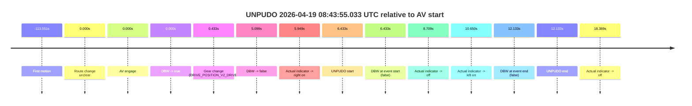

| Metric | Value |
|---|---|
| Outcome | `fail` |
| Effective failure type | `completed_outside_av` |
| Route change status | `unclear` |
| DBW at event start | `false` |
| DBW at event end | `false` |
| Predicted gear at AV start | `DRIVE_POSITION_V2_DRIVE` |
| Actual gear at AV start | `DRIVE_POSITION_V2_PARK` |
| Predicted gear at event start | `DRIVE_POSITION_V2_DRIVE` |
| Actual gear at event start | `DRIVE_POSITION_V2_DRIVE` |
| Planned indicator direction | `INDICATORS_STATE_V2_RIGHT_ON` |
| Controller indicator direction | `INDICATORS_STATE_V2_RIGHT_ON` |
| Actual indicator direction | `INDICATORS_STATE_V2_RIGHT_ON` |
| Actual indicator at maneuver end | `INDICATORS_STATE_V2_LEFT_ON` |
| Driver accel help in AV | `false` |
| Driver accel help timestamp | `n/a` |
| Max accel pedal pct in AV | `0.0%` |
| Max brake pedal pct in AV | `8.0%` |
| Max speed mps in AV | `0.000` |
| Success timing baseline | `AV start` |
| Route -> AV | `n/a` |
| AV -> event start | `6.433s` |
| AV -> first motion | `-113.551s` |
| Success baseline -> event start | `6.433s` |
| Success baseline -> first motion | `-113.551s` |
| AV duration before disengagement | `5.099s` |
| Trajectory waypoint count | `36` |
| Driving-plan step count | `11` |

The scored portion starts from the AV-owned window, not from the pre-AV setup. Route-change search in the stopped pre-event segment was `unclear`, with the baseline therefore set to AV start. At the event anchor the model predicts `DRIVE_POSITION_V2_DRIVE` and the actual gear is `DRIVE_POSITION_V2_DRIVE`. The effective model outcome is `fail` because `completed_outside_av.`

### Resolution

| Field | Value |
|---|---|
| Final outcome | `fail` |
| Do we agree with this label? | `yes` |
| Source disengagement type | `none observed` |
| Resolved effective failure type | `completed_outside_av` |
| Confidence | `medium` |

## unpudo 2026-04-19 08:44:22.583 UTC

| Field | Value |
|---|---|
| Model | `armadillo-amethyst-squeaky` |
| Author | `guy.geva` |
| Run ID | `fme20009/2026-04-19--08-25-51--gen2-av-aefa6853-1db4-47ed-b110-00d929d8142b` |
| Date | `2026-04-19` |
| Time (UTC) | `08:44:22.583` |
| Event type | `unpudo` |
| Disengagement type | `none observed` |
| Route change | `unclear` |
| Console | [run](https://console.sso.wayve.ai/run/fme20009/2026-04-19--08-25-51--gen2-av-aefa6853-1db4-47ed-b110-00d929d8142b?id=&time-unixus=1776588262583307) |
| Foxglove | [segment](https://app.foxglove.dev/wayve-on-prem/p/prj_0dX18KZdVHg1fmmI/view?ds=foxglove-stream&ds.deviceName=fme20009&ds.start=2026-04-19T08%3A43%3A38.600108Z&ds.end=2026-04-19T08%3A44%3A36.083297Z&layoutId=lay_0e7VD4WIKDQGU73Y&time=2026-04-19T08%3A44%3A22.583307Z) |

### Event card: fail

- Fail: the credited unpudo does not stay AV-owned. The event window starts with DBW false, and the maneuver outcome lands outside a clean AV-owned segment.

| Event | Time (UTC) | Delta from AV start |
|---|---:|---:|
| First motion | 2026-04-19 08:42:22.589 | `-86.010s` |
| Route change unclear | 2026-04-19 08:43:48.600 | `0.000s` |
| AV engage | 2026-04-19 08:43:48.600 | `0.000s` |
| DBW -> true | 2026-04-19 08:43:48.600 | `0.000s` |
| DBW -> false | 2026-04-19 08:43:53.699 | `5.099s` |
| Gear change (DRIVE_POSITION_V2_DRIVE) | 2026-04-19 08:44:21.383 | `32.783s` |
| UNPUDO start | 2026-04-19 08:44:22.583 | `33.983s` |
| DBW at event start (false) | 2026-04-19 08:44:22.583 | `33.983s` |
| DBW at event end (false) | 2026-04-19 08:44:26.083 | `37.483s` |
| UNPUDO end | 2026-04-19 08:44:26.083 | `37.483s` |

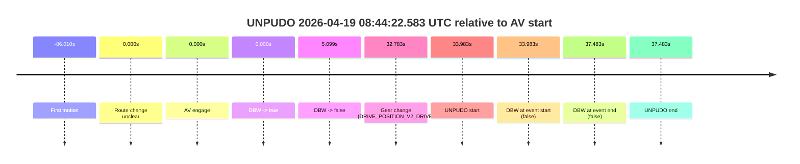

| Metric | Value |
|---|---|
| Outcome | `fail` |
| Effective failure type | `completed_outside_av` |
| Route change status | `unclear` |
| DBW at event start | `false` |
| DBW at event end | `false` |
| Predicted gear at AV start | `DRIVE_POSITION_V2_DRIVE` |
| Actual gear at AV start | `DRIVE_POSITION_V2_PARK` |
| Predicted gear at event start | `DRIVE_POSITION_V2_REVERSE` |
| Actual gear at event start | `DRIVE_POSITION_V2_DRIVE` |
| Planned indicator direction | `INDICATORS_STATE_V2_OFF` |
| Controller indicator direction | `INDICATORS_STATE_V2_OFF` |
| Actual indicator direction | `INDICATORS_STATE_V2_OFF` |
| Actual indicator at maneuver end | `INDICATORS_STATE_V2_OFF` |
| Driver accel help in AV | `false` |
| Driver accel help timestamp | `n/a` |
| Max accel pedal pct in AV | `0.0%` |
| Max brake pedal pct in AV | `8.0%` |
| Max speed mps in AV | `0.000` |
| Success timing baseline | `AV start` |
| Route -> AV | `n/a` |
| AV -> event start | `33.983s` |
| AV -> first motion | `-86.010s` |
| Success baseline -> event start | `33.983s` |
| Success baseline -> first motion | `-86.010s` |
| AV duration before disengagement | `5.099s` |
| Trajectory waypoint count | `37` |
| Driving-plan step count | `11` |

The scored portion starts from the AV-owned window, not from the pre-AV setup. Route-change search in the stopped pre-event segment was `unclear`, with the baseline therefore set to AV start. At the event anchor the model predicts `DRIVE_POSITION_V2_REVERSE` and the actual gear is `DRIVE_POSITION_V2_DRIVE`. The effective model outcome is `fail` because `completed_outside_av.`

### Resolution

| Field | Value |
|---|---|
| Final outcome | `fail` |
| Do we agree with this label? | `yes` |
| Source disengagement type | `none observed` |
| Resolved effective failure type | `completed_outside_av` |
| Confidence | `medium` |

## unpudo 2026-04-19 08:45:07.533 UTC

| Field | Value |
|---|---|
| Model | `armadillo-amethyst-squeaky` |
| Author | `guy.geva` |
| Run ID | `fme20009/2026-04-19--08-25-51--gen2-av-aefa6853-1db4-47ed-b110-00d929d8142b` |
| Date | `2026-04-19` |
| Time (UTC) | `08:45:07.533` |
| Event type | `unpudo` |
| Disengagement type | `none observed` |
| Route change | `found` |
| Console | [run](https://console.sso.wayve.ai/run/fme20009/2026-04-19--08-25-51--gen2-av-aefa6853-1db4-47ed-b110-00d929d8142b?id=&time-unixus=1776588307533318) |
| Foxglove | [segment](https://app.foxglove.dev/wayve-on-prem/p/prj_0dX18KZdVHg1fmmI/view?ds=foxglove-stream&ds.deviceName=fme20009&ds.start=2026-04-19T08%3A44%3A49.268273Z&ds.end=2026-04-19T08%3A46%3A42.640381Z&layoutId=lay_0e7VD4WIKDQGU73Y&time=2026-04-19T08%3A45%3A07.533318Z) |

### Event card: pass

- Pass: AV owns the credited unpudo from route change through the official unpudo window, the gear state is aligned at the anchor, and the vehicle moves without driver accelerator help in AV.

| Event | Time (UTC) | Delta from route change |
|---|---:|---:|
| Route change | 2026-04-19 08:44:59.268 | `0.000s` |
| AV engage | 2026-04-19 08:45:03.400 | `4.132s` |
| DBW -> true | 2026-04-19 08:45:03.400 | `4.132s` |
| Gear change (DRIVE_POSITION_V2_DRIVE) | 2026-04-19 08:45:03.833 | `4.565s` |
| UNPUDO start | 2026-04-19 08:45:07.533 | `8.265s` |
| DBW at event start (true) | 2026-04-19 08:45:07.533 | `8.265s` |
| First motion | 2026-04-19 08:45:07.589 | `8.321s` |
| DBW at event end (true) | 2026-04-19 08:45:11.683 | `12.415s` |
| UNPUDO end | 2026-04-19 08:45:11.683 | `12.415s` |
| DBW -> false | 2026-04-19 08:46:32.640 | `93.372s` |
| Actual indicator -> left on | 2026-04-19 08:46:33.369 | `94.101s` |
| Actual indicator -> off | 2026-04-19 08:46:41.309 | `102.041s` |

| Metric | Value |
|---|---|
| Outcome | `pass` |
| Effective failure type | `none` |
| Route change status | `found` |
| DBW at event start | `true` |
| DBW at event end | `true` |
| Predicted gear at AV start | `DRIVE_POSITION_V2_DRIVE` |
| Actual gear at AV start | `DRIVE_POSITION_V2_PARK` |
| Predicted gear at event start | `DRIVE_POSITION_V2_DRIVE` |
| Actual gear at event start | `DRIVE_POSITION_V2_DRIVE` |
| Planned indicator direction | `INDICATORS_STATE_V2_OFF` |
| Controller indicator direction | `INDICATORS_STATE_V2_OFF` |
| Actual indicator direction | `INDICATORS_STATE_V2_OFF` |
| Actual indicator at maneuver end | `INDICATORS_STATE_V2_OFF` |
| Driver accel help in AV | `false` |
| Driver accel help timestamp | `n/a` |
| Max accel pedal pct in AV | `0.0%` |
| Max brake pedal pct in AV | `8.0%` |
| Max speed mps in AV | `3.256` |
| Success timing baseline | `route change` |
| Route -> AV | `4.132s` |
| AV -> event start | `4.133s` |
| AV -> first motion | `4.189s` |
| Success baseline -> event start | `8.265s` |
| Success baseline -> first motion | `8.321s` |
| AV duration before disengagement | `89.240s` |
| Trajectory waypoint count | `36` |
| Driving-plan step count | `11` |

The scored portion starts from the AV-owned window, not from the pre-AV setup. Route-change search in the stopped pre-event segment was `found`, with the baseline therefore set to route change. At the event anchor the model predicts `DRIVE_POSITION_V2_DRIVE` and the actual gear is `DRIVE_POSITION_V2_DRIVE`. The effective model outcome is `pass` because `the credited unpudo stays AV-owned through the official unpudo window.`

### Resolution

| Field | Value |
|---|---|
| Final outcome | `pass` |
| Do we agree with this label? | `yes` |
| Source disengagement type | `none observed` |
| Resolved effective failure type | `none` |
| Confidence | `high` |

## unpudo 2026-04-19 08:48:26.433 UTC

| Field | Value |
|---|---|
| Model | `armadillo-amethyst-squeaky` |
| Author | `guy.geva` |
| Run ID | `fme20009/2026-04-19--08-25-51--gen2-av-aefa6853-1db4-47ed-b110-00d929d8142b` |
| Date | `2026-04-19` |
| Time (UTC) | `08:48:26.433` |
| Event type | `unpudo` |
| Disengagement type | `failed_to_accelerate` |
| Route change | `found` |
| Console | [run](https://console.sso.wayve.ai/run/fme20009/2026-04-19--08-25-51--gen2-av-aefa6853-1db4-47ed-b110-00d929d8142b?id=&time-unixus=1776588506433309) |
| Foxglove | [segment](https://app.foxglove.dev/wayve-on-prem/p/prj_0dX18KZdVHg1fmmI/view?ds=foxglove-stream&ds.deviceName=fme20009&ds.start=2026-04-19T08%3A47%3A59.318425Z&ds.end=2026-04-19T08%3A49%3A15.383315Z&layoutId=lay_0e7VD4WIKDQGU73Y&time=2026-04-19T08%3A48%3A26.433309Z) |

### Event card: fail

- Fail: AV owns part of the segment, but the event still resolves as a model-performance failure under the AV-only scoring rule.

| Event | Time (UTC) | Delta from route change |
|---|---:|---:|
| Route change | 2026-04-19 08:48:09.318 | `0.000s` |
| AV engage | 2026-04-19 08:48:13.660 | `4.342s` |
| DBW -> true | 2026-04-19 08:48:13.660 | `4.342s` |
| Gear change (DRIVE_POSITION_V2_DRIVE) | 2026-04-19 08:48:14.133 | `4.815s` |
| DBW -> false | 2026-04-19 08:48:25.680 | `16.362s` |
| UNPUDO start | 2026-04-19 08:48:26.433 | `17.115s` |
| DBW at event start (false) | 2026-04-19 08:48:26.433 | `17.115s` |
| Actual indicator -> right on | 2026-04-19 08:48:27.389 | `18.071s` |
| Actual indicator -> off | 2026-04-19 08:48:29.409 | `20.091s` |
| DBW at event end (false) | 2026-04-19 08:49:05.383 | `56.065s` |
| UNPUDO end | 2026-04-19 08:49:05.383 | `56.065s` |

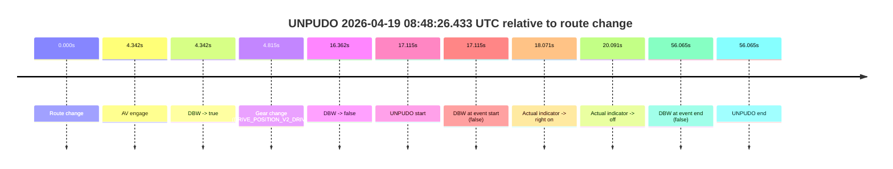

| Metric | Value |
|---|---|
| Outcome | `fail` |
| Effective failure type | `failed_to_accelerate` |
| Route change status | `found` |
| DBW at event start | `false` |
| DBW at event end | `false` |
| Predicted gear at AV start | `DRIVE_POSITION_V2_DRIVE` |
| Actual gear at AV start | `DRIVE_POSITION_V2_PARK` |
| Predicted gear at event start | `DRIVE_POSITION_V2_DRIVE` |
| Actual gear at event start | `DRIVE_POSITION_V2_DRIVE` |
| Planned indicator direction | `INDICATORS_STATE_V2_RIGHT_ON` |
| Controller indicator direction | `INDICATORS_STATE_V2_RIGHT_ON` |
| Actual indicator direction | `INDICATORS_STATE_V2_OFF` |
| Actual indicator at maneuver end | `INDICATORS_STATE_V2_OFF` |
| Driver accel help in AV | `false` |
| Driver accel help timestamp | `n/a` |
| Max accel pedal pct in AV | `0.0%` |
| Max brake pedal pct in AV | `8.0%` |
| Max speed mps in AV | `0.000` |
| Success timing baseline | `route change` |
| Route -> AV | `4.342s` |
| AV -> event start | `12.773s` |
| AV -> first motion | `n/a` |
| Success baseline -> event start | `17.115s` |
| Success baseline -> first motion | `n/a` |
| AV duration before disengagement | `12.020s` |
| Trajectory waypoint count | `36` |
| Driving-plan step count | `11` |

The scored portion starts from the AV-owned window, not from the pre-AV setup. Route-change search in the stopped pre-event segment was `found`, with the baseline therefore set to route change. At the event anchor the model predicts `DRIVE_POSITION_V2_DRIVE` and the actual gear is `DRIVE_POSITION_V2_DRIVE`. The effective model outcome is `fail` because `failed_to_accelerate.`

### Resolution

| Field | Value |
|---|---|
| Final outcome | `fail` |
| Do we agree with this label? | `yes` |
| Source disengagement type | `failed_to_accelerate` |
| Resolved effective failure type | `failed_to_accelerate` |
| Confidence | `high` |

## unpudo 2026-04-19 08:51:12.033 UTC

| Field | Value |
|---|---|
| Model | `armadillo-amethyst-squeaky` |
| Author | `guy.geva` |
| Run ID | `fme20009/2026-04-19--08-25-51--gen2-av-aefa6853-1db4-47ed-b110-00d929d8142b` |
| Date | `2026-04-19` |
| Time (UTC) | `08:51:12.033` |
| Event type | `unpudo` |
| Disengagement type | `none observed` |
| Route change | `found` |
| Console | [run](https://console.sso.wayve.ai/run/fme20009/2026-04-19--08-25-51--gen2-av-aefa6853-1db4-47ed-b110-00d929d8142b?id=&time-unixus=1776588672033321) |
| Foxglove | [segment](https://app.foxglove.dev/wayve-on-prem/p/prj_0dX18KZdVHg1fmmI/view?ds=foxglove-stream&ds.deviceName=fme20009&ds.start=2026-04-19T08%3A50%3A52.268262Z&ds.end=2026-04-19T08%3A51%3A59.133299Z&layoutId=lay_0e7VD4WIKDQGU73Y&time=2026-04-19T08%3A51%3A12.033321Z) |

### Event card: fail

- Fail: the credited unpudo does not stay AV-owned. The event window starts with DBW false, and the maneuver outcome lands outside a clean AV-owned segment.

| Event | Time (UTC) | Delta from route change |
|---|---:|---:|
| Route change | 2026-04-19 08:51:02.268 | `0.000s` |
| AV engage | 2026-04-19 08:51:04.520 | `2.252s` |
| DBW -> true | 2026-04-19 08:51:04.520 | `2.252s` |
| Gear change (DRIVE_POSITION_V2_DRIVE) | 2026-04-19 08:51:05.033 | `2.765s` |
| DBW -> false | 2026-04-19 08:51:11.320 | `9.052s` |
| UNPUDO start | 2026-04-19 08:51:12.033 | `9.765s` |
| DBW at event start (false) | 2026-04-19 08:51:12.033 | `9.765s` |
| Actual indicator -> right on | 2026-04-19 08:51:12.550 | `10.282s` |
| Actual indicator -> off | 2026-04-19 08:51:46.729 | `44.461s` |
| DBW at event end (false) | 2026-04-19 08:51:49.133 | `46.865s` |
| UNPUDO end | 2026-04-19 08:51:49.133 | `46.865s` |

| Metric | Value |
|---|---|
| Outcome | `fail` |
| Effective failure type | `not_av_owned` |
| Route change status | `found` |
| DBW at event start | `false` |
| DBW at event end | `false` |
| Predicted gear at AV start | `DRIVE_POSITION_V2_DRIVE` |
| Actual gear at AV start | `DRIVE_POSITION_V2_PARK` |
| Predicted gear at event start | `DRIVE_POSITION_V2_DRIVE` |
| Actual gear at event start | `DRIVE_POSITION_V2_DRIVE` |
| Planned indicator direction | `INDICATORS_STATE_V2_RIGHT_ON` |
| Controller indicator direction | `INDICATORS_STATE_V2_RIGHT_ON` |
| Actual indicator direction | `INDICATORS_STATE_V2_OFF` |
| Actual indicator at maneuver end | `INDICATORS_STATE_V2_OFF` |
| Driver accel help in AV | `false` |
| Driver accel help timestamp | `n/a` |
| Max accel pedal pct in AV | `0.0%` |
| Max brake pedal pct in AV | `8.0%` |
| Max speed mps in AV | `0.000` |
| Success timing baseline | `route change` |
| Route -> AV | `2.252s` |
| AV -> event start | `7.513s` |
| AV -> first motion | `n/a` |
| Success baseline -> event start | `9.765s` |
| Success baseline -> first motion | `n/a` |
| AV duration before disengagement | `6.800s` |
| Trajectory waypoint count | `36` |
| Driving-plan step count | `11` |

The scored portion starts from the AV-owned window, not from the pre-AV setup. Route-change search in the stopped pre-event segment was `found`, with the baseline therefore set to route change. At the event anchor the model predicts `DRIVE_POSITION_V2_DRIVE` and the actual gear is `DRIVE_POSITION_V2_DRIVE`. The effective model outcome is `fail` because `not_av_owned.`

### Resolution

| Field | Value |
|---|---|
| Final outcome | `fail` |
| Do we agree with this label? | `yes` |
| Source disengagement type | `none observed` |
| Resolved effective failure type | `not_av_owned` |
| Confidence | `high` |

## unpudo 2026-04-19 08:53:58.883 UTC

| Field | Value |
|---|---|
| Model | `armadillo-amethyst-squeaky` |
| Author | `guy.geva` |
| Run ID | `fme20009/2026-04-19--08-25-51--gen2-av-aefa6853-1db4-47ed-b110-00d929d8142b` |
| Date | `2026-04-19` |
| Time (UTC) | `08:53:58.883` |
| Event type | `unpudo` |
| Disengagement type | `failed_to_slow` |
| Route change | `found` |
| Console | [run](https://console.sso.wayve.ai/run/fme20009/2026-04-19--08-25-51--gen2-av-aefa6853-1db4-47ed-b110-00d929d8142b?id=&time-unixus=1776588838883303) |
| Foxglove | [segment](https://app.foxglove.dev/wayve-on-prem/p/prj_0dX18KZdVHg1fmmI/view?ds=foxglove-stream&ds.deviceName=fme20009&ds.start=2026-04-19T08%3A53%3A35.718272Z&ds.end=2026-04-19T08%3A54%3A15.483308Z&layoutId=lay_0e7VD4WIKDQGU73Y&time=2026-04-19T08%3A53%3A58.883303Z) |

### Event card: fail

- Fail: AV owns part of the segment, but the event still resolves as a model-performance failure under the AV-only scoring rule.

| Event | Time (UTC) | Delta from route change |
|---|---:|---:|
| Route change | 2026-04-19 08:53:45.718 | `0.000s` |
| AV engage | 2026-04-19 08:53:53.160 | `7.442s` |
| DBW -> true | 2026-04-19 08:53:53.160 | `7.442s` |
| Gear change (DRIVE_POSITION_V2_DRIVE) | 2026-04-19 08:53:53.633 | `7.915s` |
| UNPUDO start | 2026-04-19 08:53:58.883 | `13.165s` |
| DBW at event start (true) | 2026-04-19 08:53:58.883 | `13.165s` |
| First motion | 2026-04-19 08:53:58.929 | `13.211s` |
| DBW -> false | 2026-04-19 08:54:00.299 | `14.582s` |
| Actual indicator -> right on | 2026-04-19 08:54:01.429 | `15.711s` |
| DBW at event end (false) | 2026-04-19 08:54:05.483 | `19.765s` |
| UNPUDO end | 2026-04-19 08:54:05.483 | `19.765s` |
| Actual indicator -> off | 2026-04-19 08:54:05.929 | `20.211s` |

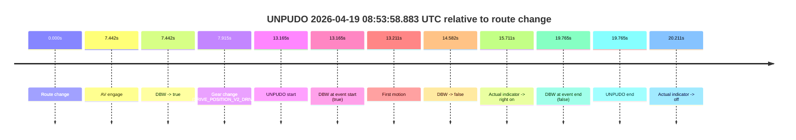

| Metric | Value |
|---|---|
| Outcome | `fail` |
| Effective failure type | `failed_to_slow` |
| Route change status | `found` |
| DBW at event start | `true` |
| DBW at event end | `false` |
| Predicted gear at AV start | `DRIVE_POSITION_V2_DRIVE` |
| Actual gear at AV start | `DRIVE_POSITION_V2_PARK` |
| Predicted gear at event start | `DRIVE_POSITION_V2_DRIVE` |
| Actual gear at event start | `DRIVE_POSITION_V2_DRIVE` |
| Planned indicator direction | `INDICATORS_STATE_V2_RIGHT_ON` |
| Controller indicator direction | `INDICATORS_STATE_V2_RIGHT_ON` |
| Actual indicator direction | `INDICATORS_STATE_V2_OFF` |
| Actual indicator at maneuver end | `INDICATORS_STATE_V2_RIGHT_ON` |
| Driver accel help in AV | `false` |
| Driver accel help timestamp | `n/a` |
| Max accel pedal pct in AV | `0.0%` |
| Max brake pedal pct in AV | `8.0%` |
| Max speed mps in AV | `2.794` |
| Success timing baseline | `route change` |
| Route -> AV | `7.442s` |
| AV -> event start | `5.723s` |
| AV -> first motion | `5.769s` |
| Success baseline -> event start | `13.165s` |
| Success baseline -> first motion | `13.211s` |
| AV duration before disengagement | `7.140s` |
| Trajectory waypoint count | `37` |
| Driving-plan step count | `11` |

The scored portion starts from the AV-owned window, not from the pre-AV setup. Route-change search in the stopped pre-event segment was `found`, with the baseline therefore set to route change. At the event anchor the model predicts `DRIVE_POSITION_V2_DRIVE` and the actual gear is `DRIVE_POSITION_V2_DRIVE`. The effective model outcome is `fail` because `failed_to_slow.`

### Resolution

| Field | Value |
|---|---|
| Final outcome | `fail` |
| Do we agree with this label? | `yes` |
| Source disengagement type | `failed_to_slow` |
| Resolved effective failure type | `failed_to_slow` |
| Confidence | `high` |

## unpudo 2026-04-19 09:01:44.633 UTC

| Field | Value |
|---|---|
| Model | `armadillo-amethyst-squeaky` |
| Author | `guy.geva` |
| Run ID | `fme20009/2026-04-19--08-25-51--gen2-av-aefa6853-1db4-47ed-b110-00d929d8142b` |
| Date | `2026-04-19` |
| Time (UTC) | `09:01:44.633` |
| Event type | `unpudo` |
| Disengagement type | `none observed` |
| Route change | `found` |
| Console | [run](https://console.sso.wayve.ai/run/fme20009/2026-04-19--08-25-51--gen2-av-aefa6853-1db4-47ed-b110-00d929d8142b?id=&time-unixus=1776589304633320) |
| Foxglove | [segment](https://app.foxglove.dev/wayve-on-prem/p/prj_0dX18KZdVHg1fmmI/view?ds=foxglove-stream&ds.deviceName=fme20009&ds.start=2026-04-19T09%3A01%3A22.818248Z&ds.end=2026-04-19T09%3A03%3A12.359891Z&layoutId=lay_0e7VD4WIKDQGU73Y&time=2026-04-19T09%3A01%3A44.633320Z) |

### Event card: pass

- Pass: AV owns the credited unpudo from route change through the official unpudo window, the gear state is aligned at the anchor, and the vehicle moves without driver accelerator help in AV.

| Event | Time (UTC) | Delta from route change |
|---|---:|---:|
| Route change | 2026-04-19 09:01:32.818 | `0.000s` |
| AV engage | 2026-04-19 09:01:40.580 | `7.762s` |
| DBW -> true | 2026-04-19 09:01:40.580 | `7.762s` |
| Gear change (DRIVE_POSITION_V2_DRIVE) | 2026-04-19 09:01:41.033 | `8.215s` |
| UNPUDO start | 2026-04-19 09:01:44.633 | `11.815s` |
| DBW at event start (true) | 2026-04-19 09:01:44.633 | `11.815s` |
| First motion | 2026-04-19 09:01:44.649 | `11.831s` |
| DBW at event end (true) | 2026-04-19 09:01:47.933 | `15.115s` |
| UNPUDO end | 2026-04-19 09:01:47.933 | `15.115s` |
| Actual indicator -> left on | 2026-04-19 09:03:00.049 | `87.231s` |
| DBW -> false | 2026-04-19 09:03:02.359 | `89.542s` |
| Actual indicator -> off | 2026-04-19 09:03:09.469 | `96.652s` |

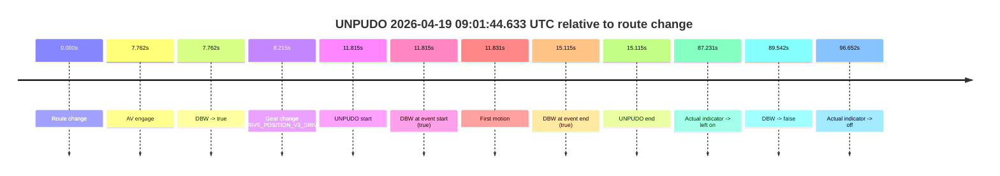

| Metric | Value |
|---|---|
| Outcome | `pass` |
| Effective failure type | `none` |
| Route change status | `found` |
| DBW at event start | `true` |
| DBW at event end | `true` |
| Predicted gear at AV start | `DRIVE_POSITION_V2_DRIVE` |
| Actual gear at AV start | `DRIVE_POSITION_V2_PARK` |
| Predicted gear at event start | `DRIVE_POSITION_V2_DRIVE` |
| Actual gear at event start | `DRIVE_POSITION_V2_DRIVE` |
| Planned indicator direction | `INDICATORS_STATE_V2_LEFT_ON` |
| Controller indicator direction | `INDICATORS_STATE_V2_LEFT_ON` |
| Actual indicator direction | `INDICATORS_STATE_V2_OFF` |
| Actual indicator at maneuver end | `INDICATORS_STATE_V2_OFF` |
| Driver accel help in AV | `false` |
| Driver accel help timestamp | `n/a` |
| Max accel pedal pct in AV | `0.0%` |
| Max brake pedal pct in AV | `8.0%` |
| Max speed mps in AV | `5.514` |
| Success timing baseline | `route change` |
| Route -> AV | `7.762s` |
| AV -> event start | `4.053s` |
| AV -> first motion | `4.069s` |
| Success baseline -> event start | `11.815s` |
| Success baseline -> first motion | `11.831s` |
| AV duration before disengagement | `81.780s` |
| Trajectory waypoint count | `36` |
| Driving-plan step count | `11` |

The scored portion starts from the AV-owned window, not from the pre-AV setup. Route-change search in the stopped pre-event segment was `found`, with the baseline therefore set to route change. At the event anchor the model predicts `DRIVE_POSITION_V2_DRIVE` and the actual gear is `DRIVE_POSITION_V2_DRIVE`. The effective model outcome is `pass` because `the credited unpudo stays AV-owned through the official unpudo window.`

### Resolution

| Field | Value |
|---|---|
| Final outcome | `pass` |
| Do we agree with this label? | `yes` |
| Source disengagement type | `none observed` |
| Resolved effective failure type | `none` |
| Confidence | `high` |

## unpudo 2026-04-19 09:09:31.183 UTC

| Field | Value |
|---|---|
| Model | `armadillo-amethyst-squeaky` |
| Author | `guy.geva` |
| Run ID | `fme20009/2026-04-19--08-25-51--gen2-av-aefa6853-1db4-47ed-b110-00d929d8142b` |
| Date | `2026-04-19` |
| Time (UTC) | `09:09:31.183` |
| Event type | `unpudo` |
| Disengagement type | `none observed` |
| Route change | `found` |
| Console | [run](https://console.sso.wayve.ai/run/fme20009/2026-04-19--08-25-51--gen2-av-aefa6853-1db4-47ed-b110-00d929d8142b?id=&time-unixus=1776589771183295) |
| Foxglove | [segment](https://app.foxglove.dev/wayve-on-prem/p/prj_0dX18KZdVHg1fmmI/view?ds=foxglove-stream&ds.deviceName=fme20009&ds.start=2026-04-19T09%3A09%3A12.818259Z&ds.end=2026-04-19T09%3A10%3A33.720431Z&layoutId=lay_0e7VD4WIKDQGU73Y&time=2026-04-19T09%3A09%3A31.183295Z) |

### Event card: pass

- Pass: AV owns the credited unpudo from route change through the official unpudo window, the gear state is aligned at the anchor, and the vehicle moves without driver accelerator help in AV.

| Event | Time (UTC) | Delta from route change |
|---|---:|---:|
| Actual indicator already left on | 2026-04-19 09:09:12.829 | `-9.989s` |
| Actual indicator -> off | 2026-04-19 09:09:14.329 | `-8.489s` |
| Route change | 2026-04-19 09:09:22.818 | `0.000s` |
| AV engage | 2026-04-19 09:09:27.080 | `4.262s` |
| DBW -> true | 2026-04-19 09:09:27.080 | `4.262s` |
| Gear change (DRIVE_POSITION_V2_DRIVE) | 2026-04-19 09:09:27.533 | `4.715s` |
| UNPUDO start | 2026-04-19 09:09:31.183 | `8.365s` |
| DBW at event start (true) | 2026-04-19 09:09:31.183 | `8.365s` |
| First motion | 2026-04-19 09:09:31.209 | `8.391s` |
| DBW at event end (true) | 2026-04-19 09:09:34.633 | `11.815s` |
| UNPUDO end | 2026-04-19 09:09:34.633 | `11.815s` |
| DBW -> false | 2026-04-19 09:10:23.720 | `60.902s` |

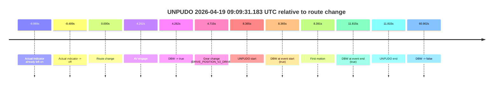

| Metric | Value |
|---|---|
| Outcome | `pass` |
| Effective failure type | `none` |
| Route change status | `found` |
| DBW at event start | `true` |
| DBW at event end | `true` |
| Predicted gear at AV start | `DRIVE_POSITION_V2_DRIVE` |
| Actual gear at AV start | `DRIVE_POSITION_V2_PARK` |
| Predicted gear at event start | `DRIVE_POSITION_V2_DRIVE` |
| Actual gear at event start | `DRIVE_POSITION_V2_DRIVE` |
| Planned indicator direction | `INDICATORS_STATE_V2_RIGHT_ON` |
| Controller indicator direction | `INDICATORS_STATE_V2_RIGHT_ON` |
| Actual indicator direction | `INDICATORS_STATE_V2_OFF` |
| Actual indicator at maneuver end | `INDICATORS_STATE_V2_OFF` |
| Driver accel help in AV | `false` |
| Driver accel help timestamp | `n/a` |
| Max accel pedal pct in AV | `0.0%` |
| Max brake pedal pct in AV | `15.2%` |
| Max speed mps in AV | `4.664` |
| Success timing baseline | `route change` |
| Route -> AV | `4.262s` |
| AV -> event start | `4.103s` |
| AV -> first motion | `4.129s` |
| Success baseline -> event start | `8.365s` |
| Success baseline -> first motion | `8.391s` |
| AV duration before disengagement | `56.640s` |
| Trajectory waypoint count | `37` |
| Driving-plan step count | `11` |

The scored portion starts from the AV-owned window, not from the pre-AV setup. Route-change search in the stopped pre-event segment was `found`, with the baseline therefore set to route change. At the event anchor the model predicts `DRIVE_POSITION_V2_DRIVE` and the actual gear is `DRIVE_POSITION_V2_DRIVE`. The effective model outcome is `pass` because `the credited unpudo stays AV-owned through the official unpudo window.`

### Resolution

| Field | Value |
|---|---|
| Final outcome | `pass` |
| Do we agree with this label? | `yes` |
| Source disengagement type | `none observed` |
| Resolved effective failure type | `none` |
| Confidence | `high` |

## unpudo 2026-04-19 09:13:52.983 UTC

| Field | Value |
|---|---|
| Model | `armadillo-amethyst-squeaky` |
| Author | `guy.geva` |
| Run ID | `fme20009/2026-04-19--08-25-51--gen2-av-aefa6853-1db4-47ed-b110-00d929d8142b` |
| Date | `2026-04-19` |
| Time (UTC) | `09:13:52.983` |
| Event type | `unpudo` |
| Disengagement type | `none observed` |
| Route change | `found` |
| Console | [run](https://console.sso.wayve.ai/run/fme20009/2026-04-19--08-25-51--gen2-av-aefa6853-1db4-47ed-b110-00d929d8142b?id=&time-unixus=1776590032983316) |
| Foxglove | [segment](https://app.foxglove.dev/wayve-on-prem/p/prj_0dX18KZdVHg1fmmI/view?ds=foxglove-stream&ds.deviceName=fme20009&ds.start=2026-04-19T09%3A13%3A03.168388Z&ds.end=2026-04-19T09%3A14%3A07.383307Z&layoutId=lay_0e7VD4WIKDQGU73Y&time=2026-04-19T09%3A13%3A52.983316Z) |

### Event card: fail

- Fail: the credited unpudo does not stay AV-owned. The event window starts with DBW false, and the maneuver outcome lands outside a clean AV-owned segment.

| Event | Time (UTC) | Delta from route change |
|---|---:|---:|
| Route change | 2026-04-19 09:13:13.168 | `0.000s` |
| AV engage | 2026-04-19 09:13:42.180 | `29.012s` |
| DBW -> true | 2026-04-19 09:13:42.180 | `29.012s` |
| Gear change (DRIVE_POSITION_V2_DRIVE) | 2026-04-19 09:13:42.633 | `29.465s` |
| Actual indicator -> left on | 2026-04-19 09:13:49.469 | `36.301s` |
| DBW -> false | 2026-04-19 09:13:52.340 | `39.173s` |
| UNPUDO start | 2026-04-19 09:13:52.983 | `39.815s` |
| DBW at event start (false) | 2026-04-19 09:13:52.983 | `39.815s` |
| Actual indicator -> off | 2026-04-19 09:13:55.109 | `41.941s` |
| DBW at event end (false) | 2026-04-19 09:13:57.383 | `44.215s` |
| UNPUDO end | 2026-04-19 09:13:57.383 | `44.215s` |

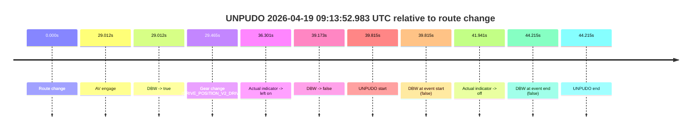

| Metric | Value |
|---|---|
| Outcome | `fail` |
| Effective failure type | `not_av_owned` |
| Route change status | `found` |
| DBW at event start | `false` |
| DBW at event end | `false` |
| Predicted gear at AV start | `DRIVE_POSITION_V2_DRIVE` |
| Actual gear at AV start | `DRIVE_POSITION_V2_PARK` |
| Predicted gear at event start | `DRIVE_POSITION_V2_DRIVE` |
| Actual gear at event start | `DRIVE_POSITION_V2_DRIVE` |
| Planned indicator direction | `INDICATORS_STATE_V2_OFF` |
| Controller indicator direction | `INDICATORS_STATE_V2_OFF` |
| Actual indicator direction | `INDICATORS_STATE_V2_LEFT_ON` |
| Actual indicator at maneuver end | `INDICATORS_STATE_V2_OFF` |
| Driver accel help in AV | `false` |
| Driver accel help timestamp | `n/a` |
| Max accel pedal pct in AV | `0.0%` |
| Max brake pedal pct in AV | `8.3%` |
| Max speed mps in AV | `0.000` |
| Success timing baseline | `route change` |
| Route -> AV | `29.012s` |
| AV -> event start | `10.803s` |
| AV -> first motion | `n/a` |
| Success baseline -> event start | `39.815s` |
| Success baseline -> first motion | `n/a` |
| AV duration before disengagement | `10.161s` |
| Trajectory waypoint count | `37` |
| Driving-plan step count | `11` |

The scored portion starts from the AV-owned window, not from the pre-AV setup. Route-change search in the stopped pre-event segment was `found`, with the baseline therefore set to route change. At the event anchor the model predicts `DRIVE_POSITION_V2_DRIVE` and the actual gear is `DRIVE_POSITION_V2_DRIVE`. The effective model outcome is `fail` because `not_av_owned.`

### Resolution

| Field | Value |
|---|---|
| Final outcome | `fail` |
| Do we agree with this label? | `yes` |
| Source disengagement type | `none observed` |
| Resolved effective failure type | `not_av_owned` |
| Confidence | `high` |

## unpudo 2026-04-19 09:42:18.433 UTC

| Field | Value |
|---|---|
| Model | `armadillo-amethyst-squeaky` |
| Author | `guy.geva` |
| Run ID | `fme20009/2026-04-19--08-25-51--gen2-av-aefa6853-1db4-47ed-b110-00d929d8142b` |
| Date | `2026-04-19` |
| Time (UTC) | `09:42:18.433` |
| Event type | `unpudo` |
| Disengagement type | `none observed` |
| Route change | `found` |
| Console | [run](https://console.sso.wayve.ai/run/fme20009/2026-04-19--08-25-51--gen2-av-aefa6853-1db4-47ed-b110-00d929d8142b?id=&time-unixus=1776591738433320) |
| Foxglove | [segment](https://app.foxglove.dev/wayve-on-prem/p/prj_0dX18KZdVHg1fmmI/view?ds=foxglove-stream&ds.deviceName=fme20009&ds.start=2026-04-19T09%3A41%3A40.718281Z&ds.end=2026-04-19T09%3A44%3A13.880461Z&layoutId=lay_0e7VD4WIKDQGU73Y&time=2026-04-19T09%3A42%3A18.433320Z) |

### Event card: pass

- Pass: AV owns the credited unpudo from route change through the official unpudo window, the gear state is aligned at the anchor, and the vehicle moves without driver accelerator help in AV.

| Event | Time (UTC) | Delta from route change |
|---|---:|---:|
| Route change | 2026-04-19 09:41:50.718 | `0.000s` |
| AV engage | 2026-04-19 09:42:14.300 | `23.582s` |
| DBW -> true | 2026-04-19 09:42:14.300 | `23.582s` |
| Gear change (DRIVE_POSITION_V2_DRIVE) | 2026-04-19 09:42:14.833 | `24.115s` |
| Actual indicator -> right on | 2026-04-19 09:42:17.149 | `26.431s` |
| UNPUDO start | 2026-04-19 09:42:18.433 | `27.715s` |
| DBW at event start (true) | 2026-04-19 09:42:18.433 | `27.715s` |
| First motion | 2026-04-19 09:42:18.449 | `27.731s` |
| Actual indicator -> off | 2026-04-19 09:42:20.109 | `29.391s` |
| DBW at event end (true) | 2026-04-19 09:42:21.833 | `31.115s` |
| UNPUDO end | 2026-04-19 09:42:21.833 | `31.115s` |
| DBW -> false | 2026-04-19 09:44:03.880 | `133.162s` |
| Actual indicator -> left on | 2026-04-19 09:44:03.989 | `133.271s` |

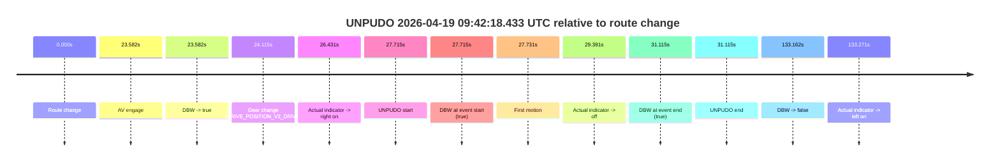

| Metric | Value |
|---|---|
| Outcome | `pass` |
| Effective failure type | `none` |
| Route change status | `found` |
| DBW at event start | `true` |
| DBW at event end | `true` |
| Predicted gear at AV start | `DRIVE_POSITION_V2_DRIVE` |
| Actual gear at AV start | `DRIVE_POSITION_V2_PARK` |
| Predicted gear at event start | `DRIVE_POSITION_V2_DRIVE` |
| Actual gear at event start | `DRIVE_POSITION_V2_DRIVE` |
| Planned indicator direction | `INDICATORS_STATE_V2_OFF` |
| Controller indicator direction | `INDICATORS_STATE_V2_OFF` |
| Actual indicator direction | `INDICATORS_STATE_V2_RIGHT_ON` |
| Actual indicator at maneuver end | `INDICATORS_STATE_V2_OFF` |
| Driver accel help in AV | `false` |
| Driver accel help timestamp | `n/a` |
| Max accel pedal pct in AV | `0.0%` |
| Max brake pedal pct in AV | `8.0%` |
| Max speed mps in AV | `5.072` |
| Success timing baseline | `route change` |
| Route -> AV | `23.582s` |
| AV -> event start | `4.133s` |
| AV -> first motion | `4.150s` |
| Success baseline -> event start | `27.715s` |
| Success baseline -> first motion | `27.731s` |
| AV duration before disengagement | `109.580s` |
| Trajectory waypoint count | `36` |
| Driving-plan step count | `11` |

The scored portion starts from the AV-owned window, not from the pre-AV setup. Route-change search in the stopped pre-event segment was `found`, with the baseline therefore set to route change. At the event anchor the model predicts `DRIVE_POSITION_V2_DRIVE` and the actual gear is `DRIVE_POSITION_V2_DRIVE`. The effective model outcome is `pass` because `the credited unpudo stays AV-owned through the official unpudo window.`

### Resolution

| Field | Value |
|---|---|
| Final outcome | `pass` |
| Do we agree with this label? | `yes` |
| Source disengagement type | `none observed` |
| Resolved effective failure type | `none` |
| Confidence | `high` |

## unpudo 2026-04-19 09:46:43.133 UTC

| Field | Value |
|---|---|
| Model | `armadillo-amethyst-squeaky` |
| Author | `guy.geva` |
| Run ID | `fme20009/2026-04-19--08-25-51--gen2-av-aefa6853-1db4-47ed-b110-00d929d8142b` |
| Date | `2026-04-19` |
| Time (UTC) | `09:46:43.133` |
| Event type | `unpudo` |
| Disengagement type | `none observed` |
| Route change | `found` |
| Console | [run](https://console.sso.wayve.ai/run/fme20009/2026-04-19--08-25-51--gen2-av-aefa6853-1db4-47ed-b110-00d929d8142b?id=&time-unixus=1776592003133312) |
| Foxglove | [segment](https://app.foxglove.dev/wayve-on-prem/p/prj_0dX18KZdVHg1fmmI/view?ds=foxglove-stream&ds.deviceName=fme20009&ds.start=2026-04-19T09%3A46%3A26.218263Z&ds.end=2026-04-19T09%3A46%3A56.033320Z&layoutId=lay_0e7VD4WIKDQGU73Y&time=2026-04-19T09%3A46%3A43.133312Z) |

### Event card: fail

- Fail: the credited unpudo does not stay AV-owned. The event window starts with DBW false, and the maneuver outcome lands outside a clean AV-owned segment.

| Event | Time (UTC) | Delta from route change |
|---|---:|---:|
| Actual indicator already left on | 2026-04-19 09:46:26.230 | `-9.988s` |
| Actual indicator -> off | 2026-04-19 09:46:29.309 | `-6.909s` |
| Route change | 2026-04-19 09:46:36.218 | `0.000s` |
| AV engage | 2026-04-19 09:46:40.260 | `4.042s` |
| DBW -> true | 2026-04-19 09:46:40.260 | `4.042s` |
| Gear change (DRIVE_POSITION_V2_DRIVE) | 2026-04-19 09:46:40.633 | `4.415s` |
| DBW -> false | 2026-04-19 09:46:42.599 | `6.382s` |
| UNPUDO start | 2026-04-19 09:46:43.133 | `6.915s` |
| DBW at event start (false) | 2026-04-19 09:46:43.133 | `6.915s` |
| Actual indicator -> right on | 2026-04-19 09:46:43.169 | `6.951s` |
| Actual indicator -> off | 2026-04-19 09:46:44.749 | `8.531s` |
| DBW at event end (false) | 2026-04-19 09:46:46.033 | `9.815s` |
| UNPUDO end | 2026-04-19 09:46:46.033 | `9.815s` |

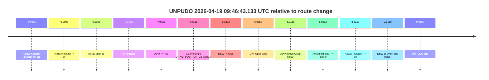

| Metric | Value |
|---|---|
| Outcome | `fail` |
| Effective failure type | `not_av_owned` |
| Route change status | `found` |
| DBW at event start | `false` |
| DBW at event end | `false` |
| Predicted gear at AV start | `DRIVE_POSITION_V2_DRIVE` |
| Actual gear at AV start | `DRIVE_POSITION_V2_PARK` |
| Predicted gear at event start | `DRIVE_POSITION_V2_DRIVE` |
| Actual gear at event start | `DRIVE_POSITION_V2_DRIVE` |
| Planned indicator direction | `INDICATORS_STATE_V2_LEFT_ON` |
| Controller indicator direction | `INDICATORS_STATE_V2_LEFT_ON` |
| Actual indicator direction | `INDICATORS_STATE_V2_OFF` |
| Actual indicator at maneuver end | `INDICATORS_STATE_V2_OFF` |
| Driver accel help in AV | `false` |
| Driver accel help timestamp | `n/a` |
| Max accel pedal pct in AV | `0.0%` |
| Max brake pedal pct in AV | `8.0%` |
| Max speed mps in AV | `0.000` |
| Success timing baseline | `route change` |
| Route -> AV | `4.042s` |
| AV -> event start | `2.873s` |
| AV -> first motion | `n/a` |
| Success baseline -> event start | `6.915s` |
| Success baseline -> first motion | `n/a` |
| AV duration before disengagement | `2.340s` |
| Trajectory waypoint count | `36` |
| Driving-plan step count | `11` |

The scored portion starts from the AV-owned window, not from the pre-AV setup. Route-change search in the stopped pre-event segment was `found`, with the baseline therefore set to route change. At the event anchor the model predicts `DRIVE_POSITION_V2_DRIVE` and the actual gear is `DRIVE_POSITION_V2_DRIVE`. The effective model outcome is `fail` because `not_av_owned.`

### Resolution

| Field | Value |
|---|---|
| Final outcome | `fail` |
| Do we agree with this label? | `yes` |
| Source disengagement type | `none observed` |
| Resolved effective failure type | `not_av_owned` |
| Confidence | `high` |

## unpudo 2026-04-19 09:54:53.633 UTC

| Field | Value |
|---|---|
| Model | `armadillo-amethyst-squeaky` |
| Author | `guy.geva` |
| Run ID | `fme20009/2026-04-19--08-25-51--gen2-av-aefa6853-1db4-47ed-b110-00d929d8142b` |
| Date | `2026-04-19` |
| Time (UTC) | `09:54:53.633` |
| Event type | `unpudo` |
| Disengagement type | `none observed` |
| Route change | `found` |
| Console | [run](https://console.sso.wayve.ai/run/fme20009/2026-04-19--08-25-51--gen2-av-aefa6853-1db4-47ed-b110-00d929d8142b?id=&time-unixus=1776592493633304) |
| Foxglove | [segment](https://app.foxglove.dev/wayve-on-prem/p/prj_0dX18KZdVHg1fmmI/view?ds=foxglove-stream&ds.deviceName=fme20009&ds.start=2026-04-19T09%3A54%3A36.718252Z&ds.end=2026-04-19T09%3A56%3A12.880174Z&layoutId=lay_0e7VD4WIKDQGU73Y&time=2026-04-19T09%3A54%3A53.633304Z) |

### Event card: pass

- Pass: AV owns the credited unpudo from route change through the official unpudo window, the gear state is aligned at the anchor, and the vehicle moves without driver accelerator help in AV.

| Event | Time (UTC) | Delta from route change |
|---|---:|---:|
| Route change | 2026-04-19 09:54:46.718 | `0.000s` |
| AV engage | 2026-04-19 09:54:49.520 | `2.802s` |
| DBW -> true | 2026-04-19 09:54:49.520 | `2.802s` |
| Gear change (DRIVE_POSITION_V2_DRIVE) | 2026-04-19 09:54:50.033 | `3.315s` |
| UNPUDO start | 2026-04-19 09:54:53.633 | `6.915s` |
| DBW at event start (true) | 2026-04-19 09:54:53.633 | `6.915s` |
| First motion | 2026-04-19 09:54:53.649 | `6.931s` |
| DBW at event end (true) | 2026-04-19 09:54:57.783 | `11.065s` |
| UNPUDO end | 2026-04-19 09:54:57.783 | `11.065s` |
| DBW -> false | 2026-04-19 09:56:02.880 | `76.162s` |
| Actual indicator -> right on | 2026-04-19 09:56:11.529 | `84.811s` |
| Actual indicator -> off | 2026-04-19 09:56:15.489 | `88.771s` |

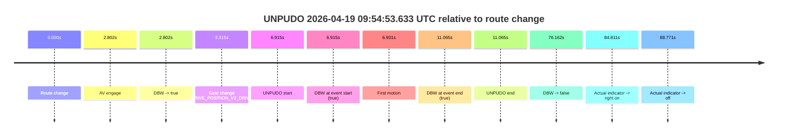

| Metric | Value |
|---|---|
| Outcome | `pass` |
| Effective failure type | `none` |
| Route change status | `found` |
| DBW at event start | `true` |
| DBW at event end | `true` |
| Predicted gear at AV start | `DRIVE_POSITION_V2_DRIVE` |
| Actual gear at AV start | `DRIVE_POSITION_V2_PARK` |
| Predicted gear at event start | `DRIVE_POSITION_V2_DRIVE` |
| Actual gear at event start | `DRIVE_POSITION_V2_DRIVE` |
| Planned indicator direction | `INDICATORS_STATE_V2_LEFT_ON` |
| Controller indicator direction | `INDICATORS_STATE_V2_LEFT_ON` |
| Actual indicator direction | `INDICATORS_STATE_V2_OFF` |
| Actual indicator at maneuver end | `INDICATORS_STATE_V2_OFF` |
| Driver accel help in AV | `false` |
| Driver accel help timestamp | `n/a` |
| Max accel pedal pct in AV | `0.0%` |
| Max brake pedal pct in AV | `8.0%` |
| Max speed mps in AV | `3.122` |
| Success timing baseline | `route change` |
| Route -> AV | `2.802s` |
| AV -> event start | `4.113s` |
| AV -> first motion | `4.129s` |
| Success baseline -> event start | `6.915s` |
| Success baseline -> first motion | `6.931s` |
| AV duration before disengagement | `73.360s` |
| Trajectory waypoint count | `36` |
| Driving-plan step count | `11` |

The scored portion starts from the AV-owned window, not from the pre-AV setup. Route-change search in the stopped pre-event segment was `found`, with the baseline therefore set to route change. At the event anchor the model predicts `DRIVE_POSITION_V2_DRIVE` and the actual gear is `DRIVE_POSITION_V2_DRIVE`. The effective model outcome is `pass` because `the credited unpudo stays AV-owned through the official unpudo window.`

### Resolution

| Field | Value |
|---|---|
| Final outcome | `pass` |
| Do we agree with this label? | `yes` |
| Source disengagement type | `none observed` |
| Resolved effective failure type | `none` |
| Confidence | `high` |

## unpudo 2026-04-19 09:56:12.133 UTC

| Field | Value |
|---|---|
| Model | `armadillo-amethyst-squeaky` |
| Author | `guy.geva` |
| Run ID | `fme20009/2026-04-19--08-25-51--gen2-av-aefa6853-1db4-47ed-b110-00d929d8142b` |
| Date | `2026-04-19` |
| Time (UTC) | `09:56:12.133` |
| Event type | `unpudo` |
| Disengagement type | `uncategorised` |
| Route change | `found` |
| Console | [run](https://console.sso.wayve.ai/run/fme20009/2026-04-19--08-25-51--gen2-av-aefa6853-1db4-47ed-b110-00d929d8142b?id=&time-unixus=1776592572133301) |
| Foxglove | [segment](https://app.foxglove.dev/wayve-on-prem/p/prj_0dX18KZdVHg1fmmI/view?ds=foxglove-stream&ds.deviceName=fme20009&ds.start=2026-04-19T09%3A54%3A36.718252Z&ds.end=2026-04-19T09%3A56%3A25.533315Z&layoutId=lay_0e7VD4WIKDQGU73Y&time=2026-04-19T09%3A56%3A12.133301Z) |

### Event card: fail

- Fail: AV owns part of the segment, but the event still resolves as a model-performance failure under the AV-only scoring rule.

| Event | Time (UTC) | Delta from route change |
|---|---:|---:|
| Route change | 2026-04-19 09:54:46.718 | `0.000s` |
| AV engage | 2026-04-19 09:54:49.520 | `2.802s` |
| DBW -> true | 2026-04-19 09:54:49.520 | `2.802s` |
| First motion | 2026-04-19 09:54:53.649 | `6.931s` |
| DBW -> false | 2026-04-19 09:56:02.880 | `76.162s` |
| Gear change (DRIVE_POSITION_V2_DRIVE) | 2026-04-19 09:56:10.783 | `84.065s` |
| Actual indicator -> right on | 2026-04-19 09:56:11.529 | `84.811s` |
| UNPUDO start | 2026-04-19 09:56:12.133 | `85.415s` |
| DBW at event start (false) | 2026-04-19 09:56:12.133 | `85.415s` |
| Actual indicator -> off | 2026-04-19 09:56:15.489 | `88.771s` |
| DBW at event end (false) | 2026-04-19 09:56:15.533 | `88.815s` |
| UNPUDO end | 2026-04-19 09:56:15.533 | `88.815s` |

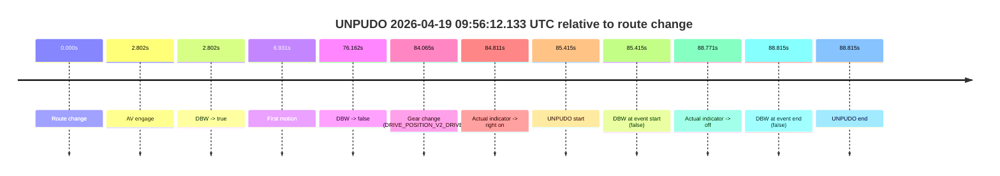

| Metric | Value |
|---|---|
| Outcome | `fail` |
| Effective failure type | `uncategorised` |
| Route change status | `found` |
| DBW at event start | `false` |
| DBW at event end | `false` |
| Predicted gear at AV start | `DRIVE_POSITION_V2_DRIVE` |
| Actual gear at AV start | `DRIVE_POSITION_V2_PARK` |
| Predicted gear at event start | `DRIVE_POSITION_V2_DRIVE` |
| Actual gear at event start | `DRIVE_POSITION_V2_DRIVE` |
| Planned indicator direction | `INDICATORS_STATE_V2_OFF` |
| Controller indicator direction | `INDICATORS_STATE_V2_OFF` |
| Actual indicator direction | `INDICATORS_STATE_V2_RIGHT_ON` |
| Actual indicator at maneuver end | `INDICATORS_STATE_V2_OFF` |
| Driver accel help in AV | `false` |
| Driver accel help timestamp | `n/a` |
| Max accel pedal pct in AV | `0.0%` |
| Max brake pedal pct in AV | `16.9%` |
| Max speed mps in AV | `7.722` |
| Success timing baseline | `route change` |
| Route -> AV | `2.802s` |
| AV -> event start | `82.613s` |
| AV -> first motion | `4.129s` |
| Success baseline -> event start | `85.415s` |
| Success baseline -> first motion | `6.931s` |
| AV duration before disengagement | `73.360s` |
| Trajectory waypoint count | `36` |
| Driving-plan step count | `11` |

The scored portion starts from the AV-owned window, not from the pre-AV setup. Route-change search in the stopped pre-event segment was `found`, with the baseline therefore set to route change. At the event anchor the model predicts `DRIVE_POSITION_V2_DRIVE` and the actual gear is `DRIVE_POSITION_V2_DRIVE`. The effective model outcome is `fail` because `uncategorised.`

### Resolution

| Field | Value |
|---|---|
| Final outcome | `fail` |
| Do we agree with this label? | `yes` |
| Source disengagement type | `uncategorised` |
| Resolved effective failure type | `uncategorised` |
| Confidence | `high` |
