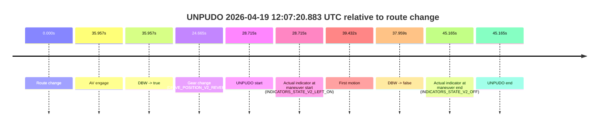
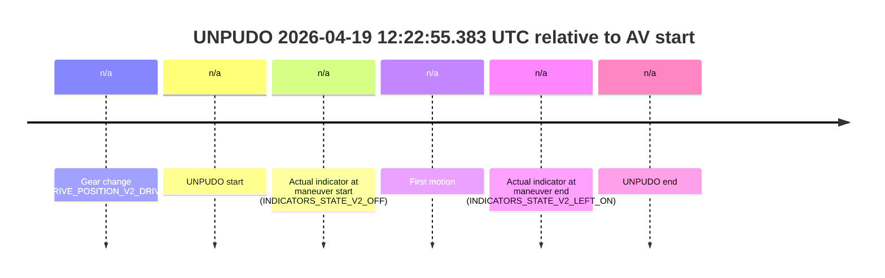
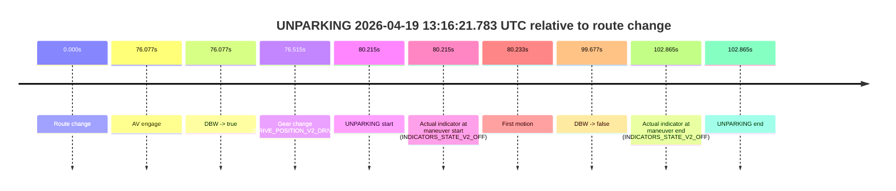

# Run Report: fme20009/2026-04-19--11-40-30--gen2-av-4f3b459d-eff7-4598-8924-fcc92b2d3fe7

| Field | Value |
|---|---|
| Run ID | `fme20009/2026-04-19--11-40-30--gen2-av-4f3b459d-eff7-4598-8924-fcc92b2d3fe7` |
| Date | `2026-04-19` |
| Model(s) | `armadillo-amethyst-squeaky` |
| Author | `guy.geva` |
| Event count | `8` |

## unpudo 2026-04-19 11:47:16.933 UTC

| Field | Value |
|---|---|
| Model | `armadillo-amethyst-squeaky` |
| Author | `guy.geva` |
| Run ID | `fme20009/2026-04-19--11-40-30--gen2-av-4f3b459d-eff7-4598-8924-fcc92b2d3fe7` |
| Date | `2026-04-19` |
| Time (UTC) | `11:47:16.933` |
| Event type | `unpudo` |
| Disengagement type | `none observed` |
| Route change | `found` |
| Console | [run](https://console.sso.wayve.ai/run/fme20009/2026-04-19--11-40-30--gen2-av-4f3b459d-eff7-4598-8924-fcc92b2d3fe7?id=&time-unixus=1776599236933310) |
| Foxglove | [segment](https://app.foxglove.dev/wayve-on-prem/p/prj_0dX18KZdVHg1fmmI/view?ds=foxglove-stream&ds.deviceName=fme20009&ds.start=2026-04-19T11%3A46%3A50.568607Z&ds.end=2026-04-19T11%3A48%3A19.584426Z&layoutId=lay_0e7VD4WIKDQGU73Y&time=2026-04-19T11%3A47%3A16.933310Z) |

### Event card: fail

- Fail: the credited unpudo does not stay AV-owned. The event window starts with DBW false, and the maneuver outcome lands outside a clean AV-owned segment.

| Event | Time (UTC) | Delta from route change |
|---|---:|---:|
| Route change | 2026-04-19 11:47:00.568 | `0.000s` |
| AV engage | 2026-04-19 11:47:39.326 | `38.758s` |
| DBW -> true | 2026-04-19 11:47:39.326 | `38.758s` |
| Gear change (DRIVE_POSITION_V2_DRIVE) | 2026-04-19 11:47:12.383 | `11.815s` |
| UNPUDO start | 2026-04-19 11:47:16.933 | `16.365s` |
| Actual indicator at maneuver start (INDICATORS_STATE_V2_LEFT_ON) | 2026-04-19 11:47:16.933 | `16.365s` |
| First motion | 2026-04-19 11:47:16.960 | `16.392s` |
| DBW -> false | 2026-04-19 11:48:09.584 | `69.016s` |
| Actual indicator at maneuver end (INDICATORS_STATE_V2_OFF) | 2026-04-19 11:47:21.783 | `21.215s` |
| UNPUDO end | 2026-04-19 11:47:21.783 | `21.215s` |

| Metric | Value |
|---|---|
| Outcome | `fail` |
| Effective failure type | `completed_outside_av` |
| Route change status | `found` |
| DBW at event start | `false` |
| DBW at event end | `false` |
| Predicted gear at AV start | `DRIVE_POSITION_V2_DRIVE` |
| Actual gear at AV start | `DRIVE_POSITION_V2_DRIVE` |
| Predicted gear at event start | `DRIVE_POSITION_V2_DRIVE` |
| Actual gear at event start | `DRIVE_POSITION_V2_DRIVE` |
| Planned indicator direction | `INDICATORS_STATE_V2_LEFT_ON` |
| Controller indicator direction | `INDICATORS_STATE_V2_LEFT_ON` |
| Actual indicator direction | `INDICATORS_STATE_V2_LEFT_ON` |
| Actual indicator at maneuver end | `INDICATORS_STATE_V2_OFF` |
| Driver accel help in AV | `false` |
| Driver accel help timestamp | `n/a` |
| Max accel pedal pct in AV | `0.0%` |
| Max brake pedal pct in AV | `0.0%` |
| Max speed mps in AV | `0.000` |
| Route -> AV | `38.758s` |
| AV -> event start | `-22.393s` |
| AV -> first motion | `-22.366s` |
| AV duration before disengagement | `30.258s` |
| Trajectory waypoint count | `35` |
| Driving-plan step count | `11` |

The scored portion starts from the AV-owned window, not from the pre-AV setup. Route-change search in the stopped pre-event segment was `found`, with the baseline therefore set to route change. At the event anchor the model predicts `DRIVE_POSITION_V2_DRIVE` and the actual gear is `DRIVE_POSITION_V2_DRIVE`. The effective model outcome is `fail` because `completed_outside_av`.

### Resolution

| Field | Value |
|---|---|
| Final outcome | `fail` |
| Do we agree with this label? | `yes` |
| Source disengagement type | `none observed` |
| Resolved effective failure type | `completed_outside_av` |
| Confidence | `high` |

## unpudo 2026-04-19 11:48:20.533 UTC

| Field | Value |
|---|---|
| Model | `armadillo-amethyst-squeaky` |
| Author | `guy.geva` |
| Run ID | `fme20009/2026-04-19--11-40-30--gen2-av-4f3b459d-eff7-4598-8924-fcc92b2d3fe7` |
| Date | `2026-04-19` |
| Time (UTC) | `11:48:20.533` |
| Event type | `unpudo` |
| Disengagement type | `uncategorised` |
| Route change | `found` |
| Console | [run](https://console.sso.wayve.ai/run/fme20009/2026-04-19--11-40-30--gen2-av-4f3b459d-eff7-4598-8924-fcc92b2d3fe7?id=&time-unixus=1776599300533306) |
| Foxglove | [segment](https://app.foxglove.dev/wayve-on-prem/p/prj_0dX18KZdVHg1fmmI/view?ds=foxglove-stream&ds.deviceName=fme20009&ds.start=2026-04-19T11%3A46%3A50.568607Z&ds.end=2026-04-19T11%3A49%3A28.165041Z&layoutId=lay_0e7VD4WIKDQGU73Y&time=2026-04-19T11%3A48%3A20.533306Z) |

### Event card: fail

- Fail: AV owns part of the segment, but the event still resolves as a model-performance failure under the AV-only scoring rule.

| Event | Time (UTC) | Delta from route change |
|---|---:|---:|
| Route change | 2026-04-19 11:47:00.568 | `0.000s` |
| AV engage | 2026-04-19 11:48:41.366 | `100.798s` |
| DBW -> true | 2026-04-19 11:48:41.366 | `100.798s` |
| Gear change (DRIVE_POSITION_V2_DRIVE) | 2026-04-19 11:48:18.133 | `77.565s` |
| UNPUDO start | 2026-04-19 11:48:20.533 | `79.965s` |
| Actual indicator at maneuver start (INDICATORS_STATE_V2_RIGHT_ON) | 2026-04-19 11:48:20.533 | `79.965s` |
| First motion | 2026-04-19 11:48:20.660 | `80.092s` |
| DBW -> false | 2026-04-19 11:49:18.165 | `137.596s` |
| Actual indicator at maneuver end (INDICATORS_STATE_V2_OFF) | 2026-04-19 11:48:29.583 | `89.015s` |
| UNPUDO end | 2026-04-19 11:48:29.583 | `89.015s` |

| Metric | Value |
|---|---|
| Outcome | `fail` |
| Effective failure type | `uncategorised` |
| Route change status | `found` |
| DBW at event start | `false` |
| DBW at event end | `false` |
| Predicted gear at AV start | `DRIVE_POSITION_V2_DRIVE` |
| Actual gear at AV start | `DRIVE_POSITION_V2_DRIVE` |
| Predicted gear at event start | `DRIVE_POSITION_V2_DRIVE` |
| Actual gear at event start | `DRIVE_POSITION_V2_DRIVE` |
| Planned indicator direction | `INDICATORS_STATE_V2_RIGHT_ON` |
| Controller indicator direction | `INDICATORS_STATE_V2_RIGHT_ON` |
| Actual indicator direction | `INDICATORS_STATE_V2_RIGHT_ON` |
| Actual indicator at maneuver end | `INDICATORS_STATE_V2_OFF` |
| Driver accel help in AV | `false` |
| Driver accel help timestamp | `n/a` |
| Max accel pedal pct in AV | `0.0%` |
| Max brake pedal pct in AV | `0.0%` |
| Max speed mps in AV | `0.000` |
| Route -> AV | `100.798s` |
| AV -> event start | `-20.833s` |
| AV -> first motion | `-20.706s` |
| AV duration before disengagement | `36.798s` |
| Trajectory waypoint count | `37` |
| Driving-plan step count | `11` |

The scored portion starts from the AV-owned window, not from the pre-AV setup. Route-change search in the stopped pre-event segment was `found`, with the baseline therefore set to route change. At the event anchor the model predicts `DRIVE_POSITION_V2_DRIVE` and the actual gear is `DRIVE_POSITION_V2_DRIVE`. The effective model outcome is `fail` because `uncategorised`.

### Resolution

| Field | Value |
|---|---|
| Final outcome | `fail` |
| Do we agree with this label? | `yes` |
| Source disengagement type | `uncategorised` |
| Resolved effective failure type | `uncategorised` |
| Confidence | `high` |

## unpudo 2026-04-19 11:58:29.333 UTC

| Field | Value |
|---|---|
| Model | `armadillo-amethyst-squeaky` |
| Author | `guy.geva` |
| Run ID | `fme20009/2026-04-19--11-40-30--gen2-av-4f3b459d-eff7-4598-8924-fcc92b2d3fe7` |
| Date | `2026-04-19` |
| Time (UTC) | `11:58:29.333` |
| Event type | `unpudo` |
| Disengagement type | `failed_to_slow` |
| Route change | `found` |
| Console | [run](https://console.sso.wayve.ai/run/fme20009/2026-04-19--11-40-30--gen2-av-4f3b459d-eff7-4598-8924-fcc92b2d3fe7?id=&time-unixus=1776599909333305) |
| Foxglove | [segment](https://app.foxglove.dev/wayve-on-prem/p/prj_0dX18KZdVHg1fmmI/view?ds=foxglove-stream&ds.deviceName=fme20009&ds.start=2026-04-19T11%3A58%3A01.568819Z&ds.end=2026-04-19T11%3A58%3A47.633307Z&layoutId=lay_0e7VD4WIKDQGU73Y&time=2026-04-19T11%3A58%3A29.333305Z) |

### Event card: fail

- Fail: AV owns part of the segment, but the event still resolves as a model-performance failure under the AV-only scoring rule.

| Event | Time (UTC) | Delta from route change |
|---|---:|---:|
| Route change | 2026-04-19 11:58:11.568 | `0.000s` |
| AV engage | 2026-04-19 11:58:25.365 | `13.796s` |
| DBW -> true | 2026-04-19 11:58:25.365 | `13.796s` |
| Gear change (DRIVE_POSITION_V2_DRIVE) | 2026-04-19 11:58:25.783 | `14.214s` |
| UNPUDO start | 2026-04-19 11:58:29.333 | `17.764s` |
| Actual indicator at maneuver start (INDICATORS_STATE_V2_OFF) | 2026-04-19 11:58:29.333 | `17.764s` |
| First motion | 2026-04-19 11:58:29.360 | `17.792s` |
| DBW -> false | 2026-04-19 11:58:29.585 | `18.016s` |
| Actual indicator at maneuver end (INDICATORS_STATE_V2_OFF) | 2026-04-19 11:58:37.633 | `26.064s` |
| UNPUDO end | 2026-04-19 11:58:37.633 | `26.064s` |

| Metric | Value |
|---|---|
| Outcome | `fail` |
| Effective failure type | `failed_to_slow` |
| Route change status | `found` |
| DBW at event start | `true` |
| DBW at event end | `false` |
| Predicted gear at AV start | `DRIVE_POSITION_V2_DRIVE` |
| Actual gear at AV start | `DRIVE_POSITION_V2_PARK` |
| Predicted gear at event start | `DRIVE_POSITION_V2_DRIVE` |
| Actual gear at event start | `DRIVE_POSITION_V2_DRIVE` |
| Planned indicator direction | `INDICATORS_STATE_V2_LEFT_ON` |
| Controller indicator direction | `INDICATORS_STATE_V2_LEFT_ON` |
| Actual indicator direction | `INDICATORS_STATE_V2_OFF` |
| Actual indicator at maneuver end | `INDICATORS_STATE_V2_OFF` |
| Driver accel help in AV | `false` |
| Driver accel help timestamp | `n/a` |
| Max accel pedal pct in AV | `0.0%` |
| Max brake pedal pct in AV | `8.0%` |
| Max speed mps in AV | `0.747` |
| Route -> AV | `13.796s` |
| AV -> event start | `3.968s` |
| AV -> first motion | `3.995s` |
| AV duration before disengagement | `4.220s` |
| Trajectory waypoint count | `35` |
| Driving-plan step count | `11` |

The scored portion starts from the AV-owned window, not from the pre-AV setup. Route-change search in the stopped pre-event segment was `found`, with the baseline therefore set to route change. At the event anchor the model predicts `DRIVE_POSITION_V2_DRIVE` and the actual gear is `DRIVE_POSITION_V2_DRIVE`. The effective model outcome is `fail` because `failed_to_slow`.

### Resolution

| Field | Value |
|---|---|
| Final outcome | `fail` |
| Do we agree with this label? | `yes` |
| Source disengagement type | `failed_to_slow` |
| Resolved effective failure type | `failed_to_slow` |
| Confidence | `high` |

## unpudo 2026-04-19 12:07:20.883 UTC

| Field | Value |
|---|---|
| Model | `armadillo-amethyst-squeaky` |
| Author | `guy.geva` |
| Run ID | `fme20009/2026-04-19--11-40-30--gen2-av-4f3b459d-eff7-4598-8924-fcc92b2d3fe7` |
| Date | `2026-04-19` |
| Time (UTC) | `12:07:20.883` |
| Event type | `unpudo` |
| Disengagement type | `none observed` |
| Route change | `found` |
| Console | [run](https://console.sso.wayve.ai/run/fme20009/2026-04-19--11-40-30--gen2-av-4f3b459d-eff7-4598-8924-fcc92b2d3fe7?id=&time-unixus=1776600440883316) |
| Foxglove | [segment](https://app.foxglove.dev/wayve-on-prem/p/prj_0dX18KZdVHg1fmmI/view?ds=foxglove-stream&ds.deviceName=fme20009&ds.start=2026-04-19T12%3A06%3A42.168358Z&ds.end=2026-04-19T12%3A07%3A47.333302Z&layoutId=lay_0e7VD4WIKDQGU73Y&time=2026-04-19T12%3A07%3A20.883316Z) |

### Event card: fail

- Fail: the credited unpudo does not stay AV-owned. The event window starts with DBW false, and the maneuver outcome lands outside a clean AV-owned segment.

| Event | Time (UTC) | Delta from route change |
|---|---:|---:|
| Route change | 2026-04-19 12:06:52.168 | `0.000s` |
| AV engage | 2026-04-19 12:07:28.125 | `35.957s` |
| DBW -> true | 2026-04-19 12:07:28.125 | `35.957s` |
| Gear change (DRIVE_POSITION_V2_REVERSE) | 2026-04-19 12:07:16.833 | `24.665s` |
| UNPUDO start | 2026-04-19 12:07:20.883 | `28.715s` |
| Actual indicator at maneuver start (INDICATORS_STATE_V2_LEFT_ON) | 2026-04-19 12:07:20.883 | `28.715s` |
| First motion | 2026-04-19 12:07:31.600 | `39.432s` |
| DBW -> false | 2026-04-19 12:07:30.127 | `37.959s` |
| Actual indicator at maneuver end (INDICATORS_STATE_V2_OFF) | 2026-04-19 12:07:37.333 | `45.165s` |
| UNPUDO end | 2026-04-19 12:07:37.333 | `45.165s` |

| Metric | Value |
|---|---|
| Outcome | `fail` |
| Effective failure type | `not_av_owned` |
| Route change status | `found` |
| DBW at event start | `false` |
| DBW at event end | `false` |
| Predicted gear at AV start | `DRIVE_POSITION_V2_DRIVE` |
| Actual gear at AV start | `DRIVE_POSITION_V2_DRIVE` |
| Predicted gear at event start | `DRIVE_POSITION_V2_REVERSE` |
| Actual gear at event start | `DRIVE_POSITION_V2_REVERSE` |
| Planned indicator direction | `INDICATORS_STATE_V2_LEFT_ON` |
| Controller indicator direction | `INDICATORS_STATE_V2_LEFT_ON` |
| Actual indicator direction | `INDICATORS_STATE_V2_LEFT_ON` |
| Actual indicator at maneuver end | `INDICATORS_STATE_V2_OFF` |
| Driver accel help in AV | `false` |
| Driver accel help timestamp | `n/a` |
| Max accel pedal pct in AV | `0.0%` |
| Max brake pedal pct in AV | `8.0%` |
| Max speed mps in AV | `0.000` |
| Route -> AV | `35.957s` |
| AV -> event start | `-7.243s` |
| AV -> first motion | `3.475s` |
| AV duration before disengagement | `2.001s` |
| Trajectory waypoint count | `36` |
| Driving-plan step count | `11` |

The scored portion starts from the AV-owned window, not from the pre-AV setup. Route-change search in the stopped pre-event segment was `found`, with the baseline therefore set to route change. At the event anchor the model predicts `DRIVE_POSITION_V2_REVERSE` and the actual gear is `DRIVE_POSITION_V2_REVERSE`. The effective model outcome is `fail` because `not_av_owned`.

### Resolution

| Field | Value |
|---|---|
| Final outcome | `fail` |
| Do we agree with this label? | `yes` |
| Source disengagement type | `none observed` |
| Resolved effective failure type | `not_av_owned` |
| Confidence | `high` |

## unpudo 2026-04-19 12:10:35.833 UTC

| Field | Value |
|---|---|
| Model | `armadillo-amethyst-squeaky` |
| Author | `guy.geva` |
| Run ID | `fme20009/2026-04-19--11-40-30--gen2-av-4f3b459d-eff7-4598-8924-fcc92b2d3fe7` |
| Date | `2026-04-19` |
| Time (UTC) | `12:10:35.833` |
| Event type | `unpudo` |
| Disengagement type | `none observed` |
| Route change | `found` |
| Console | [run](https://console.sso.wayve.ai/run/fme20009/2026-04-19--11-40-30--gen2-av-4f3b459d-eff7-4598-8924-fcc92b2d3fe7?id=&time-unixus=1776600635833323) |
| Foxglove | [segment](https://app.foxglove.dev/wayve-on-prem/p/prj_0dX18KZdVHg1fmmI/view?ds=foxglove-stream&ds.deviceName=fme20009&ds.start=2026-04-19T12%3A10%3A06.118308Z&ds.end=2026-04-19T12%3A12%3A05.144960Z&layoutId=lay_0e7VD4WIKDQGU73Y&time=2026-04-19T12%3A10%3A35.833323Z) |

### Event card: fail

- Fail: the credited unpudo does not stay AV-owned. The event window starts with DBW false, and the maneuver outcome lands outside a clean AV-owned segment.

| Event | Time (UTC) | Delta from route change |
|---|---:|---:|
| Route change | 2026-04-19 12:10:16.118 | `0.000s` |
| AV engage | 2026-04-19 12:10:53.786 | `37.668s` |
| DBW -> true | 2026-04-19 12:10:53.786 | `37.668s` |
| Gear change (DRIVE_POSITION_V2_REVERSE) | 2026-04-19 12:10:30.183 | `14.065s` |
| UNPUDO start | 2026-04-19 12:10:35.833 | `19.715s` |
| Actual indicator at maneuver start (INDICATORS_STATE_V2_OFF) | 2026-04-19 12:10:35.833 | `19.715s` |
| First motion | 2026-04-19 12:10:40.640 | `24.522s` |
| DBW -> false | 2026-04-19 12:11:55.144 | `99.027s` |
| Actual indicator at maneuver end (INDICATORS_STATE_V2_OFF) | 2026-04-19 12:10:48.833 | `32.715s` |
| UNPUDO end | 2026-04-19 12:10:48.833 | `32.715s` |

| Metric | Value |
|---|---|
| Outcome | `fail` |
| Effective failure type | `completed_outside_av` |
| Route change status | `found` |
| DBW at event start | `false` |
| DBW at event end | `false` |
| Predicted gear at AV start | `DRIVE_POSITION_V2_DRIVE` |
| Actual gear at AV start | `DRIVE_POSITION_V2_DRIVE` |
| Predicted gear at event start | `DRIVE_POSITION_V2_REVERSE` |
| Actual gear at event start | `DRIVE_POSITION_V2_REVERSE` |
| Planned indicator direction | `INDICATORS_STATE_V2_OFF` |
| Controller indicator direction | `INDICATORS_STATE_V2_OFF` |
| Actual indicator direction | `INDICATORS_STATE_V2_OFF` |
| Actual indicator at maneuver end | `INDICATORS_STATE_V2_OFF` |
| Driver accel help in AV | `false` |
| Driver accel help timestamp | `n/a` |
| Max accel pedal pct in AV | `0.0%` |
| Max brake pedal pct in AV | `0.0%` |
| Max speed mps in AV | `0.000` |
| Route -> AV | `37.668s` |
| AV -> event start | `-17.953s` |
| AV -> first motion | `-13.145s` |
| AV duration before disengagement | `61.359s` |
| Trajectory waypoint count | `35` |
| Driving-plan step count | `11` |

The scored portion starts from the AV-owned window, not from the pre-AV setup. Route-change search in the stopped pre-event segment was `found`, with the baseline therefore set to route change. At the event anchor the model predicts `DRIVE_POSITION_V2_REVERSE` and the actual gear is `DRIVE_POSITION_V2_REVERSE`. The effective model outcome is `fail` because `completed_outside_av`.

### Resolution

| Field | Value |
|---|---|
| Final outcome | `fail` |
| Do we agree with this label? | `yes` |
| Source disengagement type | `none observed` |
| Resolved effective failure type | `completed_outside_av` |
| Confidence | `high` |

## unpudo 2026-04-19 12:22:55.383 UTC

| Field | Value |
|---|---|
| Model | `armadillo-amethyst-squeaky` |
| Author | `guy.geva` |
| Run ID | `fme20009/2026-04-19--11-40-30--gen2-av-4f3b459d-eff7-4598-8924-fcc92b2d3fe7` |
| Date | `2026-04-19` |
| Time (UTC) | `12:22:55.383` |
| Event type | `unpudo` |
| Disengagement type | `none observed` |
| Route change | `unclear` |
| Console | [run](https://console.sso.wayve.ai/run/fme20009/2026-04-19--11-40-30--gen2-av-4f3b459d-eff7-4598-8924-fcc92b2d3fe7?id=&time-unixus=1776601375383317) |
| Foxglove | [segment](https://app.foxglove.dev/wayve-on-prem/p/prj_0dX18KZdVHg1fmmI/view?ds=foxglove-stream&ds.deviceName=fme20009&ds.start=2026-04-19T12%3A22%3A44.383304Z&ds.end=2026-04-19T12%3A23%3A08.283306Z&layoutId=lay_0e7VD4WIKDQGU73Y&time=2026-04-19T12%3A22%3A55.383317Z) |

### Event card: fail

- Fail: the credited unpudo does not stay AV-owned. The event window starts with DBW false, and the maneuver outcome lands outside a clean AV-owned segment.

| Event | Time (UTC) | Delta from AV start |
|---|---:|---:|
| Gear change (DRIVE_POSITION_V2_DRIVE) | 2026-04-19 12:22:54.383 | `n/a` |
| UNPUDO start | 2026-04-19 12:22:55.383 | `n/a` |
| Actual indicator at maneuver start (INDICATORS_STATE_V2_OFF) | 2026-04-19 12:22:55.383 | `n/a` |
| First motion | 2026-04-19 12:22:55.401 | `n/a` |
| Actual indicator at maneuver end (INDICATORS_STATE_V2_LEFT_ON) | 2026-04-19 12:22:58.283 | `n/a` |
| UNPUDO end | 2026-04-19 12:22:58.283 | `n/a` |

| Metric | Value |
|---|---|
| Outcome | `fail` |
| Effective failure type | `not_av_owned` |
| Route change status | `unclear` |
| DBW at event start | `false` |
| DBW at event end | `false` |
| Predicted gear at AV start | `n/a` |
| Actual gear at AV start | `n/a` |
| Predicted gear at event start | `DRIVE_POSITION_V2_DRIVE` |
| Actual gear at event start | `DRIVE_POSITION_V2_DRIVE` |
| Planned indicator direction | `INDICATORS_STATE_V2_OFF` |
| Controller indicator direction | `INDICATORS_STATE_V2_OFF` |
| Actual indicator direction | `INDICATORS_STATE_V2_OFF` |
| Actual indicator at maneuver end | `INDICATORS_STATE_V2_LEFT_ON` |
| Driver accel help in AV | `false` |
| Driver accel help timestamp | `n/a` |
| Max accel pedal pct in AV | `0.0%` |
| Max brake pedal pct in AV | `0.0%` |
| Max speed mps in AV | `0.000` |
| Route -> AV | `n/a` |
| AV -> event start | `n/a` |
| AV -> first motion | `n/a` |
| AV duration before disengagement | `n/a` |
| Trajectory waypoint count | `36` |
| Driving-plan step count | `11` |

The scored portion starts from the AV-owned window, not from the pre-AV setup. Route-change search in the stopped pre-event segment was `unclear`, with the baseline therefore set to AV start. At the event anchor the model predicts `DRIVE_POSITION_V2_DRIVE` and the actual gear is `DRIVE_POSITION_V2_DRIVE`. The effective model outcome is `fail` because `not_av_owned`.

### Resolution

| Field | Value |
|---|---|
| Final outcome | `fail` |
| Do we agree with this label? | `yes` |
| Source disengagement type | `none observed` |
| Resolved effective failure type | `not_av_owned` |
| Confidence | `medium` |

## unpudo 2026-04-19 12:24:35.983 UTC

| Field | Value |
|---|---|
| Model | `armadillo-amethyst-squeaky` |
| Author | `guy.geva` |
| Run ID | `fme20009/2026-04-19--11-40-30--gen2-av-4f3b459d-eff7-4598-8924-fcc92b2d3fe7` |
| Date | `2026-04-19` |
| Time (UTC) | `12:24:35.983` |
| Event type | `unpudo` |
| Disengagement type | `none observed` |
| Route change | `found` |
| Console | [run](https://console.sso.wayve.ai/run/fme20009/2026-04-19--11-40-30--gen2-av-4f3b459d-eff7-4598-8924-fcc92b2d3fe7?id=&time-unixus=1776601475983330) |
| Foxglove | [segment](https://app.foxglove.dev/wayve-on-prem/p/prj_0dX18KZdVHg1fmmI/view?ds=foxglove-stream&ds.deviceName=fme20009&ds.start=2026-04-19T12%3A23%3A03.219496Z&ds.end=2026-04-19T12%3A31%3A13.204488Z&layoutId=lay_0e7VD4WIKDQGU73Y&time=2026-04-19T12%3A24%3A35.983330Z) |

### Event card: fail

- Fail: the credited unpudo does not stay AV-owned. The event window starts with DBW false, and the maneuver outcome lands outside a clean AV-owned segment.

| Event | Time (UTC) | Delta from route change |
|---|---:|---:|
| Route change | 2026-04-19 12:23:13.219 | `0.000s` |
| AV engage | 2026-04-19 12:24:46.646 | `93.427s` |
| DBW -> true | 2026-04-19 12:24:46.646 | `93.427s` |
| Gear change (DRIVE_POSITION_V2_DRIVE) | 2026-04-19 12:23:50.183 | `36.964s` |
| UNPUDO start | 2026-04-19 12:24:35.983 | `82.764s` |
| Actual indicator at maneuver start (INDICATORS_STATE_V2_LEFT_ON) | 2026-04-19 12:24:35.983 | `82.764s` |
| First motion | 2026-04-19 12:24:36.020 | `82.801s` |
| DBW -> false | 2026-04-19 12:31:03.204 | `469.985s` |
| Actual indicator at maneuver end (INDICATORS_STATE_V2_LEFT_ON) | 2026-04-19 12:24:39.433 | `86.214s` |
| UNPUDO end | 2026-04-19 12:24:39.433 | `86.214s` |

| Metric | Value |
|---|---|
| Outcome | `fail` |
| Effective failure type | `completed_outside_av` |
| Route change status | `found` |
| DBW at event start | `false` |
| DBW at event end | `false` |
| Predicted gear at AV start | `DRIVE_POSITION_V2_DRIVE` |
| Actual gear at AV start | `DRIVE_POSITION_V2_DRIVE` |
| Predicted gear at event start | `DRIVE_POSITION_V2_DRIVE` |
| Actual gear at event start | `DRIVE_POSITION_V2_DRIVE` |
| Planned indicator direction | `INDICATORS_STATE_V2_LEFT_ON` |
| Controller indicator direction | `INDICATORS_STATE_V2_LEFT_ON` |
| Actual indicator direction | `INDICATORS_STATE_V2_LEFT_ON` |
| Actual indicator at maneuver end | `INDICATORS_STATE_V2_LEFT_ON` |
| Driver accel help in AV | `false` |
| Driver accel help timestamp | `n/a` |
| Max accel pedal pct in AV | `0.0%` |
| Max brake pedal pct in AV | `0.0%` |
| Max speed mps in AV | `0.000` |
| Route -> AV | `93.427s` |
| AV -> event start | `-10.663s` |
| AV -> first motion | `-10.626s` |
| AV duration before disengagement | `376.558s` |
| Trajectory waypoint count | `36` |
| Driving-plan step count | `11` |

The scored portion starts from the AV-owned window, not from the pre-AV setup. Route-change search in the stopped pre-event segment was `found`, with the baseline therefore set to route change. At the event anchor the model predicts `DRIVE_POSITION_V2_DRIVE` and the actual gear is `DRIVE_POSITION_V2_DRIVE`. The effective model outcome is `fail` because `completed_outside_av`.

### Resolution

| Field | Value |
|---|---|
| Final outcome | `fail` |
| Do we agree with this label? | `yes` |
| Source disengagement type | `none observed` |
| Resolved effective failure type | `completed_outside_av` |
| Confidence | `high` |

## unparking 2026-04-19 13:16:21.783 UTC

| Field | Value |
|---|---|
| Model | `armadillo-amethyst-squeaky` |
| Author | `guy.geva` |
| Run ID | `fme20009/2026-04-19--11-40-30--gen2-av-4f3b459d-eff7-4598-8924-fcc92b2d3fe7` |
| Date | `2026-04-19` |
| Time (UTC) | `13:16:21.783` |
| Event type | `unparking` |
| Disengagement type | `failed_to_accelerate` |
| Route change | `found` |
| Console | [run](https://console.sso.wayve.ai/run/fme20009/2026-04-19--11-40-30--gen2-av-4f3b459d-eff7-4598-8924-fcc92b2d3fe7?id=&time-unixus=1776604581783315) |
| Foxglove | [segment](https://app.foxglove.dev/wayve-on-prem/p/prj_0dX18KZdVHg1fmmI/view?ds=foxglove-stream&ds.deviceName=fme20009&ds.start=2026-04-19T13%3A14%3A51.568287Z&ds.end=2026-04-19T13%3A16%3A54.433320Z&layoutId=lay_0e7VD4WIKDQGU73Y&time=2026-04-19T13%3A16%3A21.783315Z) |

### Event card: fail

- Fail: AV owns part of the segment, but the event still resolves as a model-performance failure under the AV-only scoring rule.

| Event | Time (UTC) | Delta from route change |
|---|---:|---:|
| Route change | 2026-04-19 13:15:01.568 | `0.000s` |
| AV engage | 2026-04-19 13:16:17.645 | `76.077s` |
| DBW -> true | 2026-04-19 13:16:17.645 | `76.077s` |
| Gear change (DRIVE_POSITION_V2_DRIVE) | 2026-04-19 13:16:18.083 | `76.515s` |
| UNPARKING start | 2026-04-19 13:16:21.783 | `80.215s` |
| Actual indicator at maneuver start (INDICATORS_STATE_V2_OFF) | 2026-04-19 13:16:21.783 | `80.215s` |
| First motion | 2026-04-19 13:16:21.801 | `80.233s` |
| DBW -> false | 2026-04-19 13:16:41.245 | `99.677s` |
| Actual indicator at maneuver end (INDICATORS_STATE_V2_OFF) | 2026-04-19 13:16:44.433 | `102.865s` |
| UNPARKING end | 2026-04-19 13:16:44.433 | `102.865s` |

| Metric | Value |
|---|---|
| Outcome | `fail` |
| Effective failure type | `failed_to_accelerate` |
| Route change status | `found` |
| DBW at event start | `true` |
| DBW at event end | `false` |
| Predicted gear at AV start | `DRIVE_POSITION_V2_DRIVE` |
| Actual gear at AV start | `DRIVE_POSITION_V2_PARK` |
| Predicted gear at event start | `DRIVE_POSITION_V2_DRIVE` |
| Actual gear at event start | `DRIVE_POSITION_V2_DRIVE` |
| Planned indicator direction | `INDICATORS_STATE_V2_OFF` |
| Controller indicator direction | `INDICATORS_STATE_V2_OFF` |
| Actual indicator direction | `INDICATORS_STATE_V2_OFF` |
| Actual indicator at maneuver end | `INDICATORS_STATE_V2_OFF` |
| Driver accel help in AV | `false` |
| Driver accel help timestamp | `n/a` |
| Max accel pedal pct in AV | `0.0%` |
| Max brake pedal pct in AV | `10.4%` |
| Max speed mps in AV | `2.011` |
| Route -> AV | `76.077s` |
| AV -> event start | `4.138s` |
| AV -> first motion | `4.156s` |
| AV duration before disengagement | `23.600s` |
| Trajectory waypoint count | `36` |
| Driving-plan step count | `11` |

The scored portion starts from the AV-owned window, not from the pre-AV setup. Route-change search in the stopped pre-event segment was `found`, with the baseline therefore set to route change. At the event anchor the model predicts `DRIVE_POSITION_V2_DRIVE` and the actual gear is `DRIVE_POSITION_V2_DRIVE`. The effective model outcome is `fail` because `failed_to_accelerate`.

### Resolution

| Field | Value |
|---|---|
| Final outcome | `fail` |
| Do we agree with this label? | `yes` |
| Source disengagement type | `failed_to_accelerate` |
| Resolved effective failure type | `failed_to_accelerate` |
| Confidence | `high` |
