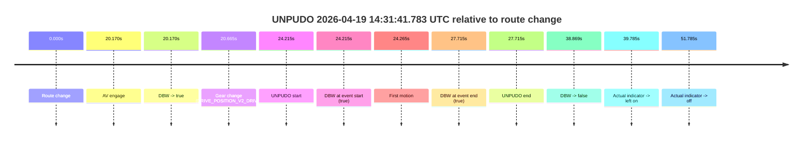
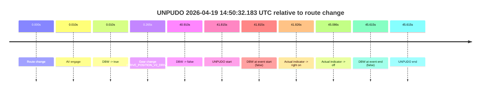
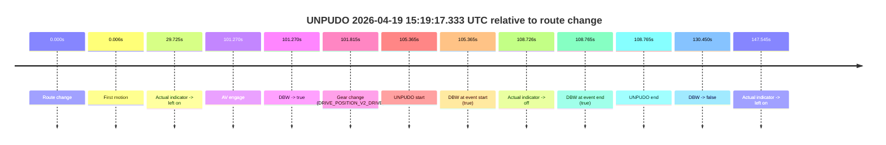
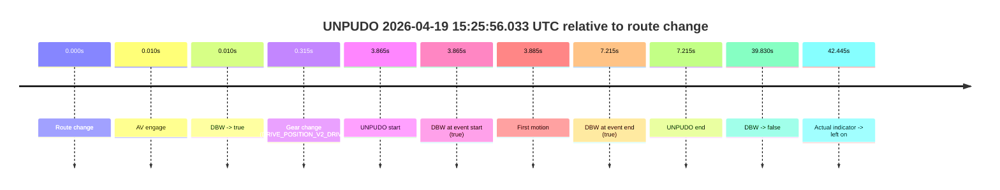
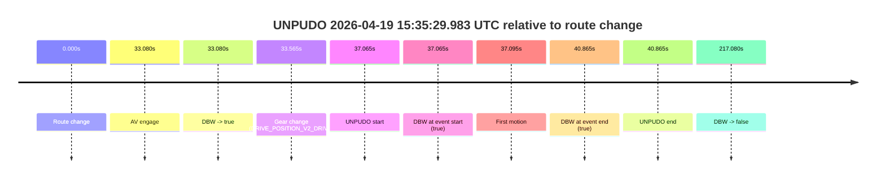

# Run Report: fme20009/2026-04-19--14-16-09--gen2-av-2a35d3c9-1175-4908-883f-fe1d4bb2abad

| Field | Value |
|---|---|
| Run ID | `fme20009/2026-04-19--14-16-09--gen2-av-2a35d3c9-1175-4908-883f-fe1d4bb2abad` |
| Date | `2026-04-19` |
| Model(s) | `eel-teal-outspoken` |
| Author | `zak` |
| Event count | `10` |

## unpudo 2026-04-19 14:31:41.783 UTC

| Field | Value |
|---|---|
| Model | `eel-teal-outspoken` |
| Author | `zak` |
| Run ID | `fme20009/2026-04-19--14-16-09--gen2-av-2a35d3c9-1175-4908-883f-fe1d4bb2abad` |
| Date | `2026-04-19` |
| Time (UTC) | `14:31:41.783` |
| Event type | `unpudo` |
| Disengagement type | `none observed` |
| Route change | `found` |
| Console | [run](https://console.sso.wayve.ai/run/fme20009/2026-04-19--14-16-09--gen2-av-2a35d3c9-1175-4908-883f-fe1d4bb2abad?id=&time-unixus=1776609101783304) |
| Foxglove | [segment](https://app.foxglove.dev/wayve-on-prem/p/prj_0dX18KZdVHg1fmmI/view?ds=foxglove-stream&ds.deviceName=fme20009&ds.start=2026-04-19T14%3A31%3A07.568741Z&ds.end=2026-04-19T14%3A32%3A06.438063Z&layoutId=lay_0e7VD4WIKDQGU73Y&time=2026-04-19T14%3A31%3A41.783304Z) |

### Event card: pass

- Pass: AV owns the credited unpudo from route change through the official unpudo window, the gear state is aligned at the anchor, and the vehicle moves without driver accelerator help in AV.

| Event | Time (UTC) | Delta from route change |
|---|---:|---:|
| Route change | 2026-04-19 14:31:17.568 | `0.000s` |
| AV engage | 2026-04-19 14:31:37.738 | `20.170s` |
| DBW -> true | 2026-04-19 14:31:37.738 | `20.170s` |
| Gear change (DRIVE_POSITION_V2_DRIVE) | 2026-04-19 14:31:38.233 | `20.665s` |
| UNPUDO start | 2026-04-19 14:31:41.783 | `24.215s` |
| DBW at event start (true) | 2026-04-19 14:31:41.783 | `24.215s` |
| First motion | 2026-04-19 14:31:41.833 | `24.265s` |
| DBW at event end (true) | 2026-04-19 14:31:45.283 | `27.715s` |
| UNPUDO end | 2026-04-19 14:31:45.283 | `27.715s` |
| DBW -> false | 2026-04-19 14:31:56.438 | `38.869s` |
| Actual indicator -> left on | 2026-04-19 14:31:57.353 | `39.785s` |
| Actual indicator -> off | 2026-04-19 14:32:09.354 | `51.785s` |

| Metric | Value |
|---|---|
| Outcome | `pass` |
| Effective failure type | `none` |
| Route change status | `found` |
| DBW at event start | `true` |
| DBW at event end | `true` |
| Predicted gear at AV start | `DRIVE_POSITION_V2_DRIVE` |
| Actual gear at AV start | `DRIVE_POSITION_V2_PARK` |
| Predicted gear at event start | `DRIVE_POSITION_V2_DRIVE` |
| Actual gear at event start | `DRIVE_POSITION_V2_DRIVE` |
| Planned indicator direction | `INDICATORS_STATE_V2_RIGHT_ON` |
| Controller indicator direction | `INDICATORS_STATE_V2_RIGHT_ON` |
| Actual indicator direction | `INDICATORS_STATE_V2_OFF` |
| Actual indicator at maneuver end | `INDICATORS_STATE_V2_OFF` |
| Driver accel help in AV | `false` |
| Driver accel help timestamp | `n/a` |
| Max accel pedal pct in AV | `0.0%` |
| Max brake pedal pct in AV | `8.0%` |
| Max speed mps in AV | `4.425` |
| Success timing baseline | `route change` |
| Route -> AV | `20.170s` |
| AV -> event start | `4.045s` |
| AV -> first motion | `4.095s` |
| Success baseline -> event start | `24.215s` |
| Success baseline -> first motion | `24.265s` |
| AV duration before disengagement | `18.700s` |
| Trajectory waypoint count | `36` |
| Driving-plan step count | `11` |

The scored portion starts from the AV-owned window, not from the pre-AV setup. Route-change search in the stopped pre-event segment was `found`, with the baseline therefore set to route change. At the event anchor the model predicts `DRIVE_POSITION_V2_DRIVE` and the actual gear is `DRIVE_POSITION_V2_DRIVE`. The effective model outcome is `pass` because `the credited unpudo stays AV-owned through the official unpudo window.`

### Resolution

| Field | Value |
|---|---|
| Final outcome | `pass` |
| Do we agree with this label? | `yes` |
| Source disengagement type | `none observed` |
| Resolved effective failure type | `none` |
| Confidence | `high` |

## unpudo 2026-04-19 14:40:47.383 UTC

| Field | Value |
|---|---|
| Model | `eel-teal-outspoken` |
| Author | `zak` |
| Run ID | `fme20009/2026-04-19--14-16-09--gen2-av-2a35d3c9-1175-4908-883f-fe1d4bb2abad` |
| Date | `2026-04-19` |
| Time (UTC) | `14:40:47.383` |
| Event type | `unpudo` |
| Disengagement type | `none observed` |
| Route change | `found` |
| Console | [run](https://console.sso.wayve.ai/run/fme20009/2026-04-19--14-16-09--gen2-av-2a35d3c9-1175-4908-883f-fe1d4bb2abad?id=&time-unixus=1776609647383306) |
| Foxglove | [segment](https://app.foxglove.dev/wayve-on-prem/p/prj_0dX18KZdVHg1fmmI/view?ds=foxglove-stream&ds.deviceName=fme20009&ds.start=2026-04-19T14%3A40%3A26.868315Z&ds.end=2026-04-19T14%3A45%3A19.079274Z&layoutId=lay_0e7VD4WIKDQGU73Y&time=2026-04-19T14%3A40%3A47.383306Z) |

### Event card: pass

- Pass: AV owns the credited unpudo from route change through the official unpudo window, the gear state is aligned at the anchor, and the vehicle moves without driver accelerator help in AV.

| Event | Time (UTC) | Delta from route change |
|---|---:|---:|
| Route change | 2026-04-19 14:40:36.868 | `0.000s` |
| AV engage | 2026-04-19 14:40:36.878 | `0.010s` |
| DBW -> true | 2026-04-19 14:40:36.878 | `0.010s` |
| Gear change (DRIVE_POSITION_V2_DRIVE) | 2026-04-19 14:40:37.233 | `0.365s` |
| UNPUDO start | 2026-04-19 14:40:47.383 | `10.515s` |
| DBW at event start (true) | 2026-04-19 14:40:47.383 | `10.515s` |
| First motion | 2026-04-19 14:40:47.394 | `10.526s` |
| DBW at event end (true) | 2026-04-19 14:40:50.983 | `14.115s` |
| UNPUDO end | 2026-04-19 14:40:50.983 | `14.115s` |
| DBW -> false | 2026-04-19 14:45:09.079 | `272.211s` |

| Metric | Value |
|---|---|
| Outcome | `pass` |
| Effective failure type | `none` |
| Route change status | `found` |
| DBW at event start | `true` |
| DBW at event end | `true` |
| Predicted gear at AV start | `DRIVE_POSITION_V2_PARK` |
| Actual gear at AV start | `DRIVE_POSITION_V2_PARK` |
| Predicted gear at event start | `DRIVE_POSITION_V2_DRIVE` |
| Actual gear at event start | `DRIVE_POSITION_V2_DRIVE` |
| Planned indicator direction | `INDICATORS_STATE_V2_RIGHT_ON` |
| Controller indicator direction | `INDICATORS_STATE_V2_RIGHT_ON` |
| Actual indicator direction | `INDICATORS_STATE_V2_OFF` |
| Actual indicator at maneuver end | `INDICATORS_STATE_V2_OFF` |
| Driver accel help in AV | `false` |
| Driver accel help timestamp | `n/a` |
| Max accel pedal pct in AV | `0.0%` |
| Max brake pedal pct in AV | `9.2%` |
| Max speed mps in AV | `5.225` |
| Success timing baseline | `route change` |
| Route -> AV | `0.010s` |
| AV -> event start | `10.505s` |
| AV -> first motion | `10.516s` |
| Success baseline -> event start | `10.515s` |
| Success baseline -> first motion | `10.526s` |
| AV duration before disengagement | `272.201s` |
| Trajectory waypoint count | `36` |
| Driving-plan step count | `11` |

The scored portion starts from the AV-owned window, not from the pre-AV setup. Route-change search in the stopped pre-event segment was `found`, with the baseline therefore set to route change. At the event anchor the model predicts `DRIVE_POSITION_V2_DRIVE` and the actual gear is `DRIVE_POSITION_V2_DRIVE`. The effective model outcome is `pass` because `the credited unpudo stays AV-owned through the official unpudo window.`

### Resolution

| Field | Value |
|---|---|
| Final outcome | `pass` |
| Do we agree with this label? | `yes` |
| Source disengagement type | `none observed` |
| Resolved effective failure type | `none` |
| Confidence | `high` |

## unpudo 2026-04-19 14:45:49.583 UTC

| Field | Value |
|---|---|
| Model | `eel-teal-outspoken` |
| Author | `zak` |
| Run ID | `fme20009/2026-04-19--14-16-09--gen2-av-2a35d3c9-1175-4908-883f-fe1d4bb2abad` |
| Date | `2026-04-19` |
| Time (UTC) | `14:45:49.583` |
| Event type | `unpudo` |
| Disengagement type | `none observed` |
| Route change | `found` |
| Console | [run](https://console.sso.wayve.ai/run/fme20009/2026-04-19--14-16-09--gen2-av-2a35d3c9-1175-4908-883f-fe1d4bb2abad?id=&time-unixus=1776609949583314) |
| Foxglove | [segment](https://app.foxglove.dev/wayve-on-prem/p/prj_0dX18KZdVHg1fmmI/view?ds=foxglove-stream&ds.deviceName=fme20009&ds.start=2026-04-19T14%3A45%3A16.618272Z&ds.end=2026-04-19T14%3A46%3A03.783307Z&layoutId=lay_0e7VD4WIKDQGU73Y&time=2026-04-19T14%3A45%3A49.583314Z) |

### Event card: fail

- Fail: the credited unpudo does not stay AV-owned. The event window starts with DBW false, and the maneuver outcome lands outside a clean AV-owned segment.

| Event | Time (UTC) | Delta from route change |
|---|---:|---:|
| Route change | 2026-04-19 14:45:26.618 | `0.000s` |
| AV engage | 2026-04-19 14:45:36.398 | `9.780s` |
| DBW -> true | 2026-04-19 14:45:36.398 | `9.780s` |
| Gear change (DRIVE_POSITION_V2_DRIVE) | 2026-04-19 14:45:36.833 | `10.215s` |
| DBW -> false | 2026-04-19 14:45:43.058 | `16.440s` |
| UNPUDO start | 2026-04-19 14:45:49.583 | `22.965s` |
| DBW at event start (false) | 2026-04-19 14:45:49.583 | `22.965s` |
| Actual indicator -> right on | 2026-04-19 14:45:51.333 | `24.715s` |
| Actual indicator -> off | 2026-04-19 14:45:53.233 | `26.615s` |
| DBW at event end (false) | 2026-04-19 14:45:53.783 | `27.165s` |
| UNPUDO end | 2026-04-19 14:45:53.783 | `27.165s` |

| Metric | Value |
|---|---|
| Outcome | `fail` |
| Effective failure type | `not_av_owned` |
| Route change status | `found` |
| DBW at event start | `false` |
| DBW at event end | `false` |
| Predicted gear at AV start | `DRIVE_POSITION_V2_DRIVE` |
| Actual gear at AV start | `DRIVE_POSITION_V2_PARK` |
| Predicted gear at event start | `DRIVE_POSITION_V2_DRIVE` |
| Actual gear at event start | `DRIVE_POSITION_V2_DRIVE` |
| Planned indicator direction | `INDICATORS_STATE_V2_RIGHT_ON` |
| Controller indicator direction | `INDICATORS_STATE_V2_RIGHT_ON` |
| Actual indicator direction | `INDICATORS_STATE_V2_OFF` |
| Actual indicator at maneuver end | `INDICATORS_STATE_V2_OFF` |
| Driver accel help in AV | `false` |
| Driver accel help timestamp | `n/a` |
| Max accel pedal pct in AV | `0.0%` |
| Max brake pedal pct in AV | `8.0%` |
| Max speed mps in AV | `0.000` |
| Success timing baseline | `route change` |
| Route -> AV | `9.780s` |
| AV -> event start | `13.185s` |
| AV -> first motion | `n/a` |
| Success baseline -> event start | `22.965s` |
| Success baseline -> first motion | `n/a` |
| AV duration before disengagement | `6.660s` |
| Trajectory waypoint count | `37` |
| Driving-plan step count | `11` |

The scored portion starts from the AV-owned window, not from the pre-AV setup. Route-change search in the stopped pre-event segment was `found`, with the baseline therefore set to route change. At the event anchor the model predicts `DRIVE_POSITION_V2_DRIVE` and the actual gear is `DRIVE_POSITION_V2_DRIVE`. The effective model outcome is `fail` because `not_av_owned.`

### Resolution

| Field | Value |
|---|---|
| Final outcome | `fail` |
| Do we agree with this label? | `yes` |
| Source disengagement type | `none observed` |
| Resolved effective failure type | `not_av_owned` |
| Confidence | `high` |

## unpudo 2026-04-19 14:50:32.183 UTC

| Field | Value |
|---|---|
| Model | `eel-teal-outspoken` |
| Author | `zak` |
| Run ID | `fme20009/2026-04-19--14-16-09--gen2-av-2a35d3c9-1175-4908-883f-fe1d4bb2abad` |
| Date | `2026-04-19` |
| Time (UTC) | `14:50:32.183` |
| Event type | `unpudo` |
| Disengagement type | `none observed` |
| Route change | `found` |
| Console | [run](https://console.sso.wayve.ai/run/fme20009/2026-04-19--14-16-09--gen2-av-2a35d3c9-1175-4908-883f-fe1d4bb2abad?id=&time-unixus=1776610232183298) |
| Foxglove | [segment](https://app.foxglove.dev/wayve-on-prem/p/prj_0dX18KZdVHg1fmmI/view?ds=foxglove-stream&ds.deviceName=fme20009&ds.start=2026-04-19T14%3A49%3A40.368290Z&ds.end=2026-04-19T14%3A50%3A45.983310Z&layoutId=lay_0e7VD4WIKDQGU73Y&time=2026-04-19T14%3A50%3A32.183298Z) |

### Event card: fail

- Fail: the credited unpudo does not stay AV-owned. The event window starts with DBW false, and the maneuver outcome lands outside a clean AV-owned segment.

| Event | Time (UTC) | Delta from route change |
|---|---:|---:|
| Route change | 2026-04-19 14:49:50.368 | `0.000s` |
| AV engage | 2026-04-19 14:49:50.378 | `0.010s` |
| DBW -> true | 2026-04-19 14:49:50.378 | `0.010s` |
| Gear change (DRIVE_POSITION_V2_DRIVE) | 2026-04-19 14:49:50.633 | `0.265s` |
| DBW -> false | 2026-04-19 14:50:31.278 | `40.910s` |
| UNPUDO start | 2026-04-19 14:50:32.183 | `41.815s` |
| DBW at event start (false) | 2026-04-19 14:50:32.183 | `41.815s` |
| Actual indicator -> right on | 2026-04-19 14:50:32.193 | `41.826s` |
| Actual indicator -> off | 2026-04-19 14:50:35.454 | `45.086s` |
| DBW at event end (false) | 2026-04-19 14:50:35.983 | `45.615s` |
| UNPUDO end | 2026-04-19 14:50:35.983 | `45.615s` |

| Metric | Value |
|---|---|
| Outcome | `fail` |
| Effective failure type | `not_av_owned` |
| Route change status | `found` |
| DBW at event start | `false` |
| DBW at event end | `false` |
| Predicted gear at AV start | `DRIVE_POSITION_V2_PARK` |
| Actual gear at AV start | `DRIVE_POSITION_V2_PARK` |
| Predicted gear at event start | `DRIVE_POSITION_V2_DRIVE` |
| Actual gear at event start | `DRIVE_POSITION_V2_DRIVE` |
| Planned indicator direction | `INDICATORS_STATE_V2_OFF` |
| Controller indicator direction | `INDICATORS_STATE_V2_OFF` |
| Actual indicator direction | `INDICATORS_STATE_V2_OFF` |
| Actual indicator at maneuver end | `INDICATORS_STATE_V2_OFF` |
| Driver accel help in AV | `false` |
| Driver accel help timestamp | `n/a` |
| Max accel pedal pct in AV | `0.0%` |
| Max brake pedal pct in AV | `8.0%` |
| Max speed mps in AV | `0.000` |
| Success timing baseline | `route change` |
| Route -> AV | `0.010s` |
| AV -> event start | `41.805s` |
| AV -> first motion | `n/a` |
| Success baseline -> event start | `41.815s` |
| Success baseline -> first motion | `n/a` |
| AV duration before disengagement | `40.900s` |
| Trajectory waypoint count | `37` |
| Driving-plan step count | `11` |

The scored portion starts from the AV-owned window, not from the pre-AV setup. Route-change search in the stopped pre-event segment was `found`, with the baseline therefore set to route change. At the event anchor the model predicts `DRIVE_POSITION_V2_DRIVE` and the actual gear is `DRIVE_POSITION_V2_DRIVE`. The effective model outcome is `fail` because `not_av_owned.`

### Resolution

| Field | Value |
|---|---|
| Final outcome | `fail` |
| Do we agree with this label? | `yes` |
| Source disengagement type | `none observed` |
| Resolved effective failure type | `not_av_owned` |
| Confidence | `high` |

## unpudo 2026-04-19 14:58:01.683 UTC

| Field | Value |
|---|---|
| Model | `eel-teal-outspoken` |
| Author | `zak` |
| Run ID | `fme20009/2026-04-19--14-16-09--gen2-av-2a35d3c9-1175-4908-883f-fe1d4bb2abad` |
| Date | `2026-04-19` |
| Time (UTC) | `14:58:01.683` |
| Event type | `unpudo` |
| Disengagement type | `none observed` |
| Route change | `found` |
| Console | [run](https://console.sso.wayve.ai/run/fme20009/2026-04-19--14-16-09--gen2-av-2a35d3c9-1175-4908-883f-fe1d4bb2abad?id=&time-unixus=1776610681683316) |
| Foxglove | [segment](https://app.foxglove.dev/wayve-on-prem/p/prj_0dX18KZdVHg1fmmI/view?ds=foxglove-stream&ds.deviceName=fme20009&ds.start=2026-04-19T14%3A57%3A05.418661Z&ds.end=2026-04-19T15%3A01%3A22.519221Z&layoutId=lay_0e7VD4WIKDQGU73Y&time=2026-04-19T14%3A58%3A01.683316Z) |

### Event card: pass

- Pass: AV owns the credited unpudo from route change through the official unpudo window, the gear state is aligned at the anchor, and the vehicle moves without driver accelerator help in AV.

| Event | Time (UTC) | Delta from route change |
|---|---:|---:|
| Route change | 2026-04-19 14:57:15.418 | `0.000s` |
| AV engage | 2026-04-19 14:57:57.658 | `42.240s` |
| DBW -> true | 2026-04-19 14:57:57.658 | `42.240s` |
| Gear change (DRIVE_POSITION_V2_DRIVE) | 2026-04-19 14:57:58.133 | `42.715s` |
| UNPUDO start | 2026-04-19 14:58:01.683 | `46.265s` |
| DBW at event start (true) | 2026-04-19 14:58:01.683 | `46.265s` |
| First motion | 2026-04-19 14:58:01.733 | `46.315s` |
| DBW at event end (true) | 2026-04-19 14:58:26.383 | `70.965s` |
| UNPUDO end | 2026-04-19 14:58:26.383 | `70.965s` |
| DBW -> false | 2026-04-19 15:01:12.519 | `237.101s` |

| Metric | Value |
|---|---|
| Outcome | `pass` |
| Effective failure type | `none` |
| Route change status | `found` |
| DBW at event start | `true` |
| DBW at event end | `true` |
| Predicted gear at AV start | `DRIVE_POSITION_V2_DRIVE` |
| Actual gear at AV start | `DRIVE_POSITION_V2_PARK` |
| Predicted gear at event start | `DRIVE_POSITION_V2_DRIVE` |
| Actual gear at event start | `DRIVE_POSITION_V2_DRIVE` |
| Planned indicator direction | `INDICATORS_STATE_V2_RIGHT_ON` |
| Controller indicator direction | `INDICATORS_STATE_V2_RIGHT_ON` |
| Actual indicator direction | `INDICATORS_STATE_V2_OFF` |
| Actual indicator at maneuver end | `INDICATORS_STATE_V2_OFF` |
| Driver accel help in AV | `false` |
| Driver accel help timestamp | `n/a` |
| Max accel pedal pct in AV | `0.0%` |
| Max brake pedal pct in AV | `12.7%` |
| Max speed mps in AV | `3.442` |
| Success timing baseline | `route change` |
| Route -> AV | `42.240s` |
| AV -> event start | `4.025s` |
| AV -> first motion | `4.076s` |
| Success baseline -> event start | `46.265s` |
| Success baseline -> first motion | `46.315s` |
| AV duration before disengagement | `194.861s` |
| Trajectory waypoint count | `37` |
| Driving-plan step count | `11` |

The scored portion starts from the AV-owned window, not from the pre-AV setup. Route-change search in the stopped pre-event segment was `found`, with the baseline therefore set to route change. At the event anchor the model predicts `DRIVE_POSITION_V2_DRIVE` and the actual gear is `DRIVE_POSITION_V2_DRIVE`. The effective model outcome is `pass` because `the credited unpudo stays AV-owned through the official unpudo window.`

### Resolution

| Field | Value |
|---|---|
| Final outcome | `pass` |
| Do we agree with this label? | `yes` |
| Source disengagement type | `none observed` |
| Resolved effective failure type | `none` |
| Confidence | `high` |

## unpudo 2026-04-19 15:19:17.333 UTC

| Field | Value |
|---|---|
| Model | `eel-teal-outspoken` |
| Author | `zak` |
| Run ID | `fme20009/2026-04-19--14-16-09--gen2-av-2a35d3c9-1175-4908-883f-fe1d4bb2abad` |
| Date | `2026-04-19` |
| Time (UTC) | `15:19:17.333` |
| Event type | `unpudo` |
| Disengagement type | `none observed` |
| Route change | `found` |
| Console | [run](https://console.sso.wayve.ai/run/fme20009/2026-04-19--14-16-09--gen2-av-2a35d3c9-1175-4908-883f-fe1d4bb2abad?id=&time-unixus=1776611957333292) |
| Foxglove | [segment](https://app.foxglove.dev/wayve-on-prem/p/prj_0dX18KZdVHg1fmmI/view?ds=foxglove-stream&ds.deviceName=fme20009&ds.start=2026-04-19T15%3A17%3A21.968408Z&ds.end=2026-04-19T15%3A19%3A52.417949Z&layoutId=lay_0e7VD4WIKDQGU73Y&time=2026-04-19T15%3A19%3A17.333292Z) |

### Event card: pass

- Pass: AV owns the credited unpudo from route change through the official unpudo window, the gear state is aligned at the anchor, and the vehicle moves without driver accelerator help in AV.

| Event | Time (UTC) | Delta from route change |
|---|---:|---:|
| Route change | 2026-04-19 15:17:31.968 | `0.000s` |
| First motion | 2026-04-19 15:17:31.974 | `0.006s` |
| Actual indicator -> left on | 2026-04-19 15:18:01.693 | `29.725s` |
| AV engage | 2026-04-19 15:19:13.238 | `101.270s` |
| DBW -> true | 2026-04-19 15:19:13.238 | `101.270s` |
| Gear change (DRIVE_POSITION_V2_DRIVE) | 2026-04-19 15:19:13.783 | `101.815s` |
| UNPUDO start | 2026-04-19 15:19:17.333 | `105.365s` |
| DBW at event start (true) | 2026-04-19 15:19:17.333 | `105.365s` |
| Actual indicator -> off | 2026-04-19 15:19:20.694 | `108.726s` |
| DBW at event end (true) | 2026-04-19 15:19:20.733 | `108.765s` |
| UNPUDO end | 2026-04-19 15:19:20.733 | `108.765s` |
| DBW -> false | 2026-04-19 15:19:42.417 | `130.450s` |
| Actual indicator -> left on | 2026-04-19 15:19:59.513 | `147.545s` |

| Metric | Value |
|---|---|
| Outcome | `pass` |
| Effective failure type | `none` |
| Route change status | `found` |
| DBW at event start | `true` |
| DBW at event end | `true` |
| Predicted gear at AV start | `DRIVE_POSITION_V2_DRIVE` |
| Actual gear at AV start | `DRIVE_POSITION_V2_PARK` |
| Predicted gear at event start | `DRIVE_POSITION_V2_DRIVE` |
| Actual gear at event start | `DRIVE_POSITION_V2_DRIVE` |
| Planned indicator direction | `INDICATORS_STATE_V2_RIGHT_ON` |
| Controller indicator direction | `INDICATORS_STATE_V2_RIGHT_ON` |
| Actual indicator direction | `INDICATORS_STATE_V2_LEFT_ON` |
| Actual indicator at maneuver end | `INDICATORS_STATE_V2_OFF` |
| Driver accel help in AV | `false` |
| Driver accel help timestamp | `n/a` |
| Max accel pedal pct in AV | `0.0%` |
| Max brake pedal pct in AV | `8.0%` |
| Max speed mps in AV | `5.072` |
| Success timing baseline | `route change` |
| Route -> AV | `101.270s` |
| AV -> event start | `4.095s` |
| AV -> first motion | `-101.264s` |
| Success baseline -> event start | `105.365s` |
| Success baseline -> first motion | `0.006s` |
| AV duration before disengagement | `29.180s` |
| Trajectory waypoint count | `36` |
| Driving-plan step count | `11` |

The scored portion starts from the AV-owned window, not from the pre-AV setup. Route-change search in the stopped pre-event segment was `found`, with the baseline therefore set to route change. At the event anchor the model predicts `DRIVE_POSITION_V2_DRIVE` and the actual gear is `DRIVE_POSITION_V2_DRIVE`. The effective model outcome is `pass` because `the credited unpudo stays AV-owned through the official unpudo window.`

### Resolution

| Field | Value |
|---|---|
| Final outcome | `pass` |
| Do we agree with this label? | `yes` |
| Source disengagement type | `none observed` |
| Resolved effective failure type | `none` |
| Confidence | `high` |

## unpudo 2026-04-19 15:25:56.033 UTC

| Field | Value |
|---|---|
| Model | `eel-teal-outspoken` |
| Author | `zak` |
| Run ID | `fme20009/2026-04-19--14-16-09--gen2-av-2a35d3c9-1175-4908-883f-fe1d4bb2abad` |
| Date | `2026-04-19` |
| Time (UTC) | `15:25:56.033` |
| Event type | `unpudo` |
| Disengagement type | `none observed` |
| Route change | `found` |
| Console | [run](https://console.sso.wayve.ai/run/fme20009/2026-04-19--14-16-09--gen2-av-2a35d3c9-1175-4908-883f-fe1d4bb2abad?id=&time-unixus=1776612356033322) |
| Foxglove | [segment](https://app.foxglove.dev/wayve-on-prem/p/prj_0dX18KZdVHg1fmmI/view?ds=foxglove-stream&ds.deviceName=fme20009&ds.start=2026-04-19T15%3A25%3A42.168360Z&ds.end=2026-04-19T15%3A26%3A41.998859Z&layoutId=lay_0e7VD4WIKDQGU73Y&time=2026-04-19T15%3A25%3A56.033322Z) |

### Event card: pass

- Pass: AV owns the credited unpudo from route change through the official unpudo window, the gear state is aligned at the anchor, and the vehicle moves without driver accelerator help in AV.

| Event | Time (UTC) | Delta from route change |
|---|---:|---:|
| Route change | 2026-04-19 15:25:52.168 | `0.000s` |
| AV engage | 2026-04-19 15:25:52.178 | `0.010s` |
| DBW -> true | 2026-04-19 15:25:52.178 | `0.010s` |
| Gear change (DRIVE_POSITION_V2_DRIVE) | 2026-04-19 15:25:52.483 | `0.315s` |
| UNPUDO start | 2026-04-19 15:25:56.033 | `3.865s` |
| DBW at event start (true) | 2026-04-19 15:25:56.033 | `3.865s` |
| First motion | 2026-04-19 15:25:56.053 | `3.885s` |
| DBW at event end (true) | 2026-04-19 15:25:59.383 | `7.215s` |
| UNPUDO end | 2026-04-19 15:25:59.383 | `7.215s` |
| DBW -> false | 2026-04-19 15:26:31.998 | `39.830s` |
| Actual indicator -> left on | 2026-04-19 15:26:34.613 | `42.445s` |

| Metric | Value |
|---|---|
| Outcome | `pass` |
| Effective failure type | `none` |
| Route change status | `found` |
| DBW at event start | `true` |
| DBW at event end | `true` |
| Predicted gear at AV start | `DRIVE_POSITION_V2_PARK` |
| Actual gear at AV start | `DRIVE_POSITION_V2_PARK` |
| Predicted gear at event start | `DRIVE_POSITION_V2_DRIVE` |
| Actual gear at event start | `DRIVE_POSITION_V2_DRIVE` |
| Planned indicator direction | `INDICATORS_STATE_V2_RIGHT_ON` |
| Controller indicator direction | `INDICATORS_STATE_V2_RIGHT_ON` |
| Actual indicator direction | `INDICATORS_STATE_V2_OFF` |
| Actual indicator at maneuver end | `INDICATORS_STATE_V2_OFF` |
| Driver accel help in AV | `false` |
| Driver accel help timestamp | `n/a` |
| Max accel pedal pct in AV | `0.0%` |
| Max brake pedal pct in AV | `8.0%` |
| Max speed mps in AV | `5.075` |
| Success timing baseline | `route change` |
| Route -> AV | `0.010s` |
| AV -> event start | `3.855s` |
| AV -> first motion | `3.875s` |
| Success baseline -> event start | `3.865s` |
| Success baseline -> first motion | `3.885s` |
| AV duration before disengagement | `39.821s` |
| Trajectory waypoint count | `38` |
| Driving-plan step count | `11` |

The scored portion starts from the AV-owned window, not from the pre-AV setup. Route-change search in the stopped pre-event segment was `found`, with the baseline therefore set to route change. At the event anchor the model predicts `DRIVE_POSITION_V2_DRIVE` and the actual gear is `DRIVE_POSITION_V2_DRIVE`. The effective model outcome is `pass` because `the credited unpudo stays AV-owned through the official unpudo window.`

### Resolution

| Field | Value |
|---|---|
| Final outcome | `pass` |
| Do we agree with this label? | `yes` |
| Source disengagement type | `none observed` |
| Resolved effective failure type | `none` |
| Confidence | `high` |

## unpudo 2026-04-19 15:30:17.083 UTC

| Field | Value |
|---|---|
| Model | `eel-teal-outspoken` |
| Author | `zak` |
| Run ID | `fme20009/2026-04-19--14-16-09--gen2-av-2a35d3c9-1175-4908-883f-fe1d4bb2abad` |
| Date | `2026-04-19` |
| Time (UTC) | `15:30:17.083` |
| Event type | `unpudo` |
| Disengagement type | `none observed` |
| Route change | `found` |
| Console | [run](https://console.sso.wayve.ai/run/fme20009/2026-04-19--14-16-09--gen2-av-2a35d3c9-1175-4908-883f-fe1d4bb2abad?id=&time-unixus=1776612617083290) |
| Foxglove | [segment](https://app.foxglove.dev/wayve-on-prem/p/prj_0dX18KZdVHg1fmmI/view?ds=foxglove-stream&ds.deviceName=fme20009&ds.start=2026-04-19T15%3A29%3A59.768298Z&ds.end=2026-04-19T15%3A31%3A52.239162Z&layoutId=lay_0e7VD4WIKDQGU73Y&time=2026-04-19T15%3A30%3A17.083290Z) |

### Event card: pass

- Pass: AV owns the credited unpudo from route change through the official unpudo window, the gear state is aligned at the anchor, and the vehicle moves without driver accelerator help in AV.

| Event | Time (UTC) | Delta from route change |
|---|---:|---:|
| Route change | 2026-04-19 15:30:09.768 | `0.000s` |
| AV engage | 2026-04-19 15:30:09.778 | `0.010s` |
| DBW -> true | 2026-04-19 15:30:09.778 | `0.010s` |
| Gear change (DRIVE_POSITION_V2_DRIVE) | 2026-04-19 15:30:10.083 | `0.315s` |
| UNPUDO start | 2026-04-19 15:30:17.083 | `7.315s` |
| DBW at event start (true) | 2026-04-19 15:30:17.083 | `7.315s` |
| First motion | 2026-04-19 15:30:17.093 | `7.325s` |
| DBW at event end (true) | 2026-04-19 15:30:20.883 | `11.115s` |
| UNPUDO end | 2026-04-19 15:30:20.883 | `11.115s` |
| DBW -> false | 2026-04-19 15:31:42.239 | `92.471s` |

| Metric | Value |
|---|---|
| Outcome | `pass` |
| Effective failure type | `none` |
| Route change status | `found` |
| DBW at event start | `true` |
| DBW at event end | `true` |
| Predicted gear at AV start | `DRIVE_POSITION_V2_PARK` |
| Actual gear at AV start | `DRIVE_POSITION_V2_PARK` |
| Predicted gear at event start | `DRIVE_POSITION_V2_DRIVE` |
| Actual gear at event start | `DRIVE_POSITION_V2_DRIVE` |
| Planned indicator direction | `INDICATORS_STATE_V2_RIGHT_ON` |
| Controller indicator direction | `INDICATORS_STATE_V2_RIGHT_ON` |
| Actual indicator direction | `INDICATORS_STATE_V2_OFF` |
| Actual indicator at maneuver end | `INDICATORS_STATE_V2_OFF` |
| Driver accel help in AV | `false` |
| Driver accel help timestamp | `n/a` |
| Max accel pedal pct in AV | `0.0%` |
| Max brake pedal pct in AV | `8.5%` |
| Max speed mps in AV | `4.431` |
| Success timing baseline | `route change` |
| Route -> AV | `0.010s` |
| AV -> event start | `7.305s` |
| AV -> first motion | `7.315s` |
| Success baseline -> event start | `7.315s` |
| Success baseline -> first motion | `7.325s` |
| AV duration before disengagement | `92.461s` |
| Trajectory waypoint count | `37` |
| Driving-plan step count | `11` |

The scored portion starts from the AV-owned window, not from the pre-AV setup. Route-change search in the stopped pre-event segment was `found`, with the baseline therefore set to route change. At the event anchor the model predicts `DRIVE_POSITION_V2_DRIVE` and the actual gear is `DRIVE_POSITION_V2_DRIVE`. The effective model outcome is `pass` because `the credited unpudo stays AV-owned through the official unpudo window.`

### Resolution

| Field | Value |
|---|---|
| Final outcome | `pass` |
| Do we agree with this label? | `yes` |
| Source disengagement type | `none observed` |
| Resolved effective failure type | `none` |
| Confidence | `high` |

## unpudo 2026-04-19 15:35:29.983 UTC

| Field | Value |
|---|---|
| Model | `eel-teal-outspoken` |
| Author | `zak` |
| Run ID | `fme20009/2026-04-19--14-16-09--gen2-av-2a35d3c9-1175-4908-883f-fe1d4bb2abad` |
| Date | `2026-04-19` |
| Time (UTC) | `15:35:29.983` |
| Event type | `unpudo` |
| Disengagement type | `none observed` |
| Route change | `found` |
| Console | [run](https://console.sso.wayve.ai/run/fme20009/2026-04-19--14-16-09--gen2-av-2a35d3c9-1175-4908-883f-fe1d4bb2abad?id=&time-unixus=1776612929983326) |
| Foxglove | [segment](https://app.foxglove.dev/wayve-on-prem/p/prj_0dX18KZdVHg1fmmI/view?ds=foxglove-stream&ds.deviceName=fme20009&ds.start=2026-04-19T15%3A34%3A42.918325Z&ds.end=2026-04-19T15%3A38%3A39.998056Z&layoutId=lay_0e7VD4WIKDQGU73Y&time=2026-04-19T15%3A35%3A29.983326Z) |

### Event card: pass

- Pass: AV owns the credited unpudo from route change through the official unpudo window, the gear state is aligned at the anchor, and the vehicle moves without driver accelerator help in AV.

| Event | Time (UTC) | Delta from route change |
|---|---:|---:|
| Route change | 2026-04-19 15:34:52.918 | `0.000s` |
| AV engage | 2026-04-19 15:35:25.998 | `33.080s` |
| DBW -> true | 2026-04-19 15:35:25.998 | `33.080s` |
| Gear change (DRIVE_POSITION_V2_DRIVE) | 2026-04-19 15:35:26.483 | `33.565s` |
| UNPUDO start | 2026-04-19 15:35:29.983 | `37.065s` |
| DBW at event start (true) | 2026-04-19 15:35:29.983 | `37.065s` |
| First motion | 2026-04-19 15:35:30.013 | `37.095s` |
| DBW at event end (true) | 2026-04-19 15:35:33.783 | `40.865s` |
| UNPUDO end | 2026-04-19 15:35:33.783 | `40.865s` |
| DBW -> false | 2026-04-19 15:38:29.998 | `217.080s` |

| Metric | Value |
|---|---|
| Outcome | `pass` |
| Effective failure type | `none` |
| Route change status | `found` |
| DBW at event start | `true` |
| DBW at event end | `true` |
| Predicted gear at AV start | `DRIVE_POSITION_V2_DRIVE` |
| Actual gear at AV start | `DRIVE_POSITION_V2_PARK` |
| Predicted gear at event start | `DRIVE_POSITION_V2_DRIVE` |
| Actual gear at event start | `DRIVE_POSITION_V2_DRIVE` |
| Planned indicator direction | `INDICATORS_STATE_V2_RIGHT_ON` |
| Controller indicator direction | `INDICATORS_STATE_V2_RIGHT_ON` |
| Actual indicator direction | `INDICATORS_STATE_V2_OFF` |
| Actual indicator at maneuver end | `INDICATORS_STATE_V2_OFF` |
| Driver accel help in AV | `false` |
| Driver accel help timestamp | `n/a` |
| Max accel pedal pct in AV | `0.0%` |
| Max brake pedal pct in AV | `9.8%` |
| Max speed mps in AV | `3.850` |
| Success timing baseline | `route change` |
| Route -> AV | `33.080s` |
| AV -> event start | `3.985s` |
| AV -> first motion | `4.015s` |
| Success baseline -> event start | `37.065s` |
| Success baseline -> first motion | `37.095s` |
| AV duration before disengagement | `184.000s` |
| Trajectory waypoint count | `37` |
| Driving-plan step count | `11` |

The scored portion starts from the AV-owned window, not from the pre-AV setup. Route-change search in the stopped pre-event segment was `found`, with the baseline therefore set to route change. At the event anchor the model predicts `DRIVE_POSITION_V2_DRIVE` and the actual gear is `DRIVE_POSITION_V2_DRIVE`. The effective model outcome is `pass` because `the credited unpudo stays AV-owned through the official unpudo window.`

### Resolution

| Field | Value |
|---|---|
| Final outcome | `pass` |
| Do we agree with this label? | `yes` |
| Source disengagement type | `none observed` |
| Resolved effective failure type | `none` |
| Confidence | `high` |

## unpudo 2026-04-19 15:42:09.583 UTC

| Field | Value |
|---|---|
| Model | `eel-teal-outspoken` |
| Author | `zak` |
| Run ID | `fme20009/2026-04-19--14-16-09--gen2-av-2a35d3c9-1175-4908-883f-fe1d4bb2abad` |
| Date | `2026-04-19` |
| Time (UTC) | `15:42:09.583` |
| Event type | `unpudo` |
| Disengagement type | `none observed` |
| Route change | `found` |
| Console | [run](https://console.sso.wayve.ai/run/fme20009/2026-04-19--14-16-09--gen2-av-2a35d3c9-1175-4908-883f-fe1d4bb2abad?id=&time-unixus=1776613329583311) |
| Foxglove | [segment](https://app.foxglove.dev/wayve-on-prem/p/prj_0dX18KZdVHg1fmmI/view?ds=foxglove-stream&ds.deviceName=fme20009&ds.start=2026-04-19T15%3A41%3A55.618286Z&ds.end=2026-04-19T15%3A44%3A44.878283Z&layoutId=lay_0e7VD4WIKDQGU73Y&time=2026-04-19T15%3A42%3A09.583311Z) |

### Event card: pass

- Pass: AV owns the credited unpudo from route change through the official unpudo window, the gear state is aligned at the anchor, and the vehicle moves without driver accelerator help in AV.

| Event | Time (UTC) | Delta from route change |
|---|---:|---:|
| Route change | 2026-04-19 15:42:05.618 | `0.000s` |
| AV engage | 2026-04-19 15:42:05.628 | `0.010s` |
| DBW -> true | 2026-04-19 15:42:05.628 | `0.010s` |
| Gear change (DRIVE_POSITION_V2_DRIVE) | 2026-04-19 15:42:05.983 | `0.365s` |
| UNPUDO start | 2026-04-19 15:42:09.583 | `3.965s` |
| DBW at event start (true) | 2026-04-19 15:42:09.583 | `3.965s` |
| First motion | 2026-04-19 15:42:09.613 | `3.995s` |
| DBW at event end (true) | 2026-04-19 15:42:31.483 | `25.865s` |
| UNPUDO end | 2026-04-19 15:42:31.483 | `25.865s` |
| DBW -> false | 2026-04-19 15:44:34.878 | `149.260s` |

| Metric | Value |
|---|---|
| Outcome | `pass` |
| Effective failure type | `none` |
| Route change status | `found` |
| DBW at event start | `true` |
| DBW at event end | `true` |
| Predicted gear at AV start | `DRIVE_POSITION_V2_PARK` |
| Actual gear at AV start | `DRIVE_POSITION_V2_PARK` |
| Predicted gear at event start | `DRIVE_POSITION_V2_DRIVE` |
| Actual gear at event start | `DRIVE_POSITION_V2_DRIVE` |
| Planned indicator direction | `INDICATORS_STATE_V2_RIGHT_ON` |
| Controller indicator direction | `INDICATORS_STATE_V2_RIGHT_ON` |
| Actual indicator direction | `INDICATORS_STATE_V2_OFF` |
| Actual indicator at maneuver end | `INDICATORS_STATE_V2_OFF` |
| Driver accel help in AV | `false` |
| Driver accel help timestamp | `n/a` |
| Max accel pedal pct in AV | `0.0%` |
| Max brake pedal pct in AV | `10.0%` |
| Max speed mps in AV | `2.889` |
| Success timing baseline | `route change` |
| Route -> AV | `0.010s` |
| AV -> event start | `3.955s` |
| AV -> first motion | `3.985s` |
| Success baseline -> event start | `3.965s` |
| Success baseline -> first motion | `3.995s` |
| AV duration before disengagement | `149.250s` |
| Trajectory waypoint count | `36` |
| Driving-plan step count | `11` |

The scored portion starts from the AV-owned window, not from the pre-AV setup. Route-change search in the stopped pre-event segment was `found`, with the baseline therefore set to route change. At the event anchor the model predicts `DRIVE_POSITION_V2_DRIVE` and the actual gear is `DRIVE_POSITION_V2_DRIVE`. The effective model outcome is `pass` because `the credited unpudo stays AV-owned through the official unpudo window.`

### Resolution

| Field | Value |
|---|---|
| Final outcome | `pass` |
| Do we agree with this label? | `yes` |
| Source disengagement type | `none observed` |
| Resolved effective failure type | `none` |
| Confidence | `high` |
