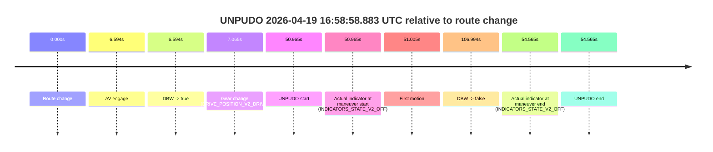
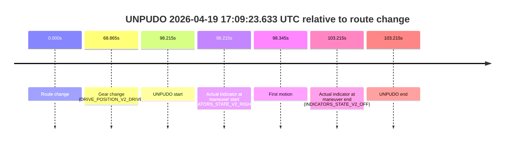
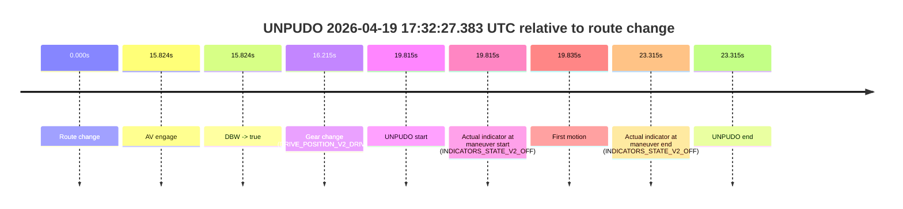

# Run Report: fme20009/2026-04-19--16-36-15--gen2-av-ef2257bf-51b3-421e-aac5-3d87c75ec773

| Field | Value |
|---|---|
| Run ID | `fme20009/2026-04-19--16-36-15--gen2-av-ef2257bf-51b3-421e-aac5-3d87c75ec773` |
| Date | `2026-04-19` |
| Model(s) | `pink-manta-ray-smooth` |
| Author | `guy.geva` |
| Event count | `7` |

## unpudo 2026-04-19 16:48:43.783 UTC

| Field | Value |
|---|---|
| Model | `pink-manta-ray-smooth` |
| Author | `guy.geva` |
| Run ID | `fme20009/2026-04-19--16-36-15--gen2-av-ef2257bf-51b3-421e-aac5-3d87c75ec773` |
| Date | `2026-04-19` |
| Time (UTC) | `16:48:43.783` |
| Event type | `unpudo` |
| Disengagement type | `none observed` |
| Route change | `found` |
| Console | [run](https://console.sso.wayve.ai/run/fme20009/2026-04-19--16-36-15--gen2-av-ef2257bf-51b3-421e-aac5-3d87c75ec773?id=&time-unixus=1776617323783307) |
| Foxglove | [segment](https://app.foxglove.dev/wayve-on-prem/p/prj_0dX18KZdVHg1fmmI/view?ds=foxglove-stream&ds.deviceName=fme20009&ds.start=2026-04-19T16%3A48%3A19.018277Z&ds.end=2026-04-19T16%3A50%3A42.352895Z&layoutId=lay_0e7VD4WIKDQGU73Y&time=2026-04-19T16%3A48%3A43.783307Z) |

### Event card: accidental

- Accidental: AV ownership is present for less than `2s`, so this is treated as an accidental brush with the maneuver rather than a meaningful model attempt.

| Event | Time (UTC) | Delta from route change |
|---|---:|---:|
| Route change | 2026-04-19 16:48:29.018 | `0.000s` |
| AV engage | 2026-04-19 16:48:55.091 | `26.074s` |
| DBW -> true | 2026-04-19 16:48:55.091 | `26.074s` |
| Gear change (DRIVE_POSITION_V2_DRIVE) | 2026-04-19 16:48:36.483 | `7.465s` |
| UNPUDO start | 2026-04-19 16:48:43.783 | `14.765s` |
| Actual indicator at maneuver start (INDICATORS_STATE_V2_LEFT_ON) | 2026-04-19 16:48:43.783 | `14.765s` |
| First motion | 2026-04-19 16:48:43.903 | `14.885s` |
| DBW -> false | 2026-04-19 16:50:32.352 | `123.335s` |
| Actual indicator at maneuver end (INDICATORS_STATE_V2_LEFT_ON) | 2026-04-19 16:48:50.833 | `21.815s` |
| UNPUDO end | 2026-04-19 16:48:50.833 | `21.815s` |

| Metric | Value |
|---|---|
| Outcome | `accidental` |
| Effective failure type | `none` |
| Route change status | `found` |
| DBW at event start | `false` |
| DBW at event end | `false` |
| Predicted gear at AV start | `DRIVE_POSITION_V2_DRIVE` |
| Actual gear at AV start | `DRIVE_POSITION_V2_DRIVE` |
| Predicted gear at event start | `DRIVE_POSITION_V2_DRIVE` |
| Actual gear at event start | `DRIVE_POSITION_V2_DRIVE` |
| Planned indicator direction | `INDICATORS_STATE_V2_OFF` |
| Controller indicator direction | `INDICATORS_STATE_V2_OFF` |
| Actual indicator direction | `INDICATORS_STATE_V2_LEFT_ON` |
| Actual indicator at maneuver end | `INDICATORS_STATE_V2_LEFT_ON` |
| Driver accel help in AV | `false` |
| Driver accel help timestamp | `n/a` |
| Max accel pedal pct in AV | `0.0%` |
| Max brake pedal pct in AV | `0.0%` |
| Max speed mps in AV | `0.000` |
| Route -> AV | `26.074s` |
| AV -> event start | `-11.309s` |
| AV -> first motion | `-11.189s` |
| AV duration before disengagement | `97.261s` |
| Trajectory waypoint count | `37` |
| Driving-plan step count | `11` |

The scored portion starts from the AV-owned window, not from the pre-AV setup. Route-change search in the stopped pre-event segment was `found`, with the baseline therefore set to route change. At the event anchor the model predicts `DRIVE_POSITION_V2_DRIVE` and the actual gear is `DRIVE_POSITION_V2_DRIVE`. The effective model outcome is `accidental` because `the AV-owned portion is shorter than 2s`.

### Resolution

| Field | Value |
|---|---|
| Final outcome | `accidental` |
| Do we agree with this label? | `yes` |
| Source disengagement type | `none observed` |
| Resolved effective failure type | `none` |
| Confidence | `high` |

## unpudo 2026-04-19 16:53:00.183 UTC

| Field | Value |
|---|---|
| Model | `pink-manta-ray-smooth` |
| Author | `guy.geva` |
| Run ID | `fme20009/2026-04-19--16-36-15--gen2-av-ef2257bf-51b3-421e-aac5-3d87c75ec773` |
| Date | `2026-04-19` |
| Time (UTC) | `16:53:00.183` |
| Event type | `unpudo` |
| Disengagement type | `none observed` |
| Route change | `found` |
| Console | [run](https://console.sso.wayve.ai/run/fme20009/2026-04-19--16-36-15--gen2-av-ef2257bf-51b3-421e-aac5-3d87c75ec773?id=&time-unixus=1776617580183300) |
| Foxglove | [segment](https://app.foxglove.dev/wayve-on-prem/p/prj_0dX18KZdVHg1fmmI/view?ds=foxglove-stream&ds.deviceName=fme20009&ds.start=2026-04-19T16%3A52%3A40.869711Z&ds.end=2026-04-19T16%3A55%3A05.112111Z&layoutId=lay_0e7VD4WIKDQGU73Y&time=2026-04-19T16%3A53%3A00.183300Z) |

### Event card: pass

- Pass: AV owns the credited unpudo through the official event window, the gear state is aligned at the anchor, and the vehicle moves without driver accelerator help in AV.

| Event | Time (UTC) | Delta from route change |
|---|---:|---:|
| Route change | 2026-04-19 16:52:50.869 | `0.000s` |
| AV engage | 2026-04-19 16:52:53.452 | `2.582s` |
| DBW -> true | 2026-04-19 16:52:53.452 | `2.582s` |
| Gear change (DRIVE_POSITION_V2_DRIVE) | 2026-04-19 16:52:53.883 | `3.014s` |
| UNPUDO start | 2026-04-19 16:53:00.183 | `9.314s` |
| Actual indicator at maneuver start (INDICATORS_STATE_V2_OFF) | 2026-04-19 16:53:00.183 | `9.314s` |
| First motion | 2026-04-19 16:53:00.223 | `9.353s` |
| DBW -> false | 2026-04-19 16:54:55.112 | `124.242s` |
| Actual indicator at maneuver end (INDICATORS_STATE_V2_OFF) | 2026-04-19 16:53:03.633 | `12.764s` |
| UNPUDO end | 2026-04-19 16:53:03.633 | `12.764s` |

| Metric | Value |
|---|---|
| Outcome | `pass` |
| Effective failure type | `none` |
| Route change status | `found` |
| DBW at event start | `true` |
| DBW at event end | `true` |
| Predicted gear at AV start | `DRIVE_POSITION_V2_DRIVE` |
| Actual gear at AV start | `DRIVE_POSITION_V2_PARK` |
| Predicted gear at event start | `DRIVE_POSITION_V2_DRIVE` |
| Actual gear at event start | `DRIVE_POSITION_V2_DRIVE` |
| Planned indicator direction | `INDICATORS_STATE_V2_RIGHT_ON` |
| Controller indicator direction | `INDICATORS_STATE_V2_RIGHT_ON` |
| Actual indicator direction | `INDICATORS_STATE_V2_OFF` |
| Actual indicator at maneuver end | `INDICATORS_STATE_V2_OFF` |
| Driver accel help in AV | `false` |
| Driver accel help timestamp | `n/a` |
| Max accel pedal pct in AV | `0.0%` |
| Max brake pedal pct in AV | `8.0%` |
| Max speed mps in AV | `5.003` |
| Route -> AV | `2.582s` |
| AV -> event start | `6.731s` |
| AV -> first motion | `6.771s` |
| AV duration before disengagement | `121.660s` |
| Trajectory waypoint count | `37` |
| Driving-plan step count | `11` |

The scored portion starts from the AV-owned window, not from the pre-AV setup. Route-change search in the stopped pre-event segment was `found`, with the baseline therefore set to route change. At the event anchor the model predicts `DRIVE_POSITION_V2_DRIVE` and the actual gear is `DRIVE_POSITION_V2_DRIVE`. The effective model outcome is `pass` because `the credited maneuver stays AV-owned through the official event end`.

### Resolution

| Field | Value |
|---|---|
| Final outcome | `pass` |
| Do we agree with this label? | `yes` |
| Source disengagement type | `none observed` |
| Resolved effective failure type | `none` |
| Confidence | `high` |

## unpudo 2026-04-19 16:58:58.883 UTC

| Field | Value |
|---|---|
| Model | `pink-manta-ray-smooth` |
| Author | `guy.geva` |
| Run ID | `fme20009/2026-04-19--16-36-15--gen2-av-ef2257bf-51b3-421e-aac5-3d87c75ec773` |
| Date | `2026-04-19` |
| Time (UTC) | `16:58:58.883` |
| Event type | `unpudo` |
| Disengagement type | `none observed` |
| Route change | `found` |
| Console | [run](https://console.sso.wayve.ai/run/fme20009/2026-04-19--16-36-15--gen2-av-ef2257bf-51b3-421e-aac5-3d87c75ec773?id=&time-unixus=1776617938883328) |
| Foxglove | [segment](https://app.foxglove.dev/wayve-on-prem/p/prj_0dX18KZdVHg1fmmI/view?ds=foxglove-stream&ds.deviceName=fme20009&ds.start=2026-04-19T16%3A57%3A57.918257Z&ds.end=2026-04-19T17%3A00%3A04.911938Z&layoutId=lay_0e7VD4WIKDQGU73Y&time=2026-04-19T16%3A58%3A58.883328Z) |

### Event card: pass

- Pass: AV owns the credited unpudo through the official event window, the gear state is aligned at the anchor, and the vehicle moves without driver accelerator help in AV.

| Event | Time (UTC) | Delta from route change |
|---|---:|---:|
| Route change | 2026-04-19 16:58:07.918 | `0.000s` |
| AV engage | 2026-04-19 16:58:14.512 | `6.594s` |
| DBW -> true | 2026-04-19 16:58:14.512 | `6.594s` |
| Gear change (DRIVE_POSITION_V2_DRIVE) | 2026-04-19 16:58:14.983 | `7.065s` |
| UNPUDO start | 2026-04-19 16:58:58.883 | `50.965s` |
| Actual indicator at maneuver start (INDICATORS_STATE_V2_OFF) | 2026-04-19 16:58:58.883 | `50.965s` |
| First motion | 2026-04-19 16:58:58.923 | `51.005s` |
| DBW -> false | 2026-04-19 16:59:54.911 | `106.994s` |
| Actual indicator at maneuver end (INDICATORS_STATE_V2_OFF) | 2026-04-19 16:59:02.483 | `54.565s` |
| UNPUDO end | 2026-04-19 16:59:02.483 | `54.565s` |

| Metric | Value |
|---|---|
| Outcome | `pass` |
| Effective failure type | `none` |
| Route change status | `found` |
| DBW at event start | `true` |
| DBW at event end | `true` |
| Predicted gear at AV start | `DRIVE_POSITION_V2_DRIVE` |
| Actual gear at AV start | `DRIVE_POSITION_V2_PARK` |
| Predicted gear at event start | `DRIVE_POSITION_V2_DRIVE` |
| Actual gear at event start | `DRIVE_POSITION_V2_DRIVE` |
| Planned indicator direction | `INDICATORS_STATE_V2_LEFT_ON` |
| Controller indicator direction | `INDICATORS_STATE_V2_LEFT_ON` |
| Actual indicator direction | `INDICATORS_STATE_V2_OFF` |
| Actual indicator at maneuver end | `INDICATORS_STATE_V2_OFF` |
| Driver accel help in AV | `false` |
| Driver accel help timestamp | `n/a` |
| Max accel pedal pct in AV | `0.0%` |
| Max brake pedal pct in AV | `8.0%` |
| Max speed mps in AV | `5.058` |
| Route -> AV | `6.594s` |
| AV -> event start | `44.371s` |
| AV -> first motion | `44.411s` |
| AV duration before disengagement | `100.400s` |
| Trajectory waypoint count | `37` |
| Driving-plan step count | `11` |

The scored portion starts from the AV-owned window, not from the pre-AV setup. Route-change search in the stopped pre-event segment was `found`, with the baseline therefore set to route change. At the event anchor the model predicts `DRIVE_POSITION_V2_DRIVE` and the actual gear is `DRIVE_POSITION_V2_DRIVE`. The effective model outcome is `pass` because `the credited maneuver stays AV-owned through the official event end`.

### Resolution

| Field | Value |
|---|---|
| Final outcome | `pass` |
| Do we agree with this label? | `yes` |
| Source disengagement type | `none observed` |
| Resolved effective failure type | `none` |
| Confidence | `high` |

## unpudo 2026-04-19 17:00:53.833 UTC

| Field | Value |
|---|---|
| Model | `pink-manta-ray-smooth` |
| Author | `guy.geva` |
| Run ID | `fme20009/2026-04-19--16-36-15--gen2-av-ef2257bf-51b3-421e-aac5-3d87c75ec773` |
| Date | `2026-04-19` |
| Time (UTC) | `17:00:53.833` |
| Event type | `unpudo` |
| Disengagement type | `none observed` |
| Route change | `found` |
| Console | [run](https://console.sso.wayve.ai/run/fme20009/2026-04-19--16-36-15--gen2-av-ef2257bf-51b3-421e-aac5-3d87c75ec773?id=&time-unixus=1776618053833308) |
| Foxglove | [segment](https://app.foxglove.dev/wayve-on-prem/p/prj_0dX18KZdVHg1fmmI/view?ds=foxglove-stream&ds.deviceName=fme20009&ds.start=2026-04-19T17%3A00%3A11.418256Z&ds.end=2026-04-19T17%3A03%3A13.793211Z&layoutId=lay_0e7VD4WIKDQGU73Y&time=2026-04-19T17%3A00%3A53.833308Z) |

### Event card: accidental

- Accidental: AV ownership is present for less than `2s`, so this is treated as an accidental brush with the maneuver rather than a meaningful model attempt.

| Event | Time (UTC) | Delta from route change |
|---|---:|---:|
| Route change | 2026-04-19 17:00:21.418 | `0.000s` |
| AV engage | 2026-04-19 17:01:07.971 | `46.554s` |
| DBW -> true | 2026-04-19 17:01:07.971 | `46.554s` |
| Gear change (DRIVE_POSITION_V2_DRIVE) | 2026-04-19 17:00:41.883 | `20.465s` |
| UNPUDO start | 2026-04-19 17:00:53.833 | `32.415s` |
| Actual indicator at maneuver start (INDICATORS_STATE_V2_OFF) | 2026-04-19 17:00:53.833 | `32.415s` |
| First motion | 2026-04-19 17:00:53.883 | `32.465s` |
| DBW -> false | 2026-04-19 17:03:03.793 | `162.375s` |
| Actual indicator at maneuver end (INDICATORS_STATE_V2_OFF) | 2026-04-19 17:00:57.483 | `36.065s` |
| UNPUDO end | 2026-04-19 17:00:57.483 | `36.065s` |

| Metric | Value |
|---|---|
| Outcome | `accidental` |
| Effective failure type | `none` |
| Route change status | `found` |
| DBW at event start | `false` |
| DBW at event end | `false` |
| Predicted gear at AV start | `DRIVE_POSITION_V2_DRIVE` |
| Actual gear at AV start | `DRIVE_POSITION_V2_DRIVE` |
| Predicted gear at event start | `DRIVE_POSITION_V2_DRIVE` |
| Actual gear at event start | `DRIVE_POSITION_V2_DRIVE` |
| Planned indicator direction | `INDICATORS_STATE_V2_RIGHT_ON` |
| Controller indicator direction | `INDICATORS_STATE_V2_RIGHT_ON` |
| Actual indicator direction | `INDICATORS_STATE_V2_OFF` |
| Actual indicator at maneuver end | `INDICATORS_STATE_V2_OFF` |
| Driver accel help in AV | `false` |
| Driver accel help timestamp | `n/a` |
| Max accel pedal pct in AV | `0.0%` |
| Max brake pedal pct in AV | `0.0%` |
| Max speed mps in AV | `0.000` |
| Route -> AV | `46.554s` |
| AV -> event start | `-14.139s` |
| AV -> first motion | `-14.089s` |
| AV duration before disengagement | `115.821s` |
| Trajectory waypoint count | `36` |
| Driving-plan step count | `11` |

The scored portion starts from the AV-owned window, not from the pre-AV setup. Route-change search in the stopped pre-event segment was `found`, with the baseline therefore set to route change. At the event anchor the model predicts `DRIVE_POSITION_V2_DRIVE` and the actual gear is `DRIVE_POSITION_V2_DRIVE`. The effective model outcome is `accidental` because `the AV-owned portion is shorter than 2s`.

### Resolution

| Field | Value |
|---|---|
| Final outcome | `accidental` |
| Do we agree with this label? | `yes` |
| Source disengagement type | `none observed` |
| Resolved effective failure type | `none` |
| Confidence | `high` |

## unpudo 2026-04-19 17:08:04.983 UTC

| Field | Value |
|---|---|
| Model | `pink-manta-ray-smooth` |
| Author | `guy.geva` |
| Run ID | `fme20009/2026-04-19--16-36-15--gen2-av-ef2257bf-51b3-421e-aac5-3d87c75ec773` |
| Date | `2026-04-19` |
| Time (UTC) | `17:08:04.983` |
| Event type | `unpudo` |
| Disengagement type | `none observed` |
| Route change | `found` |
| Console | [run](https://console.sso.wayve.ai/run/fme20009/2026-04-19--16-36-15--gen2-av-ef2257bf-51b3-421e-aac5-3d87c75ec773?id=&time-unixus=1776618484983317) |
| Foxglove | [segment](https://app.foxglove.dev/wayve-on-prem/p/prj_0dX18KZdVHg1fmmI/view?ds=foxglove-stream&ds.deviceName=fme20009&ds.start=2026-04-19T17%3A06%3A02.868236Z&ds.end=2026-04-19T17%3A09%3A32.812282Z&layoutId=lay_0e7VD4WIKDQGU73Y&time=2026-04-19T17%3A08%3A04.983317Z) |

### Event card: accidental

- Accidental: AV ownership is present for less than `2s`, so this is treated as an accidental brush with the maneuver rather than a meaningful model attempt.

| Event | Time (UTC) | Delta from route change |
|---|---:|---:|
| Route change | 2026-04-19 17:06:12.868 | `0.000s` |
| AV engage | 2026-04-19 17:08:19.811 | `126.944s` |
| DBW -> true | 2026-04-19 17:08:19.811 | `126.944s` |
| Gear change (DRIVE_POSITION_V2_DRIVE) | 2026-04-19 17:07:45.783 | `92.915s` |
| UNPUDO start | 2026-04-19 17:08:04.983 | `112.115s` |
| Actual indicator at maneuver start (INDICATORS_STATE_V2_OFF) | 2026-04-19 17:08:04.983 | `112.115s` |
| First motion | 2026-04-19 17:08:05.083 | `112.215s` |
| DBW -> false | 2026-04-19 17:09:22.812 | `189.944s` |
| Actual indicator at maneuver end (INDICATORS_STATE_V2_OFF) | 2026-04-19 17:08:09.133 | `116.265s` |
| UNPUDO end | 2026-04-19 17:08:09.133 | `116.265s` |

| Metric | Value |
|---|---|
| Outcome | `accidental` |
| Effective failure type | `none` |
| Route change status | `found` |
| DBW at event start | `false` |
| DBW at event end | `false` |
| Predicted gear at AV start | `DRIVE_POSITION_V2_DRIVE` |
| Actual gear at AV start | `DRIVE_POSITION_V2_DRIVE` |
| Predicted gear at event start | `DRIVE_POSITION_V2_DRIVE` |
| Actual gear at event start | `DRIVE_POSITION_V2_DRIVE` |
| Planned indicator direction | `INDICATORS_STATE_V2_RIGHT_ON` |
| Controller indicator direction | `INDICATORS_STATE_V2_RIGHT_ON` |
| Actual indicator direction | `INDICATORS_STATE_V2_OFF` |
| Actual indicator at maneuver end | `INDICATORS_STATE_V2_OFF` |
| Driver accel help in AV | `false` |
| Driver accel help timestamp | `n/a` |
| Max accel pedal pct in AV | `0.0%` |
| Max brake pedal pct in AV | `0.0%` |
| Max speed mps in AV | `0.000` |
| Route -> AV | `126.944s` |
| AV -> event start | `-14.829s` |
| AV -> first motion | `-14.729s` |
| AV duration before disengagement | `63.000s` |
| Trajectory waypoint count | `37` |
| Driving-plan step count | `11` |

The scored portion starts from the AV-owned window, not from the pre-AV setup. Route-change search in the stopped pre-event segment was `found`, with the baseline therefore set to route change. At the event anchor the model predicts `DRIVE_POSITION_V2_DRIVE` and the actual gear is `DRIVE_POSITION_V2_DRIVE`. The effective model outcome is `accidental` because `the AV-owned portion is shorter than 2s`.

### Resolution

| Field | Value |
|---|---|
| Final outcome | `accidental` |
| Do we agree with this label? | `yes` |
| Source disengagement type | `none observed` |
| Resolved effective failure type | `none` |
| Confidence | `high` |

## unpudo 2026-04-19 17:09:23.633 UTC

| Field | Value |
|---|---|
| Model | `pink-manta-ray-smooth` |
| Author | `guy.geva` |
| Run ID | `fme20009/2026-04-19--16-36-15--gen2-av-ef2257bf-51b3-421e-aac5-3d87c75ec773` |
| Date | `2026-04-19` |
| Time (UTC) | `17:09:23.633` |
| Event type | `unpudo` |
| Disengagement type | `none observed` |
| Route change | `found` |
| Console | [run](https://console.sso.wayve.ai/run/fme20009/2026-04-19--16-36-15--gen2-av-ef2257bf-51b3-421e-aac5-3d87c75ec773?id=&time-unixus=1776618563633317) |
| Foxglove | [segment](https://app.foxglove.dev/wayve-on-prem/p/prj_0dX18KZdVHg1fmmI/view?ds=foxglove-stream&ds.deviceName=fme20009&ds.start=2026-04-19T17%3A07%3A35.418506Z&ds.end=2026-04-19T17%3A09%3A38.633301Z&layoutId=lay_0e7VD4WIKDQGU73Y&time=2026-04-19T17%3A09%3A23.633317Z) |

### Event card: non-av

- Non-AV: the detected unpudo starts outside AV ownership, so it is kept for coverage but excluded from model success / failure scoring.

| Event | Time (UTC) | Delta from route change |
|---|---:|---:|
| Route change | 2026-04-19 17:07:45.418 | `0.000s` |
| Gear change (DRIVE_POSITION_V2_DRIVE) | 2026-04-19 17:08:54.283 | `68.865s` |
| UNPUDO start | 2026-04-19 17:09:23.633 | `98.215s` |
| Actual indicator at maneuver start (INDICATORS_STATE_V2_RIGHT_ON) | 2026-04-19 17:09:23.633 | `98.215s` |
| First motion | 2026-04-19 17:09:23.763 | `98.345s` |
| Actual indicator at maneuver end (INDICATORS_STATE_V2_OFF) | 2026-04-19 17:09:28.633 | `103.215s` |
| UNPUDO end | 2026-04-19 17:09:28.633 | `103.215s` |

| Metric | Value |
|---|---|
| Outcome | `non-av` |
| Effective failure type | `none` |
| Route change status | `found` |
| DBW at event start | `false` |
| DBW at event end | `false` |
| Predicted gear at AV start | `n/a` |
| Actual gear at AV start | `n/a` |
| Predicted gear at event start | `DRIVE_POSITION_V2_DRIVE` |
| Actual gear at event start | `DRIVE_POSITION_V2_DRIVE` |
| Planned indicator direction | `INDICATORS_STATE_V2_RIGHT_ON` |
| Controller indicator direction | `INDICATORS_STATE_V2_RIGHT_ON` |
| Actual indicator direction | `INDICATORS_STATE_V2_RIGHT_ON` |
| Actual indicator at maneuver end | `INDICATORS_STATE_V2_OFF` |
| Driver accel help in AV | `false` |
| Driver accel help timestamp | `n/a` |
| Max accel pedal pct in AV | `0.0%` |
| Max brake pedal pct in AV | `0.0%` |
| Max speed mps in AV | `0.000` |
| Route -> AV | `n/a` |
| AV -> event start | `n/a` |
| AV -> first motion | `n/a` |
| AV duration before disengagement | `n/a` |
| Trajectory waypoint count | `36` |
| Driving-plan step count | `11` |

The scored portion starts from the AV-owned window, not from the pre-AV setup. Route-change search in the stopped pre-event segment was `found`, with the baseline therefore set to route change. At the event anchor the model predicts `DRIVE_POSITION_V2_DRIVE` and the actual gear is `DRIVE_POSITION_V2_DRIVE`. The effective model outcome is `non-av` because `the event does not begin in AV ownership`.

### Resolution

| Field | Value |
|---|---|
| Final outcome | `non-av` |
| Do we agree with this label? | `yes` |
| Source disengagement type | `none observed` |
| Resolved effective failure type | `none` |
| Confidence | `high` |

## unpudo 2026-04-19 17:32:27.383 UTC

| Field | Value |
|---|---|
| Model | `pink-manta-ray-smooth` |
| Author | `guy.geva` |
| Run ID | `fme20009/2026-04-19--16-36-15--gen2-av-ef2257bf-51b3-421e-aac5-3d87c75ec773` |
| Date | `2026-04-19` |
| Time (UTC) | `17:32:27.383` |
| Event type | `unpudo` |
| Disengagement type | `none observed` |
| Route change | `found` |
| Console | [run](https://console.sso.wayve.ai/run/fme20009/2026-04-19--16-36-15--gen2-av-ef2257bf-51b3-421e-aac5-3d87c75ec773?id=&time-unixus=1776619947383309) |
| Foxglove | [segment](https://app.foxglove.dev/wayve-on-prem/p/prj_0dX18KZdVHg1fmmI/view?ds=foxglove-stream&ds.deviceName=fme20009&ds.start=2026-04-19T17%3A31%3A57.568231Z&ds.end=2026-04-19T17%3A32%3A40.883300Z&layoutId=lay_0e7VD4WIKDQGU73Y&time=2026-04-19T17%3A32%3A27.383309Z) |

### Event card: pass

- Pass: AV owns the credited unpudo through the official event window, the gear state is aligned at the anchor, and the vehicle moves without driver accelerator help in AV.

| Event | Time (UTC) | Delta from route change |
|---|---:|---:|
| Route change | 2026-04-19 17:32:07.568 | `0.000s` |
| AV engage | 2026-04-19 17:32:23.392 | `15.824s` |
| DBW -> true | 2026-04-19 17:32:23.392 | `15.824s` |
| Gear change (DRIVE_POSITION_V2_DRIVE) | 2026-04-19 17:32:23.783 | `16.215s` |
| UNPUDO start | 2026-04-19 17:32:27.383 | `19.815s` |
| Actual indicator at maneuver start (INDICATORS_STATE_V2_OFF) | 2026-04-19 17:32:27.383 | `19.815s` |
| First motion | 2026-04-19 17:32:27.403 | `19.835s` |
| Actual indicator at maneuver end (INDICATORS_STATE_V2_OFF) | 2026-04-19 17:32:30.883 | `23.315s` |
| UNPUDO end | 2026-04-19 17:32:30.883 | `23.315s` |

| Metric | Value |
|---|---|
| Outcome | `pass` |
| Effective failure type | `none` |
| Route change status | `found` |
| DBW at event start | `true` |
| DBW at event end | `true` |
| Predicted gear at AV start | `DRIVE_POSITION_V2_DRIVE` |
| Actual gear at AV start | `DRIVE_POSITION_V2_PARK` |
| Predicted gear at event start | `DRIVE_POSITION_V2_DRIVE` |
| Actual gear at event start | `DRIVE_POSITION_V2_DRIVE` |
| Planned indicator direction | `INDICATORS_STATE_V2_RIGHT_ON` |
| Controller indicator direction | `INDICATORS_STATE_V2_RIGHT_ON` |
| Actual indicator direction | `INDICATORS_STATE_V2_OFF` |
| Actual indicator at maneuver end | `INDICATORS_STATE_V2_OFF` |
| Driver accel help in AV | `false` |
| Driver accel help timestamp | `n/a` |
| Max accel pedal pct in AV | `0.0%` |
| Max brake pedal pct in AV | `8.0%` |
| Max speed mps in AV | `4.700` |
| Route -> AV | `15.824s` |
| AV -> event start | `3.991s` |
| AV -> first motion | `4.011s` |
| AV duration before disengagement | `n/a` |
| Trajectory waypoint count | `37` |
| Driving-plan step count | `11` |

The scored portion starts from the AV-owned window, not from the pre-AV setup. Route-change search in the stopped pre-event segment was `found`, with the baseline therefore set to route change. At the event anchor the model predicts `DRIVE_POSITION_V2_DRIVE` and the actual gear is `DRIVE_POSITION_V2_DRIVE`. The effective model outcome is `pass` because `the credited maneuver stays AV-owned through the official event end`.

### Resolution

| Field | Value |
|---|---|
| Final outcome | `pass` |
| Do we agree with this label? | `yes` |
| Source disengagement type | `none observed` |
| Resolved effective failure type | `none` |
| Confidence | `high` |
