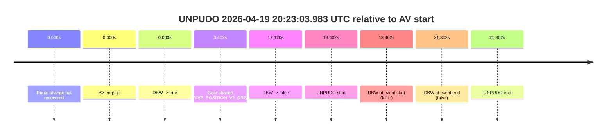
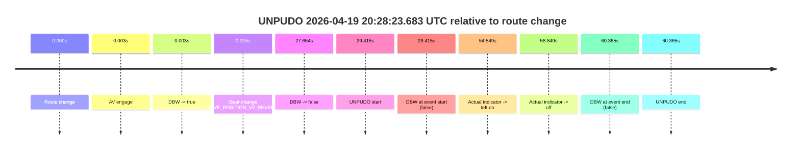
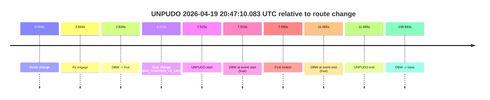
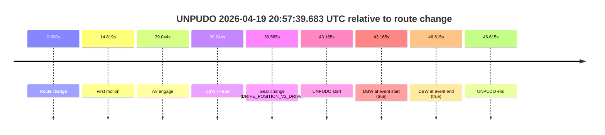

# Run Report: fme20009/2026-04-19--20-01-00--gen2-av-aeee07a9-d252-46e4-b6ef-3c843203ccb1

| Field | Value |
|---|---|
| Run ID | `fme20009/2026-04-19--20-01-00--gen2-av-aeee07a9-d252-46e4-b6ef-3c843203ccb1` |
| Date | `2026-04-19` |
| Model(s) | `pink-manta-ray-smooth` |
| Author | `guy.geva` |
| Event count | `5` |

## unpudo 2026-04-19 20:23:03.983 UTC

| Field | Value |
|---|---|
| Model | `pink-manta-ray-smooth` |
| Author | `guy.geva` |
| Run ID | `fme20009/2026-04-19--20-01-00--gen2-av-aeee07a9-d252-46e4-b6ef-3c843203ccb1` |
| Date | `2026-04-19` |
| Time (UTC) | `20:23:03.983` |
| Event type | `unpudo` |
| Disengagement type | `none observed` |
| Route change | `not found` |
| Console | [run](https://console.sso.wayve.ai/run/fme20009/2026-04-19--20-01-00--gen2-av-aeee07a9-d252-46e4-b6ef-3c843203ccb1?id=&time-unixus=1776630183983309) |
| Foxglove | [segment](https://app.foxglove.dev/wayve-on-prem/p/prj_0dX18KZdVHg1fmmI/view?ds=foxglove-stream&ds.deviceName=fme20009&ds.start=2026-04-19T20%3A22%3A40.581773Z&ds.end=2026-04-19T20%3A23%3A21.883312Z&layoutId=lay_0e7VD4WIKDQGU73Y&time=2026-04-19T20%3A23%3A03.983309Z) |

### Event card: fail

- Fail: the credited unpudo does not stay AV-owned. The event window starts with DBW false, and the maneuver outcome lands outside a clean AV-owned segment.

| Event | Time (UTC) | Delta from AV start |
|---|---:|---:|
| Route change not recovered | 2026-04-19 20:22:50.581 | `0.000s` |
| AV engage | 2026-04-19 20:22:50.581 | `0.000s` |
| DBW -> true | 2026-04-19 20:22:50.581 | `0.000s` |
| Gear change (DRIVE_POSITION_V2_DRIVE) | 2026-04-19 20:22:50.983 | `0.402s` |
| DBW -> false | 2026-04-19 20:23:02.702 | `12.120s` |
| UNPUDO start | 2026-04-19 20:23:03.983 | `13.402s` |
| DBW at event start (false) | 2026-04-19 20:23:03.983 | `13.402s` |
| DBW at event end (false) | 2026-04-19 20:23:11.883 | `21.302s` |
| UNPUDO end | 2026-04-19 20:23:11.883 | `21.302s` |

| Metric | Value |
|---|---|
| Outcome | `fail` |
| Effective failure type | `not_av_owned` |
| Route change status | `not found` |
| DBW at event start | `false` |
| DBW at event end | `false` |
| Predicted gear at AV start | `DRIVE_POSITION_V2_REVERSE` |
| Actual gear at AV start | `DRIVE_POSITION_V2_PARK` |
| Predicted gear at event start | `DRIVE_POSITION_V2_DRIVE` |
| Actual gear at event start | `DRIVE_POSITION_V2_DRIVE` |
| Planned indicator direction | `INDICATORS_STATE_V2_RIGHT_ON` |
| Controller indicator direction | `INDICATORS_STATE_V2_RIGHT_ON` |
| Actual indicator direction | `INDICATORS_STATE_V2_OFF` |
| Actual indicator at maneuver end | `INDICATORS_STATE_V2_OFF` |
| Driver accel help in AV | `false` |
| Driver accel help timestamp | `n/a` |
| Max accel pedal pct in AV | `0.0%` |
| Max brake pedal pct in AV | `8.1%` |
| Max speed mps in AV | `0.000` |
| Success timing baseline | `AV start` |
| Route -> AV | `n/a` |
| AV -> event start | `13.402s` |
| AV -> first motion | `n/a` |
| Success baseline -> event start | `13.402s` |
| Success baseline -> first motion | `n/a` |
| AV duration before disengagement | `12.120s` |
| Trajectory waypoint count | `37` |
| Driving-plan step count | `11` |

The scored portion starts from the AV-owned window, not from the pre-AV setup. Route-change search in the stopped pre-event segment was `not found`, with the baseline therefore set to AV start. At the event anchor the model predicts `DRIVE_POSITION_V2_DRIVE` and the actual gear is `DRIVE_POSITION_V2_DRIVE`. The effective model outcome is `fail` because `not_av_owned.`

### Resolution

| Field | Value |
|---|---|
| Final outcome | `fail` |
| Do we agree with this label? | `yes` |
| Source disengagement type | `none observed` |
| Resolved effective failure type | `not_av_owned` |
| Confidence | `high` |

## unpudo 2026-04-19 20:28:23.683 UTC

| Field | Value |
|---|---|
| Model | `pink-manta-ray-smooth` |
| Author | `guy.geva` |
| Run ID | `fme20009/2026-04-19--20-01-00--gen2-av-aeee07a9-d252-46e4-b6ef-3c843203ccb1` |
| Date | `2026-04-19` |
| Time (UTC) | `20:28:23.683` |
| Event type | `unpudo` |
| Disengagement type | `none observed` |
| Route change | `found` |
| Console | [run](https://console.sso.wayve.ai/run/fme20009/2026-04-19--20-01-00--gen2-av-aeee07a9-d252-46e4-b6ef-3c843203ccb1?id=&time-unixus=1776630503683318) |
| Foxglove | [segment](https://app.foxglove.dev/wayve-on-prem/p/prj_0dX18KZdVHg1fmmI/view?ds=foxglove-stream&ds.deviceName=fme20009&ds.start=2026-04-19T20%3A27%3A44.268279Z&ds.end=2026-04-19T20%3A29%3A04.633308Z&layoutId=lay_0e7VD4WIKDQGU73Y&time=2026-04-19T20%3A28%3A23.683318Z) |

### Event card: fail

- Fail: the credited unpudo does not stay AV-owned. The event window starts with DBW false, and the maneuver outcome lands outside a clean AV-owned segment.

| Event | Time (UTC) | Delta from route change |
|---|---:|---:|
| Route change | 2026-04-19 20:27:54.268 | `0.000s` |
| AV engage | 2026-04-19 20:27:54.271 | `0.003s` |
| DBW -> true | 2026-04-19 20:27:54.271 | `0.003s` |
| Gear change (DRIVE_POSITION_V2_REVERSE) | 2026-04-19 20:27:54.583 | `0.315s` |
| DBW -> false | 2026-04-19 20:28:21.922 | `27.654s` |
| UNPUDO start | 2026-04-19 20:28:23.683 | `29.415s` |
| DBW at event start (false) | 2026-04-19 20:28:23.683 | `29.415s` |
| Actual indicator -> left on | 2026-04-19 20:28:48.817 | `54.549s` |
| Actual indicator -> off | 2026-04-19 20:28:53.117 | `58.849s` |
| DBW at event end (false) | 2026-04-19 20:28:54.633 | `60.365s` |
| UNPUDO end | 2026-04-19 20:28:54.633 | `60.365s` |

| Metric | Value |
|---|---|
| Outcome | `fail` |
| Effective failure type | `not_av_owned` |
| Route change status | `found` |
| DBW at event start | `false` |
| DBW at event end | `false` |
| Predicted gear at AV start | `DRIVE_POSITION_V2_PARK` |
| Actual gear at AV start | `DRIVE_POSITION_V2_PARK` |
| Predicted gear at event start | `DRIVE_POSITION_V2_REVERSE` |
| Actual gear at event start | `DRIVE_POSITION_V2_REVERSE` |
| Planned indicator direction | `INDICATORS_STATE_V2_OFF` |
| Controller indicator direction | `INDICATORS_STATE_V2_OFF` |
| Actual indicator direction | `INDICATORS_STATE_V2_OFF` |
| Actual indicator at maneuver end | `INDICATORS_STATE_V2_OFF` |
| Driver accel help in AV | `false` |
| Driver accel help timestamp | `n/a` |
| Max accel pedal pct in AV | `0.0%` |
| Max brake pedal pct in AV | `8.0%` |
| Max speed mps in AV | `0.000` |
| Success timing baseline | `route change` |
| Route -> AV | `0.003s` |
| AV -> event start | `29.412s` |
| AV -> first motion | `n/a` |
| Success baseline -> event start | `29.415s` |
| Success baseline -> first motion | `n/a` |
| AV duration before disengagement | `27.651s` |
| Trajectory waypoint count | `37` |
| Driving-plan step count | `11` |

The scored portion starts from the AV-owned window, not from the pre-AV setup. Route-change search in the stopped pre-event segment was `found`, with the baseline therefore set to route change. At the event anchor the model predicts `DRIVE_POSITION_V2_REVERSE` and the actual gear is `DRIVE_POSITION_V2_REVERSE`. The effective model outcome is `fail` because `not_av_owned.`

### Resolution

| Field | Value |
|---|---|
| Final outcome | `fail` |
| Do we agree with this label? | `yes` |
| Source disengagement type | `none observed` |
| Resolved effective failure type | `not_av_owned` |
| Confidence | `high` |

## unpudo 2026-04-19 20:47:10.083 UTC

| Field | Value |
|---|---|
| Model | `pink-manta-ray-smooth` |
| Author | `guy.geva` |
| Run ID | `fme20009/2026-04-19--20-01-00--gen2-av-aeee07a9-d252-46e4-b6ef-3c843203ccb1` |
| Date | `2026-04-19` |
| Time (UTC) | `20:47:10.083` |
| Event type | `unpudo` |
| Disengagement type | `none observed` |
| Route change | `found` |
| Console | [run](https://console.sso.wayve.ai/run/fme20009/2026-04-19--20-01-00--gen2-av-aeee07a9-d252-46e4-b6ef-3c843203ccb1?id=&time-unixus=1776631630083312) |
| Foxglove | [segment](https://app.foxglove.dev/wayve-on-prem/p/prj_0dX18KZdVHg1fmmI/view?ds=foxglove-stream&ds.deviceName=fme20009&ds.start=2026-04-19T20%3A46%3A52.568308Z&ds.end=2026-04-19T20%3A49%3A32.501619Z&layoutId=lay_0e7VD4WIKDQGU73Y&time=2026-04-19T20%3A47%3A10.083312Z) |

### Event card: pass

- Pass: AV owns the credited unpudo from route change through the official unpudo window, the gear state is aligned at the anchor, and the vehicle moves without driver accelerator help in AV.

| Event | Time (UTC) | Delta from route change |
|---|---:|---:|
| Route change | 2026-04-19 20:47:02.568 | `0.000s` |
| AV engage | 2026-04-19 20:47:05.401 | `2.834s` |
| DBW -> true | 2026-04-19 20:47:05.401 | `2.834s` |
| Gear change (DRIVE_POSITION_V2_DRIVE) | 2026-04-19 20:47:05.783 | `3.215s` |
| UNPUDO start | 2026-04-19 20:47:10.083 | `7.515s` |
| DBW at event start (true) | 2026-04-19 20:47:10.083 | `7.515s` |
| First motion | 2026-04-19 20:47:10.157 | `7.590s` |
| DBW at event end (true) | 2026-04-19 20:47:13.633 | `11.065s` |
| UNPUDO end | 2026-04-19 20:47:13.633 | `11.065s` |
| DBW -> false | 2026-04-19 20:49:22.501 | `139.933s` |

| Metric | Value |
|---|---|
| Outcome | `pass` |
| Effective failure type | `none` |
| Route change status | `found` |
| DBW at event start | `true` |
| DBW at event end | `true` |
| Predicted gear at AV start | `DRIVE_POSITION_V2_DRIVE` |
| Actual gear at AV start | `DRIVE_POSITION_V2_PARK` |
| Predicted gear at event start | `DRIVE_POSITION_V2_DRIVE` |
| Actual gear at event start | `DRIVE_POSITION_V2_DRIVE` |
| Planned indicator direction | `INDICATORS_STATE_V2_RIGHT_ON` |
| Controller indicator direction | `INDICATORS_STATE_V2_RIGHT_ON` |
| Actual indicator direction | `INDICATORS_STATE_V2_OFF` |
| Actual indicator at maneuver end | `INDICATORS_STATE_V2_OFF` |
| Driver accel help in AV | `false` |
| Driver accel help timestamp | `n/a` |
| Max accel pedal pct in AV | `0.0%` |
| Max brake pedal pct in AV | `8.0%` |
| Max speed mps in AV | `5.014` |
| Success timing baseline | `route change` |
| Route -> AV | `2.834s` |
| AV -> event start | `4.681s` |
| AV -> first motion | `4.756s` |
| Success baseline -> event start | `7.515s` |
| Success baseline -> first motion | `7.590s` |
| AV duration before disengagement | `137.100s` |
| Trajectory waypoint count | `37` |
| Driving-plan step count | `11` |

The scored portion starts from the AV-owned window, not from the pre-AV setup. Route-change search in the stopped pre-event segment was `found`, with the baseline therefore set to route change. At the event anchor the model predicts `DRIVE_POSITION_V2_DRIVE` and the actual gear is `DRIVE_POSITION_V2_DRIVE`. The effective model outcome is `pass` because `the credited unpudo stays AV-owned through the official unpudo window.`

### Resolution

| Field | Value |
|---|---|
| Final outcome | `pass` |
| Do we agree with this label? | `yes` |
| Source disengagement type | `none observed` |
| Resolved effective failure type | `none` |
| Confidence | `high` |

## unpudo 2026-04-19 20:57:11.233 UTC

| Field | Value |
|---|---|
| Model | `pink-manta-ray-smooth` |
| Author | `guy.geva` |
| Run ID | `fme20009/2026-04-19--20-01-00--gen2-av-aeee07a9-d252-46e4-b6ef-3c843203ccb1` |
| Date | `2026-04-19` |
| Time (UTC) | `20:57:11.233` |
| Event type | `unpudo` |
| Disengagement type | `none observed` |
| Route change | `found` |
| Console | [run](https://console.sso.wayve.ai/run/fme20009/2026-04-19--20-01-00--gen2-av-aeee07a9-d252-46e4-b6ef-3c843203ccb1?id=&time-unixus=1776632231233310) |
| Foxglove | [segment](https://app.foxglove.dev/wayve-on-prem/p/prj_0dX18KZdVHg1fmmI/view?ds=foxglove-stream&ds.deviceName=fme20009&ds.start=2026-04-19T20%3A56%3A46.518276Z&ds.end=2026-04-19T20%3A57%3A36.461633Z&layoutId=lay_0e7VD4WIKDQGU73Y&time=2026-04-19T20%3A57%3A11.233310Z) |

### Event card: pass

- Pass: AV owns the credited unpudo from route change through the official unpudo window, the gear state is aligned at the anchor, and the vehicle moves without driver accelerator help in AV.

| Event | Time (UTC) | Delta from route change |
|---|---:|---:|
| Route change | 2026-04-19 20:56:56.518 | `0.000s` |
| AV engage | 2026-04-19 20:56:56.521 | `0.004s` |
| DBW -> true | 2026-04-19 20:56:56.521 | `0.004s` |
| Gear change (DRIVE_POSITION_V2_DRIVE) | 2026-04-19 20:56:56.883 | `0.365s` |
| UNPUDO start | 2026-04-19 20:57:11.233 | `14.715s` |
| DBW at event start (true) | 2026-04-19 20:57:11.233 | `14.715s` |
| First motion | 2026-04-19 20:57:11.337 | `14.819s` |
| DBW at event end (true) | 2026-04-19 20:57:14.633 | `18.115s` |
| UNPUDO end | 2026-04-19 20:57:14.633 | `18.115s` |
| DBW -> false | 2026-04-19 20:57:26.461 | `29.943s` |

| Metric | Value |
|---|---|
| Outcome | `pass` |
| Effective failure type | `none` |
| Route change status | `found` |
| DBW at event start | `true` |
| DBW at event end | `true` |
| Predicted gear at AV start | `DRIVE_POSITION_V2_PARK` |
| Actual gear at AV start | `DRIVE_POSITION_V2_PARK` |
| Predicted gear at event start | `DRIVE_POSITION_V2_DRIVE` |
| Actual gear at event start | `DRIVE_POSITION_V2_DRIVE` |
| Planned indicator direction | `INDICATORS_STATE_V2_RIGHT_ON` |
| Controller indicator direction | `INDICATORS_STATE_V2_RIGHT_ON` |
| Actual indicator direction | `INDICATORS_STATE_V2_OFF` |
| Actual indicator at maneuver end | `INDICATORS_STATE_V2_OFF` |
| Driver accel help in AV | `false` |
| Driver accel help timestamp | `n/a` |
| Max accel pedal pct in AV | `0.0%` |
| Max brake pedal pct in AV | `8.0%` |
| Max speed mps in AV | `5.331` |
| Success timing baseline | `route change` |
| Route -> AV | `0.004s` |
| AV -> event start | `14.711s` |
| AV -> first motion | `14.816s` |
| Success baseline -> event start | `14.715s` |
| Success baseline -> first motion | `14.819s` |
| AV duration before disengagement | `29.940s` |
| Trajectory waypoint count | `36` |
| Driving-plan step count | `11` |

The scored portion starts from the AV-owned window, not from the pre-AV setup. Route-change search in the stopped pre-event segment was `found`, with the baseline therefore set to route change. At the event anchor the model predicts `DRIVE_POSITION_V2_DRIVE` and the actual gear is `DRIVE_POSITION_V2_DRIVE`. The effective model outcome is `pass` because `the credited unpudo stays AV-owned through the official unpudo window.`

### Resolution

| Field | Value |
|---|---|
| Final outcome | `pass` |
| Do we agree with this label? | `yes` |
| Source disengagement type | `none observed` |
| Resolved effective failure type | `none` |
| Confidence | `high` |

## unpudo 2026-04-19 20:57:39.683 UTC

| Field | Value |
|---|---|
| Model | `pink-manta-ray-smooth` |
| Author | `guy.geva` |
| Run ID | `fme20009/2026-04-19--20-01-00--gen2-av-aeee07a9-d252-46e4-b6ef-3c843203ccb1` |
| Date | `2026-04-19` |
| Time (UTC) | `20:57:39.683` |
| Event type | `unpudo` |
| Disengagement type | `none observed` |
| Route change | `found` |
| Console | [run](https://console.sso.wayve.ai/run/fme20009/2026-04-19--20-01-00--gen2-av-aeee07a9-d252-46e4-b6ef-3c843203ccb1?id=&time-unixus=1776632259683307) |
| Foxglove | [segment](https://app.foxglove.dev/wayve-on-prem/p/prj_0dX18KZdVHg1fmmI/view?ds=foxglove-stream&ds.deviceName=fme20009&ds.start=2026-04-19T20%3A56%3A46.518276Z&ds.end=2026-04-19T20%3A57%3A53.133291Z&layoutId=lay_0e7VD4WIKDQGU73Y&time=2026-04-19T20%3A57%3A39.683307Z) |

### Event card: pass

- Pass: AV owns the credited unpudo from route change through the official unpudo window, the gear state is aligned at the anchor, and the vehicle moves without driver accelerator help in AV.

| Event | Time (UTC) | Delta from route change |
|---|---:|---:|
| Route change | 2026-04-19 20:56:56.518 | `0.000s` |
| First motion | 2026-04-19 20:57:11.337 | `14.819s` |
| AV engage | 2026-04-19 20:57:35.561 | `39.044s` |
| DBW -> true | 2026-04-19 20:57:35.561 | `39.044s` |
| Gear change (DRIVE_POSITION_V2_DRIVE) | 2026-04-19 20:57:36.083 | `39.565s` |
| UNPUDO start | 2026-04-19 20:57:39.683 | `43.165s` |
| DBW at event start (true) | 2026-04-19 20:57:39.683 | `43.165s` |
| DBW at event end (true) | 2026-04-19 20:57:43.133 | `46.615s` |
| UNPUDO end | 2026-04-19 20:57:43.133 | `46.615s` |

| Metric | Value |
|---|---|
| Outcome | `pass` |
| Effective failure type | `none` |
| Route change status | `found` |
| DBW at event start | `true` |
| DBW at event end | `true` |
| Predicted gear at AV start | `DRIVE_POSITION_V2_DRIVE` |
| Actual gear at AV start | `DRIVE_POSITION_V2_PARK` |
| Predicted gear at event start | `DRIVE_POSITION_V2_DRIVE` |
| Actual gear at event start | `DRIVE_POSITION_V2_DRIVE` |
| Planned indicator direction | `INDICATORS_STATE_V2_RIGHT_ON` |
| Controller indicator direction | `INDICATORS_STATE_V2_RIGHT_ON` |
| Actual indicator direction | `INDICATORS_STATE_V2_OFF` |
| Actual indicator at maneuver end | `INDICATORS_STATE_V2_OFF` |
| Driver accel help in AV | `false` |
| Driver accel help timestamp | `n/a` |
| Max accel pedal pct in AV | `0.0%` |
| Max brake pedal pct in AV | `8.0%` |
| Max speed mps in AV | `5.056` |
| Success timing baseline | `route change` |
| Route -> AV | `39.044s` |
| AV -> event start | `4.121s` |
| AV -> first motion | `-24.224s` |
| Success baseline -> event start | `43.165s` |
| Success baseline -> first motion | `14.819s` |
| AV duration before disengagement | `n/a` |
| Trajectory waypoint count | `37` |
| Driving-plan step count | `11` |

The scored portion starts from the AV-owned window, not from the pre-AV setup. Route-change search in the stopped pre-event segment was `found`, with the baseline therefore set to route change. At the event anchor the model predicts `DRIVE_POSITION_V2_DRIVE` and the actual gear is `DRIVE_POSITION_V2_DRIVE`. The effective model outcome is `pass` because `the credited unpudo stays AV-owned through the official unpudo window.`

### Resolution

| Field | Value |
|---|---|
| Final outcome | `pass` |
| Do we agree with this label? | `yes` |
| Source disengagement type | `none observed` |
| Resolved effective failure type | `none` |
| Confidence | `high` |
