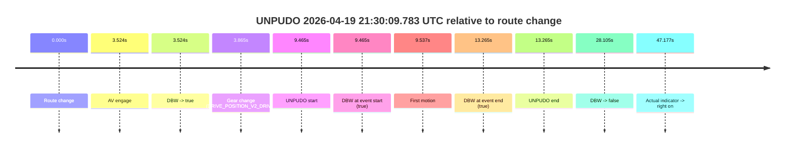
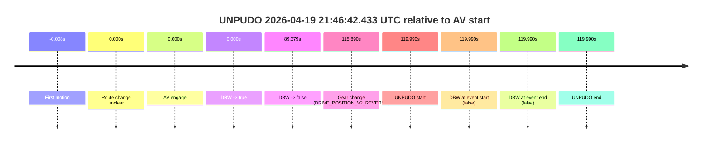
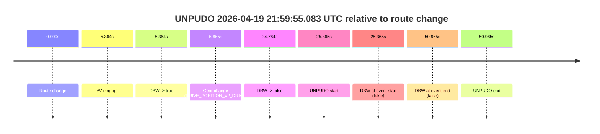

# Run Report: fme20009/2026-04-19--21-23-49--gen2-av-e1bfd0f2-6d37-47d4-a183-3c8e5263f359

| Field | Value |
|---|---|
| Run ID | `fme20009/2026-04-19--21-23-49--gen2-av-e1bfd0f2-6d37-47d4-a183-3c8e5263f359` |
| Date | `2026-04-19` |
| Model(s) | `pink-manta-ray-smooth` |
| Author | `guy.geva` |
| Event count | `4` |

## unpudo 2026-04-19 21:30:09.783 UTC

| Field | Value |
|---|---|
| Model | `pink-manta-ray-smooth` |
| Author | `guy.geva` |
| Run ID | `fme20009/2026-04-19--21-23-49--gen2-av-e1bfd0f2-6d37-47d4-a183-3c8e5263f359` |
| Date | `2026-04-19` |
| Time (UTC) | `21:30:09.783` |
| Event type | `unpudo` |
| Disengagement type | `none observed` |
| Route change | `found` |
| Console | [run](https://console.sso.wayve.ai/run/fme20009/2026-04-19--21-23-49--gen2-av-e1bfd0f2-6d37-47d4-a183-3c8e5263f359?id=&time-unixus=1776634209783301) |
| Foxglove | [segment](https://app.foxglove.dev/wayve-on-prem/p/prj_0dX18KZdVHg1fmmI/view?ds=foxglove-stream&ds.deviceName=fme20009&ds.start=2026-04-19T21%3A29%3A50.318269Z&ds.end=2026-04-19T21%3A30%3A38.423253Z&layoutId=lay_0e7VD4WIKDQGU73Y&time=2026-04-19T21%3A30%3A09.783301Z) |

### Event card: pass

- Pass: AV owns the credited unpudo from route change through the official unpudo window, the gear state is aligned at the anchor, and the vehicle moves without driver accelerator help in AV.

| Event | Time (UTC) | Delta from route change |
|---|---:|---:|
| Route change | 2026-04-19 21:30:00.318 | `0.000s` |
| AV engage | 2026-04-19 21:30:03.842 | `3.524s` |
| DBW -> true | 2026-04-19 21:30:03.842 | `3.524s` |
| Gear change (DRIVE_POSITION_V2_DRIVE) | 2026-04-19 21:30:04.183 | `3.865s` |
| UNPUDO start | 2026-04-19 21:30:09.783 | `9.465s` |
| DBW at event start (true) | 2026-04-19 21:30:09.783 | `9.465s` |
| First motion | 2026-04-19 21:30:09.854 | `9.537s` |
| DBW at event end (true) | 2026-04-19 21:30:13.583 | `13.265s` |
| UNPUDO end | 2026-04-19 21:30:13.583 | `13.265s` |
| DBW -> false | 2026-04-19 21:30:28.423 | `28.105s` |
| Actual indicator -> right on | 2026-04-19 21:30:47.495 | `47.177s` |

| Metric | Value |
|---|---|
| Outcome | `pass` |
| Effective failure type | `none` |
| Route change status | `found` |
| DBW at event start | `true` |
| DBW at event end | `true` |
| Predicted gear at AV start | `DRIVE_POSITION_V2_REVERSE` |
| Actual gear at AV start | `DRIVE_POSITION_V2_PARK` |
| Predicted gear at event start | `DRIVE_POSITION_V2_DRIVE` |
| Actual gear at event start | `DRIVE_POSITION_V2_DRIVE` |
| Planned indicator direction | `INDICATORS_STATE_V2_RIGHT_ON` |
| Controller indicator direction | `INDICATORS_STATE_V2_RIGHT_ON` |
| Actual indicator direction | `INDICATORS_STATE_V2_OFF` |
| Actual indicator at maneuver end | `INDICATORS_STATE_V2_OFF` |
| Driver accel help in AV | `false` |
| Driver accel help timestamp | `n/a` |
| Max accel pedal pct in AV | `0.0%` |
| Max brake pedal pct in AV | `8.3%` |
| Max speed mps in AV | `4.311` |
| Success timing baseline | `route change` |
| Route -> AV | `3.524s` |
| AV -> event start | `5.941s` |
| AV -> first motion | `6.013s` |
| Success baseline -> event start | `9.465s` |
| Success baseline -> first motion | `9.537s` |
| AV duration before disengagement | `24.581s` |
| Trajectory waypoint count | `37` |
| Driving-plan step count | `11` |

The scored portion starts from the AV-owned window, not from the pre-AV setup. Route-change search in the stopped pre-event segment was `found`, with the baseline therefore set to route change. At the event anchor the model predicts `DRIVE_POSITION_V2_DRIVE` and the actual gear is `DRIVE_POSITION_V2_DRIVE`. The effective model outcome is `pass` because `the credited unpudo stays AV-owned through the official unpudo window.`

### Resolution

| Field | Value |
|---|---|
| Final outcome | `pass` |
| Do we agree with this label? | `yes` |
| Source disengagement type | `none observed` |
| Resolved effective failure type | `none` |
| Confidence | `high` |

## unpudo 2026-04-19 21:46:15.133 UTC

| Field | Value |
|---|---|
| Model | `pink-manta-ray-smooth` |
| Author | `guy.geva` |
| Run ID | `fme20009/2026-04-19--21-23-49--gen2-av-e1bfd0f2-6d37-47d4-a183-3c8e5263f359` |
| Date | `2026-04-19` |
| Time (UTC) | `21:46:15.133` |
| Event type | `unpudo` |
| Disengagement type | `none observed` |
| Route change | `unclear` |
| Console | [run](https://console.sso.wayve.ai/run/fme20009/2026-04-19--21-23-49--gen2-av-e1bfd0f2-6d37-47d4-a183-3c8e5263f359?id=&time-unixus=1776635175133316) |
| Foxglove | [segment](https://app.foxglove.dev/wayve-on-prem/p/prj_0dX18KZdVHg1fmmI/view?ds=foxglove-stream&ds.deviceName=fme20009&ds.start=2026-04-19T21%3A44%3A05.141995Z&ds.end=2026-04-19T21%3A46%3A25.133316Z&layoutId=lay_0e7VD4WIKDQGU73Y&time=2026-04-19T21%3A46%3A15.133316Z) |

### Event card: fail

- Fail: the credited unpudo does not stay AV-owned. The event window starts with DBW false, and the maneuver outcome lands outside a clean AV-owned segment.

| Event | Time (UTC) | Delta from AV start |
|---|---:|---:|
| First motion | 2026-04-19 21:44:15.134 | `-0.007s` |
| Route change unclear | 2026-04-19 21:44:15.141 | `0.000s` |
| AV engage | 2026-04-19 21:44:15.141 | `0.000s` |
| DBW -> true | 2026-04-19 21:44:15.141 | `0.000s` |
| DBW -> false | 2026-04-19 21:46:11.822 | `116.680s` |
| Gear change (DRIVE_POSITION_V2_DRIVE) | 2026-04-19 21:46:13.183 | `118.041s` |
| UNPUDO start | 2026-04-19 21:46:15.133 | `119.991s` |
| DBW at event start (false) | 2026-04-19 21:46:15.133 | `119.991s` |
| DBW at event end (false) | 2026-04-19 21:46:15.133 | `119.991s` |
| UNPUDO end | 2026-04-19 21:46:15.133 | `119.991s` |

| Metric | Value |
|---|---|
| Outcome | `fail` |
| Effective failure type | `completed_outside_av` |
| Route change status | `unclear` |
| DBW at event start | `false` |
| DBW at event end | `false` |
| Predicted gear at AV start | `DRIVE_POSITION_V2_DRIVE` |
| Actual gear at AV start | `DRIVE_POSITION_V2_DRIVE` |
| Predicted gear at event start | `DRIVE_POSITION_V2_DRIVE` |
| Actual gear at event start | `DRIVE_POSITION_V2_DRIVE` |
| Planned indicator direction | `INDICATORS_STATE_V2_OFF` |
| Controller indicator direction | `INDICATORS_STATE_V2_OFF` |
| Actual indicator direction | `INDICATORS_STATE_V2_OFF` |
| Actual indicator at maneuver end | `INDICATORS_STATE_V2_OFF` |
| Driver accel help in AV | `false` |
| Driver accel help timestamp | `n/a` |
| Max accel pedal pct in AV | `0.0%` |
| Max brake pedal pct in AV | `8.8%` |
| Max speed mps in AV | `8.394` |
| Success timing baseline | `AV start` |
| Route -> AV | `n/a` |
| AV -> event start | `119.991s` |
| AV -> first motion | `-0.007s` |
| Success baseline -> event start | `119.991s` |
| Success baseline -> first motion | `-0.007s` |
| AV duration before disengagement | `116.680s` |
| Trajectory waypoint count | `36` |
| Driving-plan step count | `11` |

The scored portion starts from the AV-owned window, not from the pre-AV setup. Route-change search in the stopped pre-event segment was `unclear`, with the baseline therefore set to AV start. At the event anchor the model predicts `DRIVE_POSITION_V2_DRIVE` and the actual gear is `DRIVE_POSITION_V2_DRIVE`. The effective model outcome is `fail` because `completed_outside_av.`

### Resolution

| Field | Value |
|---|---|
| Final outcome | `fail` |
| Do we agree with this label? | `yes` |
| Source disengagement type | `none observed` |
| Resolved effective failure type | `completed_outside_av` |
| Confidence | `medium` |

## unpudo 2026-04-19 21:46:42.433 UTC

| Field | Value |
|---|---|
| Model | `pink-manta-ray-smooth` |
| Author | `guy.geva` |
| Run ID | `fme20009/2026-04-19--21-23-49--gen2-av-e1bfd0f2-6d37-47d4-a183-3c8e5263f359` |
| Date | `2026-04-19` |
| Time (UTC) | `21:46:42.433` |
| Event type | `unpudo` |
| Disengagement type | `none observed` |
| Route change | `unclear` |
| Console | [run](https://console.sso.wayve.ai/run/fme20009/2026-04-19--21-23-49--gen2-av-e1bfd0f2-6d37-47d4-a183-3c8e5263f359?id=&time-unixus=1776635202433305) |
| Foxglove | [segment](https://app.foxglove.dev/wayve-on-prem/p/prj_0dX18KZdVHg1fmmI/view?ds=foxglove-stream&ds.deviceName=fme20009&ds.start=2026-04-19T21%3A44%3A32.443275Z&ds.end=2026-04-19T21%3A46%3A52.433305Z&layoutId=lay_0e7VD4WIKDQGU73Y&time=2026-04-19T21%3A46%3A42.433305Z) |

### Event card: fail

- Fail: the credited unpudo does not stay AV-owned. The event window starts with DBW false, and the maneuver outcome lands outside a clean AV-owned segment.

| Event | Time (UTC) | Delta from AV start |
|---|---:|---:|
| First motion | 2026-04-19 21:44:42.435 | `-0.008s` |
| Route change unclear | 2026-04-19 21:44:42.443 | `0.000s` |
| AV engage | 2026-04-19 21:44:42.443 | `0.000s` |
| DBW -> true | 2026-04-19 21:44:42.443 | `0.000s` |
| DBW -> false | 2026-04-19 21:46:11.822 | `89.379s` |
| Gear change (DRIVE_POSITION_V2_REVERSE) | 2026-04-19 21:46:38.333 | `115.890s` |
| UNPUDO start | 2026-04-19 21:46:42.433 | `119.990s` |
| DBW at event start (false) | 2026-04-19 21:46:42.433 | `119.990s` |
| DBW at event end (false) | 2026-04-19 21:46:42.433 | `119.990s` |
| UNPUDO end | 2026-04-19 21:46:42.433 | `119.990s` |

| Metric | Value |
|---|---|
| Outcome | `fail` |
| Effective failure type | `completed_outside_av` |
| Route change status | `unclear` |
| DBW at event start | `false` |
| DBW at event end | `false` |
| Predicted gear at AV start | `DRIVE_POSITION_V2_DRIVE` |
| Actual gear at AV start | `DRIVE_POSITION_V2_DRIVE` |
| Predicted gear at event start | `DRIVE_POSITION_V2_REVERSE` |
| Actual gear at event start | `DRIVE_POSITION_V2_REVERSE` |
| Planned indicator direction | `INDICATORS_STATE_V2_OFF` |
| Controller indicator direction | `INDICATORS_STATE_V2_OFF` |
| Actual indicator direction | `INDICATORS_STATE_V2_OFF` |
| Actual indicator at maneuver end | `INDICATORS_STATE_V2_OFF` |
| Driver accel help in AV | `false` |
| Driver accel help timestamp | `n/a` |
| Max accel pedal pct in AV | `0.0%` |
| Max brake pedal pct in AV | `8.8%` |
| Max speed mps in AV | `8.264` |
| Success timing baseline | `AV start` |
| Route -> AV | `n/a` |
| AV -> event start | `119.990s` |
| AV -> first motion | `-0.008s` |
| Success baseline -> event start | `119.990s` |
| Success baseline -> first motion | `-0.008s` |
| AV duration before disengagement | `89.379s` |
| Trajectory waypoint count | `36` |
| Driving-plan step count | `11` |

The scored portion starts from the AV-owned window, not from the pre-AV setup. Route-change search in the stopped pre-event segment was `unclear`, with the baseline therefore set to AV start. At the event anchor the model predicts `DRIVE_POSITION_V2_REVERSE` and the actual gear is `DRIVE_POSITION_V2_REVERSE`. The effective model outcome is `fail` because `completed_outside_av.`

### Resolution

| Field | Value |
|---|---|
| Final outcome | `fail` |
| Do we agree with this label? | `yes` |
| Source disengagement type | `none observed` |
| Resolved effective failure type | `completed_outside_av` |
| Confidence | `medium` |

## unpudo 2026-04-19 21:59:55.083 UTC

| Field | Value |
|---|---|
| Model | `pink-manta-ray-smooth` |
| Author | `guy.geva` |
| Run ID | `fme20009/2026-04-19--21-23-49--gen2-av-e1bfd0f2-6d37-47d4-a183-3c8e5263f359` |
| Date | `2026-04-19` |
| Time (UTC) | `21:59:55.083` |
| Event type | `unpudo` |
| Disengagement type | `none observed` |
| Route change | `found` |
| Console | [run](https://console.sso.wayve.ai/run/fme20009/2026-04-19--21-23-49--gen2-av-e1bfd0f2-6d37-47d4-a183-3c8e5263f359?id=&time-unixus=1776635995083296) |
| Foxglove | [segment](https://app.foxglove.dev/wayve-on-prem/p/prj_0dX18KZdVHg1fmmI/view?ds=foxglove-stream&ds.deviceName=fme20009&ds.start=2026-04-19T21%3A59%3A19.718263Z&ds.end=2026-04-19T22%3A00%3A30.683304Z&layoutId=lay_0e7VD4WIKDQGU73Y&time=2026-04-19T21%3A59%3A55.083296Z) |

### Event card: fail

- Fail: the credited unpudo does not stay AV-owned. The event window starts with DBW false, and the maneuver outcome lands outside a clean AV-owned segment.

| Event | Time (UTC) | Delta from route change |
|---|---:|---:|
| Route change | 2026-04-19 21:59:29.718 | `0.000s` |
| AV engage | 2026-04-19 21:59:35.082 | `5.364s` |
| DBW -> true | 2026-04-19 21:59:35.082 | `5.364s` |
| Gear change (DRIVE_POSITION_V2_DRIVE) | 2026-04-19 21:59:35.583 | `5.865s` |
| DBW -> false | 2026-04-19 21:59:54.482 | `24.764s` |
| UNPUDO start | 2026-04-19 21:59:55.083 | `25.365s` |
| DBW at event start (false) | 2026-04-19 21:59:55.083 | `25.365s` |
| DBW at event end (false) | 2026-04-19 22:00:20.683 | `50.965s` |
| UNPUDO end | 2026-04-19 22:00:20.683 | `50.965s` |

| Metric | Value |
|---|---|
| Outcome | `fail` |
| Effective failure type | `not_av_owned` |
| Route change status | `found` |
| DBW at event start | `false` |
| DBW at event end | `false` |
| Predicted gear at AV start | `DRIVE_POSITION_V2_REVERSE` |
| Actual gear at AV start | `DRIVE_POSITION_V2_PARK` |
| Predicted gear at event start | `DRIVE_POSITION_V2_DRIVE` |
| Actual gear at event start | `DRIVE_POSITION_V2_DRIVE` |
| Planned indicator direction | `INDICATORS_STATE_V2_RIGHT_ON` |
| Controller indicator direction | `INDICATORS_STATE_V2_RIGHT_ON` |
| Actual indicator direction | `INDICATORS_STATE_V2_OFF` |
| Actual indicator at maneuver end | `INDICATORS_STATE_V2_OFF` |
| Driver accel help in AV | `false` |
| Driver accel help timestamp | `n/a` |
| Max accel pedal pct in AV | `0.0%` |
| Max brake pedal pct in AV | `10.4%` |
| Max speed mps in AV | `0.000` |
| Success timing baseline | `route change` |
| Route -> AV | `5.364s` |
| AV -> event start | `20.001s` |
| AV -> first motion | `n/a` |
| Success baseline -> event start | `25.365s` |
| Success baseline -> first motion | `n/a` |
| AV duration before disengagement | `19.400s` |
| Trajectory waypoint count | `37` |
| Driving-plan step count | `11` |

The scored portion starts from the AV-owned window, not from the pre-AV setup. Route-change search in the stopped pre-event segment was `found`, with the baseline therefore set to route change. At the event anchor the model predicts `DRIVE_POSITION_V2_DRIVE` and the actual gear is `DRIVE_POSITION_V2_DRIVE`. The effective model outcome is `fail` because `not_av_owned.`

### Resolution

| Field | Value |
|---|---|
| Final outcome | `fail` |
| Do we agree with this label? | `yes` |
| Source disengagement type | `none observed` |
| Resolved effective failure type | `not_av_owned` |
| Confidence | `high` |
