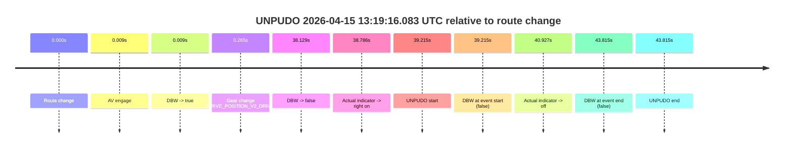
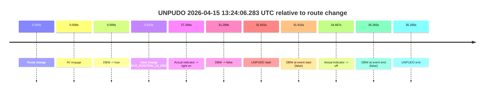
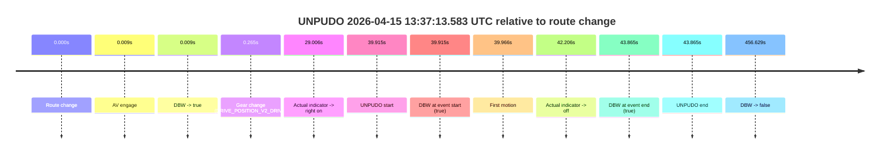
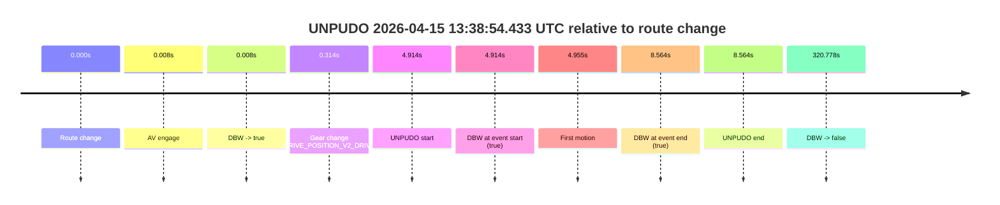

# Run Report: fme20015/2026-04-15--13-08-33--gen2-av-19b98635-b96d-4d53-b7d9-faf6e67ec0c6

| Field | Value |
|---|---|
| Run ID | `fme20015/2026-04-15--13-08-33--gen2-av-19b98635-b96d-4d53-b7d9-faf6e67ec0c6` |
| Date | `2026-04-15` |
| Model(s) | `pink-manta-ray-smooth` |
| Author | `guy.geva` |
| Event count | `4` |

## unpudo 2026-04-15 13:19:16.083 UTC

| Field | Value |
|---|---|
| Model | `pink-manta-ray-smooth` |
| Author | `guy.geva` |
| Run ID | `fme20015/2026-04-15--13-08-33--gen2-av-19b98635-b96d-4d53-b7d9-faf6e67ec0c6` |
| Date | `2026-04-15` |
| Time (UTC) | `13:19:16.083` |
| Event type | `unpudo` |
| Disengagement type | `none observed` |
| Route change | `found` |
| Console | [run](https://console.sso.wayve.ai/run/fme20015/2026-04-15--13-08-33--gen2-av-19b98635-b96d-4d53-b7d9-faf6e67ec0c6?id=&time-unixus=1776259156083294) |
| Foxglove | [segment](https://app.foxglove.dev/wayve-on-prem/p/prj_0dX18KZdVHg1fmmI/view?ds=foxglove-stream&ds.deviceName=fme20015&ds.start=2026-04-15T13%3A18%3A26.868262Z&ds.end=2026-04-15T13%3A19%3A30.683298Z&layoutId=lay_0e7VD4WIKDQGU73Y&time=2026-04-15T13%3A19%3A16.083294Z) |

### Event card: fail

- Fail: the credited unpudo does not stay AV-owned. The event window starts with DBW false, and the maneuver outcome lands outside a clean AV-owned segment.

| Event | Time (UTC) | Delta from route change |
|---|---:|---:|
| Route change | 2026-04-15 13:18:36.868 | `0.000s` |
| AV engage | 2026-04-15 13:18:36.877 | `0.009s` |
| DBW -> true | 2026-04-15 13:18:36.877 | `0.009s` |
| Gear change (DRIVE_POSITION_V2_DRIVE) | 2026-04-15 13:18:37.133 | `0.265s` |
| DBW -> false | 2026-04-15 13:19:14.997 | `38.129s` |
| Actual indicator -> right on | 2026-04-15 13:19:15.654 | `38.786s` |
| UNPUDO start | 2026-04-15 13:19:16.083 | `39.215s` |
| DBW at event start (false) | 2026-04-15 13:19:16.083 | `39.215s` |
| Actual indicator -> off | 2026-04-15 13:19:17.795 | `40.927s` |
| DBW at event end (false) | 2026-04-15 13:19:20.683 | `43.815s` |
| UNPUDO end | 2026-04-15 13:19:20.683 | `43.815s` |

| Metric | Value |
|---|---|
| Outcome | `fail` |
| Effective failure type | `not_av_owned` |
| Route change status | `found` |
| DBW at event start | `false` |
| DBW at event end | `false` |
| Predicted gear at AV start | `DRIVE_POSITION_V2_PARK` |
| Actual gear at AV start | `DRIVE_POSITION_V2_PARK` |
| Predicted gear at event start | `DRIVE_POSITION_V2_DRIVE` |
| Actual gear at event start | `DRIVE_POSITION_V2_DRIVE` |
| Planned indicator direction | `INDICATORS_STATE_V2_RIGHT_ON` |
| Controller indicator direction | `INDICATORS_STATE_V2_RIGHT_ON` |
| Actual indicator direction | `INDICATORS_STATE_V2_RIGHT_ON` |
| Actual indicator at maneuver end | `INDICATORS_STATE_V2_OFF` |
| Driver accel help in AV | `false` |
| Driver accel help timestamp | `n/a` |
| Max accel pedal pct in AV | `0.0%` |
| Max brake pedal pct in AV | `8.0%` |
| Max speed mps in AV | `0.000` |
| Success timing baseline | `route change` |
| Route -> AV | `0.009s` |
| AV -> event start | `39.206s` |
| AV -> first motion | `n/a` |
| Success baseline -> event start | `39.215s` |
| Success baseline -> first motion | `n/a` |
| AV duration before disengagement | `38.120s` |
| Trajectory waypoint count | `36` |
| Driving-plan step count | `11` |

The scored portion starts from the AV-owned window, not from the pre-AV setup. Route-change search in the stopped pre-event segment was `found`, with the baseline therefore set to route change. At the event anchor the model predicts `DRIVE_POSITION_V2_DRIVE` and the actual gear is `DRIVE_POSITION_V2_DRIVE`. The effective model outcome is `fail` because `not_av_owned.`

### Resolution

| Field | Value |
|---|---|
| Final outcome | `fail` |
| Do we agree with this label? | `yes` |
| Source disengagement type | `none observed` |
| Resolved effective failure type | `not_av_owned` |
| Confidence | `high` |

## unpudo 2026-04-15 13:24:06.283 UTC

| Field | Value |
|---|---|
| Model | `pink-manta-ray-smooth` |
| Author | `guy.geva` |
| Run ID | `fme20015/2026-04-15--13-08-33--gen2-av-19b98635-b96d-4d53-b7d9-faf6e67ec0c6` |
| Date | `2026-04-15` |
| Time (UTC) | `13:24:06.283` |
| Event type | `unpudo` |
| Disengagement type | `none observed` |
| Route change | `found` |
| Console | [run](https://console.sso.wayve.ai/run/fme20015/2026-04-15--13-08-33--gen2-av-19b98635-b96d-4d53-b7d9-faf6e67ec0c6?id=&time-unixus=1776259446283318) |
| Foxglove | [segment](https://app.foxglove.dev/wayve-on-prem/p/prj_0dX18KZdVHg1fmmI/view?ds=foxglove-stream&ds.deviceName=fme20015&ds.start=2026-04-15T13%3A23%3A24.368247Z&ds.end=2026-04-15T13%3A24%3A19.633305Z&layoutId=lay_0e7VD4WIKDQGU73Y&time=2026-04-15T13%3A24%3A06.283318Z) |

### Event card: fail

- Fail: the credited unpudo does not stay AV-owned. The event window starts with DBW false, and the maneuver outcome lands outside a clean AV-owned segment.

| Event | Time (UTC) | Delta from route change |
|---|---:|---:|
| Route change | 2026-04-15 13:23:34.368 | `0.000s` |
| AV engage | 2026-04-15 13:23:34.377 | `0.009s` |
| DBW -> true | 2026-04-15 13:23:34.377 | `0.009s` |
| Gear change (DRIVE_POSITION_V2_DRIVE) | 2026-04-15 13:23:35.183 | `0.815s` |
| Actual indicator -> right on | 2026-04-15 13:24:01.634 | `27.266s` |
| DBW -> false | 2026-04-15 13:24:05.657 | `31.289s` |
| UNPUDO start | 2026-04-15 13:24:06.283 | `31.915s` |
| DBW at event start (false) | 2026-04-15 13:24:06.283 | `31.915s` |
| Actual indicator -> off | 2026-04-15 13:24:09.035 | `34.667s` |
| DBW at event end (false) | 2026-04-15 13:24:09.633 | `35.265s` |
| UNPUDO end | 2026-04-15 13:24:09.633 | `35.265s` |

| Metric | Value |
|---|---|
| Outcome | `fail` |
| Effective failure type | `not_av_owned` |
| Route change status | `found` |
| DBW at event start | `false` |
| DBW at event end | `false` |
| Predicted gear at AV start | `DRIVE_POSITION_V2_REVERSE` |
| Actual gear at AV start | `DRIVE_POSITION_V2_NEUTRAL` |
| Predicted gear at event start | `DRIVE_POSITION_V2_DRIVE` |
| Actual gear at event start | `DRIVE_POSITION_V2_DRIVE` |
| Planned indicator direction | `INDICATORS_STATE_V2_LEFT_ON` |
| Controller indicator direction | `INDICATORS_STATE_V2_LEFT_ON` |
| Actual indicator direction | `INDICATORS_STATE_V2_RIGHT_ON` |
| Actual indicator at maneuver end | `INDICATORS_STATE_V2_OFF` |
| Driver accel help in AV | `false` |
| Driver accel help timestamp | `n/a` |
| Max accel pedal pct in AV | `0.0%` |
| Max brake pedal pct in AV | `8.7%` |
| Max speed mps in AV | `0.000` |
| Success timing baseline | `route change` |
| Route -> AV | `0.009s` |
| AV -> event start | `31.906s` |
| AV -> first motion | `n/a` |
| Success baseline -> event start | `31.915s` |
| Success baseline -> first motion | `n/a` |
| AV duration before disengagement | `31.281s` |
| Trajectory waypoint count | `36` |
| Driving-plan step count | `11` |

The scored portion starts from the AV-owned window, not from the pre-AV setup. Route-change search in the stopped pre-event segment was `found`, with the baseline therefore set to route change. At the event anchor the model predicts `DRIVE_POSITION_V2_DRIVE` and the actual gear is `DRIVE_POSITION_V2_DRIVE`. The effective model outcome is `fail` because `not_av_owned.`

### Resolution

| Field | Value |
|---|---|
| Final outcome | `fail` |
| Do we agree with this label? | `yes` |
| Source disengagement type | `none observed` |
| Resolved effective failure type | `not_av_owned` |
| Confidence | `high` |

## unpudo 2026-04-15 13:37:13.583 UTC

| Field | Value |
|---|---|
| Model | `pink-manta-ray-smooth` |
| Author | `guy.geva` |
| Run ID | `fme20015/2026-04-15--13-08-33--gen2-av-19b98635-b96d-4d53-b7d9-faf6e67ec0c6` |
| Date | `2026-04-15` |
| Time (UTC) | `13:37:13.583` |
| Event type | `unpudo` |
| Disengagement type | `none observed` |
| Route change | `found` |
| Console | [run](https://console.sso.wayve.ai/run/fme20015/2026-04-15--13-08-33--gen2-av-19b98635-b96d-4d53-b7d9-faf6e67ec0c6?id=&time-unixus=1776260233583320) |
| Foxglove | [segment](https://app.foxglove.dev/wayve-on-prem/p/prj_0dX18KZdVHg1fmmI/view?ds=foxglove-stream&ds.deviceName=fme20015&ds.start=2026-04-15T13%3A36%3A23.668240Z&ds.end=2026-04-15T13%3A44%3A20.297123Z&layoutId=lay_0e7VD4WIKDQGU73Y&time=2026-04-15T13%3A37%3A13.583320Z) |

### Event card: pass

- Pass: AV owns the credited unpudo from route change through the official unpudo window, the gear state is aligned at the anchor, and the vehicle moves without driver accelerator help in AV.

| Event | Time (UTC) | Delta from route change |
|---|---:|---:|
| Route change | 2026-04-15 13:36:33.668 | `0.000s` |
| AV engage | 2026-04-15 13:36:33.677 | `0.009s` |
| DBW -> true | 2026-04-15 13:36:33.677 | `0.009s` |
| Gear change (DRIVE_POSITION_V2_DRIVE) | 2026-04-15 13:36:33.933 | `0.265s` |
| Actual indicator -> right on | 2026-04-15 13:37:02.674 | `29.006s` |
| UNPUDO start | 2026-04-15 13:37:13.583 | `39.915s` |
| DBW at event start (true) | 2026-04-15 13:37:13.583 | `39.915s` |
| First motion | 2026-04-15 13:37:13.634 | `39.966s` |
| Actual indicator -> off | 2026-04-15 13:37:15.874 | `42.206s` |
| DBW at event end (true) | 2026-04-15 13:37:17.533 | `43.865s` |
| UNPUDO end | 2026-04-15 13:37:17.533 | `43.865s` |
| DBW -> false | 2026-04-15 13:44:10.297 | `456.629s` |

| Metric | Value |
|---|---|
| Outcome | `pass` |
| Effective failure type | `none` |
| Route change status | `found` |
| DBW at event start | `true` |
| DBW at event end | `true` |
| Predicted gear at AV start | `DRIVE_POSITION_V2_PARK` |
| Actual gear at AV start | `DRIVE_POSITION_V2_PARK` |
| Predicted gear at event start | `DRIVE_POSITION_V2_DRIVE` |
| Actual gear at event start | `DRIVE_POSITION_V2_DRIVE` |
| Planned indicator direction | `INDICATORS_STATE_V2_RIGHT_ON` |
| Controller indicator direction | `INDICATORS_STATE_V2_RIGHT_ON` |
| Actual indicator direction | `INDICATORS_STATE_V2_RIGHT_ON` |
| Actual indicator at maneuver end | `INDICATORS_STATE_V2_OFF` |
| Driver accel help in AV | `false` |
| Driver accel help timestamp | `n/a` |
| Max accel pedal pct in AV | `0.0%` |
| Max brake pedal pct in AV | `12.3%` |
| Max speed mps in AV | `4.431` |
| Success timing baseline | `route change` |
| Route -> AV | `0.009s` |
| AV -> event start | `39.906s` |
| AV -> first motion | `39.957s` |
| Success baseline -> event start | `39.915s` |
| Success baseline -> first motion | `39.966s` |
| AV duration before disengagement | `456.620s` |
| Trajectory waypoint count | `36` |
| Driving-plan step count | `11` |

The scored portion starts from the AV-owned window, not from the pre-AV setup. Route-change search in the stopped pre-event segment was `found`, with the baseline therefore set to route change. At the event anchor the model predicts `DRIVE_POSITION_V2_DRIVE` and the actual gear is `DRIVE_POSITION_V2_DRIVE`. The effective model outcome is `pass` because `the credited unpudo stays AV-owned through the official unpudo window.`

### Resolution

| Field | Value |
|---|---|
| Final outcome | `pass` |
| Do we agree with this label? | `yes` |
| Source disengagement type | `none observed` |
| Resolved effective failure type | `none` |
| Confidence | `high` |

## unpudo 2026-04-15 13:38:54.433 UTC

| Field | Value |
|---|---|
| Model | `pink-manta-ray-smooth` |
| Author | `guy.geva` |
| Run ID | `fme20015/2026-04-15--13-08-33--gen2-av-19b98635-b96d-4d53-b7d9-faf6e67ec0c6` |
| Date | `2026-04-15` |
| Time (UTC) | `13:38:54.433` |
| Event type | `unpudo` |
| Disengagement type | `none observed` |
| Route change | `found` |
| Console | [run](https://console.sso.wayve.ai/run/fme20015/2026-04-15--13-08-33--gen2-av-19b98635-b96d-4d53-b7d9-faf6e67ec0c6?id=&time-unixus=1776260334433319) |
| Foxglove | [segment](https://app.foxglove.dev/wayve-on-prem/p/prj_0dX18KZdVHg1fmmI/view?ds=foxglove-stream&ds.deviceName=fme20015&ds.start=2026-04-15T13%3A38%3A39.518864Z&ds.end=2026-04-15T13%3A44%3A20.297123Z&layoutId=lay_0e7VD4WIKDQGU73Y&time=2026-04-15T13%3A38%3A54.433319Z) |

### Event card: pass

- Pass: AV owns the credited unpudo from route change through the official unpudo window, the gear state is aligned at the anchor, and the vehicle moves without driver accelerator help in AV.

| Event | Time (UTC) | Delta from route change |
|---|---:|---:|
| Route change | 2026-04-15 13:38:49.518 | `0.000s` |
| AV engage | 2026-04-15 13:38:49.527 | `0.008s` |
| DBW -> true | 2026-04-15 13:38:49.527 | `0.008s` |
| Gear change (DRIVE_POSITION_V2_DRIVE) | 2026-04-15 13:38:49.833 | `0.314s` |
| UNPUDO start | 2026-04-15 13:38:54.433 | `4.914s` |
| DBW at event start (true) | 2026-04-15 13:38:54.433 | `4.914s` |
| First motion | 2026-04-15 13:38:54.474 | `4.955s` |
| DBW at event end (true) | 2026-04-15 13:38:58.083 | `8.564s` |
| UNPUDO end | 2026-04-15 13:38:58.083 | `8.564s` |
| DBW -> false | 2026-04-15 13:44:10.297 | `320.778s` |

| Metric | Value |
|---|---|
| Outcome | `pass` |
| Effective failure type | `none` |
| Route change status | `found` |
| DBW at event start | `true` |
| DBW at event end | `true` |
| Predicted gear at AV start | `DRIVE_POSITION_V2_PARK` |
| Actual gear at AV start | `DRIVE_POSITION_V2_PARK` |
| Predicted gear at event start | `DRIVE_POSITION_V2_DRIVE` |
| Actual gear at event start | `DRIVE_POSITION_V2_DRIVE` |
| Planned indicator direction | `INDICATORS_STATE_V2_RIGHT_ON` |
| Controller indicator direction | `INDICATORS_STATE_V2_RIGHT_ON` |
| Actual indicator direction | `INDICATORS_STATE_V2_OFF` |
| Actual indicator at maneuver end | `INDICATORS_STATE_V2_OFF` |
| Driver accel help in AV | `false` |
| Driver accel help timestamp | `n/a` |
| Max accel pedal pct in AV | `0.0%` |
| Max brake pedal pct in AV | `8.0%` |
| Max speed mps in AV | `4.761` |
| Success timing baseline | `route change` |
| Route -> AV | `0.008s` |
| AV -> event start | `4.906s` |
| AV -> first motion | `4.947s` |
| Success baseline -> event start | `4.914s` |
| Success baseline -> first motion | `4.955s` |
| AV duration before disengagement | `320.770s` |
| Trajectory waypoint count | `35` |
| Driving-plan step count | `11` |

The scored portion starts from the AV-owned window, not from the pre-AV setup. Route-change search in the stopped pre-event segment was `found`, with the baseline therefore set to route change. At the event anchor the model predicts `DRIVE_POSITION_V2_DRIVE` and the actual gear is `DRIVE_POSITION_V2_DRIVE`. The effective model outcome is `pass` because `the credited unpudo stays AV-owned through the official unpudo window.`

### Resolution

| Field | Value |
|---|---|
| Final outcome | `pass` |
| Do we agree with this label? | `yes` |
| Source disengagement type | `none observed` |
| Resolved effective failure type | `none` |
| Confidence | `high` |
