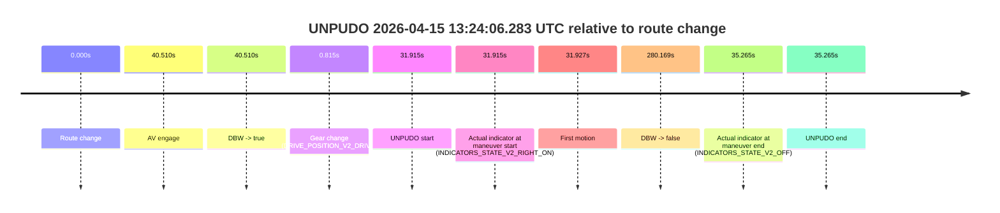
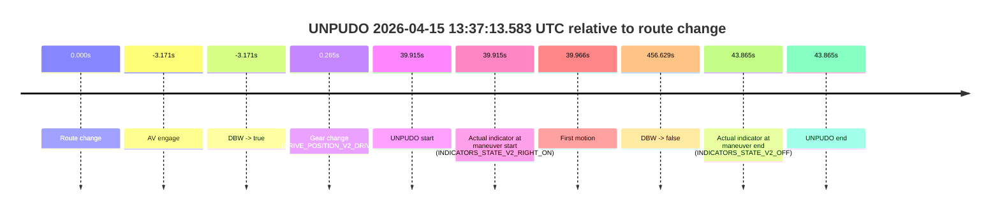
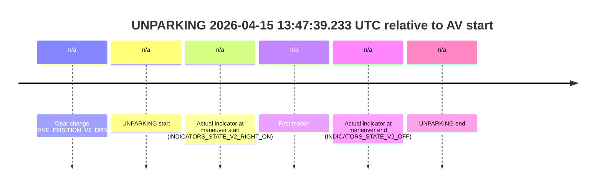

# Run Report: fme20015/2026-04-15--13-08-33--gen2-av-19b98635-b96d-4d53-b7d9-faf6e67ec0c6

| Field | Value |
|---|---|
| Run ID | `fme20015/2026-04-15--13-08-33--gen2-av-19b98635-b96d-4d53-b7d9-faf6e67ec0c6` |
| Date | `2026-04-15` |
| Model(s) | `pink-manta-ray-smooth` |
| Author | `guy.geva` |
| Event count | `6` |

## unpudo 2026-04-15 13:19:16.083 UTC

| Field | Value |
|---|---|
| Model | `pink-manta-ray-smooth` |
| Author | `guy.geva` |
| Run ID | `fme20015/2026-04-15--13-08-33--gen2-av-19b98635-b96d-4d53-b7d9-faf6e67ec0c6` |
| Date | `2026-04-15` |
| Time (UTC) | `13:19:16.083` |
| Event type | `unpudo` |
| Disengagement type | `none observed` |
| Route change | `found` |
| Console | [run](https://console.sso.wayve.ai/run/fme20015/2026-04-15--13-08-33--gen2-av-19b98635-b96d-4d53-b7d9-faf6e67ec0c6?id=&time-unixus=1776259156083294) |
| Foxglove | [segment](https://app.foxglove.dev/wayve-on-prem/p/prj_0dX18KZdVHg1fmmI/view?ds=foxglove-stream&ds.deviceName=fme20015&ds.start=2026-04-15T13%3A18%3A26.868262Z&ds.end=2026-04-15T13%3A22%3A04.277108Z&layoutId=lay_0e7VD4WIKDQGU73Y&time=2026-04-15T13%3A19%3A16.083294Z) |

### Event card: non-av

- Non-AV: there is no AV-owned portion anywhere inside the detected unpudo timeline, so it is kept for coverage but excluded from model success / failure scoring.

| Event | Time (UTC) | Delta from route change |
|---|---:|---:|
| Route change | 2026-04-15 13:18:36.868 | `0.000s` |
| AV engage | 2026-04-15 13:19:23.418 | `46.550s` |
| DBW -> true | 2026-04-15 13:19:23.418 | `46.550s` |
| Gear change (DRIVE_POSITION_V2_DRIVE) | 2026-04-15 13:18:37.133 | `0.265s` |
| UNPUDO start | 2026-04-15 13:19:16.083 | `39.215s` |
| Actual indicator at maneuver start (INDICATORS_STATE_V2_RIGHT_ON) | 2026-04-15 13:19:16.083 | `39.215s` |
| First motion | 2026-04-15 13:19:16.234 | `39.366s` |
| DBW -> false | 2026-04-15 13:21:54.277 | `197.409s` |
| Actual indicator at maneuver end (INDICATORS_STATE_V2_OFF) | 2026-04-15 13:19:20.683 | `43.815s` |
| UNPUDO end | 2026-04-15 13:19:20.683 | `43.815s` |

| Metric | Value |
|---|---|
| Outcome | `non-av` |
| Effective failure type | `none` |
| Route change status | `found` |
| DBW at event start | `false` |
| DBW at event end | `false` |
| Predicted gear at AV start | `DRIVE_POSITION_V2_DRIVE` |
| Actual gear at AV start | `DRIVE_POSITION_V2_DRIVE` |
| Predicted gear at event start | `DRIVE_POSITION_V2_DRIVE` |
| Actual gear at event start | `DRIVE_POSITION_V2_DRIVE` |
| Planned indicator direction | `INDICATORS_STATE_V2_RIGHT_ON` |
| Controller indicator direction | `INDICATORS_STATE_V2_RIGHT_ON` |
| Actual indicator direction | `INDICATORS_STATE_V2_RIGHT_ON` |
| Actual indicator at maneuver end | `INDICATORS_STATE_V2_OFF` |
| Driver accel help in AV | `false` |
| Driver accel help timestamp | `n/a` |
| Max accel pedal pct in AV | `0.0%` |
| Max brake pedal pct in AV | `0.0%` |
| Max speed mps in AV | `0.000` |
| Route -> AV | `46.550s` |
| AV -> event start | `-7.335s` |
| AV -> first motion | `-7.184s` |
| AV duration before disengagement | `150.859s` |
| Trajectory waypoint count | `36` |
| Driving-plan step count | `11` |

The scored portion starts from the AV-owned window, not from the pre-AV setup. Route-change search in the stopped pre-event segment was `found`, with the baseline therefore set to route change. At the event anchor the model predicts `DRIVE_POSITION_V2_DRIVE` and the actual gear is `DRIVE_POSITION_V2_DRIVE`. The effective model outcome is `non-av` because `there is no AV-owned overlap inside the event timeline`.

### Resolution

| Field | Value |
|---|---|
| Final outcome | `non-av` |
| Do we agree with this label? | `yes` |
| Source disengagement type | `none observed` |
| Resolved effective failure type | `none` |
| Confidence | `high` |

## unpudo 2026-04-15 13:24:06.283 UTC

| Field | Value |
|---|---|
| Model | `pink-manta-ray-smooth` |
| Author | `guy.geva` |
| Run ID | `fme20015/2026-04-15--13-08-33--gen2-av-19b98635-b96d-4d53-b7d9-faf6e67ec0c6` |
| Date | `2026-04-15` |
| Time (UTC) | `13:24:06.283` |
| Event type | `unpudo` |
| Disengagement type | `none observed` |
| Route change | `found` |
| Console | [run](https://console.sso.wayve.ai/run/fme20015/2026-04-15--13-08-33--gen2-av-19b98635-b96d-4d53-b7d9-faf6e67ec0c6?id=&time-unixus=1776259446283318) |
| Foxglove | [segment](https://app.foxglove.dev/wayve-on-prem/p/prj_0dX18KZdVHg1fmmI/view?ds=foxglove-stream&ds.deviceName=fme20015&ds.start=2026-04-15T13%3A23%3A24.368247Z&ds.end=2026-04-15T13%3A28%3A24.537151Z&layoutId=lay_0e7VD4WIKDQGU73Y&time=2026-04-15T13%3A24%3A06.283318Z) |

### Event card: non-av

- Non-AV: there is no AV-owned portion anywhere inside the detected unpudo timeline, so it is kept for coverage but excluded from model success / failure scoring.

| Event | Time (UTC) | Delta from route change |
|---|---:|---:|
| Route change | 2026-04-15 13:23:34.368 | `0.000s` |
| AV engage | 2026-04-15 13:24:14.878 | `40.510s` |
| DBW -> true | 2026-04-15 13:24:14.878 | `40.510s` |
| Gear change (DRIVE_POSITION_V2_DRIVE) | 2026-04-15 13:23:35.183 | `0.815s` |
| UNPUDO start | 2026-04-15 13:24:06.283 | `31.915s` |
| Actual indicator at maneuver start (INDICATORS_STATE_V2_RIGHT_ON) | 2026-04-15 13:24:06.283 | `31.915s` |
| First motion | 2026-04-15 13:24:06.294 | `31.927s` |
| DBW -> false | 2026-04-15 13:28:14.537 | `280.169s` |
| Actual indicator at maneuver end (INDICATORS_STATE_V2_OFF) | 2026-04-15 13:24:09.633 | `35.265s` |
| UNPUDO end | 2026-04-15 13:24:09.633 | `35.265s` |

| Metric | Value |
|---|---|
| Outcome | `non-av` |
| Effective failure type | `none` |
| Route change status | `found` |
| DBW at event start | `false` |
| DBW at event end | `false` |
| Predicted gear at AV start | `DRIVE_POSITION_V2_DRIVE` |
| Actual gear at AV start | `DRIVE_POSITION_V2_DRIVE` |
| Predicted gear at event start | `DRIVE_POSITION_V2_DRIVE` |
| Actual gear at event start | `DRIVE_POSITION_V2_DRIVE` |
| Planned indicator direction | `INDICATORS_STATE_V2_LEFT_ON` |
| Controller indicator direction | `INDICATORS_STATE_V2_LEFT_ON` |
| Actual indicator direction | `INDICATORS_STATE_V2_RIGHT_ON` |
| Actual indicator at maneuver end | `INDICATORS_STATE_V2_OFF` |
| Driver accel help in AV | `false` |
| Driver accel help timestamp | `n/a` |
| Max accel pedal pct in AV | `0.0%` |
| Max brake pedal pct in AV | `0.0%` |
| Max speed mps in AV | `0.000` |
| Route -> AV | `40.510s` |
| AV -> event start | `-8.595s` |
| AV -> first motion | `-8.583s` |
| AV duration before disengagement | `239.659s` |
| Trajectory waypoint count | `36` |
| Driving-plan step count | `11` |

The scored portion starts from the AV-owned window, not from the pre-AV setup. Route-change search in the stopped pre-event segment was `found`, with the baseline therefore set to route change. At the event anchor the model predicts `DRIVE_POSITION_V2_DRIVE` and the actual gear is `DRIVE_POSITION_V2_DRIVE`. The effective model outcome is `non-av` because `there is no AV-owned overlap inside the event timeline`.

### Resolution

| Field | Value |
|---|---|
| Final outcome | `non-av` |
| Do we agree with this label? | `yes` |
| Source disengagement type | `none observed` |
| Resolved effective failure type | `none` |
| Confidence | `high` |

## unpudo 2026-04-15 13:29:34.483 UTC

| Field | Value |
|---|---|
| Model | `pink-manta-ray-smooth` |
| Author | `guy.geva` |
| Run ID | `fme20015/2026-04-15--13-08-33--gen2-av-19b98635-b96d-4d53-b7d9-faf6e67ec0c6` |
| Date | `2026-04-15` |
| Time (UTC) | `13:29:34.483` |
| Event type | `unpudo` |
| Disengagement type | `none observed` |
| Route change | `found` |
| Console | [run](https://console.sso.wayve.ai/run/fme20015/2026-04-15--13-08-33--gen2-av-19b98635-b96d-4d53-b7d9-faf6e67ec0c6?id=&time-unixus=1776259774483315) |
| Foxglove | [segment](https://app.foxglove.dev/wayve-on-prem/p/prj_0dX18KZdVHg1fmmI/view?ds=foxglove-stream&ds.deviceName=fme20015&ds.start=2026-04-15T13%3A29%3A19.618477Z&ds.end=2026-04-15T13%3A33%3A00.638074Z&layoutId=lay_0e7VD4WIKDQGU73Y&time=2026-04-15T13%3A29%3A34.483315Z) |

### Event card: non-av

- Non-AV: there is no AV-owned portion anywhere inside the detected unpudo timeline, so it is kept for coverage but excluded from model success / failure scoring.

| Event | Time (UTC) | Delta from route change |
|---|---:|---:|
| Route change | 2026-04-15 13:29:29.618 | `0.000s` |
| AV engage | 2026-04-15 13:29:42.837 | `13.219s` |
| DBW -> true | 2026-04-15 13:29:42.837 | `13.219s` |
| Gear change (DRIVE_POSITION_V2_DRIVE) | 2026-04-15 13:29:31.733 | `2.115s` |
| UNPUDO start | 2026-04-15 13:29:34.483 | `4.865s` |
| Actual indicator at maneuver start (INDICATORS_STATE_V2_RIGHT_ON) | 2026-04-15 13:29:34.483 | `4.865s` |
| First motion | 2026-04-15 13:29:34.594 | `4.976s` |
| DBW -> false | 2026-04-15 13:32:50.638 | `201.020s` |
| Actual indicator at maneuver end (INDICATORS_STATE_V2_OFF) | 2026-04-15 13:29:38.233 | `8.615s` |
| UNPUDO end | 2026-04-15 13:29:38.233 | `8.615s` |

| Metric | Value |
|---|---|
| Outcome | `non-av` |
| Effective failure type | `none` |
| Route change status | `found` |
| DBW at event start | `false` |
| DBW at event end | `false` |
| Predicted gear at AV start | `DRIVE_POSITION_V2_DRIVE` |
| Actual gear at AV start | `DRIVE_POSITION_V2_DRIVE` |
| Predicted gear at event start | `DRIVE_POSITION_V2_DRIVE` |
| Actual gear at event start | `DRIVE_POSITION_V2_DRIVE` |
| Planned indicator direction | `INDICATORS_STATE_V2_RIGHT_ON` |
| Controller indicator direction | `INDICATORS_STATE_V2_RIGHT_ON` |
| Actual indicator direction | `INDICATORS_STATE_V2_RIGHT_ON` |
| Actual indicator at maneuver end | `INDICATORS_STATE_V2_OFF` |
| Driver accel help in AV | `false` |
| Driver accel help timestamp | `n/a` |
| Max accel pedal pct in AV | `0.0%` |
| Max brake pedal pct in AV | `0.0%` |
| Max speed mps in AV | `0.000` |
| Route -> AV | `13.219s` |
| AV -> event start | `-8.354s` |
| AV -> first motion | `-8.243s` |
| AV duration before disengagement | `187.800s` |
| Trajectory waypoint count | `36` |
| Driving-plan step count | `11` |

The scored portion starts from the AV-owned window, not from the pre-AV setup. Route-change search in the stopped pre-event segment was `found`, with the baseline therefore set to route change. At the event anchor the model predicts `DRIVE_POSITION_V2_DRIVE` and the actual gear is `DRIVE_POSITION_V2_DRIVE`. The effective model outcome is `non-av` because `there is no AV-owned overlap inside the event timeline`.

### Resolution

| Field | Value |
|---|---|
| Final outcome | `non-av` |
| Do we agree with this label? | `yes` |
| Source disengagement type | `none observed` |
| Resolved effective failure type | `none` |
| Confidence | `high` |

## unpudo 2026-04-15 13:37:13.583 UTC

| Field | Value |
|---|---|
| Model | `pink-manta-ray-smooth` |
| Author | `guy.geva` |
| Run ID | `fme20015/2026-04-15--13-08-33--gen2-av-19b98635-b96d-4d53-b7d9-faf6e67ec0c6` |
| Date | `2026-04-15` |
| Time (UTC) | `13:37:13.583` |
| Event type | `unpudo` |
| Disengagement type | `none observed` |
| Route change | `found` |
| Console | [run](https://console.sso.wayve.ai/run/fme20015/2026-04-15--13-08-33--gen2-av-19b98635-b96d-4d53-b7d9-faf6e67ec0c6?id=&time-unixus=1776260233583320) |
| Foxglove | [segment](https://app.foxglove.dev/wayve-on-prem/p/prj_0dX18KZdVHg1fmmI/view?ds=foxglove-stream&ds.deviceName=fme20015&ds.start=2026-04-15T13%3A36%3A20.497113Z&ds.end=2026-04-15T13%3A44%3A20.297123Z&layoutId=lay_0e7VD4WIKDQGU73Y&time=2026-04-15T13%3A37%3A13.583320Z) |

### Event card: pass

- Pass: AV owns the credited unpudo through the official event window, the gear state is aligned at the anchor, and the vehicle moves without driver accelerator help in AV.

| Event | Time (UTC) | Delta from route change |
|---|---:|---:|
| Route change | 2026-04-15 13:36:33.668 | `0.000s` |
| AV engage | 2026-04-15 13:36:30.497 | `-3.171s` |
| DBW -> true | 2026-04-15 13:36:30.497 | `-3.171s` |
| Gear change (DRIVE_POSITION_V2_DRIVE) | 2026-04-15 13:36:33.933 | `0.265s` |
| UNPUDO start | 2026-04-15 13:37:13.583 | `39.915s` |
| Actual indicator at maneuver start (INDICATORS_STATE_V2_RIGHT_ON) | 2026-04-15 13:37:13.583 | `39.915s` |
| First motion | 2026-04-15 13:37:13.634 | `39.966s` |
| DBW -> false | 2026-04-15 13:44:10.297 | `456.629s` |
| Actual indicator at maneuver end (INDICATORS_STATE_V2_OFF) | 2026-04-15 13:37:17.533 | `43.865s` |
| UNPUDO end | 2026-04-15 13:37:17.533 | `43.865s` |

| Metric | Value |
|---|---|
| Outcome | `pass` |
| Effective failure type | `none` |
| Route change status | `found` |
| DBW at event start | `true` |
| DBW at event end | `true` |
| Predicted gear at AV start | `DRIVE_POSITION_V2_PARK` |
| Actual gear at AV start | `DRIVE_POSITION_V2_PARK` |
| Predicted gear at event start | `DRIVE_POSITION_V2_DRIVE` |
| Actual gear at event start | `DRIVE_POSITION_V2_DRIVE` |
| Planned indicator direction | `INDICATORS_STATE_V2_RIGHT_ON` |
| Controller indicator direction | `INDICATORS_STATE_V2_RIGHT_ON` |
| Actual indicator direction | `INDICATORS_STATE_V2_RIGHT_ON` |
| Actual indicator at maneuver end | `INDICATORS_STATE_V2_OFF` |
| Driver accel help in AV | `false` |
| Driver accel help timestamp | `n/a` |
| Max accel pedal pct in AV | `0.0%` |
| Max brake pedal pct in AV | `0.0%` |
| Max speed mps in AV | `4.431` |
| Route -> AV | `-3.171s` |
| AV -> event start | `43.086s` |
| AV -> first motion | `43.137s` |
| AV duration before disengagement | `459.800s` |
| Trajectory waypoint count | `36` |
| Driving-plan step count | `11` |

The scored portion starts from the AV-owned window, not from the pre-AV setup. Route-change search in the stopped pre-event segment was `found`, with the baseline therefore set to route change. At the event anchor the model predicts `DRIVE_POSITION_V2_DRIVE` and the actual gear is `DRIVE_POSITION_V2_DRIVE`. The effective model outcome is `pass` because `the credited maneuver stays AV-owned through the official event end`.

### Resolution

| Field | Value |
|---|---|
| Final outcome | `pass` |
| Do we agree with this label? | `yes` |
| Source disengagement type | `none observed` |
| Resolved effective failure type | `none` |
| Confidence | `high` |

## unpudo 2026-04-15 13:38:54.433 UTC

| Field | Value |
|---|---|
| Model | `pink-manta-ray-smooth` |
| Author | `guy.geva` |
| Run ID | `fme20015/2026-04-15--13-08-33--gen2-av-19b98635-b96d-4d53-b7d9-faf6e67ec0c6` |
| Date | `2026-04-15` |
| Time (UTC) | `13:38:54.433` |
| Event type | `unpudo` |
| Disengagement type | `none observed` |
| Route change | `found` |
| Console | [run](https://console.sso.wayve.ai/run/fme20015/2026-04-15--13-08-33--gen2-av-19b98635-b96d-4d53-b7d9-faf6e67ec0c6?id=&time-unixus=1776260334433319) |
| Foxglove | [segment](https://app.foxglove.dev/wayve-on-prem/p/prj_0dX18KZdVHg1fmmI/view?ds=foxglove-stream&ds.deviceName=fme20015&ds.start=2026-04-15T13%3A36%3A20.497113Z&ds.end=2026-04-15T13%3A44%3A20.297123Z&layoutId=lay_0e7VD4WIKDQGU73Y&time=2026-04-15T13%3A38%3A54.433319Z) |

### Event card: pass

- Pass: AV owns the credited unpudo through the official event window, the gear state is aligned at the anchor, and the vehicle moves without driver accelerator help in AV.

| Event | Time (UTC) | Delta from route change |
|---|---:|---:|
| Route change | 2026-04-15 13:38:49.518 | `0.000s` |
| AV engage | 2026-04-15 13:36:30.497 | `-139.022s` |
| DBW -> true | 2026-04-15 13:36:30.497 | `-139.022s` |
| Gear change (DRIVE_POSITION_V2_DRIVE) | 2026-04-15 13:38:49.833 | `0.314s` |
| UNPUDO start | 2026-04-15 13:38:54.433 | `4.914s` |
| Actual indicator at maneuver start (INDICATORS_STATE_V2_OFF) | 2026-04-15 13:38:54.433 | `4.914s` |
| First motion | 2026-04-15 13:38:54.474 | `4.955s` |
| DBW -> false | 2026-04-15 13:44:10.297 | `320.778s` |
| Actual indicator at maneuver end (INDICATORS_STATE_V2_OFF) | 2026-04-15 13:38:58.083 | `8.564s` |
| UNPUDO end | 2026-04-15 13:38:58.083 | `8.564s` |

| Metric | Value |
|---|---|
| Outcome | `pass` |
| Effective failure type | `none` |
| Route change status | `found` |
| DBW at event start | `true` |
| DBW at event end | `true` |
| Predicted gear at AV start | `DRIVE_POSITION_V2_PARK` |
| Actual gear at AV start | `DRIVE_POSITION_V2_PARK` |
| Predicted gear at event start | `DRIVE_POSITION_V2_DRIVE` |
| Actual gear at event start | `DRIVE_POSITION_V2_DRIVE` |
| Planned indicator direction | `INDICATORS_STATE_V2_RIGHT_ON` |
| Controller indicator direction | `INDICATORS_STATE_V2_RIGHT_ON` |
| Actual indicator direction | `INDICATORS_STATE_V2_OFF` |
| Actual indicator at maneuver end | `INDICATORS_STATE_V2_OFF` |
| Driver accel help in AV | `false` |
| Driver accel help timestamp | `n/a` |
| Max accel pedal pct in AV | `0.0%` |
| Max brake pedal pct in AV | `0.0%` |
| Max speed mps in AV | `4.761` |
| Route -> AV | `-139.022s` |
| AV -> event start | `143.936s` |
| AV -> first motion | `143.977s` |
| AV duration before disengagement | `459.800s` |
| Trajectory waypoint count | `35` |
| Driving-plan step count | `11` |

The scored portion starts from the AV-owned window, not from the pre-AV setup. Route-change search in the stopped pre-event segment was `found`, with the baseline therefore set to route change. At the event anchor the model predicts `DRIVE_POSITION_V2_DRIVE` and the actual gear is `DRIVE_POSITION_V2_DRIVE`. The effective model outcome is `pass` because `the credited maneuver stays AV-owned through the official event end`.

### Resolution

| Field | Value |
|---|---|
| Final outcome | `pass` |
| Do we agree with this label? | `yes` |
| Source disengagement type | `none observed` |
| Resolved effective failure type | `none` |
| Confidence | `high` |

## unparking 2026-04-15 13:47:39.233 UTC

| Field | Value |
|---|---|
| Model | `pink-manta-ray-smooth` |
| Author | `guy.geva` |
| Run ID | `fme20015/2026-04-15--13-08-33--gen2-av-19b98635-b96d-4d53-b7d9-faf6e67ec0c6` |
| Date | `2026-04-15` |
| Time (UTC) | `13:47:39.233` |
| Event type | `unparking` |
| Disengagement type | `none observed` |
| Route change | `not found` |
| Console | [run](https://console.sso.wayve.ai/run/fme20015/2026-04-15--13-08-33--gen2-av-19b98635-b96d-4d53-b7d9-faf6e67ec0c6?id=&time-unixus=1776260859233312) |
| Foxglove | [segment](https://app.foxglove.dev/wayve-on-prem/p/prj_0dX18KZdVHg1fmmI/view?ds=foxglove-stream&ds.deviceName=fme20015&ds.start=2026-04-15T13%3A47%3A05.283300Z&ds.end=2026-04-15T13%3A47%3A52.383357Z&layoutId=lay_0e7VD4WIKDQGU73Y&time=2026-04-15T13%3A47%3A39.233312Z) |

### Event card: non-av

- Non-AV: there is no AV-owned portion anywhere inside the detected unparking timeline, so it is kept for coverage but excluded from model success / failure scoring.

| Event | Time (UTC) | Delta from AV start |
|---|---:|---:|
| Gear change (DRIVE_POSITION_V2_DRIVE) | 2026-04-15 13:47:15.283 | `n/a` |
| UNPARKING start | 2026-04-15 13:47:39.233 | `n/a` |
| Actual indicator at maneuver start (INDICATORS_STATE_V2_RIGHT_ON) | 2026-04-15 13:47:39.233 | `n/a` |
| First motion | 2026-04-15 13:47:39.314 | `n/a` |
| Actual indicator at maneuver end (INDICATORS_STATE_V2_OFF) | 2026-04-15 13:47:42.383 | `n/a` |
| UNPARKING end | 2026-04-15 13:47:42.383 | `n/a` |

| Metric | Value |
|---|---|
| Outcome | `non-av` |
| Effective failure type | `none` |
| Route change status | `not found` |
| DBW at event start | `false` |
| DBW at event end | `false` |
| Predicted gear at AV start | `n/a` |
| Actual gear at AV start | `n/a` |
| Predicted gear at event start | `DRIVE_POSITION_V2_DRIVE` |
| Actual gear at event start | `DRIVE_POSITION_V2_DRIVE` |
| Planned indicator direction | `INDICATORS_STATE_V2_RIGHT_ON` |
| Controller indicator direction | `INDICATORS_STATE_V2_RIGHT_ON` |
| Actual indicator direction | `INDICATORS_STATE_V2_RIGHT_ON` |
| Actual indicator at maneuver end | `INDICATORS_STATE_V2_OFF` |
| Driver accel help in AV | `false` |
| Driver accel help timestamp | `n/a` |
| Max accel pedal pct in AV | `0.0%` |
| Max brake pedal pct in AV | `0.0%` |
| Max speed mps in AV | `0.000` |
| Route -> AV | `n/a` |
| AV -> event start | `n/a` |
| AV -> first motion | `n/a` |
| AV duration before disengagement | `n/a` |
| Trajectory waypoint count | `35` |
| Driving-plan step count | `11` |

The scored portion starts from the AV-owned window, not from the pre-AV setup. Route-change search in the stopped pre-event segment was `not found`, with the baseline therefore set to AV start. At the event anchor the model predicts `DRIVE_POSITION_V2_DRIVE` and the actual gear is `DRIVE_POSITION_V2_DRIVE`. The effective model outcome is `non-av` because `there is no AV-owned overlap inside the event timeline`.

### Resolution

| Field | Value |
|---|---|
| Final outcome | `non-av` |
| Do we agree with this label? | `yes` |
| Source disengagement type | `none observed` |
| Resolved effective failure type | `none` |
| Confidence | `high` |
