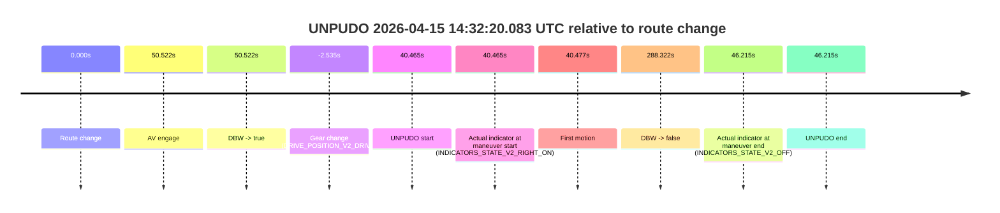
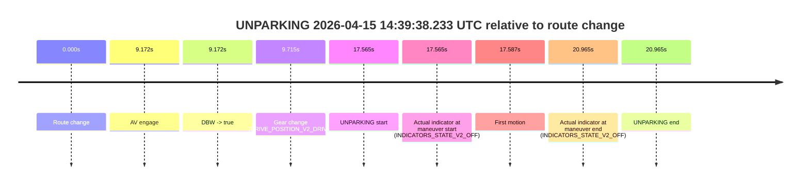

# Run Report: fme20015/2026-04-15--14-16-31--gen2-av-28d171b6-80a7-4e64-8aa8-b306a6530d69

| Field | Value |
|---|---|
| Run ID | `fme20015/2026-04-15--14-16-31--gen2-av-28d171b6-80a7-4e64-8aa8-b306a6530d69` |
| Date | `2026-04-15` |
| Model(s) | `armadillo-amethyst-squeaky` |
| Author | `guy.geva` |
| Event count | `4` |

## unpudo 2026-04-15 14:23:48.383 UTC

| Field | Value |
|---|---|
| Model | `armadillo-amethyst-squeaky` |
| Author | `guy.geva` |
| Run ID | `fme20015/2026-04-15--14-16-31--gen2-av-28d171b6-80a7-4e64-8aa8-b306a6530d69` |
| Date | `2026-04-15` |
| Time (UTC) | `14:23:48.383` |
| Event type | `unpudo` |
| Disengagement type | `none observed` |
| Route change | `found` |
| Console | [run](https://console.sso.wayve.ai/run/fme20015/2026-04-15--14-16-31--gen2-av-28d171b6-80a7-4e64-8aa8-b306a6530d69?id=&time-unixus=1776263028383294) |
| Foxglove | [segment](https://app.foxglove.dev/wayve-on-prem/p/prj_0dX18KZdVHg1fmmI/view?ds=foxglove-stream&ds.deviceName=fme20015&ds.start=2026-04-15T14%3A23%3A12.468258Z&ds.end=2026-04-15T14%3A28%3A56.922624Z&layoutId=lay_0e7VD4WIKDQGU73Y&time=2026-04-15T14%3A23%3A48.383294Z) |

### Event card: non-av

- Non-AV: there is no AV-owned portion anywhere inside the detected unpudo timeline, so it is kept for coverage but excluded from model success / failure scoring.

| Event | Time (UTC) | Delta from route change |
|---|---:|---:|
| Route change | 2026-04-15 14:23:22.468 | `0.000s` |
| AV engage | 2026-04-15 14:23:57.620 | `35.152s` |
| DBW -> true | 2026-04-15 14:23:57.620 | `35.152s` |
| Gear change (DRIVE_POSITION_V2_DRIVE) | 2026-04-15 14:23:27.083 | `4.615s` |
| UNPUDO start | 2026-04-15 14:23:48.383 | `25.915s` |
| Actual indicator at maneuver start (INDICATORS_STATE_V2_RIGHT_ON) | 2026-04-15 14:23:48.383 | `25.915s` |
| First motion | 2026-04-15 14:23:48.515 | `26.047s` |
| DBW -> false | 2026-04-15 14:28:46.922 | `324.454s` |
| Actual indicator at maneuver end (INDICATORS_STATE_V2_OFF) | 2026-04-15 14:23:52.983 | `30.515s` |
| UNPUDO end | 2026-04-15 14:23:52.983 | `30.515s` |

| Metric | Value |
|---|---|
| Outcome | `non-av` |
| Effective failure type | `none` |
| Route change status | `found` |
| DBW at event start | `false` |
| DBW at event end | `false` |
| Predicted gear at AV start | `DRIVE_POSITION_V2_DRIVE` |
| Actual gear at AV start | `DRIVE_POSITION_V2_DRIVE` |
| Predicted gear at event start | `DRIVE_POSITION_V2_DRIVE` |
| Actual gear at event start | `DRIVE_POSITION_V2_DRIVE` |
| Planned indicator direction | `INDICATORS_STATE_V2_RIGHT_ON` |
| Controller indicator direction | `INDICATORS_STATE_V2_RIGHT_ON` |
| Actual indicator direction | `INDICATORS_STATE_V2_RIGHT_ON` |
| Actual indicator at maneuver end | `INDICATORS_STATE_V2_OFF` |
| Driver accel help in AV | `false` |
| Driver accel help timestamp | `n/a` |
| Max accel pedal pct in AV | `0.0%` |
| Max brake pedal pct in AV | `0.0%` |
| Max speed mps in AV | `0.000` |
| Route -> AV | `35.152s` |
| AV -> event start | `-9.237s` |
| AV -> first motion | `-9.105s` |
| AV duration before disengagement | `289.302s` |
| Trajectory waypoint count | `37` |
| Driving-plan step count | `11` |

The scored portion starts from the AV-owned window, not from the pre-AV setup. Route-change search in the stopped pre-event segment was `found`, with the baseline therefore set to route change. At the event anchor the model predicts `DRIVE_POSITION_V2_DRIVE` and the actual gear is `DRIVE_POSITION_V2_DRIVE`. The effective model outcome is `non-av` because `there is no AV-owned overlap inside the event timeline`.

### Resolution

| Field | Value |
|---|---|
| Final outcome | `non-av` |
| Do we agree with this label? | `yes` |
| Source disengagement type | `none observed` |
| Resolved effective failure type | `none` |
| Confidence | `high` |

## unpudo 2026-04-15 14:30:02.233 UTC

| Field | Value |
|---|---|
| Model | `armadillo-amethyst-squeaky` |
| Author | `guy.geva` |
| Run ID | `fme20015/2026-04-15--14-16-31--gen2-av-28d171b6-80a7-4e64-8aa8-b306a6530d69` |
| Date | `2026-04-15` |
| Time (UTC) | `14:30:02.233` |
| Event type | `unpudo` |
| Disengagement type | `none observed` |
| Route change | `found` |
| Console | [run](https://console.sso.wayve.ai/run/fme20015/2026-04-15--14-16-31--gen2-av-28d171b6-80a7-4e64-8aa8-b306a6530d69?id=&time-unixus=1776263402233296) |
| Foxglove | [segment](https://app.foxglove.dev/wayve-on-prem/p/prj_0dX18KZdVHg1fmmI/view?ds=foxglove-stream&ds.deviceName=fme20015&ds.start=2026-04-15T14%3A29%3A45.268375Z&ds.end=2026-04-15T14%3A31%3A37.400593Z&layoutId=lay_0e7VD4WIKDQGU73Y&time=2026-04-15T14%3A30%3A02.233296Z) |

### Event card: pass

- Pass: AV owns the credited unpudo through the official event window, the gear state is aligned at the anchor, and the vehicle moves without driver accelerator help in AV.

| Event | Time (UTC) | Delta from route change |
|---|---:|---:|
| Route change | 2026-04-15 14:29:55.268 | `0.000s` |
| AV engage | 2026-04-15 14:29:58.080 | `2.812s` |
| DBW -> true | 2026-04-15 14:29:58.080 | `2.812s` |
| Gear change (DRIVE_POSITION_V2_DRIVE) | 2026-04-15 14:29:58.583 | `3.315s` |
| UNPUDO start | 2026-04-15 14:30:02.233 | `6.965s` |
| Actual indicator at maneuver start (INDICATORS_STATE_V2_OFF) | 2026-04-15 14:30:02.233 | `6.965s` |
| First motion | 2026-04-15 14:30:02.275 | `7.007s` |
| DBW -> false | 2026-04-15 14:31:27.400 | `92.132s` |
| Actual indicator at maneuver end (INDICATORS_STATE_V2_OFF) | 2026-04-15 14:30:05.583 | `10.315s` |
| UNPUDO end | 2026-04-15 14:30:05.583 | `10.315s` |

| Metric | Value |
|---|---|
| Outcome | `pass` |
| Effective failure type | `none` |
| Route change status | `found` |
| DBW at event start | `true` |
| DBW at event end | `true` |
| Predicted gear at AV start | `DRIVE_POSITION_V2_DRIVE` |
| Actual gear at AV start | `DRIVE_POSITION_V2_PARK` |
| Predicted gear at event start | `DRIVE_POSITION_V2_DRIVE` |
| Actual gear at event start | `DRIVE_POSITION_V2_DRIVE` |
| Planned indicator direction | `INDICATORS_STATE_V2_LEFT_ON` |
| Controller indicator direction | `INDICATORS_STATE_V2_LEFT_ON` |
| Actual indicator direction | `INDICATORS_STATE_V2_OFF` |
| Actual indicator at maneuver end | `INDICATORS_STATE_V2_OFF` |
| Driver accel help in AV | `false` |
| Driver accel help timestamp | `n/a` |
| Max accel pedal pct in AV | `0.0%` |
| Max brake pedal pct in AV | `0.0%` |
| Max speed mps in AV | `5.425` |
| Route -> AV | `2.812s` |
| AV -> event start | `4.153s` |
| AV -> first motion | `4.195s` |
| AV duration before disengagement | `89.320s` |
| Trajectory waypoint count | `36` |
| Driving-plan step count | `11` |

The scored portion starts from the AV-owned window, not from the pre-AV setup. Route-change search in the stopped pre-event segment was `found`, with the baseline therefore set to route change. At the event anchor the model predicts `DRIVE_POSITION_V2_DRIVE` and the actual gear is `DRIVE_POSITION_V2_DRIVE`. The effective model outcome is `pass` because `the credited maneuver stays AV-owned through the official event end`.

### Resolution

| Field | Value |
|---|---|
| Final outcome | `pass` |
| Do we agree with this label? | `yes` |
| Source disengagement type | `none observed` |
| Resolved effective failure type | `none` |
| Confidence | `high` |

## unpudo 2026-04-15 14:32:20.083 UTC

| Field | Value |
|---|---|
| Model | `armadillo-amethyst-squeaky` |
| Author | `guy.geva` |
| Run ID | `fme20015/2026-04-15--14-16-31--gen2-av-28d171b6-80a7-4e64-8aa8-b306a6530d69` |
| Date | `2026-04-15` |
| Time (UTC) | `14:32:20.083` |
| Event type | `unpudo` |
| Disengagement type | `none observed` |
| Route change | `found` |
| Console | [run](https://console.sso.wayve.ai/run/fme20015/2026-04-15--14-16-31--gen2-av-28d171b6-80a7-4e64-8aa8-b306a6530d69?id=&time-unixus=1776263540083295) |
| Foxglove | [segment](https://app.foxglove.dev/wayve-on-prem/p/prj_0dX18KZdVHg1fmmI/view?ds=foxglove-stream&ds.deviceName=fme20015&ds.start=2026-04-15T14%3A31%3A27.083297Z&ds.end=2026-04-15T14%3A36%3A37.940437Z&layoutId=lay_0e7VD4WIKDQGU73Y&time=2026-04-15T14%3A32%3A20.083295Z) |

### Event card: non-av

- Non-AV: there is no AV-owned portion anywhere inside the detected unpudo timeline, so it is kept for coverage but excluded from model success / failure scoring.

| Event | Time (UTC) | Delta from route change |
|---|---:|---:|
| Route change | 2026-04-15 14:31:39.618 | `0.000s` |
| AV engage | 2026-04-15 14:32:30.140 | `50.522s` |
| DBW -> true | 2026-04-15 14:32:30.140 | `50.522s` |
| Gear change (DRIVE_POSITION_V2_DRIVE) | 2026-04-15 14:31:37.083 | `-2.535s` |
| UNPUDO start | 2026-04-15 14:32:20.083 | `40.465s` |
| Actual indicator at maneuver start (INDICATORS_STATE_V2_RIGHT_ON) | 2026-04-15 14:32:20.083 | `40.465s` |
| First motion | 2026-04-15 14:32:20.095 | `40.477s` |
| DBW -> false | 2026-04-15 14:36:27.940 | `288.322s` |
| Actual indicator at maneuver end (INDICATORS_STATE_V2_OFF) | 2026-04-15 14:32:25.833 | `46.215s` |
| UNPUDO end | 2026-04-15 14:32:25.833 | `46.215s` |

| Metric | Value |
|---|---|
| Outcome | `non-av` |
| Effective failure type | `none` |
| Route change status | `found` |
| DBW at event start | `false` |
| DBW at event end | `false` |
| Predicted gear at AV start | `DRIVE_POSITION_V2_DRIVE` |
| Actual gear at AV start | `DRIVE_POSITION_V2_DRIVE` |
| Predicted gear at event start | `DRIVE_POSITION_V2_DRIVE` |
| Actual gear at event start | `DRIVE_POSITION_V2_DRIVE` |
| Planned indicator direction | `INDICATORS_STATE_V2_RIGHT_ON` |
| Controller indicator direction | `INDICATORS_STATE_V2_RIGHT_ON` |
| Actual indicator direction | `INDICATORS_STATE_V2_RIGHT_ON` |
| Actual indicator at maneuver end | `INDICATORS_STATE_V2_OFF` |
| Driver accel help in AV | `false` |
| Driver accel help timestamp | `n/a` |
| Max accel pedal pct in AV | `0.0%` |
| Max brake pedal pct in AV | `0.0%` |
| Max speed mps in AV | `0.000` |
| Route -> AV | `50.522s` |
| AV -> event start | `-10.057s` |
| AV -> first motion | `-10.045s` |
| AV duration before disengagement | `237.800s` |
| Trajectory waypoint count | `37` |
| Driving-plan step count | `11` |

The scored portion starts from the AV-owned window, not from the pre-AV setup. Route-change search in the stopped pre-event segment was `found`, with the baseline therefore set to route change. At the event anchor the model predicts `DRIVE_POSITION_V2_DRIVE` and the actual gear is `DRIVE_POSITION_V2_DRIVE`. The effective model outcome is `non-av` because `there is no AV-owned overlap inside the event timeline`.

### Resolution

| Field | Value |
|---|---|
| Final outcome | `non-av` |
| Do we agree with this label? | `yes` |
| Source disengagement type | `none observed` |
| Resolved effective failure type | `none` |
| Confidence | `high` |

## unparking 2026-04-15 14:39:38.233 UTC

| Field | Value |
|---|---|
| Model | `armadillo-amethyst-squeaky` |
| Author | `guy.geva` |
| Run ID | `fme20015/2026-04-15--14-16-31--gen2-av-28d171b6-80a7-4e64-8aa8-b306a6530d69` |
| Date | `2026-04-15` |
| Time (UTC) | `14:39:38.233` |
| Event type | `unparking` |
| Disengagement type | `none observed` |
| Route change | `found` |
| Console | [run](https://console.sso.wayve.ai/run/fme20015/2026-04-15--14-16-31--gen2-av-28d171b6-80a7-4e64-8aa8-b306a6530d69?id=&time-unixus=1776263978233311) |
| Foxglove | [segment](https://app.foxglove.dev/wayve-on-prem/p/prj_0dX18KZdVHg1fmmI/view?ds=foxglove-stream&ds.deviceName=fme20015&ds.start=2026-04-15T14%3A39%3A10.668327Z&ds.end=2026-04-15T14%3A39%3A51.633297Z&layoutId=lay_0e7VD4WIKDQGU73Y&time=2026-04-15T14%3A39%3A38.233311Z) |

### Event card: pass

- Pass: AV owns the credited unparking through the official event window, the gear state is aligned at the anchor, and the vehicle moves without driver accelerator help in AV.

| Event | Time (UTC) | Delta from route change |
|---|---:|---:|
| Route change | 2026-04-15 14:39:20.668 | `0.000s` |
| AV engage | 2026-04-15 14:39:29.840 | `9.172s` |
| DBW -> true | 2026-04-15 14:39:29.840 | `9.172s` |
| Gear change (DRIVE_POSITION_V2_DRIVE) | 2026-04-15 14:39:30.383 | `9.715s` |
| UNPARKING start | 2026-04-15 14:39:38.233 | `17.565s` |
| Actual indicator at maneuver start (INDICATORS_STATE_V2_OFF) | 2026-04-15 14:39:38.233 | `17.565s` |
| First motion | 2026-04-15 14:39:38.255 | `17.587s` |
| Actual indicator at maneuver end (INDICATORS_STATE_V2_OFF) | 2026-04-15 14:39:41.633 | `20.965s` |
| UNPARKING end | 2026-04-15 14:39:41.633 | `20.965s` |

| Metric | Value |
|---|---|
| Outcome | `pass` |
| Effective failure type | `none` |
| Route change status | `found` |
| DBW at event start | `true` |
| DBW at event end | `true` |
| Predicted gear at AV start | `DRIVE_POSITION_V2_DRIVE` |
| Actual gear at AV start | `DRIVE_POSITION_V2_PARK` |
| Predicted gear at event start | `DRIVE_POSITION_V2_DRIVE` |
| Actual gear at event start | `DRIVE_POSITION_V2_DRIVE` |
| Planned indicator direction | `INDICATORS_STATE_V2_RIGHT_ON` |
| Controller indicator direction | `INDICATORS_STATE_V2_RIGHT_ON` |
| Actual indicator direction | `INDICATORS_STATE_V2_OFF` |
| Actual indicator at maneuver end | `INDICATORS_STATE_V2_OFF` |
| Driver accel help in AV | `false` |
| Driver accel help timestamp | `n/a` |
| Max accel pedal pct in AV | `0.0%` |
| Max brake pedal pct in AV | `0.0%` |
| Max speed mps in AV | `5.175` |
| Route -> AV | `9.172s` |
| AV -> event start | `8.393s` |
| AV -> first motion | `8.415s` |
| AV duration before disengagement | `n/a` |
| Trajectory waypoint count | `36` |
| Driving-plan step count | `11` |

The scored portion starts from the AV-owned window, not from the pre-AV setup. Route-change search in the stopped pre-event segment was `found`, with the baseline therefore set to route change. At the event anchor the model predicts `DRIVE_POSITION_V2_DRIVE` and the actual gear is `DRIVE_POSITION_V2_DRIVE`. The effective model outcome is `pass` because `the credited maneuver stays AV-owned through the official event end`.

### Resolution

| Field | Value |
|---|---|
| Final outcome | `pass` |
| Do we agree with this label? | `yes` |
| Source disengagement type | `none observed` |
| Resolved effective failure type | `none` |
| Confidence | `high` |
