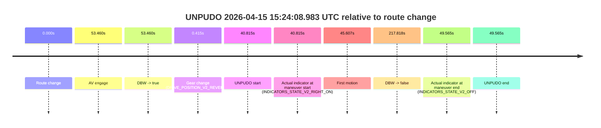
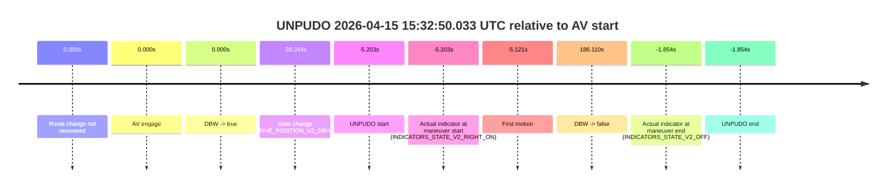
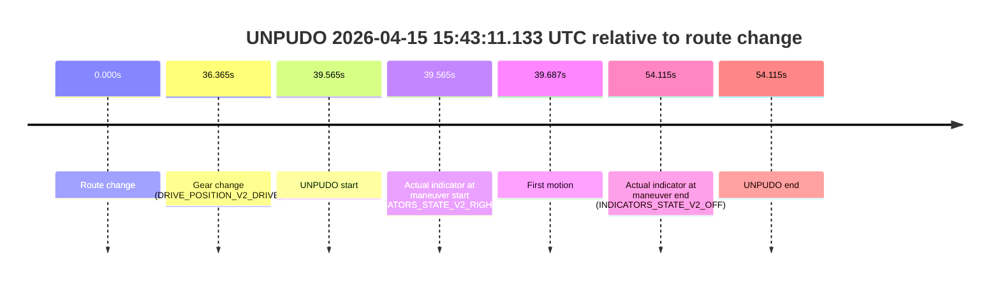
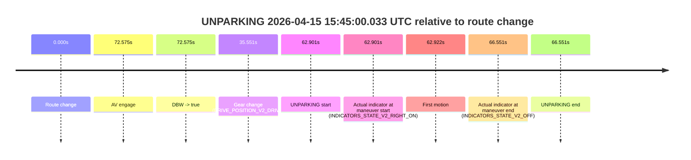

# Run Report: fme20015/2026-04-15--15-16-22--gen2-av-a8392fa3-4529-4833-bc6c-ebb86bea1d05

| Field | Value |
|---|---|
| Run ID | `fme20015/2026-04-15--15-16-22--gen2-av-a8392fa3-4529-4833-bc6c-ebb86bea1d05` |
| Date | `2026-04-15` |
| Model(s) | `satisfied-amber-moose` |
| Author | `guy.geva` |
| Event count | `6` |

## unpudo 2026-04-15 15:19:56.233 UTC

| Field | Value |
|---|---|
| Model | `satisfied-amber-moose` |
| Author | `guy.geva` |
| Run ID | `fme20015/2026-04-15--15-16-22--gen2-av-a8392fa3-4529-4833-bc6c-ebb86bea1d05` |
| Date | `2026-04-15` |
| Time (UTC) | `15:19:56.233` |
| Event type | `unpudo` |
| Disengagement type | `failed_to_unpudo` |
| Route change | `found` |
| Console | [run](https://console.sso.wayve.ai/run/fme20015/2026-04-15--15-16-22--gen2-av-a8392fa3-4529-4833-bc6c-ebb86bea1d05?id=&time-unixus=1776266396233317) |
| Foxglove | [segment](https://app.foxglove.dev/wayve-on-prem/p/prj_0dX18KZdVHg1fmmI/view?ds=foxglove-stream&ds.deviceName=fme20015&ds.start=2026-04-15T15%3A18%3A42.968323Z&ds.end=2026-04-15T15%3A24%3A11.986886Z&layoutId=lay_0e7VD4WIKDQGU73Y&time=2026-04-15T15%3A19%3A56.233317Z) |

### Event card: accidental

- Accidental: AV ownership is present for less than `2s`, so this is treated as an accidental brush with the maneuver rather than a meaningful model attempt.

| Event | Time (UTC) | Delta from route change |
|---|---:|---:|
| Route change | 2026-04-15 15:18:52.968 | `0.000s` |
| AV engage | 2026-04-15 15:20:01.386 | `68.418s` |
| DBW -> true | 2026-04-15 15:20:01.386 | `68.418s` |
| Gear change (DRIVE_POSITION_V2_DRIVE) | 2026-04-15 15:19:38.483 | `45.515s` |
| UNPUDO start | 2026-04-15 15:19:56.233 | `63.265s` |
| Actual indicator at maneuver start (INDICATORS_STATE_V2_RIGHT_ON) | 2026-04-15 15:19:56.233 | `63.265s` |
| First motion | 2026-04-15 15:19:56.435 | `63.467s` |
| DBW -> false | 2026-04-15 15:24:01.986 | `309.019s` |
| Actual indicator at maneuver end (INDICATORS_STATE_V2_OFF) | 2026-04-15 15:20:00.883 | `67.915s` |
| UNPUDO end | 2026-04-15 15:20:00.883 | `67.915s` |

| Metric | Value |
|---|---|
| Outcome | `accidental` |
| Effective failure type | `none` |
| Route change status | `found` |
| DBW at event start | `false` |
| DBW at event end | `false` |
| Predicted gear at AV start | `DRIVE_POSITION_V2_DRIVE` |
| Actual gear at AV start | `DRIVE_POSITION_V2_DRIVE` |
| Predicted gear at event start | `DRIVE_POSITION_V2_DRIVE` |
| Actual gear at event start | `DRIVE_POSITION_V2_DRIVE` |
| Planned indicator direction | `INDICATORS_STATE_V2_RIGHT_ON` |
| Controller indicator direction | `INDICATORS_STATE_V2_RIGHT_ON` |
| Actual indicator direction | `INDICATORS_STATE_V2_RIGHT_ON` |
| Actual indicator at maneuver end | `INDICATORS_STATE_V2_OFF` |
| Driver accel help in AV | `false` |
| Driver accel help timestamp | `n/a` |
| Max accel pedal pct in AV | `0.0%` |
| Max brake pedal pct in AV | `0.0%` |
| Max speed mps in AV | `0.000` |
| Route -> AV | `68.418s` |
| AV -> event start | `-5.153s` |
| AV -> first motion | `-4.952s` |
| AV duration before disengagement | `240.600s` |
| Trajectory waypoint count | `37` |
| Driving-plan step count | `11` |

The scored portion starts from the AV-owned window, not from the pre-AV setup. Route-change search in the stopped pre-event segment was `found`, with the baseline therefore set to route change. At the event anchor the model predicts `DRIVE_POSITION_V2_DRIVE` and the actual gear is `DRIVE_POSITION_V2_DRIVE`. The effective model outcome is `accidental` because `the AV-owned portion is shorter than 2s`.

### Resolution

| Field | Value |
|---|---|
| Final outcome | `accidental` |
| Do we agree with this label? | `yes` |
| Source disengagement type | `failed_to_unpudo` |
| Resolved effective failure type | `none` |
| Confidence | `high` |

## unpudo 2026-04-15 15:24:08.983 UTC

| Field | Value |
|---|---|
| Model | `satisfied-amber-moose` |
| Author | `guy.geva` |
| Run ID | `fme20015/2026-04-15--15-16-22--gen2-av-a8392fa3-4529-4833-bc6c-ebb86bea1d05` |
| Date | `2026-04-15` |
| Time (UTC) | `15:24:08.983` |
| Event type | `unpudo` |
| Disengagement type | `failed_to_unpudo` |
| Route change | `found` |
| Console | [run](https://console.sso.wayve.ai/run/fme20015/2026-04-15--15-16-22--gen2-av-a8392fa3-4529-4833-bc6c-ebb86bea1d05?id=&time-unixus=1776266648983329) |
| Foxglove | [segment](https://app.foxglove.dev/wayve-on-prem/p/prj_0dX18KZdVHg1fmmI/view?ds=foxglove-stream&ds.deviceName=fme20015&ds.start=2026-04-15T15%3A23%3A18.168394Z&ds.end=2026-04-15T15%3A27%3A15.986751Z&layoutId=lay_0e7VD4WIKDQGU73Y&time=2026-04-15T15%3A24%3A08.983329Z) |

### Event card: accidental

- Accidental: AV ownership is present for less than `2s`, so this is treated as an accidental brush with the maneuver rather than a meaningful model attempt.

| Event | Time (UTC) | Delta from route change |
|---|---:|---:|
| Route change | 2026-04-15 15:23:28.168 | `0.000s` |
| AV engage | 2026-04-15 15:24:21.628 | `53.460s` |
| DBW -> true | 2026-04-15 15:24:21.628 | `53.460s` |
| Gear change (DRIVE_POSITION_V2_REVERSE) | 2026-04-15 15:23:28.583 | `0.415s` |
| UNPUDO start | 2026-04-15 15:24:08.983 | `40.815s` |
| Actual indicator at maneuver start (INDICATORS_STATE_V2_RIGHT_ON) | 2026-04-15 15:24:08.983 | `40.815s` |
| First motion | 2026-04-15 15:24:13.775 | `45.607s` |
| DBW -> false | 2026-04-15 15:27:05.986 | `217.818s` |
| Actual indicator at maneuver end (INDICATORS_STATE_V2_OFF) | 2026-04-15 15:24:17.733 | `49.565s` |
| UNPUDO end | 2026-04-15 15:24:17.733 | `49.565s` |

| Metric | Value |
|---|---|
| Outcome | `accidental` |
| Effective failure type | `none` |
| Route change status | `found` |
| DBW at event start | `false` |
| DBW at event end | `false` |
| Predicted gear at AV start | `DRIVE_POSITION_V2_DRIVE` |
| Actual gear at AV start | `DRIVE_POSITION_V2_DRIVE` |
| Predicted gear at event start | `DRIVE_POSITION_V2_REVERSE` |
| Actual gear at event start | `DRIVE_POSITION_V2_REVERSE` |
| Planned indicator direction | `INDICATORS_STATE_V2_OFF` |
| Controller indicator direction | `INDICATORS_STATE_V2_OFF` |
| Actual indicator direction | `INDICATORS_STATE_V2_RIGHT_ON` |
| Actual indicator at maneuver end | `INDICATORS_STATE_V2_OFF` |
| Driver accel help in AV | `false` |
| Driver accel help timestamp | `n/a` |
| Max accel pedal pct in AV | `0.0%` |
| Max brake pedal pct in AV | `0.0%` |
| Max speed mps in AV | `0.000` |
| Route -> AV | `53.460s` |
| AV -> event start | `-12.645s` |
| AV -> first motion | `-7.853s` |
| AV duration before disengagement | `164.359s` |
| Trajectory waypoint count | `36` |
| Driving-plan step count | `11` |

The scored portion starts from the AV-owned window, not from the pre-AV setup. Route-change search in the stopped pre-event segment was `found`, with the baseline therefore set to route change. At the event anchor the model predicts `DRIVE_POSITION_V2_REVERSE` and the actual gear is `DRIVE_POSITION_V2_REVERSE`. The effective model outcome is `accidental` because `the AV-owned portion is shorter than 2s`.

### Resolution

| Field | Value |
|---|---|
| Final outcome | `accidental` |
| Do we agree with this label? | `yes` |
| Source disengagement type | `failed_to_unpudo` |
| Resolved effective failure type | `none` |
| Confidence | `high` |

## unpudo 2026-04-15 15:32:50.033 UTC

| Field | Value |
|---|---|
| Model | `satisfied-amber-moose` |
| Author | `guy.geva` |
| Run ID | `fme20015/2026-04-15--15-16-22--gen2-av-a8392fa3-4529-4833-bc6c-ebb86bea1d05` |
| Date | `2026-04-15` |
| Time (UTC) | `15:32:50.033` |
| Event type | `unpudo` |
| Disengagement type | `failed_to_unpudo` |
| Route change | `not found` |
| Console | [run](https://console.sso.wayve.ai/run/fme20015/2026-04-15--15-16-22--gen2-av-a8392fa3-4529-4833-bc6c-ebb86bea1d05?id=&time-unixus=1776267170033317) |
| Foxglove | [segment](https://app.foxglove.dev/wayve-on-prem/p/prj_0dX18KZdVHg1fmmI/view?ds=foxglove-stream&ds.deviceName=fme20015&ds.start=2026-04-15T15%3A32%3A07.183307Z&ds.end=2026-04-15T15%3A36%3A11.347206Z&layoutId=lay_0e7VD4WIKDQGU73Y&time=2026-04-15T15%3A32%3A50.033317Z) |

### Event card: accidental

- Accidental: AV ownership is present for less than `2s`, so this is treated as an accidental brush with the maneuver rather than a meaningful model attempt.

| Event | Time (UTC) | Delta from AV start |
|---|---:|---:|
| Route change not recovered | 2026-04-15 15:32:55.236 | `0.000s` |
| AV engage | 2026-04-15 15:32:55.236 | `0.000s` |
| DBW -> true | 2026-04-15 15:32:55.236 | `0.000s` |
| Gear change (DRIVE_POSITION_V2_DRIVE) | 2026-04-15 15:32:17.183 | `-38.054s` |
| UNPUDO start | 2026-04-15 15:32:50.033 | `-5.203s` |
| Actual indicator at maneuver start (INDICATORS_STATE_V2_RIGHT_ON) | 2026-04-15 15:32:50.033 | `-5.203s` |
| First motion | 2026-04-15 15:32:50.115 | `-5.121s` |
| DBW -> false | 2026-04-15 15:36:01.347 | `186.110s` |
| Actual indicator at maneuver end (INDICATORS_STATE_V2_OFF) | 2026-04-15 15:32:53.383 | `-1.854s` |
| UNPUDO end | 2026-04-15 15:32:53.383 | `-1.854s` |

| Metric | Value |
|---|---|
| Outcome | `accidental` |
| Effective failure type | `none` |
| Route change status | `not found` |
| DBW at event start | `false` |
| DBW at event end | `false` |
| Predicted gear at AV start | `DRIVE_POSITION_V2_DRIVE` |
| Actual gear at AV start | `DRIVE_POSITION_V2_DRIVE` |
| Predicted gear at event start | `DRIVE_POSITION_V2_DRIVE` |
| Actual gear at event start | `DRIVE_POSITION_V2_DRIVE` |
| Planned indicator direction | `INDICATORS_STATE_V2_RIGHT_ON` |
| Controller indicator direction | `INDICATORS_STATE_V2_RIGHT_ON` |
| Actual indicator direction | `INDICATORS_STATE_V2_RIGHT_ON` |
| Actual indicator at maneuver end | `INDICATORS_STATE_V2_OFF` |
| Driver accel help in AV | `false` |
| Driver accel help timestamp | `n/a` |
| Max accel pedal pct in AV | `0.0%` |
| Max brake pedal pct in AV | `0.0%` |
| Max speed mps in AV | `0.000` |
| Route -> AV | `n/a` |
| AV -> event start | `-5.203s` |
| AV -> first motion | `-5.121s` |
| AV duration before disengagement | `186.110s` |
| Trajectory waypoint count | `37` |
| Driving-plan step count | `11` |

The scored portion starts from the AV-owned window, not from the pre-AV setup. Route-change search in the stopped pre-event segment was `not found`, with the baseline therefore set to AV start. At the event anchor the model predicts `DRIVE_POSITION_V2_DRIVE` and the actual gear is `DRIVE_POSITION_V2_DRIVE`. The effective model outcome is `accidental` because `the AV-owned portion is shorter than 2s`.

### Resolution

| Field | Value |
|---|---|
| Final outcome | `accidental` |
| Do we agree with this label? | `yes` |
| Source disengagement type | `failed_to_unpudo` |
| Resolved effective failure type | `none` |
| Confidence | `high` |

## unpudo 2026-04-15 15:38:14.683 UTC

| Field | Value |
|---|---|
| Model | `satisfied-amber-moose` |
| Author | `guy.geva` |
| Run ID | `fme20015/2026-04-15--15-16-22--gen2-av-a8392fa3-4529-4833-bc6c-ebb86bea1d05` |
| Date | `2026-04-15` |
| Time (UTC) | `15:38:14.683` |
| Event type | `unpudo` |
| Disengagement type | `failed_to_unpudo` |
| Route change | `found` |
| Console | [run](https://console.sso.wayve.ai/run/fme20015/2026-04-15--15-16-22--gen2-av-a8392fa3-4529-4833-bc6c-ebb86bea1d05?id=&time-unixus=1776267494683325) |
| Foxglove | [segment](https://app.foxglove.dev/wayve-on-prem/p/prj_0dX18KZdVHg1fmmI/view?ds=foxglove-stream&ds.deviceName=fme20015&ds.start=2026-04-15T15%3A37%3A38.218303Z&ds.end=2026-04-15T15%3A38%3A56.933298Z&layoutId=lay_0e7VD4WIKDQGU73Y&time=2026-04-15T15%3A38%3A14.683325Z) |

### Event card: fail

- Fail: AV owns part of the segment, but the event still resolves as a model-performance failure under the AV-only scoring rule.

| Event | Time (UTC) | Delta from route change |
|---|---:|---:|
| Route change | 2026-04-15 15:37:48.218 | `0.000s` |
| AV engage | 2026-04-15 15:37:49.436 | `1.219s` |
| DBW -> true | 2026-04-15 15:37:49.436 | `1.219s` |
| Gear change (DRIVE_POSITION_V2_DRIVE) | 2026-04-15 15:37:49.883 | `1.665s` |
| UNPUDO start | 2026-04-15 15:38:14.683 | `26.465s` |
| Actual indicator at maneuver start (INDICATORS_STATE_V2_LEFT_ON) | 2026-04-15 15:38:14.683 | `26.465s` |
| First motion | 2026-04-15 15:38:14.875 | `26.657s` |
| DBW -> false | 2026-04-15 15:38:15.506 | `27.288s` |
| Actual indicator at maneuver end (INDICATORS_STATE_V2_OFF) | 2026-04-15 15:38:46.933 | `58.715s` |
| UNPUDO end | 2026-04-15 15:38:46.933 | `58.715s` |

| Metric | Value |
|---|---|
| Outcome | `fail` |
| Effective failure type | `failed_to_unpudo` |
| Route change status | `found` |
| DBW at event start | `true` |
| DBW at event end | `false` |
| Predicted gear at AV start | `DRIVE_POSITION_V2_DRIVE` |
| Actual gear at AV start | `DRIVE_POSITION_V2_PARK` |
| Predicted gear at event start | `DRIVE_POSITION_V2_DRIVE` |
| Actual gear at event start | `DRIVE_POSITION_V2_DRIVE` |
| Planned indicator direction | `INDICATORS_STATE_V2_LEFT_ON` |
| Controller indicator direction | `INDICATORS_STATE_V2_LEFT_ON` |
| Actual indicator direction | `INDICATORS_STATE_V2_LEFT_ON` |
| Actual indicator at maneuver end | `INDICATORS_STATE_V2_OFF` |
| Driver accel help in AV | `false` |
| Driver accel help timestamp | `n/a` |
| Max accel pedal pct in AV | `0.0%` |
| Max brake pedal pct in AV | `8.0%` |
| Max speed mps in AV | `0.267` |
| Route -> AV | `1.219s` |
| AV -> event start | `25.246s` |
| AV -> first motion | `25.438s` |
| AV duration before disengagement | `26.070s` |
| Trajectory waypoint count | `36` |
| Driving-plan step count | `11` |

The scored portion starts from the AV-owned window, not from the pre-AV setup. Route-change search in the stopped pre-event segment was `found`, with the baseline therefore set to route change. At the event anchor the model predicts `DRIVE_POSITION_V2_DRIVE` and the actual gear is `DRIVE_POSITION_V2_DRIVE`. The effective model outcome is `fail` because `failed_to_unpudo`.

### Resolution

| Field | Value |
|---|---|
| Final outcome | `fail` |
| Do we agree with this label? | `yes` |
| Source disengagement type | `failed_to_unpudo` |
| Resolved effective failure type | `failed_to_unpudo` |
| Confidence | `high` |

## unpudo 2026-04-15 15:43:11.133 UTC

| Field | Value |
|---|---|
| Model | `satisfied-amber-moose` |
| Author | `guy.geva` |
| Run ID | `fme20015/2026-04-15--15-16-22--gen2-av-a8392fa3-4529-4833-bc6c-ebb86bea1d05` |
| Date | `2026-04-15` |
| Time (UTC) | `15:43:11.133` |
| Event type | `unpudo` |
| Disengagement type | `none observed` |
| Route change | `found` |
| Console | [run](https://console.sso.wayve.ai/run/fme20015/2026-04-15--15-16-22--gen2-av-a8392fa3-4529-4833-bc6c-ebb86bea1d05?id=&time-unixus=1776267791133302) |
| Foxglove | [segment](https://app.foxglove.dev/wayve-on-prem/p/prj_0dX18KZdVHg1fmmI/view?ds=foxglove-stream&ds.deviceName=fme20015&ds.start=2026-04-15T15%3A42%3A21.568302Z&ds.end=2026-04-15T15%3A43%3A35.683317Z&layoutId=lay_0e7VD4WIKDQGU73Y&time=2026-04-15T15%3A43%3A11.133302Z) |

### Event card: non-av

- Non-AV: the detected unpudo starts outside AV ownership, so it is kept for coverage but excluded from model success / failure scoring.

| Event | Time (UTC) | Delta from route change |
|---|---:|---:|
| Route change | 2026-04-15 15:42:31.568 | `0.000s` |
| Gear change (DRIVE_POSITION_V2_DRIVE) | 2026-04-15 15:43:07.933 | `36.365s` |
| UNPUDO start | 2026-04-15 15:43:11.133 | `39.565s` |
| Actual indicator at maneuver start (INDICATORS_STATE_V2_RIGHT_ON) | 2026-04-15 15:43:11.133 | `39.565s` |
| First motion | 2026-04-15 15:43:11.255 | `39.687s` |
| Actual indicator at maneuver end (INDICATORS_STATE_V2_OFF) | 2026-04-15 15:43:25.683 | `54.115s` |
| UNPUDO end | 2026-04-15 15:43:25.683 | `54.115s` |

| Metric | Value |
|---|---|
| Outcome | `non-av` |
| Effective failure type | `none` |
| Route change status | `found` |
| DBW at event start | `false` |
| DBW at event end | `false` |
| Predicted gear at AV start | `n/a` |
| Actual gear at AV start | `n/a` |
| Predicted gear at event start | `DRIVE_POSITION_V2_DRIVE` |
| Actual gear at event start | `DRIVE_POSITION_V2_DRIVE` |
| Planned indicator direction | `INDICATORS_STATE_V2_OFF` |
| Controller indicator direction | `INDICATORS_STATE_V2_OFF` |
| Actual indicator direction | `INDICATORS_STATE_V2_RIGHT_ON` |
| Actual indicator at maneuver end | `INDICATORS_STATE_V2_OFF` |
| Driver accel help in AV | `false` |
| Driver accel help timestamp | `n/a` |
| Max accel pedal pct in AV | `0.0%` |
| Max brake pedal pct in AV | `0.0%` |
| Max speed mps in AV | `0.000` |
| Route -> AV | `n/a` |
| AV -> event start | `n/a` |
| AV -> first motion | `n/a` |
| AV duration before disengagement | `n/a` |
| Trajectory waypoint count | `37` |
| Driving-plan step count | `11` |

The scored portion starts from the AV-owned window, not from the pre-AV setup. Route-change search in the stopped pre-event segment was `found`, with the baseline therefore set to route change. At the event anchor the model predicts `DRIVE_POSITION_V2_DRIVE` and the actual gear is `DRIVE_POSITION_V2_DRIVE`. The effective model outcome is `non-av` because `the event does not begin in AV ownership`.

### Resolution

| Field | Value |
|---|---|
| Final outcome | `non-av` |
| Do we agree with this label? | `yes` |
| Source disengagement type | `none observed` |
| Resolved effective failure type | `none` |
| Confidence | `high` |

## unparking 2026-04-15 15:45:00.033 UTC

| Field | Value |
|---|---|
| Model | `satisfied-amber-moose` |
| Author | `guy.geva` |
| Run ID | `fme20015/2026-04-15--15-16-22--gen2-av-a8392fa3-4529-4833-bc6c-ebb86bea1d05` |
| Date | `2026-04-15` |
| Time (UTC) | `15:45:00.033` |
| Event type | `unparking` |
| Disengagement type | `failed_to_unpudo` |
| Route change | `found` |
| Console | [run](https://console.sso.wayve.ai/run/fme20015/2026-04-15--15-16-22--gen2-av-a8392fa3-4529-4833-bc6c-ebb86bea1d05?id=&time-unixus=1776267900033306) |
| Foxglove | [segment](https://app.foxglove.dev/wayve-on-prem/p/prj_0dX18KZdVHg1fmmI/view?ds=foxglove-stream&ds.deviceName=fme20015&ds.start=2026-04-15T15%3A43%3A47.132641Z&ds.end=2026-04-15T15%3A45%3A13.683302Z&layoutId=lay_0e7VD4WIKDQGU73Y&time=2026-04-15T15%3A45%3A00.033306Z) |

### Event card: accidental

- Accidental: AV ownership is present for less than `2s`, so this is treated as an accidental brush with the maneuver rather than a meaningful model attempt.

| Event | Time (UTC) | Delta from route change |
|---|---:|---:|
| Route change | 2026-04-15 15:43:57.132 | `0.000s` |
| AV engage | 2026-04-15 15:45:09.708 | `72.575s` |
| DBW -> true | 2026-04-15 15:45:09.708 | `72.575s` |
| Gear change (DRIVE_POSITION_V2_DRIVE) | 2026-04-15 15:44:32.683 | `35.551s` |
| UNPARKING start | 2026-04-15 15:45:00.033 | `62.901s` |
| Actual indicator at maneuver start (INDICATORS_STATE_V2_RIGHT_ON) | 2026-04-15 15:45:00.033 | `62.901s` |
| First motion | 2026-04-15 15:45:00.055 | `62.922s` |
| Actual indicator at maneuver end (INDICATORS_STATE_V2_OFF) | 2026-04-15 15:45:03.683 | `66.551s` |
| UNPARKING end | 2026-04-15 15:45:03.683 | `66.551s` |

| Metric | Value |
|---|---|
| Outcome | `accidental` |
| Effective failure type | `none` |
| Route change status | `found` |
| DBW at event start | `false` |
| DBW at event end | `false` |
| Predicted gear at AV start | `DRIVE_POSITION_V2_DRIVE` |
| Actual gear at AV start | `DRIVE_POSITION_V2_DRIVE` |
| Predicted gear at event start | `DRIVE_POSITION_V2_DRIVE` |
| Actual gear at event start | `DRIVE_POSITION_V2_DRIVE` |
| Planned indicator direction | `INDICATORS_STATE_V2_RIGHT_ON` |
| Controller indicator direction | `INDICATORS_STATE_V2_RIGHT_ON` |
| Actual indicator direction | `INDICATORS_STATE_V2_RIGHT_ON` |
| Actual indicator at maneuver end | `INDICATORS_STATE_V2_OFF` |
| Driver accel help in AV | `false` |
| Driver accel help timestamp | `n/a` |
| Max accel pedal pct in AV | `0.0%` |
| Max brake pedal pct in AV | `0.0%` |
| Max speed mps in AV | `0.000` |
| Route -> AV | `72.575s` |
| AV -> event start | `-9.675s` |
| AV -> first motion | `-9.653s` |
| AV duration before disengagement | `n/a` |
| Trajectory waypoint count | `35` |
| Driving-plan step count | `11` |

The scored portion starts from the AV-owned window, not from the pre-AV setup. Route-change search in the stopped pre-event segment was `found`, with the baseline therefore set to route change. At the event anchor the model predicts `DRIVE_POSITION_V2_DRIVE` and the actual gear is `DRIVE_POSITION_V2_DRIVE`. The effective model outcome is `accidental` because `the AV-owned portion is shorter than 2s`.

### Resolution

| Field | Value |
|---|---|
| Final outcome | `accidental` |
| Do we agree with this label? | `yes` |
| Source disengagement type | `failed_to_unpudo` |
| Resolved effective failure type | `none` |
| Confidence | `high` |
