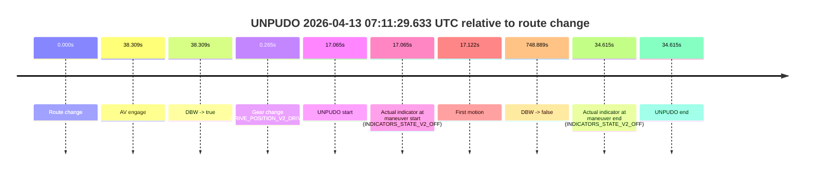
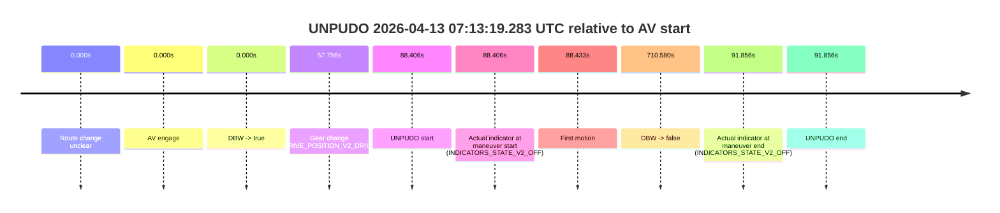
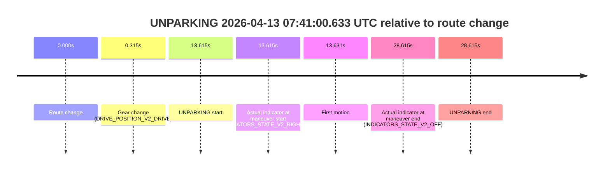
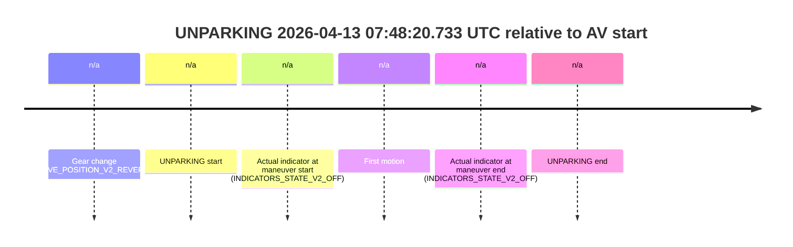

# Run Report: fme20018/2026-04-13--06-25-56--gen2-av-43a8f9ed-c52b-47f2-98ee-f7be12ff81c9

| Field | Value |
|---|---|
| Run ID | `fme20018/2026-04-13--06-25-56--gen2-av-43a8f9ed-c52b-47f2-98ee-f7be12ff81c9` |
| Date | `2026-04-13` |
| Model(s) | `lively-orange-horse` |
| Author | `guy.geva` |
| Event count | `7` |

## unpudo 2026-04-13 06:29:57.683 UTC

| Field | Value |
|---|---|
| Model | `lively-orange-horse` |
| Author | `guy.geva` |
| Run ID | `fme20018/2026-04-13--06-25-56--gen2-av-43a8f9ed-c52b-47f2-98ee-f7be12ff81c9` |
| Date | `2026-04-13` |
| Time (UTC) | `06:29:57.683` |
| Event type | `unpudo` |
| Disengagement type | `failed_to_unpudo` |
| Route change | `found` |
| Console | [run](https://console.sso.wayve.ai/run/fme20018/2026-04-13--06-25-56--gen2-av-43a8f9ed-c52b-47f2-98ee-f7be12ff81c9?id=&time-unixus=1776061797683300) |
| Foxglove | [segment](https://app.foxglove.dev/wayve-on-prem/p/prj_0dX18KZdVHg1fmmI/view?ds=foxglove-stream&ds.deviceName=fme20018&ds.start=2026-04-13T06%3A29%3A35.868264Z&ds.end=2026-04-13T06%3A33%3A01.258761Z&layoutId=lay_0e7VD4WIKDQGU73Y&time=2026-04-13T06%3A29%3A57.683300Z) |

### Event card: fail

- Fail: AV owns part of the segment, but the event still resolves as a model-performance failure under the AV-only scoring rule.

| Event | Time (UTC) | Delta from route change |
|---|---:|---:|
| Route change | 2026-04-13 06:29:45.868 | `0.000s` |
| AV engage | 2026-04-13 06:30:09.498 | `23.630s` |
| DBW -> true | 2026-04-13 06:30:09.498 | `23.630s` |
| Gear change (DRIVE_POSITION_V2_DRIVE) | 2026-04-13 06:29:46.133 | `0.265s` |
| UNPUDO start | 2026-04-13 06:29:57.683 | `11.815s` |
| Actual indicator at maneuver start (INDICATORS_STATE_V2_OFF) | 2026-04-13 06:29:57.683 | `11.815s` |
| First motion | 2026-04-13 06:29:57.809 | `11.942s` |
| DBW -> false | 2026-04-13 06:32:51.258 | `185.390s` |
| Actual indicator at maneuver end (INDICATORS_STATE_V2_OFF) | 2026-04-13 06:30:03.983 | `18.115s` |
| UNPUDO end | 2026-04-13 06:30:03.983 | `18.115s` |

| Metric | Value |
|---|---|
| Outcome | `fail` |
| Effective failure type | `failed_to_unpudo` |
| Route change status | `found` |
| DBW at event start | `false` |
| DBW at event end | `false` |
| Predicted gear at AV start | `DRIVE_POSITION_V2_DRIVE` |
| Actual gear at AV start | `DRIVE_POSITION_V2_DRIVE` |
| Predicted gear at event start | `DRIVE_POSITION_V2_DRIVE` |
| Actual gear at event start | `DRIVE_POSITION_V2_DRIVE` |
| Planned indicator direction | `INDICATORS_STATE_V2_RIGHT_ON` |
| Controller indicator direction | `INDICATORS_STATE_V2_RIGHT_ON` |
| Actual indicator direction | `INDICATORS_STATE_V2_OFF` |
| Actual indicator at maneuver end | `INDICATORS_STATE_V2_OFF` |
| Driver accel help in AV | `false` |
| Driver accel help timestamp | `n/a` |
| Max accel pedal pct in AV | `0.0%` |
| Max brake pedal pct in AV | `0.0%` |
| Max speed mps in AV | `0.000` |
| Route -> AV | `23.630s` |
| AV -> event start | `-11.815s` |
| AV -> first motion | `-11.689s` |
| AV duration before disengagement | `161.760s` |
| Trajectory waypoint count | `37` |
| Driving-plan step count | `11` |

The scored portion starts from the AV-owned window, not from the pre-AV setup. Route-change search in the stopped pre-event segment was `found`, with the baseline therefore set to route change. At the event anchor the model predicts `DRIVE_POSITION_V2_DRIVE` and the actual gear is `DRIVE_POSITION_V2_DRIVE`. The effective model outcome is `fail` because `failed_to_unpudo`.

### Resolution

| Field | Value |
|---|---|
| Final outcome | `fail` |
| Do we agree with this label? | `yes` |
| Source disengagement type | `failed_to_unpudo` |
| Resolved effective failure type | `failed_to_unpudo` |
| Confidence | `high` |

## unpudo 2026-04-13 06:47:14.683 UTC

| Field | Value |
|---|---|
| Model | `lively-orange-horse` |
| Author | `guy.geva` |
| Run ID | `fme20018/2026-04-13--06-25-56--gen2-av-43a8f9ed-c52b-47f2-98ee-f7be12ff81c9` |
| Date | `2026-04-13` |
| Time (UTC) | `06:47:14.683` |
| Event type | `unpudo` |
| Disengagement type | `failed_to_unpudo` |
| Route change | `found` |
| Console | [run](https://console.sso.wayve.ai/run/fme20018/2026-04-13--06-25-56--gen2-av-43a8f9ed-c52b-47f2-98ee-f7be12ff81c9?id=&time-unixus=1776062834683313) |
| Foxglove | [segment](https://app.foxglove.dev/wayve-on-prem/p/prj_0dX18KZdVHg1fmmI/view?ds=foxglove-stream&ds.deviceName=fme20018&ds.start=2026-04-13T06%3A46%3A53.118280Z&ds.end=2026-04-13T06%3A52%3A30.276395Z&layoutId=lay_0e7VD4WIKDQGU73Y&time=2026-04-13T06%3A47%3A14.683313Z) |

### Event card: fail

- Fail: AV owns part of the segment, but the event still resolves as a model-performance failure under the AV-only scoring rule.

| Event | Time (UTC) | Delta from route change |
|---|---:|---:|
| Route change | 2026-04-13 06:47:03.118 | `0.000s` |
| AV engage | 2026-04-13 06:47:23.958 | `20.840s` |
| DBW -> true | 2026-04-13 06:47:23.958 | `20.840s` |
| Gear change (DRIVE_POSITION_V2_DRIVE) | 2026-04-13 06:47:08.183 | `5.065s` |
| UNPUDO start | 2026-04-13 06:47:14.683 | `11.565s` |
| Actual indicator at maneuver start (INDICATORS_STATE_V2_LEFT_ON) | 2026-04-13 06:47:14.683 | `11.565s` |
| First motion | 2026-04-13 06:47:14.830 | `11.712s` |
| DBW -> false | 2026-04-13 06:52:20.276 | `317.158s` |
| Actual indicator at maneuver end (INDICATORS_STATE_V2_OFF) | 2026-04-13 06:47:19.233 | `16.115s` |
| UNPUDO end | 2026-04-13 06:47:19.233 | `16.115s` |

| Metric | Value |
|---|---|
| Outcome | `fail` |
| Effective failure type | `failed_to_unpudo` |
| Route change status | `found` |
| DBW at event start | `false` |
| DBW at event end | `false` |
| Predicted gear at AV start | `DRIVE_POSITION_V2_DRIVE` |
| Actual gear at AV start | `DRIVE_POSITION_V2_DRIVE` |
| Predicted gear at event start | `DRIVE_POSITION_V2_DRIVE` |
| Actual gear at event start | `DRIVE_POSITION_V2_DRIVE` |
| Planned indicator direction | `INDICATORS_STATE_V2_LEFT_ON` |
| Controller indicator direction | `INDICATORS_STATE_V2_LEFT_ON` |
| Actual indicator direction | `INDICATORS_STATE_V2_LEFT_ON` |
| Actual indicator at maneuver end | `INDICATORS_STATE_V2_OFF` |
| Driver accel help in AV | `false` |
| Driver accel help timestamp | `n/a` |
| Max accel pedal pct in AV | `0.0%` |
| Max brake pedal pct in AV | `0.0%` |
| Max speed mps in AV | `0.000` |
| Route -> AV | `20.840s` |
| AV -> event start | `-9.275s` |
| AV -> first motion | `-9.128s` |
| AV duration before disengagement | `296.318s` |
| Trajectory waypoint count | `36` |
| Driving-plan step count | `11` |

The scored portion starts from the AV-owned window, not from the pre-AV setup. Route-change search in the stopped pre-event segment was `found`, with the baseline therefore set to route change. At the event anchor the model predicts `DRIVE_POSITION_V2_DRIVE` and the actual gear is `DRIVE_POSITION_V2_DRIVE`. The effective model outcome is `fail` because `failed_to_unpudo`.

### Resolution

| Field | Value |
|---|---|
| Final outcome | `fail` |
| Do we agree with this label? | `yes` |
| Source disengagement type | `failed_to_unpudo` |
| Resolved effective failure type | `failed_to_unpudo` |
| Confidence | `high` |

## unpudo 2026-04-13 06:52:20.883 UTC

| Field | Value |
|---|---|
| Model | `lively-orange-horse` |
| Author | `guy.geva` |
| Run ID | `fme20018/2026-04-13--06-25-56--gen2-av-43a8f9ed-c52b-47f2-98ee-f7be12ff81c9` |
| Date | `2026-04-13` |
| Time (UTC) | `06:52:20.883` |
| Event type | `unpudo` |
| Disengagement type | `failed_to_unpudo` |
| Route change | `found` |
| Console | [run](https://console.sso.wayve.ai/run/fme20018/2026-04-13--06-25-56--gen2-av-43a8f9ed-c52b-47f2-98ee-f7be12ff81c9?id=&time-unixus=1776063140883303) |
| Foxglove | [segment](https://app.foxglove.dev/wayve-on-prem/p/prj_0dX18KZdVHg1fmmI/view?ds=foxglove-stream&ds.deviceName=fme20018&ds.start=2026-04-13T06%3A50%3A47.568989Z&ds.end=2026-04-13T06%3A54%3A06.777147Z&layoutId=lay_0e7VD4WIKDQGU73Y&time=2026-04-13T06%3A52%3A20.883303Z) |

### Event card: fail

- Fail: AV owns part of the segment, but the event still resolves as a model-performance failure under the AV-only scoring rule.

| Event | Time (UTC) | Delta from route change |
|---|---:|---:|
| Route change | 2026-04-13 06:50:57.568 | `0.000s` |
| AV engage | 2026-04-13 06:52:29.918 | `92.349s` |
| DBW -> true | 2026-04-13 06:52:29.918 | `92.349s` |
| Gear change (DRIVE_POSITION_V2_DRIVE) | 2026-04-13 06:52:09.633 | `72.064s` |
| UNPUDO start | 2026-04-13 06:52:20.883 | `83.314s` |
| Actual indicator at maneuver start (INDICATORS_STATE_V2_OFF) | 2026-04-13 06:52:20.883 | `83.314s` |
| First motion | 2026-04-13 06:52:20.929 | `83.361s` |
| DBW -> false | 2026-04-13 06:53:56.777 | `179.208s` |
| Actual indicator at maneuver end (INDICATORS_STATE_V2_OFF) | 2026-04-13 06:52:25.333 | `87.764s` |
| UNPUDO end | 2026-04-13 06:52:25.333 | `87.764s` |

| Metric | Value |
|---|---|
| Outcome | `fail` |
| Effective failure type | `failed_to_unpudo` |
| Route change status | `found` |
| DBW at event start | `false` |
| DBW at event end | `false` |
| Predicted gear at AV start | `DRIVE_POSITION_V2_DRIVE` |
| Actual gear at AV start | `DRIVE_POSITION_V2_DRIVE` |
| Predicted gear at event start | `DRIVE_POSITION_V2_DRIVE` |
| Actual gear at event start | `DRIVE_POSITION_V2_DRIVE` |
| Planned indicator direction | `INDICATORS_STATE_V2_RIGHT_ON` |
| Controller indicator direction | `INDICATORS_STATE_V2_RIGHT_ON` |
| Actual indicator direction | `INDICATORS_STATE_V2_OFF` |
| Actual indicator at maneuver end | `INDICATORS_STATE_V2_OFF` |
| Driver accel help in AV | `false` |
| Driver accel help timestamp | `n/a` |
| Max accel pedal pct in AV | `0.0%` |
| Max brake pedal pct in AV | `0.0%` |
| Max speed mps in AV | `0.000` |
| Route -> AV | `92.349s` |
| AV -> event start | `-9.035s` |
| AV -> first motion | `-8.989s` |
| AV duration before disengagement | `86.859s` |
| Trajectory waypoint count | `36` |
| Driving-plan step count | `11` |

The scored portion starts from the AV-owned window, not from the pre-AV setup. Route-change search in the stopped pre-event segment was `found`, with the baseline therefore set to route change. At the event anchor the model predicts `DRIVE_POSITION_V2_DRIVE` and the actual gear is `DRIVE_POSITION_V2_DRIVE`. The effective model outcome is `fail` because `failed_to_unpudo`.

### Resolution

| Field | Value |
|---|---|
| Final outcome | `fail` |
| Do we agree with this label? | `yes` |
| Source disengagement type | `failed_to_unpudo` |
| Resolved effective failure type | `failed_to_unpudo` |
| Confidence | `high` |

## unpudo 2026-04-13 07:11:29.633 UTC

| Field | Value |
|---|---|
| Model | `lively-orange-horse` |
| Author | `guy.geva` |
| Run ID | `fme20018/2026-04-13--06-25-56--gen2-av-43a8f9ed-c52b-47f2-98ee-f7be12ff81c9` |
| Date | `2026-04-13` |
| Time (UTC) | `07:11:29.633` |
| Event type | `unpudo` |
| Disengagement type | `failed_to_unpudo` |
| Route change | `found` |
| Console | [run](https://console.sso.wayve.ai/run/fme20018/2026-04-13--06-25-56--gen2-av-43a8f9ed-c52b-47f2-98ee-f7be12ff81c9?id=&time-unixus=1776064289633311) |
| Foxglove | [segment](https://app.foxglove.dev/wayve-on-prem/p/prj_0dX18KZdVHg1fmmI/view?ds=foxglove-stream&ds.deviceName=fme20018&ds.start=2026-04-13T07%3A11%3A02.568281Z&ds.end=2026-04-13T07%3A23%3A51.457192Z&layoutId=lay_0e7VD4WIKDQGU73Y&time=2026-04-13T07%3A11%3A29.633311Z) |

### Event card: fail

- Fail: AV owns part of the segment, but the event still resolves as a model-performance failure under the AV-only scoring rule.

| Event | Time (UTC) | Delta from route change |
|---|---:|---:|
| Route change | 2026-04-13 07:11:12.568 | `0.000s` |
| AV engage | 2026-04-13 07:11:50.877 | `38.309s` |
| DBW -> true | 2026-04-13 07:11:50.877 | `38.309s` |
| Gear change (DRIVE_POSITION_V2_DRIVE) | 2026-04-13 07:11:12.833 | `0.265s` |
| UNPUDO start | 2026-04-13 07:11:29.633 | `17.065s` |
| Actual indicator at maneuver start (INDICATORS_STATE_V2_OFF) | 2026-04-13 07:11:29.633 | `17.065s` |
| First motion | 2026-04-13 07:11:29.690 | `17.122s` |
| DBW -> false | 2026-04-13 07:23:41.457 | `748.889s` |
| Actual indicator at maneuver end (INDICATORS_STATE_V2_OFF) | 2026-04-13 07:11:47.183 | `34.615s` |
| UNPUDO end | 2026-04-13 07:11:47.183 | `34.615s` |

| Metric | Value |
|---|---|
| Outcome | `fail` |
| Effective failure type | `failed_to_unpudo` |
| Route change status | `found` |
| DBW at event start | `false` |
| DBW at event end | `false` |
| Predicted gear at AV start | `DRIVE_POSITION_V2_DRIVE` |
| Actual gear at AV start | `DRIVE_POSITION_V2_DRIVE` |
| Predicted gear at event start | `DRIVE_POSITION_V2_DRIVE` |
| Actual gear at event start | `DRIVE_POSITION_V2_DRIVE` |
| Planned indicator direction | `INDICATORS_STATE_V2_RIGHT_ON` |
| Controller indicator direction | `INDICATORS_STATE_V2_RIGHT_ON` |
| Actual indicator direction | `INDICATORS_STATE_V2_OFF` |
| Actual indicator at maneuver end | `INDICATORS_STATE_V2_OFF` |
| Driver accel help in AV | `false` |
| Driver accel help timestamp | `n/a` |
| Max accel pedal pct in AV | `0.0%` |
| Max brake pedal pct in AV | `0.0%` |
| Max speed mps in AV | `0.000` |
| Route -> AV | `38.309s` |
| AV -> event start | `-21.244s` |
| AV -> first motion | `-21.187s` |
| AV duration before disengagement | `710.580s` |
| Trajectory waypoint count | `37` |
| Driving-plan step count | `11` |

The scored portion starts from the AV-owned window, not from the pre-AV setup. Route-change search in the stopped pre-event segment was `found`, with the baseline therefore set to route change. At the event anchor the model predicts `DRIVE_POSITION_V2_DRIVE` and the actual gear is `DRIVE_POSITION_V2_DRIVE`. The effective model outcome is `fail` because `failed_to_unpudo`.

### Resolution

| Field | Value |
|---|---|
| Final outcome | `fail` |
| Do we agree with this label? | `yes` |
| Source disengagement type | `failed_to_unpudo` |
| Resolved effective failure type | `failed_to_unpudo` |
| Confidence | `high` |

## unpudo 2026-04-13 07:13:19.283 UTC

| Field | Value |
|---|---|
| Model | `lively-orange-horse` |
| Author | `guy.geva` |
| Run ID | `fme20018/2026-04-13--06-25-56--gen2-av-43a8f9ed-c52b-47f2-98ee-f7be12ff81c9` |
| Date | `2026-04-13` |
| Time (UTC) | `07:13:19.283` |
| Event type | `unpudo` |
| Disengagement type | `none observed` |
| Route change | `unclear` |
| Console | [run](https://console.sso.wayve.ai/run/fme20018/2026-04-13--06-25-56--gen2-av-43a8f9ed-c52b-47f2-98ee-f7be12ff81c9?id=&time-unixus=1776064399283295) |
| Foxglove | [segment](https://app.foxglove.dev/wayve-on-prem/p/prj_0dX18KZdVHg1fmmI/view?ds=foxglove-stream&ds.deviceName=fme20018&ds.start=2026-04-13T07%3A11%3A40.877016Z&ds.end=2026-04-13T07%3A23%3A51.457192Z&layoutId=lay_0e7VD4WIKDQGU73Y&time=2026-04-13T07%3A13%3A19.283295Z) |

### Event card: pass

- Pass: AV owns the credited unpudo through the official event window, the gear state is aligned at the anchor, and the vehicle moves without driver accelerator help in AV.

| Event | Time (UTC) | Delta from AV start |
|---|---:|---:|
| Route change unclear | 2026-04-13 07:11:50.877 | `0.000s` |
| AV engage | 2026-04-13 07:11:50.877 | `0.000s` |
| DBW -> true | 2026-04-13 07:11:50.877 | `0.000s` |
| Gear change (DRIVE_POSITION_V2_DRIVE) | 2026-04-13 07:12:48.633 | `57.756s` |
| UNPUDO start | 2026-04-13 07:13:19.283 | `88.406s` |
| Actual indicator at maneuver start (INDICATORS_STATE_V2_OFF) | 2026-04-13 07:13:19.283 | `88.406s` |
| First motion | 2026-04-13 07:13:19.309 | `88.433s` |
| DBW -> false | 2026-04-13 07:23:41.457 | `710.580s` |
| Actual indicator at maneuver end (INDICATORS_STATE_V2_OFF) | 2026-04-13 07:13:22.733 | `91.856s` |
| UNPUDO end | 2026-04-13 07:13:22.733 | `91.856s` |

| Metric | Value |
|---|---|
| Outcome | `pass` |
| Effective failure type | `none` |
| Route change status | `unclear` |
| DBW at event start | `true` |
| DBW at event end | `true` |
| Predicted gear at AV start | `DRIVE_POSITION_V2_DRIVE` |
| Actual gear at AV start | `DRIVE_POSITION_V2_DRIVE` |
| Predicted gear at event start | `DRIVE_POSITION_V2_DRIVE` |
| Actual gear at event start | `DRIVE_POSITION_V2_DRIVE` |
| Planned indicator direction | `INDICATORS_STATE_V2_OFF` |
| Controller indicator direction | `INDICATORS_STATE_V2_OFF` |
| Actual indicator direction | `INDICATORS_STATE_V2_OFF` |
| Actual indicator at maneuver end | `INDICATORS_STATE_V2_OFF` |
| Driver accel help in AV | `false` |
| Driver accel help timestamp | `n/a` |
| Max accel pedal pct in AV | `0.0%` |
| Max brake pedal pct in AV | `8.9%` |
| Max speed mps in AV | `8.222` |
| Route -> AV | `n/a` |
| AV -> event start | `88.406s` |
| AV -> first motion | `88.433s` |
| AV duration before disengagement | `710.580s` |
| Trajectory waypoint count | `37` |
| Driving-plan step count | `11` |

The scored portion starts from the AV-owned window, not from the pre-AV setup. Route-change search in the stopped pre-event segment was `unclear`, with the baseline therefore set to AV start. At the event anchor the model predicts `DRIVE_POSITION_V2_DRIVE` and the actual gear is `DRIVE_POSITION_V2_DRIVE`. The effective model outcome is `pass` because `the credited maneuver stays AV-owned through the official event end`.

### Resolution

| Field | Value |
|---|---|
| Final outcome | `pass` |
| Do we agree with this label? | `yes` |
| Source disengagement type | `none observed` |
| Resolved effective failure type | `none` |
| Confidence | `medium` |

## unparking 2026-04-13 07:41:00.633 UTC

| Field | Value |
|---|---|
| Model | `lively-orange-horse` |
| Author | `guy.geva` |
| Run ID | `fme20018/2026-04-13--06-25-56--gen2-av-43a8f9ed-c52b-47f2-98ee-f7be12ff81c9` |
| Date | `2026-04-13` |
| Time (UTC) | `07:41:00.633` |
| Event type | `unparking` |
| Disengagement type | `end_of_run` |
| Route change | `found` |
| Console | [run](https://console.sso.wayve.ai/run/fme20018/2026-04-13--06-25-56--gen2-av-43a8f9ed-c52b-47f2-98ee-f7be12ff81c9?id=&time-unixus=1776066060633311) |
| Foxglove | [segment](https://app.foxglove.dev/wayve-on-prem/p/prj_0dX18KZdVHg1fmmI/view?ds=foxglove-stream&ds.deviceName=fme20018&ds.start=2026-04-13T07%3A40%3A37.018689Z&ds.end=2026-04-13T07%3A41%3A25.633309Z&layoutId=lay_0e7VD4WIKDQGU73Y&time=2026-04-13T07%3A41%3A00.633311Z) |

### Event card: fail

- Fail: AV owns part of the segment, but the event still resolves as a model-performance failure under the AV-only scoring rule.

| Event | Time (UTC) | Delta from route change |
|---|---:|---:|
| Route change | 2026-04-13 07:40:47.018 | `0.000s` |
| Gear change (DRIVE_POSITION_V2_DRIVE) | 2026-04-13 07:40:47.333 | `0.315s` |
| UNPARKING start | 2026-04-13 07:41:00.633 | `13.615s` |
| Actual indicator at maneuver start (INDICATORS_STATE_V2_RIGHT_ON) | 2026-04-13 07:41:00.633 | `13.615s` |
| First motion | 2026-04-13 07:41:00.649 | `13.631s` |
| Actual indicator at maneuver end (INDICATORS_STATE_V2_OFF) | 2026-04-13 07:41:15.633 | `28.615s` |
| UNPARKING end | 2026-04-13 07:41:15.633 | `28.615s` |

| Metric | Value |
|---|---|
| Outcome | `fail` |
| Effective failure type | `end_of_run` |
| Route change status | `found` |
| DBW at event start | `false` |
| DBW at event end | `false` |
| Predicted gear at AV start | `n/a` |
| Actual gear at AV start | `n/a` |
| Predicted gear at event start | `DRIVE_POSITION_V2_DRIVE` |
| Actual gear at event start | `DRIVE_POSITION_V2_DRIVE` |
| Planned indicator direction | `INDICATORS_STATE_V2_OFF` |
| Controller indicator direction | `INDICATORS_STATE_V2_OFF` |
| Actual indicator direction | `INDICATORS_STATE_V2_RIGHT_ON` |
| Actual indicator at maneuver end | `INDICATORS_STATE_V2_OFF` |
| Driver accel help in AV | `false` |
| Driver accel help timestamp | `n/a` |
| Max accel pedal pct in AV | `0.0%` |
| Max brake pedal pct in AV | `0.0%` |
| Max speed mps in AV | `0.000` |
| Route -> AV | `n/a` |
| AV -> event start | `n/a` |
| AV -> first motion | `n/a` |
| AV duration before disengagement | `n/a` |
| Trajectory waypoint count | `37` |
| Driving-plan step count | `11` |

The scored portion starts from the AV-owned window, not from the pre-AV setup. Route-change search in the stopped pre-event segment was `found`, with the baseline therefore set to route change. At the event anchor the model predicts `DRIVE_POSITION_V2_DRIVE` and the actual gear is `DRIVE_POSITION_V2_DRIVE`. The effective model outcome is `fail` because `end_of_run`.

### Resolution

| Field | Value |
|---|---|
| Final outcome | `fail` |
| Do we agree with this label? | `yes` |
| Source disengagement type | `end_of_run` |
| Resolved effective failure type | `end_of_run` |
| Confidence | `high` |

## unparking 2026-04-13 07:48:20.733 UTC

| Field | Value |
|---|---|
| Model | `lively-orange-horse` |
| Author | `guy.geva` |
| Run ID | `fme20018/2026-04-13--06-25-56--gen2-av-43a8f9ed-c52b-47f2-98ee-f7be12ff81c9` |
| Date | `2026-04-13` |
| Time (UTC) | `07:48:20.733` |
| Event type | `unparking` |
| Disengagement type | `none observed` |
| Route change | `unclear` |
| Console | [run](https://console.sso.wayve.ai/run/fme20018/2026-04-13--06-25-56--gen2-av-43a8f9ed-c52b-47f2-98ee-f7be12ff81c9?id=&time-unixus=1776066500733317) |
| Foxglove | [segment](https://app.foxglove.dev/wayve-on-prem/p/prj_0dX18KZdVHg1fmmI/view?ds=foxglove-stream&ds.deviceName=fme20018&ds.start=2026-04-13T07%3A48%3A05.133308Z&ds.end=2026-04-13T07%3A48%3A30.733317Z&layoutId=lay_0e7VD4WIKDQGU73Y&time=2026-04-13T07%3A48%3A20.733317Z) |

### Event card: fail

- Fail: the credited unparking does not stay AV-owned. The event window starts with DBW false, and the maneuver outcome lands outside a clean AV-owned segment.

| Event | Time (UTC) | Delta from AV start |
|---|---:|---:|
| Gear change (DRIVE_POSITION_V2_REVERSE) | 2026-04-13 07:48:15.133 | `n/a` |
| UNPARKING start | 2026-04-13 07:48:20.733 | `n/a` |
| Actual indicator at maneuver start (INDICATORS_STATE_V2_OFF) | 2026-04-13 07:48:20.733 | `n/a` |
| First motion | 2026-04-13 07:48:22.729 | `n/a` |
| Actual indicator at maneuver end (INDICATORS_STATE_V2_OFF) | 2026-04-13 07:48:20.733 | `n/a` |
| UNPARKING end | 2026-04-13 07:48:20.733 | `n/a` |

| Metric | Value |
|---|---|
| Outcome | `fail` |
| Effective failure type | `not_av_owned` |
| Route change status | `unclear` |
| DBW at event start | `false` |
| DBW at event end | `false` |
| Predicted gear at AV start | `n/a` |
| Actual gear at AV start | `n/a` |
| Predicted gear at event start | `DRIVE_POSITION_V2_DRIVE` |
| Actual gear at event start | `DRIVE_POSITION_V2_REVERSE` |
| Planned indicator direction | `INDICATORS_STATE_V2_OFF` |
| Controller indicator direction | `INDICATORS_STATE_V2_OFF` |
| Actual indicator direction | `INDICATORS_STATE_V2_OFF` |
| Actual indicator at maneuver end | `INDICATORS_STATE_V2_OFF` |
| Driver accel help in AV | `false` |
| Driver accel help timestamp | `n/a` |
| Max accel pedal pct in AV | `0.0%` |
| Max brake pedal pct in AV | `0.0%` |
| Max speed mps in AV | `0.000` |
| Route -> AV | `n/a` |
| AV -> event start | `n/a` |
| AV -> first motion | `n/a` |
| AV duration before disengagement | `n/a` |
| Trajectory waypoint count | `37` |
| Driving-plan step count | `11` |

The scored portion starts from the AV-owned window, not from the pre-AV setup. Route-change search in the stopped pre-event segment was `unclear`, with the baseline therefore set to AV start. At the event anchor the model predicts `DRIVE_POSITION_V2_DRIVE` and the actual gear is `DRIVE_POSITION_V2_REVERSE`. The effective model outcome is `fail` because `not_av_owned`.

### Resolution

| Field | Value |
|---|---|
| Final outcome | `fail` |
| Do we agree with this label? | `yes` |
| Source disengagement type | `none observed` |
| Resolved effective failure type | `not_av_owned` |
| Confidence | `medium` |
