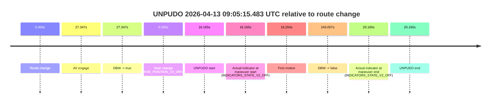
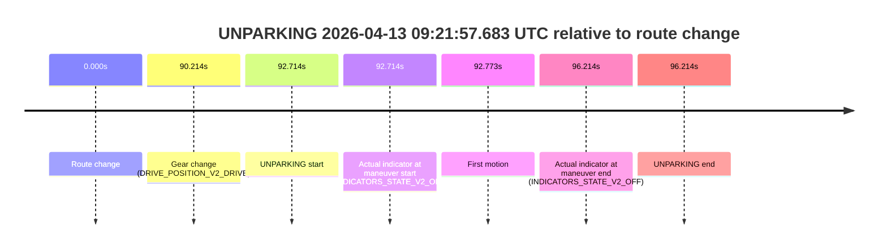

# Run Report: fme20018/2026-04-13--08-39-53--gen2-av-aaaa01a2-2395-48ac-8ab8-f9f338dd0ad4

| Field | Value |
|---|---|
| Run ID | `fme20018/2026-04-13--08-39-53--gen2-av-aaaa01a2-2395-48ac-8ab8-f9f338dd0ad4` |
| Date | `2026-04-13` |
| Model(s) | `lively-orange-horse` |
| Author | `guy.geva` |
| Event count | `6` |

## unpudo 2026-04-13 08:46:54.783 UTC

| Field | Value |
|---|---|
| Model | `lively-orange-horse` |
| Author | `guy.geva` |
| Run ID | `fme20018/2026-04-13--08-39-53--gen2-av-aaaa01a2-2395-48ac-8ab8-f9f338dd0ad4` |
| Date | `2026-04-13` |
| Time (UTC) | `08:46:54.783` |
| Event type | `unpudo` |
| Disengagement type | `none observed` |
| Route change | `found` |
| Console | [run](https://console.sso.wayve.ai/run/fme20018/2026-04-13--08-39-53--gen2-av-aaaa01a2-2395-48ac-8ab8-f9f338dd0ad4?id=&time-unixus=1776070014783313) |
| Foxglove | [segment](https://app.foxglove.dev/wayve-on-prem/p/prj_0dX18KZdVHg1fmmI/view?ds=foxglove-stream&ds.deviceName=fme20018&ds.start=2026-04-13T08%3A46%3A00.468295Z&ds.end=2026-04-13T08%3A49%3A48.184522Z&layoutId=lay_0e7VD4WIKDQGU73Y&time=2026-04-13T08%3A46%3A54.783313Z) |

### Event card: pass

- Pass: AV owns the credited unpudo through the official event window, the gear state is aligned at the anchor, and the vehicle moves without driver accelerator help in AV.

| Event | Time (UTC) | Delta from route change |
|---|---:|---:|
| Route change | 2026-04-13 08:46:10.468 | `0.000s` |
| AV engage | 2026-04-13 08:46:10.474 | `0.006s` |
| DBW -> true | 2026-04-13 08:46:10.474 | `0.006s` |
| Gear change (DRIVE_POSITION_V2_DRIVE) | 2026-04-13 08:46:10.883 | `0.415s` |
| UNPUDO start | 2026-04-13 08:46:54.783 | `44.315s` |
| Actual indicator at maneuver start (INDICATORS_STATE_V2_OFF) | 2026-04-13 08:46:54.783 | `44.315s` |
| First motion | 2026-04-13 08:46:54.822 | `44.354s` |
| DBW -> false | 2026-04-13 08:49:38.184 | `207.716s` |
| Actual indicator at maneuver end (INDICATORS_STATE_V2_OFF) | 2026-04-13 08:48:01.983 | `111.515s` |
| UNPUDO end | 2026-04-13 08:48:01.983 | `111.515s` |

| Metric | Value |
|---|---|
| Outcome | `pass` |
| Effective failure type | `none` |
| Route change status | `found` |
| DBW at event start | `true` |
| DBW at event end | `true` |
| Predicted gear at AV start | `DRIVE_POSITION_V2_PARK` |
| Actual gear at AV start | `DRIVE_POSITION_V2_PARK` |
| Predicted gear at event start | `DRIVE_POSITION_V2_DRIVE` |
| Actual gear at event start | `DRIVE_POSITION_V2_DRIVE` |
| Planned indicator direction | `INDICATORS_STATE_V2_OFF` |
| Controller indicator direction | `INDICATORS_STATE_V2_OFF` |
| Actual indicator direction | `INDICATORS_STATE_V2_OFF` |
| Actual indicator at maneuver end | `INDICATORS_STATE_V2_OFF` |
| Driver accel help in AV | `false` |
| Driver accel help timestamp | `n/a` |
| Max accel pedal pct in AV | `0.0%` |
| Max brake pedal pct in AV | `8.0%` |
| Max speed mps in AV | `2.286` |
| Route -> AV | `0.006s` |
| AV -> event start | `44.309s` |
| AV -> first motion | `44.348s` |
| AV duration before disengagement | `207.710s` |
| Trajectory waypoint count | `37` |
| Driving-plan step count | `11` |

The scored portion starts from the AV-owned window, not from the pre-AV setup. Route-change search in the stopped pre-event segment was `found`, with the baseline therefore set to route change. At the event anchor the model predicts `DRIVE_POSITION_V2_DRIVE` and the actual gear is `DRIVE_POSITION_V2_DRIVE`. The effective model outcome is `pass` because `the credited maneuver stays AV-owned through the official event end`.

### Resolution

| Field | Value |
|---|---|
| Final outcome | `pass` |
| Do we agree with this label? | `yes` |
| Source disengagement type | `none observed` |
| Resolved effective failure type | `none` |
| Confidence | `high` |

## unpudo 2026-04-13 09:01:38.783 UTC

| Field | Value |
|---|---|
| Model | `lively-orange-horse` |
| Author | `guy.geva` |
| Run ID | `fme20018/2026-04-13--08-39-53--gen2-av-aaaa01a2-2395-48ac-8ab8-f9f338dd0ad4` |
| Date | `2026-04-13` |
| Time (UTC) | `09:01:38.783` |
| Event type | `unpudo` |
| Disengagement type | `failed_to_unpudo` |
| Route change | `found` |
| Console | [run](https://console.sso.wayve.ai/run/fme20018/2026-04-13--08-39-53--gen2-av-aaaa01a2-2395-48ac-8ab8-f9f338dd0ad4?id=&time-unixus=1776070898783296) |
| Foxglove | [segment](https://app.foxglove.dev/wayve-on-prem/p/prj_0dX18KZdVHg1fmmI/view?ds=foxglove-stream&ds.deviceName=fme20018&ds.start=2026-04-13T09%3A01%3A16.768382Z&ds.end=2026-04-13T09%3A05%3A24.964515Z&layoutId=lay_0e7VD4WIKDQGU73Y&time=2026-04-13T09%3A01%3A38.783296Z) |

### Event card: fail

- Fail: AV owns part of the segment, but the event still resolves as a model-performance failure under the AV-only scoring rule.

| Event | Time (UTC) | Delta from route change |
|---|---:|---:|
| Route change | 2026-04-13 09:01:26.768 | `0.000s` |
| AV engage | 2026-04-13 09:01:48.703 | `21.935s` |
| DBW -> true | 2026-04-13 09:01:48.703 | `21.935s` |
| Gear change (DRIVE_POSITION_V2_DRIVE) | 2026-04-13 09:01:27.083 | `0.315s` |
| UNPUDO start | 2026-04-13 09:01:38.783 | `12.015s` |
| Actual indicator at maneuver start (INDICATORS_STATE_V2_OFF) | 2026-04-13 09:01:38.783 | `12.015s` |
| First motion | 2026-04-13 09:01:38.822 | `12.054s` |
| DBW -> false | 2026-04-13 09:05:14.964 | `228.196s` |
| Actual indicator at maneuver end (INDICATORS_STATE_V2_OFF) | 2026-04-13 09:02:39.033 | `72.265s` |
| UNPUDO end | 2026-04-13 09:02:39.033 | `72.265s` |

| Metric | Value |
|---|---|
| Outcome | `fail` |
| Effective failure type | `failed_to_unpudo` |
| Route change status | `found` |
| DBW at event start | `false` |
| DBW at event end | `true` |
| Predicted gear at AV start | `DRIVE_POSITION_V2_DRIVE` |
| Actual gear at AV start | `DRIVE_POSITION_V2_DRIVE` |
| Predicted gear at event start | `DRIVE_POSITION_V2_DRIVE` |
| Actual gear at event start | `DRIVE_POSITION_V2_DRIVE` |
| Planned indicator direction | `INDICATORS_STATE_V2_LEFT_ON` |
| Controller indicator direction | `INDICATORS_STATE_V2_LEFT_ON` |
| Actual indicator direction | `INDICATORS_STATE_V2_OFF` |
| Actual indicator at maneuver end | `INDICATORS_STATE_V2_OFF` |
| Driver accel help in AV | `false` |
| Driver accel help timestamp | `n/a` |
| Max accel pedal pct in AV | `0.0%` |
| Max brake pedal pct in AV | `8.0%` |
| Max speed mps in AV | `2.272` |
| Route -> AV | `21.935s` |
| AV -> event start | `-9.920s` |
| AV -> first motion | `-9.881s` |
| AV duration before disengagement | `206.261s` |
| Trajectory waypoint count | `37` |
| Driving-plan step count | `11` |

The scored portion starts from the AV-owned window, not from the pre-AV setup. Route-change search in the stopped pre-event segment was `found`, with the baseline therefore set to route change. At the event anchor the model predicts `DRIVE_POSITION_V2_DRIVE` and the actual gear is `DRIVE_POSITION_V2_DRIVE`. The effective model outcome is `fail` because `failed_to_unpudo`.

### Resolution

| Field | Value |
|---|---|
| Final outcome | `fail` |
| Do we agree with this label? | `yes` |
| Source disengagement type | `failed_to_unpudo` |
| Resolved effective failure type | `failed_to_unpudo` |
| Confidence | `high` |

## unpudo 2026-04-13 09:05:15.483 UTC

| Field | Value |
|---|---|
| Model | `lively-orange-horse` |
| Author | `guy.geva` |
| Run ID | `fme20018/2026-04-13--08-39-53--gen2-av-aaaa01a2-2395-48ac-8ab8-f9f338dd0ad4` |
| Date | `2026-04-13` |
| Time (UTC) | `09:05:15.483` |
| Event type | `unpudo` |
| Disengagement type | `failed_to_unpudo` |
| Route change | `found` |
| Console | [run](https://console.sso.wayve.ai/run/fme20018/2026-04-13--08-39-53--gen2-av-aaaa01a2-2395-48ac-8ab8-f9f338dd0ad4?id=&time-unixus=1776071115483301) |
| Foxglove | [segment](https://app.foxglove.dev/wayve-on-prem/p/prj_0dX18KZdVHg1fmmI/view?ds=foxglove-stream&ds.deviceName=fme20018&ds.start=2026-04-13T09%3A04%3A49.318363Z&ds.end=2026-04-13T09%3A09%3A12.375609Z&layoutId=lay_0e7VD4WIKDQGU73Y&time=2026-04-13T09%3A05%3A15.483301Z) |

### Event card: fail

- Fail: AV owns part of the segment, but the event still resolves as a model-performance failure under the AV-only scoring rule.

| Event | Time (UTC) | Delta from route change |
|---|---:|---:|
| Route change | 2026-04-13 09:04:59.318 | `0.000s` |
| AV engage | 2026-04-13 09:05:26.665 | `27.347s` |
| DBW -> true | 2026-04-13 09:05:26.665 | `27.347s` |
| Gear change (DRIVE_POSITION_V2_DRIVE) | 2026-04-13 09:04:59.683 | `0.365s` |
| UNPUDO start | 2026-04-13 09:05:15.483 | `16.165s` |
| Actual indicator at maneuver start (INDICATORS_STATE_V2_OFF) | 2026-04-13 09:05:15.483 | `16.165s` |
| First motion | 2026-04-13 09:05:15.522 | `16.204s` |
| DBW -> false | 2026-04-13 09:09:02.375 | `243.057s` |
| Actual indicator at maneuver end (INDICATORS_STATE_V2_OFF) | 2026-04-13 09:05:19.483 | `20.165s` |
| UNPUDO end | 2026-04-13 09:05:19.483 | `20.165s` |

| Metric | Value |
|---|---|
| Outcome | `fail` |
| Effective failure type | `failed_to_unpudo` |
| Route change status | `found` |
| DBW at event start | `false` |
| DBW at event end | `false` |
| Predicted gear at AV start | `DRIVE_POSITION_V2_DRIVE` |
| Actual gear at AV start | `DRIVE_POSITION_V2_DRIVE` |
| Predicted gear at event start | `DRIVE_POSITION_V2_DRIVE` |
| Actual gear at event start | `DRIVE_POSITION_V2_DRIVE` |
| Planned indicator direction | `INDICATORS_STATE_V2_RIGHT_ON` |
| Controller indicator direction | `INDICATORS_STATE_V2_RIGHT_ON` |
| Actual indicator direction | `INDICATORS_STATE_V2_OFF` |
| Actual indicator at maneuver end | `INDICATORS_STATE_V2_OFF` |
| Driver accel help in AV | `false` |
| Driver accel help timestamp | `n/a` |
| Max accel pedal pct in AV | `0.0%` |
| Max brake pedal pct in AV | `0.0%` |
| Max speed mps in AV | `0.000` |
| Route -> AV | `27.347s` |
| AV -> event start | `-11.182s` |
| AV -> first motion | `-11.143s` |
| AV duration before disengagement | `215.710s` |
| Trajectory waypoint count | `37` |
| Driving-plan step count | `11` |

The scored portion starts from the AV-owned window, not from the pre-AV setup. Route-change search in the stopped pre-event segment was `found`, with the baseline therefore set to route change. At the event anchor the model predicts `DRIVE_POSITION_V2_DRIVE` and the actual gear is `DRIVE_POSITION_V2_DRIVE`. The effective model outcome is `fail` because `failed_to_unpudo`.

### Resolution

| Field | Value |
|---|---|
| Final outcome | `fail` |
| Do we agree with this label? | `yes` |
| Source disengagement type | `failed_to_unpudo` |
| Resolved effective failure type | `failed_to_unpudo` |
| Confidence | `high` |

## unpudo 2026-04-13 09:13:03.783 UTC

| Field | Value |
|---|---|
| Model | `lively-orange-horse` |
| Author | `guy.geva` |
| Run ID | `fme20018/2026-04-13--08-39-53--gen2-av-aaaa01a2-2395-48ac-8ab8-f9f338dd0ad4` |
| Date | `2026-04-13` |
| Time (UTC) | `09:13:03.783` |
| Event type | `unpudo` |
| Disengagement type | `failed_to_unpudo` |
| Route change | `found` |
| Console | [run](https://console.sso.wayve.ai/run/fme20018/2026-04-13--08-39-53--gen2-av-aaaa01a2-2395-48ac-8ab8-f9f338dd0ad4?id=&time-unixus=1776071583783302) |
| Foxglove | [segment](https://app.foxglove.dev/wayve-on-prem/p/prj_0dX18KZdVHg1fmmI/view?ds=foxglove-stream&ds.deviceName=fme20018&ds.start=2026-04-13T09%3A12%3A27.968279Z&ds.end=2026-04-13T09%3A15%3A42.654339Z&layoutId=lay_0e7VD4WIKDQGU73Y&time=2026-04-13T09%3A13%3A03.783302Z) |

### Event card: fail

- Fail: AV owns part of the segment, but the event still resolves as a model-performance failure under the AV-only scoring rule.

| Event | Time (UTC) | Delta from route change |
|---|---:|---:|
| Route change | 2026-04-13 09:12:37.968 | `0.000s` |
| AV engage | 2026-04-13 09:13:15.864 | `37.896s` |
| DBW -> true | 2026-04-13 09:13:15.864 | `37.896s` |
| Gear change (DRIVE_POSITION_V2_DRIVE) | 2026-04-13 09:12:38.283 | `0.315s` |
| UNPUDO start | 2026-04-13 09:13:03.783 | `25.815s` |
| Actual indicator at maneuver start (INDICATORS_STATE_V2_OFF) | 2026-04-13 09:13:03.783 | `25.815s` |
| First motion | 2026-04-13 09:13:03.842 | `25.874s` |
| DBW -> false | 2026-04-13 09:15:32.654 | `174.686s` |
| Actual indicator at maneuver end (INDICATORS_STATE_V2_OFF) | 2026-04-13 09:13:10.183 | `32.215s` |
| UNPUDO end | 2026-04-13 09:13:10.183 | `32.215s` |

| Metric | Value |
|---|---|
| Outcome | `fail` |
| Effective failure type | `failed_to_unpudo` |
| Route change status | `found` |
| DBW at event start | `false` |
| DBW at event end | `false` |
| Predicted gear at AV start | `DRIVE_POSITION_V2_DRIVE` |
| Actual gear at AV start | `DRIVE_POSITION_V2_DRIVE` |
| Predicted gear at event start | `DRIVE_POSITION_V2_DRIVE` |
| Actual gear at event start | `DRIVE_POSITION_V2_DRIVE` |
| Planned indicator direction | `INDICATORS_STATE_V2_RIGHT_ON` |
| Controller indicator direction | `INDICATORS_STATE_V2_RIGHT_ON` |
| Actual indicator direction | `INDICATORS_STATE_V2_OFF` |
| Actual indicator at maneuver end | `INDICATORS_STATE_V2_OFF` |
| Driver accel help in AV | `false` |
| Driver accel help timestamp | `n/a` |
| Max accel pedal pct in AV | `0.0%` |
| Max brake pedal pct in AV | `0.0%` |
| Max speed mps in AV | `0.000` |
| Route -> AV | `37.896s` |
| AV -> event start | `-12.081s` |
| AV -> first motion | `-12.022s` |
| AV duration before disengagement | `136.790s` |
| Trajectory waypoint count | `37` |
| Driving-plan step count | `11` |

The scored portion starts from the AV-owned window, not from the pre-AV setup. Route-change search in the stopped pre-event segment was `found`, with the baseline therefore set to route change. At the event anchor the model predicts `DRIVE_POSITION_V2_DRIVE` and the actual gear is `DRIVE_POSITION_V2_DRIVE`. The effective model outcome is `fail` because `failed_to_unpudo`.

### Resolution

| Field | Value |
|---|---|
| Final outcome | `fail` |
| Do we agree with this label? | `yes` |
| Source disengagement type | `failed_to_unpudo` |
| Resolved effective failure type | `failed_to_unpudo` |
| Confidence | `high` |

## unpudo 2026-04-13 09:20:32.933 UTC

| Field | Value |
|---|---|
| Model | `lively-orange-horse` |
| Author | `guy.geva` |
| Run ID | `fme20018/2026-04-13--08-39-53--gen2-av-aaaa01a2-2395-48ac-8ab8-f9f338dd0ad4` |
| Date | `2026-04-13` |
| Time (UTC) | `09:20:32.933` |
| Event type | `unpudo` |
| Disengagement type | `none observed` |
| Route change | `found` |
| Console | [run](https://console.sso.wayve.ai/run/fme20018/2026-04-13--08-39-53--gen2-av-aaaa01a2-2395-48ac-8ab8-f9f338dd0ad4?id=&time-unixus=1776072032933301) |
| Foxglove | [segment](https://app.foxglove.dev/wayve-on-prem/p/prj_0dX18KZdVHg1fmmI/view?ds=foxglove-stream&ds.deviceName=fme20018&ds.start=2026-04-13T09%3A20%3A14.968950Z&ds.end=2026-04-13T09%3A22%3A07.154908Z&layoutId=lay_0e7VD4WIKDQGU73Y&time=2026-04-13T09%3A20%3A32.933301Z) |

### Event card: fail

- Fail: the credited unpudo does not stay AV-owned. The event window starts with DBW false, and the maneuver outcome lands outside a clean AV-owned segment.

| Event | Time (UTC) | Delta from route change |
|---|---:|---:|
| Route change | 2026-04-13 09:20:24.968 | `0.000s` |
| AV engage | 2026-04-13 09:20:44.025 | `19.057s` |
| DBW -> true | 2026-04-13 09:20:44.025 | `19.057s` |
| Gear change (DRIVE_POSITION_V2_DRIVE) | 2026-04-13 09:20:25.383 | `0.414s` |
| UNPUDO start | 2026-04-13 09:20:32.933 | `7.964s` |
| Actual indicator at maneuver start (INDICATORS_STATE_V2_RIGHT_ON) | 2026-04-13 09:20:32.933 | `7.964s` |
| First motion | 2026-04-13 09:20:33.022 | `8.053s` |
| DBW -> false | 2026-04-13 09:21:57.154 | `92.186s` |
| Actual indicator at maneuver end (INDICATORS_STATE_V2_OFF) | 2026-04-13 09:20:38.833 | `13.864s` |
| UNPUDO end | 2026-04-13 09:20:38.833 | `13.864s` |

| Metric | Value |
|---|---|
| Outcome | `fail` |
| Effective failure type | `completed_outside_av` |
| Route change status | `found` |
| DBW at event start | `false` |
| DBW at event end | `false` |
| Predicted gear at AV start | `DRIVE_POSITION_V2_DRIVE` |
| Actual gear at AV start | `DRIVE_POSITION_V2_DRIVE` |
| Predicted gear at event start | `DRIVE_POSITION_V2_DRIVE` |
| Actual gear at event start | `DRIVE_POSITION_V2_DRIVE` |
| Planned indicator direction | `INDICATORS_STATE_V2_RIGHT_ON` |
| Controller indicator direction | `INDICATORS_STATE_V2_RIGHT_ON` |
| Actual indicator direction | `INDICATORS_STATE_V2_RIGHT_ON` |
| Actual indicator at maneuver end | `INDICATORS_STATE_V2_OFF` |
| Driver accel help in AV | `false` |
| Driver accel help timestamp | `n/a` |
| Max accel pedal pct in AV | `0.0%` |
| Max brake pedal pct in AV | `0.0%` |
| Max speed mps in AV | `0.000` |
| Route -> AV | `19.057s` |
| AV -> event start | `-11.092s` |
| AV -> first motion | `-11.003s` |
| AV duration before disengagement | `73.129s` |
| Trajectory waypoint count | `36` |
| Driving-plan step count | `11` |

The scored portion starts from the AV-owned window, not from the pre-AV setup. Route-change search in the stopped pre-event segment was `found`, with the baseline therefore set to route change. At the event anchor the model predicts `DRIVE_POSITION_V2_DRIVE` and the actual gear is `DRIVE_POSITION_V2_DRIVE`. The effective model outcome is `fail` because `completed_outside_av`.

### Resolution

| Field | Value |
|---|---|
| Final outcome | `fail` |
| Do we agree with this label? | `yes` |
| Source disengagement type | `none observed` |
| Resolved effective failure type | `completed_outside_av` |
| Confidence | `high` |

## unparking 2026-04-13 09:21:57.683 UTC

| Field | Value |
|---|---|
| Model | `lively-orange-horse` |
| Author | `guy.geva` |
| Run ID | `fme20018/2026-04-13--08-39-53--gen2-av-aaaa01a2-2395-48ac-8ab8-f9f338dd0ad4` |
| Date | `2026-04-13` |
| Time (UTC) | `09:21:57.683` |
| Event type | `unparking` |
| Disengagement type | `end_of_run` |
| Route change | `found` |
| Console | [run](https://console.sso.wayve.ai/run/fme20018/2026-04-13--08-39-53--gen2-av-aaaa01a2-2395-48ac-8ab8-f9f338dd0ad4?id=&time-unixus=1776072117683289) |
| Foxglove | [segment](https://app.foxglove.dev/wayve-on-prem/p/prj_0dX18KZdVHg1fmmI/view?ds=foxglove-stream&ds.deviceName=fme20018&ds.start=2026-04-13T09%3A20%3A14.968950Z&ds.end=2026-04-13T09%3A22%3A11.183304Z&layoutId=lay_0e7VD4WIKDQGU73Y&time=2026-04-13T09%3A21%3A57.683289Z) |

### Event card: fail

- Fail: AV owns part of the segment, but the event still resolves as a model-performance failure under the AV-only scoring rule.

| Event | Time (UTC) | Delta from route change |
|---|---:|---:|
| Route change | 2026-04-13 09:20:24.968 | `0.000s` |
| Gear change (DRIVE_POSITION_V2_DRIVE) | 2026-04-13 09:21:55.183 | `90.214s` |
| UNPARKING start | 2026-04-13 09:21:57.683 | `92.714s` |
| Actual indicator at maneuver start (INDICATORS_STATE_V2_OFF) | 2026-04-13 09:21:57.683 | `92.714s` |
| First motion | 2026-04-13 09:21:57.742 | `92.773s` |
| Actual indicator at maneuver end (INDICATORS_STATE_V2_OFF) | 2026-04-13 09:22:01.183 | `96.214s` |
| UNPARKING end | 2026-04-13 09:22:01.183 | `96.214s` |

| Metric | Value |
|---|---|
| Outcome | `fail` |
| Effective failure type | `end_of_run` |
| Route change status | `found` |
| DBW at event start | `false` |
| DBW at event end | `false` |
| Predicted gear at AV start | `n/a` |
| Actual gear at AV start | `n/a` |
| Predicted gear at event start | `DRIVE_POSITION_V2_DRIVE` |
| Actual gear at event start | `DRIVE_POSITION_V2_DRIVE` |
| Planned indicator direction | `INDICATORS_STATE_V2_RIGHT_ON` |
| Controller indicator direction | `INDICATORS_STATE_V2_RIGHT_ON` |
| Actual indicator direction | `INDICATORS_STATE_V2_OFF` |
| Actual indicator at maneuver end | `INDICATORS_STATE_V2_OFF` |
| Driver accel help in AV | `false` |
| Driver accel help timestamp | `n/a` |
| Max accel pedal pct in AV | `0.0%` |
| Max brake pedal pct in AV | `0.0%` |
| Max speed mps in AV | `0.000` |
| Route -> AV | `n/a` |
| AV -> event start | `n/a` |
| AV -> first motion | `n/a` |
| AV duration before disengagement | `n/a` |
| Trajectory waypoint count | `35` |
| Driving-plan step count | `11` |

The scored portion starts from the AV-owned window, not from the pre-AV setup. Route-change search in the stopped pre-event segment was `found`, with the baseline therefore set to route change. At the event anchor the model predicts `DRIVE_POSITION_V2_DRIVE` and the actual gear is `DRIVE_POSITION_V2_DRIVE`. The effective model outcome is `fail` because `end_of_run`.

### Resolution

| Field | Value |
|---|---|
| Final outcome | `fail` |
| Do we agree with this label? | `yes` |
| Source disengagement type | `end_of_run` |
| Resolved effective failure type | `end_of_run` |
| Confidence | `high` |
