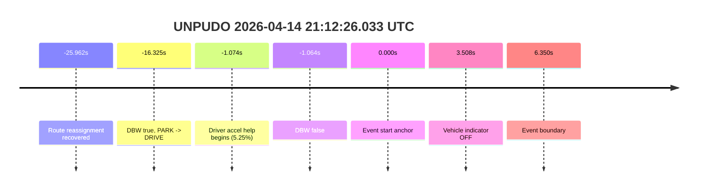
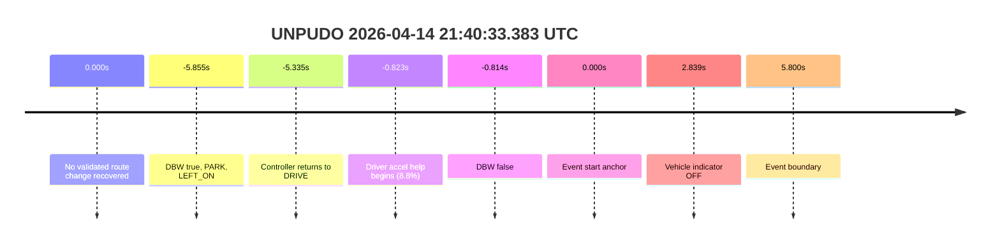
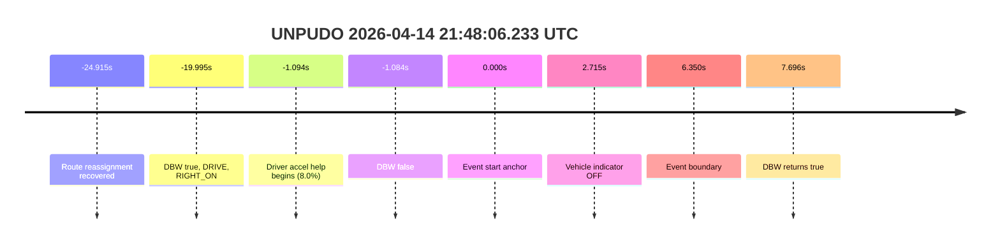

# Run Report: fme20018/2026-04-14--20-16-04--gen2-av-592e7fc4-edb5-4b7f-add1-be9879a0bf38

| Field | Value |
|---|---|
| Run ID | `fme20018/2026-04-14--20-16-04--gen2-av-592e7fc4-edb5-4b7f-add1-be9879a0bf38` |
| Date | `2026-04-14` |
| Model(s) | `lively-orange-horse` |
| Author | `guy.geva` |
| Event count | `3` |
| Run window | `2026-04-14T21:10:26.033Z` to `2026-04-14T21:48:25.142Z` |
| Foxglove | [segment](https://app.foxglove.dev/wayve-on-prem/p/prj_0dX18KZdVHg1fmmI/view?ds=foxglove-stream&ds.deviceName=fme20018&ds.end=2026-04-14T21%3A48%3A25.142Z&ds.start=2026-04-14T21%3A10%3A26.033Z&layoutId=lay_0e7VD4WIKDQGU73Y&time=2026-04-14T21%3A10%3A26.033Z) |

## unpudo 2026-04-14 21:12:26.033 UTC

| Field | Value |
|---|---|
| Model | `lively-orange-horse` |
| Author | `guy.geva` |
| Run ID | `fme20018/2026-04-14--20-16-04--gen2-av-592e7fc4-edb5-4b7f-add1-be9879a0bf38` |
| Date | `2026-04-14` |
| Time (UTC) | `21:12:26.033` |
| Event type | `unpudo` |
| Disengagement type | `failed_to_unpudo` |
| Console | [run](https://console.sso.wayve.ai/run/fme20018/2026-04-14--20-16-04--gen2-av-592e7fc4-edb5-4b7f-add1-be9879a0bf38?id=&time-unixus=1776201146033299) |

- Fail: route reassignment is recovered, but DBW drops before the anchor and the model is no longer owning the maneuver at the scored event start.

### Event Table

| Event | Time (UTC) | Delta from event start | Scored? | Notes |
|---|---|---:|---|---|
| Route reassignment recovered | 2026-04-14 21:12:00.071 | `-25.962s` | `yes` | Step count `2 -> 5`; distance `99.9m -> 480.1m`; terminal instruction `Turn right onto Newgate Street/A40. Continue on A40.` |
| Controller ownership start | 2026-04-14 21:12:09.708 | `-16.325s` | `yes` | DBW `true`, gear `PARK`, then transitions to `DRIVE` at 21:12:10.108. |
| DBW drops to false | 2026-04-14 21:12:24.968 | `-1.064s` | `yes` | Controller is already outside AV before the anchor. |
| Driver accel help begins | 2026-04-14 21:12:24.959 | `-1.074s` | `yes` | Accelerator pedal reaches `5.25%`; max accel help in-window is `5.8%`. |
| Event start anchor | 2026-04-14 21:12:26.033 | `0.000s` | `no` | Anchor is outside AV; cached vehicle state is `DRIVE` with indicator `LEFT_ON`. |
| Vehicle indicator OFF | 2026-04-14 21:12:29.541 | `+3.508s` | `no` | Post-anchor context only. |
| Event boundary | 2026-04-14 21:12:32.383 | `+6.350s` | `no` | Event window ends without AV ownership returning. |

### Metrics

| Metric | Value |
|---|---|
| Route-change status | `found` |
| Controller DBW at anchor | `false` |
| Predicted gear near anchor | `DRIVE` |
| Actual gear near anchor | `DRIVE` |
| Planned indicator near anchor | `LEFT_ON` |
| Actual indicator near anchor | `LEFT_ON` |
| Driver accel help in maneuver window | `yes` |
| Max accel pedal | `5.8%` |
| AV-owned duration before event end | `0.000s` |
| Source disengagement type | `failed_to_unpudo` |

### Summary

The route recovery is real, but it does not save the score: the model has already relinquished DBW before the credited anchor. This is therefore an ownership failure, not a route-planning failure.

### Resolution

| Field | Value |
|---|---|
| Final outcome | `fail` |
| Route-change status | `found` |
| Source disengagement type | `failed_to_unpudo` |
| Resolved effective failure type | `completed_outside_av` |
| Confidence | `high` |

## unpudo 2026-04-14 21:40:33.383 UTC

| Field | Value |
|---|---|
| Model | `lively-orange-horse` |
| Author | `guy.geva` |
| Run ID | `fme20018/2026-04-14--20-16-04--gen2-av-592e7fc4-edb5-4b7f-add1-be9879a0bf38` |
| Date | `2026-04-14` |
| Time (UTC) | `21:40:33.383` |
| Event type | `unpudo` |
| Disengagement type | `failed_to_unpudo` |
| Console | [run](https://console.sso.wayve.ai/run/fme20018/2026-04-14--20-16-04--gen2-av-592e7fc4-edb5-4b7f-add1-be9879a0bf38?id=&time-unixus=1776202833383319) |

- Fail: route-change search is negative in the stopped pre-event segment, and DBW is already false at the anchor, so this is not a creditable model-owned maneuver.

### Event Table

| Event | Time (UTC) | Delta from event start | Scored? | Notes |
|---|---|---:|---|---|
| Route-change search result | n/a | n/a | `yes` | No validated route change found in the last `120s` before the anchor; navigation stayed stable. |
| Controller ownership start | 2026-04-14 21:40:27.528 | `-5.855s` | `yes` | DBW `true`, gear `PARK`, indicator `LEFT_ON`. |
| Controller returns to DRIVE | 2026-04-14 21:40:28.048 | `-5.335s` | `yes` | Controller is still on, but the scored anchor has not arrived yet. |
| Driver accel help begins | 2026-04-14 21:40:32.560 | `-0.823s` | `yes` | Accelerator pedal reaches `8.8%`; this is the strongest in-window driver help. |
| DBW drops to false | 2026-04-14 21:40:32.569 | `-0.814s` | `yes` | Ownership is lost before the anchor. |
| Event start anchor | 2026-04-14 21:40:33.383 | `0.000s` | `no` | Anchor is already outside AV; latest vehicle state is `DRIVE` with indicator `LEFT_ON`. |
| Vehicle indicator OFF | 2026-04-14 21:40:36.222 | `+2.839s` | `no` | Post-anchor context only. |
| Event boundary | 2026-04-14 21:40:39.183 | `+5.800s` | `no` | Event window ends without AV ownership returning. |

### Metrics

| Metric | Value |
|---|---|
| Route-change status | `not found` |
| Controller DBW at anchor | `false` |
| Predicted gear near anchor | `DRIVE` |
| Actual gear near anchor | `DRIVE` |
| Planned indicator near anchor | `LEFT_ON` |
| Actual indicator near anchor | `LEFT_ON` |
| Driver accel help in maneuver window | `yes` |
| Max accel pedal | `8.8%` |
| AV-owned duration before event end | `0.000s` |
| Source disengagement type | `failed_to_unpudo` |

### Summary

The negative route-change search matters here: there is no clear reassignment in the stopped pre-event segment, and the vehicle is already outside DBW by the time the anchor arrives. That makes this a straightforward model-performance failure on ownership.

### Resolution

| Field | Value |
|---|---|
| Final outcome | `fail` |
| Route-change status | `not found` |
| Source disengagement type | `failed_to_unpudo` |
| Resolved effective failure type | `completed_outside_av` |
| Confidence | `high` |

## unpudo 2026-04-14 21:48:06.233 UTC

| Field | Value |
|---|---|
| Model | `lively-orange-horse` |
| Author | `guy.geva` |
| Run ID | `fme20018/2026-04-14--20-16-04--gen2-av-592e7fc4-edb5-4b7f-add1-be9879a0bf38` |
| Date | `2026-04-14` |
| Time (UTC) | `21:48:06.233` |
| Event type | `unparking` |
| Disengagement type | `failed_to_unpudo` |
| Console | [run](https://console.sso.wayve.ai/run/fme20018/2026-04-14--20-16-04--gen2-av-592e7fc4-edb5-4b7f-add1-be9879a0bf38?id=&time-unixus=1776203286233296) |

- Fail: route reassignment exists, but DBW drops just before the anchor, so the credited unparking attempt is not model-owned.

### Event Table

| Event | Time (UTC) | Delta from event start | Scored? | Notes |
|---|---|---:|---|---|
| Route reassignment recovered | 2026-04-14 21:47:41.318 | `-24.915s` | `yes` | Step count jumps from `2` to `5`; destination distance jumps from `0.0m` to `473.4m`. |
| Controller ownership start | 2026-04-14 21:47:46.238 | `-19.995s` | `yes` | DBW `true`, gear `DRIVE`, indicator `RIGHT_ON`. |
| Driver accel help begins | 2026-04-14 21:48:05.139 | `-1.094s` | `yes` | Accelerator pedal reaches `8.0%`. |
| DBW drops to false | 2026-04-14 21:48:05.149 | `-1.084s` | `yes` | Ownership is lost before the anchor. |
| Event start anchor | 2026-04-14 21:48:06.233 | `0.000s` | `no` | Anchor is already outside AV; cached plan still says `DRIVE` with `RIGHT_ON`. |
| Vehicle indicator OFF | 2026-04-14 21:48:08.948 | `+2.715s` | `no` | Post-anchor context only. |
| Event boundary | 2026-04-14 21:48:12.583 | `+6.350s` | `no` | Event window ends before DBW re-engages. |
| DBW returns true | 2026-04-14 21:48:13.929 | `+7.696s` | `no` | Too late to count for the scored maneuver. |

### Metrics

| Metric | Value |
|---|---|
| Route-change status | `found` |
| Controller DBW at anchor | `false` |
| Predicted gear near anchor | `DRIVE` |
| Actual gear near anchor | `DRIVE` |
| Planned indicator near anchor | `RIGHT_ON` |
| Actual indicator near anchor | `RIGHT_ON` |
| Driver accel help in maneuver window | `yes` |
| Max accel pedal | `8.0%` |
| AV-owned duration before event end | `0.000s` |
| Source disengagement type | `failed_to_unpudo` |

### Summary

This is another ownership miss: the route is recovered, the plan is consistent, and the driver help is modest, but the controller is already outside AV at the anchor. The later DBW return does not change the score.

### Resolution

| Field | Value |
|---|---|
| Final outcome | `fail` |
| Route-change status | `found` |
| Source disengagement type | `failed_to_unpudo` |
| Resolved effective failure type | `completed_outside_av` |
| Confidence | `high` |
