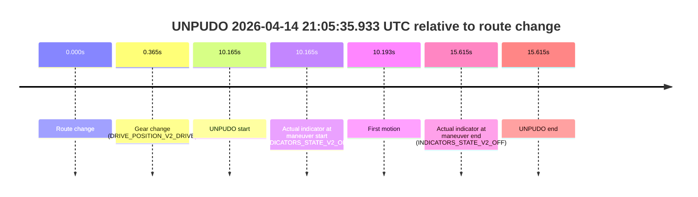
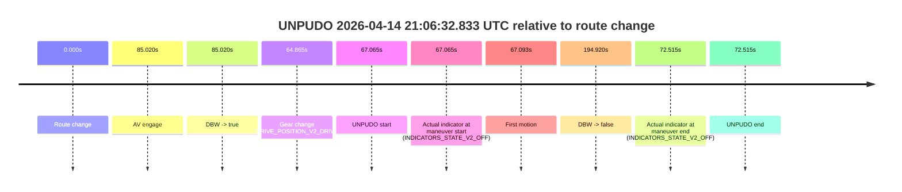
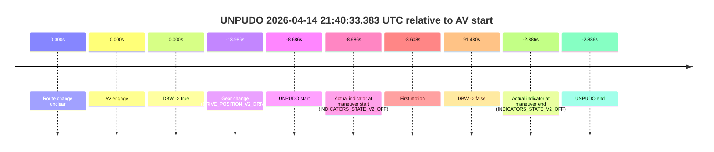
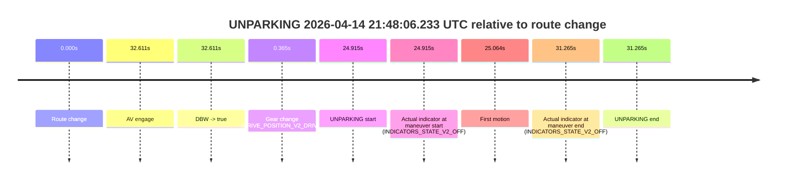

# Run Report: fme20018/2026-04-14--20-16-04--gen2-av-592e7fc4-edb5-4b7f-add1-be9879a0bf38

| Field | Value |
|---|---|
| Run ID | `fme20018/2026-04-14--20-16-04--gen2-av-592e7fc4-edb5-4b7f-add1-be9879a0bf38` |
| Date | `2026-04-14` |
| Model(s) | `lively-orange-horse` |
| Author | `guy.geva` |
| Event count | `6` |

## unpudo 2026-04-14 20:35:10.433 UTC

| Field | Value |
|---|---|
| Model | `lively-orange-horse` |
| Author | `guy.geva` |
| Run ID | `fme20018/2026-04-14--20-16-04--gen2-av-592e7fc4-edb5-4b7f-add1-be9879a0bf38` |
| Date | `2026-04-14` |
| Time (UTC) | `20:35:10.433` |
| Event type | `unpudo` |
| Disengagement type | `none observed` |
| Route change | `unclear` |
| Console | [run](https://console.sso.wayve.ai/run/fme20018/2026-04-14--20-16-04--gen2-av-592e7fc4-edb5-4b7f-add1-be9879a0bf38?id=&time-unixus=1776198910433314) |
| Foxglove | [segment](https://app.foxglove.dev/wayve-on-prem/p/prj_0dX18KZdVHg1fmmI/view?ds=foxglove-stream&ds.deviceName=fme20018&ds.start=2026-04-14T20%3A34%3A57.183303Z&ds.end=2026-04-14T20%3A46%3A06.588664Z&layoutId=lay_0e7VD4WIKDQGU73Y&time=2026-04-14T20%3A35%3A10.433314Z) |

### Event card: fail

- Fail: the credited unpudo does not stay AV-owned. The event window starts with DBW false, and the maneuver outcome lands outside a clean AV-owned segment.

| Event | Time (UTC) | Delta from AV start |
|---|---:|---:|
| Route change unclear | 2026-04-14 20:35:40.769 | `0.000s` |
| AV engage | 2026-04-14 20:35:40.769 | `0.000s` |
| DBW -> true | 2026-04-14 20:35:40.769 | `0.000s` |
| Gear change (DRIVE_POSITION_V2_DRIVE) | 2026-04-14 20:35:07.183 | `-33.586s` |
| UNPUDO start | 2026-04-14 20:35:10.433 | `-30.336s` |
| Actual indicator at maneuver start (INDICATORS_STATE_V2_OFF) | 2026-04-14 20:35:10.433 | `-30.336s` |
| First motion | 2026-04-14 20:35:10.701 | `-30.068s` |
| DBW -> false | 2026-04-14 20:45:56.588 | `615.819s` |
| Actual indicator at maneuver end (INDICATORS_STATE_V2_OFF) | 2026-04-14 20:35:31.483 | `-9.286s` |
| UNPUDO end | 2026-04-14 20:35:31.483 | `-9.286s` |

| Metric | Value |
|---|---|
| Outcome | `fail` |
| Effective failure type | `completed_outside_av` |
| Route change status | `unclear` |
| DBW at event start | `false` |
| DBW at event end | `false` |
| Predicted gear at AV start | `DRIVE_POSITION_V2_DRIVE` |
| Actual gear at AV start | `DRIVE_POSITION_V2_DRIVE` |
| Predicted gear at event start | `DRIVE_POSITION_V2_DRIVE` |
| Actual gear at event start | `DRIVE_POSITION_V2_DRIVE` |
| Planned indicator direction | `INDICATORS_STATE_V2_RIGHT_ON` |
| Controller indicator direction | `INDICATORS_STATE_V2_RIGHT_ON` |
| Actual indicator direction | `INDICATORS_STATE_V2_OFF` |
| Actual indicator at maneuver end | `INDICATORS_STATE_V2_OFF` |
| Driver accel help in AV | `false` |
| Driver accel help timestamp | `n/a` |
| Max accel pedal pct in AV | `0.0%` |
| Max brake pedal pct in AV | `0.0%` |
| Max speed mps in AV | `0.000` |
| Route -> AV | `n/a` |
| AV -> event start | `-30.336s` |
| AV -> first motion | `-30.068s` |
| AV duration before disengagement | `615.819s` |
| Trajectory waypoint count | `36` |
| Driving-plan step count | `11` |

The scored portion starts from the AV-owned window, not from the pre-AV setup. Route-change search in the stopped pre-event segment was `unclear`, with the baseline therefore set to AV start. At the event anchor the model predicts `DRIVE_POSITION_V2_DRIVE` and the actual gear is `DRIVE_POSITION_V2_DRIVE`. The effective model outcome is `fail` because `completed_outside_av`.

### Resolution

| Field | Value |
|---|---|
| Final outcome | `fail` |
| Do we agree with this label? | `yes` |
| Source disengagement type | `none observed` |
| Resolved effective failure type | `completed_outside_av` |
| Confidence | `medium` |

## unpudo 2026-04-14 21:05:35.933 UTC

| Field | Value |
|---|---|
| Model | `lively-orange-horse` |
| Author | `guy.geva` |
| Run ID | `fme20018/2026-04-14--20-16-04--gen2-av-592e7fc4-edb5-4b7f-add1-be9879a0bf38` |
| Date | `2026-04-14` |
| Time (UTC) | `21:05:35.933` |
| Event type | `unpudo` |
| Disengagement type | `failed_to_unpudo` |
| Route change | `found` |
| Console | [run](https://console.sso.wayve.ai/run/fme20018/2026-04-14--20-16-04--gen2-av-592e7fc4-edb5-4b7f-add1-be9879a0bf38?id=&time-unixus=1776200735933295) |
| Foxglove | [segment](https://app.foxglove.dev/wayve-on-prem/p/prj_0dX18KZdVHg1fmmI/view?ds=foxglove-stream&ds.deviceName=fme20018&ds.start=2026-04-14T21%3A05%3A15.768293Z&ds.end=2026-04-14T21%3A05%3A51.383302Z&layoutId=lay_0e7VD4WIKDQGU73Y&time=2026-04-14T21%3A05%3A35.933295Z) |

### Event card: fail

- Fail: AV owns part of the segment, but the event still resolves as a model-performance failure under the AV-only scoring rule.

| Event | Time (UTC) | Delta from route change |
|---|---:|---:|
| Route change | 2026-04-14 21:05:25.768 | `0.000s` |
| Gear change (DRIVE_POSITION_V2_DRIVE) | 2026-04-14 21:05:26.133 | `0.365s` |
| UNPUDO start | 2026-04-14 21:05:35.933 | `10.165s` |
| Actual indicator at maneuver start (INDICATORS_STATE_V2_OFF) | 2026-04-14 21:05:35.933 | `10.165s` |
| First motion | 2026-04-14 21:05:35.961 | `10.193s` |
| Actual indicator at maneuver end (INDICATORS_STATE_V2_OFF) | 2026-04-14 21:05:41.383 | `15.615s` |
| UNPUDO end | 2026-04-14 21:05:41.383 | `15.615s` |

| Metric | Value |
|---|---|
| Outcome | `fail` |
| Effective failure type | `failed_to_unpudo` |
| Route change status | `found` |
| DBW at event start | `false` |
| DBW at event end | `false` |
| Predicted gear at AV start | `n/a` |
| Actual gear at AV start | `n/a` |
| Predicted gear at event start | `DRIVE_POSITION_V2_DRIVE` |
| Actual gear at event start | `DRIVE_POSITION_V2_DRIVE` |
| Planned indicator direction | `INDICATORS_STATE_V2_RIGHT_ON` |
| Controller indicator direction | `INDICATORS_STATE_V2_RIGHT_ON` |
| Actual indicator direction | `INDICATORS_STATE_V2_OFF` |
| Actual indicator at maneuver end | `INDICATORS_STATE_V2_OFF` |
| Driver accel help in AV | `false` |
| Driver accel help timestamp | `n/a` |
| Max accel pedal pct in AV | `0.0%` |
| Max brake pedal pct in AV | `0.0%` |
| Max speed mps in AV | `0.000` |
| Route -> AV | `n/a` |
| AV -> event start | `n/a` |
| AV -> first motion | `n/a` |
| AV duration before disengagement | `n/a` |
| Trajectory waypoint count | `36` |
| Driving-plan step count | `11` |

The scored portion starts from the AV-owned window, not from the pre-AV setup. Route-change search in the stopped pre-event segment was `found`, with the baseline therefore set to route change. At the event anchor the model predicts `DRIVE_POSITION_V2_DRIVE` and the actual gear is `DRIVE_POSITION_V2_DRIVE`. The effective model outcome is `fail` because `failed_to_unpudo`.

### Resolution

| Field | Value |
|---|---|
| Final outcome | `fail` |
| Do we agree with this label? | `yes` |
| Source disengagement type | `failed_to_unpudo` |
| Resolved effective failure type | `failed_to_unpudo` |
| Confidence | `high` |

## unpudo 2026-04-14 21:06:32.833 UTC

| Field | Value |
|---|---|
| Model | `lively-orange-horse` |
| Author | `guy.geva` |
| Run ID | `fme20018/2026-04-14--20-16-04--gen2-av-592e7fc4-edb5-4b7f-add1-be9879a0bf38` |
| Date | `2026-04-14` |
| Time (UTC) | `21:06:32.833` |
| Event type | `unpudo` |
| Disengagement type | `none observed` |
| Route change | `found` |
| Console | [run](https://console.sso.wayve.ai/run/fme20018/2026-04-14--20-16-04--gen2-av-592e7fc4-edb5-4b7f-add1-be9879a0bf38?id=&time-unixus=1776200792833310) |
| Foxglove | [segment](https://app.foxglove.dev/wayve-on-prem/p/prj_0dX18KZdVHg1fmmI/view?ds=foxglove-stream&ds.deviceName=fme20018&ds.start=2026-04-14T21%3A05%3A15.768293Z&ds.end=2026-04-14T21%3A08%3A50.688458Z&layoutId=lay_0e7VD4WIKDQGU73Y&time=2026-04-14T21%3A06%3A32.833310Z) |

### Event card: fail

- Fail: the credited unpudo does not stay AV-owned. The event window starts with DBW false, and the maneuver outcome lands outside a clean AV-owned segment.

| Event | Time (UTC) | Delta from route change |
|---|---:|---:|
| Route change | 2026-04-14 21:05:25.768 | `0.000s` |
| AV engage | 2026-04-14 21:06:50.788 | `85.020s` |
| DBW -> true | 2026-04-14 21:06:50.788 | `85.020s` |
| Gear change (DRIVE_POSITION_V2_DRIVE) | 2026-04-14 21:06:30.633 | `64.865s` |
| UNPUDO start | 2026-04-14 21:06:32.833 | `67.065s` |
| Actual indicator at maneuver start (INDICATORS_STATE_V2_OFF) | 2026-04-14 21:06:32.833 | `67.065s` |
| First motion | 2026-04-14 21:06:32.861 | `67.093s` |
| DBW -> false | 2026-04-14 21:08:40.688 | `194.920s` |
| Actual indicator at maneuver end (INDICATORS_STATE_V2_OFF) | 2026-04-14 21:06:38.283 | `72.515s` |
| UNPUDO end | 2026-04-14 21:06:38.283 | `72.515s` |

| Metric | Value |
|---|---|
| Outcome | `fail` |
| Effective failure type | `completed_outside_av` |
| Route change status | `found` |
| DBW at event start | `false` |
| DBW at event end | `false` |
| Predicted gear at AV start | `DRIVE_POSITION_V2_DRIVE` |
| Actual gear at AV start | `DRIVE_POSITION_V2_DRIVE` |
| Predicted gear at event start | `DRIVE_POSITION_V2_DRIVE` |
| Actual gear at event start | `DRIVE_POSITION_V2_DRIVE` |
| Planned indicator direction | `INDICATORS_STATE_V2_OFF` |
| Controller indicator direction | `INDICATORS_STATE_V2_OFF` |
| Actual indicator direction | `INDICATORS_STATE_V2_OFF` |
| Actual indicator at maneuver end | `INDICATORS_STATE_V2_OFF` |
| Driver accel help in AV | `false` |
| Driver accel help timestamp | `n/a` |
| Max accel pedal pct in AV | `0.0%` |
| Max brake pedal pct in AV | `0.0%` |
| Max speed mps in AV | `0.000` |
| Route -> AV | `85.020s` |
| AV -> event start | `-17.955s` |
| AV -> first motion | `-17.927s` |
| AV duration before disengagement | `109.900s` |
| Trajectory waypoint count | `36` |
| Driving-plan step count | `11` |

The scored portion starts from the AV-owned window, not from the pre-AV setup. Route-change search in the stopped pre-event segment was `found`, with the baseline therefore set to route change. At the event anchor the model predicts `DRIVE_POSITION_V2_DRIVE` and the actual gear is `DRIVE_POSITION_V2_DRIVE`. The effective model outcome is `fail` because `completed_outside_av`.

### Resolution

| Field | Value |
|---|---|
| Final outcome | `fail` |
| Do we agree with this label? | `yes` |
| Source disengagement type | `none observed` |
| Resolved effective failure type | `completed_outside_av` |
| Confidence | `high` |

## unpudo 2026-04-14 21:12:26.033 UTC

| Field | Value |
|---|---|
| Model | `lively-orange-horse` |
| Author | `guy.geva` |
| Run ID | `fme20018/2026-04-14--20-16-04--gen2-av-592e7fc4-edb5-4b7f-add1-be9879a0bf38` |
| Date | `2026-04-14` |
| Time (UTC) | `21:12:26.033` |
| Event type | `unpudo` |
| Disengagement type | `failed_to_unpudo` |
| Route change | `found` |
| Console | [run](https://console.sso.wayve.ai/run/fme20018/2026-04-14--20-16-04--gen2-av-592e7fc4-edb5-4b7f-add1-be9879a0bf38?id=&time-unixus=1776201146033299) |
| Foxglove | [segment](https://app.foxglove.dev/wayve-on-prem/p/prj_0dX18KZdVHg1fmmI/view?ds=foxglove-stream&ds.deviceName=fme20018&ds.start=2026-04-14T21%3A11%3A50.071565Z&ds.end=2026-04-14T21%3A18%3A15.609726Z&layoutId=lay_0e7VD4WIKDQGU73Y&time=2026-04-14T21%3A12%3A26.033299Z) |

### Event card: fail

- Fail: AV owns part of the segment, but the event still resolves as a model-performance failure under the AV-only scoring rule.

| Event | Time (UTC) | Delta from route change |
|---|---:|---:|
| Route change | 2026-04-14 21:12:00.071 | `0.000s` |
| AV engage | 2026-04-14 21:12:50.109 | `50.038s` |
| DBW -> true | 2026-04-14 21:12:50.109 | `50.038s` |
| Gear change (DRIVE_POSITION_V2_DRIVE) | 2026-04-14 21:12:10.133 | `10.062s` |
| UNPUDO start | 2026-04-14 21:12:26.033 | `25.962s` |
| Actual indicator at maneuver start (INDICATORS_STATE_V2_OFF) | 2026-04-14 21:12:26.033 | `25.962s` |
| First motion | 2026-04-14 21:12:26.102 | `26.031s` |
| DBW -> false | 2026-04-14 21:18:05.609 | `365.538s` |
| Actual indicator at maneuver end (INDICATORS_STATE_V2_OFF) | 2026-04-14 21:12:32.383 | `32.312s` |
| UNPUDO end | 2026-04-14 21:12:32.383 | `32.312s` |

| Metric | Value |
|---|---|
| Outcome | `fail` |
| Effective failure type | `failed_to_unpudo` |
| Route change status | `found` |
| DBW at event start | `false` |
| DBW at event end | `false` |
| Predicted gear at AV start | `DRIVE_POSITION_V2_DRIVE` |
| Actual gear at AV start | `DRIVE_POSITION_V2_DRIVE` |
| Predicted gear at event start | `DRIVE_POSITION_V2_DRIVE` |
| Actual gear at event start | `DRIVE_POSITION_V2_DRIVE` |
| Planned indicator direction | `INDICATORS_STATE_V2_LEFT_ON` |
| Controller indicator direction | `INDICATORS_STATE_V2_LEFT_ON` |
| Actual indicator direction | `INDICATORS_STATE_V2_OFF` |
| Actual indicator at maneuver end | `INDICATORS_STATE_V2_OFF` |
| Driver accel help in AV | `false` |
| Driver accel help timestamp | `n/a` |
| Max accel pedal pct in AV | `0.0%` |
| Max brake pedal pct in AV | `0.0%` |
| Max speed mps in AV | `0.000` |
| Route -> AV | `50.038s` |
| AV -> event start | `-24.076s` |
| AV -> first motion | `-24.007s` |
| AV duration before disengagement | `315.500s` |
| Trajectory waypoint count | `36` |
| Driving-plan step count | `11` |

The scored portion starts from the AV-owned window, not from the pre-AV setup. Route-change search in the stopped pre-event segment was `found`, with the baseline therefore set to route change. At the event anchor the model predicts `DRIVE_POSITION_V2_DRIVE` and the actual gear is `DRIVE_POSITION_V2_DRIVE`. The effective model outcome is `fail` because `failed_to_unpudo`.

### Resolution

| Field | Value |
|---|---|
| Final outcome | `fail` |
| Do we agree with this label? | `yes` |
| Source disengagement type | `failed_to_unpudo` |
| Resolved effective failure type | `failed_to_unpudo` |
| Confidence | `high` |

## unpudo 2026-04-14 21:40:33.383 UTC

| Field | Value |
|---|---|
| Model | `lively-orange-horse` |
| Author | `guy.geva` |
| Run ID | `fme20018/2026-04-14--20-16-04--gen2-av-592e7fc4-edb5-4b7f-add1-be9879a0bf38` |
| Date | `2026-04-14` |
| Time (UTC) | `21:40:33.383` |
| Event type | `unpudo` |
| Disengagement type | `failed_to_unpudo` |
| Route change | `unclear` |
| Console | [run](https://console.sso.wayve.ai/run/fme20018/2026-04-14--20-16-04--gen2-av-592e7fc4-edb5-4b7f-add1-be9879a0bf38?id=&time-unixus=1776202833383319) |
| Foxglove | [segment](https://app.foxglove.dev/wayve-on-prem/p/prj_0dX18KZdVHg1fmmI/view?ds=foxglove-stream&ds.deviceName=fme20018&ds.start=2026-04-14T21%3A40%3A18.083315Z&ds.end=2026-04-14T21%3A42%3A23.549814Z&layoutId=lay_0e7VD4WIKDQGU73Y&time=2026-04-14T21%3A40%3A33.383319Z) |

### Event card: fail

- Fail: AV owns part of the segment, but the event still resolves as a model-performance failure under the AV-only scoring rule.

| Event | Time (UTC) | Delta from AV start |
|---|---:|---:|
| Route change unclear | 2026-04-14 21:40:42.069 | `0.000s` |
| AV engage | 2026-04-14 21:40:42.069 | `0.000s` |
| DBW -> true | 2026-04-14 21:40:42.069 | `0.000s` |
| Gear change (DRIVE_POSITION_V2_DRIVE) | 2026-04-14 21:40:28.083 | `-13.986s` |
| UNPUDO start | 2026-04-14 21:40:33.383 | `-8.686s` |
| Actual indicator at maneuver start (INDICATORS_STATE_V2_OFF) | 2026-04-14 21:40:33.383 | `-8.686s` |
| First motion | 2026-04-14 21:40:33.461 | `-8.608s` |
| DBW -> false | 2026-04-14 21:42:13.549 | `91.480s` |
| Actual indicator at maneuver end (INDICATORS_STATE_V2_OFF) | 2026-04-14 21:40:39.183 | `-2.886s` |
| UNPUDO end | 2026-04-14 21:40:39.183 | `-2.886s` |

| Metric | Value |
|---|---|
| Outcome | `fail` |
| Effective failure type | `failed_to_unpudo` |
| Route change status | `unclear` |
| DBW at event start | `false` |
| DBW at event end | `false` |
| Predicted gear at AV start | `DRIVE_POSITION_V2_DRIVE` |
| Actual gear at AV start | `DRIVE_POSITION_V2_DRIVE` |
| Predicted gear at event start | `DRIVE_POSITION_V2_DRIVE` |
| Actual gear at event start | `DRIVE_POSITION_V2_DRIVE` |
| Planned indicator direction | `INDICATORS_STATE_V2_LEFT_ON` |
| Controller indicator direction | `INDICATORS_STATE_V2_LEFT_ON` |
| Actual indicator direction | `INDICATORS_STATE_V2_OFF` |
| Actual indicator at maneuver end | `INDICATORS_STATE_V2_OFF` |
| Driver accel help in AV | `false` |
| Driver accel help timestamp | `n/a` |
| Max accel pedal pct in AV | `0.0%` |
| Max brake pedal pct in AV | `0.0%` |
| Max speed mps in AV | `0.000` |
| Route -> AV | `n/a` |
| AV -> event start | `-8.686s` |
| AV -> first motion | `-8.608s` |
| AV duration before disengagement | `91.480s` |
| Trajectory waypoint count | `37` |
| Driving-plan step count | `11` |

The scored portion starts from the AV-owned window, not from the pre-AV setup. Route-change search in the stopped pre-event segment was `unclear`, with the baseline therefore set to AV start. At the event anchor the model predicts `DRIVE_POSITION_V2_DRIVE` and the actual gear is `DRIVE_POSITION_V2_DRIVE`. The effective model outcome is `fail` because `failed_to_unpudo`.

### Resolution

| Field | Value |
|---|---|
| Final outcome | `fail` |
| Do we agree with this label? | `yes` |
| Source disengagement type | `failed_to_unpudo` |
| Resolved effective failure type | `failed_to_unpudo` |
| Confidence | `medium` |

## unparking 2026-04-14 21:48:06.233 UTC

| Field | Value |
|---|---|
| Model | `lively-orange-horse` |
| Author | `guy.geva` |
| Run ID | `fme20018/2026-04-14--20-16-04--gen2-av-592e7fc4-edb5-4b7f-add1-be9879a0bf38` |
| Date | `2026-04-14` |
| Time (UTC) | `21:48:06.233` |
| Event type | `unparking` |
| Disengagement type | `failed_to_unpudo` |
| Route change | `found` |
| Console | [run](https://console.sso.wayve.ai/run/fme20018/2026-04-14--20-16-04--gen2-av-592e7fc4-edb5-4b7f-add1-be9879a0bf38?id=&time-unixus=1776203286233296) |
| Foxglove | [segment](https://app.foxglove.dev/wayve-on-prem/p/prj_0dX18KZdVHg1fmmI/view?ds=foxglove-stream&ds.deviceName=fme20018&ds.start=2026-04-14T21%3A47%3A31.318263Z&ds.end=2026-04-14T21%3A48%3A22.583312Z&layoutId=lay_0e7VD4WIKDQGU73Y&time=2026-04-14T21%3A48%3A06.233296Z) |

### Event card: fail

- Fail: AV owns part of the segment, but the event still resolves as a model-performance failure under the AV-only scoring rule.

| Event | Time (UTC) | Delta from route change |
|---|---:|---:|
| Route change | 2026-04-14 21:47:41.318 | `0.000s` |
| AV engage | 2026-04-14 21:48:13.929 | `32.611s` |
| DBW -> true | 2026-04-14 21:48:13.929 | `32.611s` |
| Gear change (DRIVE_POSITION_V2_DRIVE) | 2026-04-14 21:47:41.683 | `0.365s` |
| UNPARKING start | 2026-04-14 21:48:06.233 | `24.915s` |
| Actual indicator at maneuver start (INDICATORS_STATE_V2_OFF) | 2026-04-14 21:48:06.233 | `24.915s` |
| First motion | 2026-04-14 21:48:06.381 | `25.064s` |
| Actual indicator at maneuver end (INDICATORS_STATE_V2_OFF) | 2026-04-14 21:48:12.583 | `31.265s` |
| UNPARKING end | 2026-04-14 21:48:12.583 | `31.265s` |

| Metric | Value |
|---|---|
| Outcome | `fail` |
| Effective failure type | `failed_to_unpudo` |
| Route change status | `found` |
| DBW at event start | `false` |
| DBW at event end | `false` |
| Predicted gear at AV start | `DRIVE_POSITION_V2_DRIVE` |
| Actual gear at AV start | `DRIVE_POSITION_V2_DRIVE` |
| Predicted gear at event start | `DRIVE_POSITION_V2_DRIVE` |
| Actual gear at event start | `DRIVE_POSITION_V2_DRIVE` |
| Planned indicator direction | `INDICATORS_STATE_V2_RIGHT_ON` |
| Controller indicator direction | `INDICATORS_STATE_V2_RIGHT_ON` |
| Actual indicator direction | `INDICATORS_STATE_V2_OFF` |
| Actual indicator at maneuver end | `INDICATORS_STATE_V2_OFF` |
| Driver accel help in AV | `false` |
| Driver accel help timestamp | `n/a` |
| Max accel pedal pct in AV | `0.0%` |
| Max brake pedal pct in AV | `0.0%` |
| Max speed mps in AV | `0.000` |
| Route -> AV | `32.611s` |
| AV -> event start | `-7.696s` |
| AV -> first motion | `-7.548s` |
| AV duration before disengagement | `n/a` |
| Trajectory waypoint count | `36` |
| Driving-plan step count | `11` |

The scored portion starts from the AV-owned window, not from the pre-AV setup. Route-change search in the stopped pre-event segment was `found`, with the baseline therefore set to route change. At the event anchor the model predicts `DRIVE_POSITION_V2_DRIVE` and the actual gear is `DRIVE_POSITION_V2_DRIVE`. The effective model outcome is `fail` because `failed_to_unpudo`.

### Resolution

| Field | Value |
|---|---|
| Final outcome | `fail` |
| Do we agree with this label? | `yes` |
| Source disengagement type | `failed_to_unpudo` |
| Resolved effective failure type | `failed_to_unpudo` |
| Confidence | `high` |
