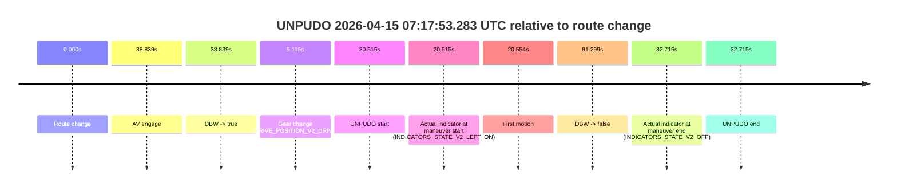
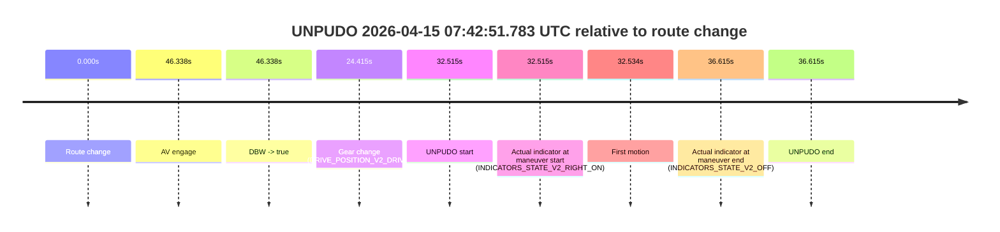

# Run Report: fme20018/2026-04-15--06-37-14--gen2-av-145a7466-521d-46df-938e-6c772e4d50de

| Field | Value |
|---|---|
| Run ID | `fme20018/2026-04-15--06-37-14--gen2-av-145a7466-521d-46df-938e-6c772e4d50de` |
| Date | `2026-04-15` |
| Model(s) | `plum-timeless-beaver` |
| Author | `peng.tang` |
| Event count | `7` |

## unpudo 2026-04-15 06:53:02.683 UTC

| Field | Value |
|---|---|
| Model | `plum-timeless-beaver` |
| Author | `peng.tang` |
| Run ID | `fme20018/2026-04-15--06-37-14--gen2-av-145a7466-521d-46df-938e-6c772e4d50de` |
| Date | `2026-04-15` |
| Time (UTC) | `06:53:02.683` |
| Event type | `unpudo` |
| Disengagement type | `failed_to_unpudo` |
| Route change | `found` |
| Console | [run](https://console.sso.wayve.ai/run/fme20018/2026-04-15--06-37-14--gen2-av-145a7466-521d-46df-938e-6c772e4d50de?id=&time-unixus=1776235982683296) |
| Foxglove | [segment](https://app.foxglove.dev/wayve-on-prem/p/prj_0dX18KZdVHg1fmmI/view?ds=foxglove-stream&ds.deviceName=fme20018&ds.start=2026-04-15T06%3A52%3A28.268979Z&ds.end=2026-04-15T06%3A56%3A22.306712Z&layoutId=lay_0e7VD4WIKDQGU73Y&time=2026-04-15T06%3A53%3A02.683296Z) |

### Event card: non-av

- Non-AV: there is no AV-owned portion anywhere inside the detected unpudo timeline, so it is kept for coverage but excluded from model success / failure scoring.

| Event | Time (UTC) | Delta from route change |
|---|---:|---:|
| Route change | 2026-04-15 06:52:38.268 | `0.000s` |
| AV engage | 2026-04-15 06:53:21.327 | `43.059s` |
| DBW -> true | 2026-04-15 06:53:21.327 | `43.059s` |
| Gear change (DRIVE_POSITION_V2_DRIVE) | 2026-04-15 06:52:38.683 | `0.414s` |
| UNPUDO start | 2026-04-15 06:53:02.683 | `24.414s` |
| Actual indicator at maneuver start (INDICATORS_STATE_V2_LEFT_ON) | 2026-04-15 06:53:02.683 | `24.414s` |
| First motion | 2026-04-15 06:53:02.761 | `24.493s` |
| DBW -> false | 2026-04-15 06:56:12.306 | `214.038s` |
| Actual indicator at maneuver end (INDICATORS_STATE_V2_LEFT_ON) | 2026-04-15 06:53:11.233 | `32.964s` |
| UNPUDO end | 2026-04-15 06:53:11.233 | `32.964s` |

| Metric | Value |
|---|---|
| Outcome | `non-av` |
| Effective failure type | `none` |
| Route change status | `found` |
| DBW at event start | `false` |
| DBW at event end | `false` |
| Predicted gear at AV start | `DRIVE_POSITION_V2_DRIVE` |
| Actual gear at AV start | `DRIVE_POSITION_V2_DRIVE` |
| Predicted gear at event start | `DRIVE_POSITION_V2_DRIVE` |
| Actual gear at event start | `DRIVE_POSITION_V2_DRIVE` |
| Planned indicator direction | `INDICATORS_STATE_V2_LEFT_ON` |
| Controller indicator direction | `INDICATORS_STATE_V2_LEFT_ON` |
| Actual indicator direction | `INDICATORS_STATE_V2_LEFT_ON` |
| Actual indicator at maneuver end | `INDICATORS_STATE_V2_LEFT_ON` |
| Driver accel help in AV | `false` |
| Driver accel help timestamp | `n/a` |
| Max accel pedal pct in AV | `0.0%` |
| Max brake pedal pct in AV | `0.0%` |
| Max speed mps in AV | `0.000` |
| Route -> AV | `43.059s` |
| AV -> event start | `-18.645s` |
| AV -> first motion | `-18.566s` |
| AV duration before disengagement | `170.979s` |
| Trajectory waypoint count | `36` |
| Driving-plan step count | `11` |

The scored portion starts from the AV-owned window, not from the pre-AV setup. Route-change search in the stopped pre-event segment was `found`, with the baseline therefore set to route change. At the event anchor the model predicts `DRIVE_POSITION_V2_DRIVE` and the actual gear is `DRIVE_POSITION_V2_DRIVE`. The effective model outcome is `non-av` because `there is no AV-owned overlap inside the event timeline`.

### Resolution

| Field | Value |
|---|---|
| Final outcome | `non-av` |
| Do we agree with this label? | `yes` |
| Source disengagement type | `failed_to_unpudo` |
| Resolved effective failure type | `none` |
| Confidence | `high` |

## unpudo 2026-04-15 07:00:47.133 UTC

| Field | Value |
|---|---|
| Model | `plum-timeless-beaver` |
| Author | `peng.tang` |
| Run ID | `fme20018/2026-04-15--06-37-14--gen2-av-145a7466-521d-46df-938e-6c772e4d50de` |
| Date | `2026-04-15` |
| Time (UTC) | `07:00:47.133` |
| Event type | `unpudo` |
| Disengagement type | `none observed` |
| Route change | `found` |
| Console | [run](https://console.sso.wayve.ai/run/fme20018/2026-04-15--06-37-14--gen2-av-145a7466-521d-46df-938e-6c772e4d50de?id=&time-unixus=1776236447133307) |
| Foxglove | [segment](https://app.foxglove.dev/wayve-on-prem/p/prj_0dX18KZdVHg1fmmI/view?ds=foxglove-stream&ds.deviceName=fme20018&ds.start=2026-04-15T06%3A58%3A53.218283Z&ds.end=2026-04-15T07%3A02%3A23.706730Z&layoutId=lay_0e7VD4WIKDQGU73Y&time=2026-04-15T07%3A00%3A47.133307Z) |

### Event card: non-av

- Non-AV: there is no AV-owned portion anywhere inside the detected unpudo timeline, so it is kept for coverage but excluded from model success / failure scoring.

| Event | Time (UTC) | Delta from route change |
|---|---:|---:|
| Route change | 2026-04-15 06:59:03.218 | `0.000s` |
| AV engage | 2026-04-15 07:01:13.427 | `130.210s` |
| DBW -> true | 2026-04-15 07:01:13.427 | `130.210s` |
| Gear change (DRIVE_POSITION_V2_REVERSE) | 2026-04-15 07:00:42.233 | `99.015s` |
| UNPUDO start | 2026-04-15 07:00:47.133 | `103.915s` |
| Actual indicator at maneuver start (INDICATORS_STATE_V2_OFF) | 2026-04-15 07:00:47.133 | `103.915s` |
| First motion | 2026-04-15 07:00:51.901 | `108.683s` |
| DBW -> false | 2026-04-15 07:02:13.706 | `190.488s` |
| Actual indicator at maneuver end (INDICATORS_STATE_V2_OFF) | 2026-04-15 07:00:57.733 | `114.515s` |
| UNPUDO end | 2026-04-15 07:00:57.733 | `114.515s` |

| Metric | Value |
|---|---|
| Outcome | `non-av` |
| Effective failure type | `none` |
| Route change status | `found` |
| DBW at event start | `false` |
| DBW at event end | `false` |
| Predicted gear at AV start | `DRIVE_POSITION_V2_DRIVE` |
| Actual gear at AV start | `DRIVE_POSITION_V2_DRIVE` |
| Predicted gear at event start | `DRIVE_POSITION_V2_REVERSE` |
| Actual gear at event start | `DRIVE_POSITION_V2_REVERSE` |
| Planned indicator direction | `INDICATORS_STATE_V2_OFF` |
| Controller indicator direction | `INDICATORS_STATE_V2_OFF` |
| Actual indicator direction | `INDICATORS_STATE_V2_OFF` |
| Actual indicator at maneuver end | `INDICATORS_STATE_V2_OFF` |
| Driver accel help in AV | `false` |
| Driver accel help timestamp | `n/a` |
| Max accel pedal pct in AV | `0.0%` |
| Max brake pedal pct in AV | `0.0%` |
| Max speed mps in AV | `0.000` |
| Route -> AV | `130.210s` |
| AV -> event start | `-26.295s` |
| AV -> first motion | `-21.526s` |
| AV duration before disengagement | `60.279s` |
| Trajectory waypoint count | `35` |
| Driving-plan step count | `11` |

The scored portion starts from the AV-owned window, not from the pre-AV setup. Route-change search in the stopped pre-event segment was `found`, with the baseline therefore set to route change. At the event anchor the model predicts `DRIVE_POSITION_V2_REVERSE` and the actual gear is `DRIVE_POSITION_V2_REVERSE`. The effective model outcome is `non-av` because `there is no AV-owned overlap inside the event timeline`.

### Resolution

| Field | Value |
|---|---|
| Final outcome | `non-av` |
| Do we agree with this label? | `yes` |
| Source disengagement type | `none observed` |
| Resolved effective failure type | `none` |
| Confidence | `high` |

## unpudo 2026-04-15 07:03:17.183 UTC

| Field | Value |
|---|---|
| Model | `plum-timeless-beaver` |
| Author | `peng.tang` |
| Run ID | `fme20018/2026-04-15--06-37-14--gen2-av-145a7466-521d-46df-938e-6c772e4d50de` |
| Date | `2026-04-15` |
| Time (UTC) | `07:03:17.183` |
| Event type | `unpudo` |
| Disengagement type | `failed_to_unpudo` |
| Route change | `found` |
| Console | [run](https://console.sso.wayve.ai/run/fme20018/2026-04-15--06-37-14--gen2-av-145a7466-521d-46df-938e-6c772e4d50de?id=&time-unixus=1776236597183309) |
| Foxglove | [segment](https://app.foxglove.dev/wayve-on-prem/p/prj_0dX18KZdVHg1fmmI/view?ds=foxglove-stream&ds.deviceName=fme20018&ds.start=2026-04-15T07%3A02%3A46.218258Z&ds.end=2026-04-15T07%3A10%3A21.686584Z&layoutId=lay_0e7VD4WIKDQGU73Y&time=2026-04-15T07%3A03%3A17.183309Z) |

### Event card: non-av

- Non-AV: there is no AV-owned portion anywhere inside the detected unpudo timeline, so it is kept for coverage but excluded from model success / failure scoring.

| Event | Time (UTC) | Delta from route change |
|---|---:|---:|
| Route change | 2026-04-15 07:02:56.218 | `0.000s` |
| AV engage | 2026-04-15 07:03:25.727 | `29.510s` |
| DBW -> true | 2026-04-15 07:03:25.727 | `29.510s` |
| Gear change (DRIVE_POSITION_V2_DRIVE) | 2026-04-15 07:03:00.083 | `3.865s` |
| UNPUDO start | 2026-04-15 07:03:17.183 | `20.965s` |
| Actual indicator at maneuver start (INDICATORS_STATE_V2_LEFT_ON) | 2026-04-15 07:03:17.183 | `20.965s` |
| First motion | 2026-04-15 07:03:17.221 | `21.004s` |
| DBW -> false | 2026-04-15 07:10:11.686 | `435.468s` |
| Actual indicator at maneuver end (INDICATORS_STATE_V2_OFF) | 2026-04-15 07:03:22.333 | `26.115s` |
| UNPUDO end | 2026-04-15 07:03:22.333 | `26.115s` |

| Metric | Value |
|---|---|
| Outcome | `non-av` |
| Effective failure type | `none` |
| Route change status | `found` |
| DBW at event start | `false` |
| DBW at event end | `false` |
| Predicted gear at AV start | `DRIVE_POSITION_V2_DRIVE` |
| Actual gear at AV start | `DRIVE_POSITION_V2_DRIVE` |
| Predicted gear at event start | `DRIVE_POSITION_V2_DRIVE` |
| Actual gear at event start | `DRIVE_POSITION_V2_DRIVE` |
| Planned indicator direction | `INDICATORS_STATE_V2_OFF` |
| Controller indicator direction | `INDICATORS_STATE_V2_OFF` |
| Actual indicator direction | `INDICATORS_STATE_V2_LEFT_ON` |
| Actual indicator at maneuver end | `INDICATORS_STATE_V2_OFF` |
| Driver accel help in AV | `false` |
| Driver accel help timestamp | `n/a` |
| Max accel pedal pct in AV | `0.0%` |
| Max brake pedal pct in AV | `0.0%` |
| Max speed mps in AV | `0.000` |
| Route -> AV | `29.510s` |
| AV -> event start | `-8.545s` |
| AV -> first motion | `-8.506s` |
| AV duration before disengagement | `405.959s` |
| Trajectory waypoint count | `36` |
| Driving-plan step count | `11` |

The scored portion starts from the AV-owned window, not from the pre-AV setup. Route-change search in the stopped pre-event segment was `found`, with the baseline therefore set to route change. At the event anchor the model predicts `DRIVE_POSITION_V2_DRIVE` and the actual gear is `DRIVE_POSITION_V2_DRIVE`. The effective model outcome is `non-av` because `there is no AV-owned overlap inside the event timeline`.

### Resolution

| Field | Value |
|---|---|
| Final outcome | `non-av` |
| Do we agree with this label? | `yes` |
| Source disengagement type | `failed_to_unpudo` |
| Resolved effective failure type | `none` |
| Confidence | `high` |

## unpudo 2026-04-15 07:17:53.283 UTC

| Field | Value |
|---|---|
| Model | `plum-timeless-beaver` |
| Author | `peng.tang` |
| Run ID | `fme20018/2026-04-15--06-37-14--gen2-av-145a7466-521d-46df-938e-6c772e4d50de` |
| Date | `2026-04-15` |
| Time (UTC) | `07:17:53.283` |
| Event type | `unpudo` |
| Disengagement type | `failed_to_unpudo` |
| Route change | `found` |
| Console | [run](https://console.sso.wayve.ai/run/fme20018/2026-04-15--06-37-14--gen2-av-145a7466-521d-46df-938e-6c772e4d50de?id=&time-unixus=1776237473283315) |
| Foxglove | [segment](https://app.foxglove.dev/wayve-on-prem/p/prj_0dX18KZdVHg1fmmI/view?ds=foxglove-stream&ds.deviceName=fme20018&ds.start=2026-04-15T07%3A17%3A22.768317Z&ds.end=2026-04-15T07%3A19%3A14.067046Z&layoutId=lay_0e7VD4WIKDQGU73Y&time=2026-04-15T07%3A17%3A53.283315Z) |

### Event card: non-av

- Non-AV: there is no AV-owned portion anywhere inside the detected unpudo timeline, so it is kept for coverage but excluded from model success / failure scoring.

| Event | Time (UTC) | Delta from route change |
|---|---:|---:|
| Route change | 2026-04-15 07:17:32.768 | `0.000s` |
| AV engage | 2026-04-15 07:18:11.607 | `38.839s` |
| DBW -> true | 2026-04-15 07:18:11.607 | `38.839s` |
| Gear change (DRIVE_POSITION_V2_DRIVE) | 2026-04-15 07:17:37.883 | `5.115s` |
| UNPUDO start | 2026-04-15 07:17:53.283 | `20.515s` |
| Actual indicator at maneuver start (INDICATORS_STATE_V2_LEFT_ON) | 2026-04-15 07:17:53.283 | `20.515s` |
| First motion | 2026-04-15 07:17:53.321 | `20.554s` |
| DBW -> false | 2026-04-15 07:19:04.067 | `91.299s` |
| Actual indicator at maneuver end (INDICATORS_STATE_V2_OFF) | 2026-04-15 07:18:05.483 | `32.715s` |
| UNPUDO end | 2026-04-15 07:18:05.483 | `32.715s` |

| Metric | Value |
|---|---|
| Outcome | `non-av` |
| Effective failure type | `none` |
| Route change status | `found` |
| DBW at event start | `false` |
| DBW at event end | `false` |
| Predicted gear at AV start | `DRIVE_POSITION_V2_DRIVE` |
| Actual gear at AV start | `DRIVE_POSITION_V2_DRIVE` |
| Predicted gear at event start | `DRIVE_POSITION_V2_DRIVE` |
| Actual gear at event start | `DRIVE_POSITION_V2_DRIVE` |
| Planned indicator direction | `INDICATORS_STATE_V2_OFF` |
| Controller indicator direction | `INDICATORS_STATE_V2_OFF` |
| Actual indicator direction | `INDICATORS_STATE_V2_LEFT_ON` |
| Actual indicator at maneuver end | `INDICATORS_STATE_V2_OFF` |
| Driver accel help in AV | `false` |
| Driver accel help timestamp | `n/a` |
| Max accel pedal pct in AV | `0.0%` |
| Max brake pedal pct in AV | `0.0%` |
| Max speed mps in AV | `0.000` |
| Route -> AV | `38.839s` |
| AV -> event start | `-18.324s` |
| AV -> first motion | `-18.286s` |
| AV duration before disengagement | `52.459s` |
| Trajectory waypoint count | `36` |
| Driving-plan step count | `11` |

The scored portion starts from the AV-owned window, not from the pre-AV setup. Route-change search in the stopped pre-event segment was `found`, with the baseline therefore set to route change. At the event anchor the model predicts `DRIVE_POSITION_V2_DRIVE` and the actual gear is `DRIVE_POSITION_V2_DRIVE`. The effective model outcome is `non-av` because `there is no AV-owned overlap inside the event timeline`.

### Resolution

| Field | Value |
|---|---|
| Final outcome | `non-av` |
| Do we agree with this label? | `yes` |
| Source disengagement type | `failed_to_unpudo` |
| Resolved effective failure type | `none` |
| Confidence | `high` |

## unpudo 2026-04-15 07:24:14.633 UTC

| Field | Value |
|---|---|
| Model | `plum-timeless-beaver` |
| Author | `peng.tang` |
| Run ID | `fme20018/2026-04-15--06-37-14--gen2-av-145a7466-521d-46df-938e-6c772e4d50de` |
| Date | `2026-04-15` |
| Time (UTC) | `07:24:14.633` |
| Event type | `unpudo` |
| Disengagement type | `none observed` |
| Route change | `found` |
| Console | [run](https://console.sso.wayve.ai/run/fme20018/2026-04-15--06-37-14--gen2-av-145a7466-521d-46df-938e-6c772e4d50de?id=&time-unixus=1776237854633309) |
| Foxglove | [segment](https://app.foxglove.dev/wayve-on-prem/p/prj_0dX18KZdVHg1fmmI/view?ds=foxglove-stream&ds.deviceName=fme20018&ds.start=2026-04-15T07%3A23%3A49.183313Z&ds.end=2026-04-15T07%3A26%3A02.727924Z&layoutId=lay_0e7VD4WIKDQGU73Y&time=2026-04-15T07%3A24%3A14.633309Z) |

### Event card: non-av

- Non-AV: there is no AV-owned portion anywhere inside the detected unpudo timeline, so it is kept for coverage but excluded from model success / failure scoring.

| Event | Time (UTC) | Delta from route change |
|---|---:|---:|
| Route change | 2026-04-15 07:24:06.068 | `0.000s` |
| AV engage | 2026-04-15 07:24:20.646 | `14.578s` |
| DBW -> true | 2026-04-15 07:24:20.646 | `14.578s` |
| Gear change (DRIVE_POSITION_V2_DRIVE) | 2026-04-15 07:23:59.183 | `-6.885s` |
| UNPUDO start | 2026-04-15 07:24:14.633 | `8.565s` |
| Actual indicator at maneuver start (INDICATORS_STATE_V2_RIGHT_ON) | 2026-04-15 07:24:14.633 | `8.565s` |
| First motion | 2026-04-15 07:24:14.662 | `8.593s` |
| DBW -> false | 2026-04-15 07:25:52.727 | `106.659s` |
| Actual indicator at maneuver end (INDICATORS_STATE_V2_OFF) | 2026-04-15 07:24:18.533 | `12.465s` |
| UNPUDO end | 2026-04-15 07:24:18.533 | `12.465s` |

| Metric | Value |
|---|---|
| Outcome | `non-av` |
| Effective failure type | `none` |
| Route change status | `found` |
| DBW at event start | `false` |
| DBW at event end | `false` |
| Predicted gear at AV start | `DRIVE_POSITION_V2_DRIVE` |
| Actual gear at AV start | `DRIVE_POSITION_V2_DRIVE` |
| Predicted gear at event start | `DRIVE_POSITION_V2_DRIVE` |
| Actual gear at event start | `DRIVE_POSITION_V2_DRIVE` |
| Planned indicator direction | `INDICATORS_STATE_V2_RIGHT_ON` |
| Controller indicator direction | `INDICATORS_STATE_V2_RIGHT_ON` |
| Actual indicator direction | `INDICATORS_STATE_V2_RIGHT_ON` |
| Actual indicator at maneuver end | `INDICATORS_STATE_V2_OFF` |
| Driver accel help in AV | `false` |
| Driver accel help timestamp | `n/a` |
| Max accel pedal pct in AV | `0.0%` |
| Max brake pedal pct in AV | `0.0%` |
| Max speed mps in AV | `0.000` |
| Route -> AV | `14.578s` |
| AV -> event start | `-6.013s` |
| AV -> first motion | `-5.985s` |
| AV duration before disengagement | `92.081s` |
| Trajectory waypoint count | `35` |
| Driving-plan step count | `11` |

The scored portion starts from the AV-owned window, not from the pre-AV setup. Route-change search in the stopped pre-event segment was `found`, with the baseline therefore set to route change. At the event anchor the model predicts `DRIVE_POSITION_V2_DRIVE` and the actual gear is `DRIVE_POSITION_V2_DRIVE`. The effective model outcome is `non-av` because `there is no AV-owned overlap inside the event timeline`.

### Resolution

| Field | Value |
|---|---|
| Final outcome | `non-av` |
| Do we agree with this label? | `yes` |
| Source disengagement type | `none observed` |
| Resolved effective failure type | `none` |
| Confidence | `high` |

## unpudo 2026-04-15 07:34:00.533 UTC

| Field | Value |
|---|---|
| Model | `plum-timeless-beaver` |
| Author | `peng.tang` |
| Run ID | `fme20018/2026-04-15--06-37-14--gen2-av-145a7466-521d-46df-938e-6c772e4d50de` |
| Date | `2026-04-15` |
| Time (UTC) | `07:34:00.533` |
| Event type | `unpudo` |
| Disengagement type | `failed_to_pudo` |
| Route change | `found` |
| Console | [run](https://console.sso.wayve.ai/run/fme20018/2026-04-15--06-37-14--gen2-av-145a7466-521d-46df-938e-6c772e4d50de?id=&time-unixus=1776238440533320) |
| Foxglove | [segment](https://app.foxglove.dev/wayve-on-prem/p/prj_0dX18KZdVHg1fmmI/view?ds=foxglove-stream&ds.deviceName=fme20018&ds.start=2026-04-15T07%3A33%3A48.083315Z&ds.end=2026-04-15T07%3A35%3A56.387777Z&layoutId=lay_0e7VD4WIKDQGU73Y&time=2026-04-15T07%3A34%3A00.533320Z) |

### Event card: non-av

- Non-AV: there is no AV-owned portion anywhere inside the detected unpudo timeline, so it is kept for coverage but excluded from model success / failure scoring.

| Event | Time (UTC) | Delta from route change |
|---|---:|---:|
| Route change | 2026-04-15 07:34:00.370 | `0.000s` |
| AV engage | 2026-04-15 07:34:14.307 | `13.937s` |
| DBW -> true | 2026-04-15 07:34:14.307 | `13.937s` |
| Gear change (DRIVE_POSITION_V2_DRIVE) | 2026-04-15 07:33:58.083 | `-2.287s` |
| UNPUDO start | 2026-04-15 07:34:00.533 | `0.163s` |
| Actual indicator at maneuver start (INDICATORS_STATE_V2_OFF) | 2026-04-15 07:34:00.533 | `0.163s` |
| First motion | 2026-04-15 07:34:00.562 | `0.191s` |
| DBW -> false | 2026-04-15 07:35:46.387 | `106.017s` |
| Actual indicator at maneuver end (INDICATORS_STATE_V2_OFF) | 2026-04-15 07:34:04.733 | `4.363s` |
| UNPUDO end | 2026-04-15 07:34:04.733 | `4.363s` |

| Metric | Value |
|---|---|
| Outcome | `non-av` |
| Effective failure type | `none` |
| Route change status | `found` |
| DBW at event start | `false` |
| DBW at event end | `false` |
| Predicted gear at AV start | `DRIVE_POSITION_V2_DRIVE` |
| Actual gear at AV start | `DRIVE_POSITION_V2_DRIVE` |
| Predicted gear at event start | `DRIVE_POSITION_V2_DRIVE` |
| Actual gear at event start | `DRIVE_POSITION_V2_DRIVE` |
| Planned indicator direction | `INDICATORS_STATE_V2_OFF` |
| Controller indicator direction | `INDICATORS_STATE_V2_OFF` |
| Actual indicator direction | `INDICATORS_STATE_V2_OFF` |
| Actual indicator at maneuver end | `INDICATORS_STATE_V2_OFF` |
| Driver accel help in AV | `false` |
| Driver accel help timestamp | `n/a` |
| Max accel pedal pct in AV | `0.0%` |
| Max brake pedal pct in AV | `0.0%` |
| Max speed mps in AV | `0.000` |
| Route -> AV | `13.937s` |
| AV -> event start | `-13.775s` |
| AV -> first motion | `-13.746s` |
| AV duration before disengagement | `92.080s` |
| Trajectory waypoint count | `35` |
| Driving-plan step count | `11` |

The scored portion starts from the AV-owned window, not from the pre-AV setup. Route-change search in the stopped pre-event segment was `found`, with the baseline therefore set to route change. At the event anchor the model predicts `DRIVE_POSITION_V2_DRIVE` and the actual gear is `DRIVE_POSITION_V2_DRIVE`. The effective model outcome is `non-av` because `there is no AV-owned overlap inside the event timeline`.

### Resolution

| Field | Value |
|---|---|
| Final outcome | `non-av` |
| Do we agree with this label? | `yes` |
| Source disengagement type | `failed_to_pudo` |
| Resolved effective failure type | `none` |
| Confidence | `high` |

## unpudo 2026-04-15 07:42:51.783 UTC

| Field | Value |
|---|---|
| Model | `plum-timeless-beaver` |
| Author | `peng.tang` |
| Run ID | `fme20018/2026-04-15--06-37-14--gen2-av-145a7466-521d-46df-938e-6c772e4d50de` |
| Date | `2026-04-15` |
| Time (UTC) | `07:42:51.783` |
| Event type | `unpudo` |
| Disengagement type | `none observed` |
| Route change | `found` |
| Console | [run](https://console.sso.wayve.ai/run/fme20018/2026-04-15--06-37-14--gen2-av-145a7466-521d-46df-938e-6c772e4d50de?id=&time-unixus=1776238971783303) |
| Foxglove | [segment](https://app.foxglove.dev/wayve-on-prem/p/prj_0dX18KZdVHg1fmmI/view?ds=foxglove-stream&ds.deviceName=fme20018&ds.start=2026-04-15T07%3A42%3A09.268296Z&ds.end=2026-04-15T07%3A43%3A05.883300Z&layoutId=lay_0e7VD4WIKDQGU73Y&time=2026-04-15T07%3A42%3A51.783303Z) |

### Event card: non-av

- Non-AV: there is no AV-owned portion anywhere inside the detected unpudo timeline, so it is kept for coverage but excluded from model success / failure scoring.

| Event | Time (UTC) | Delta from route change |
|---|---:|---:|
| Route change | 2026-04-15 07:42:19.268 | `0.000s` |
| AV engage | 2026-04-15 07:43:05.606 | `46.338s` |
| DBW -> true | 2026-04-15 07:43:05.606 | `46.338s` |
| Gear change (DRIVE_POSITION_V2_DRIVE) | 2026-04-15 07:42:43.683 | `24.415s` |
| UNPUDO start | 2026-04-15 07:42:51.783 | `32.515s` |
| Actual indicator at maneuver start (INDICATORS_STATE_V2_RIGHT_ON) | 2026-04-15 07:42:51.783 | `32.515s` |
| First motion | 2026-04-15 07:42:51.801 | `32.534s` |
| Actual indicator at maneuver end (INDICATORS_STATE_V2_OFF) | 2026-04-15 07:42:55.883 | `36.615s` |
| UNPUDO end | 2026-04-15 07:42:55.883 | `36.615s` |

| Metric | Value |
|---|---|
| Outcome | `non-av` |
| Effective failure type | `none` |
| Route change status | `found` |
| DBW at event start | `false` |
| DBW at event end | `false` |
| Predicted gear at AV start | `DRIVE_POSITION_V2_DRIVE` |
| Actual gear at AV start | `DRIVE_POSITION_V2_DRIVE` |
| Predicted gear at event start | `DRIVE_POSITION_V2_DRIVE` |
| Actual gear at event start | `DRIVE_POSITION_V2_DRIVE` |
| Planned indicator direction | `INDICATORS_STATE_V2_OFF` |
| Controller indicator direction | `INDICATORS_STATE_V2_OFF` |
| Actual indicator direction | `INDICATORS_STATE_V2_RIGHT_ON` |
| Actual indicator at maneuver end | `INDICATORS_STATE_V2_OFF` |
| Driver accel help in AV | `false` |
| Driver accel help timestamp | `n/a` |
| Max accel pedal pct in AV | `0.0%` |
| Max brake pedal pct in AV | `0.0%` |
| Max speed mps in AV | `0.000` |
| Route -> AV | `46.338s` |
| AV -> event start | `-13.823s` |
| AV -> first motion | `-13.805s` |
| AV duration before disengagement | `n/a` |
| Trajectory waypoint count | `36` |
| Driving-plan step count | `11` |

The scored portion starts from the AV-owned window, not from the pre-AV setup. Route-change search in the stopped pre-event segment was `found`, with the baseline therefore set to route change. At the event anchor the model predicts `DRIVE_POSITION_V2_DRIVE` and the actual gear is `DRIVE_POSITION_V2_DRIVE`. The effective model outcome is `non-av` because `there is no AV-owned overlap inside the event timeline`.

### Resolution

| Field | Value |
|---|---|
| Final outcome | `non-av` |
| Do we agree with this label? | `yes` |
| Source disengagement type | `none observed` |
| Resolved effective failure type | `none` |
| Confidence | `high` |
